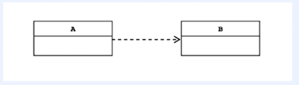

# DI 프레임워크 만들기

# DI 개념 소개 및 장점

- DI(Dependency Injection)
- 의존성 주입
    - 한 객체가 다른 객체를 사용할 때 의존성이 있다고 한다.
        
        
        
    - 런타임 시 의존 관계를 맺는 대상을 외부에서 결정하고 주입해 주는 것
    - 스프링 프레임워크는 DI 기능을 지원해주는 프레임워크다.
- DI 장점
    - 의존성 주입을 인터페이스 기반으로 설계하여 코드가 유연해진다.
        - 느슨한 결합도(loose coupling)
    - 변경에 유연해진다.
        - 결합도가 낮은 객체끼리는 부품을 쉽게 갈아끼울 수 있다.
    - 테스트가 쉬워진다.

# DI 프레임워크 만들기 실습


- BeanFactory를 만드는 것을 목표로 한다.
- 실습 코드
    - BeanFactory
        
        ```java
        package org.example.di;
        
        import java.lang.reflect.Constructor;
        import java.lang.reflect.InvocationTargetException;
        import java.util.*;
        
        public class BeanFactory {
            private final Set<Class<?>> preInstantiatedClass;
            private Map<Class<?>, Object> beans = new HashMap<>();
        
            public BeanFactory(Set<Class<?>> preInstantiatedClass) {
                this.preInstantiatedClass = preInstantiatedClass;
                initialize();
            }
        
            private void initialize() {
                for (Class<?> clazz : preInstantiatedClass) {
                    Object instance = createInstance(clazz);
                    beans.put(clazz, instance);
                }
            }
        
            private Object createInstance(Class<?> clazz) {
                // 생성자
                Constructor<?> constructor = findConstructor(clazz);
        
                // 파라미터
                List<Object> parameters = new ArrayList<>();
                for (Class<?> typeClass : constructor.getParameterTypes()) {
                    // UserService
                    parameters.add(getParameterByClass(typeClass));
                }
        
                // 인스턴스 생성
                try {
                    return constructor.newInstance(parameters.toArray());
                } catch (InstantiationException | IllegalAccessException | InvocationTargetException e) {
                    throw new RuntimeException(e);
                }
        
            }
        
            private Constructor<?> findConstructor(Class<?> clazz) {
                // Inject annotation이 붙은 생성자만 가져오기
                Constructor<?> constructor = BeanFactoryUtils.getInjectedConstructors(clazz);
        
                if (Objects.nonNull(constructor)) {
                    return constructor;
                }
        
                return clazz.getConstructors()[0];
            }
        
            private Object getParameterByClass(Class<?> typeClass) {
                Object instanceBean = getBean(typeClass);
        
                if(Objects.nonNull(instanceBean)) {
                    return instanceBean;
                }
        
                return createInstance(typeClass);
            }
        
            public <T> T getBean(Class<T> requiredType) {
        
                return (T) beans.get(requiredType);
            }
        }
        
        ```
        
    - BeanFactoryUtils
        
        ```java
        package org.example.di;
        
        import org.example.annotation.Inject;
        import org.reflections.ReflectionUtils;
        
        import java.lang.reflect.Constructor;
        import java.util.Set;
        
        public class BeanFactoryUtils {
        
            public static Constructor<?> getInjectedConstructors(Class<?> clazz) {
                // Inject annotation 붙은 생성자만 가져오기
                Set<Constructor> injectedConstructors = ReflectionUtils.getAllConstructors(clazz, ReflectionUtils.withAnnotation(Inject.class));
                if (injectedConstructors.isEmpty()) {
                    return null;
                }
        
                return injectedConstructors.iterator().next();
            }
        }
        
        ```
        
    - BeanFactoryTest
        
        ```java
        package org.example.di;
        
        import org.example.annotation.Controller;
        import org.example.annotation.Service;
        import org.example.controller.UserController;
        import org.junit.jupiter.api.BeforeEach;
        import org.junit.jupiter.api.Test;
        import org.reflections.Reflections;
        
        import java.lang.annotation.Annotation;
        import java.util.HashSet;
        import java.util.Set;
        
        import static org.assertj.core.api.Assertions.assertThat;
        
        class BeanFactoryTest {
            private Reflections reflections;
            private BeanFactory beanFactory;
        
            @BeforeEach
            void setUp() {
                reflections = new Reflections("org.example");
        
                // UserController, UserService
                Set<Class<?>> preInstantiatedClass = getTypesAnnotatedWith(Controller.class, Service.class);
        
                beanFactory = new BeanFactory(preInstantiatedClass);
        
            }
        
            private Set<Class<?>> getTypesAnnotatedWith(Class<? extends Annotation>... annotations) {
                Set<Class<?>> beans = new HashSet<>();
                for (Class<? extends Annotation> annotation: annotations) {
        
                    beans.addAll(reflections.getTypesAnnotatedWith(annotation));
                }
        
                return beans;
            }
        
            @Test
            void diTest() {
                UserController userController = beanFactory.getBean(UserController.class);
        
                assertThat(userController).isNotNull();
                assertThat(userController.getUserService()).isNotNull();
            }
        
        }
        
        ```