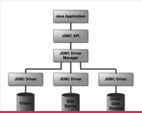

# JDBC 프로그래밍

# JDBC 개념 소개



- JDBC(Java Database COnnectivity)
    - 자바 애플리케이션에서 DB 프로그래밍을 할 수 있도록 도와주는 표준 인터페이스
    - JDBC 인터페이스들을 구현한 구현체들은 각 데이터베이스 벤더 사들이 제공

# DB 커넥션 풀 개념 소개

- DBCP (Database Connection Pool)
    - 미리 일정량의 DB Connection을 생성해서 풀에 저장해 두고 있다가 HTTP 요청에 따라 필요할 때 풀에서 Connection을 가져다 사용하는 기법
    - 스프링 부트 2.0부터는 Default Connection 풀로 HikariCP를 사용한다.
- Connection 풀 사용 시 유의 사항
    - Connection의 사용 주체는 WAS Tharead이므로 Connection 개수는 WAS Thread 수와 함께 고려해야 한다
    - Connection수를 크게 설정하면 메모리 소모가 큰 대신 동시 접속자 수가 많아지더라도 사용자 대기 시간이 상대적으로 줄어들게 되고, 반대로 Connection 개수를 작게 설정하면 메모리 소모는 적은 대신 그만큼 대기시간이 길어질 수 있다.
    - 즉, 적정량의 Connection 객체를 생성해 두어야 한다.
- DataSource
    - Connection 획득하기 위한 표준 인터페이스
    - 실습에서는 HikariCP의 DataSource 사용한다.

# JDBC 프로그래밍 실습

- 실습 코드
    - `UserDaoTest`
        
        ```java
        package org.example;
        
        import org.junit.jupiter.api.BeforeEach;
        import org.junit.jupiter.api.Test;
        import org.springframework.core.io.ClassPathResource;
        import org.springframework.jdbc.datasource.init.DatabasePopulatorUtils;
        import org.springframework.jdbc.datasource.init.ResourceDatabasePopulator;
        
        import java.sql.SQLException;
        
        import static org.assertj.core.api.Assertions.assertThat;
        
        public class UserDaoTest {
        
            @BeforeEach
            void setUp() {
        
                ResourceDatabasePopulator populator = new ResourceDatabasePopulator();
                populator.addScript(new ClassPathResource("db_schema.sql"));
                DatabasePopulatorUtils.execute(populator, ConnectionManager.getDataSource());
            }
        
            @Test
            void createTest() throws SQLException {
        
                UserDao userDao = new UserDao();
        
                userDao.create(new User("keaunsol", "password", "name", "email"));
        
                User user = userDao.findByUserId("keaunsol");
                assertThat(user).isEqualTo(new User("keaunsol", "password", "name", "email"));
        
            }
        }
        
        ```
        
    - `ConnectionManager`
        
        ```java
        package org.example;
        
        import com.zaxxer.hikari.HikariDataSource;
        
        import javax.sql.DataSource;
        
        public class ConnectionManager {
            public static DataSource getDataSource() {
        
                HikariDataSource hikariDataSource = new HikariDataSource();
                hikariDataSource.setDriverClassName("org.h2.Driver");
                hikariDataSource.setJdbcUrl("jdbc:h2:mem://localhost/~/jdbc-practice;MODE=MySQL;DB_CLOSE_DELAY=-1");
                hikariDataSource.setUsername("sa");
                hikariDataSource.setPassword("");
        
                return hikariDataSource;
            }
        }
        
        ```
        
    - `User`
        
        ```java
        package org.example;
        
        import java.util.Objects;
        
        public class User {
            private final String userId;
            private final String password;
            private final String name;
            private final String email;
        
            public User(String userId, String password, String name, String email) {
                this.userId = userId;
                this.password = password;
                this.name = name;
                this.email = email;
            }
        
            public String getUserId() {
                return userId;
            }
        
            public String getPassword() {
                return password;
            }
        
            public String getName() {
                return name;
            }
        
            public String getEmail() {
                return email;
            }
        
            @Override
            public boolean equals(Object o) {
                if (this == o) return true;
                if (o == null || getClass() != o.getClass()) return false;
                User user = (User) o;
                return Objects.equals(userId, user.userId) && Objects.equals(password, user.password) && Objects.equals(name, user.name) && Objects.equals(email, user.email);
            }
        
            @Override
            public int hashCode() {
                return Objects.hash(userId, password, name, email);
            }
        }
        ```
        
    - `UserDao`
        
        ```java
        package org.example;
        
        import java.sql.*;
        
        public class UserDao {
        
            private Connection getConnection() {
                String url = "jdbc:h2:mem://localhost/~/jdbc-practice;MODE=MySQL;DB_CLOSE_DELAY=-1";
                String id = "sa";
                String pw = "";
        
                try {
                    Class.forName("org.h2.Driver");
        
                    return DriverManager.getConnection(url, id, pw);
                } catch (Exception e) {
                    return null;
                }
        
            }
            public void create(User user) throws SQLException {
                Connection con = null;
                PreparedStatement pstmt = null;
        
                try {
        
                    con = getConnection();
                    String sql = "INSERT INTO USERS VALUES (?, ?, ?, ?)";
        
                    pstmt = con.prepareStatement(sql);
                    pstmt.setString(1, user.getUserId());
                    pstmt.setString(2, user.getPassword());
                    pstmt.setString(3, user.getName());
                    pstmt.setString(4, user.getEmail());
        
                    pstmt.executeUpdate();
        
                } finally {
        
                    if (pstmt != null) {
                        pstmt.close();
                    }
        
                    if (con != null) {
                        con.close();
                    }
                }
            }
        
            public User findByUserId(String id) throws SQLException {
        
                Connection con = null;
                PreparedStatement pstmt = null;
                ResultSet rs = null;
        
                try {
        
                    con = getConnection();
                    String sql = "SELECT userId, password, name, email FROM USERS WHERE userId = ?";
                    pstmt = con.prepareStatement(sql);
                    pstmt.setString(1, id);
        
                    rs = pstmt.executeQuery();
        
                    User user = null;
                    if (rs.next()) {
        
                        user = new User(
                                rs.getString("userId"),
                                rs.getString("password"),
                                rs.getString("name"),
                                rs.getString("email")
                                );
                    }
        
                    return user;
                } finally {
        
                    if (rs != null) {
                        rs.close();
                    }
        
                    if (pstmt != null) {
                        pstmt.close();
                    }
        
                    if (con != null) {
                        con.close();
                    }
                }
        
            }
        }
        
        ```
        

# 실습한 JDBC 코드 리팩토링 및 DB 커넥션 풀 적용

- 실습 코드
    - `ConnectionManager`
        
        ```java
        package org.example;
        
        import com.zaxxer.hikari.HikariDataSource;
        
        import javax.sql.DataSource;
        import java.sql.Connection;
        import java.sql.SQLException;
        
        public class ConnectionManager {
        
            private static final String DB_DRIVER = "org.h2.Driver";
            private static final String DB_URL = "jdbc:h2:mem://localhost/~/jdbc-practice;MODE=MySQL;DB_CLOSE_DELAY=-1";
            private static final String USER_NAME = "sa";
            private static final String PASSWORD = "";
            private static final int MAX_POOL_SIZE = 40;
            private static final DataSource ds;
        
            static {
        
                HikariDataSource hikariDataSource = new HikariDataSource();
        
                hikariDataSource.setDriverClassName(DB_DRIVER);
                hikariDataSource.setJdbcUrl(DB_URL);
                hikariDataSource.setUsername(USER_NAME);
                hikariDataSource.setPassword(PASSWORD);
                hikariDataSource.setMaximumPoolSize(MAX_POOL_SIZE);
                hikariDataSource.setMinimumIdle(MAX_POOL_SIZE);
        
                ds = hikariDataSource;
            }
        
            public static Connection getConnection() {
        
                try {
        
                    return ds.getConnection();
                } catch (SQLException e) {
        
                    throw new IllegalStateException(e);
                }
            }
        
            public static DataSource getDataSource() {
        
                return ds;
            }
        
        }
        
        ```
        
    - `JdbcTemplate`
        
        ```java
        package org.example;
        
        import java.sql.Connection;
        import java.sql.PreparedStatement;
        import java.sql.ResultSet;
        import java.sql.SQLException;
        
        public class JdbcTemplate {
        
            public void executeUpdate(String sql, PreparedStatementSetter pss) throws SQLException {
                Connection con = null;
                PreparedStatement pstmt = null;
        
                try {
        
                    con = ConnectionManager.getConnection();
                    pstmt = con.prepareStatement(sql);
                    pss.setter(pstmt);
        
                    pstmt.executeUpdate();
        
                } finally {
        
                    if (pstmt != null) {
                        pstmt.close();
                    }
        
                    if (con != null) {
                        con.close();
                    }
                }
            }
        
            public Object executeQuery(String sql, PreparedStatementSetter pss, RowMapper rowMapper) throws SQLException {
        
                Connection con = null;
                PreparedStatement pstmt = null;
                ResultSet rs = null;
        
                try {
        
                    con = ConnectionManager.getConnection();
                    pstmt = con.prepareStatement(sql);
                    pss.setter(pstmt);
                    rs = pstmt.executeQuery();
        
                    Object user = null;
                    if (rs.next()) {
                        return rowMapper.map(rs);
                    }
        
                    return user;
                } finally {
        
                    if (rs != null) {
                        rs.close();
                    }
        
                    if (pstmt != null) {
                        pstmt.close();
                    }
        
                    if (con != null) {
                        con.close();
                    }
                }
        
            }
        
        }
        
        ```
        
    - `PreparedStatementSetter`
        
        ```java
        package org.example;
        
        import java.sql.PreparedStatement;
        import java.sql.SQLException;
        
        public interface PreparedStatementSetter {
        
            void setter(PreparedStatement pstmt) throws SQLException;
        }
        
        ```
        
    - `RowMapper`
        
        ```java
        package org.example;
        
        import java.sql.ResultSet;
        import java.sql.SQLException;
        
        public interface RowMapper {
        
            Object map(ResultSet resultSet) throws SQLException;
        
        }
        
        ```
        
    - `UserDao`
        
        ```java
        package org.example;
        
        import java.sql.*;
        
        public class UserDao {
        
            public void create2(User user) throws SQLException {
        
                JdbcTemplate jdbcTemplate = new JdbcTemplate();
                String sql = "INSERT INTO USERS VALUES(?, ?, ?, ?)";
        
                jdbcTemplate.executeUpdate(sql, pstmt -> {
                    pstmt.setString(1, user.getUserId());
                    pstmt.setString(2, user.getPassword());
                    pstmt.setString(3, user.getName());
                    pstmt.setString(4, user.getEmail());
                });
            }
        
            public User findByUserId2(String id) throws SQLException {
        
                JdbcTemplate jdbcTemplate = new JdbcTemplate();
                String sql = "SELECT userId, password, name, email FROM USERS WHERE userId = ?";
                return (User) jdbcTemplate.executeQuery(sql, pstmt -> pstmt.setString(1, id), rs -> new User(
                        rs.getString("userId"),
                        rs.getString("password"),
                        rs.getString("name"),
                        rs.getString("email")
                ));
            }
        }
        
        ```