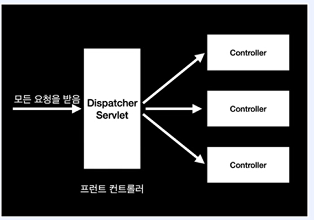

# MVC 프레임워크 만들기

# 리플렉션 API 개념 소개 및 실습

- Relection
    - 힙 영역에 로드되어 있는 클래스 타입의 객체를 통해 필드 / 메서드/ 생성자를 접근 제어자와 상관 없이 사용할 수 있도록 지원하는 API
    - 컴파일 시점이 아닌 런타임 시점에 동적으로 특정 클래스의 정보를 추출해낼 수 있는 프로그래밍 기법
    - 주로 프레임워크 또는 라이브러리 개발 시 사용된다.
    - [https://www.baeldung.com/reflections-library](https://www.baeldung.com/reflections-library)
- Reflection 사용하는 프레임워크/라이브러리
    - Spring 프레임워크 (ex; DI)
    - Test 프레임워크 (ex; JUnit)
    - JSON Serialization/Deserialization 라이브러리 (ex; Jackson)
    - 등등
- 실습 과정
    - @Controller Annotation이 설정되어 있는 모든 클래스를 찾아 출력
    - 실습 코드
        - `ReflectionTest`
            
            ```java
            package org.example;
            
            import org.example.annotation.Controller;
            import org.example.annotation.Service;
            import org.example.model.User;
            import org.junit.jupiter.api.Test;
            import org.reflections.Reflections;
            import org.slf4j.Logger;
            import org.slf4j.LoggerFactory;
            
            import java.lang.annotation.Annotation;
            import java.util.Arrays;
            import java.util.HashSet;
            import java.util.List;
            import java.util.Set;
            import java.util.stream.Collectors;
            
            import static org.assertj.core.api.Assertions.assertThat;
            /**
             */
            public class ReflectionTest {
            
                private static final Logger logger = LoggerFactory.getLogger(ReflectionTest.class);
                @Test
                void controllerScan() {
                    logger.debug("beans: [{}]", getTypesAnnotationWith(List.of(Controller.class, Service.class)));
                }
            
                @Test
                void showClass() {
                    Class<User> clazz = User.class;
            
                    logger.debug(clazz.getName());
            
                    logger.debug("User all declared fields: [{}]", Arrays.stream(clazz.getDeclaredFields()).collect(Collectors.toList()));
                    logger.debug("User all declared constructors : [{}]", Arrays.stream(clazz.getDeclaredConstructors()).collect(Collectors.toList()));
                    logger.debug("User all declared methods: [{}]", Arrays.stream(clazz.getDeclaredMethods()).collect(Collectors.toList()));
            
                }
            
                @Test
                void load() throws ClassNotFoundException {
            
                    // 힙 영역에 로드되어 있는 클래스 타입 객체 가져오기 방법 1
                    Class<User> clazz = User.class;
            
                    // 방법 2
                    User user = new User("id", "name");
                    Class<? extends User> clazz2 = user.getClass();
            
                    // 방법 3
                    Class<?> clazz3 = Class.forName("org.example.model.User");
            
                    logger.debug("clazz: [{}]", clazz);
                    logger.debug("clazz2: [{}]", clazz2);
                    logger.debug("clazz3: [{}]", clazz3);
            
                    assertThat(clazz.equals(clazz2)).isTrue();
                    assertThat(clazz2 == clazz3).isTrue();
                    assertThat(clazz == clazz3).isTrue();
                }
            
                private static Set<Class<?>> getTypesAnnotationWith(List<Class<? extends Annotation>> annotations) {
            
                    // Scan 범위 설정
                    Reflections reflections = new Reflections("org.example");
            
                    Set<Class<?>> beans = new HashSet<>();
                    annotations.forEach(annotation -> beans.addAll(reflections.getTypesAnnotatedWith(annotation)));
            
                    return beans;
                }
            
            }
            
            ```
            
        - `Controller`
            
            ```java
            package org.example.annotation;
            
            import java.lang.annotation.ElementType;
            import java.lang.annotation.Retention;
            import java.lang.annotation.RetentionPolicy;
            import java.lang.annotation.Target;
            
            // 대상 타겟
            @Target({ElementType.TYPE})
            // 유지 기간
            @Retention(RetentionPolicy.RUNTIME)
            public @interface Controller {
            }
            
            ```
            
        - `RequestMapping`
            
            ```java
            package org.example.annotation;
            
            import java.lang.annotation.ElementType;
            import java.lang.annotation.Retention;
            import java.lang.annotation.RetentionPolicy;
            import java.lang.annotation.Target;
            
            @Target({ElementType.TYPE, ElementType.METHOD})
            @Retention(RetentionPolicy.RUNTIME)
            public @interface RequestMapping {
                String value() default "";
            
                RequestMethod[] method() default {};
            
            }
            
            ```
            
        - `HomeController`
            
            ```java
            package org.example.controller;
            
            import org.example.annotation.Controller;
            import org.example.annotation.RequestMapping;
            import org.example.annotation.RequestMethod;
            
            import javax.servlet.http.HttpServletRequest;
            import javax.servlet.http.HttpServletResponse;
            
            @Controller
            public class HomeController {
            
                @RequestMapping(value = "/", method = RequestMethod.GET)
                public String home(HttpServletRequest request, HttpServletResponse response) {
            
                    return "home";
                }
            }
            
            ```
            

# 프런트 컨트롤러 패턴 개념 소개

- 프런트 컨트롤러 패턴
    - 모든 요청을 단일 handler(처리기)에서 처리하도록 하는 패턴
    - 스프링 웹 MVC 프레임워크의 DispatcherServlet(프런트 컨트롤러 역할)이 프런트 컨트롤러 패턴으로 구현되어 있다.
        
        
        
- Forward
    - 서블릿에서 클라이언트(웹 브라우저)를 거치지 않고 바로 다른 서블릿(또는 JSP)에게 요청하는 방식
    - Forward 방식은 서버 내부에서 일어나는 요청이기 때문에 HttpServletRequest, HttpServletResponse 객체가 새로 생성되지 않는다. (공유됨)
        
        ```java
        RequestDispatcher dispatcher = request.getRequestDispatcher(”포워드 할 서블릿 또는 JSP”);
        dispatcher.forward(request, response)
        ```
        
- Redirect
    - 서블릿이 클라이언트(웹 브라우저)를 다시 거쳐 다른 서블릿(또는 JSP)에게 요청하는 방식
    - Redirect 방식은 클라이언트로부터 새로운 요청이기 때문에 새로운 HttpServletRequest, HttpServletResponse 객체가 생성됨
    - HttpServletResponse 객체의 sendRedirect() 이용한다.
- Forward vs Redirect
    
    
    

# 프런트 컨트롤러 패턴 실습

- 실습 코드
    - `WebApplicationServer`
        
        ```java
        package org.example;
        
        import org.apache.catalina.startup.Tomcat;
        import org.slf4j.Logger;
        import org.slf4j.LoggerFactory;
        
        import java.io.File;
        
        public class WebApplicationServer {
            private static final Logger log = LoggerFactory.getLogger(WebApplicationServer.class);
        
            public static void main(String[] args) throws Exception {
                String webappDirLocation = "webapps/";
                Tomcat tomcat = new Tomcat();
                tomcat.setPort(8080);
                tomcat.getConnector();
        
                tomcat.addWebapp("", new File(webappDirLocation).getAbsolutePath());
                log.info("configuring app with basedir: {}", new File(webappDirLocation).getAbsolutePath());
        
                tomcat.start();
                tomcat.getServer().await();
            }
        }
        ```
        
    - `DispatcherServlet`
        
        ```java
        package org.example.mvc;
        
        import org.example.mvc.controller.Controller;
        import org.slf4j.Logger;
        import org.slf4j.LoggerFactory;
        
        import javax.servlet.RequestDispatcher;
        import javax.servlet.ServletException;
        import javax.servlet.annotation.WebServlet;
        import javax.servlet.http.HttpServlet;
        import javax.servlet.http.HttpServletRequest;
        import javax.servlet.http.HttpServletResponse;
        import java.io.IOException;
        
        @WebServlet("/")
        public class DispatcherServlet extends HttpServlet {
            private static final Logger logger = LoggerFactory.getLogger(DispatcherServlet.class);
            private RequestMappingHandlerMapping requestMappingHandlerMapping;
        
            @Override
            public void init() throws ServletException {
                requestMappingHandlerMapping = new RequestMappingHandlerMapping();
                requestMappingHandlerMapping.init();
            }
        
            @Override
            protected void service(HttpServletRequest request, HttpServletResponse response) throws ServletException, IOException {
        
                logger.info("[DispatcherServlet] service started");
        
                try {
        
                    Controller handler = requestMappingHandlerMapping.findHandler(request.getRequestURI());
                    String viewName = handler.handleRequest(request, response);
        
                    RequestDispatcher requestDispatcher = request.getRequestDispatcher(viewName);
                    requestDispatcher.forward(request, response);
        
                } catch (Exception e) {
        
                    logger.info("exception occurred: [{}]", e.getMessage(), e);
                    throw new ServletException();
        
                }
        
            }
        
        }
        
        ```
        
    - `RequestMappingHandlerMapping`
        
        ```java
        package org.example.mvc;
        
        import org.example.mvc.controller.Controller;
        import org.example.mvc.controller.HomeController;
        
        import java.util.HashMap;
        import java.util.Map;
        
        public class RequestMappingHandlerMapping {
            private Map<String, Controller> mappings = new HashMap<>();
            void init() {
                mappings.put("/", new HomeController());
            }
        
            public Controller findHandler(String uriPath) {
                return mappings.get(uriPath);
            }
        }
        
        ```
        
    - `Controller`
        
        ```java
        package org.example.mvc.controller;
        
        import javax.servlet.http.HttpServletRequest;
        import javax.servlet.http.HttpServletResponse;
        
        public interface Controller {
            String handleRequest(HttpServletRequest request, HttpServletResponse response) throws Exception;
        
        }
        
        ```
        
    - `HomeController`
        
        ```java
        package org.example.mvc.controller;
        
        import javax.servlet.http.HttpServletRequest;
        import javax.servlet.http.HttpServletResponse;
        
        public class HomeController implements Controller {
            @Override
            public String handleRequest(HttpServletRequest request, HttpServletResponse response) throws Exception {
                return "home.jsp";
            }
        }
        
        ```
        

# MVC 프레임워크 만들기 개념 소개


- Annotation 기반 MVC 프레임워크
    - DispatcherServlet
    - AnnotationHandlerMapping
    - HandlerAdapter
    - ViewResolver

# MVC 프레임워크 만들기 실습

- 실습 코드
    - `AnnotationHandler`
        
        ```java
        package org.example.mvc;
        
        import javax.servlet.http.HttpServletRequest;
        import javax.servlet.http.HttpServletResponse;
        import java.lang.reflect.Constructor;
        import java.lang.reflect.Method;
        
        public class AnnotationHandler {
        
            private final Class<?> clazz;
            private final Method targetMethod;
        
            public AnnotationHandler(Class<?> clazz, Method targetMethod) {
                this.clazz = clazz;
                this.targetMethod = targetMethod;
            }
        
            public String handle(HttpServletRequest request, HttpServletResponse response) throws Exception {
                Constructor<?> declaredConstructor = clazz.getDeclaredConstructor();
                Object handler = declaredConstructor.newInstance();
        
                return (String) targetMethod.invoke(handler, request, response);
            }
        }
        
        ```
        
    - `AnnotationHandlerAdapter`
        
        ```java
        package org.example.mvc;
        
        import org.example.mvc.view.ModelAndView;
        
        import javax.servlet.http.HttpServletRequest;
        import javax.servlet.http.HttpServletResponse;
        
        public class AnnotationHandlerAdapter implements HandlerAdapter{
            @Override
            public boolean supports(Object handler) {
                return handler instanceof AnnotationHandler;
            }
        
            @Override
            public ModelAndView handle(HttpServletRequest request, HttpServletResponse response, Object handler) throws Exception {
                String viewName = ((AnnotationHandler) handler).handle(request, response);
                return new ModelAndView(viewName);
            }
        }
        
        ```
        
    - `AnnotationHandlerMapping`
        
        ```java
        package org.example.mvc;
        
        import org.example.mvc.annotation.Controller;
        import org.example.mvc.annotation.RequestMapping;
        import org.example.mvc.controller.RequestMethod;
        import org.reflections.Reflections;
        
        import java.util.Arrays;
        import java.util.HashMap;
        import java.util.Map;
        import java.util.Set;
        
        public class AnnotationHandlerMapping implements HandlerMapping{
            private final Object[] basePackage;
            private Map<HandlerKey, AnnotationHandler> handlers = new HashMap<>();
        
            public AnnotationHandlerMapping(Object... basePackage) {
                this.basePackage = basePackage;
            }
        
            public void initialize() {
                Reflections reflections = new Reflections(basePackage);
        
                Set<Class<?>> clazzWithControllerAnnotation = reflections.getTypesAnnotatedWith(Controller.class);
        
                clazzWithControllerAnnotation.forEach(clazz ->
                        Arrays.stream(clazz.getDeclaredMethods()).forEach(declaredMethod -> {
                            RequestMapping requestMapping = declaredMethod.getDeclaredAnnotation(RequestMapping.class);
        
                            Arrays.stream(getRequestMethod(requestMapping))
                                    .forEach(requestMethod -> handlers.put(
                                            new HandlerKey(requestMethod, requestMapping.value()), new AnnotationHandler(clazz, declaredMethod)
                                    ));
                        }));
            }
        
            private RequestMethod[] getRequestMethod(RequestMapping requestMapping) {
                return requestMapping.method();
            }
        
            @Override
            public Object findHandler(HandlerKey handlerKey) {
                return handlers.get(handlerKey);
            }
        }
        
        ```
        
    - `DispatcherServlet`
        
        ```java
        package org.example.mvc;
        
        import org.example.mvc.controller.RequestMethod;
        import org.example.mvc.view.JspViewResolver;
        import org.example.mvc.view.ModelAndView;
        import org.example.mvc.view.View;
        import org.example.mvc.view.ViewResolver;
        import org.slf4j.Logger;
        import org.slf4j.LoggerFactory;
        
        import javax.servlet.ServletException;
        import javax.servlet.annotation.WebServlet;
        import javax.servlet.http.HttpServlet;
        import javax.servlet.http.HttpServletRequest;
        import javax.servlet.http.HttpServletResponse;
        import java.io.IOException;
        import java.util.Collections;
        import java.util.List;
        
        @WebServlet("/")
        public class DispatcherServlet extends HttpServlet {
            private static final Logger logger = LoggerFactory.getLogger(DispatcherServlet.class);
            private List<HandlerMapping> handlerMappings;
            private List<HandlerAdapter> handlerAdapters;
            private List<ViewResolver> viewResolvers;
        
            @Override
            public void init() throws ServletException {
        
                RequestMappingHandlerMapping rmhm = new RequestMappingHandlerMapping();
                rmhm.init();
        
                AnnotationHandlerMapping ahm = new AnnotationHandlerMapping("org.example");
                ahm.initialize();
        
                handlerMappings = List.of(rmhm, ahm);
                handlerAdapters = List.of(new SimpleControllerHandlerAdapter(), new AnnotationHandlerAdapter());
                viewResolvers = Collections.singletonList(new JspViewResolver());
            }
        
            @Override
            protected void service(HttpServletRequest request, HttpServletResponse response) throws ServletException, IOException {
        
                logger.info("[DispatcherServlet] service started");
                String requestURI = request.getRequestURI();
                RequestMethod requestMethod = RequestMethod.valueOf(request.getMethod());
        
                try {
        
                    Object handler = handlerMappings.stream()
                                    .filter(ha -> ha.findHandler(new HandlerKey(requestMethod, requestURI)) != null)
                                    .map(ha -> ha.findHandler(new HandlerKey(requestMethod, requestURI)))
                                    .findFirst()
                                    .orElseThrow(() -> new ServletException("No Handler for [" + requestMethod + ", " + requestURI + "]"));
        
                    HandlerAdapter handlerAdapter = handlerAdapters.stream()
                            .filter(ha -> ha.supports(handler))
                            .findFirst()
                            .orElseThrow(() -> new ServletException("No adapter for handler [" + handler + "]"));
        
                    ModelAndView modelAndView = handlerAdapter.handle(request, response, handler);
        
                    for (ViewResolver viewResolver : viewResolvers) {
                        View view = viewResolver.resolveView(modelAndView.getViewName());
                        view.render(modelAndView.getModel(), request, response);
                    }
        
                } catch (Exception e) {
        
                    logger.info("exception occurred: [{}]", e.getMessage(), e);
                    throw new ServletException();
        
                }
        
            }
        
        }
        ```
        
    - `RequestMappingHandlerMapping`
        
        ```java
        package org.example.mvc;
        
        import org.example.mvc.controller.*;
        
        import java.util.HashMap;
        import java.util.Map;
        
        public class RequestMappingHandlerMapping implements HandlerMapping {
            private Map<HandlerKey, Controller> mappings = new HashMap<>();
            void init() {
        
        //        mappings.put(new HandlerKey(RequestMethod.GET, "/"), new HomeController());
                mappings.put(new HandlerKey(RequestMethod.GET, "/users"), new UserListController());
                mappings.put(new HandlerKey(RequestMethod.POST, "/users"), new UserCreateController());
                mappings.put(new HandlerKey(RequestMethod.GET, "/user/form"), new ForwardController("/user/form"));
            }
        
            public Controller findHandler(HandlerKey handlerKey) {
                return mappings.get(handlerKey);
            }
        }
        
        ```