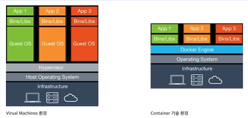

# 개발 환경 구성하기

# 웹 프로젝트 환경 구성

- gradle 환경 구성
    
    ```
    plugins {
        id 'java'
    }
    
    group = 'org.example'
    version = '1.0-SNAPSHOT'
    
    repositories {
        mavenCentral()
    }
    
    dependencies {
    
        implementation 'org.apache.tomcat.embed:tomcat-embed-core:8.5.42'
        implementation 'org.apache.tomcat.embed:tomcat-embed-jasper:8.5.42'
    
        implementation 'javax.servlet:jstl:1.2'
        implementation 'javax.servlet:javax.servlet-api:4.0.1'
    
        implementation 'org.reflections:reflections:0.9.12'
    
        implementation 'ch.qos.logback:logback-classic:1.2.3'
    
        testImplementation 'org.junit.jupiter:junit-jupiter-api:5.8.1'
        testRuntimeOnly 'org.junit.jupiter:junit-jupiter-engine:5.8.1'
    }
    
    test {
        useJUnitPlatform()
    }
    ```
    
- WebApplicationServer
    
    ```java
    package org.example;
    
    import org.apache.catalina.LifecycleException;
    import org.apache.catalina.startup.Tomcat;
    import org.slf4j.Logger;
    import org.slf4j.LoggerFactory;
    import java.io.File;
    
    public class WebApplicationServer {
    
        private static final Logger log = LoggerFactory.getLogger(WebApplicationServer.class);
    
        public static void main(String[] args) throws LifecycleException {
    
            String webappDirLocation = "webapps/";
            Tomcat tomcat = new Tomcat();
            tomcat.setPort(8088);
    
            tomcat.addWebapp("/", new File(webappDirLocation).getAbsolutePath());
            log.info("configuring app with basedir: {}", new File("./" + webappDirLocation).getAbsolutePath());
    
            tomcat.start();
            tomcat.getServer().await();
        }
    }
    ```
    
- 주의할 점 : Project Structure → Modules > main/test의 Paths를
    - C:\Users\knsol\IdeaProjects\mvc-practice\webapps\WEB-INF\classes
    - C:\Users\knsol\IdeaProjects\mvc-practice\webapps\WEB-INF\test\classes
- 형식으로 수정 할 것. 이는 tomcat의 권장 디렉터리 설정으로 인해 webapps\WEB-INF\를 필요로 하기 때문이다.

# 도커 및 도커 컴포즈 소개

- 도커란 컨테이너 기반의 가상화 플랫폼이다
- 가상화로는 컨테이너 기반과 하이퍼바이저 기반의 가상화(OS 가상화)가 있다.
    
    
    
- 도커 허브란 도커에서 제공하는 이미지 저장소이다.
- 도커 컴포즈란 다중 컨테이너를 정의하고 실행하기 위한 도구다. YAML 파일을 사용하여 다중 컨테이너를 구성한다.

# 도커를 이용한 환경 구성하기

- Docker 설치 및 mysql pull
    - docker pull mysql:latest
- docker로 mysql 실행
    - docker run --name mysql-keaunsol-container -e MYSQL_ROOT_PASSWORD=test -d -p 3306:3306 mysql:latest
- docker 실행 확인
    - docker ps
        
        
        
- docker 컨테이너(mysql) 접속
    - docker exec -it mysql-keaunsol-container bash
    - mysql -u root -p
        
        