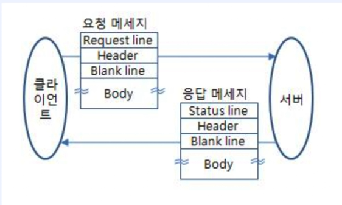

# 웹 애플리케이션의 이해

# 개념 다지기

- Step 1 : 사용자 요청을 메인 Thread가 처리하도록 한다.
- Step 2 : 사용자 요청이 들어올 때마다 Thread를 새로 생성해서 사용자 요청을 처리하도록 한다.
- Step 3 : Thread Pool을 적용해 안정적인 서비스가 가능하도록 한다.
- HTTP
    - 서버와 클라이언트가 웹에서 데이터를 주고받기 위한 프로토콜(규약)
        - HTTP/1.1, HTTP/2는 TCP 기반 위에서 동작
        - HTTP/3는 UDP 기반 위에서 동작
        
        
        
    - HTTP의 특징
        - 클라이언트 - 서버 모델
        - 무상태 프로토콜(Stateless)
            - 서버가 클라이언트 상태를 유지하지 않음
            - 해결책 : Keep-Alive 속성 사용
                - 단, Keep-Alive는 잘못 사용할 경우 성능 저하의 원인이 되기도 한다. (Thread 부족)
                
                
                
        - 비 연결성(Connectionless)
            - 서버가 클라이언트 요청에 대해 응답을 마치면 맺었던 연결을 끊어 버리는 속성
            - 해결책 : 쿠키(클라이언트에 정보 저장), 세션(서버에 정보 저장), JWT
    - HTTP는 기본적으로 웹 상에서 불특정 다수와 통신하기 위해 설계된 프로토콜이다.
        - 이 때 서버가 다수의 클라이언트와 상태, 연결을 유지할 경우 리소스 낭비가 심해진다.
        - 이를 위해 상태와 연결을 유지하지 않는 것.
    - HTTP 요청 메소드
        - GET, POST, PUT, DELETE 등
    - HTTP 응답 코드
        - 2xx(성공), 3xx(리다이렉션), 4xx(클라이언트 에러), 5xx(서버 에러) 등
    - HTTP 헤더
        - Content-type, Accept, Cookie, Set-Cookie, Authorization

# 계산기 웹 프로그램 구현하기 - Step 1

- Step 1 : 사용자 요청을 메인 Thread가 처리하도록 한다.
- 실습 코드
    - `CustomWebApplicationServer`
        
        ```java
        package org.example;
        
        import org.example.calculator.domain.Calculator;
        import org.example.calculator.domain.PositiveNumber;
        import org.slf4j.Logger;
        import org.slf4j.LoggerFactory;
        
        import java.io.*;
        import java.net.ServerSocket;
        import java.net.Socket;
        import java.nio.charset.StandardCharsets;
        
        public class CustomWebApplicationServer {
            private final int port;
            private static final Logger logger = LoggerFactory.getLogger(CustomWebApplicationServer.class);
        
            public CustomWebApplicationServer(int port) {
                this.port = port;
            }
        
            public void start() throws IOException {
                try (ServerSocket serverSocket = new ServerSocket(port)) {
        
                    logger.info("[CustomWebApplicationServer] started {} port.", port);
        
                    Socket clientSocket;
                    logger.info("[CustomWebApplicationServer] waiting for client.");
        
                    while ((clientSocket = serverSocket.accept()) != null) {
                        logger.info("[CustomWebApplicationServer] client connected!");
        
                        /*
                         * Step1 - 사용자 요청을 메인 Thread가 처리하도록 한다.
                         */
        
                        try(InputStream in = clientSocket.getInputStream(); OutputStream out = clientSocket.getOutputStream()) {
        
                            BufferedReader br = new BufferedReader(new InputStreamReader(in, StandardCharsets.UTF_8));
                            DataOutputStream dos = new DataOutputStream(out);
        
                            /*
                                HttpRequest
                                    - RequestLine(Get /calculate?operand1=11&operator=*&operand2=55 HTTP/1.1)
                                        - HttpMethod
                                        - path
                                        - queryString
                                    - Header
                                    - Body
                             */
        
                            HttpRequest httpRequest = new HttpRequest(br);
        
                            if (httpRequest.isGetRequest() && httpRequest.matchPath("/calculate")) {
                                QueryStrings queryStrings = httpRequest.getQueryStrings();
        
                                int operand1 = Integer.parseInt(queryStrings.getValue("operand1"));
                                String operator = queryStrings.getValue("operator");
                                int operand2 = Integer.parseInt(queryStrings.getValue("operand2"));
                                int result = Calculator.calculate(new PositiveNumber(operand1), operator, new PositiveNumber(operand2));
                                byte[] body = String.valueOf(result).getBytes();
        
                                HttpResponse response = new HttpResponse(dos);
                                response.response200Header("application/json", body.length);
                                response.responseBody(body);
        
                            }
                        }
                    }
                }
            }
        }
        
        ```
        
    - `HttpRequest`
        
        ```java
        package org.example;
        
        import java.io.BufferedReader;
        import java.io.IOException;
        
        public class HttpRequest {
            private final RequestLine requestLine;
        //    private final HttpHeaders httpHeaders;
        //    private final Body body;
        
            public HttpRequest(BufferedReader br) throws IOException {
                this.requestLine = new RequestLine(br.readLine());
            }
        
            public boolean isGetRequest() {
                return requestLine.isGetRequest();
            }
            public boolean matchPath(String path) {
                return requestLine.matchPath(path);
            }
        
            public QueryStrings getQueryStrings() {
                return requestLine.getQueryStrings();
            }
        }
        
        ```
        
    - `HttpResponse`
        
        ```java
        package org.example;
        
        import org.slf4j.Logger;
        import org.slf4j.LoggerFactory;
        
        import java.io.DataOutputStream;
        import java.io.IOException;
        
        public class HttpResponse {
            private static final Logger logger = LoggerFactory.getLogger(HttpResponse.class);
        
            private final DataOutputStream dos;
        
            public HttpResponse(DataOutputStream dos) {
                this.dos = dos;
            }
        
            public void response200Header(String contentType, int lengthOfBodyContent) {
                try {
                    dos.writeBytes("HTTP/1.1 200 OK \r\n");
                    dos.writeBytes("Content-Type: " + contentType + ";charset=utf-8\r\n");
                    dos.writeBytes("Content-Length: " + lengthOfBodyContent + "\r\n");
                    dos.writeBytes("\r\n");
                } catch (IOException e) {
                    logger.error(e.getMessage());
                }
            }
        
            public void responseBody(byte[] body) {
                try {
                    dos.write(body, 0, body.length);
                    dos.flush();
                } catch (IOException e) {
                    logger.error(e.getMessage());
                }
            }
        }
        ```
        
    - `Main`
        
        ```java
        package org.example;
        
        import java.io.IOException;
        
        public class Main {
            public static void main(String[] args) throws IOException {
        
                new CustomWebApplicationServer(8080).start();
            }
        }
        
        ```
        
    - `QueryString`
        
        ```java
        package org.example;
        
        public class QueryString {
        
            private final String value;
            private final String key;
        
            public QueryString(String key, String value) {
                this.key = key;
                this.value = value;
            }
        
            public boolean exists(String key) {
                return this.key.equals(key);
            }
        
            public String getValue() {
                return this.value;
            }
        }
        
        ```
        
    - `QueryStrings`
        
        ```java
        package org.example;
        
        import java.util.ArrayList;
        import java.util.Arrays;
        import java.util.List;
        
        public class QueryStrings {
        
            private List<QueryString> queryStrings = new ArrayList<>();
        
            public QueryStrings(String queryStringLine) {
        
                String[] queryStringTokens = queryStringLine.split("&");
                Arrays.stream(queryStringTokens)
                        .forEach(queryString -> {
                            String[] values = queryString.split("=");
                            if (values.length != 2) {
                                throw new IllegalArgumentException("잘못된 QueryString 포맷을 가진 문자열입니다.");
                            }
        
                            queryStrings.add(new QueryString(values[0], values[1]));
                        });
            }
        
            public String getValue(String key) {
                return this.queryStrings.stream()
                        .filter(queryString -> queryString.exists(key))
                        .map(QueryString::getValue)
                        .findFirst()
                        .orElse(null);
            }
        }
        
        ```
        
    - `RequestLine`
        
        ```java
        package org.example;
        
        import java.util.Objects;
        
        public class RequestLine {
            private final String method;       // GET
            private final String urlPath;      // /calculate
            private QueryStrings queryStrings;        // operand1=11&operator=*&operand2=55
        
            public RequestLine(String method, String urlPath, String queryString) {
                this.method = method;
                this.urlPath = urlPath;
                this.queryStrings = new QueryStrings(queryString);
            }
        
            public RequestLine(String requestLine) {
                String[] tokens = requestLine.split(" ");
                this.method = tokens[0];
                String[] urlPathTokens = tokens[1].split("\\?");
                this.urlPath = urlPathTokens[0];
        
                if (urlPathTokens.length == 2) {
                    this.queryStrings = new QueryStrings(urlPathTokens[1]);
                }
        
            }
        
            public boolean isGetRequest() {
                return "GET".equals(this.method);
            }
        
            public boolean matchPath(String requestPath) {
                return urlPath.equals(requestPath);
            }
        
            public QueryStrings getQueryStrings() {
                return this.queryStrings;
            }
        
            @Override
            public boolean equals(Object o) {
                if (this == o) return true;
                if (o == null || getClass() != o.getClass()) return false;
        
                RequestLine that = (RequestLine) o;
        
                if (!Objects.equals(method, that.method)) return false;
                if (!Objects.equals(urlPath, that.urlPath)) return false;
                return Objects.equals(queryStrings, that.queryStrings);
            }
        
            @Override
            public int hashCode() {
                int result = method != null ? method.hashCode() : 0;
                result = 31 * result + (urlPath != null ? urlPath.hashCode() : 0);
                result = 31 * result + (queryStrings != null ? queryStrings.hashCode() : 0);
                return result;
            }
        }
        
        ```
        

# 계산기 웹 프로그램 구현하기 - Step 2

- Step 2 : 사용자 요청이 들어올 때마다 Thread를 새로 생성해서 사용자 요청을 처리하도록 한다.
- 이전까지의 작업은 클라이언트의 요청을 Main Thread 하나에서 처리하기에, 이전 요청이 대기할 경우 모든 요청이 대기 상태에 있어야 하는 단점이 있다.
- 이를 메인 Thread에서 Runable 을 구현한 별도 Thread를 생성하여 처리할 수 있지만, 매번 요청이 있을 시마다 Thread를 생성할 경우 독립적인 static 메모리 할당으로 인한 CPU Context Switching 의 증가로 인해 메모리의 소모가 커지게 된다.
- 따라서 Thread pool을 통해 생성되는 Thread를 지정하여 안정적인 서비스가 가능하도록 핸들링할 필요가 있다.
- 실습 코드
    - `CustomWebApplicationServer`
        
        ```java
        package org.example;
        
        import org.slf4j.Logger;
        import org.slf4j.LoggerFactory;
        
        import java.io.*;
        import java.net.ServerSocket;
        import java.net.Socket;
        
        public class CustomWebApplicationServer {
            private final int port;
            private static final Logger logger = LoggerFactory.getLogger(CustomWebApplicationServer.class);
        
            public CustomWebApplicationServer(int port) {
                this.port = port;
            }
        
            public void start() throws IOException {
                try (ServerSocket serverSocket = new ServerSocket(port)) {
        
                    logger.info("[CustomWebApplicationServer] started {} port.", port);
        
                    Socket clientSocket;
                    logger.info("[CustomWebApplicationServer] waiting for client.");
        
                    while ((clientSocket = serverSocket.accept()) != null) {
                        logger.info("[CustomWebApplicationServer] client connected!");
                 
        
                        /*
                            Step2 - 사용자 요청이 들어올 때마다 Thread를 새로 생성해서 사용자 요청을 처리하도록 한다.
                         */
                        new Thread(new ClientRequestHandler(clientSocket)).start();
        
                    }
                }
            }
        }
        
        ```
        
    - `ClientRequestHandler`
        
        ```java
        package org.example;
        
        import org.example.calculator.domain.Calculator;
        import org.example.calculator.domain.PositiveNumber;
        import org.slf4j.Logger;
        import org.slf4j.LoggerFactory;
        
        import java.io.*;
        import java.net.Socket;
        import java.nio.charset.StandardCharsets;
        
        public class ClientRequestHandler implements Runnable {
        
            private static final Logger logger = LoggerFactory.getLogger(ClientRequestHandler.class);
            private final Socket clientSocket;
        
            public ClientRequestHandler(Socket clientSocket) {
                this.clientSocket = clientSocket;
            }
        
            @Override
            public void run() {
        
                /*
                 *  Step2 - 사용자 요청이 들어올 때마다 Thread를 새로 생성해서 사용자 요청을 처리하도록 한다.
                 */
                logger.info("[ClientRequestHandler] new client {} started.", Thread.currentThread().getName());
        
                try(InputStream in = clientSocket.getInputStream(); OutputStream out = clientSocket.getOutputStream()) {
        
                    BufferedReader br = new BufferedReader(new InputStreamReader(in, StandardCharsets.UTF_8));
                    DataOutputStream dos = new DataOutputStream(out);
        
                    HttpRequest httpRequest = new HttpRequest(br);
        
                    if (httpRequest.isGetRequest() && httpRequest.matchPath("/calculate")) {
                        QueryStrings queryStrings = httpRequest.getQueryStrings();
        
                        int operand1 = Integer.parseInt(queryStrings.getValue("operand1"));
                        String operator = queryStrings.getValue("operator");
                        int operand2 = Integer.parseInt(queryStrings.getValue("operand2"));
                        int result = Calculator.calculate(new PositiveNumber(operand1), operator, new PositiveNumber(operand2));
                        byte[] body = String.valueOf(result).getBytes();
        
                        HttpResponse response = new HttpResponse(dos);
                        response.response200Header("application/json", body.length);
                        response.responseBody(body);
        
                    }
        
                } catch (IOException e) {
                    logger.error(e.getMessage());
        
                }
        
            }
        }
        
        ```
        

# 계산기 웹 프로그램 구현하기 - Step 3

- Step 3 : Thread Pool을 적용해 안정적인 서비스가 가능하도록 한다.
- ExecutorService 를 이용하여 Thread Pool을 구현한다.
- 실습 코드
    - `CustomWebApplicationServer`
        
        ```java
        package org.example;
        
        import org.slf4j.Logger;
        import org.slf4j.LoggerFactory;
        
        import java.io.*;
        import java.net.ServerSocket;
        import java.net.Socket;
        import java.util.concurrent.ExecutorService;
        import java.util.concurrent.Executors;
        
        public class CustomWebApplicationServer {
            private final int port;
            private final ExecutorService executorService = Executors.newFixedThreadPool(10);
            private static final Logger logger = LoggerFactory.getLogger(CustomWebApplicationServer.class);
        
            public CustomWebApplicationServer(int port) {
                this.port = port;
            }
        
            public void start() throws IOException {
                try (ServerSocket serverSocket = new ServerSocket(port)) {
        
                    logger.info("[CustomWebApplicationServer] started {} port.", port);
        
                    Socket clientSocket;
                    logger.info("[CustomWebApplicationServer] waiting for client.");
        
                    while ((clientSocket = serverSocket.accept()) != null) {
                        logger.info("[CustomWebApplicationServer] client connected!");
        
                        /*
                            Step3 -  Thread Pool을 적용해 안정적인 서비스가 가능하도록 한다.
                         */
        
                        executorService.execute(new ClientRequestHandler(clientSocket));
        
                    }
                }
            }
        }
        
        ```
        

# CGI 프로그램과 서블릿


- CGI(Common Gateway Interface)
    - 웹 서버와 애플리케이션 사이에 데이터를 주고받는 규약
    - CGI 규칙에 따라 만들어진 프로그램을 CGI 프로그램이라고 한다.
    - CGI 프로그램 종류로는 컴파일 방식(C, C++, JAVA 등) 과 인터프리터 방식(PHP, Python 등)이 있다.
        
        
        
- 인터프리터 방식 CGI 프로그램
    
    
    
- 서블릿과 서블릿 컨테이너
    
    
    
- Servlet (Server + Applet의 합성어)
    - 자바에서 웹 애플리케이션을 만드는 기술
    - 자바에서 동적인 웹 페이지를 구현하기 위한 표준
- ServletContainer
    - 서블릿의 생성부터 소멸까지의 라이프사이클을 관리하는 역할
    - 서블릿 컨테이너는 웹 서버와 소켓을 만들고 통신하는 과정을 대신 처리해준다. 개발자는 비즈니스 로직에만 집중하면 된다.
    - 서블릿 객체를 싱글톤으로 관리 (인스턴스 하나만 생성하여 공유하는 방식)
        - 상태를 유지(Stateful)하게 설계하면 안된다.
            - 이는 Thread safety하지 않다.
- WAS vs 서블릿 컨테이너
    - WAS는 서블릿 컨테이너를 포함하는 개념
    - WAS는 매 요청마다 Thread Pool에서 기존 Thread를 사용한다.
    - WAS의 주요 튜닝 포인트는 max thread 수
    - 대표적인 WAS로는 톰캣이 있다.
- Race Condition : 여러 프로세스 혹은 Thread가 하나의 자원에 접근하기 위해 경쟁하는 상태
- 동기화 처리가 되지 않을 경우, Race Condition이 발생한다.
- 실습 코드
    - `Counter`
        
        ```java
        package org.example.counter;
        
        public class Counter implements Runnable{
            private int count = 0;
            public void increment() {
                count++;
            }
            public void decrement() {
                count--;
            }
            public int getValue() {
                return count;
            }
        
            @Override
            public void run() {
        
                synchronized (this) {
        
                    this.increment();
                    System.out.println("Value for Thread After Increment " + Thread.currentThread().getName() + " " + this.getValue());     // 1
                    this.decrement();
                    System.out.println("Value for Thread at last " + Thread.currentThread().getName() + " " + this.getValue());             // 0
                }
            }
        }
        
        ```
        
    - `RaceConditionDemo`
        
        ```java
        package org.example.counter;
        
        public class RaceConditionDemo {
            public static void main(String[] args) {
                Counter counter = new Counter();
                Thread thread1 = new Thread(counter, "Thread-1");
                Thread thread2 = new Thread(counter, "Thread-2");
                Thread thread3 = new Thread(counter, "Thread-3");
        
                thread1.start();
                thread2.start();
                thread3.start();
            }
        }
        
        ```
        

# 계산기 서블릿 만들기


- Servlet 인터페이스
    - 서블릿 컨테이너가 서블릿 인터페이스에 있는 메소드들을 호출함
    - 서블릿 생명주기와 관련된 메소드
        - init(), service(), destroy()
    - 서블릿 기타 메소드
        - getServletConfig()
        - getServletInfo()


- URL 인코딩 (=퍼센트 인코딩)
    - URL로 사용할 수 없는 문자(예약어, Non-ASCII 문자(한글)등)를 사용할 수 있도록 인코딩하는 것
    - 인코딩 된 문자는 triplet(세 개가 한 세트)로 인코딩 되며 각각을 % 다음에 두 개의 16진수로 표현한다.
- 실습 코드
    - `WebApplicationServerLauncher`
        
        ```java
        package org.example;
        
        import org.apache.catalina.startup.Tomcat;
        import org.slf4j.Logger;
        import org.slf4j.LoggerFactory;
        
        import java.io.File;
        
        public class WebApplicationServerLauncher {
        
            private static final Logger logger = LoggerFactory.getLogger(WebApplicationServerLauncher.class);
            public static void main(String[] args) throws Exception {
        
                // 내장 톰캣
                String webappDirLocation = "servlet/webapp/";
                Tomcat tomcat = new Tomcat();
                tomcat.setPort(8080);
        
                tomcat.addWebapp("/", new File(webappDirLocation).getAbsolutePath());
                logger.info("configuring app with basedir: {}", new File("./" + webappDirLocation).getAbsolutePath());
        
                tomcat.start();
                tomcat.getServer().await();
            }
        }
        ```
        
    - `CalculatorServlet`
        
        ```java
        package org.example;
        
        import org.example.calculator.domain.Calculator;
        import org.example.calculator.domain.PositiveNumber;
        import org.slf4j.Logger;
        import org.slf4j.LoggerFactory;
        
        import javax.servlet.*;
        import javax.servlet.annotation.WebServlet;
        import java.io.IOException;
        import java.io.PrintWriter;
        
        @WebServlet("/servlet/calculate")
        public class CalculatorServlet implements Servlet {
            private static final Logger log = LoggerFactory.getLogger(CalculatorServlet.class);
            private ServletConfig servletConfig;
        
            @Override
            public void init(ServletConfig servletConfig) throws ServletException {
                log.info("init");
                this.servletConfig = servletConfig;
        
            }
        
            @Override
            public void service(ServletRequest request, ServletResponse response) throws ServletException, IOException {
                log.info("service");
                int operand1 = Integer.parseInt(request.getParameter("operand1"));
                String operator = request.getParameter("operator");
                int operand2 = Integer.parseInt(request.getParameter("operand2"));
        
                int result = Calculator.calculate(new PositiveNumber(operand1), operator, new PositiveNumber(operand2));
        
                PrintWriter writer = response.getWriter();
                writer.println(request);
            }
        
            @Override
            public void destroy() {
        
                // resource release
            }
        
            @Override
            public ServletConfig getServletConfig() {
                return this.servletConfig;
            }
        
            @Override
            public String getServletInfo() {
                return null;
            }
        
        }
        
        ```
        
    - `CalculatorServlet2`
        
        ```java
        package org.example;
        
        import org.example.calculator.domain.Calculator;
        import org.example.calculator.domain.PositiveNumber;
        import org.slf4j.Logger;
        import org.slf4j.LoggerFactory;
        
        import javax.servlet.*;
        import javax.servlet.annotation.WebServlet;
        import javax.servlet.http.HttpServlet;
        import javax.servlet.http.HttpServletRequest;
        import javax.servlet.http.HttpServletResponse;
        import java.io.IOException;
        import java.io.PrintWriter;
        
        @WebServlet("/servlet/calculate2")
        public class CalculatorServlet2 extends HttpServlet {
            private static final Logger log = LoggerFactory.getLogger(CalculatorServlet2.class);
            @Override
            public void doGet(HttpServletRequest request, HttpServletResponse response) throws ServletException, IOException {
        
                log.info("service");
                int operand1 = Integer.parseInt(request.getParameter("operand1"));
                String operator = request.getParameter("operator");
                int operand2 = Integer.parseInt(request.getParameter("operand2"));
        
                int result = Calculator.calculate(new PositiveNumber(operand1), operator, new PositiveNumber(operand2));
        
                PrintWriter writer = response.getWriter();
                writer.println(request);
            }
        }
        
        ```