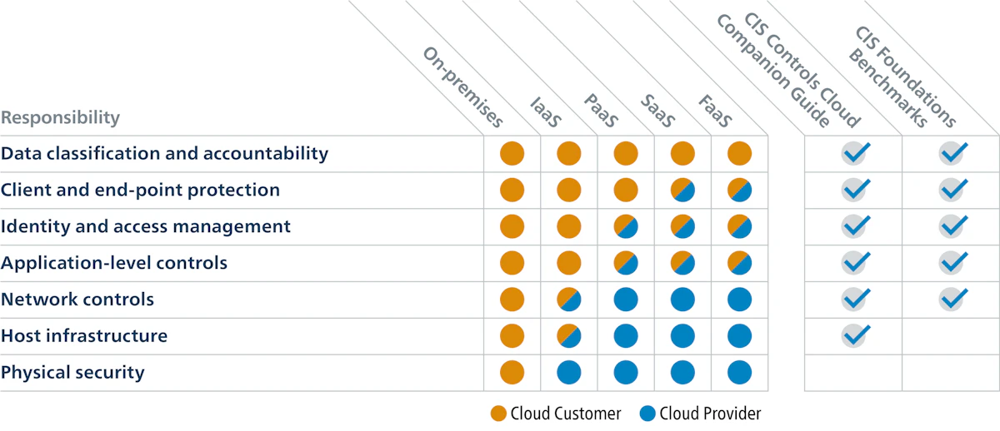
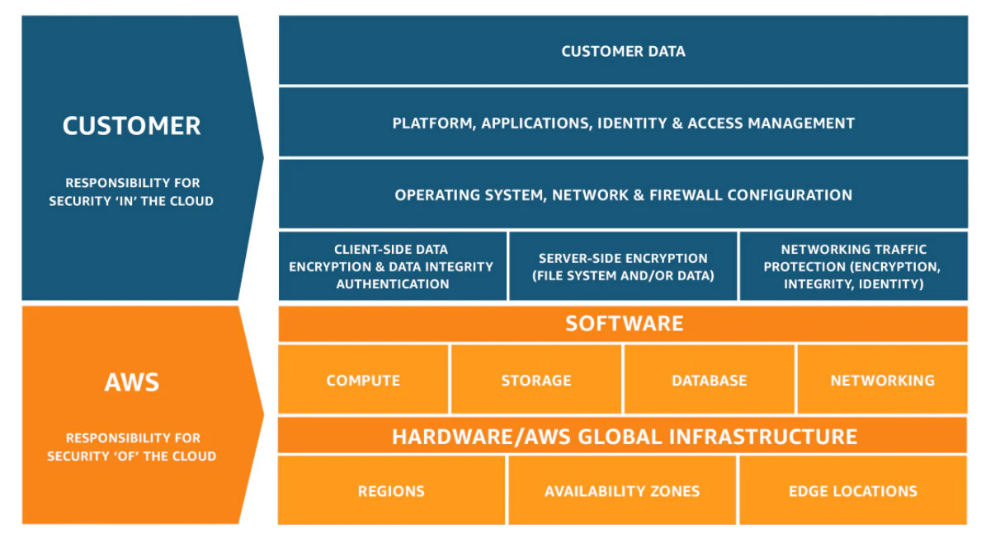
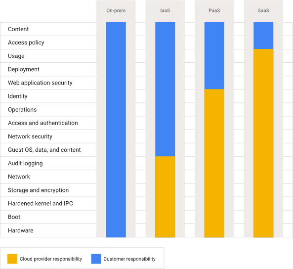
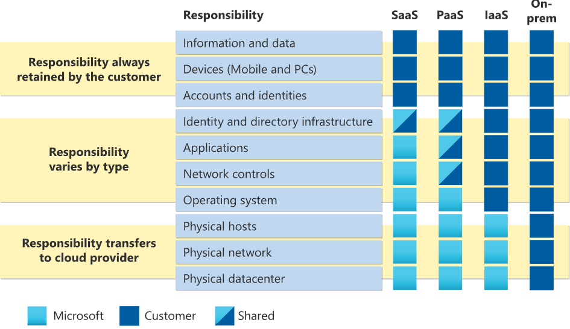
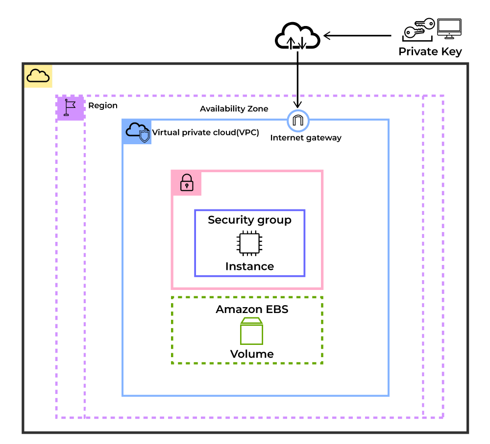
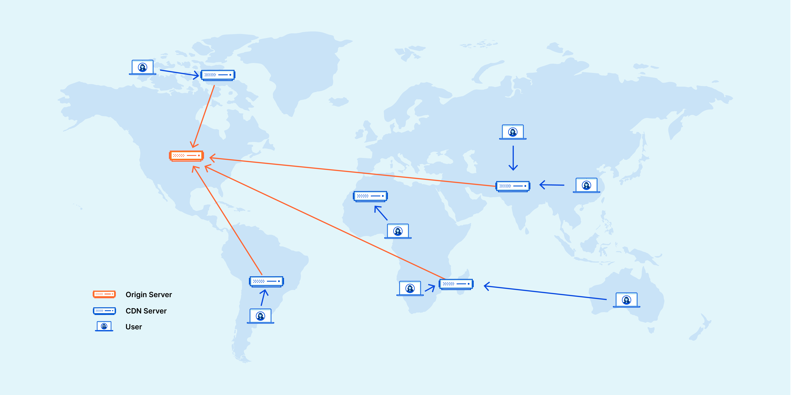

# AWS

> Notion 원본: <https://www.notion.so/2a85a06fd6d380b28325c370a8ac7c93>
> 동기화일: 2026-04-21

> 이미지 다운로드 실패 알림: 본 환경의 HTTP 프록시 정책상 S3 호스트(`prod-files-secure.s3.us-west-2.amazonaws.com`) 접근이 차단되어 이미지를 로컬로 내려받지 못했습니다. 본 문서 내부의 `` 링크는 Notion 원본 Pre-signed URL을 유지하며 약 1시간 내 만료됩니다.

> 본 문서는 Notion AWS 허브 페이지의 하위 45개 페이지 중 핵심 15개를 1-depth까지 전개한 것이며, 나머지 페이지는 하단에 링크로 정리되어 있습니다.

---

## Cloud Computing

> Notion: <https://www.notion.so/1f45a06fd6d381858b75fa4f12b17018>

# ☁️ 클라우드 컴퓨팅 (Cloud Computing)
클라우드 컴퓨팅이란 IT 리소스를 **인터넷을 통해 온디맨드로 제공받고 사용한 만큼만 비용을 지불하는 모델**입니다. 자체 데이터 센터를 구축하는 대신 AWS, Azure, GCP 등 클라우드 공급자의 서비스를 이용하여 컴퓨팅 파워, 스토리지, 데이터베이스 등 IT 인프라를 빠르고 효율적으로 사용할 수 있습니다.

### 📌 클라우드 컴퓨팅의 특징
- **온디맨드 서비스**: 필요한 시점에 즉시 리소스를 제공받습니다.
- **사용량 기반 과금**: 실제 사용한 만큼 비용을 지불합니다.
- **확장성과 탄력성**: 수요에 따라 리소스를 빠르게 확장하거나 축소합니다.
- **지리적 유연성**: 전 세계 어디서든 서비스를 빠르게 배포할 수 있습니다.

### 🎯 주요 이점
- **민첩성 (Agility)**: IT 리소스를 신속히 확보, 몇 분 만에 서비스 배포 및 아이디어 구현 가능, 다양한 기술을 빠르게 테스트하고 비즈니스 혁신을 촉진
- **탄력성 (Elasticity)**: 필요 이상의 리소스를 사전 준비할 필요 없이 실제 비즈니스 수요에 따라 리소스를 유연하게 조정 가능
- **비용 절감 (Cost Savings)**: 고정 비용을 가변 비용으로 전환, 데이터센터/서버 구매/설치/유지관리 비용 절감, 규모의 경제로 더 낮은 비용으로 운영
- **빠른 글로벌 배포 (Rapid Global Deployment)**: 클릭 몇 번으로 전 세계 다양한 지역에 애플리케이션 배포, 사용자와 근접한 위치에 서비스를 제공하여 지연시간 단축

### 🔗 구성 요소
- **데이터 센터**: CSP는 데이터센터를 운영하여 인프라(서버, 스토리지, 네트워크 장비) 제공
- **네트워킹 기능**: 고속 인터넷 연결로 사용자(프런트엔드)와 클라우드 리소스(백엔드) 연결. 부하 분산, CDN, SDN 등 기술로 안정적이고 빠른 네트워크 성능 보장
- **가상화 (Virtualization)**: 물리적 서버를 논리적으로 여러 개의 가상 서버로 분리, 하드웨어 자원을 최대한 효율적으로 활용

### 📦 클라우드 서비스 유형

| 유형 | 설명 | 사례 |
| --- | --- | --- |
| **IaaS** (Infrastructure as a Service) | 서버, 스토리지, 네트워크 등 인프라 제공. 사용자가 가장 높은 수준의 통제 가능 | AWS EC2, Azure Virtual Machines |
| **PaaS** (Platform as a Service) | 인프라 관리 없이 앱 개발과 운영에만 집중. 배포 환경 및 운영체제 제공 | AWS Elastic Beanstalk, Heroku |
| **SaaS** (Software as a Service) | 완전 관리형 소프트웨어 제품 제공. 사용자는 소프트웨어 사용법에만 집중 | Google Workspace, Salesforce |

### 🛠 클라우드 활용 예시
- **확장 가능한 컴퓨팅 용량**: 빠른 확장/축소로 워크로드에 따라 사용량을 조정하고 비용 절감
- **데이터베이스 및 스토리지**: 파일/블록/객체 스토리지, 완전 관리형 DB 서비스
- **AI 및 기계 학습**: 챗봇, 가상 비서, 코드 생성, 보고서 자동화, NLP, 이미지 인식
- **네트워킹 및 콘텐츠 전송**: CDN으로 전 세계 콘텐츠 빠르게 배포
- **보안, 자격증명, 규정 준수**: 강력한 보안 및 자동화된 규정 준수, 세분화된 접근 제어 및 지속적 모니터링
- **마이그레이션 및 현대화**: 자동화된 마이그레이션 서비스, 최소한의 서비스 중단으로 앱/데이터 이전

### 📚 참고 문서
- [AWS 클라우드 공식 홈페이지](https://aws.amazon.com/ko/)
- [Azure 클라우드 공식 홈페이지](https://azure.microsoft.com/ko-kr/)
- Google Cloud 공식 홈페이지

---

## Shared Responsibility Model

> Notion: <https://www.notion.so/1f45a06fd6d381578716e79cc059397f>

# 📌 공유 책임 모델 (Shared Responsibility Model)

## 🔖 개념
**공유 책임 모델**이란 클라우드 환경의 보안 및 규정 준수를 위해 클라우드 서비스 제공자(CSP)와 고객 간 책임 범위를 명확히 구분한 프레임워크다.
- CSP는 주로 **인프라 보안**(데이터센터, 네트워크 하드웨어 등)을 담당한다.
- 고객은 클라우드 환경에 저장된 **데이터 및 애플리케이션 보안**을 담당한다.

## 📌 서비스 유형별 책임 구분



| 서비스 유형 | CSP 책임 | 고객 책임 |
| --- | --- | --- |
| **SaaS** | 인프라, 네트워크, 애플리케이션 보안 관리 | 사용자 액세스 관리, 데이터 보호 |
| **PaaS** | 인프라, OS, 런타임, 미들웨어 관리 | 애플리케이션 개발, 데이터 및 사용자 접근 관리 |
| **IaaS** | 인프라(가상 머신, 스토리지, 네트워크) 보호 | OS, 런타임, 애플리케이션, 데이터 보호 |

> 주의: 구체적인 책임 경계는 CSP의 SLA 문서를 반드시 확인해야 한다.

## 📌 상세 책임 분류

### 🔸 고객의 책임
| 고객 책임 | 설명 |
| --- | --- |
| **데이터 보호** | 접근 제어, 암호화, 데이터 백업으로 데이터의 기밀성, 무결성, 가용성 유지 |
| **사용자 접근 관리** | 사용자 권한 설정, 강력한 비밀번호, MFA(다중 요소 인증) 적용 |
| **애플리케이션 보안** | 보안 코딩, 정기적 취약성 점검 및 보안 제어 구현 |
| **네트워크 제어** | 방화벽, VPN 등 네트워크 보안 설정 및 관리 |
| **규정 준수 및 거버넌스** | 산업별 규제 및 거버넌스 요구사항 충족 |

### 🔹 CSP의 책임
| CSP 책임 | 설명 |
| --- | --- |
| **물리적 보안** | 데이터센터 접근 통제, 감시 시스템, 환경 제어 |
| **네트워크 인프라 보안** | 라우터, 스위치 등 네트워크 장비 보안 및 침입 탐지 시스템 관리 |
| **호스트 인프라 보안** | 서버, 가상화, 스토리지 보안, 운영체제 패치 및 서비스 안정성 보장 |
| **규정 준수 인증** | 독립 감사 및 인증으로 보안 수준 입증 |

### 🔄 중복되는 책임 (상황에 따라 다름)
- **운영 체제(OS)**: CSP 제공 OS 선택 시 고객이 보안 설정 책임, 고객 자체 OS 선택 시 전체 OS 보안 책임
- **기본 도구 vs 타사 도구**: CSP는 기본 서비스 관리/업데이트, 고객은 타사 앱의 보안 관리
- **서버 기반 vs 서버리스**: 서버 기반은 OS 보안, 서버리스는 코드 보안 및 CSP 제공 옵션 구성이 고객 책임
- **네트워크 제어**: 방화벽 설정 및 보안 규칙 관리 책임은 고객

## 📌 주요 CSP 벤더별 모델

### AWS


### GCP


### Azure


## 📌 모델의 주요 도전 과제
| 도전 과제 | 설명 및 대응 전략 |
| --- | --- |
| **접근 제어** | CSP의 관리 목적 접근과 고객 데이터 보호의 충돌 가능성 → RBAC로 접근 권한 최소화 |
| **애매성** | 보안 책임의 모호한 영역 존재(예: 클라우드 미들웨어) → 소프트웨어 패치 자동화 등 명확한 관리 방침 수립 |
| **사고 관리** | 사이버 공격 시 책임자 파악 어려움 → 공격의 출처 명확화 및 책임 주체 명시적 규정화 필요 |
| **복잡성** | 다수의 CSP 및 부서가 관여 → 명확한 역할과 책임 정의 내부 관리 프로세스 확립 필요 |

## 📚 참고 문서
- [Shared Responsibility Model (Wiz)](https://www.wiz.io/academy/shared-responsibility-model)

---

## EC2

> Notion: <https://www.notion.so/1f45a06fd6d381f49340e5dfebac0e1b>

# 📌 Amazon EC2 (Elastic Compute Cloud)

## 🔖 개념



**Amazon EC2**는 기업이 AWS 퍼블릭 클라우드 환경에서 애플리케이션을 실행할 수 있도록 지원하는 웹 기반 컴퓨팅 서비스다.
- 필요에 따라 확장 가능하고 안전한 컴퓨팅 리소스 제공
- 사용한 만큼 비용을 지불하는 종량제 방식
- 가상 컴퓨터 인스턴스를 임대하여 유연한 확장성 제공

## 📌 주요 특징
| 특징 | 상세 내용 |
| --- | --- |
| **가상 컴퓨팅 환경 제공** | 사용자 맞춤형 가상 머신 및 환경 설정 지원, 다중 EC2 인스턴스 운영 가능 |
| **보안 강화** | 가상 머신 환경에서 강화된 보안 지원 |
| **유연한 환경 설정** | 인스턴스의 수명 주기 중 언제든지 구성 변경 가능 |
| **다양한 AMI 옵션** | RAM, ROM, 스토리지 등 미리 구성된 리소스를 포함한 다양한 OS 제공 |
| **사용자 정의 AMI 생성** | 사용자 맞춤형 구성으로 AMI 생성 및 저장 가능 |

## 📌 지원 운영 체제
- Amazon Linux (AWS 최적화 Linux), Ubuntu, Windows Server, RHEL, SUSE Linux, Debian
- 사용자가 직접 운영 체제 업로드 및 사용 가능

## 📌 지원 소프트웨어
- AWS Marketplace를 통해 다양한 소프트웨어 제공 (예: SAP, LAMP, Drupal 등)

## 📌 확장성 및 안정성
- 요구에 따라 리소스의 신속한 확장 및 축소 가능
- 높은 트래픽 처리 및 동적 환경에서 안정성 보장
- 볼륨 및 스냅샷을 통한 데이터 안정성 관리

## 📌 주요 기능
| 기능 | 상세 내용 |
| --- | --- |
| **다양한 스토리지 옵션** | EBS(블록), 인스턴스 스토리지, S3(객체 스토리지) |
| **향상된 네트워킹** | 높은 패킷 처리량, 낮은 지연 시간 및 지터 감소 |
| **인텔 프로세서 기능 활용** | AES-NI, AVX, DL Boost, Turbo Boost 등 |
| **클러스터 네트워킹 지원** | 일부 인스턴스는 짧은 네트워크 지연 시간 제공 |
| **자동 확장(Auto Scaling)** | 조건에 따른 자동 인스턴스 확장 및 축소 |
| **최적화된 CPU 구성** | vCPU 수 지정, 하이퍼스레딩 on/off 지원 |

## 📌 주요 이점
| 이점 | 상세 내용 |
| --- | --- |
| **확장성** | 수요에 따른 즉각적인 리소스 조정 |
| **유연성** | 다양한 워크로드 및 OS 대응 가능한 다양한 인스턴스 유형 |
| **비용 효율성** | 온디맨드/예약/스팟 요금 모델로 비용 최적화 |
| **가용성 및 안정성** | 다양한 지리적 위치 및 AZ로 높은 가용성과 재해 복구 제공 |

---

## EC2 Instance

> Notion: <https://www.notion.so/1f45a06fd6d381bc9ba9f986a45ced8b>

## 🔖 개념: EC2(Elastic Compute Cloud)란?
- **AWS EC2**는 AWS에서 제공하는 가상 서버(인스턴스)를 생성하고 사용할 수 있게 해주는 서비스입니다.
- 사용자는 **물리적인 서버를 직접 관리하지 않고도**, 클라우드에서 손쉽게 서버를 생성, 시작, 중지, 스케일 조정할 수 있습니다.
- EC2 인스턴스는 리눅스 또는 윈도우 운영체제를 기반으로 하며, 다양한 스펙과 크기로 제공됩니다.

## ⚙️ 작동 원리
| 구성 요소 | 설명 |
| --- | --- |
| **AMI (Amazon Machine Image)** | OS, 애플리케이션, 설정이 포함된 EC2의 템플릿 |
| **Instance Type** | CPU, 메모리, 네트워크 성능 등 자원 조합 설정 |
| **EBS (Elastic Block Store)** | EC2 인스턴스가 사용하는 디스크. 볼륨 단위로 구성 |
| **Security Group** | 인스턴스에 접근할 수 있는 트래픽 규칙 정의 (방화벽 역할) |
| **Key Pair** | SSH 연결용 공개/비공개 키 쌍 |
| **Elastic IP** | 고정된 공인 IP 주소로 외부 접근을 유지 |

## 📦 EC2 인스턴스의 주요 역할
- 웹 애플리케이션 백엔드 서버
- 배치 처리 및 자동화 작업 서버
- 머신러닝 모델 학습 서버 (GPU 필요)
- 인메모리 캐시 서버 (Redis 등)
- 컨테이너 호스팅 (Docker, Kubernetes)
- 데이터베이스 서버 (RDS 외 직접 운영 시)

## 🧩 인스턴스 타입 분류
1. **범용 (General Purpose)**: `t3`, `t4g`, `m5` — 웹 서버, 개발환경, 소규모 DB
2. **컴퓨팅 최적화 (Compute Optimized)**: `c5`, `c6g` — 배치 처리, 고성능 웹/게임 서버
3. **메모리 최적화 (Memory Optimized)**: `r5`, `x1e` — 인메모리 DB, 분석 시스템
4. **스토리지 최적화 (Storage Optimized)**: `i3`, `d2` — NoSQL, 데이터 웨어하우스, 로그 분석
5. **가속화 컴퓨팅 (Accelerated Computing)**: `p3`, `g4dn`, `f1` — 머신러닝, HPC, 렌더링

## 📊 인스턴스 타입 비교 예시
| 타입 | vCPU | 메모리 (GiB) | 네트워크 | 스토리지 | 용도 |
| --- | --- | --- | --- | --- | --- |
| `t3.micro` | 2 | 1 | 최대 5 Gbps | EBS 전용 | 저비용 웹 서버 |
| `m5.large` | 2 | 8 | 최대 10 Gbps | EBS 전용 | 범용 애플리케이션 |
| `c5.xlarge` | 4 | 8 | 최대 10 Gbps | EBS 전용 | 고성능 처리 |
| `r5.2xlarge` | 8 | 64 | 최대 10 Gbps | EBS 전용 | 메모리 집중 워크로드 |
| `i3.4xlarge` | 16 | 122 | 최대 10 Gbps | 2 x 1900GB NVMe SSD | 고속 스토리지 처리 |
| `p3.2xlarge` | 8 | 61 | 최대 10 Gbps | EBS 전용 | 머신러닝, GPU 작업 |

## 💡 활용 팁
- **짧은 시간 사용**: 스팟 인스턴스를 활용하면 최대 90% 저렴
- **오토스케일링**: 트래픽에 따라 자동으로 증감
- Elastic Load Balancer(ELB)와 연계한 트래픽 부하 분산
- **CloudWatch**로 인스턴스 상태 및 리소스 사용률 모니터링

---

## Amazon VPC

> Notion: <https://www.notion.so/1f45a06fd6d3810b8f94cfe1e3207672>

## 🔖 개념
- **Amazon VPC(Virtual Private Cloud)**는 AWS 클라우드에서 사용자가 정의하고 제어할 수 있는 논리적으로 격리된 전용 가상 네트워크 환경이다.
- 사용자는 VPC 내에서 IP 주소 범위, 서브넷 생성, 라우팅 테이블 구성, 게이트웨이 설정 및 네트워크 보안 설정을 자유롭게 구성할 수 있다.

## 📚 주요 기능

### 1. VPC (Virtual Private Cloud)
- 사용자가 정의하는 독립된 논리적 네트워크 환경
- 실제 데이터센터의 기존 네트워크 환경과 유사하게 AWS 리소스 관리 가능
- 확장성과 유연성 제공

### 2. 서브넷 (Subnet)
- VPC 내 IP 주소 범위를 나누어 생성하는 세부 네트워크 영역
- 하나의 서브넷은 단일 AZ에만 속함
- 퍼블릭 서브넷(인터넷 접근 가능) / 프라이빗 서브넷(인터넷 접근 불가)

### 3. IP 주소 지정
- IPv4, IPv6 모두 지원
- AWS로 퍼블릭 IPv4, IPv6 GUA(Global Unicast Address)를 가져와 리소스에 할당 가능

### 4. 라우팅
- 라우팅 테이블로 VPC 내 트래픽 흐름 정의
- 서브넷/게이트웨이를 통한 경로 결정

### 5. 게이트웨이 및 엔드포인트
- **인터넷 게이트웨이**: VPC를 인터넷에 연결
- **NAT 게이트웨이**: 프라이빗 서브넷에서 인터넷 접근
- **VPC 엔드포인트**: 인터넷을 거치지 않고 AWS 서비스(S3 등)에 연결

### 6. VPC 피어링 (Peering)
- 두 VPC 간 직접 트래픽 라우팅 연결
- 동일/다른 AWS 계정 VPC와 연결 가능

### 7. 트래픽 미러링 (Traffic Mirroring)
- 네트워크 인터페이스 트래픽 복제 → 보안 분석/모니터링

### 8. 전송 게이트웨이 (Transit Gateway)
- 여러 VPC와 온프레미스 네트워크 간 중앙 허브
- VPC/VPN/Direct Connect 간 라우팅 단순화

### 9. VPC 흐름 로그 (Flow Logs)
- IP 트래픽 정보 기록 → 보안 및 감사

### 10. VPN 연결
- AWS VPN으로 온프레미스-VPC 암호화 연결

## ⚙️ 작동 방식
1. **VPC 생성 및 구성**: CIDR 블록 지정, 서브넷/라우팅 테이블/보안 그룹 구성
2. **서브넷 설정**: IP 주소 범위 할당, AZ 지정, 퍼블릭/프라이빗 구성
3. **라우팅 관리**: 라우팅 테이블로 트래픽 흐름 정의, 인터넷 게이트웨이로 인터넷 라우팅
4. **네트워크 보안 설정**: 보안 그룹, 네트워크 ACL로 인/아웃바운드 규칙 설정
5. **외부 네트워크 연결**: IGW/NAT/VPN/Direct Connect, VPC 피어링
6. **트래픽 분석 및 모니터링**: VPC 흐름 로그, 트래픽 미러링

## 🔗 참고 문서
- [Amazon VPC 공식 문서](https://docs.aws.amazon.com/vpc/latest/userguide/how-it-works.html)

---

## AWS Security Groups

> Notion: <https://www.notion.so/1f45a06fd6d381e98ad5cbfb6e142065>

## 📘 AWS Security Groups
- AWS 보안 그룹(Security Group)은 VPC 내에서 인스턴스 수준의 네트워크 트래픽을 제어하는 가상 방화벽 역할
- EC2, RDS, Lambda 등 다양한 AWS 리소스에 적용
- 인바운드/아웃바운드 트래픽 규칙 설정

## 🔐 보안 그룹의 핵심 개념
- **상태 저장(Stateful)**: 인바운드 트래픽이 허용되면 응답은 아웃바운드 규칙과 무관하게 자동 허용
- **기본 규칙**: 생성된 그룹은 기본적으로 모든 인바운드 차단, 모든 아웃바운드 허용
- **규칙 구성 요소**: 프로토콜(TCP/UDP/ICMP), 포트 범위(예: 22, 80), 소스/대상(IP, CIDR, 다른 SG ID), 설명

## 🛠️ 보안 그룹 설정 절차
1. **보안 그룹 생성**: VPC 내에서 이름과 설명 지정
2. **인바운드 규칙 추가**: 예) 특정 IP에서 SSH(22) 허용
3. **아웃바운드 규칙 설정**: 제한 또는 특정 대상만 허용
4. **인스턴스에 할당**: EC2 생성 시 또는 이후에 할당

## 🧩 활용 예시
- **웹 서버**: 인바운드 0.0.0.0/0에서 80/443 허용, 아웃바운드 모두 허용
- **DB 서버**: 인바운드 웹 서버 SG에서 3306 허용, 아웃바운드 제한

## ✅ 주의사항
- **최소 권한 원칙**: 필요한 트래픽만 허용
- **SG 간 참조**: 다른 SG를 소스/대상으로 지정
- **수 제한**: VPC당 생성 가능한 SG 수, 규칙 수 제한 존재
- **기본 SG 사용 주의**

## 📚 참고 자료
- [Amazon Security Groups 공식 문서](https://docs.aws.amazon.com/vpc/latest/userguide/vpc-security-groups.html)

---

## AWS IAM

> Notion: <https://www.notion.so/1f45a06fd6d38111951cdf9d2c87f893>

## 📘 AWS I AM
- AWS Identity and Access Management(IAM)은 AWS 리소스에 대한 접근을 안전하게 제어하는 웹 서비스
- 사용자, 그룹, 역할을 생성하고 적절한 권한 부여

## 🔑 주요 구성 요소
### 1. IAM 사용자 (User)
- AWS 리소스에 접근하는 개별 엔터티
- 고유한 자격 증명(액세스 키, 비밀번호) 보유

### 2. IAM 그룹 (Group)
- 여러 사용자를 논리적으로 묶은 집합
- 그룹 권한은 구성원 사용자에게 상속

### 3. IAM 역할 (Role)
- AWS 서비스나 외부 사용자에게 일시적 권한 부여
- 예: EC2에서 S3 접근 권한

### 4. 정책 (Policy)
- JSON 형식 문서로 허용/거부 작업을 리소스별로 정의
- 사용자/그룹/역할에 연결

## 🔐 인증과 권한 부여
- **인증(Authentication)**: 자격 증명 확인
- **권한 부여(Authorization)**: 작업 수행 가능 여부 결정
- 기본적으로 모든 요청 거부, 명시적 허용만 승인, 명시적 거부가 있으면 무조건 거부

## 🛠️ 설정 절차
1. IAM 사용자 생성
2. 그룹 생성 및 사용자 추가
3. 정책 생성 및 연결
4. 역할 생성 및 할당

## 🧩 추가 정보
- **루트 사용자 사용 제한**
- **MFA 활성화 권장**
- **정기적인 권한 검토** (최소 권한 원칙)

## 📚 참고 자료
- [Amazon IAM 공식 문서](https://docs.aws.amazon.com/IAM/latest/UserGuide/introduction.html)

---

## AWS IAM Role

> Notion: <https://www.notion.so/1f45a06fd6d38047a271fa2db334c2d0>

## 📘 AWS I AM Role
- IAM 역할은 AWS 리소스 접근 제어의 핵심 메커니즘
- 사용자/서비스가 일시적으로 특정 권한을 갖도록 함

## 🎭 주요 사용 사례

### 1. ID 공급자(IdP)를 통한 역할 생성 및 연동
- 외부 인증 시스템(Google, Facebook, GitHub 등)을 통한 인증 후 AWS 리소스 접근 권한 부여
- 절차: IdP 등록(OIDC/SAML 2.0) → 역할 생성 및 신뢰 정책 설정 → 권한 정책 부여
- 예: GitHub Actions CI/CD에서 OIDC 사용

### 2. EC2 인스턴스에 역할 할당 (인스턴스 프로파일 사용)
- EC2 내 애플리케이션이 AWS 리소스에 접근하도록 역할 할당
- 절차: EC2 신뢰 정책 역할 생성 → 인스턴스 프로파일 생성 → 인스턴스에 프로파일 연결
- 주의: 인스턴스당 역할 하나, 변경 시 최대 1시간 지연 가능(재시작/재연결로 즉시 반영 가능)

### 3. 역할 전환 및 위임
- 사용자/서비스가 다른 역할로 전환하여 일시적 권한 획득
- 절차: 전환 대상 역할 생성 및 신뢰 정책 명시 → `sts:AssumeRole` 권한 부여 → CLI/SDK/콘솔로 전환
- 예: 개발 계정 사용자가 운영 계정 리소스 접근

## 🔄 역할 전환 방법 비교
| 전환 방법 | 설명 | 사용 사례 |
| --- | --- | --- |
| **콘솔 전환** | AWS Management Console에서 수동 역할 전환 | 관리자가 일시적으로 다른 역할 권한 필요 시 |
| **CLI/SDK 전환** | 프로그래밍 방식 전환 | 자동화 스크립트/앱 |
| **연합 인증 전환** | 외부 IdP를 통한 전환 | 외부 사용자/서비스 AWS 접근 |

## ✅ 관리 시 고려사항
- 최소 권한 원칙
- 세션 지속 시간 제한
- 민감 역할에 MFA 적용
- 정기 감사 및 검토

## 📚 참고 자료
- [IAM Role 공식 문서](https://docs.aws.amazon.com/IAM/latest/UserGuide/id_roles_create_for-idp.html)
- [IAM 역할 가정 공식 문서](https://docs.aws.amazon.com/IAM/latest/UserGuide/id_roles_manage-assume.html)

---

## AWS S3

> Notion: <https://www.notion.so/1ff5a06fd6d38020bc66c5961de8450e>

# 📦 Amazon S3 (Simple Storage Service)

## 🔖 개념
- **Amazon S3**는 인터넷을 통해 언제 어디서나 데이터 저장/검색이 가능한 객체 스토리지 서비스
- 무제한 용량, 높은 내구성(99.999999999%), 확장성, 보안성 보장
- 데이터는 **버킷(Bucket)**에 저장됨

## 📚 주요 기능
| 기능 | 설명 |
| --- | --- |
| 🪣 **버킷 (Bucket)** | S3의 객체 저장 최상위 단위. 고유 이름, 리전 지정 |
| 📁 **객체 (Object)** | 저장 데이터 단위. Key(경로)와 메타데이터 |
| 🧩 **버전 관리** | 동일 객체 이름으로 여러 버전 저장 가능 |
| 🔐 **액세스 관리** | IAM 정책, 버킷 정책, ACL, Block Public Access |
| 🛡️ **암호화** | SSE-S3, SSE-KMS, SSE-C, HTTPS 전송 |
| 📦 **스토리지 클래스** | Standard, Intelligent-Tiering, Glacier 등 |
| ⏳ **수명 주기 관리** | Lifecycle Rule로 자동 전환/삭제 |
| 📊 **로깅 및 모니터링** | S3 액세스 로그, CloudTrail, CloudWatch |
| 🌍 **정적 웹 호스팅** | HTML/CSS/JS 정적 리소스 배포 |
| 🔄 **복제 (Replication)** | CRR(교차 리전), SRR(동일 리전) |

## 🎯 사용해야 하는 이유
- **확장성**: PB 단위 자동 확장
- **내구성**: 99.999999999%(11 9's)
- **가용성**: 리전 기반 고가용성
- **비용 효율성**: 다양한 스토리지 클래스
- **보안**: AWS KMS/IAM 연동

## ✅ 주요 사용 사례
- 백업 및 복구 시스템
- 정적 웹 사이트 호스팅
- 모바일/웹 앱 데이터 저장소
- 로그 및 이벤트 데이터
- 빅데이터 분석 원시 데이터
- 미디어 저장 및 스트리밍

## 📌 참고 자료
- [Amazon S3 공식 문서](https://docs.aws.amazon.com/AmazonS3/latest/userguide/Welcome.html)

---

## AWS Load Balancers

> Notion: <https://www.notion.so/1fe5a06fd6d380ed912ae7c955ff04d6>

# 📌 AWS 로드 밸런싱 (Elastic Load Balancing)

## 🔖 개념
- AWS Elastic Load Balancing(ELB)은 들어오는 트래픽을 여러 대상(인스턴스, 컨테이너, IP)으로 자동 분산
- 부하 분산, 자동 장애 탐지 및 관리 제공

## 🛠️ 유형
1. **Application Load Balancer (ALB)**: HTTP/HTTPS 최적화, URL/호스트 기반 라우팅, 컨테이너/마이크로서비스
2. **Network Load Balancer (NLB)**: TCP/UDP/TLS, 초당 수백만 요청, 저지연
3. **Gateway Load Balancer (GWLB)**: 제3자 네트워크 가상 어플라이언스 통합, 보안/분석/컴플라이언스
4. **Classic Load Balancer (CLB)**: EC2-Classic 환경용, 레거시

## 🎯 주요 기능
- **부하 분산(Load Balancing)**
- **Auto Scaling과 통합**
- **헬스 체크**: 대상 상태 모니터링하여 자동 제외
- **고가용성**: 여러 AZ에 트래픽 분산
- **보안 및 규정 준수**: SSL/TLS, AWS WAF 통합

## 🌟 사용 예시
- 웹 애플리케이션/서비스 트래픽 처리
- 마이크로서비스/컨테이너 앱
- 미디어 스트리밍, 대규모 멀티플레이어 게임
- 금융/헬스케어 등 엄격 요구사항 애플리케이션

## 📚 참고 자료
- [AWS ELB 공식 문서](https://aws.amazon.com/ko/elasticloadbalancing/)

---

## AWS Auto Scaling (EKS)

> Notion: <https://www.notion.so/1fb5a06fd6d38007aeb5c85e7f26e839>

# 📘 AWS EKS Auto Scaling

## 📖 개요
- EKS Auto Scaling은 Kubernetes 클러스터 내 워크로드 변동에 따라 리소스를 자동 조정
- 성능과 비용 효율성 최적화

## 🚩 주요 특징
- **탄력성**, **효율적 리소스 관리**, **무중단 서비스 유지**, **통합 모니터링**(CloudWatch, Prometheus), **유연성**

## 🔧 구성 요소
- **Cluster Autoscaler**: 클러스터 노드 자동 확장/축소
- **Horizontal Pod Autoscaler (HPA)**: CPU/메모리 기반 Pod 수 조정
- **Karpenter**: 노드 프로비저닝 신속/유연 수행
- **Vertical Pod Autoscaler (VPA)**: Pod의 리소스 요청/제한 조정

## ⚙️ 작동 원리
1. 클러스터 메트릭(CPU/메모리) 지속 모니터링
2. 임계치 초과 감지
3. Autoscaler 트리거 → 새 노드 프로비저닝
4. 리소스 프로비저닝 및 Pod 배치
5. 리소스 사용률 하락 시 자동 축소

## 📌 활용 예시 (HPA 샘플)
```yaml
apiVersion: autoscaling/v1
kind: HorizontalPodAutoscaler
metadata:
  name: web-app-hpa
spec:
  maxReplicas: 10
  minReplicas: 2
  scaleTargetRef:
    apiVersion: apps/v1
    kind: Deployment
    name: web-app
  targetCPUUtilizationPercentage: 70
```

- **배치 작업 처리**: 대량 데이터 처리 시 작업량에 따라 리소스 확장

## 🚨 베스트 프랙티스
- Autoscaler 리소스 할당 최적화(최소/최대 노드)
- 모니터링 및 경고 설정
- 지속적인 테스트
- Pod 리소스 요청/제한 정확성 유지

## 📚 참고 자료
- [EKS Auto Scaling Best Practices](https://docs.aws.amazon.com/eks/latest/best-practices/cas.html)
- [AWS EKS 공식 문서](https://docs.aws.amazon.com/eks/latest/userguide/what-is-eks.html)
- [Cluster Autoscaler GitHub](https://github.com/kubernetes/autoscaler/tree/master/cluster-autoscaler)
- [Karpenter 공식 문서](https://karpenter.sh/)

---

## AWS CloudWatch

> Notion: <https://www.notion.so/20e5a06fd6d38041a2fbdf1928ef471a>

# 📌 AWS CloudWatch
- AWS 리소스/애플리케이션 실시간 모니터링 및 가시성(Observability) 제공
- 메트릭, 로그, 트레이스, 대시보드, 알람 통합

## 📚 주요 기능 및 구성 요소
| 구성 요소 | 설명 | 사용 예시 |
| --- | --- | --- |
| **Metrics** | AWS 서비스/앱 성능 지표 수집·추적 | EC2 CPU, S3 요청 수, 사용자 정의 메트릭 |
| **Alarms** | 메트릭 임계값 초과 시 알림/자동화 | CPU 80% 초과 시 SNS 알림, Auto Scaling 트리거 |
| **Dashboards** | 메트릭/로그 시각화 | 커스텀 대시보드 공유 |
| **Logs** | 로그 수집·저장·분석 | Lambda 로그, EC2 앱 로그, 로그 기반 메트릭 |
| **Application Monitoring(APM)** | 지연, 오류율, 요청 수 자동 감지 | Application Signals, Synthetics, RUM |
| **Infrastructure Monitoring** | DB, Lambda, 컨테이너 성능 | Database/Lambda/Container Insights |
| **Agent** | EC2/온프레미스 상세 메트릭·로그·트레이스 | CPU, 메모리, 디스크, 네트워크, GPU |
| **Cross-account Monitoring** | 여러 계정 중앙 통합 모니터링 | 조직 전체 대시보드/알람/로그 |
| **Network & Internet Monitoring** | 네트워크 성능, 연결 상태 | Internet/Network Flow/Synthetic Monitor |

## ⚙️ 활용 예시
- 서비스 이상 감지 및 자동 복구(Alarm + Lambda/Auto Scaling)
- 멀티 계정/리전 통합 모니터링
- 애플리케이션 성능 분석
- 네트워크 이슈 사전 탐지
- 비용 최적화

## 🧩 제한 사항 및 주의점
- 메트릭/로그 저장 기간 및 비용 정책
- 커스텀 메트릭/로그 비용
- 알람 과다 설정 주의
- Cross-account 권한 관리
- 일부 네트워크 모니터링은 특정 환경 필요

## 🔗 참고 자료
- [AWS CloudWatch 공식 문서](https://docs.aws.amazon.com/AmazonCloudWatch/latest/monitoring/WhatIsCloudWatch.html)
- [CloudWatch Logs Insights](https://docs.aws.amazon.com/AmazonCloudWatch/latest/logs/AnalyzingLogData.html)
- [CloudWatch Application Signals](https://docs.aws.amazon.com/AmazonCloudWatch/latest/monitoring/appsignals.html)
- [CloudWatch Internet Monitor](https://docs.aws.amazon.com/AmazonCloudWatch/latest/monitoring/CloudWatch-InternetMonitor.html)

---

## AWS Route 53

> Notion: <https://www.notion.so/20c5a06fd6d380ef88d6faeb3f8f1c85>

# 📌 AWS Route 53
- AWS Route 53은 Amazon의 확장 가능하고 가용성이 높은 클라우드 DNS 웹 서비스
- 도메인 이름을 IP 주소로 변환하고 트래픽을 애플리케이션 엔드포인트로 라우팅

## 🚩 주요 기능

### 1. DNS 서비스
- 도메인-IP 변환, 다양한 레코드 유형(A, AAAA, CNAME, MX, TXT)

### 2. 도메인 등록
- 신규 등록 및 이전 관리, 자동 갱신

### 3. 상태 확인 및 모니터링
- 애플리케이션 상태 확인으로 가용성 유지
- 결과 기반 트래픽 라우팅 변경

### 4. 트래픽 관리
- 지리적 근접성, 지연 시간, 가용성 등 기반 관리
- 로드 밸런싱 지원

### 5. 프라이빗 DNS
- VPC 내부 도메인 이름 관리
- 내부 DNS 이름 해석

## 🛠️ 활용 사례
- 글로벌 웹 애플리케이션 트래픽 관리
- 고가용성 애플리케이션 배포
- 하이브리드 클라우드 통합 DNS 관리

## ✅ 장점
- 높은 확장성 및 글로벌 가용성
- 유연한 트래픽 라우팅 정책
- 상태 모니터링 및 자동화 관리
- AWS 서비스와 원활한 통합

## 📚 참고 문서
- [AWS Route 53 공식 문서](https://aws.amazon.com/ko/route53/)

---

## AWS SES

> Notion: <https://www.notion.so/2065a06fd6d380328cc0e826e0c3d2cb>

## 📌 AWS SES (Amazon Simple Email Service)
- 클라우드 기반 이메일 전송 서비스
- 대량 이메일을 안전하고 효율적으로 전송
- 마케팅, 알림, 공지 등 활용

### 🔍 주요 기능 및 특징
| 기능 | 설명 |
| --- | --- |
| **높은 전달성** | AWS 신뢰 IP 및 평판 관리 시스템 |
| **확장성 및 유연성** | 초당 수천 건 전송, 자동 확장/축소 |
| **비용 효율성** | 사용량 기반 종량제 |
| **분석 및 모니터링** | 열람률/반송률/클릭률 메트릭 |
| **보안 및 규정 준수** | IAM 기반 액세스 제어, GDPR 등 지원 |
| **이메일 수신 처리** | Lambda, SNS 연동 |

### 📊 주요 활용 사례
- 마케팅 캠페인
- 거래 알림 자동화
- 대량 뉴스레터/공지

### 💰 요금 체계
- 발송: 월 62,000건까지 무료(EC2에서 발송 시), 초과 시 $0.10/1000건
- 수신: 최초 1,000건 무료, 초과 시 1,000건당 $0.10

### 🚨 고려 사항
- 계정별 전송 한도 존재, 필요 시 한도 상향 요청
- 전송 평판 유지(반송률/불만율 모니터링)

## 📚 참고 자료
- [AWS SES 공식 문서](https://aws.amazon.com/ko/ses/)
- [AWS SES 요금](https://aws.amazon.com/ko/ses/pricing/)

---

## CDN (AWS 컨텍스트)

> Notion: <https://www.notion.so/1f45a06fd6d3819b9f01f1790fc7720a>

# 🌐 CDN (Content Delivery Network)
**CDN**은 전 세계적으로 분산된 서버 네트워크를 이용해 웹사이트의 콘텐츠(이미지, 비디오, CSS 등)를 사용자에게 빠르게 전달하여 웹 페이지 로딩 속도를 높이는 기술입니다.

## 🖥 개념
- CDN은 대용량 콘텐츠를 더 빠르게 전송하기 위한 지리적 분산 서버 네트워크
- 사용자와 가까운 서버에 캐싱하여 지연 최소화
- 원본 서버 부하 및 대역폭 소비 감소
- 동적 콘텐츠 처리는 수행하지 않음

## 📚 주요 용어 및 개념
- **원본 서버(Origin Server)**: 콘텐츠 원본 저장/관리
- **캐싱(Caching)**: CDN 엣지 서버에 저장
- **엣지 컴퓨팅(Edge Computing)**: 사용자 근처 컴퓨팅 작업(AI, 스트리밍, 게임)
- **PoP (Points of Presence)**: 전 세계 분산 서비스 제공 지점

## 🚀 이점
1. **빠른 웹사이트 로딩 속도**
2. **대역폭 및 비용 절감**
3. **콘텐츠 가용성 및 신뢰성 증가**
4. **웹사이트 보안 강화**(DDoS, HTTPS, WAF)

## ⚙️ 작동 방식



1. **캐싱(Caching)**: 정적 콘텐츠를 엣지 서버에 저장
2. **부하 분산(Load Balancing)**: 트래픽 분산
3. **DNS 기반 라우팅**: 요청 위치와 가장 가까운 서버 IP 제공

## 💡 CDN ≠ 웹 호스팅
- CDN은 콘텐츠 전송 속도를 높이는 기술, 웹 호스팅과 함께 사용 시 성능 향상 효과

## 📖 참고 자료
- Cloudflare CDN 공식 홈페이지
- [AWS CloudFront CDN 소개](https://aws.amazon.com/ko/cloudfront/)
- Akamai CDN 서비스

---

## 기타 하위 페이지 (링크만)

아래 페이지들은 AWS 허브에 포함된 하위 페이지이며, 본 문서에서 1-depth 전개 대상에 포함되지 않았습니다. 각 항목의 자세한 내용은 Notion 원본 링크에서 확인하세요.

- [AWS Route 53 Health Checks](https://www.notion.so/20d5a06fd6d380a9a7b9effcfb78c323)
- [AWS Route 53 Routing Policy](https://www.notion.so/20d5a06fd6d38076a112e719e91d30bb)
- [AWS Route 53 Hosted Zones](https://www.notion.so/20c5a06fd6d3806cbcfaee0ecf6558a8)
- [AWS SES Sandbox / Sending Limits](https://www.notion.so/20b5a06fd6d38007b008f6062e6e7542)
- [AWS SES Identity Verification](https://www.notion.so/20b5a06fd6d3809c90d1d6f1f0adfbb5)
- [AWS SES DKIM Setup](https://www.notion.so/20a5a06fd6d3807fa47ae3b4d1c31f50)
- [AWS SES Feedback Handling](https://www.notion.so/2095a06fd6d38016925ac98bdae472a1)
- [AWS SES Configuration Sets](https://www.notion.so/2085a06fd6d38076adb0c82e9c235723)
- [AWS SES Sender Reputation](https://www.notion.so/2075a06fd6d3807c99a7cd395ae858df)
- [AWS SES Dedicated IPs](https://www.notion.so/2065a06fd6d380d29a61ddc670ecb483)
- [AWS S3 Glacier](https://www.notion.so/2055a06fd6d380ae8634f533d2140744)
- [AWS S3 1A](https://www.notion.so/2055a06fd6d38014ad94c9bb42a24f92)
- [AWS S3 - Standard](https://www.notion.so/2025a06fd6d380018f40e713d8eb7473)
- [AWS S3 - Storage Class](https://www.notion.so/2015a06fd6d3805082f1ce678b425ef6)
- [AWS S3 Lifecycle Management](https://www.notion.so/2005a06fd6d38047b9ffe2c07086a116)
- [AWS S3 Buckets & Objects](https://www.notion.so/1ff5a06fd6d3804ba970ef609c58931a)
- [AWS Scaling Policies](https://www.notion.so/1fc5a06fd6d380218818d8416062126d)
- [AWS Launch Templates](https://www.notion.so/1fa5a06fd6d380b0a9f6c7f948f21860)
- [AWS AMI](https://www.notion.so/1f75a06fd6d3805692fae473fffbfd8b>)
- [AWS Auto Scaling (2)](https://www.notion.so/1f65a06fd6d380b0a1a2e364bdf7130d)
- [AWS NAT Gateway](https://www.notion.so/1f45a06fd6d38120b2c6f6a0ba08381f)
- [AWS Internet Gateway](https://www.notion.so/1f45a06fd6d38132969be1feb763a456)
- [AWS IAM Policies](https://www.notion.so/1f45a06fd6d381a89fabcb2139e3013e)
- [AWS Route Table](https://www.notion.so/1f45a06fd6d381f29176c823659e1947)
- [EC2 User Data Scripts](https://www.notion.so/1f45a06fd6d38102a93fc72de16748f8)
- [VPC CIDR Block](https://www.notion.so/1f45a06fd6d38128b265ca90b31cf2a4)
- [AWS Subnet](https://www.notion.so/1f45a06fd6d3819f9632f394e7e39e2d)
- [EC2 Key Pairs](https://www.notion.so/1f45a06fd6d381369beadccf8bf50c4a)
- [EC2 EBS(Elastic Block Store)](https://www.notion.so/1f45a06fd6d381418d33f577dcd2f4ca)
- [EC2 IP Address](https://www.notion.so/1f45a06fd6d381c6a2fac84602e6e25d)
- [EC2 Burstable Performance Instance](https://www.notion.so/1f45a06fd6d381e7a697c1722d658c02)
- [EC2 CPU Credits](https://www.notion.so/1f45a06fd6d38191b62dda328f133101)
- [AWS CloudWatch Logs](https://www.notion.so/2135a06fd6d38044bb33d8e354ea5f0f)
- [AWS CloudWatch Events](https://www.notion.so/2105a06fd6d3800287b2e8991b6b7126)
- [AWS CloudWatch Metrics](https://www.notion.so/20f5a06fd6d380afaabbd2ec3fa9d5b7)
