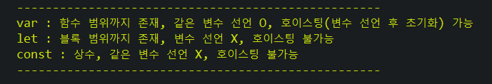

# Ajax & jSon

<aside>
💡 Ajax는 일종의 라이브러리(수업에서는 jQuery를 통해서 제공하는)로, Client의 요청과 Server의 응답 사이의 통신 방식을 비동기식 처리모델로 변경하는 역할을 한다.

</aside>

# 1. 개요와 정의

- 개요와 정의
    - AJAX(Asynchronous JavaScript AND XML) 의 기본 방식은 Non-Blocking 방식으로, 비동기 통신을 하는 것. 
    → 비동기식 처리모델 : 페이지가 로드 되는 동안 브라우저는 먼저 서버에 데이터를 요청한다. script문이 시행된 후 페이지의 나머지를 계속 로드하고, 페이지와 사용자의 상호작용을 처리하며, 브라우저는 요청한 데이터를 게속 기다리지 않는다 이후 요청한 데이터가 도착하면 그때 이벤트가 발생하며 지정한 함수가 호출되어 실행되는 방식 (Non Blocking)
    → 동기식 처리모델 : 페이지가 로드 되는 동안 브라우저는 script문이 실행되면 그 실행이 종료될 때까지 나머지 페이지를 로드하지 않고 기다리고 있다가 해당 script문 처리가 종료되면 페이지의 나머지 부분을 로드한다. (Blocking)
    - Ajax의 비동기식 통신 개념은 하나의 request를 기준으로, DB 데이터에 변화가 일어날 때가 기준이다. 즉, 동기식 통신이 하나의 request에 대한 처리 (비니지스 로직처리)가 완료된 이후 다른 request의 요청이 수행된다면(Servlet, 페이지가 이동한다면), 비동기식 통신은 request 요청이 완전히 수행되기 전에도 다른 request 요청을 (다른) servlet 페이지에서 비지니스 처리가 가능하다.
    - 서버로부터 데이터를 가져와 전체 페이지를 새로 고치지 않고 일부만 로드할 수 있게 하는 기법.
    - 장점 : 비동기식 방식으로 웹서버의 응답을 기다리지 않고 데이터를 빠르게 처리하는 개별기법, 페이지 리로딩 없이 처리된다. 
    → 동적 페이지 구성을 여러 개 할 필요가 줄고, 하나의 페이지에서 다양한 request를 마치 동적 페이지를 노출하는 것처럼 처리할 수 있다.
    - 단점 : 한 페이지에 지속적으로 사용시 리소스가 계속 쌓여 페이지가 느려짐, 스크립트로 되어 있어 에러 발생시 디버깅이 어렵다.
    
    <aside>
    💡 변수
    
    
    
    </aside>
    

# 2. 통신

- 통신 (Javascript 방식)
    - jsp↔servlet 간의 통신 방식 자체는 큰 차이가 없다. get과 post 방식으로 request를 전송하고, request에 담긴 값을 꺼내어 가공처리하고, response하는 것.
    - 다른 점이 있다면 response 객체에서 인코딩 방식과 text 타입의 MIME 타입을 지정해줘야 한다는 점 정도. 그 방식은 아래와 같다.
        
        
        
    - index 파일에서 client의 정보 입력 부분의 경우, 아래와 같다.
        
        
        
    - client가 button을 눌렀을 때(Event)를 기준으로 발동하는 함수가 sendName()
    - p태그에 result라는 id값을 부여한다.
    - 이후 script 영역에서 앞서 선언한 sendName() 함수를 정의(초기화)하는 과정이 시작된다.
    - 해당 함수 속에서 const 변수에 httpRequest라는 이름으로 XMLHttpRequest()라는 이름의 생성자를 부여한다.
    - 이후 serverAddress 라는 변수에 해당 request가 이동할 url 위치(servlet)을 지정한다.
    - 앞서 지정한 httpRequest 인스턴스 변수에 XMLHttpRequest의 내장 메서드 onreadystatechange를 호출, 해당 메서드에 무명 함수를 지정한다.
    - 무명 함수의 내용은 서버의 응답에 따른 비지니스 로직 처리이다.
        
        
        
    - 위 if문을 통해 서버통신이 이루어졌는지에 대한 조건문처리를 수행하며
        
        
        
    - 위 if문을 통해 이루어진 통신의 상태(200, 정상적인 로직처리)를 판별한다.
        
        
        
    - 이후 앞서 설정한 p태그의 result id값을 이용, 건너온 response 요청을 innerHTML을 이용하여 화면단 페이지에 출력하거나 (else) 에러일 경우의 로직처리를 진행한다.
    - 위의 내용은 서버 통신이 이루어지는 방식이며, 통신 자체는
        
        
        
    - httpRequest 레퍼런스 변수의 내장메서드인 send()를 통해 요청(request)를 보내고,
    - 보내는 방식을 httpRequest 레퍼런스 변수의 내장 메서드 open()을 통해 정한다.
        
        <aside>
        💡 단, Javascript 기반의 Ajax 통신은 그 난이도(번거로움)으로 인해 자주 사용되진 않고, 이후 기술할 jQuery 기반의 Ajax 통신 방식을 주로 사용한다.
        
        </aside>
        
- 통신 (JQuery 방식)
    
    <aside>
    💡 jQuery이기에 라이브러리를 설치 후 인식하거나, cdm 방식으로 jQuery를 인식하는 과정이 필요하다. 
    
    
    </aside>
    
    - Servelt에서 request를 비지니스 로직 처리하는 방식은 크게 다를 것 없다.
    - 차이점이 있다면 index페이지에서 client의 request를 처리하는 과정. 그 방식은 아래와 같다.
        
        
        
    - jQuery 방식의 ajax 통신은 브라우저 호환성을 고려하지 않아도 되기에, Javascript 방식보다 훨씬 간결하다. XMLHttpRequest 객체를 생성하지 않아도 가능한 것.
    - $.ajax({ }) 함수를 이용하여 url, method, data 등을 정의한다. 이후 success와 error로 성공과 실패의 로직 처리가 진행된다.
    - 각각의 지정은 key-value 형식.
    - url이라는 키 값에 “/chap02/jquery”로 레포지토리(Annotation 방식) 지정을,
    - method라는 키 값에 request 객체를 전달할 방식을,
    - data라는 키 값에 앞서 const 자료형으로 지정한 name1 변수를 지정한다.
    - 이후 success와 error로 나뉘어 비지니스 로직을 끝내고 servlet으로부터 전달받은 값의 결과에 따라 수행해야 할 함수를 지정한다.
        
        <aside>
        💡 data 키 값의 경우 생략이 가능하다. 이 때 data는 success 함수의 매개변수값으로 지정된다. 
        → 이 경우 index 페이지에서 전달하는 값은 없고, servlet에서 전달받은 response 객체가 data가 되는 것.
        
        </aside>
        

<aside>
💡 비동기와 격리 레벨

Ajax의 비동기 개념은 request로 인해 DB 데이터에 변화가 일어날 때가 기준. 실시간의 개념은 격리 레벨. 격리 레벨은 접근 상태에 따른다. 콘서트 예매 시 A사용자가 결제 절차에 있다면 B 사용자는 해당 좌석에 접근 할 수 없다는 개념이 접근 레벨의 개념. 단, 이 부분은 고급 개발자들의 영역. Ajax의 비동기 개념은 이벤트 발생시 DB 데이터의 변경을 실시간(거의)으로 반영된다는 개념으로 접근하자.

</aside>

# 3. JSon

- jSon
    
    <aside>
    💡 jSon의 본질은 이기종, 서로 다른 언어끼리도 통신할 수 있게 해 주는것.
    
    </aside>
    
    - jSon 문자열 형태를 이용한 변수 지정 방식
        - jSon 문자열은 mapping 형식으로, “{”키1” : “벨류1”, “키2” : “벨류2” …}” 의 형식을 가진다.
            
            
            
        - 위 코드의 경우, java의 string 자료형임을 명시하기 위해 이스케이프 문자열을 사용한 것. \”를 통해 더블 쿼테이션을 표현한다.
        - jSon 문자열로 변환된 string 자료형의 out 변수를 PrintWriter 메서드를 이용, response 객체를 통해 View 페이지 영역으로 보낸다.
            
            
            
        - 이후 response 객체를 통해 전송된 data를 javascript의 객체로 parsing 한 뒤 데이터를 불러올 수 있다.
    - request 객체의 응답 헤더의 content-type 설정
        - 자바단에서 response 객체에 담긴 데이터를 http Protocol로 보낼 형식을 지정하여, Javascript와 같은 프론트 언어로 pasing하지 않아도 데이터 출력이 가능하게 하는 방식이다.
        - MIME 형식으로 보낼 객체의 응답 헤더 설정을 지정한다. view에서는 별도의 pasing없이 response에 담긴 data 객체를 사용하기만 하면 된다.
        - 위의 방식에서 view 페이지에서 pasing해야 하는 과정을 java에서 대체한 것.
        - MIME 형식 지정은 아래와 같다.
            
            
            
    - DTO 객체에서 toString을 Overriding하는 방식
        - java 문자열을 jSon문자열로 pasing하는 과정은 번거로움이 크다. 그렇기에 Clienct와 Server 사이에서 오고갈 전송 데이터(DTO, List, Map 등)에서 toString을 Overriding하는 방식으로 java 문자열을 jSon 문자열로 일일히 전환해줘야 하는 번거로움을 감소시킬 수 있다.
        - 이 같은 방식을 사용했을 때의 장점은 request 객체의 응답 헤더에 MIME 형식 지정을 하는 것 만으로, Java단에서 DTO 객체를 손쉽게 JSon 형식으로 변환 가능하다는 점에 있다.
        - toString의 Overriding 방식은 아래와 같다.
            
            
            
        - 단, List의 경우 jSon 문자열로 변환하는 방식이 DTO와 동일한 
         “{”키1” : “벨류1”, “키2” : “벨류2” …}” 
        의 형식을 가지고 있기에 어려움이 없다. 하지만 Map의 경우 
        “{키1 = 멤버1, 키2 = 멤버2}”
        의 형식을 가지고 있기에 toString의 Overriding 형식으로는 JSon 문자열로 pasing이 불가능하다.
            - HashMap 타입의 toString 지정시 주의사항
                - HashMap의 toString()의 경우, JSONObject 형태와 차이점이 있어 toString의 Overring 방식으로는 다른 DTO, LIST 타입의 오브젝트들과 같이 JSon 문자열로 전환이 어렵다.
                - 그렇기에 Servlet 객체에서 포멧을 JSONObject 형태로 pasing 할 필요가 있다. 그 방식은 아래와 같다.
                    
                    
                    
    - JSONObject를 이용한 객체 전송 방식
        - DTO와 Array List의 경우, JSon은 내장 객체로 ToString을 지원하고 있다. JSONObject의 기본 생성자를 만든 뒤 .put() 내장 메서드로 DTO와 List의 값들을 담을 수 있다.
        - 이후 MIME 타입 방식으로 ContentType을 지정하여 response 객체에 담으면 끝.
            
            
            
    - GSon을 이용한 방식
        - 구글에서 제작한 라이브러리 GSon을 황용하여 손쉽게 JSon 문자열로 변환이 가능하다.
        - toString Override도, pasing도 할 필요 없이 GSon class가 제공하는 내장메서드를 이용해 가능하다.
        - 단, JS → JAVA 간 과정에는 [sql.Date](http://sql.Date) 형과 @SerializedName을, JAVA → JS 간 과정에는 application/json을 주의하자.
            
            
            
        - gSon의 데이터 전환에 관련된 내장 메서드들은 위 코드 참조.