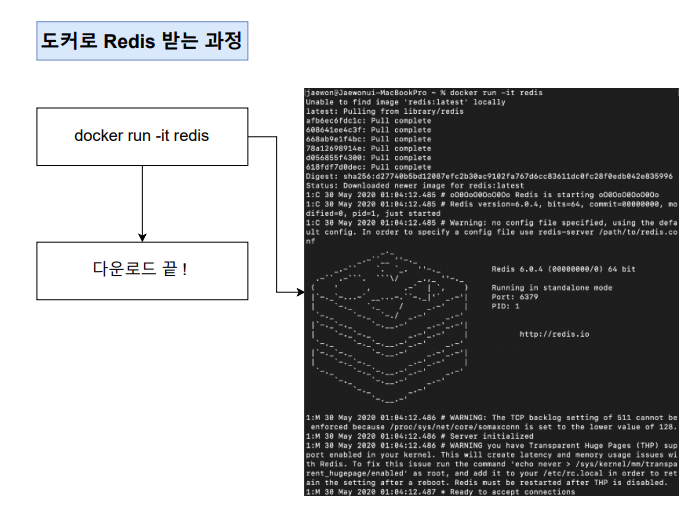

# Docker & CI

# Docker Basic

[Docker #1](Docker/Docker_1.txt)

- Docker를 쓰는 이유
    - 패키지나 프로그램을 설치하는 과정에서 각기 다른 운영체제에 따른 복잡함이 커진다.
    - Docker는 위 과정에서 복잡함을 줄이고, 예상치 못한 에러를 방지하기 위해 사용된다.
        
        
        
- Docker란 무엇인가?
    - 컨테이너를 사용하여 응용프로그램을 더 쉽게 만들고 배포하고 실행할 수 있도록 설계된 도구이며, 컨테이너 기반의 오픈소스 가상화 플랫폼이며 생태계이다.
        
        
        
    - 위 이미지처럼 컨테이너 안에 다양한 프로그램, 실행환경을 컨테이너로 추상화하고 동일한 인터페이스를 제공하여 프로그램의 배포 및 관리를 단순하게 해 주는 것이 컨테이너이다.
    - 컨테이너를 이용함으로써 프로그램을 손쉽게 이동 배포 관리를 할 수 있게 해주며, AWS, Azure, Google Cloud등 다양한 환경에서 실행 가능하게 도와준다.
- Docker 이미지와 Docker 컨테이너 정의
    
    
    
    - 컨테이너는 코드와 모든 종속성을 패키지화하여 응용 프로그램이 한 컴퓨팅 환경에서 다른 컴퓨팅 환경으로 빠르고 안정적으로 실행되도록 하는 소프트웨어 표준 단위다.
        - 컨테이너는 간단하고 편리하게 프로그램을 실행 시켜주는 것.
    - 컨테이너 이미지는 코드, 런타임, 시스템 도구, 시스템 라이브러리 및 설정과 같은 응용 프로그램을 실행하는 데 필요한 모든 것을 포함하는 가볍고 독립적이며 실행 가능한 소프트웨어 패키지이다.
        - 컨테이너 이미지는 런타임에 컨테이너가 되고 Docker 컨테이너의 경우 Docker 엔진에서 실행될 때 이미지가 컨테이너가 된다.
        - 리눅스와 Window 기반 애플리케이션 모두에서 사용할 수 있는 컨테이너화된 소프트웨어는 인프라에 관계없이 항상 동일하게 실행된다.
        - 컨테이너는 소프트웨어를 환경으로부터 격리 시키고 개발과 Staging차이에도 불구하고 균일하게 작동하도록 보장한다.
            - Staging : Stage에 따라 각 단계를 구분하여 프로젝트가 진행되는 것.
    - 정리하자면 
    Docker 이미지는 프로그램을 실행하는데 필요한 설정이나 종속성을 가지고 있으며, 
    Docker 이미지를 이용해서 컨테이너를 생성하며, 
    Docker 컨테이너를 이용하여 프로그램을 실행한다.
- Windows를 위한 Docker 설치
    
    
    
    
    
    
    
    
    
- Docker를 사용할 때의 흐름
    1. 먼저 Docker CLI에 Command를 입력한다.
    2. Docker 서버 (Docker Daemon)이 그 Command를 받아 그것에 따라 이미지를 생성하거나, 컨테이너를 실행하는 등의 모든 작업을 하게 된다.
        
        
        
        
        
    - CLI에서 docker run hello-world 실행 시의 흐름은 아래와 같다.
        1. Docker 클라이언트에 Command를 입력, 클라이언트에서 Docker 서버로 요청을 보낸다.
        2. 서버에서 hello-world라는 이미지가 Local cache 되어 있는지 확인
        3. 현재 이미지가 없기에 Unable to find image ~ 문구가 표시된다. 
        4. 이후 이미지가 저장되어 있는 Docker Hub에서 해당 이미지를 가져오고(Pulling) Local에  Cache로 보관한다. 
        5. 그 후 해당 이미지를 이용해서 컨테이너를 생성한다.
            
            
            
- Docker와 기존의 가상화 기술과의 차이를 통한 컨테이너 이해
    - Hypervisor 기반의 가상화 기술이 나오기 전
        - 하나의 서버를 하나의 용도로만 사용한다.
        - 남는 서버 공간은 방치된다.
        - 하나의 서버에 하나의 운영체제, 하나의 프로그램 만을 운영한다.
        - 안정적이지만 비효율적이다.
    - Hypervisor 기반의 가상화 기술 출현 후
        - 논리적으로 공간을 분할하여 VM이라는 독립적인 가상 환경의 서버 이용 가능
        - Hypervisor는 호스트 시스템에서 다수의 게스트 OS를 구동할 수 있게 하는 소프트웨어이자 하드웨어를 가상화 하면서 하드웨어와 각각의 VM을 모니터링 하는 중간 관리자이다.
    - Hypervisor는 Native Hypervisor와 Hosted Hypervisor로 나뉜다. 둘의 차이는 아래와 같다.
        
        
        
        
        
    - Hypervisor 기반의 VM 구조는 다음과 같다.
        
        
        
    - 하드웨어의 각각의 Core가 독립된 자원을 할당 받아 Hypervisor를 통해 다른 VM을 구동한다.
    - 즉, Hypervisor에 의해 구동 되는 VM은 각 VM마다 독립된 가상 하드웨어 자원을 할당 받기에, 논리적으로 분리 되어 있어서 한 VM에 오류가 발생해도 다른 VM에 퍼지지 않는다는 장점이 있다.
        
        
        
    - Docker는 이러한 기존 가상화 기술에서 나온 기술이다. 즉, Docker 컨테이너와 VM은 기본 하드웨어에서 격리된 환경 내에 애플리케이션을 배치하는 방법이라고 볼 수 있다.
        - Docker와 기존 VM과의 가장 큰 차이점은 격리된 환경에 대해 얼마나 격리를 시키는지에 대한 차이로 볼 수 있다.
    - VM과 비교했을 때, 컨테이너는 Hypervisor와 Guest OS가 필요하지 않아 더 가볍다.
        - Guest OS : 물리 머신 위에서 직접 동작하는 OS
    - 애플리케이션을 실행할 때 컨테이너 방식은 Host OS 위에 애플리케이션의 실행 패키지인 이미지를 배포하기만 하면 된다. 그러나 VM은 애플리케이션을 실행 하기 위해 VM을 띄우고 자원을 할당한 다음, Guest OS를 부팅, 애플리케이션을 실행 해야 되므로 훨씬 복잡하고 무겁게 실행을 해야 한다.
    - Docker 컨테이너에서 돌아가는 애플리케이션은 컨테이너가 제공하는 격리 기능 내부에 Sandbox가 있지만, 여전히 같은 Host의 다른 컨테이너와 동일한 kernel을 공유한다. 결과적으로, 컨테이너 내부에서 실행되는 프로세스는 Host System(모든 프로세스를 나열할 수 있는 권한이 있는)에서 볼 수 있다.
        - Sandbox: 컨테이너 내에서 실행되는 애플리케이션을 격리 시키기 위한 보안 기능.
    - VM과 함께 VM 내부에서 실행되는 모든 것은 Host OS 또는 Hypervisor와 독립되어 있다. VM 플랫폼은 특정 VM에 대한 가상화 프로세스를 관리하기 위해 프로세스를 시작하고, Host System은 그것의 하드웨어 자원의 일부를 VM에 할당한다.
        - 그러나 VM과 근본적으로 다른 것은 시작 시간에 이 VM 환경을 위해 새롭고, 이 특정 VM만을 위한 kernel을 부팅하고 (흔히 다소 큰) OS 프로세스 세트를 시작한다는 것이다. 이것은 응용 프로그램만 포함하는 일반적인 컨테이너보다 VM의 크기를 훨씬 크게 만든다.
            - 즉, VM은 비교적 간단하지만, 느리다.
        
        
        
    - 컨테이너의 격리는 리눅스의 Cgroup(control groups)과 Namespaces을 통해 이루어진다. Cgroup과 Namespaces는 컨테이너와 Host에서 실행되는 다른 프로세스 사이에 벽을 만드는 리눅스 Kernul 기능이다.
        - C Group
            - CPU, 메모리, Entwork Bandwith, HID i/o등 프로세스 그룹의 시스템 리소스 사용량을 관리
                - 어떤 애플리케이션의 사용량이 너무 많다면 그 애플리케이션 같은 것을 C Group에 집어 넣어 CPU와 메모리 사용을 제한할 수 있다.
        - Namespaces
            - 하나의 시스템에서 프로세스를 격리 시킬 수 있는 가상화 기술
            - 별개의 독립된 공간을 사용하는 것처럼 격리된 환경을 제공하는 경량 프로세스 가상화 기술
                
                
                
- 이미지로 컨테이너 만들기
    - 이미지는 응용 프로그램을 실행하는데 필요한 모든 것을 포함하고 있다.
        - 이 때 필요한 것은 다음과 같다.
            - 컨테이너가 시작 될 때 실행되는 명령어
                - run kakaotalk
            - 파일 Snapshot
                - Snapshot : Directory나 파일을 Copy한 것.
    - 이미지로 컨테이너를 만드는 순서는 다음과 같다.
        1. Docker 클라이언트에 Docker run<이미지>를 입력한다.
        2. Docker 이미지에 있는 파일 Snapshot을 컨테이너 하드 디스크에 옮겨 준다.
            
            
            
        3. 이미지에서 가지고 있는 명령어 (컨테이너가 실행될 때 사용될 명령어)를 이용해서 대상(hello world) 을 실행시킨다.
            
            
            
- C-group, Namespaces Docker 환경에서 쓸 수 있는 이유
    
    
    
    - 컨테이너를 격리 시킬 수 있는 이유는 Cgroup과 namespaces를 이용하기 때문이다. 하지만 Cgroup과 namespaces는 Linux 환경에서 사용되는 것이며, Docker는 Linux 환경 뿐만이 아닌 MacOs, Window에서도 사용 가능하다.
    - 이는 docker가 Linux VM을 통해 Linux 환경에서 작동하기 때문이다. 이는 CLI에서 Docker version을 입력 시, 아래와 같이 확인 가능하다. (Window 환경에서 시행)
        
        
        
    - 즉, Docker의 OS 환경은 아래와 같은 방식으로 이루어진다.
    
    
    

# Basic Docker Client Commands

[Docker #2](Docker/Docker_2.txt)

- Docker 이미지 내부 파일 구조 보기
    
    
    
    - Docker의 작동 순서는 다음과 같다.
        1. Docker Client에 명령어 입력 후 Docker 서버로 보낸다
        2. Docker Server에서 컨테이너를 위한 이미지가 이미 Cashe가 되어 있는지 확인
        3. Cashe된 이미지가 없다면 Docker Hub에서 받아온다. 있다면 해당 미지로 컨테이너를 생성한다.
    
    
    
    - 이미지로 컨테이너를 생성하는 순서는 다음과 같다.
        1. 먼저 SnapShrt 되어있는 파일을 컨테이너의 하드 디스크 부분에 올린다.
        2. 시작 커맨드를 이용하여 애플리케이션을 실행한다.
    
    
    
    - 이미지 내부의 파일 시스템 구조는 위와 같다.
    - ls Command는 현재 Directory의 파일 리스트를 보여주는 명령어로, cmd 상에서는 아래와 같이 확인된다.
        
        
        
    - 위 Docker 명령어는 아래와 같은 흐름으로 시행된다.
        1. Alpine 이미지를 이용해서 컨테이너 생성
        2. 생성 시 Alpine 이미지 안에 있던 파일 Snapshrt들이 컨테이너 안에 있는 하드 디스크로 다운로드
        3. 이미지 이름 뒤에 다른 명령어를 더 붙일 경우, 이미지 안에 들어있는 기본 Command는 무시되고 해당 명령어(ls)가 실행된다. 
            
            
            
            
            
            
            
    - 단, 이는 Alpine 이미지 파일 Snapshot 안에 이미 ls를 사용 가능하게 하는 파일이 있기 때문에 실행 가능하며, ls를 사용 가능하게 하는 파일이 없을 경우에는 Error가 발생한다.
        
        
        
- 컨테이너들 나열하기
    - 현재 실행 중인 컨테이너를 보기 위한 명령어는 ps다.
        
        
        
    - 실행 중인 컨테이너가 있을 때, CMD에서 docker ps 명령어를 시행하면 아래와 같은 결과가 출력된다.
        
        
        
        1. CONTAINER ID 
            - 컨테이너의 고유한 아이디 Hash 값. 일부분만 표출된다.
        2. IMAGE
            - 컨테이너 생성 시 사용한 Docker 이미지
        3. COMMAND
            - 컨테이너 시작 시 실행될 명령어. 대부분 이미지에 내장되어 있으므로 별도 설정은 필요 없다.
        4. CREATED
            - 컨테이너가 생성된 시간
        5. STATUS
            - 컨테이너의 상태. 실행 중은 Up, 종료는 Exited, 일시 정지는 Pause
        6. PROTS
            - 컨테이너가 개방한 포트와 Host에 연결한 포트
            - 특별한 설정을 하지 않은 경우 출력되지 않는다.
        7. NAMES
            - 컨테이너의 고유한 이름
            - 컨테이너 생성 시 —name 옵션으로 이름을 설정하지 않으면 Docker 엔진이 임의로 형용사와 명사를 조합해 설정한다. id와 마찬가지로 중복되지 않으며 docker rename 명령어로 이름을 변경할 수 있다.
                - docker rename [original-name] [changed-name]
    - 원하는 항목만 보기 위한 명령어
        - docker ps —format ‘table{{.Names}}\table{{.Image}}’
    - 모든 컨테이너 나열
        - docker ps -a
- Docker 컨테이너의 생명 주기
    
    
    
    - docker run<이미지 이름> Cammand는 Docker create<이미지 이름> + Docker start<컨테이너 아이디/이름>으로 이루어져 있다.
        
        
        
    - docker create는 이미지의 파일 Shanpsort을 컨테이너의 하드 디스크에 올려주고,
        
        
        
    - docker start에서 실행 중인 프로세스에 컨테이너의 아이디/이름을 통해 올려진다.
        
        
        
    - 이 때 -a(attach)를 붙이지 않을 경우, 생성 후 화면에 컨테이너의 내용이 표출되지 않는다.
- Docker Stop vs Docker Kill
    - Docker는 stop과 kill로 컨테이너를 중지할 수 있다. stop과 kill의 차이는 아래와 같다.
        - Stop은 Gracefully하게 작업을 중지한다. 그동안 하던 작업들이 있다면 해당 작업을 완료한 뒤에 컨테이너를 중지 시킨다.
        - Kill은 이전 수행 작업을 포함, 어떠한 것도 기다리지 않고 바로 컨테이너를 중지 시킨다.
            
            
            
- 컨테이너 삭제하기
    
    
    
    - Docker 컨테이너의 삭제는 아래의 명령어들을 이용하여 이루어진다.
        - docker rm<아이디/이름>
            - 실행 중인 컨테이너는 먼저 중지한 후 삭제 가능하다.
        - docker rmi<이미지 id>
            - 이미지를 삭제할 때 사용한다.
        - docker system prune
            - 사용하지 않는 컨테이너, 이미지, 네트워크를 모두 삭제할 때 사용한다.
            - 실행 중인 컨테이너에는 영향을 주지 않는다.
- 실행 중인 컨테이너에 명령어 전달
    - 이미 실행 중인 컨테이너에 명령어를 전달할 때는 아래의 명령어를 사용한다.
        - docker exec <컨테이너 아이디>
    - docker run과의 차이점은 run이 새로 컨테이너를 만들어서 실행한다면, exec는 이미 실행 중인 컨테이너에 명령어를 전달한다는 점이다.
    - 현재 실행되고 있지 않은 컨테이너에는 exec를 통해 접근할 수 없다.
        - (애초에 실행되지 않았기에 컨테이너 아이디를 알 수 없다.)
- Redis를 이용한 컨테이너 이해
    - Redis는 아래와 같이 작동된다.
        
        
        
        - CLI 환경에서 docker run redis 명령어를 통해 Redis 서버를 시행한다.
        - 이 때 주의할 점은 해당 터미널(redis가 실행되고 있는) 환경에서는 별도 명령어를 사용할 수 없기에, 다른 터미널에서 exec 명령어를 통해 실행되고 있는 컨테이너에 접근해야 한다.
            - 단, 다른 터미널에서 Redis-cli 명령어를 통해 Redis 클라이언트를 실행할 수는 없다. 이는 동작 중인 Redis 컨테이너가 별도의 도커 컨테이너로 격리되어 있기에 접근할 수 없기 때문이다. 따라서 exec 명령어를 사용해야 한다.
            - 즉, 접근 명령어는 docker exec -it <redis container id> redis-cli
                - i :interactive, t: terminal
                - -it 명령어를 붙여주지 않을 경우에는 redis-cli를 시행한 후 바로 컨테이너 밖으로 빠져나온다.
                    
                    
                    
- 실행 중인 컨테이너에서 터미널 생활 즐기기
    - 현재 실행 중인 컨테이너에 명령어를 전달할 때 컨테이너 안에 Shell이나 터미널 환경으로 접속을 함으로서 명령어를 간소화할 수 있다.
        - docker exec -it <컨테이너 아이디> <command> 에서 <command> 전 생략 가능
            
            
            
    - 컨테이너를 Shell 환경으로 접근할 때는 실행 중인 터미널에 exec를 이용해 접근한 후 명령어 부분에 sh를 입력한다.
        
        
        
    - 이후 명령어 만으로 해당 컨테이너에서 작업을 수행할 수 있다.
        - touch new-file
            - new-file이라는 이름의 파일 생성
        - export hello=hi
            - 변수 생성
        - echo $hello
            - 변수 출력
    - 해당 터미널 환경에서 나올 때는 Control + D 를 사용한다.

# Create a Docker Image

[Docker #3](Docker/Docker_3.txt)

- Docker 이미지 생성하는 순서
    - Docker 이미지는 컨테이너를 만들기 위해 필요한 설정이나 종속성을 갖고 있는 소프트웨어 패키지이다.
    - Docker 이미지는 Dockerhub에 이미 다른 사람들이 만들어 놓은 것을 이용할 수도, 직접 Docker 이미지를 만들어서 사용할 수도, 직접 만든 것을 Dockerhub에 업로드할 수도 있다.
        
        
        
    - Docker 이미지를 생성하는 명령어는 다음과 같다.
        - docker create <이미지 이름>
    - Docker 이미지가 생성되는 순서는 아래와 같다.
        
        
        
- Dockerfile 만들기
    - Docker file이란 Docker 이미지를 만들기 위한 설정 파일이며, 컨테이너가 어떻게 행동해야 하는지에 대한 설정들을 정의해 주는 곳이다.
    - 도커 파일은 다음과 같은 순서로 생성한다.
        1. 베이스 이미지를 명시한다. (파일 Snapshot에 해당)
        2. 추가적으로 필요한 파일을 다운 받기 위한 몇 가지 명령어를 명시해준다. (File Snapshot에 해당)
        3. 컨테이너 시작 시 실행 될 명령어를 명시한다. (시작 시 실행 될 명령어에 해당
    - 베이스 이미지는 여러 개의 Layer로 되어 있는 Docker 이미지에서 이미지의 기반이 되는 부분이다.
        
        
        
    - VsCode를 이용한 Docker File의 생성은 다음과 같은 흐름으로 진행된다.
        1. Docker 파일을 만들 폴더 생성
        2. 에디터로 해당 폴더 실행
        3. dockerfile이라는 이름으로 파일 생성
        4. 기초적인 토대 명시
            
            
            
            - FROM
                - 이미지 생성 시 기반이 되는 이미지 레이어
                - <이미지 이름>:<태그> 형식으로 작성한다.
                - 태그를 붙이지 않을 경우 자동으로 가장 최신 것으로 다운로드 된다.
                    - ex) ubuntu:14.04
            - RUN
                - Docker 이미지가 생성되기 전에 수행할 Shell Command
            - CMD
                - 컨테이너가 시작되었을 때 실행할 실행 파일 또는 Shell Script.
                - 해당 명령어는 DockerFile 내 1회만 사용 가능하다.
        5. 베이스 이미지를 실제 값으로 추가한다.
        6. 베이스 이미지는 ubuntu를 사용해도 되고 centos 등을 사용해도 되지만 hello를 출력하는 기능은 굳이 사이즈가 큰 베이스 이미지를 사용할 필요가 없기에 사이즈가 작은 alpine 베이스 이미지를 사용한다.
        7. hello 문자를 출력해주기 위해 echo를 사용해야 하는데 이미 alpine 안에 echo를 사용하게 할 수 있는 파일이 있기에 RUN 부분은 생략한다
        8. 마지막으로 컨테이너 시작 시 실행 될 명령어 echo hello를 적어준다.
            
            
            
- Docker 파일로 Docker 이미지 만들기
    - Docker 파일에 입력된 것들이 Docker Client에 전달되어 Docker Server가 인식하게 하려면
        - docker build ./ 또는 docker build .
    - 명령어를 사용해야 한다.
    - 이 때 Build 명령어는 해당 directory 내에서 dockerfile이라는 파일을 찾아 Docker Client에 전달 시켜준다.
    - docker build 뒤에 ./ 와 .는 둘 다 현재 directory를 가리킨다.
        - 전자를 더 권장한다.
    
    
    
    - Docker의 Build는 임시 컨테이너를 생성 후 삭제하는 과정을 거친다.
    - 이는 Alpine 이미지를 가져온 후, Alpine 이미지에 있는 파일 Snapshot을 임시 컨테이너 생성 시 하드 디스크에 파일 시스템 Snapshot을 추가한 다음,
        
        
        
    - 생성된 임시 컨테이너를 토대로 새로운 Alpine 이미지를 생성하기 때문이다.
        
        
        
    - 즉, 베이스 이미지에서 다른 종속성이나 새로운 Command를 추가 할 때는 임시 컨테이너를 만든 뒤  그 컨테이너를 토대로 새로운 이미지를 만든다. 그 뒤 임시 컨테이너는 지워준다.
    
    
    
- 내가 만든 이미지 기억하기 쉬운 이름 주기
    - Docker 파일로 만든 이미지 아이디는 Hash 값(SHA-256)으로 되어 있기에 관리하기 어렵다.
    - 이를 관리하기 위한 방법이 IP Address 대신 Domain 이름을 관리하는 것처럼 만든 Docker 이미지에 이름을 부여할 수 있다.
        
        
        
    - Ps, 대문자는 사용할 수 없다.
        
        
        

# Make Node.js Application Using Docker

[Docker #4](Docker/Docker_4.txt)

- Section 설명
    - 앞으로의 강의에 대한 설명
- Node.js App 만들기
    - Node.js로 앱을 만들기 위한 순서는 다음과 같다.
        
        
        
    - npm init을 통해 package.json 파일을 생성한다. 이후 dependencies에 express 문법을 추가한다.
        
        ```
        {
          "name": "dockerfile-folder",
          "version": "1.0.0",
          "description": "",
          "main": "server.js",
          "scripts": {
            "test": "echo \"Error: no test specified\" && exit 1"
          },
          "dependencies": {
            "express":"4.17.1"
          },
          "author": "keaunsolNa",
          "license": "ISC"
        }
        ```
        
    - Node.js의 진입점은 npm init을 통해 설정한 이름으로 생성한다.
        
        ```
        const express = require('express');
        
        // Constants
        const PORT = 8080;
        const HOST = '0.0.0.0';
        
        // APP
        const app = express();
        app.get('/', (req, res) => {
            res.send("Hellow World")
        });
        
        app.listen(PORT);
        console.log('Running on http://&{HOST}:${RORT}');
        ```
        
- Dockerfile 작성하기
    - Node.js App을 Docker 환경에서 실행하려면 먼저 이미지를 생성, 그 이미지를 이용해서 컨테이너를 실행한 후 컨테이너 안에서 Node.js App을 실행해야 한다.
        
        
        
    - npm은 Node.js로 만들어진 모듈을 웹에서 받아서 설치하고 관리해주는 프로그램.
    - npm install은 package.json에 적혀있는 종속성을 웹에서 자동으로 다운 받아 설치해주는 명령어.
        
        
        
    - Node Web Server를 작동시키려면 node + 엔트리 파일 이름을 입력해야 한다.
- Package.json 파일이 없다고 나오는 이유
    - Docker 파일을 Build할 때 Node 베이스 이미지로 임시 컨테이너를 생성한다. 그리고 그 임시 컨테이너로 이미지를 만든다. 하지만 해당 임시 컨테이너에는 package.json이나 server.js이 Node 이미지 파일 Snapshot에 포함되어 있지 않다. 그래서 package.json 등이 컨테이너 밖에 있는 상황이 된 것이다.
        
        
        
    - npm install 시 컨테이너 안에서만 파일을 탐색하기에 설정 파일들을 찾을 수 없다는 에러가 발생한다.
        
        
        
    - 이러한 이유로 COPY를 통해 필요한 설정 파일들을 컨테이너 안으로 넣어줘야 한다.
        
        
        
        
        
- 생성한 이미지로 애플리케이션 실행 시 접근이 안 되는 이유 (PORT MAPPING)
    - 이미지를 만들 때 Local에 있는 파일들을 컨테이너에 복사하는 과정이 필요하다. 그것과 비슷하게 네트워크도 Local 네트워크에 있던 것을 컨테이너 내부에 있는 네트워크에 연결하는 과정(Port Mapping)이 필요하다.
        
        
        
    - 이 같은 문제가 발생하는 이유는 npm install 시 package.json에 접근하지 못 했던 것과 유사하게, 컨테이너의 PORT 번호와 브라우저의 PORT 번호 사이가 격리되어있기 때문이다.
        
        
        
        
        
- Working Directory 명시해주기
    - WORKDIR은 이미지 안에서 애플리케이션 소스 코드를 가지고 있을 디렉터리를 생성하는 것이며, 해당 디렉터리가 애플리케이션의 working directory가 된다.
    - working directory가 따로 있어야 하는 이유는 디렉터리의 정돈, 원래 이미지에 있던 파일과 이름이 중복될 경우 폴더가 덮어 씌워지는 문제를 방지하기 때문이다.
        
        
        
        
        
    - 위 방식처럼 WORKDIR을 지정 시, shell 환경에서 접근 할 경우 기본 경로가 WORKDIR에서 지정한 경로로 설정되어 있음을 확인할 수 있다.
        
        
        
- 애플리케이션 소스 변경으로 다시 Build하는 것에 대한 문제점
    - 기존의 방식으로는 소스 코드 변경 시 변경된 내역이 실시간으로 반영되지 않고, 매번 Build 해줘야 하는 번거로움이 있다.
        
        
        
    - 또한, 변경 사항이 생길 때마다 Build 과정을 새롭게 해 주는 경우, 변경된 내역 뿐만 아니라 node_module에 있는 종속성을 포함하여 모든 패키지 내용을 다시 다운로드, 이미지를 생성하고 다시 컨테이너를 실행 시켜야 하는 문제가 있다.
- 애플리케이션 소스 변경으로 재 Build 시 효율적으로 하는 법
    - 모듈의 다운로드는 모듈에 변화가 생겨야만 다시 받아야 하지만, 현재 방식으로는 소스 코드에 조금의 변화만 생겨도 모듈 전체를 다시 받는 문제점이 있었다.
    - 이는 RUN npm install 전 단계에서 COPY 할 때, 조금이라도 바뀐 것이 있다면 npm install이 다시 실행되기 때문이다.
        - 변경 사항이 없을 때는 Cache를 사용한다.
            
            
            
    - 그렇기에 RUN npm install 전 단계에서 COPY할 때, 오직 module에 대한 것만 하도록 지정해야 한다. 그 이후 RUN npm install 이후에 다시 모든 파일을 COPY해 줘야 한다.
        
        
        
- Docker Volumn에 대하여
    - 지금까지 사용하던 COPY 방식은 Local에 있는 파일을 Docker 컨테이너에 복사해서 업로드 하는 방식이었다.
    - 이와 같은 방식은 소스를 변경할 때마다 변경된 소스 부분을 COPY 한 후 이미지를 다시 Build, 그 이후 컨테이너를 다시 실행해야 소스가 화면에 반영이 되는 방식이다.
        
        
        
    - 이는 시간 소요와 이미지를 너무 많이 Build하는 방식이다.
    - 이와 같은 상황을 피하기 위한 방법이 Docker의 Volume.
    - Volume은 COPY와 달리, HOST Directory에 있는 파일들을 Local에서 Mapping 해서 사용하는 방식으로 이루어진다.
        
        
        
    - Volume을 사용해서 애플리케이션을 실행하는 방식은 다음과 같다.
        
        
        
    - 이처럼 Volume을 사용할 경우, Volume에서 참조하려 하지만, Local에는 존재하지 않는 경우, 해당하는 부분만 새로 이미지를 Build하게 된다.
        - node_module : package.json에 있는 모든 종속성이 관리되는 곳. Local에는 존재하지 않고, 컨테이너가 Build하는 과정에서 컨테이너 안에서 생성된다.

# Docker Compose

[Docker #5](Docker/Docker_5.txt)

- Docker Compose란 무엇인가?
    - Docker Compose는 다중 컨테이너 Docker 애플리케이션을 정의하고 실행하기 위한 도구다.
    - 이번 Chapter에서 만들 애플리케이션의 구조는 아래와 같다.
        
        
        
- 애플리케이션 소스 작성하기
    - Redis(Remote Dictionary Server)는 메모리 기반의 키-값 구조 데이터 관리 시스템이며, 모든 데이터를 메모리에 저장하고 빠르게 조회할 수 있는 비 관계형 데이터베이스(NoSql)이다.
        - Redis를 쓰는 이유는 메모리에 저장을 하기 때문에 DBMS보다 데이터 I/O에 있어 훨씬 빠른 속도를 얻을 수 있으며, 메모리에 저장하더라도 데이터를 영속적으로 보관하기 때문이다. 그렇기에 서버를 재 부팅 해도 데이터를 유지할 수 있는 장점이 있다.
    - Node.js 환경에서 Redis 사용 방법
        1. Redis-server 작동
        2. Redis 모듈 다운로드
        3. Redis에서 제공하는 createClient() 함수를 이용, redis.createClient로 Redis Client를 생성한다. 
            - 이 때 Redis Server가 작동하는 곳과 Node.js App이 작동하는 곳이 다른 곳이라면, host 인자와 port 인자를 명시해야 한다.
                
                
                
                - Redis의 기본 Port는 6379
    - Docker 환경에서 Redis Client 생성 시 주의 사항
        - Docker를 사용하지 않는 환경에서는 Redis 서버가 작동하고 있는 곳의 Host 옵션을 URL로 작성하지만, Docker Compose를 사용할 때는 host 옵션을 docker-compose.yml 파일에 명시한 컨테이너 이름으로 부여해야 한다.
            
            
            
    - 전체 애플리케이션 소스
        
        ```
        const express = require("express");
        const redis = require("redis");
        //레디스 클라이언트 생성 
        const client = redis.createClient({
            host: "redis-server",
            port: 6379
        })
        
        const app = express();
        
        //숫자는 0 부터 시작합니다.
        client.set("number", 0);
        
        app.get('/', (req, res) => {
            client.get("number", (err, number) => {
                //현재 숫자를 가져온 후에 1씩 올려줍니다.
                res.send("숫자가 1씩 올라갑니다. 숫자: " + number)
                client.set("number", parseInt(number) + 1)
            })
        })
        
        app.listen(8080);
        console.log('Server is running');
        ```
        
- Dockerfile 작성하기
    - 저번 Node.js App을 위한 Dockerfile과 동일하다.
- Docker Containers간 통신 할 때 나타나는 에러
    - 애플리케이션의 실행은 다음의 방식으로 이루어진다.
        
        
        
    - 즉, Redis Client가 작동하려면 Redis Server가 작동 중이어야 하기 때문에 먼저 Redis Server를 위한 컨테이너를 실행 후, Node.js를 위한 컨테이너를 실행해야 한다.
    - 하지만 docer run을 통해 실행할 경우, 아래와 같은 에러가 발생한다.
        
        
        
    - 이는 Node Js App과 Redis Client가 하나의 컨테이너, Redis Server가 하나의 컨테이너로 서로 다른 컨테이너에 있는데, 이렇게 컨테이너 사이에는 아무런 설정 없이는 접근을 할 수 없어 Node js App에서 Redis Server에 접근을 할 수 없기 때문이다.
        
        
        
    - 이처럼 Mutil 컨테이너 상황에서 쉽게 네트워크를 연결하기 위해 Docker Compose를 이용한다.
- Docker Compose 파일 작성하기
    - Docker Compose를 사용하기 위해선 yml 형식의 Docker Compose 파일을 작성해야 한다.
        - yml : YAML ain’t markup language의 약자로, 일반적으로 구성 파일 및 데이터가 저장되거나 전송되는 응용 프로그램에서 사용된다.
    - Docker-compose 파일 구조
        
        
        
    - 실행은 docker-compose up 명령어를 사용한다.
    - Docker Compose를 이용하여 앱을 실행 할때는 이전까지와는 달리 이미 모든 정보들이 compose 파일 안에 들어있기에, docker compose up 명령어 만으로 작동한다.
        - docker-compose 기반 명령어
            
            
            
            
            
- Docker Compose로 컨테이너를 멈추기
    - Docker Compose로 실행 중인 컨테이너를 종료하려면 다른 터미널에서 docker-compose down 명령어를 수행해야 한다.
    - 다른 터미널을 작동하기 번거로울 때, docker-compose up -d 명령어로 docker compose를 실행한다면 detached 모드로 App을 백그라운드에서 실행할 수 있다. 단, 이럴 경우 App에서 나오는 output은 터미널에서 표출되지 않는다.
        
        
        

# **Deploying a Simple Application**(D**evelopment Environment**)


[Docker #6](Docker/Docker_6.txt)

- 섹션 설명
    - 앞으로의 4개의 Section을 통해 2가지 애플리케이션을 만든다. 단일 컨테이너 애플리케이션(Single Container)와 멀티 컨테이너 애플리케이션(Multi Container)
        
        
        
        
        
    - Single Container는 React와 Docker만을 이용하며, Multi Conainer는 React와 Node, Database를 이용하여 진행한다.
        
        
        
- React App 설치하기
    - npx create-react-app을 통해 React를 설치한다.
        
        
        
    - React의 실행, 테스트, 배포는 아래의 명령어들을 통해 가능하다.
    
    
    
- Docker를 이용하여 React App 실행하기
    - Docker로 애플리케이션을 실행하기 위해선 아래의 과정이 필요하다.
        
        
        
    - 현재까지는 Dockerfile을 한 가지만 만들었지만, Dockerfile은 개발 단계와 실제 배포 후를 위한 것을 따로 작성하는 편이 좋다.
    - 개발 단계를 위한 Dockerfile은 Dockerfile.dev 파일로 작성한다.
        
        
        
        
        
    - 단, Dockerfile.dev 파일을 build./ 할 경우, unable to evaluate symlink Error가 발생한다. 그 이유는 원래 이미지를 Build할 때 해당 Directory만 정해주면 dockerfile을 자동으로 찾아 Build했던 것과 달리, 현재는 Dockerfile은 없고 dockerfile.dev 만 있기 때문이다.
        
        
        
    - 해결책은 임의로 Build시 어떠한 파일을 참조할 지 알려주면 된다.
        
        
        
    - 한 가지 팁은 이미지 Build 시 npm install로 모든 모듈들을 Docker 이미지에 다운 받기에, Locle에 있는 node_modules 폴더를  지워주는 방법이 있다. (Build 시간 단축)
        
        
        
- 생성된 Docker 이미지로 React App 실행해보기
    - 이전 강의에서 생성한 Docker 이미지를 docker run으로 실행할 경우, Port Mapping이 이루어지지 않아 접속이 불가능하다.
        
        
        
    - 해결 방법은 -it와 -p 명령어를 통해 Port Mapping을 해 주면 된다.
        
        
        
- Docker Volumn을 이용한 소스 코드 변경
    - 이전 강의에서 했던 것과 동일하게, COPY가 아닌 VOLUME을 이용하여 이미지를 다시 빌드 하지 않아도 변경된 소스 부분이 애플리케이션에 반영되도록 한다.
        
        
        
- Docker Compose로 좀 더 간단하게 App 실행해보기
    - 앞서 했던 것과 동일하게, Docker-compose.yml 파일을 통해 간단하게 Docker를 실행할 수 있게 한다.
        
        
        
    - 실행 명령어 역시 동일하다. docker-compose up
- React App 테스트 하기
    - React 환경에서 테스트는 npm rn test를 통해 이루어진다.
    - Docker 환경에서 테스트는 아래의 방식으로 이루어진다.
        
        
        
    - Volumn을 통해 소스 코드 변경을 Build 없이 반영한 것처럼, test도 Compose 파일에 구문을 추가함으로서 Build 없이 반영되게 할 수 있다.
        
        
        
    - 위의 방식으로 yml 파일에 구문을 추가할 경우, App을 실행할 때 두 개의 컨테이너를 다 시작하게 되어 먼저 React App을 실행한 뒤, 그 App을 Test하는 과정도 이루어진다.
- 운영 환경을 위한 Nginx
    - 개발 환경에서 React가 실행되는 과정은 아래와 같지만
        
        
        
    - 운영 환경에서 React가 실행되는 과정은 아래와 같다.
        
        
        
    - 개발 환경 서버와 운영 환경 서버가 다른 이유는 운영 환경에서는 소스 변경 시 다시 반영이 이루어지는 등의 개발에 필요한 기능이 필요하지 않기에, Redis가 아닌 더 깔끔하고 빠른 Nginx를 웹 서버로 사용한다.
    - Nignx(Engine X) : HTTP 및 Reverse Proxy Server, Maile Proxy Server 및 일반 TCP/UDP Proxy Server.
- 운영 환경 Docker 이미지를 위한 Dockerfile 작성하기
    - 개발 환경의 Dockerfile과 운영 환경의 Dockerfile을 비교하면 다음과 같다.
        
        
        
    - 운영 환경을 위한 Dockerfile은 2가지 단계로 요약할 수 있다.
        1. Builder State : Builder File 생성
            
            
            
        2. Run State : Nginx를 가동하고 생성된 Build 폴더의 파일들을 웹 브라우저의 요청에 따라 제공
            
            
            

# **Deploying a Simple Application**(Test & Development)

[Docker #7](Docker/Docker_7.txt)

- Section 설명, Github에 소스 코드 올리기
    - 이번 Section의 목표는 전 강의에서 생성한 소스 코드를 Github에 배포한 후, Travis CI에서 소스를 가져간 후 소스 코드가 잘 작동되는지 Test, 성공 시 AWS에서 배포하는 과정까지 진행한다.
        
        
        
    - Github에 소스 코드를 올리는 방법은 아래와 같다. (Git 사용)
        
        
        
- Travis CI 설명
    - Travis CI는 Github에서 진행되는 오픈소스 프로젝트를 위한 지속적인 통합(Continuous Integration) 서비스다. 2011년 설립, 2012년에 급성장했으며 Ruby 언어만 지원하던 초기와 달리 현재 대부분의 개발 언어를 지원하고 있다.
    - Travis CI를 이용하면 Github Repository에 있는 프로젝트를 특정 이벤트에 따라 자동으로 테스트, Build하거나 배포할 수 있다. Private repository는 유료로 일정 금액을 지불하고 사용할 수 있다.
    - Travis CI의 흐름
        
        
        
        1. Local Git에 있는 소스를 Github 저장소에 Push
        2. Github master 저장소에 소스가 Push 되면 Travis CI에게 소스가 Push 되었다고 전달
        3. Travis CI는 Update된 소스를 Github에서 가져온다. 
        4. Github에서 가져온 소스의 테스트 코드를 실행
        5. 테스트 코드 실행 후 테스트가 성공하면 AWS 같은 호스팅 사이트로 보내 배포한다.
- Travis CI 이용 순서
    - Github에 Travis CI를 연결하는 순서는 다음과 같다.
        
        
        
        
        
    - Github에서 Travis CI로 소스를 전달하는 방법과, 어떻게 Test할지, 테스트가 성공 시 어떻게 AWS에 전달해서 배포할 것인지는 travis.yml 파일에서 설정한다.
        
        
        
- .travis.yml 파일 작성하기 (테스트까지)
    - Travis CI를 이용해서 테스트 코드를 실행하고 애플리케이션을 배포까지 해주기 위해선 travis.yml 파일을 작성해야 한다. 해당 파일은 다음과 같은 방식으로 작성한다.
        
        
        
        
        
    - 단, Travis는 현재 유료화 정책으로 인해 제대로 테스트하진 못 했다. 추후 Github을 통해 진행할 예정.
- AWS 알아보기
    - AWS로 배포 하는 순서는 다음과 같다.
        
        
        
    - EC2(Elastic Compute Cloud)
        - Amazon Elastic Compute Cloud(Amazon EC2)는 Amazon Web Services(AWS) Cloud에서 확장식 컴퓨팅을 제공한다. Amazon EC2를 사용하면 하드웨어에 선 투자할 필요가 없어 더 빠르게 애플리케이션을 개발하고 배포할 수 있다. Amazon EC2를 통해 원하는 만큼 가상 서버를 구축하고 보안 및 네트워크 구성과 스토리지 관리가 가능하다. 또한 Amazon EC2는 요구 사항이나 갑작스러운 인기 증대 등 변동 사항에 따라 신속하게 규모를 확장하거나 축소할 수 있어 서버 트래픽 예측 필요성이 줄어든다.
            - 한 대의 컴퓨터를 임대 하는 개념. 해당 컴퓨터에 OS를 설치하고 웹 서비스를 위한 프로그램들(웹 서버, DB)을 설치해서 사용한다.
            - 1대의 컴퓨터를 하나의 EC2 Instance라고 한다.
    - EB(Elastic BeanStalk)
        - AWS Elastic Beanstalk는 Apache, Nginx같은 친숙한 서버에서 Java, NET, PHP, Node.js, Python, Ruby, Go 및 Docker와 함께 개발된 웹 응용 프로그램 및 서비스를 배포하고 확장하기 쉬운 서비스이다.
        - 아래서 보는 도표와 같이 Elastic Beanstalk은 EC2 Instance나 데이터베이스 같이 많은 것들을 포함한 “환경”을 구성하며 만들고 있는 소프트웨어를 업데이트할 때마다 자동으로 이 환경을 관리해준다.
            
            
            
- Elastic Beanstalk 환경 구성하기
    - 새로운 Elastic Beanstalk 환경을 만드는 순서는 다음과 같다.
        
        
        
        
        
    - Elastic Beanstalk은 EC2 Instance, 데이터 베이스, 보안 그룹, Auto Scaling Group, Load Balancer등을 Control 한다.
    - AWS Elastic Beanstalk 환경은 트래픽의 양에 따라 Load Balancer가 EC2 Instance를 생성 및 소멸하는 방식으로 트래픽을 유지한다.
        
        
        
- .travis.yml 파일 작성하기 (배포 부분)
    - 이전에 생성한 .travis.yml 파일에 배포를 위한 부분을 추가한다.
        
        
        
        
        
        - S3는  파일을 저장해두는 서비스로, Travis CI에서 Elastic Beanstalk으로 전송할 때, Travis CI에서 가지고 있는 파일을 압축해서 S3에 보내는 과정을 먼저 선행 한다.
    - 하지만 현재의 방식으로는 인증이 되어 있지 않기에 Travis CI에서 AWS로 파일을 전송할 수 없다.
- Travis CI의 AWS 접근을 위한 API 생성
    - 소스 파일을 AWS에 전달하기 위한 접근 요건은 다음과 같다.
        
        
        
    1. IAM USER 생성
        - 사용자는 Root 사용자와 IAM 사용자가 있다.
            - Root 사용자
                - 현재 가입하여 사용하고 있는 AWS 계정, AWS의 서비스 및 Resource에 대한 모든 접근 권한이 있다.
            - IAM(Identity and Access Management) 사용자
                - 루트 사용자가 부여한 권한만 가지고 있다.
            
            
            
            
            
    - API 키를 Travis.yml 파일에 추가
        
        
        
    - PORT MAPPING은 Dockerfile에 EXPOSE 80을 넣어주는 것으로 간단하게 해결 가능.

# **Deploying a Complicated Application**(D**evelopment Environment**)

[Docker #8](Docker/Docker_8.txt)

- Section 설명
    - Multi Container App을 위한 설계는 다양하지만, 강의에서는 Nginx를 이용하여 클라이언트에서 오는 요청을 백엔드 서버와 프런트 서버로 나눠주는 구조, Nginx는 프런트 서버로만 사용하여 클라이언트에서 정적 파일을 요구할 때 제공해주는 구조 두 가지를 다룬다.
        - Nginx는 Static 파일을 제공 해주는 기능 외에도 프록시(Routing)을 해 주는 기능도 한다.
        
        
        
        
        
- Node JS 구성하기
    - 애플리케이션의 Node.js 부분을 구성한다. 설계도는 다음과 같다.
        
        
        
        
        
        
        
    - nodemon : 소스코드 변경 시 노드 서버를 재 기동하여 데몬 관리를 쉽게 해준다.
- React JS 구성하기
    - 애플리케이션의 React JS 부분을 구성한다.
        
        
        
        
        
        
        
        
        
- React App을 위한 Dockerfile 만들기
    
    
    
    - Docker 환경에서 실행할 수 있도록 Dockerfile 설정.
        
        
        
        
        
- Node App을 위한 Dockerfile 만들기
    - 앞서 React를 위한 Dockerfile과 마찬가지로, React를 위한 Dockerfile을 작성한다.
- DB에 관해서
    - DB 구성은 개발 환경에서는 Docker 환경을, 운영 환경에서는 AWS RDS 서비스를 이용한다.
        
        
        
        
        
- MYSQL을 위한 Dockerfile 만들기
    - 현재 Node App과 연결만 되어 있는 DB를 Docker 이미지를 이용해 설치해준다.
        
        
        
        
        
- NGINX을 위한 Dockerfile 만들기
    - 클라이언트에 요청을 보낼 때, 정적 파일을 원할 때는 Nginx의 설정에 따라 자동적으로 React JS로 보내주며, API 요청일 경우에는 Node JS로 보내준다.
    - Nginx가 요청을 나눠서 보내주는 기준은 location이 /로 시작하는지, /api로 시작하는지에 따라서 나눠준다.
    - /로 시작하면 React JS, /api로 시작하면 NodeJS로 보내준다.
    - Proxy 기능을 위한 Nginx 설정
        
        
        
        
        
- Docker Compose 파일 작성하기
    - 각각의 컨테이너를 위한 Dockerfile은 작성되었지만, 각각의 컨테이너들은 모두 격리되어있기에 Compose를 통한 통합 과정이 필요하다.
    - docker-compose.yml 파일을 통해 수행한다.
        
        
        
        
        
        
        
    - 소스는 다음과 같다.
        
        ```yaml
        version: "3"
        services:
          frontend:
            build:
              dockerfile: Dockerfile.dev
              context: ./frontend
            volumes:
              - /app/node_modules
              - ./frontend:/app
            stdin_open: true
            
          nginx:
            restart: always
            build:
              dockerfile: Dockerfile
              context: ./nginx
            ports:
              - "3000:80"
        
          backend:
            build:
              dockerfile: Dockerfile.dev
              context: ./backend
            container_name: app_backend
            volumes:
              - /app/node_modules
              - ./backend:/app
        
          mysql:
            build: ./mysql
            restart: unless-stopped
            container_name: app_mysql
            ports:
            - "3306:3306"
            volumes:
              - ./mysql/mysql_data:/var/lib/mysql
              - ./mysql/sqls/:/docker-entrypoint-initdb.d/
            environment:
              MYSQL_ROOT_PASSWORD: keaunsol
              MYSQL_DATABASE: myapp
        ```
        
- Docker Volumn을 이용한 Database 유지하기
    - 컨테이너는 영속적이지 않기에, 컨테이너가 지워지면 컨테이너에 저장된 데이터들도 지워진다.
        
        
        
    - 이 때 컨테이너 안의 데이터들에 영속성을 주기 위해 volume을 활용할 수 있다.
    - 이는 docker-compose.yml 파일 안의 mysql 부분에 volumes를 추가함으로서 사용할 수 있다.
        
        
        
    - 이처럼 volumes을 활용하여 영속성을 얻을 수 있는 이유는 Volume이 Docker 컨테이너에 의해 생성되고 사용되는 지속적인 데이터를 위한 선호 메커니즘이기 때문이다.
        
        
        
    - 위 이미지를 통해 알 수 있는 것처럼, 컨테이너에서 변화가 일어난 데이터가 컨테이너 안에 저장되는 것이 아닌, 호스트 파일 시스템에 저장되고, 그 중에서도 Docker에 의해서만 통제가 되는 Docker Area에 저장이 되므로, 컨테이너를 삭제해도 변화된 데이터가 사라지지 않을 수 있다.

# **Deploying a Complicated Application**(Test & Development)

[Docker #9-1](Docker/Docker_9-1.txt)

- Section 설명
    - 앞으로의 강의 진행 과정은 다음과 같다.
        
        
        
    - 이번 강의의 중점은 소스 코드의 에러를 테스트 한 후 성공 시 AWS를 통해 배포하는 과정이다.
    - 단, 그 전에 Docker 환경에서는 Database를 MYSQL이 아닌 AWS RDS를 이용하므로, 이전 강의에서 진행했던 MYSQL 부분을 먼저 정리한다.
- Docker 환경의 MYSQL 부분 정리하기
    
    
    
- Github에 소스 코드 올리기
    - Github에 소스 코드를 올리는 과정은 이전과 동일하다.
- Travis CI Steps
    - Github에 올라온 소스를 Travis CI에서 가져오는 과정이 필요하다.
        
        
        
    - 방법은 이전과 동일하다.
- .travis.yml 파일 작성하기
    - .travis.yml 파일은 아래와 같은 순서로 생성 및 배포한다.
        
        
        
    - .travis.yml 파일의 구조는 다음과 같다.
        
        
        
    - 단, .travis.yml 파일에 아이디와 비밀번호를 넣을 경우 노출 위험이 있으므로 Docker Hub Id와 비밀번호를 Travis CI 홈페이지에 미리 넣어줘야 한다.
        
        
        
- Dockerrun.aws.json에 대해서
    - 이전 강의의 경우 Dockerfile이 하나였기에 Elastic Beanstalk에서 별도의 설정 과정이 필요하지 않았다. 하지만 이번 강의에서 배포하는 App의 경우 Dockerfile이 여러 개이기에, Elastic Beanstalk이 어떤 파일을 먼저 실행하고, 어떻게 행동을 취해야 할 지 알 수 없다. 이 방법을 알려주는 것이 Dockerrun.aws.json 파일이다.
        - AWS에서 정의하는 Dockerrun.aws.json
            - Dockerrun.aws.json 파일은 Docker 컨테이너 세트를 Elastic Beanstalk 애플리케이션으로 배포하는 방법을 설명하는 Elastic Beanstalk 고유의 JSON 파일이다. Dockerrun.aws.json 파일을 멀티컨테이너 Docker 환경에서 사용할 수 있다.
            - Dockerrun.aws.json은 환경에서 각 컨테이너 인스턴스(Docker 컨테이너를 호스트하는 Amazon EC2 인스턴스)에 배포할 컨테이너 및 탑재할 컨테이너의 호스트 인스턴스에서 생성할 데이터 볼륨을 설명한다.
                
                
                
                
                
            - AWS에서 말하는 Task Definition에서 지정할 수 있는 것들
                - 작업의 각 컨테이너에 사용할 Docker 이미지
                - 각 작업 또는 작업 내 각 컨테이너에서 사용할 CPU 및 메모리의 양
                - 사용할 시작 유형으로서 해당 작업이 호스팅되는 인프라를 결정
                - 작업의 컨테이너에 사용할 도커 네트워킹 모드
                - 작업에 사용할 로킹 구성
                - 컨테이너가 종료 또는 실패되더라도 작업이 계속 실행될지 여부
                - 컨테이너 시작 시 컨테이너가 실행할 명령
                - 작업의 컨테이너에서 사용할 데이터 볼륨
                - 작업에서 사용해야 하는 IAM 역할
            - 이러한 Task Definition을 등록하려면 Container Definition을 명시해줘야 한다. Container Definition은 dockerrun.aws.json에 명시해주며, Docker Demon으로 전해진다.
                
                
                
- Dockerrun.aws.json 파일 작성하기
    - Dockerrun.aws.json 파일은 아래의 구조로 작성된다.
        
        
        
- 다중 컨테이너 App을 위한 Elastic beanstalk 환경 생성
    - Elastic beanstalk 환경의 설정 방식은 이전과 동일하다.

[Docker #9-2](Docker/Docker_9-2.txt)

- VPC(Virtual private cloud)와 Security Group 설정하기
    - AWS RDS를 이용하여 MYSQL을 애플리케이션과 연결을 하기 위해선 VPC와 Security Group 설정이 필요하다.
        
        
        
    - VPC란?
        - Amazon Virtual Private Cloud(VPC)를 사용하면 AWS 클라우드에서 논리적으로 격리된 공간을 Provisioning 하여 고객이 정의하는 가상 네트워크에서 AWS 리소스를 시작할 수 있다.
        - 즉, 본인이 AWS에서 만든 EC2 인스턴스나 EB 인스턴스 혹은 RDS 데이터 베이스를 만들었다면 이러한 인스턴스들을 나의 아이디에서만 접근이 가능하게 논리적으로 격리된 네트워크에서 생성이 되게 해 준다. 그렇기에 다른 아이디로는 접근은 물론 보는 것도 불가능하게 된다.
        - Elastic Beanstalk 인스턴스나 RDS를 생성하면 자동적으로 기본 VPC(default VPC)가 할당된다. 그리고 할당 될 때는 지역(region)별로 다르게 할당이 된다.
            
            
            
            
            
    - Security Group(보안 그룹)
        
        
        
        - 결론적으로, Security Group이 inbound와 outbound를 통제, 트래픽을 열어줄 수도 닫아 줄 수도 있다.
    - VPC와 Security Group을 이용하여 EB 인스턴스와 RDS가 통할 수 있는 이유는 VPC 안에 있는 AWS 서비스 간에는 트래픽을 모두 허용할 수 있게 Security Group을 허용해 주기 때문이다.
        
        
        
- MYSQL을 위한 AWS RDS 생성하기
    - docker-compose 부분에 DB를 위한 환경 변수를 만든 뒤, AWS의 RDS 생성한다. RDS의 생성 방법은 다음과 같다.
        
        
        
        
        
- Security Group 생성하기
    - Security Group 생성 방법은 다음과 같다.
        
        
        
        
        
- Security Group 적용하기
    - 생성 된 Security Group을 사용할 수 있게, EB 인스턴스와 RDS에 적용하는 과정은 다음과 같다.
    - 먼저 MYSQL 인스턴스에 새로 생성된 Security Group을 적용한다.
        
        
        
        
        
        
        
    - 그 다음, EB 인스턴스에 생성된 Security Group을 적용한다.
        
        
        
        
        
        
        
- EB와 RDS 소통을 위한 환경 변수 설정하기
    - Security Group은 설정됐지만, Elastic Beanstalk 안의 컨테이너들이 MYSQL 인스턴스와 소통할 때 환경변수 부분을 인식할 수 있도록 해 줘야 한다. 그 부분은 AWS Elastic Beanstalk에 환경 변수를 설정함으로서 해결한다.
        
        
        
        
        
- travis.yml 파일 작성하기 (배포 부분)
    - 이제 배포를 위해 travis.yml 파일의 설정 코드를 추가한다.
        
        
        
        
        
- Travis CI의 AWS 접근을 위한 API Key 생성
    - API 키를 travis.yml 파일에 삽입하는 부분은 이전과 동일하다.

[수료증](Docker/1140493-325821-11660231.pdf)