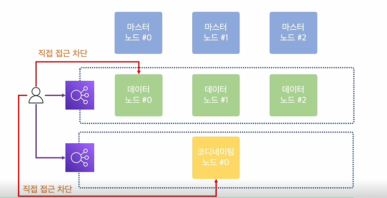

# Elasticsearch Essential

# Section 1. Elasticsearch 살펴보기

- Elasticsearch 소개
    - Elasticsearch란?
        - 루씬(Lucene) 기반의 오픈소스 검색 엔진
            - Lucene은 Java Library
            - JSON 기반의 문서를 저장하고 검색할 수 있으며, 분석 작업도 가능하다.
    - Elasticsearch의 특징
        - 준실시간 검색 시스템
        - 고가용성을 위한 Cluster 구성
            - 한 대 이상의 Node로 Cluster를 구성하여 높은 수준의 안전성을 달성하고 부하 분산이 가능하다.
        - 동적 스키마 생성
            - 입력될 데이터들에 대해 미리 스키마를 정의하지 않아도 동적으로 스키마 생성이 가능하다.
        - Rest API 기반의 인터페이스
            - 특별한 Client를 필요로 하지 않고, Rest API 만으로 Elasticsearch의 기능을 사용할 수 있다.
- Cluster와 Node 이해하기
    
    
    
    - Cluster : Computer Cluster는 여러 대의 Computer들이 연결되어 하나의 시스템처럼 동작하는 Computer들의 집합이다.
    - ElasterSearch도 여러 대의 Node들이 각자의 역할을 바탕으로 연결되어 하나의 시스템처럼 동작하게 되어 있다. (Elasticsearch는 Cluster로 구성된다.)
        - ⇒ 그렇기에 어떤 Node에 어떤 요청을 해도 동일한 응답을 준다.
            - 즉, 각각의 Node가 본연의 역할에 충실할 수 있도록 구성하는 것이 중요하다.
        - ⇒ Cluster의 성능이 부족하면 Node를 늘려서 대응할 수 있다.
            - 단, Node를 늘린다고 모두 성능을 늘릴 수 있는건 아니다.
    - Master Node
        
        
        
        - Cluster 상태 관리 및 Metadata 관리
        - Master Node가 죽으면 Master-eligible 중에서 새로운 Master Node가 된다.
    - Data Node
        - 문서 색인 및 검색 요청 처리
    - Coordinating Node
        - 검색 요청 처리
    - Ingest Node
        - 색인되는 문서의 데이터 전처리(수정)
- Index와 Shards 이해하기
    - Index
        
        
        
        - Index란 문서가 저장 되는 논리적인 공간이다.
            - ⇒ 문서를 저장하기 위해서는 반드시 Index가 존재해야 한다.
        - Index를 설계 하는 것이 ElasticSearch를 사용하기 위해 고려해야 하는 첫 단계이다.
        - Index 설계에 따라 문서의 구조 및 검색 Query가 달라진다.
            - Index 설계에 따른 색인 및 검색 구조
                
                
                
                
                
                
                
                
                
        - Index는 사용 패턴과 문서의 특성에 따라 설계해야 한다.
            - 하나의 Index를 사용할 경우, 관리해야 할 Index의 수가 적어 관리 리소스가 적게 발생한다. 단, Query와 문서의 구조가 복잡해 질 수 있다.
            - 여러 개의 Index로 나눌 경우, 각각의 경우에 최적화된 Query와 문서 구조를 사용할 수 있다. 단, 관리해야 할 Index의 수가 많아 관리 리소스가 발생할 수 있다.
        - 최초에는 하나의 Index로 단순하게 시작하여, 사용 패턴에 따라 Index를 별도로 운영하는 식으로 확장하는 설계가 적합하다.
    - Shard
        - Shard란 Index에 색인되는 문서가 저장되는 공간이다.
            - 하나의 Index는 반드시 하나 이상의 Shard를 가진다.
        - Primary Shard : 문서가 저장되는 원본 Shard, 색인과 검색 성능에 모두 영향을 준다.
        - Replica Shard : Primary Shard의 복제 Shard, 검색 성능에 영향을 준다. Primary Shard에 문제가 생기면 Replica Shard가 Primary Shard로 승격한다.
            - ⇒ 단, Replica Shard 역시 색인에 영향을 주지 않는 것은 아니다. 주로 검색 성능에 영향을 준다고 인식.
        - Shard는 Index를 만들 때 설정한다.
            
            
            
            - ⇒ Primary Shard : 3개
            - ⇒ Replica Shard : 3개
            - ⇒ 총 Shard는 6개
            
            
            
            - ⇒ Primary Shard : 5개
            - ⇒ Replica Shard : 10개
            - ⇒ 총 Shard는 15개
        - Shard Routing : 문서가 Shard에 저장되는 순서, 방법
            - Routing Rule = (문서의 ID) % (Shard의 개수)
            - Shard의 개수가 바뀐다면 문서가 저장되는 규칙이 완전히 바뀌게 된다.
            - 그렇기에 Index의 Primary Shard는 생성 후 변경할 수 없다.
                - ⇒ 따라서 Index를 생성할 때 Primary Shard의 개수를 설정하는 것은 매우 중요하다.
                - number_of _shard의 기본값은 1이다. (7버전 이후)그렇기에 이 기본값을 그대로 사용하는 것은 성능에 큰 영향을 미치게 된다.
        - 단, 모든 Index에 대해 Shard를 설정하는 것은 힘들기에, Index Template을 이용하여 Shard를 설정한다.
            
            
            
            - ⇒ nginx-logs- 로 시작하는 모든 Index는 Primary Shard 3개, Replica Shard 6개로 생성
- Mapping 이해하기
    - Mapping이란 문서의 구조를 나타내는 정보이다.
        - ⇒ ElasticSearch는 Schema-less 가 아니다. 미리 정의하지 않아도 될 뿐이다.
    - Dynamic Mapping(동적 매핑) : 처음 색인되는 문서를 바탕으로 Mapping 정보를 ElasticSearch가 동적으로 생성한다.
        
        
        
        - ⇒ 어떤 문서가 색인될지 Schema를 미리 정의 하지 않아도 된다.
        - 매핑 정보가 생성된 후에는 타입이 맞지 않을 경우 Parsing 에러가 발생한다.
            
            
            
    - Static Mapping(정적 매핑) : 문서의 Mapping 정보를 미리 정의한다.
        
        
        
        - 어떤 문서가 색인될지 Schema를 미리 정의한다.
        - 모든 Field를 Static Mapping 하기보단, 중요한 Field만 Static Mapping 하는 편이 더 적합하다.
            - Static Mapping은
                - 문서의 필드들이 가지는 값에 따라 타입을 지정해 줄 필요가 있을 때  (EX; float 범위를 넘는 값이 있을 경우 double로 Static Mapping)
                - 불필요한 색인이 발생하지 않게 하기 위해 (EX; 문자열 Field마다 자동 생성되는 keyword 타입)
            - 주로 사용한다.

# Section 2. Elasticsearch 동작 이해하기

- 색인 과정 이해하기
    
    
    
    - 색인(Indexing) : 문서를 분석하고 저장하는 과정. Index를 생성하고, Mapping을 확인하고, inverted index를 생성하고, 문서를 저장하는 일련의 과정
        - ⇒ Indexing은 Primary Shard에서 일어난다.
    
    
    
    - 초록색 큰 사각형이 Data Node, 초록색 작은 사각형이 Primary Shard, 노란색 작은 사격형이 Replica Shard라고 할 때, 위 시스템은 Primary Shard가 하나만 있기에 색인이 하나의 Data Node에서만 일어난다. (특히 7버전 이후에는, default Primary Shard가 1개이기에)
        - 이로 인해 Data Node가 3개이지만, 색인에 있어서는 사실상 1대만 있는 것과 마찬가지 결과를 보인다.
        - 즉, 위 구축 상황은 Cluster로서의 이점을 전혀 살리지 못하는 상황이라고 할 수 있다.
        - 그렇기에 적절한 수의 Shard 개수를 설정하는 것이 성능에 큰 영향을 미친다.
            
            
            
            - ⇒ Primary Shard의 수를 Data Node와 동일한 3개로 지정했을 때의 색인 과정
        - 단, 위 상황에서 Data Node가 1개 추가된다면, Primary Shard와 Data Node 간의 불균형으로 인해 Shard의 개수가 고르게 분배 되지 않기 때문에 용량 불균형이 일어날 수 있다.
            
            
            
        - 적절한 샤드 갯수는 shard sizing 공식 Document 참조
            
            [Size your shards | Elasticsearch Guide [8.8] | Elastic](https://www.elastic.co/guide/en/elasticsearch/reference/current/size-your-shards.html)
            
    - 단, 처음부터 완벽한 Shard 배치 계획을 세울 순 없다.
        - ⇒ 배치 계획 → 테스트 → 현행 서비스(usecase)에 맞는 Shard 배치 계획을 완성시켜 나가야 한다.
        - EX) 하루에 100GB의 로그를 30일간 저장하는 클러스터
            - 필요한 저장 공간 : 100GB X 2 (Replica) X 30 = 6,000GB
            - Index 별 Shard의 최대 크기를 10GB로 설정하면 Index 별 Primary Shard의 개수는 10개
            - Data Node의 개수를 10개로 설정하면 Data Node 당 가져야 할 디스크의 크기는 600GB
            - 단, Data Node의 장애를 대비해서 700GB 정도로 시작하는 것이 적절
        - 성능에 문제가 있다면 Shard의 수를 늘리거나, Data Node를 스케일 아웃/업 하면서 최적의 수치를 찾아가야 한다.
            - (Data Node의 CPU 가용량이 남으면 Shard의 개수를 늘리고, 가용량이 부족하면 Data Node의 Scale Up 하는 식으로.)
    - 즉, 색인 성능에 문제가 있다면 Cluster로서의 이점을 살리고 있는지를 먼저 살펴 봐야 한다.
- 검색 과정 이해하기
    
    
    
    - 검색 과정
        - 검색어 분석 → inverted index 검색 → 검색 결과 표시
        - inverted index : 문자열을 분석한 결과를 저장하고 있는 구조체
        - 즉, 검색은 Analyzer를 통해 검색어로부터 생성된 토큰들을 inverted index에서 찾는 과정이라 할 수 있다.
    - 문자열을 분석해서 inverted index를 구성을 위한 토큰을 만들어 내는 과정은 다음과 같다.
        - 문자열 → character filter → tokenizer → token filter → tokens
        - 이 중 character filter → tokenizer → token filter를 합쳐 Analyzer(애널라이저)를 구성한다.
        - Analyzer를 통해서 색인 과정에서 문자열을 분석하고 토큰들이 생성되며, 이 토큰들이 inverted index를 구성한다.
    - 검색 요청은 Primary Shard와 Replica Shard 모두가 처리 할 수 있다.
        - ⇒ 색인 성능은 충분하지만, 검색 성능에 부족함을 느낄 때 number_of_replicas를 늘려 Replica Shard를 늘려 줌으로서 검색 성능 향상이 가능하다.
            - ⇒ number_of_replicas는 dynamic이기에 number_of_shard와 달리 Data Node가 허용하는 한 더 늘릴 수 있다.
    - 즉, 검색 성능에 문제가 있다면 Cluster로서의 이점을 살리고 있는지를 먼저 살펴 봐야 한다.
    
    <aside>
    💡 색인과 검색 모두 적절한 Shard의 수가 성능을 결정하며, 적절한 Shard의 수가 Cluster로서의 이점을 활용하느냐 아니냐를 결정한다. 
    
    ElasticSerch는 Cluster로 구성되기 때문에 모든 Node가 색인과 검색을 처리할 수 있도록 구성하는 것이 가장 중요하다.
    
    </aside>
    
- text vs keyword
    - text와 keyword 모두 문자열을 나타내기 위한 타입이다.
        - text 타입은 전문 검색(Full-text-search)를 위해 토큰이 생성 된다.
        - keyword 타입은 Exact Matching을 위해 토큰이 생성된다.
            
            
            
    - keyword 타입이 text 타입에 비해 cpu 사용량이 적기에 색인 속도가 더 빠르다.
    - 단, 문자열 필드가 동적 매핑 되면 text와 keyword 타입 두 개가 모두 생성된다.
        - 그렇기에 문자열의 특성에 따라 text와 keyword를 정적 매핑 해 주면 성능에 도움이 된다.
            
            
            
            - ⇒ Full-Text-Search 가 필요하면 text로, Exact Matching은 keyword로 지정한다.
    - 굳이 Tokenizing이 필요하지 않은 필드의 경우, keyword로 정적 매핑 설정해 놓으면 색인 성능에 도움이 된다.

# Section 3. Elasticsearch 모니터링 하기

- cat API 활용하기 #1
    - cat API : Compact and Aligned Text (CAT) APIs의 약자로, Cluster의 정보를 사람이 읽기 편한 형태로 출력하기 위한 용도로 만들어진 API
    - UI 기반의 모니터링 시스템이 원인 파악에 더 편하지만, cat API는 상황을 빠르게 파악하는데 도움이 된다.
        - 제공 API 종류 :
            
            [Compact and aligned text (CAT) APIs | Elasticsearch Guide [8.8] | Elastic](https://www.elastic.co/guide/en/elasticsearch/reference/current/cat.html)
            
    - cat health : ElasticSearch Cluster의 전반적인 상태를 확인할 수 있다.
        
        
        
        - status :
            - green : Primary Shard, Replica Shard 모두 정상적으로 각 Node에 배치되어 동작하고 있는 상태
            - yellow : Primary Shard는 정상적으로 동작하지만 일부 Replace Shard가 정상적으로 배치되지 않은 상태. 색인 성능에는 이상 없지만 검색 성능에는 영향을 줄 수 있다.
            - red : 일부 Primary Shard와 Replica Shard가 정상적으로 배치되지 않은 상태. 색인 성능, 검색 성능 모두 영향을 주며 문서 유실이 발생할 수 있다.
        - node.total : 총 node 숫자
        - node.data : Data Node 숫자
        - shards : 총 Shard 숫자
        - pri : Primary Shard 숫자
        - relo : 재배치 Shard
        - init : 초기화, 만들어지고 있는 shard
        - unassign : 아직 Node에 배치되지 않은 shard
        - cat health 는 Cluster의 상태를 확인할 때 주로 사용한다.
    - cat nodes : Node들의 전반적인 상태를 확인할 수 있다.
        
        
        
        - heap.percent : Heap 메모리 사용량
        - ram.percent : Node 메모리 사용량
        - 단, 제공되는 정보는 기본적인 정보로 확인 가능한 정보는 제한적이다.
        - help를 통해 추가로 확인 가능한 정보를 볼 수 있다.
            
            
            
        - cat nodes는 주로 Node들의 디스크 사용량 확인, Node들이 명확한 역할을 수행하고 있는지 확인, 어떤 Node가 Master Node인지 확인, Node들의 메모리 사용량을 확인할 때 사용한다.
- cat API 활용하기 #2
    - cat indices : Index의 상태를 확인 할 수 있다.
        
        
        
        - stores.size : index의 전체 데이터 크기 (Primary Shard + Replica Shard)
        - pri.store.size : Primary 기준의 index 크기
        - health : cat health에서 볼 수 있었던 상태 정보
            - ⇒ 이는 Cluster의 상태는 Index의 상태라고 볼 수 있기 때문
            - ⇒ 1개 이상의 index가 yellow 상태라면 Cluster도 yellow, 1개 이상의 index가 red 상태면 Cluster도 red
        - cat indices는 주로 Index들의 Primary Shard 개수와 Replica Shard 개수를 확인할 때, 이상 상태인 Index를 확인할 때 활용한다.
    - cat shards : Shard의 상태를 확인 할 수 있다.
        
        
        
        - UNASSIGNED : yellow 상태
        - cat shards도 cat nodes와 마찬가지로 help를 통해 더 많은 정보를 볼 수 있다.
        - unassigned.reason ⇒ Shard가 unassigned인 이유 확인
            
            
            
        - cat shards는 주로 이상 상태인 Shards 확인, Shards의 이상 상태 원인 확인에 활용한다.
- 주요 모니터링 지표 살펴보기
    - 모니터링의 기본은 이상 징후를 감지하고 필요한 정보를 바탕으로 전파하는 것.
    - Elastic Cloud, Self-Hosted ElasticSearch는 Kibana의 Stack Monitoring을, AWS OpenSearch Service는 AWS CloudWatch를 권장한다.
        
        
        
        
        
    - Cluster를 모니터링 할 수 있는 지표는 무척 많지만, 많은 지표들 중에서도 지표들 간 중요도는 서로 다른다.
        - 지표들이 어떤 의미를 가지는지, 어떤 지표를 중점적으로 모니터링 해야 하는지 기준을 잡는 것이 중요하다.
    - 지표들은 크게 임계치를 걸어서 알람을 받아야 하는 지표와 문제 원인을 찾아내기 위해 분석용도로 사용하는 지표로 나뉜다.
    
    
    
    - 주황색은 알람을 받아야 하는 지표, 녹색은 문제 원인을 찾아내기 위한 지표
        - CPU Usage : Node가 CPU를 얼마나 많이 사용하고 있는가
        - Disk Usage (Disk Free Space) : Node가 얼마나 많은 문서를 저장하고 있는가
        - Load : Node가 얼마나 많은 CPU와 디스크 연산을 처리하고 있는가
        - JVM Heap : Node의 JVM이 얼마나 많은 메모리를 사용하는가
        - Threads : 처리량을 넘어서는 색인/검색 요청이 있는가
            
            
            
        - Memory Usage : Node에 설치되어 있는 물리적 메모리의 사용량, JVM Heap과는 다르다.
        - DISK I/O : Node에서 발생하는 디스크 연산의 지연 시간
        - GC Rate : Node에서 발생하는 GC의 발생 주기
        - GC Duration : Node에서 발생하는 GC의 소요 시간
        - Latency : Node에서 색인 및 검색에 소요되는 시간
        - Rate : Node에서 색인 및 검색 요청이 인입되는 양

# Section 4. Elasticsearch Troubleshooting

- Troubleshooting의 기본
    - 트러블 슈팅 : 문제 상황을 파악하고 원인을 분석 후 해결하는 과정
        - 트러블 슈팅은 다음의 단계를 거친다.
            - 문제 상황 파악 : 무엇이 문제인가?
                
                
                
                - 단, 이는 절대적인 기준이 아니다. 문제 상황 파악을 위해서는 자신만의 확인하는 단계의 수립이 필요하다. 위 과정은 어디까지나 일반적인 과정.
            - 원인 분석 : 왜 문제가 발생했는가?
                
                
                
            - 문제 해결 : 어떻게 해야 해결할 수 있는가?
                - ⇒ 원인 분석을 통해 확인된 원인을 제거하는 과정
- Troubleshooting 사례 분석 #1
    - 문제 상황 : Cluster의 상태가 Green이 아닌 경우
        - ⇒ Yellow 혹은 Red 상태에 따른 영향도를 정확하게 파악하는 것이 먼저.
        - ⇒ 그 후 Indexs 중 누가 Yellow 혹은 Red 인가를 먼저 파악한다.
            
            
            
            - cat indices 명령어 활용
        - ⇒ Yellow 혹은 Red인 Indexs 중 어떤 Shards에 문제가 생겼는지를 파악한다.
            
            
            
            - ⇒ Cluster의 상태가 Yellow 혹은 Red인 것이 무조건 장애 상황인 것은 아니다. 경우에 따라서는 장애 상황이 아닐 수 있기 때문(혹은 중요도가 떨어지는)에 정확한 파악이 중요하다.
            - 문제 발생 시에는 장애의 범위와 여파가 어디까지인지를 명확하게 파악하는 것이 가장 중요하다.
- Troubleshooting 사례 분석 #2
    - 문제 상황 : Cluster에 갑자기 문서가 색인이 되지 않는 경우
        - ⇒ Client에서 403  Forbidden Error가 발생
    - 원인 분석 : Node의 디스크 사용량이 100%가 되면 Node의 운영 체제도 정상적으로 동작하지 않는다. 따라서 ElasticSearch에서는 디스크 사용량이 일정 수준 이상 되면 더 이상 색인 하지 않도록 하는 보호 장치가 있다.
        - 운영체제에는 ElasticSearch 외의 다른 Process도 존재하기에, ElasticSearch가 100%가 되면 Node 자체가 망가질 수도 있다.
        - ⇒ cluster.routing.allocation.disk.thredhold_enabled : 보호 장치를 설정하는 설정 값
            
            
            
            - ⇒ Shard를 배치하지 않는다고 디스크 사용량이 늘지 않는 것은 아니다. (이미 배치된 Shard들로 인해)
            - ⇒ Nodes의 디스크 사용량이 모두 비슷한 경우에는(90%이상) Shards이 Node 사이를 이동하기만 하는 케이스가 발생할 수 있다.
            - ⇒ 95% 이상이 되면 Elastic Search가 Node를 망가트리지 않고, 디스크 사용량도 늘지 않지만 Cluster에 문서가 색인 되지 않거나 403 Forbidden Error가 발생한다.
                - ⇒ Elastic Search가 모든 Index들을 Read-Only로 변경해 버린다.
    - 문제 해결 : Data Node를 증설하거나, 불필요한 Index를 삭제해서 디스크 공간을 확보해야 한다.
        - ⇒ 단, 디스크 공간 확보 후 Read-Only 상태의 인덱스들을 명시적으로 풀어 줘야 한다.
            
            
            
- Troubleshooting 사례 분석 #3
    - 문제 상황 : 간헐적으로 색인 과정에서 일부 문서가 누락되는 상황
        - ⇒ Node에서 간헐적으로 Rejected 에러가 발생
    - 원인 분석
        - ElasticSearch에는 색인/검색 요청을 처리하는 Thread가 존재한다. 그리고 Thread가 모두 요청을 처리하고 있을 때를 대비해서 Queue도 존재 한다.
        - ⇒ 모든 Queue가 가득 차 있다면 Rejected 에러가 발생한다.
            - ⇒ Node의 요청 양을 넘어 선 상황
    - 문제 해결
        - Date Node를 증설하여 Cluster 처리량을 높여주거나, Queue를 증설할 수 있다.
        - Queue 증설은 평상 시 처리량은 충분하지만 간헐적으로 많은 양의 요청이 인입 되는 경우 같은 제한적인 상황에서 효과를 발휘할 수 있다.
            
            
            
            
            
            - 위 상황 같은 순간적인 요청의 폭증의 경우, Data Node의 수를 늘리는 것 역시 해결책이지만, Queue 증설을 통해서도 대응할 수 있다.
- Troubleshooting 사례 분석 #4
    - 문제 상황 : Shard 배치가 되지 않는 상황
    - 원인 분석
        - Node들이 가지고 있을 수 있는 전체 Shard의 개수에는 제한이 존재 한다.
        - 그리고 이 제한을 넘어가면 더 이상 Shard가 생성되지 않고 Index 생성도 불가능해 진다.
        - ⇒ cluster.max_shards_per_node (Defaults: 1000)
            - ⇒ 개별 Node들이 가질 수 있는 전체 Shard의 개수는 기본 값 1000개로 잡혀 있다.
        - 즉, 매일 생성되는 Index의 설정이 아래와 같을 때,
            
            
            
        - 매일 총 10개의 Shard가 생성 된다.
        - 만약 1년간 로그를 유지할 경우, Shard는 총 3650개가 생성 된다.
        - 하지만 Data Node의 개수가 3대라면 Index와 Shard가 더 이상 생성되지 않게 된다.
    - 문제 해결
        - Data Node 증설
            - Data Node를 증설함으로서 해결 할 수 있다.
        - Index 설정 변경
            - index 설정을 변경하여 생성되는 Shard의 수를 변경함으로서 사용 가능 기간을 늘릴 수 있다.
        - cluster.max_shards_per_node 변경
            - cluster setting을 통해 해당 속성의 값을 변경할 수 있다.
            - 단, 가능은 하지만 Node들에 너무 많은 Shard가 배치됨으로서 발생할 수 있는 Side Effect(CPU 사용량 증가, 디스크 사용량 증가, Heap Memory 사용량 급증 등)가 있기에 권장되지 않는다.
- Troubleshooting 사례 분석 #5
    - 문제 상황 : CMS GC 환경에서 너무 잦은 Old GC가 발생하는 경우
        - ⇒ Old GC : CMS GC 환경에서 Old 영역이라는 메모리 영역에서 발생하는 GC.
        - ⇒ Old GC 발생 시 S-T-W(Stop The World, 잠시 멈추는 현상)이 발생한다.
    - 문제 상황 파악
        
        
        
    - 원인 분석
        - 불필요하게 많은 객체들이 Old 메모리 영역으로 이동하기 때문에 잦은 Old GC가 발생한다.
            - ⇒ Elastic Search의 문제 보다는 Elastic Search가 사용하는 JVM의 문제에 가깝다.
        - CMS GC Mode에서의 JVM Heap Memory 구조는 다음과 같다.
            
            
            
            - Eden : 객체가 최초에 만들어져 저장되는 곳
            - S0 → S1을 오고 가다가 더 오래 살아남은 경우 Old 영역으로 이동한다.
            - Eden, S0, S1을 Young GC, Old 영역을 OLD GC라고 한다.
        - 위와 같은 구조에서, Survivor 영역이 이미 가득 차서 Eden에서 이동할 수 없는 경우 Old 영역으로 바로 이동하게 된다.
        - 단, 위와 같은 케이스는 지표 만으로는 확인이 어렵고, Old GC가 너무 잦게 발생하는 경우 의심해볼 수 있다.
    - 문제 해결
        - Survivor 영역을 늘려 줌으로서 해결할 수 있다.
        - NewRatio와 SurvivorRatio JVM 튜닝을 통해 Survivor 영역을 늘려줄 수 있다.
        - Heap Memory 30GB를 튜닝하지 않았을 때의 경우
            
            
            
        - Heap Memory 30GB로 튜닝 했을 때
            
            
            
            - Old GC 타이밍 : 20.25GB ⇒ 16GB
    - CMS GC를 사용할 경우, Old GC에 의해 성능에 영향을 받을 수 있다.
    - Survivor 영역이 작아서 Eden 영역의 객체들이 이동하지 못하고 Old 영역으로 바로 이동할 수 있고, 이로 인해 불필요하게 Old 영역에 객체들이 많이 생성될 수 있다.
    - NewRatio와 SurvivorRatio 튜닝을 통해 Eden과 Survivor 영역을 늘려주고 이를 통해 문제를 해결할 수 있다.

[certificate.pdf](Elasticsearch_Essential/certificate.pdf)