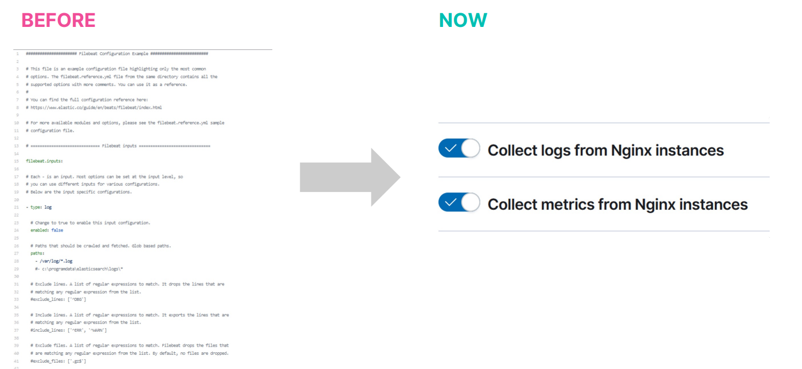

# Elastic Master Class

# Elastic Observability

- Observability는 하나의 플랫폼, 하나의 저장소에서 Log, Metric, Trace를 모두 해결할 수 있는 것을 목표로 하는 Elastic의 기능이다.
    - Log, Metric, Trace 관리를 통해 로그를 분석하고, 인프라를 모니터링하고, 애플리케이션 성능 모니터링(APM)과 엔드유저 모니터링(RUM) 등을 수행한다.
- Observability는 하나의 중앙 Agent(Fleet)을 통해 수천 개의 Agent를 관리하며, 한 번의 클릭으로 Agent설정을 변경하거나 업그레이드 할 수 있다.
- Observability를 통해 Log, Metric, Trace, Security 등의 핵심 Beats Agent를 개별적으로 설치, 설정, 확장하는 것이 아닌, Elastic Agent for (Log, Metric, Trace, Uptime, Security, Window Data) 를 통해 하나의 관리 포인트로 관리할 수 있다.
    - 또한 yml 파일로 개별 Beats Agent의 설정을 관리했던 것과 달리, UI 레벨에서 설정을 관리할 수 있다.
        
        
        
- Observability는 API 키를 사용함으로서, 최소 권한으로 더 나은 제어를 수행할 수 있다.
    
    
    | BEFORE | NOW(Observability) |
    | --- | --- |
    | Beats에서 아이디/패스워드 입력 | Fleet 및 Elasticsearch에 대한 API 키 |
    | 패스워드 YAML 설정에 저장 | Fleet에서 자동으로 키 생성 |
    | 기본 사용자 슈퍼 유저 권한  | 각 Agent에서 최소한의 권한으로 사용 |
    | 하나 또는 몇 개의 비밀번호로 모든 Beats 사용 | Agent 당 하나의 키로 쉽게 관리 가능 |
- Fleet을 통해 여러 Agent를 중앙 Agent에서 관리함에 따라 얻을 수 있는 이점은 다음과 같다.
    - 여러 Agent를 중앙에서 UI로 관리
    - Elastic Agent 상태에 대한 빠른 가시성 확보
    - Agent 설정 및 버전을 원격으로 업데이트
    - 클릭 한 번으로 모든 Agent에서 Policy 업데이트 가능
    
    # Elastic Observability - 주요 기능
    
    ### 로그 분석
    
    - Hybrid Colud를 위한 확장 가능한 중앙 집중식 로그 모니터링
    - 로그 분류와 머신 러닝을 기반으로 한 로그 패턴 분석 및 이상 징후 탐지
    - 클러스터 통합 검색을 통한 강력한 로그 검색 지원
    - 데이터 계층을 통해 성능과 스토리지를 효율적으로 최적화
    
    ### 비용 효율적인 데이터 보관(/w data tiers)
    
    
    
    - 데이터 종류별로 사용자 정의가 가능하며, 데이터 계층 이동 시 소스별로 사용자 정의가 가능하다 (계층간 유연한 데이터 이동 가능)
    - 보관 주기는 무제한이다.
    - 지속적으로 비용이 감소하며 장기 스토리지는 비용이 저렴하다.
        
        
        
    
    ### 끊김 없는 검색
    
    - 전체 데이터에 대한 동일 UX를 지원한다. (복원 불필요)
    
    ### 효율적인 과거 데이터 검색
    
    
    
    - 필요한 데이터만 로딩
    - 로컬 캐시 사용
    - 복원 작업 혹은 수동 개입 불필요
    - 다른 접근 방식에 비해 빠른 쿼리 성능
    - 하드웨어 비용 감소
    - 오브젝트 스토리지 API 비용 감소
    - 데이터 전송 비용 감소
    
    ### APM
    
    - End-to-End 분산 Tracing을 통한 코드 품질 향상
    - ML 기반 상태 지표와 이상 징후 탐지 기능을 통해 신속한 문제 해결
    - 상관 관계 분석을 통해 속도 저하 및 에러 근본 원인 식별
    - OpenTelemetry와 Elastic Agent를 통해 별도의 설정 없이 즉시 사용 가능
    
    ### 분산 Tracing으로 End-to-End 분석
    
    - 사용자 관점에서 하나의 Transaction이지만 MSA 환경에서 다수 서비스로 분리되는 경우, 하나의 ‘분산 Tracing’으로 분석한다.
        
        
        
    
    ### Profiling
    
    - 다양한 언어와 컨테이너화된 환경 등 전반에서 시스템을 가시화 한다.
    - Production 환경에서 낮은 오버헤드로 Profiling 사용이 가능하다
    - 인프라, App 등 성능이 나오지 않거나 비효율적인 코드 및 함수를 식별 가능하다
    - 컴퓨팅 자원 낭비 제거가 가능하다.
    
    ### 통합된 가시성
    
    - On-Premiss/Cloud 인프라와 3-Tier 아키텍처에 대한 인사이트를 제공한다
    - AWS, Azure, Google 상에 존재하는 350개 이상의 통합을 제공한다
    - Kubernetes (On-Premiss/Cloud 모두 지원) 지원
    - 복잡한 환경에서 문제 원인 빠르게 탐색 가능
    
    ### 통합 환경으로 silo 제거
    
    - 모든 비즈니스 및 운영 데이터를 위한 단일 플랫폼
    - Metric, Log, Trace를 Context 기반으로 연결해 빠르게 문제를 분석할 수 있다
    - 개방형 공통 데이터 모델을 사용한다.
    - 다양한 팀이 협업 할 수 있는 환경을 제공한다.
    
    ### AIOps & ML
    
    - 코딩이 필요하지 않은 빌트인 머신 러닝 기능
    - 머신 러닝은 지도, 비지도 학습 모두 가능
    - AI를 기반으로 하는 이상 징후 탐지
    - 자동화 된 APM 상관 관계 생성으로 편리한 근본 원인 분석 가능
    - 강력한 검색 기능을 통한 알려지지 않은 불확실한 일(unknown unknowns) 파악
    - MTTD(평균 장애 인지 시간)와 MTTR(평균 복구 시간) 단축
    
    ### 사용자 경험 측정
    
    - 시간의 흐름에 따른 인프라, 애플리케이션 및 비즈니스 동향 추적
    - 고객 경험을 측정하고 사용자 여정을 능동적으로 파악 가능
    - Frontend에서 Backend까지 한 번에 추적하여 문제 해결
    - SLO(서비스 레벨 목표) 설정, SLI(서비스 레벨 지표) 및 SLA(서비스 레벨 계약) 측정
    
    ### AI assistant
    
    - Incident 관리 및 근본 원인 분석 지원
    - 문제를 대화형으로 해결 (생성형 AI)
    - LLM에 의존하지 않는 개방형 기능(ESRE)
    - Context 기반으로 신뢰할 수 있는 데이터 제공
    - 실제 데이터 기반으로 가이드 제공

# Elastic Security(SIEM 솔루션 기능 소개 / ML을 활용한 이상행위탐지)

- Elastic Security Overview는 GenAI 기반 Security Solution이다.
- 머신 러닝을 모르더라도 Profiling 및 보안 분석이 가능하게 하는 것이 Elasticsearch 보안이 추구하는 방향이다.
- Elastic 머신 러닝은 진화하는 보안 위협을 효율적으로 대응할 수 있는 새로운 대응  전략이다. ML 엔진을 이용해 실시간 보안 위협을 탐지하고 대응한다.
    - ⇒ 이상 행위 분석 및 탐지(고객 별 접속한 적 없는 시간대 탐색 등)
    - ⇒ Zeroday 취약점 공격 대응 (Architecture / Overview)
        
        
        
        - ⇒ 통합보안관리(SIEM) : 상관 분석을 통해 실시간 위협 탐지와 Endpoint를 통한 실시간 차단 역량 관리
        - Endpoint보안(XDR) : Endpoint시스템 정보 수집 및 원격 관리
        - 가용성 모니터(Observability) : 자바 애플리케이션(Java spring boot app), 시스템 로그 및 metric 정보 수집
- 단, Profile 기준 모집단의 데이터가 적을 경우 안전성에 대한 우선순위가 정확하지 않을 수 있다.
    
    ### 보안 모니터
    
    - 다양한 분석 모델을 통해 가시성 확보
        - 쿼리 검색, dashboard, 상관분석룰, 머신 러닝 등
    - 모든 종류의 데이터 수집
        - 운영 정보, 사용자 활동, 네트워크 필요한 모든 정보 수집
    - 최적화된 dashboard와 맞춤형 검색을 통해 필요한 데이터 분석 및 모니터
    
    ### 자동화된 위협 차단
    
    - 고도화된 보안 위협 시도를 행위 기반 분석과 머신 러닝을 통해 사전에 탐지하고 차단한다
    - 악성 코드 및 랜섬웨어 탐지 및 실행 차단
    - 확장된 보안 운영 역량(SecOps)을 통해 효율적으로 사이버 위협 차단
    - 3rd 파티 연동을 통해 Workflow 통합
    - Email / Slack / MS Teams 등 업무 협업툴 통합
    - 자동화된 액션을 통해 선차단 대응
    - Endpoint 기반 선제 대응 및 상세 분석 수행
    
    ### 사고조사 및 대응
    
    - 다양한 이기종 데이터 분석을 통해 숨겨진 보안 위협을 식별
    - 문맥 분석을 통한 증적 자료 수집
    - 시각화를 통한 문맥 분석
    - 자동화된 케이스 관리 기능을 통해 신속하게 사고 대응 및 협업
    
    ### Threat hunting
    
    - 페타바이트급의 데이터 분석과 인텔리전스 정보 활용
    - 고도화된 검색 기술을 통해 보안 위협에 대한 인사이트 확보
    - 식별하지 못했던 보안 위협을 찾아 보안 리스트 최소화
    - 침해 사고 케이스 관리
    
    ### 클라우드 보안 위협 관리
    
    - Servers, VMs on Datacenter or Cloud 보안 위협 분석
        - ⇒ 리눅스 기반의 워크로드의 이상 프로세스 행위에 대해 탐지한다.

# Elastic Search(Gen AI)

- Elastic Search는 최초 Text 기반 검색의 한계에서 벗어나 ESRE 기반의 GAI 환경을 목표로 하고 있다.
    - Text → Aggregation(doc_value) → GEO Search(BKD Tree) → Vector Search → ESRE
- Gen AI가 가지고 있는 고질적인 문제점에 대한 해결책으로 ESRE 검색은 LLM을 비 토큰 기반으로 수행한다.
    - Gen Ai의 문제점 : Hallucination, 내부 데이터 접근, 복잡한 기술 Stack, Security & Privacy
        - → 이는 grounding이 제대로 되지 않았기에 생기는 문제
        - ESRE(Elasticsearch Relevance Engine) ⇒ 역 인덱스, BM25, Vector 검색 등의 통합 기능
    - Elasticsearch는 질의 시 Business data인 Context Window를 질문에 결합하여 LLM에 제공한다.
- ESRE의 핵심 기능은 다음과 같다.
    - Dev tools for AI search
        - 매력적인 AI 검색 앱을 구축하기 위한 다양한 도구
    - Choice of models
        - 공개/사설 LLM과 텍스트, 벡터, 하이브리드 검색을 함께 사용
    - Enterprise ready
        - 문서 & 필드 레벨 보안, on-premiss / 50+ Cloud region
- Elasticsearch는 일반 Vector Database Soluction에 제공하는 기능 뿐만 아니라 GenAI 애플리케이션에 필요한 모든 기능을 제공한다.
- ESRE 검색은 GenAI처럼 단순 키워드 기반 검색이 아닌, 질의의 의미를 파악하고 검색을 수행할 수 있다.
    - 단, ESRE는 아직 한국어 검색 지원이 미흡하다.
    - ESRE 기반 검색은 외부 Import를 통해 다국어 모델 역시 어느 정도 지원된다.
    - ESRE는 LLM 없이도 생성형 질의가 어느 정도 가능해진다.
    - ESRE 는 제로샵 학습을 수행한다.
        - 제로샵 학습 ⇒ 추가적인 학습 없이도 대부분의 텍스트를 사용 가능
- LLM이 연동된 ELSER 검색은 검색 시 권한 제어 역시 가능하다. (가진 권한에 따른 다른 검색 결과 수행)
- Elastic Learned Sparse Encoder를 사용 시, 모델을 정의하고 ingest pipeline을 정의하는 과정이 없어도 vector 검색을 수행 가능하다.
    
    
    
- ESRE를 통한 AI assistant의 Securty 지원 영역
    - 알람 요약 기능
    - 쿼리 생성 기능
    - Workflow 추천
    - 데이터 수집 도우미
    - 쿼리 변환
    - 에이전트 설정 조언
- ESRE를 통한 AI assistant의 Observability 지원 영역
    - 알람 Root Cause 제공
    - 로그 메시지 자동 설명
    - 호스트 프로세스 자동 설명
    - APM 에러 자동 설명
    - 라이브러리 및 함수 분석을 위한 Profiling