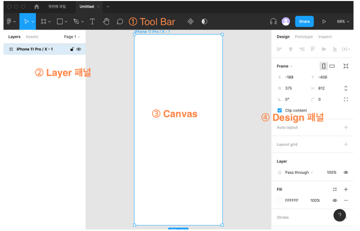

# Figma

# 화면 구성 및 기초

1. Tool Bar : 화면 상단의 Tool Bar. 프레임, 버튼, 개체 편집 등의 기능이 있는 메뉴바
2. Layer 패널 : 화면 왼쪽의 Layer 패널. 작성된 Layer를 Component 구조로 확인 및 선택 가능. 
3. Canvas : 화면 중앙의 Canvas. UI를 그리고 적용할 수 있다. 
4. Design 패널 : 화면 오른쪽의 Design 패널. 폰트, 색, 사이즈 등을 변경 가능. 
    - Prototype 패널을 통해 각 Frame간의 상호작용을 테스트 가능

# Frame 만들기

- 화면 상단 Tool Bar의 # 모양 아이콘을 클릭하여 Frame 도구를 선택한다.
    - 단축키 F
    - Frame 도구를 선택한 상태에서 우측 Layer 패널을 통해 Phone, Tablet, Desktop 등 다양한 화면 사이즈에 맞는 크기를 선택 가능하다.
    - Frame 안에 UI 요소를 담는다.

# 버튼 만들기

- Tool Bar의 네모 모양 아이콘을 클릭한 후 도형을 선택한다.
    - 사각형 : R
    - 선 : L
    - 원 : O
    - 문자 : T
    - 프레임 : F
    - 색상 선택 : I
    - 이미지 : ctrl(command) + shift _ K
- 캔버스 안에서 드래그를 통해 도형의 크기를 조정한다.

# 스타일 및 효과

- 개체에 텍스트 넣기
    - 상단 Tool Bar의 T 모양을 클릭하거나, 단축키 T를 누르고 빈 공간을 클릭한다.
    - 개체 바깥을 클릭하면 입력 종료 가능 (Ctrl + enter)
    - 텍스트를 더블 클릭하면 다시 편집 가능
- 스타일 변경 (Design 화면)
    - Fill : 선택한 개체를 채울 색상 선택
    - Stroke : border 효과
    - Effects : 추가적인 효과 선택
- Layer의 순서 정렬
    - 오른쪽 클릭 후 Send to back (단축키 ])
    - 오른쪽 크기 후에 Bring to front (단축키 [)

# Dev Mode

- 상단 우측의 </> 아이콘을 통해 Dev Mode를 활성화한 뒤, 오른쪽의 Inspect를 통해 접근 가능하다.
- 개체 선택 전, CSS, iOS, Android 중 하나를 선택할 수 있다. (단위 설정도 가능)
- 개체 선택 후, 선택한 개체의 Layout, style등을 확인할 수 있다.
- 개체 선택 후, 개체명 옆의 ººº 메뉴를 통해 vs code로 확장 가능하다.
    
    