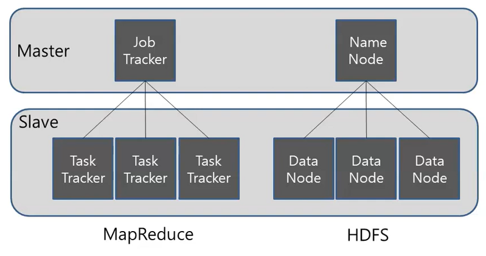

# Hadoop 기초 정리

- Hadoop(High-Availability Distributed Object-Oriented Platform) 이란?
    - 자바 소프트웨어 Framewark로 대량의 자료(BigData)의 분산 저장과 분석을 위한 분산 컴퓨팅 Solution이다. 일반적으로 하둡파일시스템(HDFS; Hadoop Distributed File System)과 맵리듀스(MapReduce) Framewark로시작되었으나, 여러 데이터 저장, 실행 엔진, 프로그래밍 및 데이터 처리 같은 Hadoop 생태계 전반을 포함하는 의미로 확장 발전되었다.
    - 빅데이터를 알아서 여러 대의 컴퓨터에 나눠서 저장해주고, 필요시 알아서 불러오는 시스템. 이 때 같은 내용을 중복되게 저장을 하기 때문에 손실되더라도 복구가 가능하다.
    - 분석 시 데이터를 분석하고 합치면 되므로 빠르다. 하지만 저장된 데이터를 변경하는 것이 불가능하고, 실시간 데이터와 같은 신속한 작업에서는 부적합하다.
    - 정형데이터와 비정형데이터에 모두 사용 가능하다.
    - 고가용성을 제공하기 위해 하드웨어에 의존하는 대신 라이브러리 자체는 애플리케이션 계층에서 오류를 감지하고 처리하도록 설계 되어있다.
    - 데이터가 들어오면 데이터를 쪼갠뒤 분리해서 저장한다. 따라서 데이터를 쪼갠 후 어느 데이터 노드에 저장이 되어 있는지를 기록한 메타데이터가 필요하다.
        - ⇒ 하둡에서 데이터를 저장하기 전에 네임노드에서 분산을 하고 저장위치를 분배한다. 그 후 여러개 중에 지정된 데이터 노드에 저장을 한다.
    
- Hadoop 버전 별 특징
    - V1
        - 2011년 자바 프레임워크로 분산저장과 병렬처리를 목적으로 탄생
        - 분산저장의 경우 네임노드(Name node)와 데이터노드(Data node)로 나누어 처리된다.
            - 이 때 Name node는 블록 정보를 가지고 있는 Meta Data와 Data Node를 관리한다. Data Node는 Data를 블록 단위로 저장하면서 블록 단위 Data를 복제하여 데이터 유실에 대비한다
        - 병렬 처리는 잡트래커(JobTracker)와 태스크트래커(TaskTracker)가 담당한다. JobTracker는 전체 진행 상황을 관리하고 자원 관리도 처리한다. TaskTracker는 실제 작업을 처리하는 일을 한다.
            - 이 때 병렬 처리의 작업 단위는 슬롯으로, Map Slot과 Reduce Slot이 있다. 병렬 처리를 통해 Cluster당 최대 4000개의 Node를 등록 가능하다.
        - 작업 단위는 잡(job)
    - V2
        - 2012년 v1을 보안 발전시킨 버전으로 JobTracker의 병목 현상을 제거하기 위해 YARN 아키텍처가 등장했다. YARN 아키텍처는 JobTracker의 병목 현상을 해결하기 위해 JobTracker의 기능을 분리한다.
            - 자원 관리 : Resource Manager, Node Manager (Cluster 당 만 개 Data 등록 가능)
            - 애플리케이션의 라이프 사이클 관리(작업 관리) : Application Master(Cluster 당 만 개 Data 등록 가능)
            - 작업 처리 : Container
                - ⇒ Container : YARN 아키텍처의 작업 처리 단위
        - 작업이 들어오면 Application Master가 생성되고, Application Master가 Resource Manager에 자원을 요청하여 실제 작업을 담당하는 Container를 할당 받아 작업을 처리한다. Container는 작업이 요청되면 생성되고, 작업이 완료되면 종료되기에 Cluster를 효율적으로 사용할 수 있다. YARN 아키텍처는 컨테이너를 할당 받아 동작하므로 Spark, HBase, Storm 등 다양한 Component를 실행할 수 있다.
        - Hadoop v1의 작업 단위는 Job, Hadoop v2는 Application. YARN 아키텍처 도입으로 이름은 변경되었지만 관리는 동일하다.
    - v3
        - 2017년에 정식 발표
        - Erasure Coding 도입으로 기존의 블록 복제를 대체하는 방식으로 HDFS 사용량 감소
        - YARN Timeline 서비스를 도입하여 기존 Timeline 서비스보다 많은 정보 확인 가능
        - JAVA 8 지원
        - 2개 이상의 name node를 지원하여 Standby node를 여러 개 지원 가능
        
- HDFS(Hadoop Distributed FileSystem)
    - HDFS는 하둡 네트워크에 연결된 기기에 데이터를 저장하는 분산형 FIle System으로 실시간 처리보다는 배치 처리를 목적으로 설계. 따라서 작업량이 작거나 빠른 데이터 응답이 필요한 작업에서는 적합하지 않음
    - HDFS의 4가지 특징
        - 기본적으로 HDFS는 데이터를 블록 단위로 나누어 저장. 따라서 큰 데이터를 나누어 저장하므로 단일 디스크보다 큰 파일도 저장 가능.
        - 블록 단위가 256MB라면 1G 파일은 4개의 블록으로 나누어 저장. 만일 블록 단위보다 작은 크기의 파일이라면 파일을 나누지 않고 그대로 저장
        - HDFS는 각 블록을 복제하여 중복 저장. 하나의 블록은 3개의 블록으로 복제되어 저장됨. 따라서 1G 데이터를 저장할 때 3G의 저장 공간 필요
        - HDFS는 읽기 중심을 목적으로 만들어졌기에 파일 수정은 지원하지 않음(읽기 속도 향상)
        - MapReduce는 HDFS의 데이터 지역성을 이용하여 처리 속도 증가. 데이터를 처리할 때 데이터를 알고리즘이 있는 곳으로 이동 시켜 처리하지 않고, 데이터의 위치에서 알고리즘을 처리하여 데이터 이동 비용 감소
    - HDFS Architecture
        - HDFS는 Master-Slave 구조.
            
            
            
        - 위 그림처럼 분산 처리 시스템이기에 MapReduce와 HDFS는 기본적으로 Master와 Slave의 관점으로 구분됨.
        - MapReduce는 일을 어떻게 나눠서 수행하는지를 Master에서 관리하고, HDFS는 저장 시 어떻게 분산 저장할 지를 Master에서 관리
        - HDFS는 Master - Slave 구조로 하나의 name node와 여러 개의 data node로 구성. namenode는 metadata를 가지고 있고, data는 블록 단위로 나누어 datanode에 저장. 데이터를 읽고 쓰려면 사용자는 metadata를 가지고 있는 namenode를 이용한다.
    - Namenode
        - Namenode는 분산 처리 시스템에서 Master를 담당하며, metadata 관리와 datanode를 관리
            - namenode는 각 datanode에서 전달하는 metadata를 받은 후 전체 node의 metadata 정보와 파일 정보를 묶어서 관리
            - 파일 시스템을 유지하기 위해 metadata 관리
            - 데이터를 저장할 시 기본적으로 블록 단위로 들어옴. 이 때 들어온 블록들은 어느 datanode에서 저장할 지를 정해준다.
        - datanode는 실제로 데이터를 저장하는 컴퓨터이기에 에러가 날 수 있다. 따라서 namenode와 datanode는 3초마다 heartbeat를 주고 받음. 알림이 오지 않으면 문제가 생겼다고 판단하여 다른 datanode에 복제된 블록을 가지고 와서 사용함
    - Metadata
        - metadata는 전체적인 구조를 나타낸다. 그리고 metatdata는 파일 이름, 파일 크기, 파일 소유자 및 그룹 소유자, 파일이 위치한 블록의 정보 등으로 구성. 저장 위치는 사용자가 설정한 위치(dfs.name.dir)
    - Datanode
        - datanode는 data들이 저장되는 컴퓨터. datanode는 파일을 저장하는 역할을 하며, 이 때 파일은 블록 단위로 저장됨. datanode는 주기적으로 namenode에 heartbeat와 block report를 전달
            - block report : 블록의 변경사항을 체크하고, namenode의 metadata 갱신. 블록 파일의 저장 위치는 사용자가 설정한 위치(dfs.data.dir)
        - datanode는 상태를 나타내는 정보로 활성 상태와 운영 상태 확인 가능
            - 활성 상태
                - datanode가 Live, Dead 상태인지 확인. datanode가 heartbeat를 통해 활성 상태가 확인 되면 Live, 지정 시간 동안 heartbeat를 받지 못하면 namenode는 datanode의 상태를 Stale 상태로 변경. 그 이후에도 지정 시간 동안 응답이 없으면 Dead node로 변경
            - 운영 상태
                - 운영 상태는 보통 datanode의 업그레이드나 작업을 하기 위해 서비스를 잠시 멈춰야 할 경우 블록을 안전하게 보관하기 위해 설정. 종류는 다음과 같다.
                    
                    
                    
    - Namenode의 구동 과정
        - namenode는 Fsimage와 Edits를 읽어 작업을 처리
        - 먼저 Fsimage를 읽어 메모리에 적재한 후 Edits 파일을 읽어와 변경 내역을 반영. 현재의 메모리 상태를 반영하여 Fsimage 파일을 생성. datanode로부터 blockreport를 수신하여 매핑 정보를 생성하고 서비스를 시작
    - HDFS 파일 사용
        - HDFS File Read
            
            
            
            1. open() 명령어를 통해 DistributedFileSystem에 있는 FileSystem의 파일을 연다
            2. RPC()를 NameNode를 호출하여 저장되어있는 블록이 저장된 DataNode의 주소를 받는다
            3. DistributedFileSystem은 Client가 데이터를 검색할 수 있도록 검색을 지원하는 입력 Stream FSDataInputStream을 client에게 준다. 그것을 통해 찾고자 하는 Datanode와 DFSInputStream이 맵핑. 검색 후 read90 명령어를 통해 호출
            4. datanode 주소가 저장된 DFSInputStream은 datanode와 연결되고, data는 datanode에서 Client로 가게 된다. 이러한 형식으로 반복 read()가 호출되어 파일을 읽는다
            5. 블록 끝에 도달하면 DFSInputStream은 데이터 노드에 대한 연결을 닫고, 다음 블록에 가장 적합한 Datanode를 찾는다
            6. 읽기가 마치면 FSDataInputStrea에서 close()를 호출
    - Block
        - Hadoop의 HDFS는 파일을 datablock이라는 작은 크기의 블록으로 나눈다. HDFS는 지정한 크기의 블록으로 나누어 지고 각각 독립적으로 저장. 지정한 크기보다 작은 파일은 실제 파일 크기의 블록으로 저장되고, 지정 크기보다 크다면 나눠서 저장. 따라서 파일의 모든 블록은 마지막 블록을 제외하고는 동일한 크기
        - HDFS의 데이터 블록은 기본적으로 검색 및 네트워크 트래픽 비용을 줄여줌. 기본적으로는 128MB 크기의 덩어리이며, 크기는 재설정 가능
    - HDFS Federation
        - HDFS Federation은 Directory 단위로 namenode를 등록하여 사용하는 것으로, 파일이 많아짐에 따른 메모리 관리 문제를 해결하기 위해 Hadoop v2부터 지원. HDFS Federation은 Directory 단위의 namenode를 독립적으로 관리하기에 하나의 namenode에 문제가 생기더라도 다른 namenode에 영향을 주지 않음
    - HDFS High Availability
        - namenode에 문제가 발생하면 모든 작업이 중지되고, 파일을 읽거나 쓸 수 없게 됨. Hadoop v2에서 이 문제를 해결하기 위해 HDFS High Availability를 제공. HDFS High Availability은 이중화된 두 대의 서버인 Active namenode와 Standby namenode를 이용하여 지원. Active namenode와 Standby namenode는 Datanode로부터 Block report와 Heartbeat를 모두 받아 동일한 metadata를 유지하고, 공유 스토리지를 이용하여 editfile을 공유.
            - Active namenode는 namenode의 역할을 수행
            - Standby namenode는 Active namenode와 동일한 metadata 정보를 유지하다가, Active namenode에 문제 발생 시 Standby namenode가 Active namenode로 동작
        - Active namenode에 문제 발생하는 것을 자동으로 확인하는 것이 어렵기에 보통 Zookeeper를 이용하여 장애 발생 시 자동으로 Standby namenode로 변경될 수 있도록 한다. Standby namenode는 Secondary namenode의 역할을 동일하게 수행하기에 HDFS를 High Availability 모드로 설정하였을 때는 Secondary namenode를 실행하지 않아도 된다. High Availability 모드에서 Secondary namenode를 실행하면 오류가 발생한다.
    - HDFS safemode
        - safemode는 읽기 전용 상태로 datanode 수정이 불가능하여 data의 추가, 수정, 복제가 일어나지 않는다. 보통 safemode는 node에 문제가 생겼거나 서버 운영 정비를 위해 설정한다.
    - HDFS 휴지통
        - 휴지통 기능이 설정되면 HDFS에서 삭제한 파일은 바로 삭제되지 않고, 각 사용자의 home directory 아래 휴지통 directory(/user/유저명/.Trash)로 이동
- Map Reduce
    - Hadoop은 분산 처리가 가능한 시스템(HDFS)와 저장된 데이터를 병렬 처리를 가능하게 하는 Map Reduce Farmework의 결합한 단어라 할 수 있다.
        - HDFS : 대용량 파일을 지리적으로 분산 되어 있는 수많은 서버에 저장하는 솔루션
        - Map Reduce는 분산 되어 저장된 대용량 데이터를 병렬로 처리하는 솔루션
    - Map Recude는 대용량 데이터 처리를 위한 분산 프로그래밍 모델로, 특정 데이터를 가지고 있는 Data node만 분석을 하고 결과를 받는 것이다. 즉, 통합 분석이 아닌, 개별 분석 후 결과를 취합한다
    - Map Reduce는 Map 단계와 Reduce 단계로 이뤄진다
        - Map 단계
            - 분산 되어있는 컴퓨터에서 처리하는 것
            - 흩어져 있는 데이터를 Key, Value로 데이터를 묶어준다
            - Key는 몇 번째 데이터인지, Value는 값을 추출한 정보를 가진다. 분산 되어 있는 컴퓨터에서 각각 Key와 Value를 구하게 되고, 구한 후 통합하기 위해 통합하는 곳(reduce)로 보내준다.
            - Map은 흩어져 있는 데이터를 Key, Value 형태의 연관성 있는 데이터 분류로 묶는 작업
        - Reduce 단계
            - 최종적인 통합 관리를 위해 Reduce를 한다
            - A 컴퓨터에서 특정 데이터가 5번, B 컴퓨터에서 10번 나왔다면 Reduce는 해당 데이터가 총 15번 나왔다고 통합을 해준다.
            - Reduce는 Map 단계의 Key를 중심으로 필터링 및 정렬한다. Hadoop에서는 이 Map과 Reduce 함수를 통해 구현하고 Map reduce job을 통해 제어한다
            - Reduce는 Filtering과 Sorting을 거쳐 데이터를 추출, Map 작업 중 중복 데이터를 제거하고 원하는 데이터를 추출하는 작업이다
    
    ### 버전에 따른 MapReduce 차이
    
    
    
    - Hadoop 1 버전에서는 MapReduce가 Cluster resource management와 data processing을 처리하지만, 버전 2에서는 MapReduce가 data processing만을 처리한다.
        - cluster resource management는 YARN이 처리