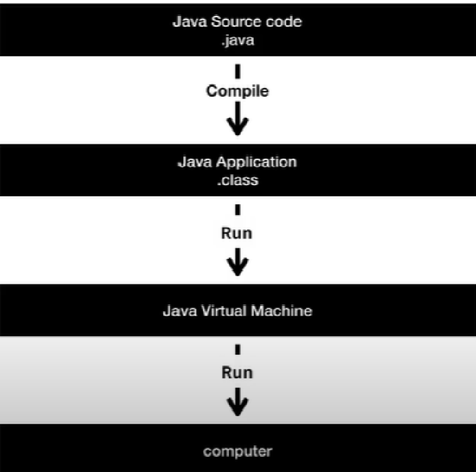
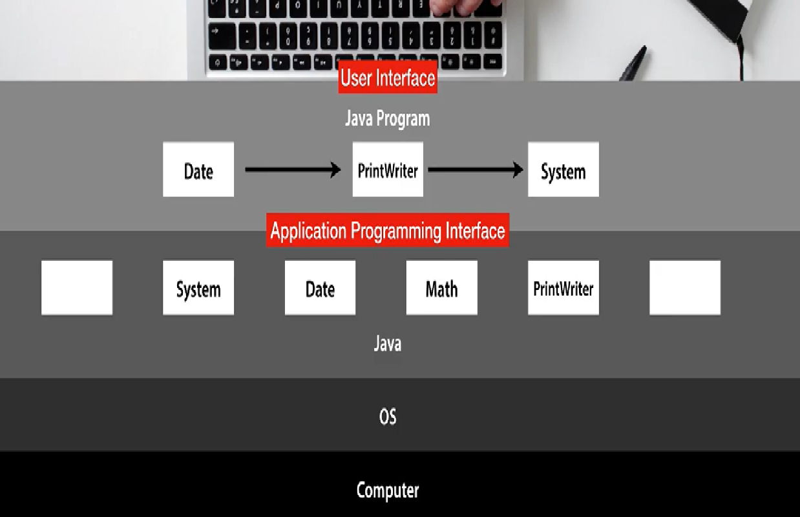
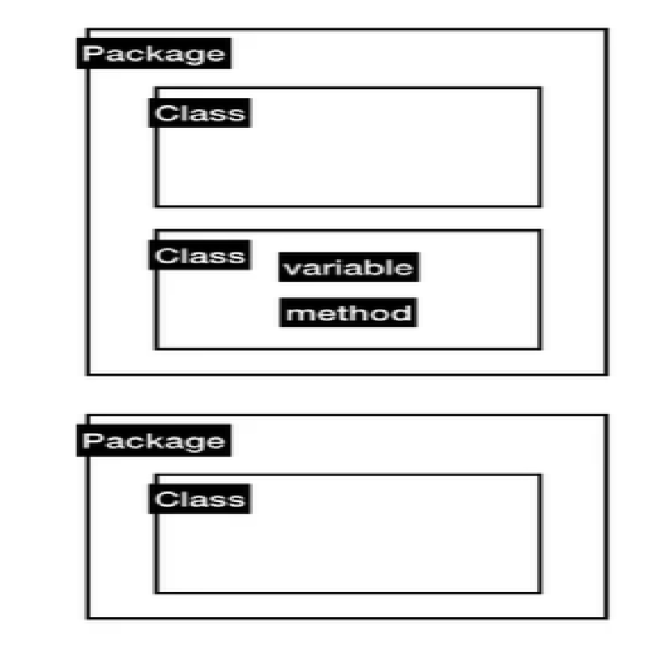
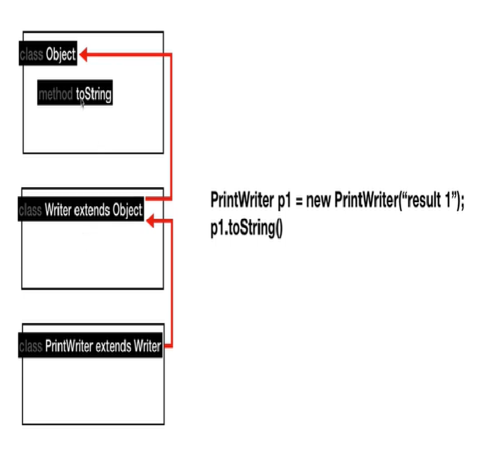
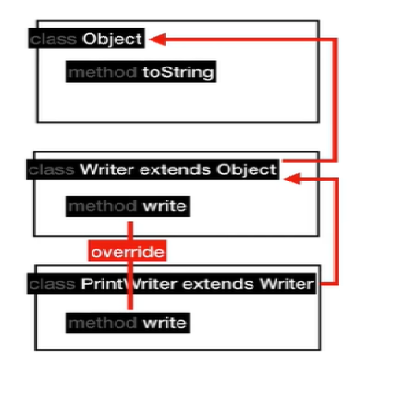

# 생활 코딩 JAVA 1

# 1. 오리엔테이션

- 수업 소개
    - Computer Programming Language 중 하나인 JAVA를 통해 프로그래밍 언어가 무엇인지 아는 것.
    - JAVA는 가장 기본적이며, 광범위하게 사용되는 언어.
    - 수업의 목적은 자립에 있다.
    - 필수적인 것을 알려주고, 불편한 것은 스스로 공부할 수 있게 할 것.
    - 문제해결의 도구를 알려줄 것.
- 실습 환경 마련
    - jdoodle
        - Java와 Eclipse를 설치하지 않고 온라인으로 실행할 수 있는 에디터 소개
        - Java 뿐만 아니라 다양한 언어를 사용할 수 있다.
        - 단, 풀스택 수업으로 eclipse를 이미 사용하고 있기에 eclipse를 사용하기로 한다.
    - 윈도우에 Java 설치하기
    - Eclipse 설치
    - Eclipse 실행, package, class 생성. HelloWorld!! 출력
- Java의 기본 작동원리
    
    
    
    - source code language 가 원인
        
        ```java
        public class HelloWorldApp {
        	public static void main(String[] args) {
        		System.out.println("Hello World!!");
        	}
        ```
        
    - Java가 .java 파일을 .class 파일로 컴파일.
    - Java Virtual Machine을 통해 source code를 기계어로 변환
    - 출력된 HelloWorldApp가 Application program, 결과.

# 2. Java의 가능성

- Java 코드로 화면에 출력하기
    
    ```java
    package Java;
    import javax.swing.*;   
    import java.awt.Dimension;
    import java.awt.Toolkit;
    public class HelloWorldGUIApp{
        public static void main(String[] args){
            javax.swing.SwingUtilities.invokeLater(new Runnable() {
                public void run() {
                    JFrame frame = new JFrame("HelloWorld GUI");
                    frame.setDefaultCloseOperation(JFrame.EXIT_ON_CLOSE);
                    frame.setPreferredSize(new Dimension(800, 300));
                    JLabel label = new JLabel("Hello World!!", SwingConstants.RIGHT);
                    frame.getContentPane().add(label);
                    Dimension dim = Toolkit.getDefaultToolkit().getScreenSize();
                    frame.setLocation(dim.width/2-400/2, dim.height/2-300/2);
    
                    frame.pack();
                    frame.setVisible(true);
                }
            });
        }
    }
    ```
    
    - 아직 이해할 수 없는 코드. 코드를 통해 이루어낼 수 있는 것이 무엇인지 가능성을 알아보는 시간.
- IOT(사물인터넷, Internet Of Things)
    - 라즈베리파이(소형컴퓨터)를 통해 Java 명령어로 사물에 명령할 수 있다.
- 안드로이드 앱
    - Android studio  (개발도구)설치
    - 실제로 프로그램(코드)이 작동하는 원리와 모습

# 5. Java 개념 소개

- 데이터와 자료형
    - 데이터 타입
        - String과 숫자(정수) 자료형 학습과 출력 방법
    - 숫자와 연산
        - Class 생성
        - 간단한 연산자
        
        ```java
        public class Number {
        
        	public static void main(String[] args) {
        		System.out.println(6 + 2);
        		System.out.println(6 - 2);
        		System.out.println(6 * 2);
        		System.out.println(6 / 2);
        		
        		System.out.println(Math.PI);
        		System.out.println(Math.floor(Math.PI));
        		System.out.println(Math.ceil(Math.PI));
        
        	}
        }
        ```
        
        - 연산자(operator) 학습. 
        *,-,+,/와 Math. 함수
    - 문자열의 표현
        - String과 Character
        - \n : 문자열 내의 줄바꿈
        - \”String\” : 문자열 내 “”주기 효과
    - 문자열 다루기
        - 문자열을 다룰 방법을 알면 내장 함수를 이용할 수 있다.
            
            ```java
            public class StringOperation {
            
            	public static void main(String[] args) {
            		System.out.println("Hello World".length());
            		System.out.println("Hello, [[[name]]] ... bye.".replace("[[[name]]]", "duru"));
            ```
            
        - length를 통해 문자열의 총 크기(글자 수)를,
        - .replace를 통해 문자열을 변수화시켜 변경할 수 있다.
- 변수와 형변환
    - 변수의 정의
        - 변수는 변하는 값.
        - Java는 변수에 따라 자료형을 정해야 한다.
        - 정수(bit,short,int,long)
        - 실수(float,double)
        - 문자열(String)
        - 문자(char)
        - 논리(boolean)
    - 변수의 효용
        
        ```java
        public class Letter {
        
        	public static void main(String[] args) {
        		String name = "egoing";
        		System.out.println("Hello, "+name+" ... "+name+" ... egoing ... bye");
        		
        		double VAT = 10.0;
        		System.out.println(VAT);
        	}
        
        }
        ```
        
        - 변수의 이름을 붙여줌으로써 코드의 가시성이 좋아지며, 유지보수성이 좋아지며, 수정이 쉬워진다.
    - 데이터 타입의 변환 (casting)
        - 형변환은 결국 데이터 타입을 다른 데이터 타입으로 컨버팅 하는 것.
        
        ```java
        public class Casting {
        
        	public static void main(String[] args) {
        		
        		double a = 1.1;
        		double b = 1;
        		double b2 = (double) 1;
        
        		System.out.println(b);
        	
        //		int c = 1.1;
        		double d = 1.1;
        		int e = (int) 1.1;
        		System.out.println(e);
        		
        //		1 to String
        		String f = Integer.toString(1);
        		System.out.println(f.getClass());
        	}
        
        }
        ```
        
        - 자료형이 맞지 않을 때, 형변환(casting)이 일어나게 된다.
- 프로그래밍
    - 프로그램 : 시간의 순서에 맞춰 일이 일어나는 것.
- IOT
    - Github에서 IOT 소스 코드 다운로드 후 적용
        
        
    - Java의 가능성. 코드를 통한 IOT 제어.
        
        ```java
        import org.opentutorials.iot.Elevator;
        import org.opentutorials.iot.Lighting;
        import org.opentutorials.iot.Security;
        
        public class OkJavaGoInHome {
        
        	public static void main(String[] args) {
        		
        		String id = "JAVA APT 507";
        		
        		// Elevator call
        		Elevator myElevator = new Elevator(id);
        		myElevator.callForUp(1);
        		
        		// Security off
        		Security mySecurity = new Security(id);
        		mySecurity.off();
        				
        		// Light on
        		Lighting hallLamp = new Lighting(id+" / Hall Lamp");
        		hallLamp.on();
        		
        		Lighting floorLamp = new Lighting(id+" / floor Lamp");
        		floorLamp.on();
        		
        	}
        
        }
        ```
        
        - import 태그를 통해 작성된 class를 불러올 수 있다. (Egoing님이 작성한)
        - id라는 변수값을 줌으로, 코드를 최적화 할 수 있다.
        - new 연산자를 통해 (import 태그를 통해 정의된 후) Elevator라는 class를 불러올 수 있다.
    - 디버거
        - 디버거 : 디버그를 할 때 사용하는 도구
        - Breakpoint : 버그가 발생 했을 때 코드를 우선 멈출 때 사용한다. 이클립스 기준 왼쪽에 더블클릭으로 코드 한 줄에 사용 가능.
        - 이후 Debug 버튼(벌레모양)을 통해  퍼스펙티브(Perspectives, 관점) 전환 가능하다. → 디버그를 하기 좋은 구성으로 테마를 바꿔준다.
        - 이후 Step Over를 통해 코드를 한 줄 한 줄 따로 실행시킴으로써 버그 확인을 수월하게 할 수 있다.
        - 그 외에도 디버거의 다양한 기능들 소개.
    - 입력(input)과 출력(output)
        - INPUT
            - Input의 종류
                - Argument
                - File
                - Network
                - Audio
                - Program 등
            - JOptionPane & showInputDialog
                
                ```java
                import javax.swing.JOptionPane;
                
                import org.opentutorials.iot.DimmingLights;
                import org.opentutorials.iot.Elevator;
                import org.opentutorials.iot.Lighting;
                import org.opentutorials.iot.Security;
                
                public class OkJavaGoInHomeInput {
                
                	public static void main(String[] args) {
                		
                		String id = JOptionPane.showInputDialog("Enter a ID");
                		String bright = JOptionPane.showInputDialog("Enter a Bright level");
                		
                		// Elevator call
                		Elevator myElevator = new Elevator(id);
                		myElevator.callForUp(1);
                		
                		// Security off
                		Security mySecurity = new Security(id);
                		mySecurity.off();
                				
                		// Light on
                		Lighting hallLamp = new Lighting(id+" / Hall Lamp");
                		hallLamp.on();
                		
                		Lighting floorLamp = new Lighting(id+" / floor Lamp");
                		floorLamp.on();
                		
                		DimmingLights moodLamp = new DimmingLights(id+" moodLamp");
                		moodLamp.setBright(Double.parseDouble(bright));
                		moodLamp.on();
                		
                	}
                
                }
                ```
                
                - JOptionPane 메소드를 통해 사용자가 정보를 입력할 수 있는 표준 대화 상자를 띄울 수 있다.
                - 단, JOptionPane 메소드는 
                import javax.swing.JOptionPane;
                태그를 통해 삽입 한 뒤 사용가능하다.
                - showInputDialog 메소드는 JOptionPane 을 통해 입력받은 내용의 리턴 값으로, 
                String id = JOptionPane.showInputDialog("Enter a ID");
                코드를 통해 사용자가 입력한 정보를 id값으로 지정할 수 있다.
                - 이는 고정된 변수가 아닌, 사용자가 입력하는 정보에 따라 변동하는 변수로 활용하기 위해 사용된다.
                - 단, 사용자가 입력한 정보는 String 값이기에 Double 변수로 사용할 수 없다.
                이 때 parseDouble 메서드를 통해 String 값을 Double로 변경한다. (String이 나타내는 값으로 초기화된 새로운 double을 반환한다.)
            - Argument & Parameter
                - Eclipse의 Run configurations 메뉴를 통해 Argument를 정의할 수 있다.
                - 이 때 Argument는 메소드가 다른 메소드에서 호출될 때 메서드 헤더에 정의된 변수에 전달되는 실제 값이다.
                
                ```java
                public static void main(String[] args) {
                ```
                
                - Argument를 받으려면 args, 매개변수(Parameter)가 필요하다.
                - args라는 변수에 사용자가 입력한 값이 들어온다.
                - 이는 public static void main(String[] args) {} 의 {} 안에서, args의 값은 사용자가 입력한 값이 된다는 것.
                
                <aside>
                💡 Argument는 띄어쓰기로 구분하며, 여러 개의 단어를 하나의 Argument로 정의할 때는 “”를 사용한다.
                
                </aside>
                
                - 이후 정의한 Argument의 순서대로, args[0]부터 시작하여 매개변수를 불러올 수 있다.
        - OUT
            - Output의 종류
                - Monitor
                - File
                - Audio
                - Program 등
        
- Compile
    - 컴파일 소개
        - 컴파일은 .java 파일을 .class 파일로 변환하는 것.
        - .class 파일로 변환(컴파일)이 이루어져야 실행이 가능하다.
        - 이전 예제들을 컴파일 하는 것이 목표
    - 실행환경 살펴보기
        - cmd에서 java, javac 실행
        - 현재 위치 경로에 상관 없이 실행되는 이유는 환경변수의 path값이 설정되어 있기 때문.
    - 컴파일과 실행하기
        - cmd에서 .java 파일이 위치한 경로로 이동 한 뒤,  
        javac “파일이름.java” 를 입력하여 .class 파일로 변환
        이후 java “파일이름” 명령어로 cmd에서 .class 파일 실행
        - 컴퓨터에서 java 파일이 돌아가는 메커니즘을 이해하는 것이 중요.
        - .java → .class 로 컴파일 과정이 있어야 읽을 수 있다는 것.
    - 라이브러리 이용
        - 라이브러리는 곧 타인이 타인이 만든 소프트웨어.
        - 불러오는 class 파일이 다른 package 안에 있을 때, cmd에서 읽어올 수 있는 방법
        -cp “디렉토리; 디렉토리” 명령어를 이용한다.
    - 입력과 출력
        - cmd를 이용해 arg 매개변수가 적용된 파일 읽어보기
        - “Java Apt 1004” 15
        와 같은 방식으로, 하나의 변수값은 “”로 묶고, 서로 다른 변수는 띄어쓰기로 구분한다.
        - 컴파일이 이루어지는 과정(이클립스가 자동으로 해 주던)에 대한 이해.
- API VS UI
    - System, Date, Math, PrintWriter와 같은, Java가 기본적으로 내장하고 있는 기능을 기본 라이브러리라고 한다.
    - 이와 같은 기본 라이브러리를 이용해, 시간의 순서에 맞춰 실행하도록 함으로서 프로그램을 만든다.
    - Java가 기본적으로 제공하는 부품들의 조작방법이 API(Application Programming Interface)
    - 그렇게 만들어진 결과물이 사용자에 의해 사용될 때(버튼을 누르는 등의), 그 조작장치를 UI(User Interface)
    - 만들어낸 프로그램이 다른 프로그램의 부품이 될 떄, 이 역시 API
    
    
    
    - Computer → OS → Java -(API)→ Java Program -(UI)→ User의 도식.
- 패키지, 클래스, 변수, 메소드
    - [https://docs.oracle.com/javase/7/docs/api/](https://docs.oracle.com/javase/7/docs/api/)
    - 위 링크를 통해 Java의 class와 package 검색이 가능하다.
    - Class들을 모아 그룹핑 한 것이 Package, Variable과 method를 모아 그룹핑 한 것이 Class.
    
    
    
- 클래스
    - Math.PI 에서 PI가 변수, Math가 클래스
    - Math.PI, Math.floor(), Math.ceil() 과 같은, 여러 변수들(메소드)(PI,floor,ceil)을 묶어주는 것이 Class(Math)
- 인스턴스
    
    ```java
    import java.io.FileNotFoundException;
    import java.io.IOException;
    import java.io.PrintWriter;
    public class InstanceApp {
    
    	public static void main(String[] args) throws IOException {
    		
    		PrintWriter p1 = new PrintWriter("result1.txt");
    		p1.write("Hello 1");
    		p1.close();
    
    		PrintWriter p2 = new PrintWriter("result2.txt");
    		p2.write("Hello 2");
    		p2.close();
    	}
    
    }
    ```
    
    - 인스턴스는 Class를 일회용이 아닌, 긴 맥락으로 사용할 필요가 있을 때 쓰인다.
    - PrintWriter는 new를 통해 인스턴스(p1, p2)를 만들고, 인스턴스는 내부적으로 각자의 상태(”result1.txt”, “result2.txt”)를 가지고 있다.
    
    <aside>
    💡 PrintWriter는 내장함수지만 패키지를 가지고 와야 사용할 수 있다.
    단, 예외처리가 필요하지만 현재로서는 이해하기 어려워 
    throws 값을 설정, 
    import java.io.FileNotFoundException;
    import java.io.IOException;
    import java.io.PrintWriter;
    로 출력된다는 점만 이해해 둔다.
    
    </aside>
    
- 상속
    
    ```java
    Java.lang.Object
    	Java.io.Writer
    		Java.io.PrintWriter
    ```
    
    - Writer가 Object의 자식, PrintWriter가 Writer의 자식 개념
    - 이와 같은 개념을 상속이라고 한다.
    - 어떠한 기능을 만들 때 처음부터 끝까지 만드는게 아닌, 기존에 있는 클래스가 가지고 있는 메소드, 변수를 그대로 물려 받고, 원하는 메소드와 변수를 추가한 게 자식의 개념.
    - 즉, PrintWriter는 Writer의 메소드와 변수에 PrintWriter만의 메소드와 변수가 추가된 것.
    
    
    
    - 위의 PrintWriter 에 toString이라는 메소드가 없어도, 부모의 부모인 Object에 toString이 있다면 실행 가능하다.
        
        
        
    - 단, Writer의 write 메서드를 PrintWriter의 write 메소드로 덮어 씌울 수도 있는데, 이를 override라고 한다.

# 6. 실습

- 오리엔테이션
    - 최소한의 기능으로 실현하기
    - 불편함을 해소하기 위한 방법
    - 지식은 목적지이면서 경유지.
    - 최소한으로 일하고 최대한으로 일하라.
    - 만들 프로그램에 대한 간략한 설명
- 기본 기능 구현
    - 변수를 사용하지 않고, 연산자만 가지고 기능 만들기
    - Eclipse의 editor → find/replace 기능을 통해 특정 값을 모두 변경할 수 있다.
    
    ```java
    package MyApp;
    
    public class AccountingApp {
    
    	public static void main(String[] args) {
    		System.out.println("Value of supply : "+12345.0);
    		System.out.println("VAT : "+(12345.0*0.1) );
    		System.out.println("Total : "+(12345.0 + 12345.0*0.1) );
    		System.out.println("Expense : "+(12345.0*0.3) );
    		System.out.println("Income : "+(12345.0 - 12345.0*0.3) );
    		System.out.println("Dividend 1 : "+(12345.0 - 12345.0*0.3) * 0.5);
    		System.out.println("Dividend 2 : "+(12345.0 - 12345.0*0.3) * 0.3);
    		System.out.println("Dividend 3 : "+(12345.0 - 12345.0*0.3) * 0.2);
    		
    	}
    
    }
    ```
    
- 변수 도입
    - 앞서 만들었던 코드의 12345.0을 변수화할 수 있다. 
    double valueOfSupply = 12345.0; 을 통해 valueOfSupply란 이름으로 변수화한 뒤에,
    - alt + shift + L을 통해 일괄적으로 변수로 지정(변경)할 수 있다.
    
    ```java
    package MyApp;
    
    public class AccountingApp {
    
    	public static void main(String[] args) {
    		
    		double valueOfSupply = 10000.0;
    		double vatRate = 0.1; 
    		double expenseRate = 0.3;
    		double vat = valueOfSupply * vatRate;
    		double total = valueOfSupply + vat;
    		double expense = valueOfSupply * expenseRate;
    		double income = valueOfSupply - expense;
    		double dividend1 = income * 0.5;
    		double dividend2 = income * 0.3;
    		double dividend3 = income * 0.2;
    		
    		System.out.println("Value of supply : "+valueOfSupply);
    		System.out.println("VAT : "+vat );		
    		System.out.println("Total : "+total );		
    		System.out.println("Expense : "+expense );
    		System.out.println("Income : "+income );
    		System.out.println("Dividend 1 : "+dividend1);
    		System.out.println("Dividend 2 : "+dividend2);
    		System.out.println("Dividend 3 : "+dividend3);
    		
    		
    	}
    
    }
    ```
    
    - 변수 값을 포함한 변수. 변수의 사용은 유지보수성과 편의성을 급격히 상승시켜줄 수 있다.
- 입력값 도입
    - argument 값 도입을 통해 변수의 자동화
    - 단, main method의 표현식은 String이기에, double값으로 변경해줘야 한다.
    - Double.parseDouble(args[]); 을 통해 가능하다.
    - 단, 이와 같은 방식은 매번 Eclipse를 통해 argument값을 정의해 줘야 한다.
    - 파일이 위치한 곳의 디렉토리 주소를 cmd에 입력
    - dir 명령어를 통해 파일 확인
    - 파일이 없다면 javac [파일이름.java](http://파일이름.java) 명령어로 컴파일.
    - 그 후 java [파일이름.java](http://파일이름.java) argument값 입력으로 실행 가능하다.
- 오리엔테이션2
    - 지금까지는 배운 내용을 실습했지만, 앞으로는 배우지 않은 내용.
    - 중요한 것은 문법을 이해하는 것이 아닌, 문법이 어떠한 불편함으로부터 탄생했는지를 이해하자.
- 조건문
    - 입력값(변수)에 따라 결과(리턴)을 다르게 주고 싶을 때, if 조건문을 사용한다
    
    ```java
    package MyApp;
    
    public class AccountingIFApp {
    
    	public static void main(String[] args) {
    		
    		double valueOfSupply = Double.parseDouble(args[0]);
    		double vatRate = 0.1; 
    		double expenseRate = 0.3;
    		double vat = valueOfSupply * vatRate;
    		double total = valueOfSupply + vat;
    		double expense = valueOfSupply * expenseRate;
    		double income = valueOfSupply - expense;
    		
    		double dividend1;
    		double dividend2;
    		double dividend3;
    		
    		if(income > 10000.0) {
    			dividend1 = income * 0.5;
    			dividend2 = income * 0.3;
    			dividend3 = income * 0.2;
    		} else {
    			dividend1 = income * 1.0;
    			dividend2 = income * 0.0;
    			dividend3 = income * 0.0;
    		}
    		
    		System.out.println("Value of supply : "+valueOfSupply);
    		System.out.println("VAT : "+vat );		
    		System.out.println("Total : "+total );		
    		System.out.println("Expense : "+expense );
    		System.out.println("Income : "+income );
    		System.out.println("Dividend 1 : "+dividend1);
    		System.out.println("Dividend 2 : "+dividend2);
    		System.out.println("Dividend 3 : "+dividend3);
    		
    		
    	}
    
    }
    ```
    
    - 위와 같은 코드를 작성 후, argument값을 10000 이상, 이하로 다르게 설정한 뒤, 각각의 argument 값을 실행함으로서 조건문을 실행하게 할 수 있다.
    - if() {} else {} 조건문 위에  
    double dividend1,2,3 을 명시해 둔 이유는 아직 설명되지 않음. 지금은 그래야 한다- 는 정도로만 이해할 것.
- 배열
    - 변수가 많아질 수록 변수가 꼬일 가능성이 높아진다.
    - 서로 연관된 데이터를 정리정돈하기 위한 수단이 곧 배열
    
    ```java
    package MyApp;
    
    public class AccountingArrayApp {
    
    	public static void main(String[] args) {
    		
    		double valueOfSupply = Double.parseDouble(args[0]);
    		double vatRate = 0.1; 
    		double expenseRate = 0.3;
    		double vat = valueOfSupply * vatRate;
    		double total = valueOfSupply + vat;
    		double expense = valueOfSupply * expenseRate;
    		double income = valueOfSupply - expense;
    		
    		double[] dividendRates = new double [3];
    		dividendRates[0] = 0.5;
    		dividendRates[1] = 0.3;
    		dividendRates[2] = 0.2;
    		
    		double dividend1 = income * dividendRates[0];
    		double dividend2 = income * dividendRates[1];
    		double dividend3 = income * dividendRates[2];
    		
    		System.out.println("Value of supply : "+valueOfSupply);
    		System.out.println("VAT : "+vat );		
    		System.out.println("Total : "+total );		
    		System.out.println("Expense : "+expense );
    		System.out.println("Income : "+income );
    		System.out.println("Dividend 1 : "+dividend1);
    		System.out.println("Dividend 2 : "+dividend2);
    		System.out.println("Dividend 3 : "+dividend3);
    		
    		
    	}
    
    }
    ```
    
    - 위와 같은 코드에서, 0.5, 0.3, 0.2라는 배분에 해당하는 3가지 변수를 dividendRates라는 배열 안에 넣고, 각각의 argument값을 동일한 배열의 이름 뒤에 []를 이용해 추가함으로서, 변수의 최소화와 이를 통한 유지보수의 상승을 누릴 수 있게 된다.
    - 배열의 선언은 자료형(double)[] 배열이름 = new 자료형(double) [배열 안 변수의 숫자]를 통해 할 수 있다.
    double[] dividendRates = new double [3]
- 반복문
    - 특정한 로직의 코드(데이터만 다른 동일한 일)를 많이 사용해야 할 때, 중복을 제거하고 유지보수를 수월하게 하기 위한 방법론이 반복문
    
    ```java
    package MyApp;
    
    public class AccountingArrayLoopApp {
    
    	public static void main(String[] args) {
    		
    		double valueOfSupply = Double.parseDouble(args[0]);
    		double vatRate = 0.1; 
    		double expenseRate = 0.3;
    		double vat = valueOfSupply * vatRate;
    		double total = valueOfSupply + vat;
    		double expense = valueOfSupply * expenseRate;
    		double income = valueOfSupply - expense;
    
    		System.out.println("Value of supply : "+valueOfSupply);
    		System.out.println("VAT : "+vat );		
    		System.out.println("Total : "+total );		
    		System.out.println("Expense : "+expense );
    		System.out.println("Income : "+income );		
    		
    		double[] dividendRates = new double [3];
    		dividendRates[0] = 0.5;
    		dividendRates[1] = 0.3;
    		dividendRates[2] = 0.2;
    		
    		int i = 0;
    		while(i < dividendRates.length) {
    			System.out.println("Dividend 1 : "+ (income*dividendRates[i]) );
    			i = i + 1;
    		}
    		
    		
    	}
    
    }
    ```
    
    - while(반복문의 시행횟수) {반복해서 시행할 코드} 형식으로 사용한다.
    - 위 코드의 경우, 0으로 지정된 i의 값이  dividenRates 배열의 length(길이, 배열 안 변수의 숫자,3) 보다 작을 때,{}안의 코드를 반복시행하게 된다.
    - {} 안에 i 값에 1을 더하는 코드가 있으므로, 3번 반복하여 i가 3이 되면 i<dividendRates.length가 false가 되므로, 반복문의 시행이 멈추게 된다.
- 메소드
    - 메소드는 서로 연관된 코드를 그룹핑해서 이름을 붙인 정리정돈의 상자.
    
    ```java
    package MyApp;
    
    public class AccountingMethodApp {
    	public static double valueOfSupply;
    	public static double vatRate;
    	public static double expenseRate;
    	public static void main(String[] args) {
    		
    		valueOfSupply = 10000.0;
    		vatRate = 0.1; 
    		expenseRate = 0.3;
    		print();		
    	}
    
    	public static void print() {
    		System.out.println("Value of supply : "+valueOfSupply);
    		System.out.println("VAT : "+getVAT() );		
    		System.out.println("Total : "+getTotal() );		
    		System.out.println("Expense : "+getExpense() );
    		System.out.println("Income : "+getIncome() );
    		System.out.println("Dividend 1 : "+getDividend1());
    		System.out.println("Dividend 2 : "+getDividend2());
    		System.out.println("Dividend 3 : "+getDividend3());
    	}
    
    	public static double getDividend1() {
    		return getIncome() * 0.5;
    	}
    	public static double getDividend2() {
    		return getIncome() * 0.3;
    	}
    	public static double getDividend3() {
    		return getIncome() * 0.2;
    	}
    	public static double getIncome() {
    		return valueOfSupply - getExpense();
    	}
    	public static double getExpense() {
    		return valueOfSupply * expenseRate;
    	}
    	public static double getTotal() {
    		return valueOfSupply + getVAT();
    	}
    	public static double getVAT() {
    		return valueOfSupply * vatRate;
    		//메소드를 만드는 코드
    	}
    
    }
    ```
    
    - 지역변수는 변수가 있는 메소드({}) 안에서만 사용(호출) 가능하다.  전역변수로 지정 시(class 메소드 안에서 지정), 모든 메소드에서 사용 가능하다.
    - Eclipse 기준, Refactor에서 Extract Method (ctrl + shift + m)를 통해 메소드로 지정이 가능하다.
    - 메소드 안의 변수값(이 안의 값)을 삭제할 수 있다.
    - 다만, 이 경우 지역변수는 다른 변수를 읽어올 수 없기에 main 메소드 안의 메소드들은 다른 메소드에서 값을 불러올 수 없다.
    - 그렇기에 해당 변수를 지역변수가 아닌 전역 변수로 지정( public static double valueOfSupply;) 하는 과정이 필요하다.
    이는 Eclipse 기준, Refactor에서 Convert Local Variable to Field를 통해 전역변수로 지정할 수 있다.
    - 지정된 메소드는 get메소드이름() 으로 불러올 수 있다.
    public static double getDividend3() {
    		return getIncome() * 0.2;
    	}
- 클래스
    - Object : 객체.
    - 객체는 Class라는 표현을 쓰기도 하는데, Class는 서로 연관된 변수와 메서드를 그룹핑 한 것이다. 그리고 거기에 이름을 붙인 것이며, 정리정돈의 상자이다.
    - 메소드, Class가 중요한 이유는 소프트웨어를 만드는데 있어 구조를 결정하기 때문에 중요한 것.
    - Show View의 Outline을 통해 클래스 안의 멤버(method, 변수)들을 확인할 수 있다.
    - Class는 메소드가 변수들을 묶은 것과 같이, 메소드들을 묶는 것과 같은 역할을 한다.
    
    ```java
    package MyApp;
    class Accounting{
    	public static double valueOfSupply;
    	public static double vatRate;
    	public static double expenseRate;
    	public static void print() {
    		System.out.println("Value of supply : "+valueOfSupply);
    		System.out.println("VAT : "+getVAT() );		
    		System.out.println("Total : "+getTotal() );		
    		System.out.println("Expense : "+getExpense() );
    		System.out.println("Income : "+getIncome() );
    		System.out.println("Dividend 1 : "+getDividend1());
    		System.out.println("Dividend 2 : "+getDividend2());
    		System.out.println("Dividend 3 : "+getDividend3());
    	}
    	public static double getDividend1() {
    		return getIncome() * 0.5;
    	}
    	public static double getDividend2() {
    		return getIncome() * 0.3;
    	}
    	public static double getDividend3() {
    		return getIncome() * 0.2;
    	}
    	public static double getIncome() {
    		return valueOfSupply - getExpense();
    	}
    	public static double getExpense() {
    		return valueOfSupply * expenseRate;
    	}
    	public static double getTotal() {
    		return valueOfSupply + getVAT();
    	}
    	public static double getVAT() {
    		return valueOfSupply * vatRate;
    	}
    }
    public class AccountingClassApp {
    	
    	public static void main(String[] args) {
    		
    		Accounting. valueOfSupply = 10000.0;
    		Accounting. vatRate = 0.1; 
    		Accounting. expenseRate = 0.3;
    		Accounting. print();	
    		}
    }
    ```
    
    - 위의 코드에서, valueOfSupply, varRate, expenseRate 등의 메소드들을 Accounting이라는 class 아래에 묶어둠으로서, 각각의 메소드들이 하는 역할에 맞춰 class를 지정하는 것이 핵심. 이 역시, 유지보수의 상승이 목적이다.
- 인스턴스
    - 인스턴스는 하나의 class를 복제해서, 서로 다른 데이터의 값과 서로 같은 메소드를 가진 복제본을 만드는 것.
    - 하나의 class 안에서 변수 값의 변경이 자주 일어나면 버그의 가능성이 커지며, 유지보수성과 가독성이 떨어진다.
    - 그럴 때 사용하는 것이 인스턴스로, 서로 같은 메소드의 변수 값(데이터의 값)만 변경한 복제 파일을 만들어, class를 간결화하는 것.
    
    ```java
    package MyApp;
    class Accounting{
    	public double valueOfSupply;
    	public double vatRate;
    	public double expenseRate;
    	public void print() {
    		System.out.println("Value of supply : "+valueOfSupply);
    		System.out.println("VAT : "+getVAT() );		
    		System.out.println("Total : "+getTotal() );		
    		System.out.println("Expense : "+getExpense() );
    		System.out.println("Income : "+getIncome() );
    		System.out.println("Dividend 1 : "+getDividend1());
    		System.out.println("Dividend 2 : "+getDividend2());
    		System.out.println("Dividend 3 : "+getDividend3());
    	}
    
    	public double getDividend1() {
    		return getIncome() * 0.5;
    	}
    	public double getDividend2() {
    		return getIncome() * 0.3;
    	}
    	public double getDividend3() {
    		return getIncome() * 0.2;
    	}
    	public double getIncome() {
    		return valueOfSupply - getExpense();
    	}
    	public double getExpense() {
    		return valueOfSupply * expenseRate;
    	}
    	public double getTotal() {
    		return valueOfSupply + getVAT();
    	}
    	public double getVAT() {
    		return valueOfSupply * vatRate;
    	}
    }
    public class AccountingClassApp {
    	
    	public static void main(String[] args) {
    		
    		Accounting a1 = new Accounting();
    		a1.valueOfSupply = 10000.0;
    		a1.vatRate = 0.1;
    		a1.expenseRate = 0.3;
    		a1.print();
    		
    		Accounting a2 = new Accounting();
    		a2.valueOfSupply = 20000.0;
    		a2.vatRate = 0.05;
    		a2.expenseRate = 0.2;
    		a2.print();
    		
    		a1.print();
    	}
    }
    ```
    
    - 위의 코드에서, Accounting이라는 Class에 a1이라는 변수의 이름을 부여한 뒤,
    - Accounting a1 = new Accounting(); 을 통해서 a1이라는 변수명을 Accounting의 인스턴스로 만든다.
    - 이를 통해 Accounting이라는 Class 안의 변수(valueOfSupply등) 값이 변경 됐을 때, 각각의 인스턴스 안에 변수값을 지정함으로서 클래스의 변경이 아닌 인스턴스의 변경이라는 방식을 취할 수 있다.

# 7. 수업을 마치며

- 프로그램은 결국 시간의 순서에 맞춰 실행하는 것이 본질이다.
- 가장 좋은 프로그램은 나에게 필요한 프로그램.

---

[JAVA Method](JAVA_생활코딩/JAVA%20Method%2092d3c08a389b43979a5fca8c1c826cec.md)

[JAVA 제어문](JAVA_생활코딩/JAVA%20%E1%84%8C%E1%85%A6%E1%84%8B%E1%85%A5%E1%84%86%E1%85%AE%E1%86%AB%20b1afb3e22d7941f6b4af6aa4850d0172.md)

[JAVA 객체지향 프로그래밍](JAVA_생활코딩/JAVA%20%E1%84%80%E1%85%A2%E1%86%A8%E1%84%8E%E1%85%A6%E1%84%8C%E1%85%B5%E1%84%92%E1%85%A3%E1%86%BC%20%E1%84%91%E1%85%B3%E1%84%85%E1%85%A9%E1%84%80%E1%85%B3%E1%84%85%E1%85%A2%E1%84%86%E1%85%B5%E1%86%BC%20165b1cb94a6841a6962ad39721079b45.md)

[JAVA 상속](JAVA_생활코딩/JAVA%20%E1%84%89%E1%85%A1%E1%86%BC%E1%84%89%E1%85%A9%E1%86%A8%20ab37ba58a3b84e6aa3cc2ec35b3b7f1e.md)

[~~JAVA Interface~~](JAVA_생활코딩/JAVA%20Interface%20e12fd2b9ba364d36b913e61cbc76a10f.md)

[JAVA Polymorphism](JAVA_생활코딩/JAVA%20Polymorphism%20fa61712e43454e69b9c83da2b310fedb.md)

[JAVA Generic](JAVA_생활코딩/JAVA%20Generic%2002a5753472034855b96b7aafff65340c.md)

[JAVA 예외(Exception)](JAVA_생활코딩/JAVA%20%E1%84%8B%E1%85%A8%E1%84%8B%E1%85%AC(Exception)%204a3e8392034d469fa8ead99786c1bad3.md)

[JAVA Collections Framework](JAVA_생활코딩/JAVA%20Collections%20Framework%2061fd5b17bef84c5281fdb1d6ca240110.md)