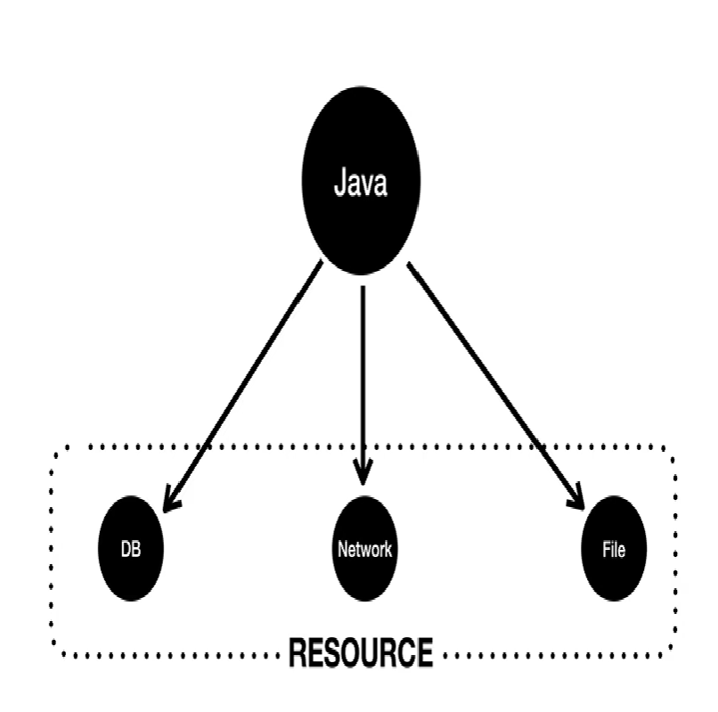

# JAVA 예외(Exception)

# 오리엔테이션

- 수업 소개
    - ERROR는 숙명과도 같아, 자바가 동작하는 환경에서 발생하는 에러. 개발자가 만든 프로그램과 별개로 발생하는 에러
    - EXCEPTION 은 운명과도 같아, 개발자가 만든 코드에서 발생하는 에러. 개발자가 만든 코드가 의도와는 다르게 작동했을 때 발생하는 에러.
- 수업을 마치며
    - throw를 통한 예외를 발생시키는 방법 소개.
    - throws를 통해 예외를 상위 클래스로 옮기는 방법 소개.

# 예외

- 예외의 발생
    - System.out.println(2/0); 을 통해
    java.lang.ArithmeticException를 발생.
    - 이후의 코드를 실행하지 않는 과정을 확인.
    - 이를 통해, Exception 에러가 의도되었음을 알 수 있다. (멈추지 않고 계속 시행 시, 문제의 원인 파악이 어렵기에)
- 예외의 처리
    - try{ } catch() { } 를 통한 예외 처리 방법 학습
    
    ```java
    package com.greedy;
    
    public class ExceptionApp {
    	public static void main(String[] args) {
    		System.out.println(1);
    		int[] scores = {10, 20, 30};
    		try {
    			System.out.println(2);
    			System.out.println(scores[3]);
    			System.out.println(3);
    			System.out.println(2/0);
    			System.out.println(4);
    		} catch(ArithmeticException e) {
    			System.out.println("잘못된 계산이네요.");
    		} catch(ArrayIndexOutOfBoundsException e) {
    			System.out.println("없는 값을 찾고 계시네요");
    		}
    		System.out.println(5);
    	}
    }
    ```
    
    - 위 코드의 경우, System.out.println(scores[3]); 에서 에러가 발생했기에, 
    System.out.println("없는 값을 찾고 계시네요"); 가 출력된다.
    이후, System.out.println(3); 아래부터 
    System.out.println(4); 까지의 구문은 실행이 되지 않는다.
- 예외의 우선순위
    - 상속과 다형성을 통해 예외의 우선순위를 설정할 수 있다. Exception 은 ArrayIndexOutOfBountdsException의 상위 클래스이기에, catch문에서 Exception이 위에 있다면 ArrayIndexOutOfBountdsException은 실행될 수 없는 데드코드가 되어 컴파일 에러가 발생하게 된다.
- e의 비밀
    - 디버그 모드를 통해 오류의 발생과정을 확인한 뒤,
    - .getMessage() 와 .printStackTrace method를 통해 오류의 원인과 로그를 확인 가능하다.
- checked vs unchecked exception
    - checked exception 은 예외처리를 하지 않을 경우 컴파일 에러가 발생, 실행이 되지 않는다.
    - 반면 unchecked exception은 예외처리를 하지 않아도 실행은 가능하다. 단,  런타임 시 에러가 발생되기에 예외처리가 필요하다.
    - checked exception의 한 종류로 IOException 소개.
    - 단, 이는 입출력과 관련된 내용으로 지금은 그런 오류가 있다 - 정도의 소개.
- finally와  resource 다루기
    
    
    
    - 위의 그림처럼, 자바에서 접속하는 외부파일을 통틀어 Resource라고 한다.
    - 이 때 Resource는 Java의 외부프로그램이기에 불안정한데, 각각의 Resource 타입에 따라 붙잡는 행위가 필요하다.
    - 그 후, 해당 Resource의 사용이 끝나면 붙잡고 있던 Resource를 놓아줄 필요가 생기는데, 이 때 사용하는 method가 close.
    - 단,  .close method가 사용되기 전에 예외가 발생하는 경우, .close method가 실행될 수 없게 된다.
    - 이 때 문제를 해결하기 위한 방법이 finally 키워드.
    - finally 키워드는 예외의 발생 유무에 상관 없이 무조건 실행되기에, .close를 무조건 실행할 수 있게 해 준다.
    
    ```java
    package opentutorial.exception;
    
    import java.io.FileWriter;
    import java.io.IOException;
    
    public class Application2 {
    
    	public static void main(String[] args) {
    		FileWriter f = null;
    		try {
    		f = new FileWriter("data.txt");
    		f.write("Hello");
    		
    		} catch(IOException e) {
    			e.printStackTrace();
    		} finally {
    			if(f!=null) {
    				try {
    					f.close();
    				} catch(IOException e) {
    					e.printStackTrace();
    				}
    			}
    		}
    	}
    }
    ```
    
    - 위 코드를 통해 close와 finally의 대략적인 흐름을 알 수 있다.
- try-with-resource
    
    ```java
    package opentutorial.exception;
    
    import java.io.FileWriter;
    import java.io.IOException;
    
    public class Application3 {
    
    	public static void main(String[] args) {
    		// try with resource statements
    		try (FileWriter f = new FileWriter("data.txt")) {
    			f.write("Hello");
    		} catch(IOException e) {
    			e.printStackTrace();
    		}
    	}
    }
    ```
    
    - 위의 finally와 resource 다루기 수업에서 다뤘던 코드는 위의 코드와 같이 최적화가 가능하다.
    - 이 때 사용하는 것이 try with resource statements.
    - try with resource statements는 .close를 내부 method로 자체적으로 실행해 줌으로서, 코드의 최적화가 가능하게 도와준다.
    - 이는 .close를 위해 finally를 선언할 필요 역시 없애주는 역할을 해 준다.