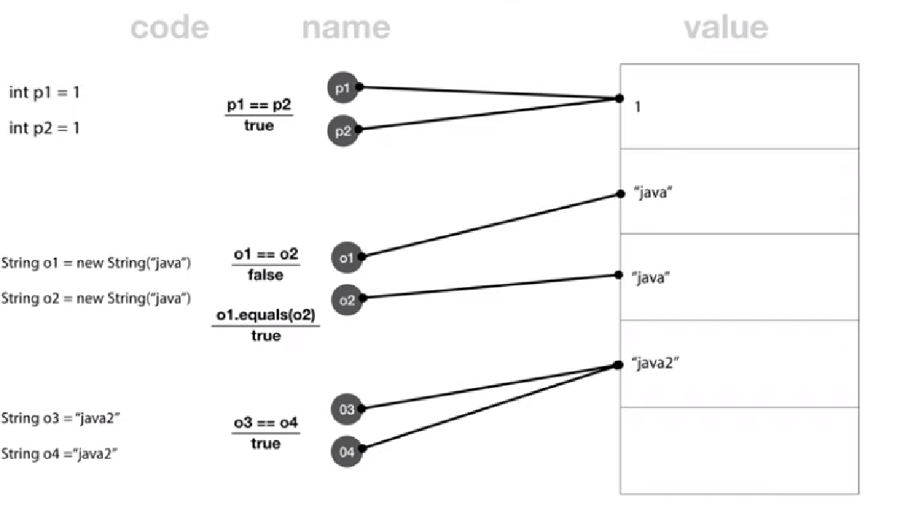
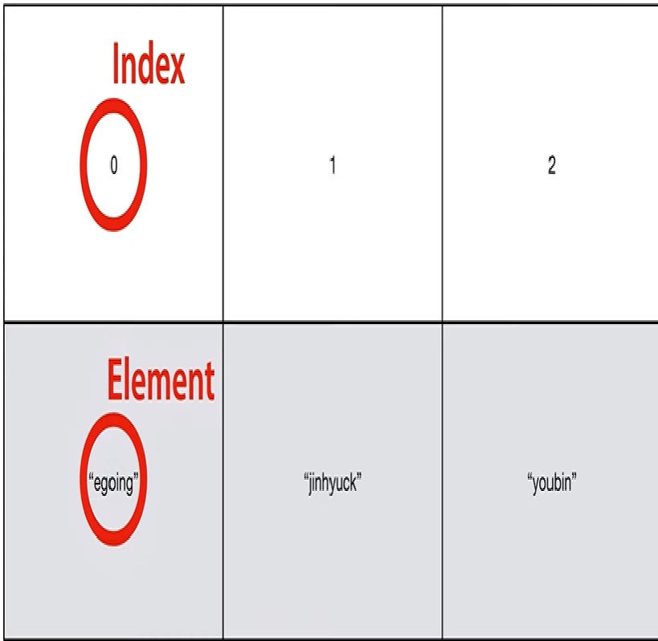

# JAVA 제어문

- 오리엔테이션
    - 1.  수업소개
        - 프로그래밍의 핵심적인 기능은 시간의 순서에 맞춰 일어나야 하는 일을 컴퓨터에게 명령하는 것.
        - 조건문 : 조건에 따라 실행되어야 할 순서를 제어한다.
        - 반복문 : 많은 데이터를 반복적으로 처리할 때 사용한다.
    
- 자료형과 연산자
    - 2.  Boolean Datatype
        - Boolean은 true와 false로 나뉘어지는, 두 가지 값을 출력하는 자료형
        - true와 false처럼 이미 사용되고 있는 컴퓨터 언어, 혹은 앞으로 채택될 가능성이 높은 언어를 예약어(reserved word)라고 한다.
        - contains : 문자열에 입력  값으로 전달할 값이 들어 있다면 true, 없다면 false
    - 3.  비교연산자
        - 좌항과 우항의 차이를 비교하는 연산자
        - >, ==, <, <=, >= 등이 있다.
    - 5.  ==vs equals
        - Java의 데이터 타입은 primitive와 non primitive로 나뉘기도 한다.
        - primitive 는 boolean, int, double, short, long, float, char의 7개.
        - == 은 같은 곳에 있는가, equals는 내용이 같은 곳에 있는가를 비교하는 method
        - 원시 데이터 타입은 ==를 사용. 원시 데이터 타입이 아니면 equals를 사용한다.
        - 다만, String은 예외로 원시 데이터로 취급한다. (==를 사용한다.)
        - 자세한 논리는 객체지향에 관련되어 있다. 지금은 그저 외워두자.
        
        
        
    - 6.  논리 연산자
        - And 연산자 (&&) 와 OR 연산자 (||),  Not 연산자(!) 학습
        
        ```java
        System.out.println("Hi.");
        		boolean isRightPass = (inputPass.equals(pass) || inputPass.equals(pass2));
        		if(inputId.equals(id) && (isRightPass)) {	
        		System.out.println("Master!");
        		} else {
        			System.out.println("Who are you?");
        		}
        	}
        ```
        
        - 위의 경우, 비밀번호인 argument[1] 값이 1111 이거나, 2222이면 Master!가 출력된다.
        - 변수를 활용하여 Boolean값을 줄 수도 있다.
- 조건문
    - 4-1 조건문 형식
        - 조건문의 기본 형식은 
        if(Boolean) {
        }
        else {
        }
        와 같다.
        - 조건문 안에, 또 다른 조건문을 넣을 수도 있다.
    - 4-2 조건문 응용
        - if문을 활용하여 argument 값에 따라 결과가 달라지는 코드를 만들어보자.
        
        ```java
        package control_statement;
        
        public class AuthApp {
        
        	public static void main(String[] args) {
        		
        		System.out.println(args[0]);
        		
        		String id = "egoing";
        		String inputId = args[0];
        		
        		System.out.println("Hi.");
        
        		if(inputId.equals(id)) {	
        		System.out.println("Master!");
        		} else {
        			System.out.println("Who are you?");
        		}
        	}
        
        }
        ```
        
        - 위 코드의 경우 Argument 값이 egoing일 때 Master!를,  Argument 값이 egoing이 아닐 때 Who are you? 를 출력한다.
    - 4-3 조건문 응용
        - && 연산자를 통해 논리 연산자의 조건이 2개일 때 if문 사용 방법 연습
        - argument 값이 egoing과1111이 아니면 (둘 다 true) Who are you. 둘 다 true면 Master! 출력
        
        ```java
        package control_statement;
        
        public class AuthApp2 {
        
        	public static void main(String[] args) {
        		
        		System.out.println(args[0]);
        		
        		String id = "egoing";
        		String inputId = args[0];
        		
        		String pass = "1111";
        		String inputPass = args[1];
        		
        		System.out.println("Hi.");
        
        		if(inputId.equals(id) && inputPass.equals(pass)) {	
        		System.out.println("Master!");
        		} else {
        			System.out.println("Who are you?");
        		}
        	}
        
        }
        ```
        
- 배열과 반복문
    - 7-1 반복문
        - 특정 코드를 반복하게 하기 위해 사용한다.
        - Java의 반복문은 기본적으로 아래와 같다.
        
        ```java
        package Task;
        
        public class LoopApp {
        	public static void main(String[] args) {
        		
        		System.out.println(1);
        		System.out.println("===while===");
        		int i = 0;
        		while(i < 3) {
        			System.out.println(2);
        			System.out.println(3);
        			i++;
        		}
        		
        		System.out.println("===for===");
        		for(int j=0; j < 3; j++) {
        			System.out.println(2);
        			System.out.println(3);
        		}
        		
        		System.out.println(4);
        	}
        }
        ```
        
        - int j=0; 은 한 번만 시행된다.
        이후 j++이 먼저 시행 된 뒤, 
        j<3;의 boolean값을 체크한다.
        이후 boolean값이 false될 때 까지 반복
        - while 문은 자유도가 높다. 하지만 반복과 관련된 3가지 값이 거리가 멀어 오류가 생길 가능성이 있다.
        - 하지만 for문은 3가지 값이 붙어 있어 사용하기 편리하다.
    - 7-2 배열
        
        ```java
        package Task;
        
        public class ArrayAoo {
        
        	public static void main(String[] args) {
        		
        		String[] users = new String[3];
        		users[0] ="egoing";
        		users[1] ="jinhuck";
        		users[2] ="youbin";
        		
        		System.out.println(users [2]);
        		System.out.println(users.length);
        
        		int[] scores = {10, 100, 100}; 
        		System.out.println(scores[1]);
        		System.out.println(scores.length);
        		
        	}
        
        }
        ```
        
        - 배열의 선언은 기본적으로 아래와 같은 형식을 따른다.
        자료형[] 배열의이름 = new 자료형[배열의 총 갯수]
        혹은, 
        자료형[] 배열의이름 = [배열의 목록]
        - 값이 3개가 있다 보다는 3칸짜리 배열이다라고 이해하는게 더 정확하다.
        - 배열의 각 값들을 Element, 배열의 칸(몇 번째인지)를 index라고 한다.
        
        
        
    - 7-3 반복문 + 배열
        - 반복문과 배열을 같이 활용 했을 때의 시너지 효과를 알아보자.
        
        ```java
        package Task;
        
        public class LoopArray {
        
        	public static void main(String[] args) {		
        		String[] users = new String[3];
        		users[0] ="egoing";
        		users[1] ="jinhuck";
        		users[2] ="youbin";
        
        		for(int i=0; i<users.length; i++) {
        			System.out.println("<li>"+users[i]+"</li>");
        		}
        	}
        
        }
        ```
        
        - for문을 활용, 변수값에 배열을 넣어도 적용이 가능하다.
        - 이를 통해서 유지보수성과 편이성을 급격히 늘려줄 수 있다.
- 응용
    - 8-1 종합응용 1
        - 지금까지 배운 내용들을 종합하여 예제 만들어보기.
        
        ```java
        package Task;
        
        public class AuthApp3 {
        
        	public static void main(String[] args) {
        
        		String[] users = {"egoing", "jinhuck", "youbin"};
        		String inputId = args[0];
        		
        		boolean isLogined = false;
        		for(int i=0; i<users.length; i++) {
        			String currentId = users[i];
        			if(currentId.equals(inputId)) {
        				isLogined = true;
        				break;
        		}
        
        	}
        		System.out.println("Hi,");
        		if(isLogined) {
        			System.out.println("Master!!");
        		} else {
        			System.out.println("Who are you?");
        		}
        	}
        }
        ```
        
        - 배열을 지정한 뒤 
        String[] users ="egoing", "jinhuck", "youbin"};
        - for문을 사용하여 반복문 시행. 조건문을 활용하여 배열값에 맞는 변수인지 확인.
        - 이후 조건문을 통하여 변수값(isLogined)에 맞춰 다른 값 출력.
    - 8-2 종합응용2
        - 이전에 만든 코드를 이중배열을 통해 더 복잡한 코드로 만들어보자.
        - String[][] users = : users의 element가 배열이고, 그 각각의 배열의 element 값이 String이 된다.
        
        ```java
        package Task;
        
        public class AuthApp1 {
        
        	public static void main(String[] args) {
        		
        		String[][] users = {
        				{"egoing", "1111"},
        				{"jinhuck", "2222"},
        				{"youbin", "3333"}
        		};
        		String inputId = args[0];
        		String inputPass = args[1];
        		
        		boolean isLogined = false;
        		for(int i=0; i<users.length; i++) {
        			String[] current = users[i];
        			if(
        				current[0].equals(inputId) &&
        				current[1].equals(inputPass)
        				) {
        				isLogined = true;
        				break;
        		}
        
        	}
        		System.out.println("Hi,");
        		if(isLogined) {
        			System.out.println("Master!!");
        		} else {
        			System.out.println("Who are you?");
        		}
        	}
        }
        ```