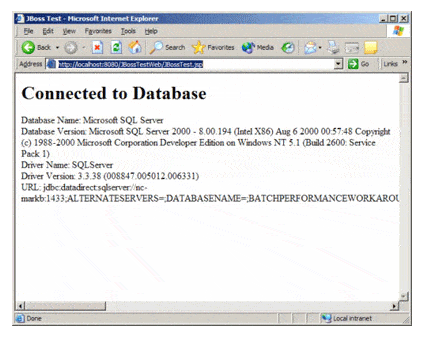

# JBoss

- Introduction
    - Step
        1. Install DataDirect Connect for JDBC
        2. Create a data source
        3. Generate the JavaServer Page(JSP)
        4. Deploy the JBoss web application to the JBoss server
        5. Run the JBoss web application
        6. Map a data source to a local Java Naming and Direectory Interface (JNDI) name in a Session Enterpprise JAva Bean (EJB)
        7. Specify the data source for an Entity EJB
    - 1. Install DataDirect Connect for JDBC
        - copy the DataDirect Connect for JDBC jar files
        - install_dir (jar files) is DataDirect Connect for JDBC installation directory
        - JBoss_home is JBoss installation directory
        - server_config is server configuration directory
    - 2. Create a data source
        - create a data source file named datadirect-ds.xml file in the JBoss-home/server/server_config/deploy directory
        - The file name must end with the character  ds.xml 
        → for recognize it as a data source file to JBoss server
        → but file name cna be prefixed with any set of characters
        - The value of the <jndi-name> tag specifies the JNDI name, which is like 
        → java:ds/TestDs
        - JBoss maps the driver to the global space. An application can look up the data source using the string
        - Modify the value of the <driver-class> tag to specify the appropriate class name for the driver to use.
        - For example, the following code specifies the clas sname of the DataDirect Connect for JDBC SQL Server dirver
            
            ```xml
            <driver-calss>
            com.ddtek.jdbc.sqlserver.SQLServerDriver
            </driver-class>
            ```
            
        - Modify the value of the <connection-url> tag to specify the correct connection information for the driver and database server to use. Example code specifies connection information used by the DataDirect Connect for JDBC SQL Server dirver to connect to the server named myserver on port 1433
            
            ```xml
            <connection-url>
            jdbc:datadirect:sqlserver://myserver:1433
            </connection-url>
            ```
            
        - Modify the vallue of the <user-name> and <password> tags to specify a valid user name and password for the database server. Example code specifies the user name test and the password secret:
            
            ```xml
            <user-name>test</user-name>
            <password>secret</password>
            ```
            
        - The <connection-property> tag specifies DataDirect Connect for JDBC driver-specific connection properties. Example code sets the value of the DataDirect Connect for JDBC SQL Server dirver connection property SendStringParametersAsUnicode to false.
            
            ```xml
            <connection-property name="sendStringParametersAsUnicode">
            false
            </connection-property>
            ```
            
        - The tags following the <!—pooling parameters—> comment in the following example are properties that control JBoss connection poolinig. Refer to the JBoss documentation for details on setting these properties.
            
            ```xml
            <?xml version="1.0" encoding="UTF-8"?>
            <!-- =========================================================== -->
            <!--  -->
            <!-- DataDirect Data Sources -->
            <!--  -->
            <!-- =========================================================== -->
            <!--
            See the generic_ds.xml file in the doc/examples/jca folder
            for examples of properties and other tags you can specify
            in data sources
            -->
            <datasources>
            <!-- JBossTest Data Source -->
            <local-tx-datasource>
            <jndi-name>ds/TestDS</jndi-name>
            <connection-url>
            jdbc:datadirect:sqlserver://myserver:1433
            </connection-url>
            <driver-class>
            com.ddtek.jdbc.sqlserver.SQLServerDriver
            </driver-class>
            <user-name>test</user-name>
            <password>secret</password>
            <!-- Driver Specific Options -->
            <connection-property name="sendStringParametersAsUnicode">
            false
            </connection-property>
            <!--pooling parameters-->
            <min-pool-size>5</min-pool-size>
            <max-pool-size>100</max-pool-size>
            <blocking-timeout-millis>5000</blocking-timeout-millis>
            <idle-timeout-minutes>15</idle-timeout-minutes>
            </local-tx-datasource>
            </datasources>
            ```
            
    - 3. Generate the JavaServer Page(JSP)
        - Create a JSP page that uses the data source. Follow sample code is look up the data source and obtain a connection to the database from the data source
            
            ```xml
            InitialContext ctxt = new InitialContext();
            DataSource ds = (DataSource) ctxt.lookup("java:ds/TestDS");
            con = ds.getConnection();
            ```
            
    - 4. Deploy the JBoss web application to the JBoss server
        - Copy the JBossTestWeb.war file, to the directory JBoss_home/server/server_config/deploy
    - 5. Run the JBoss web application
        - Start the JBoss application server by running run.bat or run.sh, located in the JBoss_home/bin directory. To start a configuration other than the default configuration, use the -c option when executing the script. example to run the all configuration, use the following command:
            
            ```xml
            run -c all
            ```
            
        - Open a web browser and enter the following URL to display the JBossTest web page:
        → [http://localhost](http://localhost/)
        :8080/JBossTestWeb/JBossTest.jsp
        - The contents of the page display the version information of the driver and the database server to wgich it connects, if the DataDirect Connect for JDBC driver has been installed and configured correctly.
            
            
            
    - 6. Map a data source to a local Java Naming and Direectory Interface (JNDI) name in a Session Enterpprise JAva Bean (EJB)
        - Typically an EJB does not use the global JNDI name to look up the data source. Instead, it uses a logical JNDI name that is mapped to the global JNDI name of the data source.
        - To map a logical JNDI name to the global JNDI data source name in a Session EJB, declare a resource reference in the JBoss-specific deployment descriptor file jboss.xml.
        - A resource reference is defined by adding the tag <resource-ref> as a child of the <session> tag as shown in the following example.
            
            ```xml
            <session>
            <ejb-name>SupportedDatabases</ejb-name>
            <jndi-name>SupportedDatabasesBean</jndi-name>
            <local-jndi-name>SupportedDatabasesLocal</local-jndi-name>
            <resource-ref>
            <res-ref-name>jdbc/TestDS</res-ref-name>
            <jndi-name>java:/ds/TestDS</jndi-name>
            </resource-ref>
            </session>
            ```
            
        - The vlaue of the <res-ref-name> tag is the logical JNDI name an EJB uses to look up the data source. The value of the <jndi-name> tag is the global name of the data source to which the logical name is mapped.
    - 7. Specify the data source for an Entity EJB
        - To specify the data source to be used with an Entity EJB, specify the global JNDI name of the data source in the JBoss-specific Container Manager Persistence(CMP) deployment descriptor, jbosscmp-jdbc.xml.
        - The value of the <datasource> tag specifies the global JNDI name of the data source to use with ENtity EJBs.
        - The <datasource> tag can be specified as a child of the <defaults> tag as shown in the following example, or it cna be specified as a child of a particular <entity> tag
            
            ```xml
            <defaults>
            <datasource>java:/ds/TestDS</datasource>
            <datasource-mapping>MS SQLSERVER</datasource-mapping>
            </defaults>
            ```
            
    - Reference
        
        [JBoss Application Server Configuration Tutorial Example](https://www.progress.com/tutorials/jdbc/jboss)