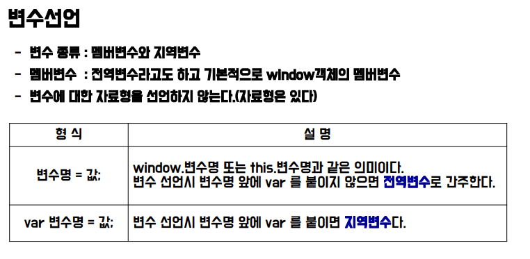

# Javascript

# 1. 개요

- 정의와 배경
    - 스크립트 언어란 기본 프로그램의 동작을 사용자의 요구에 맞게 수행되도록 해주는 용도로 사용된다.
    - 매우 빠르게 배우고, 짧은 소스코드 파일로 상호작용 할 수 있도록 고안되었다.
    - 자바스크립트는 웹 브라우저에서도 많이 사용하는 인터프리터 방식의 객체지향 프로그래밍 언어이다. ECMA 스크립트 표준을 따르는 대표적인 웹 기술.
    - 짧은 소스코드 파일이나 REPL(Read Eval(Evaluate) Print Loop)로 상호작용한다.
    → REPL: 하나의 입력을 받아서(Read Single Input), 처리하고(Evaluate), 결과를 반환하는(Print Result) 환경으로 구현된 프로그램.
    - Node.js를 통해 서바사이드 개발에 활용되기도 한다.
    - ECMA : Ecma International이 ECMA-262 기술 규격에 따라 정의하고 있는 표준화된 스크립트의 규격 및 표준
    1. ECMA3 : 흔히 말하는 자바스크립트
    2. ECMA5 : JSON 지원, Object에 대한 getter/setter 지원. DOM NODE, 내장객체 BOM, 동기/비동기 통신, 배열, 객체 데이터, 프로토타입과 상속, NEW 인스턴스, 변수, 함수, 연산자, 제어문, 반복문
    3. ECMA6 : 함수지향, 객체지향 프로그래밍, HTTP, JSON, AJAX, axios, fetch
- 기본문법
    - 변수
        
        
        
        
        
    - 자료형
        - 문자열(String)
            
            
            
        - 숫자 처리 메소드(Math)
            
            
            
        - 기타 자료형 (Boolean, Object, undefined, function)
            
            
            
        - typeof()
            - 값의 자료형을 확인하기 위한 연산자.
            - JS는 변수 선언시 자료형을 지정하지 않아 변수명으로 자료형을 확인하기 어렵다. 따라서 자료형을 확인하기 위해 자주 사용된다.
                
                
                
    - 형변환
        
        
        
    - 연산자
        
        
        
        
        
    - 제어문
        
        
        
    
- 데이터 입출력
    - innerHTML
        
        
        
    - consolee.log
        
        
        
    - confirm
        
        
        
    - prompt()
        
        
        
- 접근
    - JS의 script 영역에서 HTML에 접근할 수 있다.
    - document.getElementsBy(Id, TagName, Name)등을 이용한다.
    - 아이디로 접근하기
        - id 이름을 선택자로 삼아 해당 아이디를 호출할 수 있다.
            
            
            
    - 태그명으로 접근
        - HTML의 각종 태그들을 선택자로 삼아 접근할 수 있다.
            
            
            
    - name 속성으로 접근
        - getElementsByName을 이용하여 특정 name속성을 변수에 담은 뒤, script영역에서 해당 변수를 (다수의 값일 경우) for문을 활용하여 변수화 한다. 이후 getElementById를 통해 innerHTML로 화면에 출력한다.
        
        
        
        
        
        
        
    - text박스의 value값 읽어오기
        - <input>태그를 이용, 행위의 결과값을 특정 value값으로 지정한다. 이후 해당 value값을 input.value를 통해 innerHTML로 출력 가능하다.
            
            
            

# 2. 변수와 자료형

- 변수
    - 함수 내부에서 var 변수명; 으로 선언하면 지역변수가 된다.
    - 함수 내부에서 변수명; 으로 선언하거나 함수 밖에서 변수명; 혹은 var 변수명; 으로 선언하면 전역변수가 된다.
    - 전역변수와 지역변수가 동일한 이름인 경우 함수 내부에서 변수명을 호출하면 지역변수가 우선권을 가진다.
    - 그렇기에 전역변수 사용 시 windw.변수명 혹은 this.변수명으로 표현하여 지역변수를 구분해야 한다.
    - 전역변수는 해당 window 내부에서 어디든 사용할 수 있으며, 지역변수는 해당 함수 내에서만 사용 가능하다.
- 변수의 선언
    
    
    
- 자료형
    - 자바스크립트에서는 자료형별로 변수타입이 지정되지 않는다. 리터럴(대입되는 값)에 의해 자료형이 결정된다.
    - 리터럴값은 자바의 String, int와 같은 기본자료형 뿐만 아니라, 배열, 함수 등도 포함된다.
        
        
        

# 3. 메소드와 연산자

- String
    - “”, ‘’로 묶여있는 리터럴.
    - 자바스크립트의 내장객체이며 String 객체의 기본적인 메소드가 있다.
        
        
        
- Math
    - 숫자처리 메소드. Java의 숫자처리 메소드와 큰 차이는 없다.
        
        
        
- 연산자
    - typeof() 연산자
        - 값의 자료형을 확인하는 연산자.
        - JS는 선언 시 자료형을 지정하지 않기 때문에, 변수명만으로 데이터의 자료형을 확인하기 힘들 때 자주 사용한다.
            
            
            
    - ===연산자와 !== 연산자
        - 자바에는 없는 연산자로, 값과 자료형이 둘 다 일치한지의 여부를 확인할 때 사용한다.
            
            
            
    - 연산자를 활용한 짧은 조건문
        
        
        

# 4. 배열

- 배열의 정의
    - 다양한 타입의 데이터를 보관하는 변수의 모음
    - 를 통해 생성과 초기화를 동시에 처리가능
    - 자바스크립트에서는 자료형 지정이 없기 때문에 모든 자료형을 보관하는 변수의 모음을 배열로 처리한다.
    - → 배열의 선언과 innderHTML을 이용한 출력
        
        
        
- 배열의 선언과 초기화, 값 대입
    - **배열의 선언**
        - new 연산자와 Array 객체를 통한 배열 선언
        → 배열의 크기를 정하지 않고 선언할 수 있으며, 크기를 정하고 선언할 수도 있다.
        —>(단, 배열의 크기를 정했어도 push()를 통해 요소의 추가가 가능하다.
            
            
            
    - 배열의 초기화
        - var 변수명 = [값1, 값2, 값3, 함수...]; 의 방식으로 생성과 초기화가 가능하다.
        - 두가지 방법은 본질적으로 동일하다. 단, new 연산자를 이용할 경우 ()안에 숫자를 넣을 경우, 해당 숫자를 값으로 가지는 배열이 아닌, 해당 숫자만큼의 길이를 가진 배열이 생성된다는 점에 주의하자.
        
        
        
        
        
    - 배열에 값 대입
        - 값 입력시에는 index 번호를 활용한다.
            
            
            
- Array 객체 메소드
    - 객체 메소드 상세 사용 예시
        - join()
            - toString()과 같이, join()역시 별도의 매개변수가 없다면 ‘,’을 기준으로 각 배열의 합이 합쳐지지만, 매개변수를 넣을 경우 해당 구분자를 기준으로 문자를 합칠 수 있다.
            
            
            
        - sort()
            
            
            
        - slice() & splice()
            - slice는 원본 배열에 영향을 미치지 않지만, splice는 원본 배열에 영향을 미친다.
                
                
                
    
    
    
    
    

# 5. 함수

- 함수의 정의와 선언 및 호출
    - 소스코드의 집합으로 메소드, 모듈, 기능, 프로시져 등을 말한다.
    - 자바스크립트에서는 function 자료형이다.
    - 인자/매개변수, 리턴 값을 가질 수 있다.
    
    
    
    
    
    
    
    - 함수 호출 :
    함수는 반드시 선언(정의)가 되어야 실행할 수 있다.
    원하는 기능에 대한 함수를 호출하는 것이 함수의 실행
    return값이 있다면 리턴 값을 받을 변수가 있어야만 한다.
        
        
        
- 매개변수와 가변인자
    - 매개변수(전달인자)
        - 호출하는 코드와 호출되는 함수를 연결해주는 변수는 매개변수라고 한다.
        - JS에서는 지정된 매개변수보다 많은 수를 선언하고 호출할 수 있다.
        → 단, 초과되는 매개변수는 무시된다.
        - 지정된 매개변수보다 적게 선언하고 호출할 수도 있다.
        → 단, 선언이 안된 매개변수는 undefine으로 자동설정된다.
    - 매개변수 함수
        - 함수도 하나의 자료형으로 삼아 매개변수에 전달할 수 있다.
            
            
            
            
            
        - 매개변수로 함수 전달
            
            
            
        - 선언적 함수를 매개변수로 전달
            
            
            
        - 익명 함수를 리턴하는 함수
            
            
            
    - 가변인자 함수
        - 매개변수의 개수가 변하는 함수다.
        - 모든 함수의 내부에 argument 배열이 자동으로 생성되어 매개변수를 저장하게 된다.
        → 매개변수가 지정되지 않은 값이 넘어오면 arguments 배열에 순서대로 저장된다.
        - 매개변수의 개수에 따라 함수처리를 다르게 하려면 조건문을 사용할 수 있다.
            
            
            
- 함수 리턴(클로저)
    - return[되돌려줄 값]
        - return은 함수를 호출한 위치로 돌아가라는 명령어
        - return값(되돌려줄 값)을 지정하지 않으면 undefined 자료형으로 변환된다.
            
            
            
    - 클로저의 정의
        - 함수 내부에서 사용했던 지역변수를 외부에서 사용하기 위해 사용한다.
        - 지역 변수는 함수가 실행될 때 생성되고 함수가 종료될 때 사라진다.
        - 하지만 함수를 리턴하는 함수(클로저)를 이용하여 외부에서 지역변수를 사용할 수 있다.
    - 코드
        
        
        
- 내장 함수(인코딩, 디코딩)
    - 웹 상에서 통신 시 유니코드 문자는 오작동을 일으킬 수 있다. 이 때 필요한 것이 인코딩.
        
        
        
        
        
        
        

# 6. 객체

- 객체의 선언과 호출
    - 객체는 키값을 사용하여 속성(멤버변수)를 식별한다.
    - 중괄호를 사용하여 객체를 생성한다.
    -  또는 .(점)으로 요소의 값에 접근한다.
    - 객체의 속성은 모든 자료형이 올 수 있다. 그 중 함수 자료형인 요소만을 메소드라고 부른다.
        
        
        
    - 객체 내에서 자신의 속성을 호출 할 때는 반드시 this 키워드가 필요하다.
    - 객체의 모든 속성을 출력하려면 for in문을 사용해야 한다.
    → 단순 for문이나 while문으로는 출력할 수 없다.
        
        
        
    - 선택자로 사용할 수 없는 문자(띄어쓰기, 특수문자)를 속성으로 사용할 경우 ‘’로 묶어서 선언하고, 접근시에는 []만 사용 가능하다.
        
        
        
        
        
- In/With 키워드
    - in : 객체 내부에 해당 속성이 있는지 확인하는 키워드
    - with: 코드를 줄여주는 키워드. 호출 시 객체명을 생략할 수 있다.
        
        
        
        
        
        
        
    
- 객체 속성의 추가와 삭제
    - 속성 및 메소드를 동적으로 추가 및 삭제할 수 있다.
        
        
        
        
        
- 객체배열 활용
    - 생성된 객체를 배열에 넣어 활용할 수도 있다.
        
        
        
- 함수활용 객체 생성
    - 함수의 매개변수에 필요한 속성값을 다 받아서 객체를 생성한 뒤 리턴할 수 있다.
        
        
        
        
        
- 생성자 함수
    
    
    
    - this키워드를 사용하여 속성을 생성하는 함수
    - new 키워드를 사용하여 객체를 생성한다.
        
        
        
    - new 연산자를 쓰지 않고 호출한 함수의 this는 window 객체를 의미한다. 또한, 반환형이 없어 객체를 생성할 수 없다.
    - 생성자명의 첫 글자는 대문자로 시작한다.
    - instanceof로 어떤 생성자로 생성됐는지 확인할 수 있다.
        
        
        
- 함수 활용 객체 생성 VS 생성자
    - 함수를 활용한 객체 생성과 생성자를 통해 생성한 객체는 중복 메소드를 저장하는 방식의 차이에 따라 나뉜다. 
    → 함수활용 : 중복되는 메소드를 객체별로 만들어서 저장한다.
    → 생성자 : prototyp이라는 내부 객체를 이용해서 저장 가능하다.
        (하나의 메소드를 이용해서 전체 객체가 다 활용한다. 중복으로 저장되지 않는다.)
        
        
        
- 캡슐화
    - 생성자 함수에서 속성 선언시 this키워드를 사용하지 않고 지역변수로 선언한다.
    - 클로저를 활용해 캡슐화의 개념을 적용할 수 있다.
        
        
        
        
        
    - this키워드를 사용할 시 setter/getter 메소드로 작성된다.
    → 클로저를 활용할 수 있다.
        
        
        
- 상속
    - 다른 객체를 상속받아서 사용할 수 있다.
    - 속성으로 객체를 추가하는 방법과 call메소드를 이용하는 방법이 있다.
        
        
        
        
        

# 7. 내장 객체

- Object
    - 모든 기본내장 객체는 Object 객체를 상속한다.
    - 모든 객체는 기본적으로  Object의 메소드를 다 가지고 있다.
        
        
        
        
        
- Number
    - 정수와 실수를 저장하는 객체.
    
    
    
    
    
- String 객체의 HTML 관련 메소드
    
    
    
- Date 객체
    - 날짜를 관리하는 객체
        
        
        
        
        

# 6. BOM

- BOM(Browser Object Model) : location 객체, navigator객체, history객체, screen 객체

- window객체
    - window.onload
        - 윈도우 객체가 로드가 완료되면 자동으로 onload에 설정되어 있는 함수를 실행시키는 속성
        - 윈도우 객체 로드 완료: 모든 태그가 화면에 나타날 때
            
            
            
            
            
    - 자바스크립트의 최상위 객체. 생성되는 모든 객체가 window객체 하위에 존재한다.
    - 브라우저 창에 대해 설정하는 객체
        
        
        
        
        
    
- screen 객체
    - client 운영체제 화면에 대한 속성값을 가지는 객체
        
        
        
        
        
- location 객체
    - 브라우저의 주소표시줄(UPL)과 관련된 객체
    - 프로토콜 종류, 호스트 이름, 문서위치 등의 정보를 가진다.
        
        
        
        
        
        
        
- navigator 객체
    - 웹 페이지를 실행하고 있는 브라우저에 대한 정보를 가지고 있는 객체
        
        
        

# 7. DOM

- DOM(Document Object Model) : document 객체
- 문서객체
    - HTML에 있는 태그를 객체화하여 자바스크립트에서 다룰 수 있게 한 것.
    - 모든 노드객체에 접근할 수 있는 요소와 메소드를 제공한다.
    
    
    
    
    
- 노드
    - HTML에 있는 태그를 구조화(트리구조)하였을 때 각각의 태그가 노드
    - → 텍스트 노드가 있는 노드 생성
        
        
        
    - → 텍스트 토드가 없는 노드 생성
        
        
        
- 요소노드(elements node)와 텍스트노드(textnode)
    - 요소노드 : 태그 그 자체를 의미한다.
    - 텍스트노드 : 태그에 기록되어 있는 문자
    → 텍스트노드에 가지는 태그(h?,p 등) 와 가지지 않는 태그 (img등)가 있다.
        
        
        
        
        

# 8. 이벤트

- 정의와 활용
    - 이벤트 활용이란? : 이벤트 속성과 이벤트핸들러(함수)를 연동하여 이벤트 발생 시 특정 기능을 하도록 하는 것.
    - 이벤트 설정 방법 : 
    1. 고전 이벤트 모델
    2. 인라인 이벤트 모델
    3. 표준 이벤트 모델
    4. 마이크로소프트 인터넷 익스플로러 이벤트 모델
- 고전이벤트 모델
    - 요소객체가 가지고 있는 이벤트 속성에 이벤트 핸들러를 연결하는 방법
    - 이벤트를 제거할 때는 속성값에 null을 넣어주면 된다.
    - 이벤트발생객체는 핸들러 내부에서 this로 표현 / 스타일변경이 가능하다.
    - 매개변수로 이벤트 정보전달 (e, window.event) → 이벤트객체 전달
        
        
        
        
        
- 인라인 이벤트 모델
    - 요소 내부에 이벤트를 작성하는 방법
    - 인라인방식은 <script>태그에 함수를 호출하는 방식이 선호된다.
        
        
        
        
        
- 표준 이벤트 모델
    - w3에서 공식적으로 지정한 이벤트 모델
    - 한번에 여러가지 이벤트핸들러 설정이 가능하다.
    - this키워드가 이벤트 발생 객체를 의미한다.
        
        
        
- 익스플로러 이벤트 모델
    - 익스플로러 브라우저 적용 모델
    - 한번에 여러가지 이벤트핸들러 설정이 가능하다.
    - this키워드가 이벤트 발생객체(srcElement)가 아니고 window 객체를 의미한다.
        
        
        
- 기본 이벤트 제거, 전달, 차단 / 유효성 검사
    - 기본 이벤트: 태그 중 이벤트핸들러를 기본적으로 가지고 있는 이벤트.
    - 유효성 검사 : 사용자가 입력한 데이터가 양식에 맞는지 검사하는 것.
    - 기본이벤트 제거는 onsubmit이벤트 속성에 이벤트 핸들러를 연결할 때 false를 return한다.
    - 유효성 검사 : 이벤트 핸들러에 데이터 비교 후 맞지 않으면 false를 리턴한다.
        
        