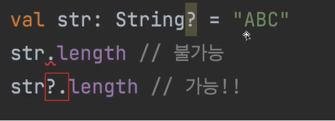

# 자바 개발자를 위한 Kotlin 입문

# Section 1. **Kotlin에서** 변수와 타입, 연산자를 다루는 방법

- Kotlin에서 변수를 다루는 방법
    - Kotlin은 var와 val을 통해 const 여부를 결정한다.
    - var는 가변 변수로서 재할당이 가능한 변수이며, val은 상수로서 재할당이 불가능한 변수이다.
    - 코틀린은 타입 추론을 통해 변수의 자료형을 지정해주지 않아도 사용 가능하지만, 명시적으로 지정해 줄 수도 있다.
        - 타입을 명시적으로 작성하지 않아도 타입이 추론된다.
    - 초기값을 지정하지 않을 경우 사용 시 컴파일 에러가 발생하며, 값 할당 이후 사용이 가능하다. val 변수는 선언 시 값을 할당해주지 않았을 경우 최초 한 번에 한해 값 할당이 가능하다.
    - val 컬렉션에는 element를 추가할 수 있다.  (Collection 자체는 변경 불가능하지만, 선언된 Collection에 값을 추가(add)는 가능)
    - 모든 변수는 우선 val로 만들고, 꼭 필요한 경우에만 var로 변경한다.
    - Kotlin에서는 숫자, 문자, boolean과 같은 몇몇 타입은 내부적으로 특별한 표현을 가진다.
        - 이 타입들은 실행시에 Primitive Value로 표현되지만, 코드에서는 평범한 클래스처럼 보인다.
        - ⇒ reference Type으로 보이더라도 컴파일 시 필요에 따라 Primitive Type으로 변경이 이루어진다.
        - ⇒ 즉, Kotlin은 프로그래머가 Boxing, UnBoxing을 고려하지 않아도 된다.
    - 자바에서의 Reference Type이 Null 대입 가능여부의 의미도 포함하고 있었던 것과 달리, Kotlin은 Null 대입 가능 여부에 따라 다른 타입으로 간주된다.
        - Null 대입이 가능할 경우, 타입 지정 후 ? 연산자를 추가해야한다.
            
            ```kotlin
            var number7: Long? = 1_0000L
            
            number7 = null
            ```
            
    - 자바에서 객체의 인스턴스화를 할 때 new 연산자를 사용했던 것과 달리, Kotlin은 new연산자를 붙이면 안 된다.
- Kotlin에서 null을 다루는 방법
    - Kotlin에서는 null이 가능한 타입을 완전히 다르게 취급한다.
    - null이 가능한 타입만을 위한 기능
        - Safe Call
            
            
            
            - null이 아니면 실행하고, null이면 실행하지 않는다. (그대로 null)
        - Elvis 연산자
            
            
            
            - 앞의 연산 결과가 null이면 뒤의 값을 사용
    - nullable type이지만, null이 될 수 없는 경우 !! 연산자를 사용하여 null이 아님을 단언할 수 있다. (널 아님 단언)
        - 단, null이 들어올 경우 런타임 레벨에서 NPE가 발생하기에 신중히 사용해야 한다.
    - Java와 Kotlin을 허용할 떄, 자바 클래스 변수에 @Nullable, @NotNull Annotation을 활용하여 플랫폼 타입을 컨트롤할 수 있다.
        - 플랫폼 타입 : 코틀린이 null 관련 정보를 알 수 없는 타입.
        - 두 Annotation이 없다면 컴파일 에러가 발생하지 않지만, Runtime 시 Exception이 발생
            - Java 코드를 읽으며 널 가능성을 확인하거나, Kotlin으로 Wrapping하는 편이 편리하다.
- Kotlin에서 Type을 다루는 방법
    - 기본 타입(Primitive)
        - Byte, Short, Int, Long, Float, Double, 부호 없는 정수들
        - 코틀린에서는 선언된 기본값을 보고 타입을 추론한다.
    - 타입 캐스팅
        - Kotlin에서는 기본 타입간의 변환은 명시적으로 이루어져야 한다.
            
            
            
        - Kotling은 to변환타입()을 사용해야 한다.
            
            
            
        - 변수가 nullable이라면 엘비스 연산자, Safe Call을 활용하여 적절히 처리해줘야 한다.
        - Type 변수의 경우, is, as 연산자와 Any 타입을 이용하여 처리한다.
            
            
            
            - 단, as는 생략 가능하다. (스마트 캐스트)
                
                
                
        - is 앞에 ! 부정연산자를 붙여 부정 연산도 수행 가능하다.
            
            
            
            
            
    - Kotlin의 3가지 특이한 타입
        - Any
            - Java의 Object 역할 (모든 객체의 최상위 타입)
            - 모든 primitive Type의 최상위 타입도 Any
            - Any 자체로는 null을 포함할 수 없어 null을 포함하고 싶다면 Any?로 표현한다.
            - Any에 equals, hashCode, toString 존재
        - Unit
            - Java의 void와 동일한 역할
            - void와 달리 Unit은 그 자체로 타입 인자로 사용 가능하다.
            - 함수형 프로그래밍에서 Unit은 단 하나의 인스턴스만 갖는 타입을 의미. 즉 코틀린의 Unit은 실제 존재한 타입이라는 것을 표현한다.
        - Nothing
            - Nothing은 함수가 정상적으로 끝나지 않았다는 사실을 표현하는 역할
            - 무조건 예외를 반환하는 함수 / 무한 루프 함수 등
    - String Interpolation, String Indexing
        
        
        
        - { }는 생략 가능하다.
            
            
            
        - String trinmIndent()
            
            
            
        - Kotlin은 문자열의 특정 문자를 가져올 때 charAt()이 아닌, 배열의 인덱스를 가져오는 방식으로 구현한다.
            
            
            
    - 정리
        - 코틀린의 변수는 초기값을 보고 타입을 추론하며, 기본 타입들간의 변환은 명시적으로 이루어진다.
        - 코틀린에서는 is, !is, as, as?를 이용해 타입을 확인하고 캐스팅한다.
        - 코틀린의 Any는 Java의 Object와 같은 최상위 타입
        - 코틀린의 Unit은 Java의 void와 동일하다.
- Kotlin에서 연산자를 다루는 방법
    - 단항 연산자 / 산술 연산자
        
        
        
        - Java와 Kotlin 동일하다.
    - 비교 연산자와 동등성, 동일성
        
        
        
        - Java와 사용법은 동일하다.
        - 단, Java와 다르게 객체를 비교할 때 비교 연산자를 사용하면 자동으로 compareTo를 호출한다.
            - Java
                
                
                
            - Kotlin
                
                
                
        - 동등성(Equality) : 두 객체의 값이 같은가
        - 동일성(Identity) : 완전히 동일한 객체인가, 즉 주소가 같은가
        
        
        
    - 논리 연산자 / 코틀린에 있는 특이한 연산자
        
        
        
        - Java와 완전히 동일하며, Java와 같이 Lazy 연산을 수행한다.
        - in / !in
            - 컬렉션이나 범위에 포함되어 있다, 포함되어 있지 않다라는 의미
        - a..b
            - a 부터 b까지의 범위 객체를 생성한다.
        - a[i]
            - a에서 특정 Index i로 값을 가져온다.
        - a[i] = b
            - a의 특정 index i에 b를 넣는다.
    - 연산자 오버로딩
        - Kotlin에서는 객체마다 연산자를 직접 정의할 수 있다.
            - Java
                
                
                
            - Kotlin
                
                
                
    - 정리
        - 단항연산자, 산술연산자, 산술대입연산자는 Java와 동일하다
        - 비교 연산자 사용법도 Java와 동일하다. 단, 객체끼리도 자동 호출되는 compareTo를 이용해 비교 연산 가능
        - in, !in / a..b / a[i] / a[i] = b 와 같이 코틀린에서 새로 생긴 연산자도 있다.
        - 객체끼리의 연산자를 직접 정의할 수 있다.

# Section 2. Kotlin에서 코드를 제어하는 방법

- Kotlin에서 제어문을 다루는 방법
    - if문
        
        
        
        - 함수에서 void(Unit)은 생략할 수 있다.
        - 함수는 fun으로 사용한다.
        - 그 외에는 자바와 동일하다.
    - Expression과 Statement
        
        
        
        - Java에서 if-else는 Statement지만, Kotlin에서는 Expression이다.
            - Statement : 프로그램의 문장, 하나의 값으로 도출되지 않음
            - Expression : 하나의 값으로 도출되는 문장
        - Kotlin에서는 if-else를 하나의 Expression으로 사용할 수 있기 때문에 3항 연산자가 존재하지 않는다.
        - if문을 범위로 사용할 떄는 in과 .. 연산자를 활용하여 편리하게 구현할 수 있다.
            
            
            
    - Switch와 When
        - Kotlin에서는 switch ~ case 문이 사라졌다. when으로 대체하여 사용한다.
        - when 역시 하나의 Expression으로 취급한다.
        - score의 특정 값만을 지정하여 분기 처리하는 것이 아닌, 다양한 조건을 활용하여 분기를 처리할 수 있다.
            
            
            
        - Kotlin의 When은 다음의 특징을 가진다.
            - 어떠한 expression이라도 들어갈 수 있다. (ex : is Type)
            - 여러개의 조건을 동시에 검사할 수 있다. (,로 구분)
            - 값이 없을 수도 있다. ⇒ early return처럼 동작한다.
                - → 어떠한 값이 있다면 값이 다음 조건에 해당하는지 확인 하고, 값이 없다면 조건 그 자체를 확인하여 수행한다.
                    
                    
                    
    - 정리
        - if / if - else / if - else if -else 모두 Java와 문법이 동일하다.
        - 단, Kotlin에서는 Expression으로 취급되며, 그렇기에 Kotlin에는 삼항 연산자가 존재하지 않는다.
        - Java의 switch는 Kotlin에서 when으로 대체되었고, when은 더 강력한 기능을 갖는다.
- Kotlin에서 반복문을 다루는 방법
    - for-each 문
        
        
        
        - list는 listof() 를 사용하여 생성한다.
        - for-each문은 Java의 : 대신 in을 사용한다.
        - Java와 동일하게 iterable이 구현된 타입이라면 모두 들어갈 수 있다.
    - 전통적인 for문
        
        
        
        - for-each문과 거의 유사하다. Type이 오는 곳에 .. Range 연산자를 사용한다.
        - 단, 증가가 아닌 감소일 경우에는 downTo 함수를 사용해야 한다.
            
            
            
        - 순차 증감이 1이 아닌 경우에는 step 함수을 사용한다.
            
            
            
    - Progression과 Range
        
        
        
        - .. 연산자(Range Operator) : 범위를 만들어 내는 연산자
        - Range는 Progression(등차수열)을 상속 받아 구현된다.
            - ⇒ 1..3 : 1에서 시작하여 3으로 끝나는 등차수열
            - 3 downTo 1 : 시작 값 3, 끝 값 1, 공차가 -1인 등차수열
            - 1..5 step 2 : 시작 값 1, 끝 값 5, 공차가 2인 등차수열
        - downTo, step은 함수이다. (중위 호출 함수)
            - 변수.함수이름(argument) 대신 변수 함수이름 argument를 사용할 수 있게 해 주는 것.
        - Kotlin에서 전통적인 for문은 등차수열을 사용한다.
    - While문
        
        
        
        - while문은 Java와 완전히 동일하다.
            - (do-while도 동일하다.)
    - 정리
        - for each문에서 Java는 :, Kotlin은 in을 사용한다.
        - 전통적인 for문에서 Kotlin은 등차수열과 in을 사용한다.
        - 그 외 for문 문법은 모두 동일하다
        - while문과 do while문은 완전히 동일하다.
- Kotlin에서 예외를 다루는 방법
    - try catch finally 구문
        - Java
            
            
            
        - Kotlin
            
            
            
            - 기본 Type의 형변환은 toType()을 이용한다
            - 타입이 뒤에 위치한다.
            - new 연산자를 사용하지 않는다
            - 포맷팅이 간단하다
                - ⇒ 기본 문법은 완전 동일하다.
        - try ~ catch 구문 역시 하나의 expression으로 취급한다.
            - ⇒ return으로 반환 가능
        - try ~ catch ~ finally 역시 Java와 문법적 구성은 동일하다.
    - Checked Exception과 Unchecked Exception
        - Java
            
            
            
        - Kotlin
            
            
            
            - Kotlin에서는 Checked Exception과 Unchecked Exception을 구분하지 않는다. 모든 Exception은 Unchecked Exception으로 구분한다.
    - try with resources
        - 자바
            
            
            
        - Kotlin
            
            
            
            - Kotlin에서는 try with resources 구문이 없다.
            - use라는 inline 확장 함수를 사용한다.
    - 정리
        - try catch finally 구문은 문법적으로 완전히 동일하다
            - Kotlin에서는 try catch가 하나의 expression이다.
        - Kotlin에서 모든 예외는 Unchecked Exception이다.
        - Kotlin에서는 try witch resources 구문이 없다.
            - 대신 코틀린의 언어적 특징을 활용해 close를 호출해준다.
- Kotlin에서 함수를 다루는 방법
    - 함수 선언 문법
        - Java
            
            
            
        - Kotlin
            
            
            
            - public : 접근 지시어, 생략 가능하다
            - fun : 함수를 의미하는 키워드
            - max : 함수의 이름
            - (a: Int, b: Int) : 함수의 매개변수, 매개변수명: 타입으로 구분된다.
            - : Int : 함수의 반환 타입.
                - ⇒ 반환 타입은 단일 반환값일 경우 생략 가능 (Kotlin이 추론한다.)
                - ⇒ 단, block { }을 사용할 경우에는 반환 타입이 Unit이 아닐 경우에는 반환 값을 명시적으로 사용해야 한다. ( =를 사용했을 경우만 생략 가능)
            - if ~ else는 하나의 expression으로 만들 수 있다.
            - 함수가 하나의 결과값이라면 block 대신 = 사용 가능
            - 생략 결과 :
                
                
                
            - 함수는 클래스 안에 있을 수도, 파일 최상단에 있을 수도 있다. 또한 한 파일 안에 여러 함수들이 있을 수도 있다.
    - default parameter
        - Java
            
            
            
        - Kotlin
            
            
            
            - Kotlin의 default parameter는 매개변수의 기본값을 설정하는데 사용한다.
                - 함수를 호출할 때 파라미터가 넣어지지 않는다면 기본값(default parameter)가 사용된다.
                - parameter가 있을 경우에는 해당 parameter를 사용한다.
    - named argument (parameter)
        - default parameter를 사용하며 특정 매개변수만 기본값을 재정의 하고 싶을 때 사용한다.
            - 변수 이름 = 값 형태로 사용한다.
                
                
                
                - ⇒ builder를 직접 만들지 않아도 builder의 장점을 사용할 수 있다.
                - 단, Kotlin에서 Java 함수를 가져다 사용할 때는 named argument를 사용할 수 없다.
    - 같은 타입의 여러 파라미터 받기 (가변인자)
        - Java
            
            
            
        - Kotlin
            
            
            
            - Kotlin에서는 … (Spread Operator)를 사용하지 않고 vararg 를 사용한다.
            - 사용 시에는 ,로 구분하여 사용하거나 배열을 사용한다.
                - 단, 배열은 자바와는 달리 배열을 가변인자에 넣어줄 때는 *(Spread Operator)를 사용한다.
                    
                    
                    
    - 정리
        - 함수의 문법은 Java와 다르다.
            - 접근지시어 fun 함수이름(파라미터): 반환타입 { }
        - body가 하나의 값으로 간주되는 경우 block을 없앨 수 있고, block이 없다면 반환 타입을 없앨 수 있다.
        - 함수 파라미터에 기본값을 설정해줄 수 있다.
        - 함수를 호출할 때 특정 파라미터를 지정해 넣어줄 수 있다.
        - 가변인자에는 vararg 키워드를 사용하며, 가변인자 함수를 배열과 호출할 때는 *를 붙여줘야 한다.

# Section 3. Kotlin에서의 OOP

- Kotlin에서 Class를 다루는 방법
    - class and property
        - Java
            
            
            
        - Kotlin
            
            
            
            - constructor는 필드 변수 위에 사용한다.
                - constructor 지시어는 생략 가능하다.
                - Kotlin에서는 constructor를 만들 때 filed(정확히는 property)를 만들 수 있다.
                - body에 아무것도 없을 때는 생략 가능하다.
            - Kotlin에서는 filed만 만들면 getter와 setter는 자동으로 만들어준다.
            - Kotlin에는 .filed 를 통해 바로 getter와 setter를 불러올 수 있다.
                
                
                
            - Java 클래스에 대해서도 .filed로 getter와 setter를 불러올 수 있다.
    - constructor and init
        
        
        
        - Kotlin에서는 기존 Java의 생성자에서 실행하던 filed에 대한 검증을 init { }에서 사용할 수 있다.
        - init { }은 생성자가 호출되는 시점에 호출된다.
            - ⇒ 값을 적절히 만들어주거나, validation하는 로직에 사용된다.
        - constructor의 field에 기본값을 넣고 싶을 때는 constructor(파라미터)로 생성자를 추가하는 방식으로 사용한다.
        - Kotlin의 주 생성자(primary constructor)는 반드시 존재해야 한다. 단, 주생성자에 parameter가 하나도 없다면 생략할 수 있다.
        - 부 생성자(secondary constructor)는 있을 수도 있고, 없을 수도 있다.
            - 최종적으로 주생성자를 this로 호출해야 한다.
            - 부 생성자는 { }을 통해 코드를 집어 넣을 수도 있다.
                
                
                
            - 본문은 역순으로 실행된다.
                - ⇒ 두 번째 부 생성자 호출 시 초기화 블록부터 내려간다.
        - 단, Kotlin에서는 부 생성자보다는 default parameter를 권장한다.
            
            
            
            - Converting과 같은 경우 부 생성자를 사용할 수 있지만, 그보단 정적 팩토리 메소드를 추천한다.
    - custom getter, setter
        - 자바
            
            
            
        - Kotlin
            
            
            
            
            
            
            
            - Java와 동일한 방법으로도 가능하지만 함수 대신 Property처럼 만들 수도 있다.
            - 위 3가지는 모두 동일한 기능이고, 표현 방법만 다르다.
                - ⇒ 객체의 속성이라면 custom getter, 아니라면 함수식을 권장
            - Custom getter를 사용하면 자기 자신을 변경해 줄수도 있다.
                
                
                
                - 주생성자에서 받은 name을 불변 Property name에 바로 대입한다.
                - Custom getter를 만들 때는 field 예약어를 사용한다.
        - Setter의 경우
            
            
            
            - 단, setter 자체를 지양하기에 custom setter는 잘 사용되지 않는다.
                - ⇒ update 같은 함수를 만들어 그 안에서 값을 변경해주는 편이 더 권장된다.
    - backing field
        - 위 예제에서 field를 사용하지 않을 경우
            
            
            
            - name은 name에 대한 getter를 호출하기에 다시 get을 부르는 무한루프가 발생한다.
        - 이런 무한 루프를 막기 위한 예약어, 자기 자신을 가리키는 field를 사용한다.
        - 이러한 field를 backing field라고 한다.
            - ⇒ backing field 대신 this를 사용할 수도 있다.
                
                
                
    - 정리
        - Kotlin에서는 field를 만들면 getter와 (필요에 따라) setter가 자동으로 생긴다.
            - 때문에 이를 Property라고 부른다.
        - Kotlin에서는 주 생성자가 필수이다.
        - Kotlin에서는 constructor 키워드를 사용해 부생성자를 추가로 만들 수 있다.
            - 단, default parameter나 정적 팩토리 메소드를 권장한다.
        - 실제 메모리에 존재하는 것과 무관하게 custom getter, setter를 만들 수 있다.
            - 실제 메모리에 존재하는 것과 무관하게 ⇒ 함수로도 만들 수 있지만 Property인 것처럼 custom getter를 사용한 것을 의미
        - custom getter, custom setter에서는 무한루프를 막기 위해 field라는 키워드를 사용한다.
            - 이를 backing filed라고 부른다.
- Kotlin에서 상속을 다루는 방법
    - 추상 클래스
        - 자바
            
            
            
        - Kotlin
            
            
            
            
            
            
            
            - Kotlin에서는 extends 키워드를 사용하지 않고 :(콜론)을 사용한다.
            - Kotlin에서는 상위 클래스의 생성자를 바로 호출한다.
            - override를 필수적으로 붙여줘야 한다. (Annotation이 아닌 지시어로)
            - Abstract Property가 아니라면 상속받을 때 open을 반드시 붙여야 한다.
            - Abstarct Class에서 자동으로 만들어진 getter를 override 해 줘야 한다.
            - 상위 클래스에 접근하는 키워드는 super로 자바와 동일하다.
            - Java와 Kotlin. 모두 추상 클래스는 인스턴스화할 수 없다.
    - 인터페이스
        - 자바
            
            
            
        - Kotlin
            
            
            
            - default 키워드 없이 Method 구현이 가능하다.
            - Kotlin에서도 추상 Method를 구현할 수 있다.
        - 자바
            
            
            
        - Kotlin
            
            
            
            - Interface 구현도 : 을 사용한다.
            - 중복되는 인터페이스를 특정할 때는 super<타입>.함수 를 사용한다.
            - Java, Kotlin 모두 인터페이스를 인스턴스화 할 수 없다.
            - Kotlin에서는 backing field가 없는 Property를 Interface에 만들 수 있다.
                - 이는 Property가 field도 있지만, getter도 있기에 getter에 대한 default method나 getter에 대한 abstract method를 만드는 방식이기 때문이다.
    - 클래스를 상속할 때 주의할 점
        
        
        
        - Aceessing non-final property ‘var’ in constructor
            - 상위 class constructor가 실행되는 동안 하위 class의 Property를 인스턴스화 한다는 것은 하위 class의 property에 값을 집어 넣어준다는 의미가 된다.
            - 이 때 상위 class에서 property를 호출하게 되면 하위 class의 property를 가져오게 되는데, 아직 상위 class의 constructor가 먼저 실행된 단계라서 하위 class의 property의 초기화가 이루어지지 않은 것이다.
            - 그 상태에서 먼저 하위 class의 property에 접근하기에 property의 default 값이 출력되게 된다.
            - 그렇기에 상위 class의 constructor와 init block에서는 하위 class의 field에 접근하면 안 된다.
                - ⇒ 정확히는, final이 아닌 property에 접근하면 안 된다.
            - ★ 상위 class를 설계할 때 construcotr 또는 init block에 사용되는 property에는 open을 반드시 피해야 한다.
    - 상속 관련 지시어 정리
        - final : override를 할 수 없게 한다. default로 보이지 않게 존재한다.
        - open : override를 열어 준다.
        - abstract : 반드시 override 해야 한다.
        - override : 상위 타입을 override 하고 있다.
    - 정리
        - extend 또는 implement를 할 때 : 을 사용해야 한다.
        - 상위 class extend을 구현할 때  construtor를 반드시 호출해야 한다
        - override를 필수로 붙여야 한다
        - 추상 멤버가 아니면 기본적으로 override가 불가능하다
            - open을 사용해야 한다
        - 상위 class의 constructor 또는 init block에서 open property를 사용하면 예기치 못한 문제가 생길 수 있다.
- Kotlin에서 접근 제어자를 다루는 방법
    - 자바와 코틀린의 가시성 제어
        - 자바
            
            
            
        - Kotlin
            
            
            
            - Kotlin에서는 패키지를 namespace를 관리하기 위한 용도로만 사용할 뿐 가시성 제어에는 사용되지 않는다.
            - 모듈 : 한 번에 컴파일 되는 Kotlin 코드
            - Kotlin의 기본 접근 지시어는 public
    - 코틀린 파일의 접근 제어
        
        
        
        - Kotlin은 하나의 .kt 파일에 변수, 함수, 클래스 여러개를 바로 만들 수 있다.
        - Kotlin의 protected는 선정된 클래스와 하위 클래스에 작동하는 지시어이다.
    - 다양한 구성요소의 접근 제어
        - member
            
            
            
        - 생성자도 가시성 범위는 동일하다. 단, 생성자에 접근 지시어를 붙일 경우 constructor를 반드시 붙여야 한다. (public이 생략되어 있기 때문에)
        - Property도 가시성 범위는 동일하다.
            - Property의 가시성 범위는 getter, setter 한 번에 접근 지시어를 정하거나, setter에만 추가로 가시성을 부여할 수 있다. (서로 다르게)
                
                
                
    - Java와 Kotlin을 함께 사용할 경우 주의할 점
        - Internal은 바이트 코드 상 public이 된다. 따라서 Java 코드에서는 Kotlin 모듈의 Internal 코드를 가져올 수 있다.
        - Kotlin의 protected와 Java의 protected는 다르다.
            - Java는 같은 패키지의 Kotlin의 protected member에 접근할 수 있다.
    - 정리
        - Kotlin에서 패키지는 namespace 관리용이기에 protected는 의미가 달라졌다
        - Kotlin에선 default가 사라지고, 모듈간의 접근을 통제하는 internal이 새로 생겼다
        - 생성자에 접근 지시어를 붙일 때는 constructor를 명시적으로 써주어야 한다.
        - 유틸성 함수를 만들 때는 파일 최상단을 이용하면 편리하다
        - property의 custom setter에 접근 지시어를 붙일 수 있다.
        - Java에서 Kotlin 코드를 사용할 때 internal과 protected는 주의해야 한다.
- Kotlin에서 object 키워드를 다루는 방법
    - static 함수와 변수
        - 자바
            
            
            
        - Kotlin
            
            
            
            - static 대신 companion object를 사용한다.
                - static : 클래스가 인스턴스화 될 때 새로운 값이 복제되는게 아니라 정적으로 인스턴스끼리의 값을 공유
                - companion object : 클래스와 동일하는 유일한 오브젝트
                - const : compile 시 변수가 할당된다.
                    - ⇒ 진짜 상수에 붙이기 위한 용도. 기본 타입과 String에만 붙일 수 있다.
            - companion object의 사용법은 static과 동일하다.
            - companion object, 동반 객체는 하나의 객체로 간주된다.
                - 따라서 이름을 붙일 수도 있고, interface를 구현할 수도 있다.
            - companion object에 유틸성 함수를 넣어도 되지만, 최상단 파일을 활용하는 편을 권장한다.
            - Java에서 Kotlin companion object를 사용하려면 Kotlin companion object에 @JvmStatic Annotation이 필요하다
                - 만약 companion object에 이름이 있다면 해당 이름으로 사용 가능
                    
                    
                    
    - 싱글톤
        - 자바
            
            
            
        - Kotlin
            
            
            
            - Kotlin에서 singleton 객체를 만들기 위해선 object 지시어를 붙여주는 것으로 충분하다.
    - 익명 class
        - 익명 클래스 : 특정 interface나 class를 상속받은 구현체를 일회성으로 사용할 때 쓰는 class
        - 자바
            
            
            
        - Kotlin
            
            
            
            - Java에서는 new 타입이름()
            - Kotlin에서는 object : 타입이름
    - 정리
        - Java의 static 변수와 함수를 만드려면 Kotlin에서는 companion object를 사용해야 한다
        - companion object도 하나의 객체로 간주되기 때문에 이름을 붙일 수 있고, 다른 타입을 상속받을 수도 있다.
        - Kotlin에서 싱글톤 Class를 만들 때 object 키워드를 사용한다.
        - Kotlin에서 익명 클래스를 만들 때 object : 타입을 사용한다.
- Kotlin에서 중첩 Class를 다루는 방법
    - 중첩 클래스의 종류
        
        
        
        - Static을 사용하는 중첩 클래스
            - class 안에 static을 붙인 class. 밖의 class 직접 참조 불가능
        - 내부 클래스(Inner Class)
            - class 안의 class. 밖의 class 직접 참조 가능
        - 지역 클래스(Local Class)
            - method 내부에 클래스를 정의
        - 익명 클래스(Anonymous Class)
            - 일회성 클래스
    - 코틀린의 중첩 클래스와 내부 클래스
        - Java
            
            
            
            - class 안의 class. 밖의 class 직접 참조 가능
                
                
                
                - 내부 클래스는 숨겨진 외부 클래스 정보를 가지고 있어, 참조를 해지하지 못하는 경우 메모리 누수가 생길 수 있고, 이를 디버깅 하기 어렵다.
                - 내부 클래스의 직렬화 형태가 명확하게 정의되지 않아 직렬화에 있어 제한이 있다.
                - 클래스 안에 클래스(Inner Class)를 만들 때는 static을 사용해야 한다.
        - Kotlin
            
            
            
            - 기본적으로 바깥 클래스에 대한 연결이 없는 중첩 클래스가 만들어진다.
            - 바깥 클래스와 연결 가능한 내부 클래스를 만들기 위해선 inner 키워드를 사용한다.
                
                
                
                - 바깥 클래스 참조를 위해 this@바깥클래스 형식으로 사용한다.
    - 정리
        
        
        
        - 클래스 안에 클래스가 있는 경우 종류는 두 가지가 있다.
            - (JAVA 기준) static을 사용하는 클래스
            - (JAVA 기준) static을 사용하지 않는 클래스
        - 권장되는 클래스는 static을 사용하는 클래스이다.
        - Kotlin에서는 클래스 안에 기본 클래스를 사용하면 바깥 클래스에 대한 참조가 없으며, 바깥 클래스를 참조하고 싶다면 inner 키워드를 붙여야 한다.
        - Kotlin inner class에서 바깥 클래스를 참조를 위해 this@바깥클래스 형식으로 사용한다.
- Kotlin에서 다양한 Class를 다루는 방법
    - Data Class
        - 자바
            
            
            
            - 계층간의 데이터를 전달하기 위한 DTO(Data Transfer Object)
            - IDE나 lombok을 활용할 수 있지만, 클래스가 장황해지거나 클래스 생성 이후 추가적인 처리를 해줘야 하는 단점이 있다.
            - JDK16 이후 data class와 같은 record class를 도입했다
        - Kotlin
            
            
            
            - class 앞에 data 키워드를 붙여줌으로서 equals, hashCode, toStrin을 자동으로 만들어준다.
            - named argument까지 활용하면 builder pattern을 쓰는 것 같은 효과까지 얻을 수 있다.
    - Enum Class
        - 자바
            
            
            
            - enum : 추가적인 class를 상속받을 수 없다. 인터페이스는 구현할 수 있으며, 각 코드가 singleton이다.
        - Kotlin
            
            
            
            - enum class 구현 방식은 JAVA와 다를 게 없다.
            - when에서 enum을 값으로 받을 때는 추가적인 else를 구현할 필요가 없다.
                
                
                
                - 이는 컴파일러가 매개변수의 모든 타입을 알고 있어 다른 타입에 대한 로직을 작성할 필요가 없기 때문이다.
    - Sealed Class, Sealed Interface
        
        
        
        - sealed class : 상속이 가능하지만 외부에서는 클래스를 상속받지 못 하게 하기 위해 하위 클래스를 봉인한 추상 클래스
            - ⇒ 컴파일 타임 때 하위 클래스의 타입을 모두 기억한다
            - 즉, 런타임 때 클래스 타입이 추가될 수 없다.
            - 하위 클래스는 같은 패키지에 있어야 한다.
        - Enum과 다른 점
            - 클래스를 상속받을 수 있다
            - 하위 클래스는 멀티 인스턴스가 가능하다
        - 추상화가 필요한 Entitiy or DTO에 주로 활용한다.
            - → JDK17에서도 Sealed Class가 추가되었다.
    - 정리
        - Kotlin의 Data class를 사용하면 equals, hashCode, toString을 자동으로 만들어준다.
        - Kotlin의 Enum Class는 Java의 Enum Class와 동일하지만, when과 함께 사용함으로써 큰 장점을 갖게 된다.
        - Enum Class보다 유연하지만, 하위 클래스를 제한하는 Sealed Class 역시 when과 함께 주로 사용된다.

# Section 4. Kotlin에서의 FP

- Kotlin에서 배열과 컬렉션을 다루는 방법
    - 배열
        - 자바
            
            
            
        - Kotlin
            
            
            
            - array.indices : 0부터 마지막 index까지의 Range
            
            
            
            - array.widthIndex() : 인덱스와 값을 한 번에 가져오기
            
            
            
            - array.plus() : 배열에 값 추가
    - Kotlin의 Collection - List, Set, Map
        
        
        
        - Kotlin의 Collection은 불변인지 가변인지를 먼저 지정해야 한다.
            - 가변(Mutable) Collection : Collection에 element를 추가, 삭제할 수 있다.
            - 불변 Collection : Collection에 element를 추가, 삭제할 수 없다.
        - Kotlin은 가변 Collection으로 지정하지 않을 경우, Collection을 만들 때 Collections.unmodifiableList() 등을 붙여준다.
            - 단, 불변 Collection이라 해도 Reference Type인 Element의 Filed는 바꿀 수 있다.
            - List
                
                <aside>
                💡 가변 타입은 mutable만 추가로 붙여주면 된다.
                
                </aside>
                
                - 자바 Collection - List
                    
                    
                    
                - Kotlin Collection - 불변 List
                    
                    
                    
                - Kotlin Collection - EmptyList
                    
                    
                    
                    - 값이 비어있는 emptyList의 경우 Generic을 통해 Type을 명시적으로 적어줘야 한다.
                    - 단, 값이 비어있는 emptyList라고 해도 타입을 추론할 수 있다면 생략 가능하다
                        
                        
                        
                - Java - Collection 값 꺼내기
                    
                    
                    
                - Kotlin - Collection 값 꺼내기
                    
                    
                    
                - 기본적으로는 불변 리스트를 만들고, 필요할 때만 가변 리스트로 변경하는 편이 좋다.
            - Set
                - Set은 List와 다르게 순서가 없고, 같은 element는 하나만 존재할 수 있다.
                - 자료구조적 의미만 제외하면 모든 기능이 List와 유사하다.
                    
                    
                    
                - 가변 집합은 아래와 같이 구현한다
                    
                    
                    
                    - 이 때 기본 구현체는 linkedHashSet이다.
            - Map
                - 자바
                    
                    
                    
                - Kotlin
                    
                    
                    
                    
                    
                    - Kotlin도 동일하게 MutableMap을 만들어 넣을 수도 있고, 정적 Factory Method를 바로 활용할 수도 있다.
                    - 가변 Map 이기에 (key, value)를 넣을 수 있다.
                    - Java처럼 put을 쓸 수도 있고, map[key] = value를 쓸 수도 있다.
                    - mapOf(key to Value)를 사용해 불변 map을 만들 수 있다.
    - Collection의 null 가능성, Java와 함께 사용하기
        - List<Int?> : List에 null이 들어갈 수 있지만, List는 절대 null이 아니다.
        - List<Int>? : List에는 null이 들어갈 수 없지만, List는 null일 수 있다.
        - List<Int?>? : List에 null이 들어갈 수 있고, List가 null일 수도 있다.
        - Java는 읽기 전용 Collection과 변경 가능 Collection을 구분하지 않는다.
            - Java에서 Kotlin의 불변 list를 가져올 경우 Java에서 Element를 추가할 수 있다. 이후 다시 Kotlin으로 반환할 경우 오작동을 일으킬 수 있다.
        - Java는 nullable 타입과 non-nullable 타입을 구분하지 않는다.
            - 코틀린의 non-nullable List를 Java로 넘길 경우, Java에서 List에 null을 추가한 뒤 반환할 경우 오류가 날 수 있다.
        - Kotlin 쪽의 Collection이 Java에서 호출되면 Collection 내용이 변할 수 있음을 감안해야 한다
            - ⇒ Kotlin 쪽에서 Collections.unmodifableXXX() 를 활용하면 변경 자체를 막을 수는 있다.
        - Kotlin에서 Java Collection을 가져다 사용할 경우에는 플랫폼 타입을 신경써야 한다.
            - ⇒ Java 코드를 보며, 맥락을 확인하고 Java 코드를 가져오는 지점을 wrapping 해야 한다.
    - 정리
        - Java와 Kotlin 간 배열의 사용법이 약간 다르다
        - Kotlin에서는 Collection을 만들 때도 불변/가변을 지정해야 한다
        - List, Set, Map에 대한 사용법이 변경, 확장되었다
        - Java와 Kotlin 코드를 섞어 Collection을 사용할 때는 주의해야 한다
            - Java에서 Kotlin Collection을 가져갈 때는 불변 Collection을 수정할 수도 있고, non-nullable Collection에 null을 넣을 수도 있다.
            - Kotlin에서 Java Collection을 가져갈 때는 플랫폼 타입을 주의해야 한다
- Kotlin에서 다양한 함수를 다루는 방법
    - 확장 함수
        - Kotlin은 Java와 100% 호환하는 것을 목표로 하기에 기존 Java 코드 위에 자연스럽게 Kotlin 코드를 추가하고자 하는 목표에서 확장 함수가 만들어졌다.
            - ⇒ 어떤 class 안에 있는 Method처럼 호출할 수 있지만, 함수는 밖에 만들 수 있게 하자는 의도
        
        
        
        - 위 함수의 경우 String class를 확장한다
        - 함수 안에서는 this를 통해 인스턴스에 접근 가능하다
            - ⇒ this : 수신 객체
            - ⇒ 확장하려는 클래스(String) : 수신 객체 타입
            - ⇒ 원래 수신 객체 타입에 있는 멤버 함수처럼 사용할 수 있다.
            - ⇒ 확장 함수는 원본 Class에 있는 private 또는 protected member를 가져올 수 없다.
            - ⇒ member 함수와 확장 함수의 Cignature가 같다면 member 함수가 우선적으로 호출된다.
            - ⇒ 해당 변수의 현재 타입, 즉 정적인 타입에 의해 어떤 확장 함수가 호출될지 결정된다.
            - ⇒ Java에서는 정적 메소드를 부르는 것처럼 사용 가능하다.
                
                
                
            - 확장 Property의 원리는 확장 함수 + custom getter와 동일하다
    - infix(중위) 함수
        - 중위 함수 : 함수를 호출하는 새로운 방법
            - ⇒ 변수.함수이름(argument) 대신 변수 함수이름 arugment로 호출한다.
                
                
                
            - ⇒ infix는 member 함수에도 붙일 수 있다.
    - inline  함수
        - 함수가 호출되는 대신, 함수를 호출한 지점에 함수 본문을 그대로 복사하는 것
            - ⇒ inline 함수 사용시 함수를 파라미터로 전달할 때 오버헤드를 줄일 수 있다.
            - ⇒ 하지만 inline 함수의 사용은 성능 측정과 함께 신중하게 사용되어야 한다.
                - → Kotlin 라이브러리에는 이미 적절하게 inlie 함수가 붙어 있음
    - 지역 함수
        - 함수 안에 선언된 함수
            - 함수를 추출하면 좋을 것 같지만 함수를 지금 함수 내에서만 사용하고 싶을 때 주로 사용한다.
            - 하지만 depth가 깊어지기도 하고, 코드가 그렇게 깔끔하지는 않다.
    - 정리
        - Java 코드가 있는 상황에서, Kotlin 코드로 추가 기능 개발을 하기 위해 확장 함수와 확장 Property가 등장했다.
            - fun 확장하려는클래스.함수이름(파라미터): 리턴타입 {
              // this를 이용해 실제 클래스 안의 값에 접근
            }
        - 확장 함수는 원본 클래스의 private, protected member 접근이 안된다.
        - member 함수, 확장 함수 중 member 함수에 우선권이 있다.
        - 확장 함수는 현재 타입을 기준으로 호출된다.
        - Java에서는 static 함수를 쓰는 것처럼 Kotlin의 확장 함수를 사용할 수 있다
        - 함수 호출 방식을 바꿔주는 infix 함수가 존재한다
        - 함수를 복사-붙여넣기 하는 inline 함수가 존재한다
        - Kotlin에서는 함수 안에 함수를 선언할 수 있고, 이를 지역 함수라고 한다.
- Kotlin에서 lambda를 다루는 방법
    - Java에서 lambda를 다루기 위한 노력
        - lambda함수 ⇒ 이름이 없는 함수
            
            
            
            - 변수 → 변수를 이용한 함수
            - or (변수 1, 변수 2) → 변수 1과 변수 2를 이용한 함수
            - Java에서 lambda는 ‘메소드 자체를 직접 넘겨주는 것처럼’ 사용할 수 있다.
                - ⇒ 실제 받는 것은 Predicate 인터페이스
                - 바꿔 말하면, Java에서 함수는 변수에 할당되거나 파라미터로 전달할 수 없다.
                    - ⇒ Java에서는 함수를 2급 시민으로 간주한다.
    - Kotlin에서의 lambda
        
        
        
        
        
        
        
        - (Kotlin) Ramda 함수 ⇒ Java와 근본적으로 다른 것은 함수가 그 자체로 값이 될 수 있으며, 변수에 할당될 수도, 파라미터로 넘길 수도 있다.
        - 함수의 타입 : (파라미터 타입…) → 반환 타입
        - 함수 자체를 parameter받을 수 있다.
        - lambda를 작성할 때, lambda파라미터를 it으로 직접 참조할 수 있다.
        - lambda를 여러 줄 작성할 수 있고, return을 명시하지 않아도 마지막 줄의 결과가 lambda의 반환값이 된다.
            
            
            
        - 즉, Kotlin에서는 함수를 1급 시민으로 간주한다.
        - JDK8+ 처럼 선언식으로 변경도 가능하다.
    - Closure
        - Variable used in lambda expression should be final or effectively final
            - ⇒ Java에서는 lambda를 쓸 때 사용할 수 있는 변수에 제약이 있다.
                - ⇒ final 혹은 실질적으로 final인 변수만 사용 가능
        - Kotlin에서는 람다가 시작하는 지점에 참조하고 있는 변수들을 모두 포획해서 그 정보를 가지고 있다.
            - ⇒ 이렇게 해야만 lambda를 진정한 일급 시민으로 간주할 수 있다. 이러한 데이터 구조를 Closure라고 부른다.
    - 다시 try with resources
        - use
            
            
            
            - Closeable 구현체에 대한 확장 함수.
            - Inline 함수
            - lambda를 받게 만들어진 함수
            - 실제 lambda를 전달하고 있다.
    - 정리
        - 함수는 Java에서 2급시민이지만, Kotlin에서는 1급시민이다.
            - 따라서 함수 자체를 변수에 넣을 수도 있고, Parameter로 전달할 수도 있다.
        - Kotlin에서 함수 타입은 (Parameter 타입, …) → 반환타입이다.
        - Kotlin에서 lambda는 두 가지 방법으로 만들 수 있고, { } 방법이 더 많이 사용된다.
            
            
            
        - 함수를 호출하며, 마지막 parameter인 람다를 쓸 때는 소괄호 밖으로 lambda를 뺄 수 있다.
            
            
            
        - Parameter가 한 개인 lambda를 사용할 때는 그 parameter를 it을 통해 접근할 수 있다.
            - ⇒ 단, it을 사용하게 되면 it이 무엇을 의미하는지 명확하지 않기 때문에 지양하자.
        - lambda의 마지막 expression 결과는 lambda의 반환 값이다
        - Kotlin에서는 Closure를 사용하여 non-final 변수도 lambda에서 사용할 수 있다.
- Kotlin에서 컬렉션을 함수형으로 다루는 방법
    - Filter and Map
        - filter에서 index가 필요하다면 filterIndexed를 사용할 수 있다.
            
            
            
        - filter로 정렬된 결과에서 map 을 사용하여 원하는 값만 가져올 수 있다.
            
            
            
            - map에서도 mapindexed를 통해 인덱스를 넣을 수 있다.
        - null 값을 제외할 때 역시 mapNotNull 을 이용해 필터링할 수 있다.
            
            
            
    - 다양한 Collection 처리 기능
        - all : 조건을 모두 만족하면 true, 아니면 false
            
            
            
        - none : 조건을 모두 불만족하면 true, 아니면 false
            
            
            
        - any : 조건을 하나라도 만족하면 true, 아니면 false
            
            
            
        - count : 개수를 센다 (list.size()와 유사)
            
            
            
        - sortedBy : (오름차순) 정렬을 한다
            
            
            
            - 역순은 sortedByDescending
        - distinctBy : 변형된 값을 기준으로 중복을 제거한다.
            
            
            
        - first : 첫 번째 값을 가져온다. (무조건 null이 아니어야함, null일 경우 exception 발생)
            
            
            
            - firstOrNull : 첫번째 값 또는 null을 가져온다.
        - last : 마지막 값을 가져온다. (무조건 null이 아니어야 한다. )
            
            
            
            - lastOrNull : 마지막 값 또는 null을 가져온다.
    - List를 Map으로
        - groupBy를 사용하여 List를 Map으로 편하게 변경할 수 있다.
            
            
            
        - associateBy를 사용하여 value 쪽에 List가 아닌 단일 객체를 넣어 Map으로 반환할 수 있다.
            
            
            
        - key와 value를 동시에 처리할 수 있다.
            
            
            
            
            
            - ⇒ 함수형 Parameter를 두 개 받는 경우에는 소괄호 안에 같이 넣어주는 게 convention
        - Map에 대해서도 groupBy, associateBy, filter 등의 기능을 대부분 사용할 수 있다. (List로 변경)
    - 중첩된 Collection 처리
        - flatten() 을 사용하여 중첩화된 List를 중첩을 제거하여 평탄화할 수 있다.
            
            
            

# Section 5. 추가적으로 알아두어야 할 Kotlin 특성

- Kotlin의 이모저모
    - Type Alias와 as import
        - Type Alias : 긴 이름의 Class 혹은 함수 타입이 있을 때 축약하거나 더 좋은 이름을 사용하고 싶을 때 사용
            
            
            
        - 이름 긴 class를 Collection에 사용할 때도 간단히 줄일 수 있다.
            
            
            
        - as import : 다른 패키지의 같은 이름의 함수를 동시에 가져오고 싶을 때 사용한다.
            - ⇒ 어떤 클래스나 함수를 import 할 때 이름을 바꾸는 기능
            - ⇒ import와 동시에 이름을 변경한다.
                
                
                
    - 구조 분해와 componentN 함수
        - 구조 분해 : 복합적인 값을 분해하여 여러 변수를 한 번에 초기화하는 것
            
            
            
            - ⇒ Data Class는 componentN이란 함수도 자동으로 만들어준다.
                
                
                
                - ⇒ componentN : Data Class는 기본적으로 자기가 가지고 있는 field에 대해 componentN이 함수를 만들어준다. 예를 들어 component1 은 첫 번째 Field를 가져오는 식이다.
                - ⇒ 즉, 구조 분해 할당 문법을 사용한다는 것은 componentN 함수를 사용한다는 의미가 된다.
        - Data Class가 아닌데 구조 분해를 사용하고 싶다면 componentN 함수를 직접 구현해 줄 수도 있다.
            
            
            
            - ⇒ 단, componentN 함수는 연산자의 속성을 가지고 있기 때문에 사실은 연산자 overloding을 하는 것처럼 간주해야 한다. 그렇기에 앞에 operator라는 키워드를 붙여줘야 한다.
    - Jump와 Label
        - Kotlin에서는 제어문을 다음과 같이 정의한다.
            - return : 기본적으로 가장 가까운 enclosing function 또는 익명 함수로 값이 반환된다.
            - break : 가장 가까운 루프가 제거된다.
            - continu : 가장 가까운 루프를 다음 step으로 보낸다.
            - ⇒ Kotlin의 for 문 및 while 문에서 break, continue 기능은 동일하다.
                - 단, foreach 구문에서는 continu, break를 사용할 수 없다.
                    
                    
                    
                    - 이 경우에는 다음과 같은 구문을 이용해야 한다.
                        
                        
                        
                    - break 의 경우에는 다음과 같이 사용
                        
                        
                        
            - 하지만 가급적 익숙한 for문의 사용을 권장한다.
        - Label : 특정 expression에 라벨이름@을 붙여 하나의 Label로 간주하고 break, continue, return 등을 사용하는 기능
            - ⇒ 지정된 label로 break, cotinue, return의 흐름을 제어할 수 있다.
            - ⇒ return@forEach, return@run이 이를 이용한 기능이다.
            - ⇒ 단, Label을 사용한 Jump는 사용하지 않는 것을 강력 권장한다.
    - TakeIf와 TakeUnless
        - Kotlin에서는 method chaning을 위한 특이한 함수를 제공한다.
            
            
            
            - ⇒ 주어진 조건을 만족한 그 값이, 그렇지 않으면 null이 반환된다.
            
            
            
            - ⇒ 주어진 조건을 만족하지 않으면 그 값이, 그렇지 않으면 null이 반환된다.
    - 정리
        - 타입에 대한 별칭을 줄 수 있는 typealias라는 키워드가 존재한다.
        - Import 당시 이름을 바꿀 수 있는 as import 기능이 존재한다.
        - 변수를 한 번에 선언할 수 있는 구조 분해 기능이 있으며, componentN 함수를 사용한다.
        - for문, while문과 달리 forEach에는 break와 continue를 사용할 수 없다.
        - takeIf와 takeUnless를 활용해 코드양을 줄이고 method chaning을 활용할 수 있다.
- Kotlin의 scope function
    - scope function이란 무엇인가
        - scope : 영역
        - function : 함수
            - ⇒ scope function : 일시적인 영역을 형성하는 함수
                - ⇒ lambda를 사용해 일시적인 영역을 만들고, 코드를 더 간결하게 만들거나, method chaning에 활용하는 함수
    - scope function의 분류
        
        
        
        - let : 확장 함수로 lambda를 받아, lambda 결과를 반환한다. it 사용
        - run : 확장 함수로 lambda를 받아, lambda  결과를 반환한다. this 사용
        - also : 확장 함수로 lambda를 받아 lambda의 결과에 무관하게 객체 그 자체를 반환한다. it 사용
        - apply :  확장 함수로 lambda를 받아 lambda의 결과에 무관하게 객체 그 자체를 반환한다. this 사용
            - ⇒ this : 생략이 가능한 대신, 다른 이름을 붙일 수 없다. 확장 함수를 받는다.
            - ⇒ it : 생략이 불가능한 대신, 다른 이름을 붙일 수 있다. 일반 함수를 받는다.
        - with(파라미터, 람다) : 확장 함수가 아니다. this를 사용해 접근하고, this는 생략 가능하다.
            
            
            
    - 언제 어떤 scope function을 사용해야 할까
        - let:
            - 하나 이상의 함수를 call chain 결과로 호출할 때 사용
                
                
                
                - ⇒ List<Int> 자체를 print
            - non-null 값에 대해서만 code block을 실행시킬 때
                
                
                
            - 일회성으로 제한된 영역에 지역 변수를 만들 때
                
                
                
        - run :
            - 객체 초기화와 반환 값의 계산을 동시에 해야 할 때
                
                
                
                - ⇒ 단, 반복되는 생성 후처리는 constructor, property, init block으로 넣는 것이 좋다.
                - ⇒ 단, 생성자가 너무 길어지는 경우에는 run 을 사용하는 편이 더 가독성에 도움이 된다.
        - apply :
            - apply ⇒ 객체 그 자체를 반환한다.
            - 객체 설정을 할 때 객체를 수정하는 로직이 call chain 중간에 필요할 때 사용
                
                
                
                
                
        - also :
            - also ⇒ 객체 그 자체를 반환한다
            - 객체를 수정하는 로직이 call chain 중간에 필요할 때 사용
                
                
                
        - with :
            - 특정 객체를 다른 객체로 변환해야 하는데, 모듈 간의 의존성에 의해 정적 Factory 혹은 toClass 함수를 만들기 어려울 때 사용
                
                
                
                - ⇒ this를 생략할 수 있어 필드가 많아도 코드가 간결해진다.
    - scope function과 가독성
        
        
        
        - 가독성, 유지보수성 측면에서 Java 코드가 더 유리하다.
        - 또한, 2번 코드의 경우 view.showPerson()이 null을 반환한다면 elvis 연산자에 의해 view.showPerson(), view.showError()의 두 함수가 모두 실행되는 버그가 생길 수도 있다.
        - 사용 빈도가 적은 관용구는 코드를 더 복잡하게 만들고, 이런 관용구들을 한 문장 내에서 조합해 사용하면 복잡성이 훨씬 증가한다
        - 하지만 scope function을 사용하면 안 되는 것이 아닌, 적절한 convention을 적용하여 유용하게 활용할 수 있다.
    - 정리
        - 코틀린의 scope function은 일시적인 영역을 만들어 코드를 더 간결하게 하거나, method chain에 활용된다.
        - scope function의 종류에는 let, run, also, apply, with가 있다.
        - scope function을 사용한 코드는 사람에 따라 가독성을 다르게 느낄 수 있기에, 팀 내에서 convention을 잘 정해야 한다.