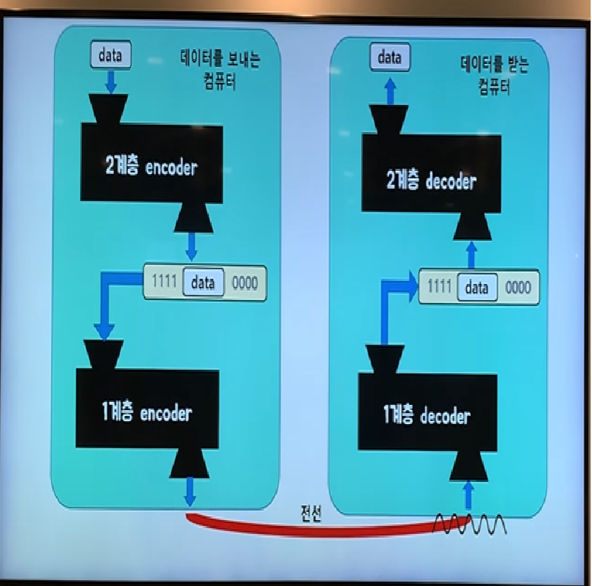
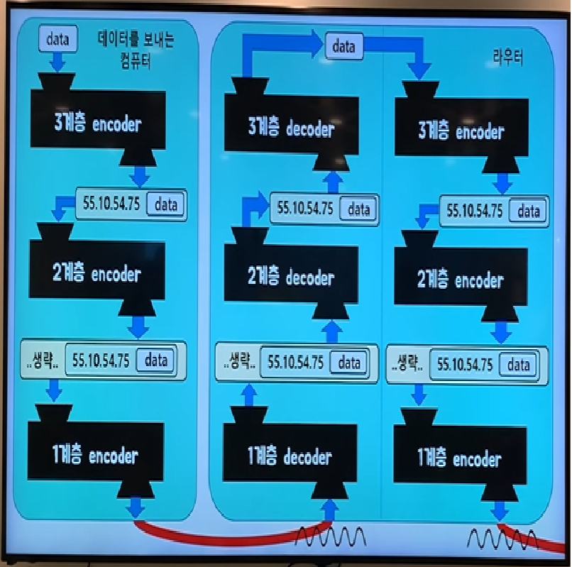
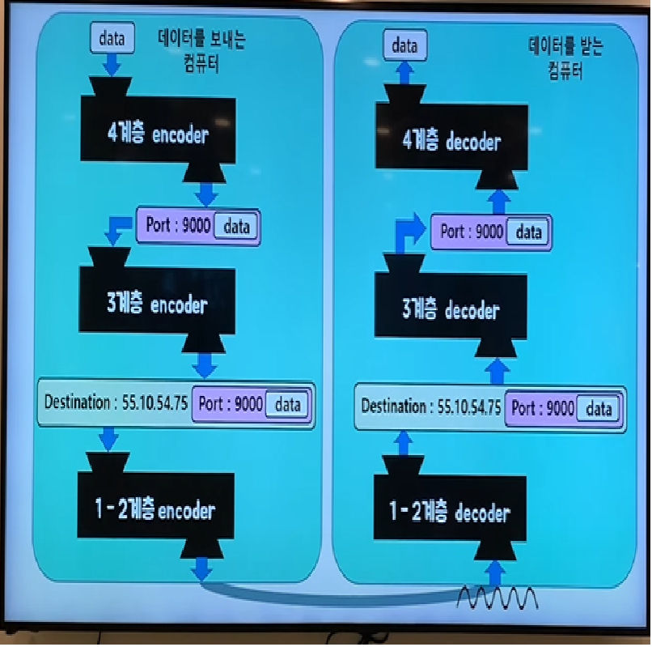
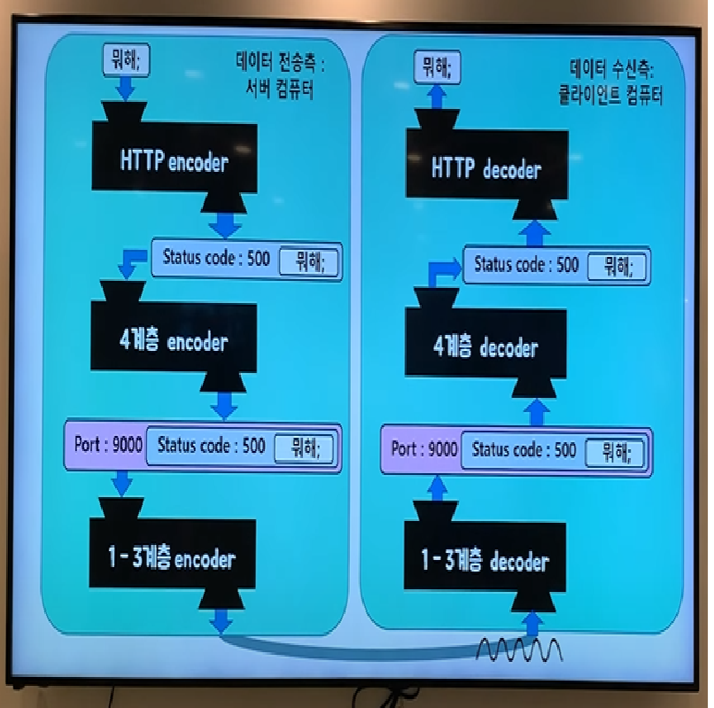

# Tecotalk - OSI 7 Layer

<aside>
💡 네트워크 시스템은 하나의 커다란 소프트웨어이며, OSI 7 Layer 모델은 거대한 네트워크 소프트웨어의 구조를 설명하는 것이다.

</aside>

- Data 통신에 대한 전반적인 지식.
    - Physical Layer는 통신하려는 컴퓨터를 일일히 전선으로 연결해줘야 하며, 이는 통신할 컴퓨터가 많아질 수록 비효율적이다.
    - 이를 해결하기 위해 하나의 전선으로 여러대의 컴퓨터가 해당 전선을 Physical Layer로 공유할 경우, 보안의 문제가 생긴다. (중간의 다른 컴퓨터들도 데이터를 확인할 수 있다.)
    - 이 때, 더미 허브라는 중간 경유지를 이용. 여러 대의 컴퓨터가 하나의 전선을 공유하면서, 더미 허브에서 메시지의 목적을 확인하여 분배하는 기능을 사용할 수 있다. 이 기능이 바로 스위치.
    - 스위치는 일종의 컴퓨터로서 그러한 기능을 시행한다.
    - 이 때. 하나의 스위치로 공유된 컴퓨터들을 네트워크, 혹은 인트라넷이라고 한다.
    - 만약 서로 독립된 네트워크와 네트워크를 전선으로 공유한다면, 독립된 네트워크들 사이에서도 통신이 가능해진다. 이 때 해당기능을 하는 스위치를 스위치 + 라우터인 L3스위치라고 칭한다.
    - 이와 같은 기능이 바로 공유기(라우터)
    - 모든 라우터와 라우터를 하나로 묶은 것이 바로 인터넷.
    - 현대의 컴퓨터는 OSI 모델이 아닌 TCP/IP Updated모델을 따르고 있다.
    - TCP/IP Updated 모델은 OSI Layer 7 Model 의 5,6,7계층인 Session Layer, Presentation Layer, Application Layer가 Application Layer 하나로 합쳐졌다.
    - TCP/IP 소켓 프로그래밍은 운영체제의 Transport layer에서 제공하는 API를 활용해서 통신 가능한 프로그램을 만드는 기술. 달리 네트워크 프로그래밍이라고도 한다.
    - TCP/IP 소켓 프로그래밍을 통해서 누구나 자신만의 Application Layer 인코더와 디코더를 만들 수 있는데, 이는 누구든 자신만의 Application Layer 프로토콜을 만들어서 사용할 수 있다는 의미다.
- 1계층 Physical Layer
    - 01과 1의 나열을 아날로그 신호로 바꾸어 전선으로 흘려 보내는 Encoding
    
    ```java
    Signal encode(date) { }
    ```
    
    - 아날로그 신호가 들어오면 0과 1의 나열로 해석하는 Decoding
    
    ```java
    Data decode(signal) { }
    ```
    
    - 물리적으로 연결된 두 대의 컴퓨터가 0과 1의 나열을 주고받을 수 있게 해주는 모듈 Module로 이루어져 있다.
    - Physical Layer는 전선이라는 물리적인 매체로 연결된 2대의 컴퓨터가 0과 1의 나열을 주고받을 수 있게 해 주는 모듈
    - Physical Layer는 PHY칩에 구현이 되어 있으며, 1계층 모듈은 하드웨어적으로 구현되어 있다.
- 2계층 Data-Link Layer
    - 여러 대의 컴퓨터가 하나의 컴퓨터에 거의 동시에 데이터를 전송한다고 가정하면, 송신자는 데이터의 앞 뒤에 특정한 비트열을 붙임으로서 여러 개의 데이터들을 구분한다.
    - 예를 들어, 송신자가 데이터의 시작이 1111, 끝이 0000으로 이루어지는 구분자 비트열을 붙여 전송한다고 가정한다면. 수신 컴퓨터는 데이터에서 1111과 0000을 찾아 구분하고, 그 사이의 비트열을 해석함으로서 여러 대의 컴퓨터에서 동시에 온 메시지를 구분하여 해석할 수 있다.
    - 결국 같은 네트워크에 있는 여러 대의 컴퓨터들이 데이터를 주고받기 위해 필요한 모듈이 Data-link Layer.
    - 앞서 1111과 0000을 구분자로 삼아 데이터 비트열을 전송한 것 같은 기술이 Framing이며, 이는 Data-link Layer에 속하는 작업들 중 하나다.
    
    
    - 1계층에서 2계층을 아우르는 데이터 송신 과정.
    - 해당 기술은 랜카드에 규현되어 있으며, 1계층과 마찬가지로 하드웨어적으로 구현되어 있다.
- 3계층 Network Layer
    - 서로 다른 라우터에 속해 있는 컴퓨터들이 데이터를 주고 받고 싶다면 전송자는 수신자의 IP주소를 알고 있어야 한다.
    - 전송자는 수신자의 IP주소가 포함된 Data를 전송하는데, 이 때 IP주소가 포함된 Data를 패킷이라고 한다.
    - 패킷은 무수한 라우터 사이에서 목적지에 해당하는 IP주소가 있는 컴퓨터로 데이터 전송이 이루어져야 하는데, 이 때 사용하는 기술이 Network Layer.
    - 결국, 수 많은 네트워크들의 연결로 이루어지는 inter-network 속에서, 어딘가에 있는 목적지 컴퓨터로 데이터를 전송하기 위해
    - IP주소를 이용해서 길을 찾는 Routing
    - 자신 다음의 라우터에게 데이터를 넘겨주는 Forwarding으로 이루어진 것이 Network Layer라고 할 수 있다.
    
    
    
    - 1~3계층 까지의 데이터 전송과정을 포함한 이미지.
    - Network Layer 기술은 운영체제의 커널에 소프트웨어적으로 구현되어 있다.
- 4계층 Transport Layer
    - 앞서 3계층까지의 기술을 통해 이제 전 세계의 컴퓨터들끼리의 통신이 가능해졌다.
    - 이 때, 데이터를 받은 컴퓨터가 실행 중인 여러 프로세스들에 받은 데이터를 나누어줄 때 필요해지는 것이 바로 포트 번호.
    - 송신자는 데이터를 보낼 때 데이터를 받을 수신자 컴퓨터에 있는 프로세스의 포트 번호를 붙여서 전송해줘야 한다.
    - 포트 번호는 하나의 컴퓨터에서 동시에 실행되고 있는 프로세스들이 서로 겹치지 않게 가져야 하는 정수 값이다.
    - 결국 Transport Layer는 port 번호를 사용하여 도착지 컴퓨터의 최종 도착지인 프로세스에까지 데이터가 도달하게 하는 모듈이라 할 수 있다.
    
    
    
    - 4계층 까지의 Layer구조.
    - Transport Layer 기술은 운영체제의 커널에 소프트웨어적으로 구현되어 있다.
- 5계층 Session Layer
    - 현대의 추세는 OSI 7 Layer Model이 아닌 TCP/IP Protocol을 사용한다. TCP/IP Protocol에서는 5계층과 6계층이 생략된다.
- 6계층 Presentation Layer
    - 현대의 추세는 OSI 7 Layer Model이 아닌 TCP/IP Protocol을 사용한다. TCP/IP Protocol에서는 5계층과 6계층이 생략된다.
- 7계층 Application Layer
    - Application Layer도 다른 Layer들과 마찬가지로 인코더, 디코더가 있다. 그 중 대표적인 Application Layer 프로토콜이 HTTP.
    - 즉, Application Layer는 사람이 입력한 언어를 컴퓨터 언어로 바꾸는,  HTTP, C, JAVA와 같은 프로그래밍 언어라고 이해할 수 있다. (정확한 개념은 아니다. 어디까지나 이해를 쉽게 하기 위한 비유)
    
    
    
    - OSI 전 계층을 통한 Encoding과 Decoding 과정.