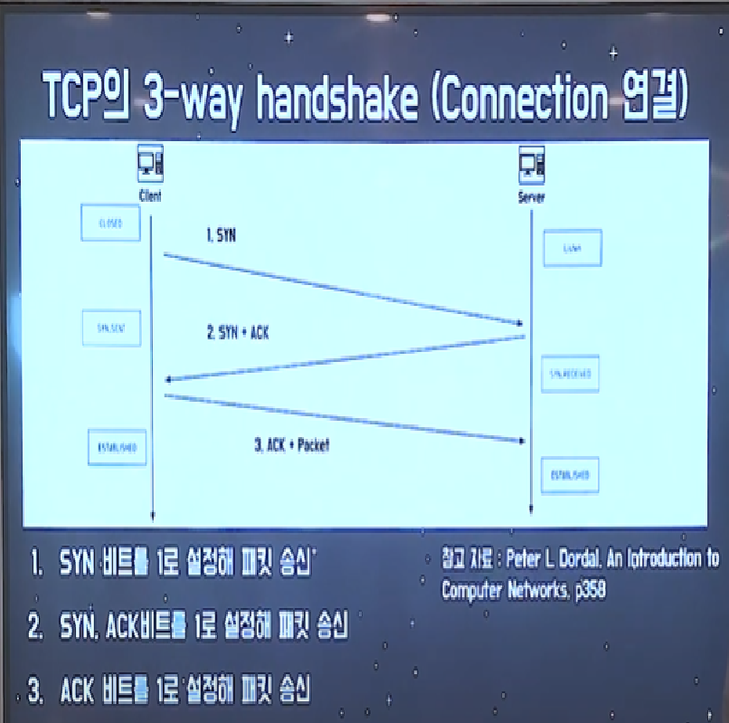
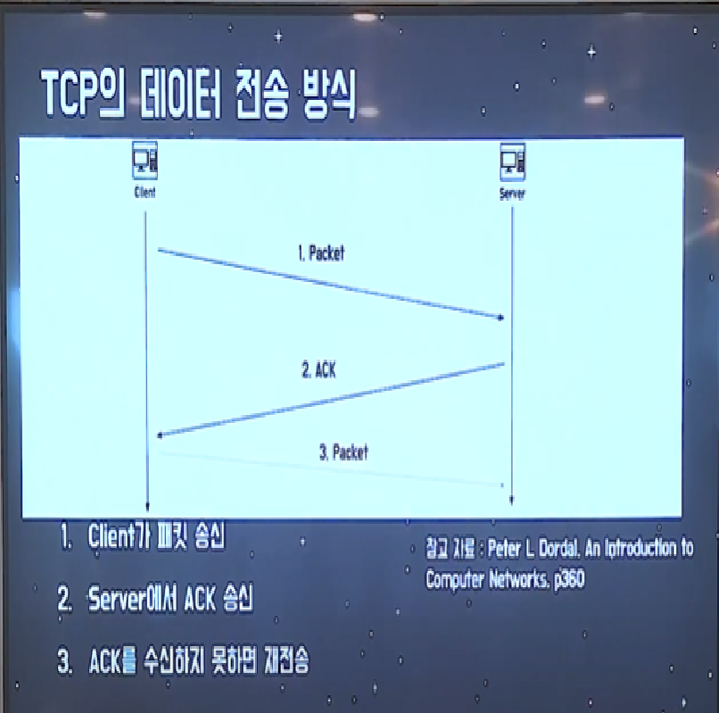
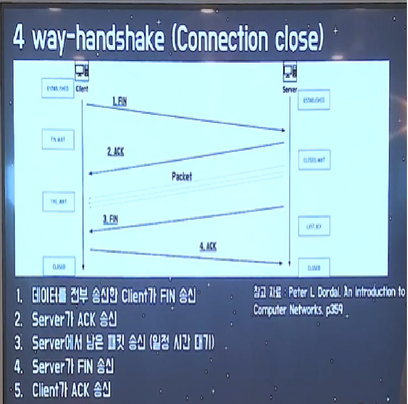

# Tecotalk - TCP/UDP

# TCP / UDP

- Transport Layer
    - End Point 간 신뢰성 있는 데이터 전송을 담당하는 계층
    - 데이터를 순차적으로, 안정적으로 전달하며
    - 포트 번호에 해당하는 프로세스에 데이터를 전달한다.
    - 만일 Transport Layer가 없다면 데이터의 순차 전송이 원활하게 이루어지지 않아, 송신자가 원하는 프로세스에 데이터가 전송되지 않을 수 있다.
    - 또한 Flow라 하여 흐름 문제가 있을 수 있는데. 이는 송수신자 간의 데이터 처리 속도가 차이날 경우, 수신 컴퓨터가 처리할 수 있는 데이터량을 초과하여 데이터의 누락이 일어날 수 있다는 의미를 가지고 있다.
    - 또한 Congestion이라 하여 혼잡 문제가 발생할 수 있는데, 이는 네트워크의 데이터 처리 속도 (라우터 등)  문제로 데이터 손실이 일어날 수 있다는 의미를 가지고 있다.
- TCP (Transfer Control Protocol)
    
    <aside>
    💡 세그먼트(Segment) - TCP 프로토콜의 PDU : IP 프로토콜의 패킷처럼 프로토콜 안에서 움직이는 데이터의 단위.
    
    </aside>
    
    - 위의 Transport Layer의 문제점을 해결하기 위해 발명된 기술이 TCP.
    - TCP는 아래의 특징들을 가지고 있다.
    1. Connection 연결 (3 way-handshake) - 양방향 통신 - 을 통한 데이터의 순차 전송을 보장
    2. Flow Control (흐름 제어)
    3. Congestion Control (혼잡 제어)
    4. Error Detection (오류 감지)
    
    
    
    - TCP의 3-way handshake (Connection 연결)은 기본적으로 위와 같은 방식을 따르고 있다. 
    Client에서 최초 요청으로 Server에게 SYN 비트를 1로 설정해 패킷을 송신한 뒤.
    패킷을 받은 Server가 ACK 비트와 Clent와 송신하기 위한 SYN 비트를 1로 설정해 패킷을 송신한다. 
    이후, Clent가 ACK 비트를 1로 설정해 Server에게 다시 패킷 송신을 하는 것.
    - 위와 같은 과정을 통해 Client와 Server가 서로 연결되는 것. 이 후 데이터 전송 방식은 아래의 이미지와 같은 방식으로 이루어진다.
    
    
    
    - TCP 3-way handshake를 통해 연결된 Client와 Server는 Client가 패킷을 송신한 뒤, Server가 송신을 잘 받았다는 의미로 ACK를 송신하는 방식을 가진다. 만일, Client가 ACK를 수신받지 못 했을 경우, 이전의 Packet을 재전송하는 방식을 가진다.
    - TCP 방식의 경우, 데이터 송신이 끝난 뒤, 연결을 해제할 때에도 별도의 과정이 필요하다. 그 과정은 아래와 같다.
    
    
    
    - 주의할 점은, Server가 Client가 송신을 끝내자는 의미로 송신한 FIN을 받은 뒤, 잘 받았다는 의미로 보내는 ACK를 송신한 뒤. 일정 시간 대기 후 Server에서 남은 패킷을 송신 한 다음. FIN을 송신한다는 점에 있다. 이후, Client가 Server의 FIN을 받았다는 의미로 ACK를 송신함으로 통신이 종료된다.
    - TCP의 문제점은 전송의 신뢰성은 보장하지만 시간 손실이 발생하고, 패킷을 조금만 손실해도 재전송이 필요하다는 점이 있다.
- UDP (User Datagram Protocol)
    - TCP보다 신뢰성이 떨어지지만, 전송 속도가 일반적으로 더 빠른 프로토콜이다.
    - TCP의 특징인 순차 전송, 흐름 제어, 혼잡 제어가 이루어지지 않는다.
    - TCP의 Connection인 3 way-handshake 역시 이루어지지 않는다.
    - Error Detection은 이루어진다.
    - 비교적 데이터의 신뢰성이 중요하지 않을 때 사용된다. (ex 영상 스트리밍)
    - UDP의 데이터 전송 방식은 Client가 패킷을 송신하는 과정 하나 뿐이다.