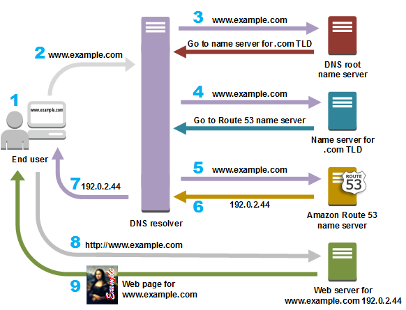

# DNS

# 정의

- DNS(Domain Name System)는 www.example.com과 같이 사람이 읽을 수 있는 이름을 192.0.2.1과 같은 숫자 IP 주소로 변환하여 컴퓨터가 서로 통신할 수 있도록 하는 서비스다.
- 인터넷의 DNS 시스템은 이름과 숫자 간의 매핑을 관리하여 마치 전화번호부와 같은 기능을 한다.
- DNS 서버는 이름을 IP 주소로 변환하여 도메인 이름을 웹 브라우저에 입력할 때 최종 사용자를 어떤 서버에 연결할 것인지를 제어한다.
    - 이 요청을 쿼리라고 한다.
- DNS는 public DNS와 private DNS로 나뉜다.
    - Public DNS
        - 일반적으로 인터넷 서비스 제공업체 (ISP; Internet Service Provider)가 기업에 IP 레코드를 제공한다.
        - 이러한 레코드는 일반 대중에게 제공되며, 사용 중인 디바이스 또는 디바이스에 연결된 네트워크에 상관 없이 누구나 액세스할 수 있다.
    - Private DNS
        - 회사의 방화벽 뒤에 존재하며 내부 사이트의 레코드만을 보관한다는 점에서 Public DNS와 다르다.
        - 이 경우 Private DNS의 범위는 내부 사이트 및 사용되는 서비스의 IP 주소를 기억하는 것으로 제한되며, 프라이빗 네트워크 외부에서 접근할 수 없다.
- 대부분의 경우 사용자는 호스트 이름을 IP 주소로 변환할 때 DNS에 의존한다.

# 유형

- DNS recursor
    - 리커서는 도서관의 어딘가에서 특정한 책을 찾아달라고 요청받는 사서로 생각할 수 있다.
    - DNS recursor는 웹 브라우저 등의 애플리케이션을 통해 클라이언트 컴퓨터로부터 쿼리를 받도록 고안된 서버다.
    - 일반적으로, 리커서는 클라이언트의 DNS 쿼리를 충족시키기 위해 추가 요청을 수행한다.
    - DNS 쿼리의 시작 부분에 있다.
    - 클라이언트의 재귀 요청에 응답하고 DNS 레코드를 추적하는 데 시간을 투자하는 컴퓨터다.
    - 요청한 레코드에 대해, 권한 있는 DNS 이름 서버에 도달할 때까지 일련의 요청을 하는 방식으로 이를 수행한다. (또는 레코드가 없다면 시간 초과되거나 오류를 반환)
    - 재귀 DNS 확인자가 클라이언트에 응답하는 데 필요한 레코드를 추적하기 위해 항상 다수의 요청을 해야 하는 것은 아니다.
    - 캐싱은 DNS 조회 초기에, 요청한 자원 레코드를 제공하여 필요한 요청을 단락시키는 데 도움이 되는 데이터 지속형 프로세스다.
- Root nameserver
    - 루트 서버는 사람이 읽을 수 있는 호스트 이름을 IP 주소로 변환(확인)하는 첫 번째 단계다.
    - 도서관에서 책장 위치를 가리키는 색인으로 생각할 수 있으며, 일반적으로 다른 더욱 특정한 위치에 대한 참조로 사용된다.
- TLD nameserver
    - TLD(Top Level domain) 서버는 도서관의 특정 책장으로 생각할 수 있다.
    - 이 이름 서버는 특정 IP 주소 검색의 다음 단계이며 호스트 이름의 마지막 부분을 호스팅한다.
    - (example.com 에서 TLD 서버는 com을 의미한다.)
- Authoriative nameserver
    - 최종 이름 서버로서, 책장에 있는 사전처럼 특정 이름을 해당 정의로 변환한다.
    - 실제로 DNS 리소스 레코드를 보유하고 담당하는 서버다.
    - 이름 서버 쿼리의 종착점이다.
    - 권한 있는 이름 서버가 요청한 레코드에 대한 접근 권한이 있다면, 요청한 호스트 이름의 IP 주소를 초기 요청을 한 DNS 리커서(사서)에게 돌려 보낸다.
    - DNS 쿼리의 끝 부분에 있다.
    - 쿼리한 자원 레코드로 응답하는 DNS 조회 체인의 맨 아래에 있는 서버로, 궁극적으로 웹 브라우저가 웹 사이트 또는 다른 웹 자원에 접근하는 데 필요한 IP 주소에 도달하도록 요청할 수 있게 한다.
    - 특정 DNS 레코드의 최종 원천이므로 다른 원천을 쿼리할 필요 없이 자체 데이터의 쿼리를 충족시킬 수 있다.

# 조회 단계

- 사용자가 웹 브라우저에 ‘example.com’을 입력하면, 쿼리가 인터넷으로 이동하고 DNS 재귀 확인자가 이를 수신한다.
- 이어서 확인자가 DNS 루트 이름 서버(.)를 쿼리한다.
- 루트 서버가 도메인에 대한 정보를 저장하는 최상위 도메인(TLD) DNS 서버의 주소로 확인자에 응답한다.
    - example.com을 검색할 경우의 요청은 .com TLD가 된다.
- 확인자가 .com TLD에 요청한다
- TLD 서버가 도메인 이름 서버(example.com)의 IP 주소로 응답한다.
- 재귀 확인자가 도메인의 이름 서버로 쿼리를 보낸다.
- example.com의 IP 주소가 이름 서버에서 확인자에게 반환된다.
- DNS 확인자가 처음 요청한 도메인의 IP 주소로 웹 브라우저에게 응답한다.
- 브라우저가 IP 주소로 HTTP 요청을 보낸다.
- 해당 IP 서버가 브라우저에서 렌더링할 웹 페이지를 반환한다.

> 단, DNS 정보가 캐시되어 있다면 위의 DNS 조회 프로세스에서 몇 단계는 건너 뛰어질 수 있다.
> 

### DNS Resolver

- DNS 확인자는 DNS 조회의 첫 번째 중단점이며, 최초 요청을 한 클라이언트 처리를 담당한다.
- 확인자는 URL이 궁극적으로 필요한 IP 주소로 변환되도록 하는 일련의 쿼리를 시작한다.
    - 캐시 되지 않은 일반적인 DNS 조회에는 재귀 쿼리와 반복 쿼리가 모두 포함된다.
- Resolver는 DNS 서버에 조회 메시지를 보내며 거기에 반송되는 응답 메시지를 클라이언트에게 전달한다.
- 즉, DNS Resolver는 Name Resoultion을 실행하는 역할을 수행한다고 할 수 있다.
    - ⇒ Name Resoultion : DNS 원리를 사용하여 IP 주소를 조사하는 것.
- DNS Reolsver는 Socket 라이브러리에 들어있는 부품화된 프로그램이다.
- 이를 통해 애플리케이션에서 간단히 Resolver를 호출하여 이용할 수 있다.
- 도메인명에서 IP 주소를 조사할 때 브라우저는 Socket 라이브러리의 Resolver를 이용한다.

### DNS Cache

- 캐싱의 목적은 데이터를 임시 저장하여, 데이터 요청에 대한 성능과 신뢰성을 높이는 것이다.
- DNS 캐싱은 요청하는 클라이언트와 가까운 곳에 데이터를 저장함으로써, DNS 쿼리를 조기에 확인할 수 있고 DNS 조회 체인의 추가 쿼리를 피할 수 있으므로, 로드 시간이 향상되고 대역폭/CPU 소비가 줄어든다.
- DNS 데이터는 다양한 위치에 캐시될 수 있으며, 각 위치는 TTL(Time-To-Live)에 의해 정의된 설정 시간 동안 DNS 레코드를 저장한다.
- 상위와 하위의 도메인을 같이 등록하는 경우, 상위 DNS 서버에 조회하면 하위 DNS 서버를 한 개 건너뛰고, 그 아래 DNS 서버에 관한 정보가 돌아온다.
    - 즉, 최상위 루트 도메인에서 차례대로 따라가는 원칙과 달리 움직일 수 있다.
- DNS 서버는 한 번 조사한 이름을 캐시에 기록할 수 있으며, 조회한 이름에 해당하는 정보가 캐시에 있으면 그 정보를 회답함으로서 그 자리에서 계층 구조를 아래로 향하여 찾을 수 있다.
- 단, 정보라는 것이 반드시 DNS 서버 위치에 대한 정보를 함축하지 않는다. 조회한 이름이 등록되지 않은 경우에도 이름이 존재하지 않는다는 정보 역시 캐시에 보존할 수 있다.
- 도메인을 쿼리하는데 있어 먼저 OS → Local 캐시를 조회하고 Local 캐시에 없는 도메인을 DNS 서버로 쿼리한다.
    
    ### 브라우저 DNS 캐싱
    
    - 최신 웹 브라우저는 기본적으로 정해진 시간 동안 DNS 레코드를 캐시하도록 설계되었다.
    - 그 목적은 DNS 캐싱이 웹 브라우저와 가까울수록 캐시를 확인하고 IP 주소에 대한 올바른 요청을 하기 위해 처리해야 할 단계가 적어진다.
    - DNS 레코드를 요청할 때 브라우저 캐시에서 처음으로 요청한 레코드를 확인하는 것이다.
    
    ### OS 수준 DNS 캐싱
    
    - 운영 체제 수준 DNS 확인자는 DNS 쿼리가 컴퓨터를 떠나기 전의 두 번째 중단점이며, 로컬에 있는 마지막 중단점이다.
    - 이 쿼리를 처리하도록 설계된 OS 내부의 프로세스를 일반적으로 Stub 확인자 또는 DNS 클라이언트라고 한다.
    - 스텁 확인자는 애플리케이션에서 요청을 받으면 먼저 자체 캐시를 검사하여 레코드가 있는지 확인한다.
    - 레코드가 없으면 로컬 네트워크 외부의 (재귀 플래그가 설정된) DNS 쿼리를 ISP 내부의 DNS 재귀 확인자로 보낸다.
    - ISP 내부의 재귀 확인자가 모든 이전 단계와 같이 DNS 쿼리를 수신하면, 요청한 호스트-IP-주소 변환이 로컬 지속성 계층 내에 이미 저장되어 있는지도 확인한다.

# DNS 쿼리 유형

- 일반적인 DNS 조회에서는 세 가지 유형의 쿼리가 발생한다.
- 이러한 쿼리 조합을 사용하면 DNS 확인을 위한 최적화된 프로세스가 되어 이동 거리를 줄일 수 있다.
- 이상적인 상황에서는, 캐시된 레코드 데이터를 사용할 수 있으므로, DNS 이름 서버가 비재귀 쿼리를 반환할 수 있다.
    
    ### 재귀 쿼리
    
    - 확인자가 레코드를 찾을 수 없는 경우, DNS 클라이언트는 DNS 서버(일반적으로 DNS 재귀 확인자)가 요청한 자원 레코드 또는 오류 메시지를 사용하여 클라이언트에 응답하도록 요구한다.
    
    ### 반복 쿼리
    
    - DNS 클라이언트는 DNS 서버가 가능한 최상의 응답을 반환하도록 한다.
    - 쿼리한 DNS 서버가 쿼리 이름과 일치하는 이름을 갖고 있지 않은 경우, 하위 수준의 도메인 네임스페이스에 대해 권한 있는 DNS 서버에 대한 참조를 반환한다.
    - 그 뒤 DNS 클라이언트가 참조 주소를 쿼리한다.
    - 이 프로세스는 오류 또는 제한 시간 초과가 발생할 때까지 추가 DNS 서버가 쿼리 체인을 중단한 상태로 계속된다.
    
    ### 비재귀 쿼리
    
    - 일반적으로 DNS 확인자 클라이언트의 쿼리를 받은 DNS 서버가 해당 레코드에 대한 권한이 있거나 캐시 내부에 해당 레코드를 갖고 있어, DNS 서버가 접근 권한을 가지고 있는 레코드를 쿼리할 때 발생한다.
    - 일반적으로 DNS 서버는 추가 대역폭 소비 및 업스트림 서버의 부하를 방지하기 위해 DNS 레코드를 캐시한다.

# 보안 관련 사항

- DNS 서버 사용 시 발생할 수 있는 흔한 리스크 두 가지는 다음과 같다.
    
    ### DNS 하이재킹
    
    - Redirection 공격으로 알려진 DNS 하이재킹은 DNS 쿼리가 잘못 처리되어 사용자를 거짓의 악성 웹사이트로 Redirection하는 경우 발생한다.
    - 사용자 컴퓨터의 라우터를 장악하거나 DNS 통신을 가로채는 멀웨어를 설치하면 DNS 하이재킹이 발생한다.
    
    ### 캐시 오염
    
    - DNS 캐시 오염(cache poisoning)은 공격자가 DNS 서버에 대한 제어력을 갖고 입력된 IP 주소를 손상시키는 경우 발생한다.
    - 그 뒤 거짓으로 입력된 IP 주소는 전 세계의 ISP에 전달되며, 캐시되어 public DNS 검색에 사용된다.
    - 캐시 오염을 방지하기 위한 한 방법은 DNSSec를 사용하는 것이다.
    - DNSSec는 안전한 DNS를 사용하고 암호화된 서명을 DNS 레코드에 할당하므로 레코드를 원래 상태와 다르게 변경할 수 없다.
    - HTTPS와 유사하게 DNSSec은 쿼리 프로세스를 느리게 하는 강력한 암호화를 수행하지 않고도 DNS 레코드에 접근할 수 있도록 보안 계층을 추가한다.