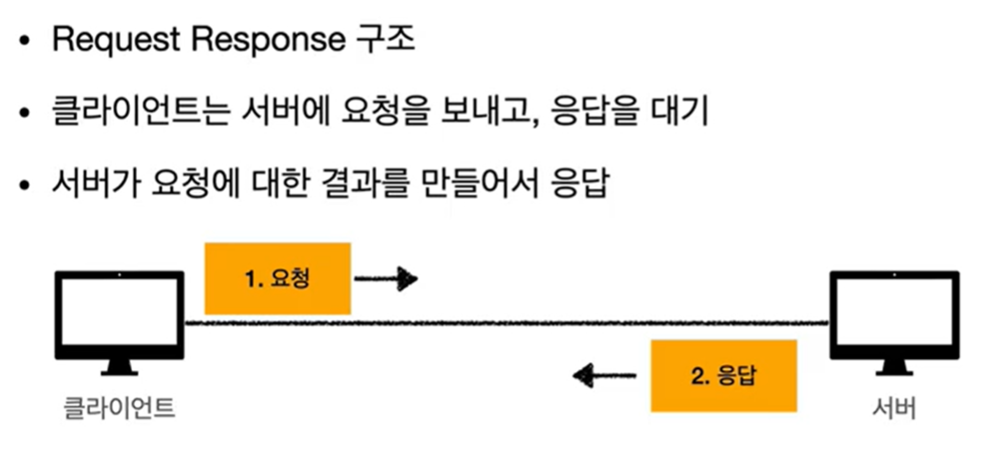

# HTTP/HTTPS

# HTTP(Hyper Text Transfer Protocol)

- 서버/클라이언트 모델을 따라 데이터를 주고 받기 위한 프로토콜
- 80번 포트를 사용한다.
- World Wide Web을 위한 데이터 통신의 기초이며,  Hyper Text 문서에는 다른 리소스에 대한 하이퍼 링크가 포함되어 있다.
- 애플리케이션 레벨의 프로토콜로 TCP/IP 위에서 작동하는 암호화 되지 않은 평문 데이터를 전송하는 프로토콜이다.
- 상태를 가지고 있지 않은 Stateless 프로토콜이며 Method, Path, Version, Headers, Body 등으로 구성된다.
  - HTML, TEXT, IMAGE, 음성, 영상, 파일, JSON, XML(API) 등 거의 모든 형태의 데이터를 전송 가능하다.
  - 서버 간 데이터 전송에도 대부분 HTTP가 사용된다.
- 기반 프로토콜은 다음과 같다.
  - TCP : HTTP/1.1, HTTP2
  - UDP : HTTP/3
  - 현재는 HTTP/1.1을 주로 사용하며, HTTP/2, 3도 점점 증가 추세에 있다.
- 클라이언트-서버 구조이며 Stateless, Connection-less의 상태를 가진다.

  

- 단순하며 확장 가능하다.

  ### Stateless, 무상태

  - 아무 서버나 호출해도 되며, 상태를 보관하지 않는다.
  - 중간에 서버에 장애가 발생해도 같은 기능을 하는 서버군의 다른 서버에서 응답을 수행할 수 있다.
  - Server가 Client의 상태를 보존하지 않으며, 서버 확장성(Scale Out)이 높지만 Client가 추가 데이터를 전송한다.
  - 모든 것을 무상태로 설계할 수 있는 경우도 있지만, 없는 경우도 있다.
  - 일반적으로 브라우저 쿠키나 서버 session 등을 이용하여 상태를 유지하며, 상태 유지는 최소한만 사용한다.

  ### Connection-less

  - HTTP는 기본적으로 연결을 유지하지 않는 모델이다.
  - 일반적으로 초 단위 이하의 빠른 속도로 응답하며, 1시간 동안 수천 명이 서비스를 사용해도 실제 서버에서 동시에 처리하는 요청은 수십 개 이하로 매우 적다.
  - 서버 자원을 매우 효율적으로 사용할 수 있다.
  - 단, TCP/IP 연결을 매 요청마다 새로 맺어야 하며(3 way handshake 시간 추가) 웹 브라우저로 사이트 요청 시 HTML 뿐만 아니라 자바스크립트, css, 추가 이미지 등 수 많은 자원이 함께 다운로드 된다.
  - 현재는 HTTP 지속 연결(Persistent Connections(Keep-Alive)로 문제를 해결한다.
  - HTTP/2, HTTP/3에서 더 많은 최적화가 이루어진다.

  ### HTTP Message Structure

  - HTTP 요청 메시지와 응답 메시지는 구조가 다르다.
  - HTTP Message의 공식 스펙은 다음과 같다.

    

    - Start-Line, 시작 라인 구조(요청 메시지)

      

      - Start-Line = Request-Line / Status-Line
        - Request-Line = Method SP(공백) request-target SP HTTP-version CRLF(엔터)
          - HTTP 메서드(GET)
            - 종류 : GET, POST, PUT, DELETE…
            - 서버가 수행해야 할 동작을 지정한다.
          - 요청 대상(/search?q=hello&hl=ko)
            - absolute-path[?query](절대경로[?쿼리])
            - 절대경로 = “/” 로 시작하는 경로
          - HTTP version (HTTP/1.1)
            - HTTP Version (1.1, 1.2, 3.0 등)
        - Start-Line, 시작 라인 구조 (응답 메시지)

          

        - start-line = request-line / status-line
          - status-line = HTTP-version SP status-code SP reason-phrase CRLF
          - HTTP 버전(HTTP-version)
          - HTTP 상태 코드(status-code) : 요청의 성공, 실패
            - 200 : 성공
            - 400 : 클라이언트 요청 오류
            - 500 : 서버 내부 오류
          - 이유 문구(reason-phrase)
            - 사람이 이해할 수 있는 짧은 상태 코드 설명 글
      - HTTP Header
        - header-field = field-name “:” OWS field-value OWS (OWS: 띄어쓰기 허용)
        - field-name은 대소문자를 구분하지 않는다.

          

        - 용도
          - HTTP 전송에 필요한 모든 부가정보
            - ⇒ 메시지 바디의 내용, 메시지 바디의 크기, 압축, 인증, 요청 클라이언트 정보, 서버 애플리케이션 정보, 캐시 관리 정보 등
          - 표준 헤더가 너무 많다
          - 필요시 임의의 헤더 추가도 가능
            - [https://en.wikipedia.org/wiki/List_of_HTTP_header_fields](https://en.wikipedia.org/wiki/List_of_HTTP_header_fields)
      - HTTP Message Body

        

        - 실제 전송할 데이터
        - HTML 문서, 이미지, 영상, JSON 등등 byte로 표현할 수 있는 모든 데이터 전송 가능하다.

  ### HTTP Method

  - GET

    

    - Resource 조회
    - 서버에 전달하고 싶은 데이터는 query를 통해 전달한다.
    - 메시지 바디를 사용해서 데이터를 전달할 수 있지만, 지원하지 않는 곳이 많아 권장되지 않음
  - POST

    

    - 요청 데이터 처리
    - 메시지 body를 통해 서버로 요청 데이터 전달
    - 서버는 요청 데이터를 처리
      - 메시지 body를 통해 들어온 데이터를 처리하는 모든 기능 수행
    - 주로 전달된 데이터로 신규 Resource 등록, 프로세스 처리에 사용
  - PUT

    

    - Resource를 대체
      - Resource가 있으면 완전히 대체
      - Resource가 없으면 생성
    - Client가 Resource를 식별한다
      - Client가 Resource 위치를 알고 URI를 지정한다
        - ⇒ POST와의 차이점

        

  - PATCH

    

    - Resource를 부분 변경한다.
    - 요청에 없는 데이터를 대체하거나 제거하지 않는다.

      

  - DELETE

    

    - 리소스를 제거한다.

  ### Property of HTTP Method

  

  - HTTP Method의 속성
    - 안전(Safe Methods)
      - 호출해도 Resource를 변경하지 않는다.
      - 안전은 해당 Resource만 고려한다.
    - 멱등(Idempotent Methods)
      - f(f(x)) = f(x)
      - 호출 횟수에 상관 없이 결과가 동일하다
      - 멱등 메서드
        - GET : 몇 번을 조회해도 조회 결과가 같다.
        - PUT : 결과를 대체한다. 같은 요청을 여러 번 해도 최종 결과는 같다
        - DELETE : 결과를 삭제한다. 같은 요청을 여러 번 해도 삭제된 결과는 동일
        - POST : 멱등이 아니다. 두 번 호출하면 같은 결제가 중복 해서 발생 가능
      - 활용
        - 자동 복구 매커니즘
        - 서버가 TIMEOUT 등으로 정상 응답을 못 주었을 때, 클라이언트가 같은 요청을 다시 해도 되는지의 판단 근거
      - 재요청 중간에 다른 곳에서 리소스 변경 시

      

    - 캐시가능(Cacheable Methods)
      - 응답 결과 Resource를 캐시해서 사용해도 되는가
      - GET, HEAD, POST, PATCH cache 가능
      - 실제로는 GET, HEAD 정도만 캐시로 사용
        - POST, PATCH는 본문 내용까지 캐시 키로 고려해야 하지만, 구현이 어렵다.

# HTTPS(Hyper Text Transfer Protocol Secure)

- Hyper Text Protocol over Secure Socket Layer, HTTP over TLS, HTTP over SSL, HTTP Secure 등으로 불린다.
- HTTP에 데이터 암호화가 추가된 프로토콜이다.
- 443번 포트를 사용하며, 네트워크 상에서 중간에 제 3자가 정보를 볼 수 없도록 암호화를 지원한다.
- HTTPS는 대칭키 암호화와 비대칭키 암호화를 모두 사용하여 빠른 연산 속도와 안전성을 모두 얻고 있다.
- HTTPS 연결 과정(Hand-Shaking)에서는 먼저 서버와 클라이언트 간에 세션키를 교환한다.
  - 세션키는 주고 받는 데이터를 암호화하기 위해 사용되는 대칭키이며, 데이터 간의 교환에는 빠른 연산 속도가 필요하므로 세션키는 대칭키로 만들어진다.
  - 세션키를 클라이언트와 서버가 교환하는 과정에는 비대칭키가 사용된다.
- 즉, 처음 연결을 성립하여 안전하게 세션키를 공유하는 과정에서 비대칭키가 사용되는 것이고, 이후에 데이터를 교환하는 과정에서 빠른 연산 속도를 위해 대칭키가 사용된다.
- 실제 HTTPS 연결 과정이 성립되는 흐름은 다음과 같다.
  - 클라이언트(브라우저)가 서버로 최초 연결 시도
  - 서버는 공개키(엄밀히는 인증서)를 브라우저에게 넘겨줌
  - 브라우저는 인증서의 유효성을 검사하고 세션키를 발급함
  - 브라우저는 세션키를 보관하며 추가로 서버의 공개키로 세션키를 암호화하여 서버로 전송
  - 서버는 개인키로 암호화된 세션키를 복호화하여 세션키를 얻음
  - 클라이언트와 서버는 동일한 세션키를 공유하므로 데이터를 전달할 때 세션키로 암호화/복호화를 진행

  ### HTTPS 발급 과정

  

  - 서버는 클라이언트와 세션키를 공유하기 위한 공개키를 생성해야 하는데, 일반적으로는 인증된 기관(CA; Certificate Authority)에 공개키를 전송하여 인증서를 발급받는다.
  - 그 과정은 다음과 같다.
    - A 기업이 HTTP 기반의 애플리케이션에 HTTPS를 적용하기 위해 공개키/개인키를 발급
    - CA 기업에 돈을 지불하고, 공개키를 저장하는 인증서의 발급을 요청
    - CA 기업은 CA 기업의 이름, 서버의 공개키, 서버의 정보 등을 기반으로 인증서를 생성하고, CA 기업의 개인키로 암호화하여 A기업에게 이를 제공
    - A 기업은 클라이언트에게 암호화된 인증서를 제공
    - 브라우저는 CA 기업의 공개키를 미리 다운 받아 가지고 있어, 암호화된 인증서를 복호화
    - 암호화된 인증서를 복호화하여 얻은 A기업의 공개키로 세션키를 공