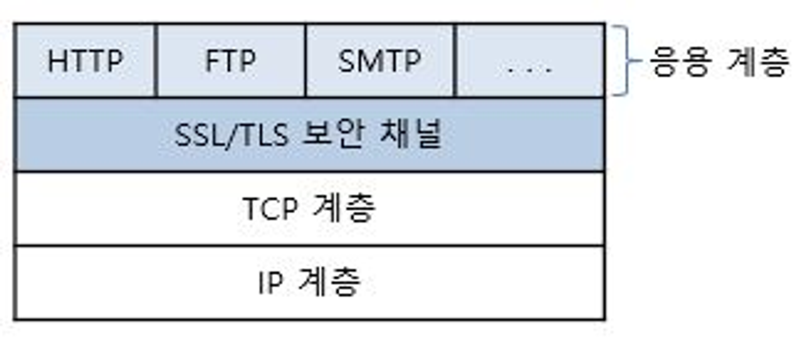
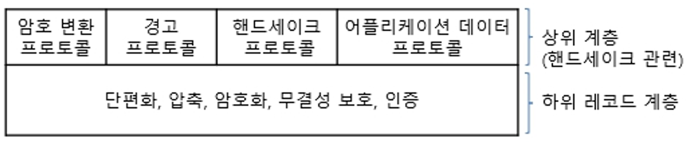

# SSL/TLS

# SSL(Secure Sockets Layer)

- 보안 소켓 계층 인증서는 종종 디지털 인증서로 불리며, 네트워크 상의 두 디바이스 또는 애플리케이션 간의 보안 연결을 생성하는 통신 프로토콜 또는 규칙 세트다.
- SSL은 애플리케이션 또는 브라우저가 모든 네트워크에서 안전하고 암호화된 통신 채널을 만드는 데 사용할 수 있는 기술이지만, 몇 가지 보안 결함이 있는 오래된 기술이다.
- TLS는 기존 SSL 취약성을 수정하는 업그레이드 된 SSL 버전이라 볼 수 있다.
- C 언어로 작성된 암호화 프로토콜이며 암호화를 사용하여 데이터의 무결성과 기밀성을 보호한다.
- 현재 모든 SSL 인증서는 더 이상 사용되지 않으며, TLS 인증서가 업계 표준이다.
- 단, TLS 인증서를 지칭하는 데 여전히 SSL 용어를 사용하는 곳이 많다.

# TLS(Transport Layer Security)

- 인터넷을 통한 통신에 대한 개인 정보 보호 및 데이터 보안을 용이하게 하기 위해 널리 채택되는 보안 프로토콜이다.
- SSL에 대한 업그레이드 버전으로 볼 수 있다.
- TLS 프로토콜이 수행하는 작업에는 암호화, 인증, 무결성의 세 가지 주요 구성 요소가 있다.
    - 암호화 : 제 3자로부터 전송되는 데이터를 숨긴다.
    - 인증 : 정보를 교환하는 당사자가 자신이 주장하는 사람인지 확인한다
    - 무결성 : 데이터가 위조되거나 변조되지 않았는지 확인한다.

# 특징

- 클라이언트/서버 기반의 프로토콜
    - 클라이언트/서버 두 응용 상대방 간에, 연결 전 동적 협상에 의한 보안 연결 수립
- 응용 프로그램 자체 구현 가능
    - 대부분의 다른 보안 프로토콜이 운영체제 등에 밀접하게 관련된 것과의 차이점
- 계층 위치
    - 응용 계층 및 전송 계층 사이에 위치하나, 전송 계층과 보다 밀접하게 동작 한다.
    - 소켓 지향적인 프로토콜
- 운반용 프로토콜 및 포트번호
    - 운반용 프로토콜 : TCP 또는 UDP
    - 사용 포트 : 응용 마다 다름. HTTPS의 경우에는 443 사용
- 인증 구조
    - X.509
- 키 교환 방식 (협상 선택 가능)
    - Null, RSA 공개 키 교환, Anonymous Diffie-Hellman 키 교환, Ephermeral Diffie-Hellman 키 교환, Fixed Diffie-Hellman 키 교환, Fortezza
- 대칭키 암호화 방식 (협상 선택 가능)
    - RC2(40), RC4(40), RC4(128), DES, Triple DES, IDEA 등
- 해쉬 알고리즘 (협상 선택 가능)
    - Null, MD5, SHA-1

# 주요 기능

- 상호 인증
    - 공개키 인증서를 이용하여 서버,클라이언트의 상호 인증
    - 즉, 클라이언트/서버 두 응용 간에 상대방에 대한 인증
- 메세지 인증(메세지 무결성)
    - 메세지 인증 코드 HMAC에 의한 메세지 무결성 제공 (HMAC MD5, HMAC SHA-1 등)
- 메세지 압축
    - 디폴트는 Null
    - 압축 알고리즘은 미리 정해지지 않고 협상으로 지정 가능
- 암호화용 세션 키 생성(대칭 키 합의)를 위한 키 교환
    - RSA : 두 키 (공개 키 및 개인 키)가 하나의 수 체계를 형성 (서버 공개 키 사용)
    - Diffie-Hellman : Diffie-Hellman 프로토콜을 기반으로 한 키 교환 방식
- 생성된 공유 비밀키에 의해 암호화된 종단간 안전한 연결 통로 제공
    - 스트림 암호화 : 40, 128 비트의 RC4
    - 블록 암호화 : IDEA, 40, 56 비트의 DES, 168 비트의 3DES 등

# 프로토콜 스택

- 전송계층 TCP 위에서, 보안 소켓/보안 채널/터널링을 구성
    
    - 응용계층에서 생성된 데이터에 대한 보안(인증, 무결성, 기밀성), 압축 등의 서비스 제공
  - SSL/TLS의 상세 프로토콜 스택
  

# 차이

- SSL/TLS handshake
    - handshake는 브라우저가 서버의 SSL 또는 TLS 인증서를 인증하는 프로세스로, 양 당사자를 인증한 다음 암호화 키를 교환한다.
    - SSL handshake는 명시적 연결인 반면 TLS handshake는 암시적 연결이다.
    - SSL handshake는 TLS  handshake 보다 단계가 더 많다. TLS는 추가 단계를 제거하고 총 암호 그룹 수를 줄여 프로세스 속도를 높였다.
    - handshake 단계는 다음과 같다.
        - 초기 협상 단계 ⇒ 인증 단계 ⇒ 보안 채널 형성 ⇒ 상호 암호화 통신 시
- 알림 메시지
    - SSL 및 TLS 프로토콜은 알림 메시지를 통해 오류와 경고를 전달한다.
    - SSL에는 경고와 치명적이라는 두 가지 알림 메시지 유형만 있다.
        - 경고 : 오류가 발생했지만 연결을 계속할 수 있음
        - 치명적  : 연결을 즉시 종료해야 함
        - SSL 알림 메시지는 암호화되지 않는다
    - TLS에는 닫기 알림이라는 추가 알림 메시지 유형이 있다.
        - 닫기 알림은 세션 종료를 알린다.
        - TLS 알림은 추가 보안을 위해 암호화된다.
- 메시지 인증
    - SSL과 TLS 모두 메시지의 진본성과 무결성을 확인하기 위한 암호화 기술인 메시지 인증 코드(MAC)을 사용한다.
    - 레코드 프로토콜은 보안 키를 사용하여 MAC을 고정 길이 코드로 생성하고 원본 메시지에 첨부한다.
    - SSL 프로토콜은 MAC 생성에 MD5 알고리즘(현재는 구식)을 사용한다.
    - TLS 프로토콜은 더 복잡한 암호화와 보안에 해시 기반 메시지 인증 코드(HMAC)을 사용한다.
- 암호 그룹
    - 암호 그룹은 브라우저와 서버 간의 정보를 암호화하기 위한 키를 생성하는 알고리즘 모음이다.
    - 일반적으로 암호 그룹에는 키 교환 알고리즘, 검증 알고리즘, 대량 암호화 알고리즘 및 MAC 알고리즘이 포함된다.
    - 보안 문제로 인해 TLS의 여러 알고리즘이 SSL에서 업그레이드되었다.