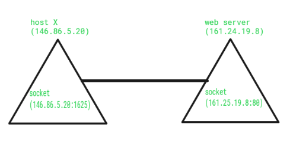

# 소켓

# 정의

- 네트워크 상에서 돌아가는 두 개의 프로그램 간 양방향 통신의 하나의 엔드 포인트.
    - 엔드 포인트 : 아이피 주소와 포트 번호의 조합
- 포트 번호에 바인딩 되어 TCP 레이어에서 데이터가 전달되어야 하는 애플리케이션을 식별할 수 있게 한다.
- 소켓 메커니즘은 통신이 발생하는 명명된 접점을 설정하여 프로세스 간 통신(IPC) 수단을 제공한다.
- 소켓은 네트워크를 통한 양방향 FIFO 통신 기능을 제공한다. 네트워크에 연결되는 소켓은 통신이 끝날 때마다 생성된다.
- 소켓은 노드에서 실행되는 애플리케이션 프로세스의 수명 동안에만 생성된다.
- 각 소켓에는 특정 주소가 있다. 이 주소는 IP와 포트 번호(엔드 포인트)로 구성된다.
- 소켓은 일반적으로 클라이언트 서버 애플리케이션에 사용된다.
- 서버는 소켓을 생성하고 이를 네트워크 포트 주소에 연결한 뒤 다음 클라이언트가 접속할 때까지 기다린다.
- 클라이언트는 소켓을 생성한 다음 서버 소켓에 연결을 시도한다. 연결이 설정되면 데이터 전송이 이루어진다.

# 유형

- 데이터그램 소켓(Datagram Socket)
    - 패킷을 보내고 받기 위한 연결 지점이 없는 네트워크 유형이다.
    - 우편함과 유사하며 상자에 담긴 편지(데이터)는 수집되어 우편함(수신 소켓)으로 전달(전송)된다.
    - UDP를 사용하며 데이터그램 소켓에서 보내거나 받는 각 패킷은 개별적으로 주소가 지정되고 라우팅된다.
    - 순서와 신뢰성이 보장되지 않으므로 한 시스템이나 프로세스에서 다른 시스템이나 프로세스로 전송된 여러 패킷이 어떤 순서로든 도착하거나 전혀 도착하지 않을 수 있다.
- 스트림 소켓(Stream Socket)
    - 컴퓨터 운영 체제에서 스트림 소켓은 연결 생성 및 삭제와 오류 감지를 위해 잘 정의된 메커니즘을 통해 기록 경계 없이 연결 지향적이고 순차적이며 고유한 데이터 흐름을 제공하는 IPC 소켓 또는 네트워크 소켓 유형이다.
    - TCP, SCTP, DCCP를 사용하는 연결 지향 소켓이다.
    - 연결 생성 및 삭제, 오류 보고를 위한 잘 정의된 메커니즘을 통해 레코드 경계 없이 오류 없는 순차적이고 고유한 데이터 흐름을 제공한다.
    - 대역외 기능을 사용하여 안정적으로 순서대로 데이터를 전송한다.
    - 전화와 유사며 전화기(양쪽 끝) 사이에 연결이 설정되고 대화(데이터 전송)가 발생한다.
- 원시 소켓(Raw Socket)
    - 프로토콜별 전송 계층 형식 지정 없이 IP 패킷을 직접 보내고 받을 수 있다.
    - 다른 유형의 소켓을 사용하면 페이로드가 선택한 전송 계층 프로토콜에 따라 자동으로 캡슐화되며, 소켓 사용자는 페이로드와 함께 브로드캐스트되는 프로토콜 헤더의 존재를 인식하지 못 한다.
    - 원시 소켓에서 읽을 때 일반적으로 헤더가 포함되며, 패킷을 전송할 때 헤더 자동 추가 역시 선택 사항이다.
    - Nmap 과 같은 보안 관련 애플리케이션에 사용된다. 사용 사례는 사용자 공간에서 새로운 전송 계층 프로토콜을 구현하는 것을 예로 들 수 있다.
    - 일반적으로 네트워크 장비에서 사용할 수 있으며 IGMP, OSPF 같은 라우팅 프로토콜과 ICMP 등에 사용된다.

# 함수

| 함수 이름 | 정의 |
| --- | --- |
| Socket() | 소켓을 생성한다. |
| Bind() | 소켓을 식별하기 위한 전화번호와 같은 요소 |
| Listen() | 연결 수신 준비 완료 |
| Connect() | 발신자 역할을 할 준비 완료 |
| Accept() | 수락, 발신자의 연결을 수락한다. |
| Write() | 데이터를 보낸다 |
| Read() | 데이터를 받는다 |
| Close() | 연결을 닫는다. |