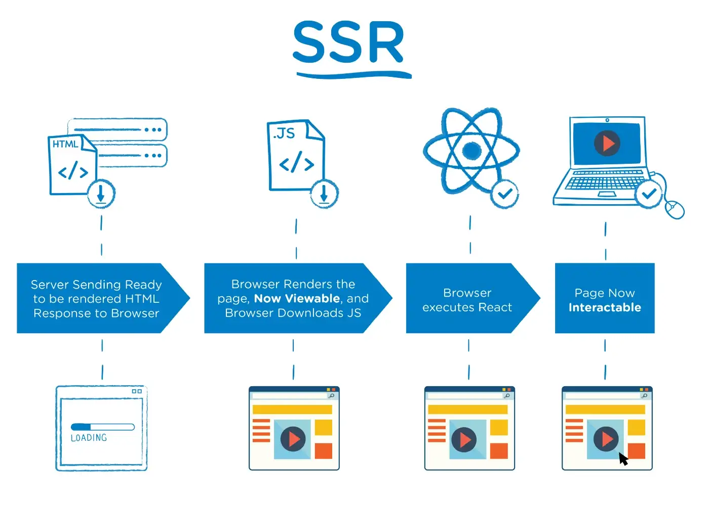

# Next.js

# Section 0. 개발 환경 설정하기

- 강의 진행 방식 설명
    - 강의 소개 및 개발 환경 설명
    - Next.js 13버전 기준,
    - app directory는 Next.js 12버전 pages directory를 기준으로 시작한다.
    - 강의 후반부 Next.js 13버전의 추가 기능과 app directory 추가 설명
- 소스 코드 다운로드
    - 강의 자료, 소스 코드 다운로드
- create-next-app으로 Next.js 시작하기
    - cmd에서 npx create-next-app@latest 명령어로 next.js를 설치한다.
    - cmd에 지정된 디렉터리에 설치된 폴더를 IDE로 연 뒤, 터미널에서 npm run dev 명령어로 next.js를 설치한다.
    - 성공적으로 설치 되었다면 localhost:3000으로 next.js 서버에 접속할 수 있다.
    - ESLint는 cmd에서 next.js 설치 시 옵션으로 지정했다면 폴더에서
        
        ```json
        {
          "extends": "next/core-web-vitals"
        }
        ```
        
        - 형태로 확인할 수 있다.
        - 해당 next/core-web-vitals 룰은 Next.js에서 지원하는 core-web-vitals ruleset에 해당한다. 해당 룰은 개발자에게 권장되는 configuration이기에 그대로 사용한다.
    - package.json에서 eslint-config-next dependency를 확인할 수 있는데, 해당 json의 dependencies인 @next/eslint-plugin-next는 Script, Image, Head 등 Next.js 전용 API에 대한 rules가 된다.
    - ESLint가 코드에 대한 룰이라면, Prettier는 그 코드를 좀 더 깔끔하게 만들어 주는 code formatter이다.
    - Prettier는 npm install --save-dev --save-exact prettier 명령어로 설치할 수 있다.
    - 설치 후에는 prettierrc.json 파일을 생성하여 관련 설정을 추가할 수 있다.
        
        ```json
        {
          "trailingComma": "es5",
          "tabWidth": 2,
          "semi": true,
          "singleQuote": true
        }
        ```
        
        - comma, single Quote 등에 대한 설정
    - 이후에는 eslint-config-prettier 패키지를 설치한다.
    - 이는 ESLint가 code-formatting에 대한 룰을 포함하고 있기에 충돌을 방지하기 위함이다.
        - npm install --save-dev eslint-config-prett
    - 이후 기본 제공 코드를 정리

# Section 1. Data fetching 이해하기(feat. next/link)

- CSR/SSR/SSG 이해하기
    - 각 방식에 대해 TTFB, FCP 등의 시간을 비교할 수도 있지만, 상황과 설계에 따라 달라질 수 있어 딱 잘라 비교하기에는 의미가 크지 않다.
    - SSR : Server-Side-Rendering
        
        
        
        - SSR은 현존하는 일부 블로그, 홈페이지 웹사이트 등에 사용되고 있고, php나 JAVA의 서버 사이트 템플릿 엔진을 이용해서 많이 개발되어 있다.
        - 완성된 HTML이 서버에서 만들어진 뒤 브라우저에 전송되고, 브라우저는 해당 HTML을 바로 렌더링할 수 있다.
        - Network의 Response 확인시 전체 HTML 페이지를 확인할 수 있다.
        - 서버에서 바로 완성된 HTML을 만들어 내려주기에 초기용량이 작고 보안에 유리하다는 장점이 있다.
        - 하지만 페이지마다 새로운 HTML을 그려줘야 하기에 페이지 라우팅 시 화면 깜빡임이 있을 수 있고, 사용자가 많을 경우 서버 부하의 위험이 있다.
        - 완성된 HTML로 인해 크롤링을 하기 좋은 환경이기 때문에 SEO에 좋다는 장점이 있다.
            - SEO : Search Engine Optimization, 검색 최적화
    - CSR : Client Side Rendering
        
        
        
        - CRA(create react app) 로 만든 React 앱이 CSR 방식으로 렌더링을 수행한다.
        - Network의 Response 확인시 root를 id로 가지는 div만 존재한다.
            - 나머지 DOM은 모두 javascript로 그린다.
        - 처음에는 빈 HTML 파일만 받고, 자바스크립트를 다운로드 하여 리액트, 즉 자바스크립트를 실행한다.
        - 그 뒤 자바스크립트로 인해 DOM이 렌더링된다.
        - CSR은 초기에 작은 HTML만 받고, 나머지는 자바스크립트로 동적으로 그리기에 SSR과 다르게 화면 깜빡임이 없지만 초기용량이 크다.
        - 서버에서 렌더링되는 것이 아닌, 자바스크립트로 DOM을 그리는 것이기에 해당 자바스크립트 파일을 캐시할 수 있다.
        - 서버 데이터가 필요할 경우 계속해서 서버와 통신해야 되기 때문에 상대적으로 보안에 취약하다.
        - 크롤링 방식에 따라 SSR에 비해 SEO에 제약이 있다는 단점이 있다.
    - SSG : Static Site Generation
        - SSG는 pre-rendering이라는 개념을 차용한다. 이는 static한 HTML을 build time에 미리 만들어두는 것이다.
        - SSR은 request time, 즉 사이트에 접속할 때마다 HTML을 만든다.
        - SSG는 미리 정적인 HTML을 만들어 두기 때문에 서버에 부하가 없고, HTML 자체를 캐시할 수 있다.
        - 완성된 HTML이기에 SEO에도 좋다.
        - 따라서 내용이 동적으로 변하지 않는 정적인 사이트에 주로 이용한다.
        - SSG는 Vercel에서 캐시를 해 두기에 브라우저 캐시가 꺼져도 새로고침을 할 때마다 캐시된 HTML을 동일하게 받을 수 있다.
- Next.js를 사용하는 이유
    - Next.js는 SSR, CSR, SSG의 장점만 고려하여 페이지를 자유롭게 라우팅하고 렌더링할 수 있도록 API를 제공한다.
    - 즉, SSR과 SSG에서 HTML의 작은 용량과 보안, CSR에서 빠른 페이지 이동 속도와 깜빡임 없음에 대한 UX라는 장점들을 뽑아서 사용할 수 있도록 API를 제공한다.
    - CRA 사이트는 자바스크립트가 disable 됐을 경우 페이지 자체가 렌더링되지 않는다.
        - Next.js의 경우, 자바스크립트 기능은 작동되지 않지만 페이지 렌더링 자체는 이루어진다.
    - Next.js의 pre-rendering은 모든 페이지가 사용자에게 전해지기 전에 HTML을 미리 생성해서 프리 렌더링을 수행한다.
- getStaticProps
    
    ```jsx
    export async function getStaticProps() {
        const delayInSeconds = 2;
        const data = await new Promise((resolve) =>
            setTimeout(() => resolve(Math.random()), delayInSeconds * 1000)
        );
    
        return {
            props: { data },
            revalidate: 5 /** https://nextjs.org/docs/basic-features/data-fetching/incremental-static-regeneration */,
        };
    }
    ```
    
    - delayInSeconds 상수 변수로 wating time을 지정한다.
    - 실제 API를 mocking하기 위해 Promise를 만들고 delayInSeconds * 1000 (2초) 후 Promise를 resolve 하도록 임의의 mock API를 생성한다.
    - getStaticProps 함수는 async 함수이기에 awiat에서 2초간 기다린 뒤 랜덤으로 생성된 값이 데이터에 저장된다.
    - 해당 Data를 리턴하면 page Component의 prop으로 전달된다.
        
        ```jsx
        const Example: NextPage<Props> = ({ data }) => {
            return (
                <main>
                    <h1>getStaticProps Page</h1>
                    <p>값: {data}</p>
                </main>
            );
        };
        ```
        
    - 단, 지금의 상태만으로는 2초의 waiting 이후에 페이지가 다시 rendering 되기에 SSG 방식이라고 할 수 없다.
    - SSG는 build time에 모든 것을 pre-rendering하고 정적으로 그 값이 바뀌지 않아야 하기 때문이다.
    - getStaticProps를 사용했음에도 계속 값이 바뀌는 이유는 Next를 실행하고 있는 환경이 개발환경이기 때문이다.
    - 이는 Next가 development 환경에서는 매 요청마다 getStaticProps가 실행되기 때문이다.
    - 이를 위해 npm run build를 통해 프로젝트를 build하고, 다시 npm start하여 정적으로 생성된 값이 새로고침에도 변경되지 않음을 확인할 수 있다.
    - 또한, 이는 미리 pre-render된 HTML을 그대로 가져오는 것이기 때문에 짧은 시간으로 HTML 파일을 가져올 수 있게 된다.
    - 또한, 해당 HTML의 header를 확인할 경우 해당 HTML은 변하지 않는 정적인 파일이므로 항상 캐시에 hit 하는 것을 확인할 수 있다.
    - 하지만 상황에 따라 API의 결과가 바뀌는 경우가 있다. 이럴 때 값이 바뀐다고 사이트 전체를 새로 배포하는 것은 비효율적이며, SSR 방식으로 대체하기에는 SSG의 장점을 포기하게 된다.
    - 이를 위해 Next.js에서는 revalidate라는 속성을 지원한다.
    - revalidate는 ISR(Incremental Static Regeneration) 방식을 지원하기 위해 만든 속성이다.
    - 이 기능을 이용, 이미 Build가 완료된 페이지에서 주기적으로 정적인 페이지를 업데이트할 수 있다.
    - 이는 해당 페이지만 Update하는 것이기에, 전체 페이지를 re-build할 필요도 없다.
        
        ```jsx
        return {
                props: { data },
                revalidate: 5 /** https://nextjs.org/docs/basic-features/data-fetching/incremental-static-regeneration */,
            };
        ```
        
        - 위의 revalidate: 5는 5초마다 (서버가 request를 받고 5초가 지난 후, 다시 request가 왔을 때마다) 이 함수를 다시 실행, 데이터가 변경되었다면 새로운 값으로 다시 pre-rendering 하라는 의미가 된다.
        - 실제로 새로고침 시, 페이지가 pre-rendering될 때마다 ETag의 값이 변경됨을 확인할 수 있다.
        - 또한, 지금처럼 value값이 랜덤이 아닌 고정값인 경우, revalidate가 지정되어 있더라도 props인 data가 변경되지 않았기에 Next.js는 Pre-rendering을 다시 수행하지 않는다.
- next/link로 routing 하기
    - Next.js는 최초 실행 시 해당 페이지의 HTML 파일을 불러온다.
    - 하지만 페이지를 이동할 때는 추가적인 HTML을 받아오지 않는다.
        - 페이지 이동 시에는 이동하는 페이지에 관한 자바스크립트 파일만 받아온다.
    - 즉, Next.js는 최초 실행은 SSG로 실행되지만, 페이지 이동 시에는 CSR 방식으로 빠르게 이동한다.
        - 단, 새로 고침을 할 경우에는 해당 페이지의 HTML 파일을 SSG 방식으로 받아온다. (페이지 경로가 변경되어도)
        - 이는 next/link가 제공하는 기능으로, 일반적인 a 태그를 통해 이동할 경우에는 이동한 페이지도 HTML 페이지로 받아온다. (SSG 방식)
        - next/link의 경우에는, 이동하는 페이지에 대한 정보를 자바스크립트로 이미 가지고 있기에 CSR 방식으로 DOM을 Rendering할 수 있다.
        - 또한, next/link는 이동하는 페이지에 대한 json 파일도 가지고 있는데, 해당 json 파일에는 이동하는 페이지의 props 정보도 포함되어 있다.
        - 또한, 페이지마다의 HTML도 Pre-rendering 되어있기에 SEO도 문제 없다.
    - 스크롤 영역 안에서 next/link가 포함되지 않을 경우, Next.js는 해당 파일의 js/json을 가져오지 않는다. (크롬의 캐시 미리 가져오기로 포함됨)
        - 이후 next/link가 특정 영역에 들어오면 그 때 js/json 파일을 렌더링한다.
        - 즉, 링크가 보이지 않을 때는 파일을 불러오지 않다가, 파일을 눌러올 수 있을 때 해당 파일을 lazy한 방식으로 가져온다.
        - Next는 이런 식으로 불필요한 네트워크 요청을 지양한다.
    - Next.js 13버전 이전에는 <Link>가 <a> 태그를 완전히 대체하지 못 했기에, <Link> 태그 안에 <a> 태그를 넣는 방식이 권장됐다. 따라서 <a> 태그에 대한 스타일은 <Link>가 아닌 <a> 태그에 직접 부여해야 작동될 수 있었다.
        - 13버전 이후에는 <Link> 태그가 <a> 태그를 완전히 대체, <Link> 태그에 직접 스타일을 부여할 수 있게 되었다.
    - Next는 모든 페이지에 대한 pre-rendering을 보장, SEO를 보장함과 동시에 next/link를 통해 CSR 방식으로 라우팅 함으로써 빠른 라우팅과 적은 네트워크 요청도 가능하다.
- next/router로 routing 하기
    - useRounter hock을 통해 next/link를 대체할 수 있다.
        
        ```jsx
        <button
                onClick={() => {
                  router.push('/section1/getStaticProps');
                }}
              >
                /getStaticProps
              </button>
        ```
        
    - 하지만 next/link와는 다르게, 버튼이 보인다고 해서 바로 자바스크립트와 json 파일을 가져오진 않는다.
    - next/link 처럼 자동으로 prefech 하기 위해서는 개발자가 직접 코드를 구현해야 한다.
        
        ```jsx
        useEffect(() => {
            router.prefetch('/section1/getStaticProps');
          }, [router]);
        ```
        
    - router.push()가 아닌, router.replace()나 query parameter를 이용할 수도 있다.
- .next 폴더 분석하기
    - CSR 방식으로 생성되는 자바 스크립트 파일은 /.next/static/chunks/pages 의 루트 안에 해당 page 파일의 경로에 맞춰 생성되어있다.
    - 해당 경로 안에는 해시코드가 부여된 js 파일이 있는데, 개발자 도구의 network에서 해당 파일을 확인 할 경우 자바 스크립트 파일에 해당하는 정보가 있음을 확인할 수 있다.
    - html과 json 파일은 /.next/server/pages의 루트 안에 해당 page 파일의 경로 맞춰 생성되어있다.
    - 해당 파일들을 request에 따라 캐시가 STALE 상태일 경우 서버에서 getStaticProps 함수를 실행, API를 새로 요청하고 pre-rendering을 뒤에서 진행한다.
        - json, html 파일이 pre-rendering, update된다.
- getServerSideProps
    - getServerSideProps는 getStaticProps 함수와 거의 동일한 구조를 가지고 있다.
        
        ```jsx
        export const getServerSideProps: GetServerSideProps = async ({ res }) => {
        
          const delayInSeconds = 2;
          const data = await new Promise((resolve) =>
            setTimeout(() => resolve(Math.random()), delayInSeconds * 1000)
          );
        
          return {
            props: { data },
          };
        };
        ```
        
        - 내부적으로는 request가 있을 때마다 지정된 wait 시간 동안 page는 pending 상태가 되고, wait 시간 이후 결과가 rendering된다.
        - 즉, SSR은 build time에 pre-rendering 되는 것이 아닌, request time, 즉, 페이지에 들어올 때마다 pre-reindering이 된다.
        - 이는 SSG에 비해 사용자 경험이 좋지 않으며 반드시 request time 마다 server-side에서 rendering 해야 되는 페이지에만 적용해야 한다.
            - → EX) 사용자의 인증 정보에 따라 변하는 페이지
            - → EX) 페이지가 동적으로 변하지만 보안이 중요한 페이지
    - getServerSideProps 역시 getStaticProps처럼 revalidate를 할 수 있다.
        
        ```jsx
        res.setHeader(
            'Cache-Control',
            'public, s-maxage=5, stale-while-revalidate=10'
          );
        ```
        
        - revalidate, maxage 관련 추가 설명
            
            
            
            - getStaticProps와의 차이점은 request 이후 60초가 지날 경우 cache된 response는 stale 상태이고, 다시 사용되지 않는다.
            - 60초 이후에는 SSR이 완료될 때까지 pending 상태가 된다.
    - 단, SSR은 사용자 경험이 좋지 않기 때문에, 가능하다면 CSR이나 SSG 사용이 권장된다.
- CSR
    - CSR은 처음에는 초기 상태로 HTML을 pre-rendering 한다. 그 뒤 자바스크립트 코드로 상태(state)가 update 되면서 DOM도 다시 rendering 된다.
    - 기본적으로 페이지에 포함되는 Component, 즉 NoSSR은 server에서 rendering되어야 한다.
        - 하지만 서버에서는 window, document와 같은 객체를 알 수 없는데, 이는 브라우저에서만 객체에 접근할 수 있기 때문이다.
        - 따라서 next에서 window나 document와 같은 속성을 useEffect 밖에서 사용할 경우에는 에러가 발생한다.
        - SSR로 rendering하고 싶지 않은 component가 있을 경우, 일반적인 import 문이 아닌 next/dynamic을 이용해서 import 해야 한다.
            
            ```jsx
            const NoSSR = dynamic(() => import('../../components/section1/NoSSR'), {
              ssr: false,
            });
            ```
            

# Section 2. Header UI 만들기(feat. next/image)

- 완성된 Header UI 미리 보기
    - 앞으로 구현하게 될 Header UI에 대한 설명. next/image를 통해 좌측 로고를 구현하고, scss를 통해 style을 구현한다.
- Header Component 작성하기
    - Header Component구성
        
        ```jsx
        const HeaderComponent = ({}: Props) => {
          return (
            <header className={styles.header}>
              <div className={styles.flexItem}>
                <Link href="/" className={styles.box}>
                    
                </Link>
              </div>
            </header>
          );
        };
        ```
        
        - Component의 import 방법은 react와 동일하다.
        - 이미지는  태그를 사용한다.
        - css는 scss를 사용한다.
            - scss : CSS의 불편한 부분을 보완하고 편의성을 높인 CSS 전(Pre)처리기
            - scss(sass)는 npm install —sav-dev sass 명령어로 install 한다.
        - 단, 현재의 코드로는 ESLint warning이 발생한다. 이는 next에서는  태그가 아닌, next/image의 Image Component를 사용하길 권장하고 있기 때문이다.
- next/image
    - 네트워크 리소스가 많이 필요한 이미지 같은 경우, 이미지가 프레임에 들어오는 순간 다운로드 하도록 lazy 한 방식으로 이미지를 불러올 수 있다. (lazy loading)
        
        ```jsx
        
        ```
        
    - next/image를 사용하는 방법은 이미지를 static한 component로 import한 후, src에 해당 컴포넌트를 넣는 방식으로 사용한다.
        
        ```jsx
        <figure>
                <Image
                  src={example}
                  alt="v13 image"
                  // width={500}
                  // height={100}
                  placeholder="blur"
                />
                <figcaption>v13 image</figcaption>
              </figure>
        ```
        
        - next/image를 사용했을 경우 자동으로 이미지 용량 최적화가 이루어진다.
            - webp 형식이기에 원본에 비해 훨씬 더 작은 용량으로 이미지를 사용할 수 있음
        - 또한 quality 속성을 이용하여 얼마나 최적화할지도 설정할 수 있다.
            - 기본값은 75
        - width와 height를 통해 높이, 너비도 지정 가능하다.
        - 또한, lazy loading 역시 자동으로 적용된다.
        - 또한, placeholder를 활용하여 이미지가 불러오는 동안 blur처리 역시 가능하다.
        - 이처럼 next에서 다양한 최적화를 사용할 수 있는 방법은 소스 파일을 static 하게 import 했기 때문이다.
        - 파일을 static하게 import하면 next는 build time에 이미 이미지의 정보(너비와 높이)를 알 수 있는데, 원본 이미지의 정보에 대응하여 미리 최적화할 수 있기 때문이다.
    - next/image는 외부 static한 image component가 아닌, 외부 소스를 사용할 경우 width와 height를 반드시 명시해줘야 한다. 이는 최적화 단계에서 높이와 너비(정보)를 필요로 하기 때문이다.
    - 외부 링크를 사용하지만 width와 height를 모르는 경우에는 fill 속성을 사용할 수 있다.
        
        ```jsx
        <figure style={{ position: 'relative', width: '500px', height: '100px' }}>
                <Image
                  src="https://inflearn-nextjs.vercel.app/example.jpg"
                  alt="v13 fill"
                  fill
                  style={{ objectFit: 'cover' }}
                />
              </figure>
        ```
        
        - 이 경우, 대상 이미지의 사이즈는 부모에 의해 결정된다.
    - 외부 링크를 사용할 경우 보안을 위해 허용된 도메인만 접근할 수 있게 막혀있을 수 있다.
        - 이럴 경우에는 next.config.js 파일에서 관련 도메인을 허용해 주는 과정이 필요하다.
            
            ```jsx
            const nextConfig = {
                reactStrictMode: true,
                images: {
                    domains: ['inflearn-nextjs.vercel.app', 'lecture-1.vercel.app']
                }
            }
            ```
            
    - next v13 이전에서는 <Image> component는 <legacyImage>로 사용한다.
        - 정적인 이미지를 import할 경우에는 기존의 next/image와 거의 동일하다.
            - 하지만 legacy/image는 img tag 뿐만 아니라 span 태그들도 추가로 생성된다.
            - 이는 legacy image에서 기본적으로 img tag의 position은 absolute이고, 위의 span 태그들을 통해 image의 레이아웃을 스타일링하기 때문이다. 따라서, 13버전 이후와 달리 직관적이지 않고, 웹 표준을 해칠 수 있다.
            - 또한, 화면 크기를 resize했을 경우, image의 크기도 변경된다.
                - 13버전 이후에는 정적이며, 동적으로 변경을 주고 싶을 경우 fill을 사용한다.
            - lagacy image의 layout default 값은 intrinsic으로, 원본 이미지 크기로 렌더링하며 화면이 이미지보다 작아졌을 경우 화면의 크기에 따라 resize된다.
                - 13버전 이후에는 layout shift가 일어나지 않게 지원한다.
                - 소스를 정적인 파일이 아닌 외부 링크 src string 타입으로 지정했을 경우, 13버전 이후와 마찬가지로 width와 height를 반드시 지정해줘야 한다.
            - resize에 관계없이 이미지 크기를 일정하게 유지하고 싶을 때는
                
                ```jsx
                <figcaption>fixed image</figcaption>
                ```
                
                - 를 사용한다.
- Header Component 완성하기
    - 이전 Header 컴포넌트와 연결되는 feedback component구현. 소스로 대체
    - Header
        
        ```jsx
        import React from 'react';
        import Link from 'next/link';
        import Image from "next/image";
        import styles from '../../styles/header.module.scss';
        
        interface Props {
            rightElements?: React.ReactElement[];
        }
        
        const HeaderComponent = ({ rightElements }: Props) => {
          return (
            <header className={styles.header}>
              <div className={styles.flexItem}>
                <Link href="/" className={styles.box}>
                    <Image
                        src="https://lecture-1.vercel.app/inflearn.png"
                        width={110}
                        height={20}
                        alt="인프런 로고"
                    />
                </Link>
              </div>
                {rightElements &&
                    <div className={styles.fixedItem}>
                        {rightElements}
                    </div>
                }
            </header>
          );
        };
        
        export default HeaderComponent;
        ```
        
    - Feedback
        
        ```jsx
        import { Fragment } from 'react';
        import Header from '../components/common/Header';
        import styles from '../styles/header.module.scss';
        import Link from "next/link";
        import { VscFeedback } from "@react-icons/all-files/vsc/VscFeedback";
        import { AiOutlineShareAlt } from "@react-icons/all-files/ai/AiOutlineShareAlt";
        
        export default function Feedback(){
            return (
        
                <Fragment>
                    <Header rightElements={[
                        <button
                            onClick={(e) => {
                            alert('복사!');
                        }}
                        className={styles.box}
                        style={{ marginRight: 8}}
                        key="button"
                        >
                            <AiOutlineShareAlt size={20}/>
                        </button>,
                        <Link href="/feedback" className={styles.box} key="Link">
                            <VscFeedback size={20}/>
                        </Link>,
                    ]}
                    />
                    <main></main>
                </Fragment>
            );
        }
        ```
        

# Section 3. 지도 UI 만들기(feat. next/script)

- 완성된 지도 UI 미리 보기
    - 앞으로 구현할 사항을 확인한다.
    - 네이버 클라우드 플랫폼에 네이버맵 API로 지도를 불러온다.
        - 지도 Script는 next/script API를 사용한다.
    - 매장의 좌표를 통해 아이콘을 표시한다.
- next/script로 Naver 지도 불러오기
    - <MapSection> Component를 통해 네이버맵에 해당하는 Map Component를 불러온다.
        - <MapSection>은 지도를 불러오는 <Map> Component를 import 한 뒤 렌더링 부분에 뿌려주는 역할을 한다.
    - <Map> Component는 next/script Component를 import 한다.
        
        ```jsx
        return (
            <>
              <Script
                strategy="afterInteractive"
                type="text/javascript"
                src={`https://openapi.map.naver.com/openapi/v3/maps.js?ncpClientId=${process.env.NEXT_PUBLIC_NCP_CLIENT_ID}`}
                onReady={initializeMap}
              />
              <div id={mapId} className={styles.map} />
            </>
          );
        };
        ```
        
        - 가져오는 openapi는 Naver Colud 서비스로, Naver Map 기능을 사용할 수 있게 도와준다.
        - 이 때 NEXT_PUBLIC_NCP_CLIENT_ID는 클라우드에서 직접 등록한 인증 정보를 가져온다. 이 때 인증정보는 별도의 .env 파일에서 관리한다.
    - initializeMap 함수를 선언하여 naver Map을 로드한다.
        
        ```jsx
        const initializeMap = () => {
            const mapOptions = {
              center: new window.naver.maps.LatLng(...initialCenter),
              zoom: initialZoom,
              minZoom: 9,
              scaleControl: false,
              mapDataControl: false,
              logoControlOptions: {
                position: naver.maps.Position.BOTTOM_LEFT,
              },
            };
        
            const map = new window.naver.maps.Map(mapId, mapOptions);
            mapRef.current = map;
        
            if (onLoad) {
              onLoad(map);
            }
          };
        ```
        
    - mapoptions는 지도의 중심, 지도의 중, 어떤 지도 컨트롤이 필요한지 등을 기술한다.
    - 위에서 선언한 mapoptions를 활용하여 새로운 map instance를 생성할 수 있다.
    - 해당 구문이 실행되면 mapId를 공유하는 div 태그에 네이버 지도 UI가 삽입된다.
    - Map Component가 unmount 됐을 때는 기존의 Map Instance를 파괴한다.
        
        ```jsx
        useEffect(() => {
            return () => {
              mapRef.current?.destroy();
            };
          }, []);
        ```
        
        - 페이지 이동 등
    - next.js는 페이지를 이동한다고 해서 같은 스크립트를 여러 번 호출하지 않는다. 하지만 onLoad의 경우, 페이지가 로드될 때 한 번만 작동하기에 onLoad가 아닌 onReady를 사용해야 할 필요가 있다.
        - onReady는 스크립트가 로딩될 때 뿐만 아니라, next/script가 있는 컴포넌트가 mount될 때마다 실행된다.
    - reactStrictMode에서는 디버깅을 위해 useEffect 구문을 두 번씩 실행하는 경우가 있다. 이로 인해 reactStrictMode에서는 unmount로 인한 인스턴스 파괴로 버그가 일어날 가능성이 있다.
        - Production mode에서는 useEffect가 두 번 발생하지 않기에, 해당 에러가 발생하지 않는다.
    - next/script에는 strategy prop이 있다.
        - beforeInteractive : afterInteractive보다 빠르게 가져와야 할 때. 모든 페이지에서 전역적으로 사용할 때 사용하도록 권장된다.
        - afterInteractive : 페이지가 로드될 때마다 보여져야 할 때
        - lazyOnload : 조금 늦어도 되는 스크립트
        - worker : 웹 작업자에게만 스크립트를 로드 (실험적)
- 매장 데이터 불러오기(feat. SWR)
    - 매장 정보는 public의 stores.json 파일에 직접 담는다.
    - index 페이지 하단에 getStaticProps 함수를 선언,
        
        ```jsx
        export async function getStaticProps() {
          const stores = await fetch(
            `${process.env.NEXT_PUBLIC_API_URL}/api/stores`
          ).then((response) => response.json());
        
          return {
            props: { stores },
            revalidate: 60 * 60,
          };
        }
        ```
        
        - import 문을 통해 json 파일을 가져온다.
        - 단, 실제 매장 데이터는 json 파일로 정적으로 유지되지 않기에, 추후 next api routes를 이용하여 실제 API 데이터를 가져오는 방식으로 변경한다.
    - json으로 얻은 stores 데이터를 props로 가져온 뒤 hock을 이용하여 state로 관리한다.
    - 상태관리 라이브러리는 SWR로 관리한다.
    - SWR은 Next.js를 만든 팀이 만들었으며, reqct query에 비해 진입 장벽이 낮고, fetch 속도가 빠르며 코드가 경량화 되어있다.
    - useStores hock의 useStores함수를 통해 새로운 매장 데이터를 인자로 받아 그 데이터를 전역 상태로 저장한다.
        
        ```jsx
        export const STORE_KEY = '/stores';
        
        const useStores = () => {
            const initializeStores = useCallback((stores: Store[]) => {
                mutate(STORE_KEY, stores);
            }, []);
        
            return {
                initializeStores,
            };
        };
        ```
        
        - mutate는 SWR의 함수로, STORE_KEY, /stores 공간에 매장 데이터를 전역으로 저장하는 기능을 한다.
        - initializeStores를 반환하며, initializeStores는 useEffect를 통해 새로운 매장 데이터가 들어왔을 때, 그 매장 데이터로 전역 상태를 업데이트 한다.
            - json에 있는 매장 데이터 관리
- Marker UI 그리기
    - <MapSection> Component를 통해 onLoad시 <Markers> Component를 반환하도록 한다.
        
        ```jsx
        return (
            <>
              <Map
                onLoad={onLoadMap}
                initialZoom={initialZoom}
                initialCenter={initialCenter}
              />
              <Markers />
            </>
          );
        ```
        
    - <Markers> Component가 naver 객체에 접근할 수 있도록 <Map> component에서 만든 map 인스턴스를 전역상태로 공유해야 한다.
    - <Map>의 onLoad시 prop으로 onLoadMap 함수를 주입, swr을 이용하여 맵을 전역 상태로 관리하도록 한다.
        
        ```jsx
        const onLoadMap = (map: NaverMap) => {
            initializeMap(map);
            naver.maps.Event.addListener(map, 'click', clearCurrentStore);
          };
        ```
        
        - 이 때 initializeMap은 useMap hock에서 가져온다. (mutate로 전역 관리)
    - <Markers> Component는 mutate로 전역 상태로 관리하고 있는 전역 상태들을 이용한다.
    - swr에서 useSWR hock을 import, map key를 인자로 map data를 가져올 수 있다.
        
        ```jsx
        const { data: map } = useSWR<NaverMap>(MAP_KEY);
        const { data: stores } = useSWR<Store[]>(STORE_KEY);
        
        const { data: currentStore } = useSWR<Store>(CURRENT_STORE_KEY);
        const { setCurrentStore, clearCurrentStore } = useCurrentStore();
        
        if (!map || !stores) return null;
        return (
          <>
            {stores.map((store) => {
              return (
                <Marker
                  map={map}
                  coordinates={store.coordinates}
                  icon={generateStoreMarkerIcon(store.season, false)}
                  key={store.nid}
                />
              );
            })}
          </>
        );
        ```
        
    - 이 때 Marker는 마커를 그릴 대상 map, 위치 두 가지를 필수 값으로 가진다.
    - Marker는 map과 coordinates를 필수 값으로, mount가 됐을 때 map이 있다면 naver.maps의 Marker class를 이용하여 새로운 marker instance를 생성한다.
        - 이 때 인자로 대상 지도와 marker를 표시할 위치를 지정한다.
- 매장 선택 기능 추가하기(map event 처리하기)
    - marker의 선택 마커의 상태값을 알기 위해 custom hock을 생성한다.
        
        ```java
        const useCurrentStore = () => {
          const setCurrentStore = useCallback((store: Store) => {
              mutate(CURRENT_STORE_KEY, store);
          }, []);
        
          const clearCurrentStore = useCallback(() => {
              mutate(CURRENT_STORE_KEY, null);
          }, []);
        
          return {
              setCurrentStore,
              clearCurrentStore,
          };
        };
        ```
        
    - mutate를 이용, CURRENT_STORE_KEY에 현재 선택한 store의 정보를 담는 setScurrentStore, 선택되어 있던 CURRENT_STORE_KEY를 초기화 하는 clearCurrentStore 두 개의 함수와 반환값으로 이루어져있는 custom hock이다
    - 선택 시에는 반환하는 이미지를 별도의 이미지로 처리함으로써 (boolean값으로) 선택 이벤트로 사용한다.
        
        ```java
        export function generateStoreMarkerIcon(
          markerIndex: number,
          isSelected: boolean
        ): ImageIcon {
          /** https://navermaps.github.io/maps.js.ncp/docs/tutorial-8-marker-retina-sprite.example.html */
          return {
            url: isSelected ? 'images/markers-selected.png' : 'images/markers.png',
            size: new naver.maps.Size(SCALED_MARKER_WIDTH, SCALED_MARKER_HEIGHT),
            origin: new naver.maps.Point(SCALED_MARKER_WIDTH * markerIndex, 0),
            scaledSize: new naver.maps.Size(
              SCALED_MARKER_WIDTH * NUMBER_OF_MARKER,
              SCALED_MARKER_HEIGHT
            ),
          };
        }
        ```
        
- 지도 URL 공유 기능 구현하기
    - map의 morph 메서드를 사용, 현재 맵의 좌표와 줌 레벨로 맵 인스턴스의 좌표와 줌 레벨을 변경한다.
    - morph를 통해 부드러운 UX로 화면이 전환된다.
        
        ```java
        const resetMapOptions = useCallback(() => {
                /** https://navermaps.github.io/maps.js.ncp/docs/naver.maps.Map.html#morph__anchor */
                map.morph(new naver.maps.LatLng(...INITIAL_CENTER), INITIAL_ZOOM);
            }, [map]);
        ```
        
    - 변경된 map instance는 콜백함수를 이용하여 반환한다.
        
        ```java
        const getMapOptions = useCallback(() => {
                const mapCenter = map.getCenter();
                const center: Coordinates = [mapCenter.lat(), mapCenter.lng()];
                const zoom = map.getZoom();
        
                return { center, zoom };
            }, [map]);
        ```
        
    - 생성된 custom hock들을 이용, 현재 지도의 map option과 줌 레벨로 url을 생성해 반환한다.
        
        ```java
        const replaceAndCopyUrl = useCallback(() => {
            const mapOptions = getMapOptions();
            const query = `/?zoom=${mapOptions.zoom}&lat=${mapOptions.center[0]}&lng=${mapOptions.center[1]}`;
        
            router.replace(query);
            copy(location.origin + query);
          }, [router, getMapOptions]);
        ```
        
        - copy-to-clipboard 패키지에서 제공하는 copy 메서드를 통해 생성된 query를 자동으로 클립보드로 옮길 수 있다.
    - router의 .asPath를 통해 url의 querystring을 확인할 수 있다.
    - 이를 활용하여 새로 고침 시 초기 화면이 아닌 url의 zoom level과 위경도 값으로 초기 화면을 변경할 수 있다.
        
        ```java
        const query = useMemo(() => new URLSearchParams(router.asPath.slice(1)), []); // eslint-disable-line react-hooks/exhaustive-deps
          const initialZoom = useMemo(
            () => (query.get('zoom') ? Number(query.get('zoom')) : INITIAL_ZOOM),
            [query]
          );
          const initialCenter = useMemo<Coordinates>(
            () =>
              query.get('lat') && query.get('lng')
                ? [Number(query.get('lat')), Number(query.get('lng'))]
                : INITIAL_CENTER,
            [query]
          );
        ```
        
    - 초기화면으로의 전환은 이전에 만든 custom hock인 clearCurrentStore  hock을 활용한다.

# Section 4. 매장 상세페이지 만들기(feat. getStaticPaths)

- 완성된 UI 미리 보기
    - 아이콘을 통해 상세 페이지를 구현하는 것이 이번 Section의 목표.
- DetailSection placeholder UI 구현하기
    - 상세 페이지 컴포넌트를 구현한 뒤 CSS 설정 잡기. CSS 설정은 생략
        
        ```java
        const DetailHeader = ({ currentStore, expanded, onClickArrow }: Props) => {
          return (
            <div className={styles.header}>
              <button
                className={`${styles.arrowButton} ${expanded ? styles.expanded : ''}`}
                onClick={onClickArrow}
                disabled={!currentStore}
                aria-label={expanded ? '매장 정보 접기' : '매장 정보 펼치기'}
              >
                <IoIosArrowUp size={20} color="#666666" />
              </button>
              {!currentStore && <p className={styles.title}>매장을 선택해주세요</p>}
              {currentStore && (
                <div className={styles.flexRow}>
                  <h1 className={styles.title}>{currentStore.name}</h1>
                  <button
                    className={headerStyles.box}
                    onClick={() => {
                      copy(location.origin + '/' + currentStore.name);
                    }}
                    aria-label="매장 페이지 주소 클립보드 복사"
                  >
                    <AiOutlineShareAlt size={20} color="#444444" />
                  </button>
                </div>
              )}
            </div>
          );
        };
        ```
        
- DetailSection 애니메이션 구현하기
    - state에 할당된 값에 따라 DetailSection과 DetailHeader의 설정을 변경한다.
    - useState을 활용하여 선택된 값에 따라 다른 동적 이벤트를 할당한다.
    - 할당되는 이벤트는 간단한 css 애니메이션과 화면 처리 부분
- DetailSection UI 완성하기
    - <DetailSection>에 <DetailContent >컴포넌트를 추가, 유저의 선택에 따라 <DetailSection>에서 선택된 store를 <DetailContent>로 만들어 Rendering한다.
    - DetailContent는 기존의 Next.js에서 학습했던 내용을 활용한 css처리와 부모 돔으로부터 받아온 속성으로 페이지를 Rendering한다.
        
        ```java
        const DetailHeader = ({ currentStore, expanded, onClickArrow }: Props) => {
          return (
            <div className={styles.header}>
              <button
                className={`${styles.arrowButton} ${expanded ? styles.expanded : ''}`}
                onClick={onClickArrow}
                disabled={!currentStore}
                aria-label={expanded ? '매장 정보 접기' : '매장 정보 펼치기'}
              >
                <IoIosArrowUp size={20} color="#666666" />
              </button>
              {!currentStore && <p className={styles.title}>매장을 선택해주세요</p>}
              {currentStore && (
                <div className={styles.flexRow}>
                  <h1 className={styles.title}>{currentStore.name}</h1>
                  <button
                    className={headerStyles.box}
                    onClick={() => {
                      copy(location.origin + '/' + currentStore.name);
                    }}
                    aria-label="매장 페이지 주소 클립보드 복사"
                  >
                    <AiOutlineShareAlt size={20} color="#444444" />
                  </button>
                </div>
              )}
            </div>
          );
        };
        ```
        
- getStaticPaths로 각 매장의 상세페이지 만들기
    - Next.js의 GetStaticPaths API를 활용, 이전 동적 페이지를 쉽게 만들 수 있다.
        - 파일의 이름은 [name].tsx 형태로 생성한다.
            
            ```jsx
            import { GetStaticPaths, GetStaticProps, NextPage } from 'next';
            ```
            
        - GetStaticPaths는 페이지의 경로를 정적으로 생성 해 준다.
            - 기본적으로 필요한 모든 경로에 대해 pre-rendering이 진행된다.
            - 단, 그려지는 데이터가 변경될 경우, 매번 모든 페이지를 새로 렌더링 하는 것은 비효율적이므로, fallback을 활용한다. fallback이 false, true 모두 빌드 타임에 경로를 생성한다. 단, false는 존재하지 않는 경로일 경우 404 에러가 발생하지만, true인 경우 getStaticProps에서 path를 받아 예외처리를 진행할 수 있다.
                - 경로의 양이 많은 경우, 모든 페이지를 pre-rendering 하는 것은 서버에 부담이 되므로, fallback을 true로 두고, 요청에 따라 pre-rendering을 진행하는 것이 더 효율적이다.
                - fallback이 blocking인 경우는 true와 거의 유사한 방식으로 동작한다. 단, 등록되지 않은 UI는 약간의 시간 지연 후 (getStaticProps 호출) 404페이지를 노출한다.
                - fallbck true와는 달리 관련 UI를 그려주진 않는다.
                    - 404페이지는 별도의 configuration이나 component 설정 없이, 파일 이름을 404.tsx로 지정하면 알아서 mapping이 이루어진다.
    - GetStaticPaths 함수는 GetStaticProps와 반드시 함께 선언되어야 한다.
        
        ```jsx
        export const getStaticPaths: GetStaticPaths = async () => {
          const stores = (await import('../public/stores.json')).default;
          const paths = stores.map((store) => ({ params: { name: store.name } }));
        
          return { paths, fallback: false };
        };
        
        export const getStaticProps: GetStaticProps = async ({ params }) => {
          const stores = (await import('../public/stores.json')).default;
          const store = stores.find((store) => store.name === params?.name);
        
          return { props: { store } };
        };
        ```
        
        - url의 쿼리스트링 상의 경로가 GetStaticPaths 함수의 state인 paths의 name 값에 해당하는 경로와 일치할 경우, paths를 반환한다.
            - 일치하는 경로가 없을 경우, 404 error 발생
        - fallback은 getStaticProps에서 받은 뒤, json 파일에 저장된 매장 정보를 페이지에 그려 return한다.
- 상세페이지 UI 구현하기
    - <DetailHeader> Component를 분리하고, <DetailSection> Component의 Css를 설정한다.
- 매장 URL 공유 기능 구현하기
    - 상세 페이지가 닫혔을 경우에는 선택했던 페이지가 맵 중앙으로 오도록 좌표 중심을 설정한다.
    - currentStore에 현재 페이지를 지정한 뒤, router에 push 하는 방식으로 구현한다.
        
        ```jsx
        const router = useRouter();
          const { setCurrentStore } = useCurrentStore();
        
          const goToMap = () => {
            setCurrentStore(store);
            router.push(`
              /?zoom=15&lat=${store.coordinates[0]}&lng=${store.coordinates[1]}
            `);
          };
        ```
        

# Section 5. lighthouse로 성능 검사하기(feat. next-seo)

- lighthouse로 웹 성능 검사 및 개선하기
    - 크롬 브라우저의 Lighthouse 기능을 통해 웹 성능, 접근성, SEO 등을 측정할 수 있다.
        - 단, 개발 환경에서는 각종 툴로 인해 성능이 낮게 나올 수 있다. Build 후 production 환경에서 테스트하는 것을 권장한다.
        - fill 속성을 사용할 때 sizes prop을 사용할 경우 성능에 매우 큰 영향을 줄 수 있다.
    - sizes를 사용할 경우에는 breakpoint를 두어, 매 point마다 필요한 size를 지정하는 방식으로 용량의 최적화를 개선할 수 있다.
        - 즉, fill 속성의 sizes는 가져오는 이미지의 크기를 제한함으로서 불필요한 리소스 낭비를 감소하게 도와준다.
    - priority가 true일 경우, 해당 이미지가 높은 우선순위를 가지고 있다고 판별한다.
        - 따라서 LCP, Largest contentful paint에 영향을 미치는 요소일 경우 prioirty를 설정하는 편이 좋다.
- 웹 접근성 개선하기
    - 버튼, a tag 같은 경우 이름이 없을 경우 웹 접근성이 제한된다. (voice over)
        - 이를 개선하기 위해 각 버튼, a 태그 등에 aria-label 속성을 부여할 수 있다.
        - aria-label을 부여할 경우, voice over를 통해 스크린 리더에 인식되게 할 수 있다.
            - → lighthouse Accessibility 개선
- SEO 개선하기(feat. next-seo)
    - 문서에 title이 없을 경우
        - 구글에 검색했을 경우, 큰 글씨로 나오는 제목 부분
    - description meta tag가 없을 경우
        - title 밑의 작은 글씨 설명
    - page에 _document 파일을 작성한다. _document 파일은 사용자가 직접 HTML head와 body tag에 관해 전역적으로 수정을 가하고 싶을 때 사용한다.
        - 단, _doucment는 전역적으로 항상 값이 동일한 공통의 요소에 대해서만 작성애햐 한다. title은 보통 서비스의 어떤 페이지에 있느냐에 따라 값이 변해야 하기에 적절하지 않다.
        - 따라서 title은 각각의 페이지마다 next/head를 import하여 작성하는 것이 권장된다.
            - 단, 페이지마다 미묘하게 바뀌는 title을 각각의 페이지마다 부여하는 것은 비효율적이다.
            - 이럴 때 사용하는 것이 next-seo. npm add next-seo로 패키지를 설치한다.
            - next-seo에서 <NextSeo> 컴포넌트를 import 한 뒤 title과 description을 설정한다.
                
                ```jsx
                <NextSeo
                    title="매장 지도"
                    description="Next.js 시작하기 강의를 위한 매장 지도 서비스입니다."
                  />
                ```
                
                - next-seo는 비슷한 역할을 하는 메타 태그를 자동으로 만들어주기에, title과 og:title요소, description과 og:description 태그를 자동으로 만들어준다.
    - document의 언어는 _document 파일에서 전역적으로 변경할 수도 있지만, next.config.js 파일에서 별도의 속성으로 각각의 언어들을 배열 형태로 관리하고, defatulLocale로 지정하는 방법도 가능하다.
        
        ```jsx
        i18n: {
            /** https://nextjs.org/docs/advanced-features/i18n-routing#getting-started */
            locales: ['ko'],
            defaultLocale: 'ko',
          },
        ```
        
- 개선한 내용 확인하기
    - 이전 변경 사항 확인 및 lighthouse 검토.

# Section 6. Vercel로 배포하기(feat. next-sitemap)

- vercel로 배포하기
    - vercel을 통해 배포할 경우 vercel.app 이라는 도메인이 붙고, https를 사용할 수 있다.
        - gihub에 신규 repository 생성
        - 작성한 코드를 repository에 push한다.
        - [Vercel.com](http://Vercel.com) 사이트에서 github으로 들어온 뒤 add new project에서 repository 확인한다.
            - 권한 부여 필요
        - 목록에서 원하는 프로젝트를 import한다.
            - setting은 특별히 건드릴 필요 없고, Environment Variables에서 환경 키 값 정도만 추가하면 된다.
        - dashboard에서 배포된 프로젝트를 확인할 수 있다.
            - 단, 네이버 클라우드 API처럼 외부 API를 사용할 경우 외부 API에서 관련 인증이 추가로 필요하다.
- Naver Search Advisor에 사이트 등록하기
    - Naver 검색 엔진에 vercel로 배포된 도메인 주소를 등록할 수 있다.
    - Search Advisor 사이트에서  웹 마스터 도구를 통해 사이트를 등록한다.
    - Vercel에서 등록한 도메인 주소를 등록한 뒤, 소유권 검사를 진행한다.
        - 소유권 확인은 HTML 파일 업로드, HTML 태그 두 가지 방법으로 진행된다.
            - HTML 파일 업로드 : public 페이지에 HTML 파일 다운로드 후 import
            - 메타 태그를 seo.config.js 파일에 추가한다.
                
                ```jsx
                additionalMetaTags: [
                    {
                      name: 'naver-site-verification',
                      content: '7bd885b384be0f905aad30d00607e0481d4be908',
                    }
                  ],
                ```
                
    - commit 후 다시 배포하면 vercel로 자동 배포가 진행되며, 배포 완료 후에는 소유 확인 통과가 가능하다.
    - 웹사이트 크롤링을 위해선 robots.txt와 sitemap.xml가 필요하다.
        - robots.txt : 크롤러로 하여금 크롤링을 어떻게 할지 정해주는 파일
        - sitemap.xml : 사이트에 대한 전체적인 설계를 제공 (url과 최종 수정일 제공)
    - robots.txt와 sitemap.xml은 외부 패키지 다운로드를 통해 쉽게 제작할 수 있다.
        
        ```jsx
        npm add next-sitemap
        ```
        
        - npm install
        
        ```jsx
        /** @type {import('next-sitemap').IConfig} */
        module.exports = {
          siteUrl: process.env.SITE_URL || 'https://inflearn-nextjs.vercel.app',
          generateRobotsTxt: true,
        };
        ```
        
        - next-sitemap.config.js 파일
    - package.json script에 관련 의존성 추가
        
        ```jsx
        "scripts": {
            "dev": "next dev",
            "build": "next build",
            "postbuild": "next-sitemap",
            "start": "next start",
            "lint": "next lint"
          },
        ```
        
    - 선호 URL 지정 방식을 통해 canonical link를 지정한다.
        - canonical : 자식 개념으로 반복되는 URL의 경우, 대표 URL을 지정하는 방식
- Google Search Console에 사이트 등록하기
    - 구글 검색엔진에 사이트를 등록하는 방법은 Search Console을 통해 사용한다.
        - URL 접두사 속성 : 하위 도메인과 프로토콜을 모두 포함하는 상위 개념의 속성
        - 도메인 속성 : 정확한 URL을 등록하는 것.
    - vercel 같은 외부 배포 방식을 사용했을 경우, 도메인 속성은 사용할 수 없다.
    - Naver와 마찬가지로, 소유권 인증이 필요하다. (HTML 다운로드와 meta 태그 등록)
- Google Analytics script 추가하기
    - 구글 Analytics를 통해 사이트에 대한 account 정보를 확인할 수 있다.
    - Anaytics에서 create property를 통해 property를 생성한다.
    - url과 원하는 이름을 선택한 후 create app을 통해 속성을 추가, 설치 가이드에 노출된 html을 추가하거나 next.js의 script를 추가할 수 있다.
    - App 파일에 next/script로 관련 스크립트를 추가한다.
        
        ```jsx
        <Script
          strategy="afterInteractive"
          src={`https://www.googletagmanager.com/gtag/js?id=G-PMBX725CN0`}
        />
        <Script
          id="gtag-init"
          strategy="afterInteractive"
          dangerouslySetInnerHTML={{
            __html: `
              window.dataLayer = window.dataLayer || [];
              function gtag(){dataLayer.push(arguments);}
              gtag('js', new Date());
              gtag('config', 'G-PMBX725CN0');
            `,
          }}
        />
        ```
        
        - gtag의 id 값은 생성된 고유 id를 넣는다.

# Section 7. 프로젝트 마무리

- API Routes
    - pages 밑의 api에는 기본적으로 hello.ts가 생성되어 있다. 이는 next.js에서 제공하는 API Routes 파일.
        
        ```jsx
        import type { NextApiRequest, NextApiResponse } from 'next';
        import { Store } from '../../types/store';
        
        export default async function handler(
          req: NextApiRequest,
          res: NextApiResponse<Store[]>
        ) {
          const stores = (await import('../../public/stores.json')).default as Store[];
        
          res.status(200).json(stores);
        }
        ```
        
    - Next의 API Routes는 API 관련 로직과 나머지 Next.js 로직을 완전히 분리시킬 수 있다.
        - backend url, 데이터가 저장되고 있는 주소가 변경되거나 API에 대한 명세가 변경되었을 때 Next.js의 클라이언트 단 로직을 매번 수정하지 않고, API Routes에 작성된 로직만 변경하면 된다.
            - 즉, 백엔드와의 결합도를 낮춰줄 수 있다.
        - API Route로 네트워크를 호출했을 때는 header의 request URL을 웹사이트의 URL만 노출된다. (실제 백엔드 URL이 노출되지 않아 보안에 유리)
            
            ```jsx
            export async function getStaticProps() {
              const stores = await fetch(
                `${process.env.NEXT_PUBLIC_API_URL}/api/stores`
              ).then((response) => response.json());
            
              return {
                props: { stores },
                revalidate: 60 * 60,
              };
            }
            ```
            
- 피드백 페이지 이해하기
    - firebase에서 프로젝트를 생성한 뒤 관련 설정을 env 파일에 추가한다.
    - Collection (table) 하위에 문서(row)를 만들어 firebase에서 db를 간편하게 생성할 수 있다.
    - 이후 firebase에서 데이터를 가져오고, update, insert 등을 할 수 있다.
        
        ```jsx
        export const feedbackListCollection = collection(firestore, 'feedbackList');
        
        export async function getFeedbackListFromFirestore(): Promise<Feedback[]> {
          const initialFeedbackList: Feedback[] = [];
        
          /** https://firebase.google.com/docs/firestore/query-data/get-data#get_multiple_documents_from_a_collection */
          const querySnapshot = await getDocs(
            query(
              feedbackListCollection,
              orderBy('timestamp', 'desc'),
              limit(SNAIL_SIDE_LENGTH ** 2)
            )
          );
          querySnapshot.forEach((doc: any) => {
            initialFeedbackList.push(doc.data() as Feedback);
          });
        
          return initialFeedbackList;
        }
        ```
        
        - firestore 연결 → firebase 호출 → firebase instance 가져오기의 순서로 이루어진다.
- 프로젝트 마무리
    - 이전 수업의 임시 디렉터리 수정

# Section 8. 질문 답변 및 보강

- vercel staging 환경 추가하기
    - Vercel은 모든 branch와 모든 commit에 대해 새로운 도메인을 부여해주기에 배포 환경에서 테스트하기에 편리하다.
    - Vercel은 그 외에도 각각의 branch마다 branch 만의 환경 변수와 URL 설정을 다르게 할 수도 있다.
    - Environment Variable에서 각각의 branch마다 환경 변수를 달리 적용하는 방식으로, staging 환경을 연결할 수 있다.
- next/link 보강
    - Link의 children이 react component인 경우, href 속성을 물려주기 위해선 legacyBehavior passHref 속성이 필요하다.
        - legacyBehavior : a 태그 허용
        - passHref : 자식 태그에 href 속성 상속
- lighthouse 추가 개선
    - 웹 표준 기준에 맞춰 제목을 기존의 <p> 태그에서 <h1> 태그로 변경한다.
    - next-seo를 활용하여 og:url도 추가한다.
        - og:url : 사이트의 대표 URL
- Safari/iPhone UI 버그 수정
    - Safari 15버전 이상에서는 이미지 로드 시 gray border가 나타나거나, 이미지가 패치 될 때 메모리가 아닌 디스크에 캐시 되어 사진이 깜빡이는 현상이 발생한다.
        - priority 속성 추가로 해당 문제 해결 가능
    - Safari에서 아이콘 색깔이 원하지 않는 색으로 나올 수 있다.
        - 아이콘에 개별적으로 color를 추가시켜 준다.
    - 아이폰에서 피드백 페이지가 정상적으로 터치되지 않는 문제가 발생한다. 이는 display: contents; 속성이 아이폰에서 예상대로 작동하지 않기 때문이다
        - width: 100%, height: 100%로 수정한다.
- nextx.js GitHub 소스 코드 확인하기
    - next/script API에서 script load가 끝난 후, onReady 함수가 반복 호출되는 이유
        - Script Component의 onReady 함수는 Component가 nount 될 때마다 호출된다.
        - 또한 onReady는 script가 이미 로드되었고, Component가 re-mount 되었을 때 실행된다.
        - 이와 같은 내용은 github의 next.js 공식 배포판에서 소스 코드 레벨로 확인 가능하다.
- app directory 현황
    - 수업 자료 기준 app directory는 아직 베타 기능이기에, 수업 내용에 적용은 되지 않았다.
    - pages directory 기준으로 개발하는 것을 권장하고 있다.

[Next.js 수료증.pdf](Next.js/Next.js_%25EC%2588%2598%25EB%25A3%258C%25EC%25A6%259D.pdf)