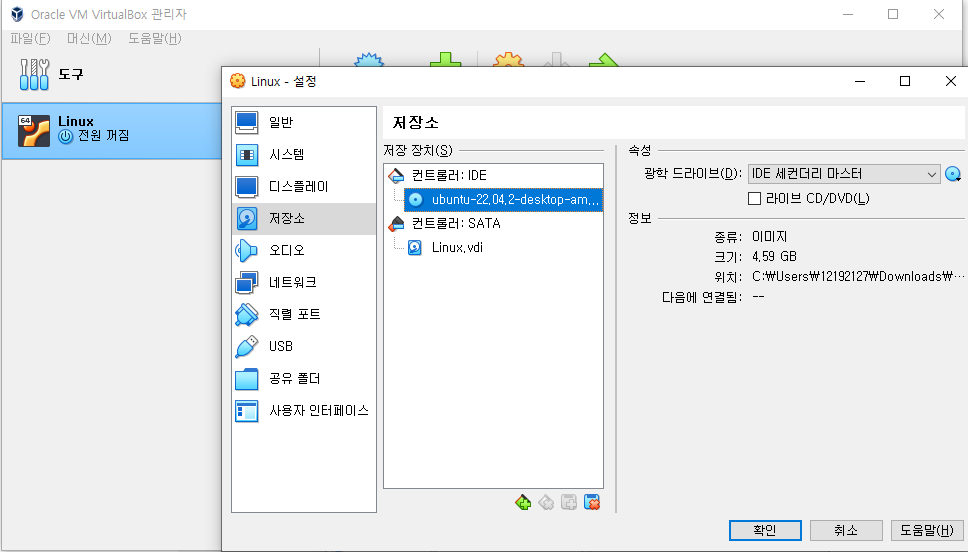

# Linux Command-Line - 명령어 기초

# Linux Virtual Environment

- Virtual Box, Ubuntu Linux 설치 및 실행
    - Linux 환경 설정을 위해 Virtual Box와 Ubnuntu를 설치한다. Virtual Box를 통해 Ubuntu OS가 작동한다.
    - Virtual Box에서 머신 - 새로 만들기를 통해 Linux 머신을 설정한 후 , 다운로드 한 Ubuntu OS를 로딩해서 설치한다.
        
        
        
    - 설치 과정 중의 설정은 특별히 건드릴 일은 없다. 설치 완료 시 Virtual Box에서 사용자 이름 인식이 잘 되는지 확인하자.
        
        
        

# Linux Terminal Command

- 리눅스 터미널 실행
    
    
    
    - 좌측 하단 App을 통해 터미널에 진입할 수 있다.
        
        
        
    - Prompt 창은 로그인 한 사용자 이름 / 컴퓨터 이름 /  현재 있는 위치로 이루어진다.
    - pwd 명령어를 통해 현재 위치를 확인할 수 있다.
    - date를 통해 현재 시간을 확인할 수 있다.
    - cal을 통해 현재 월을 확인할 수 있다.
        
        
        
    - cal [년도] 를 통해 현재 년도를 확인할 수 있다.
    - clear를 통해 prompt 창을 지운다
    - history를 통해 입력한 명령어들을 확인한다.
        
        
        
- 리눅스 명령어 구조
    
    
    
    - command 구조는 위와 같은 구조로 이루어져있다. (Option은 생략 가능)
        
        
        
    - 주의할 점은 리눅스는 대소문자를 구분하기에, 명령어의 대소문자가 다르다면 인식이 되지 않는다.
- 리눅스 명령어 메뉴얼 사용하기
    - 리눅스 명령어는 man 명령어와 help 명령어를 통해 명령어에 대해 확인할 수 있다.
    - man 명령어의 option으로 확인하고 싶은 명령어(Ex; ls, directory)를 입력하는 방식으로 수행한다.
        
        
        
    - man 명령어를 통해 확인이 불가능할 경우에는 help 명령어를 사용 해 보자.
- 리눅스 명령어 인풋과 아웃풋
    
    
    
    - Redirectrion은 명령어 input, output, error를 파일로 만들거나 다른 곳으로 보내는 것.
        
        
        
        
        
    - cat 1> [파일이름]명령어를 통해 Input에 대한 Output을 파일로 만들어 저장할 수 있다. (Standard Output Redirection)
    - 단, Redirection은 동일한 파일의 이름이 있을 경우 덮어쓰기를 수행한다. 추가를 하기 위해선 오른쪽 부등호를 두 번 입력한다.
        
        
        
    
    
    
    - Error Redirection은 1 대신 2를 입력한다.
        
        
        
        
        
    - 덮어쓰기와 값의 추가는 Standard Output Redirection과 동일
    - Standard Input Redirection은 아래와 같은 명령어로 사용한다.
        
        
        
    - 응용하여, Input으로 읽은 메시지를 Standard Output Redirection으로 파일로 내보낼 수 있다.
        
        
        
    - 하나의 커맨드 창에서 다른 커맨드 창으로 Redirection 역시 가능하다.
        
        
        
- 파이핑 명령어 사용하기
    
    
    
    - 파이핑 명령어는 하나의 명령어의 결과로 다음 명령어를 수행하는 방식을 반복하는 명령어를 말한다.
        
        
        
    - |  를 사용해 각각의 명령어를 연결할 수 있다. 단, tee 명령어를 입력하지 않을 경우, Output Redirection 시 다음 명령어로 연결이 되지 않는다.
        
        
        
        
        
    - tee 명령어를 추가할 경우, file로 Redirection을 한 후 다음 명령어를 계속해서 읽는다.

# Linux File System

- 리눅스 파일시스템 알아보기
    
    
    
    - cd 명령어를 이용 Directory 이동이 가능하다.
        
        
        
    - -a Option을 통해 ls 명령어에서 숨김 파일도 이동 가능하다.
- 파일/폴더 생성, 삭제, 복사, 이동 및 수정
    - 파일의 이동은 cd 명령어를 통해 사용한다.
    - 파일 및 폴더의 생성 및 삭제는 touch, mkdir, rm 명령어를 사용한다.
        
        
        
    - cp 명령어를 통해 파일을 복사한다.  cp [파일이름][다른이름]을 하면 파일 이름을 다른이름으로 변경하여 저장 가능하다.
    - 폴더 역시 cp - r 명령어를 통해복사 가능하다.
    - mv 명령어를 통해 파일 이름을 변경할 수 있다.
    - 폴더 이름도 mv 명령어를 통해 변경할 수 있다.
        
        
        
- Nano를 사용하여 파일 수정하기
    
    
    
    - nano 명령어를 통해 파일을 편집 및 수정할 수 있다. 하단의 명령어를 통해 파일 편집기 안에서 사용 가능한 명령어를 확인 할 수 있다.
        
        
        
- 파일 찾기 Find 명령어
    
    
    
    - find 명령어를 통해 현재 Directory로부터 파일 탐색이 가능하다. -type 등의 옵션 지정이 가능하다.
        
        
        
    - -exec 명령어를 통해 find로 찾은 파일들에 대해 명령이 가능하다.
        
        
        
    - {}은 모든 파일의 의미를 가진다. 즉, 위 명령어는 현재 Directory로부터 파일 타입인, 100K 이상 5M 이하인 모든 파일을 찾은 뒤, copy_here 라는 위치의 폴더에 해당하는 모든 파일을 복사하라는 명령어가 된다.
- 파일 내용 검색을 위한 grep 명령어
    - find와 달리 grep 명령어는 파일 안의 내용물을 탐색한다.
        
        
        
        
        
    - -i를 통해 대소문자 구분 없이 검색 가능하다.
        
        
        
    - -v를 통해 포함되지 않은 문장도 검색 가능하다.
    - grep은 필터처럼 사용 가능하다.
        
        
        
- File Archiving And Compression
    - tar -c 명령어를 통해 파일을 .tar 파일로 Archiving할 수 있다.
        
        
        
    - Archiving을 해제하는 명령은 -x 옵션을 통해 수행한다.
        
        
        
    - Archiving과 압축은 다르다. Archiving은 용량이 줄어들지 않으며, 여러 개의 파일을 하나의 파일로 모아서 관리한다에 가깝다.
    - 파일의 압축은 gzip, bzip, zip 명령어를 사용한다.
        
        
        

# Task Automation

- Bash 스크립트 생성 및 사용 하기
    - Bash 스크립트는 nano 명령어를 통해 생성하며, bash 명령어를 통해 실행한다.
        
        
        
    - Bash 스크립트는 아래와 같은 형식으로 작성한다.
        
        
        
    - 이후 bash 명령어를 시행 시 해당 스크립트 안의 명령어들이 수행된다.
- 자동 스케줄링을 위한 Crontab사용 하기
    
    
    
    - crontab -e 명령어를 통해 crontab에 진입, 일정 시간마다 작동하는 프로그램을 설정할 수 있다. Scheduler와 유사하며, 실행 방식은 위에서 보는 방식으로 작동한다.

[수료증](Linux_Command-Line-명령어_기초/1140493-325534-11705552.pdf)