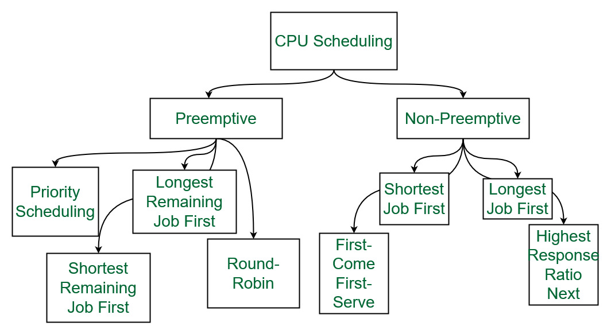

# Scheduling Algorithm

# Definition

- CPU 스케줄링 알고리즘은 한 프로세스가 CPU를 사용하는 동안 다른 프로세스는 I/O 등의 자원을 사용할 수 없어 대기하도록 함으로써 CPU를 최대한 활용할 수 있도록 하는 프로세스다.
- CPU 스케줄링의 목적은 다음과 같다.
    - 최대 CPU 활용도(CPU utilization)
    - CPU 요금 할당(Fare allocation of CPU)
    - 최대 처리량(Maximum throughput)
    - 최소 처리 시간(Minimum turnaround time)
    - 최소 대기 시간(Minimum waiting time)
    - 최소 응답 시간(Minimum response time)
- CPU가 유휴 상태가 될 때마다 운영 체제는 실행 준비가 된 라인의 프로세스 중 하나를 선택해야 한다. 선택 프로세스는 임시(CPU) 스케줄러에 의해 수행된다. 스케줄러는 시작할 준비가 된 메모리 프로세스 중에서 선택하고 그 중 하나에 CPU를 할당한다.
- 실행을 완료하는 프로세스에는 CPU 시간과 I/O 시간이 모두 필요하다. 다중 프로그래밍 시스템에서는 하나의 프로세스가 CPU를 사용하는 동안 다른 프로세스는 I/O를 기다리고 있을 수 있지만, 단일 프로그래밍 시스템에서는 CPU가 이 시간에 유휴 상태이므로 I/O를 기다리는 데 소요되는 시간이 완전히 낭비된다. 다중 프로그래밍은 프로세스 스케줄링을 사용하여 달성할 수 있다.
- 프로세스 스케줄링을 통해 OS는 각 프로세스에 CPU 시간을 할당할 수 있다. 프로세스 스케줄링을 통해 CPU를 항상 바쁘게 유지함으로써 프로그램에 대한 응답 시간을 줄일 수 있다.
- 문맥 교환(Context Switching)을 통해 CPU는 여러 프로그램을 번갈아 사용할 수 있다. 이 때 필요한 프로그램을 선택하는 방식이 바로 스케줄링이다.
- CPU 스케줄링의 주요 기능은 CPU가 유휴 상태일 때마다 OS가 즉시 사용 가능한 라인에서 사용 가능한 프로세스 중 하나 이상을 선택했는지 확인하는 것에 있다.
- 다중 프로그래밍 환경에서 장기 스케줄러가 여러 I/O 바인딩 프로세스를 선택하면 대부분의 경우 CPU는 유휴 상태로 유지된다. 이로 인해 자원 활용도를 향상시킬 수 있다.
    - 대부분의 운영 체제는 활동(Performance) 상태에서 대기(Waiting) 상태로 전환되면 시스템에 오류가 발생할 가능성이 있다. 따라서 이러한 과잉을 최소화기 위해 OS는 스케줄링을 통해 CPU를 최대한 활용하고 교착 상태 가능성을 피하기 위해 작업을 예약한다.
- 스케줄링 알고리즘의 주요 용어는 다음과 같다.
    - 도착 시간(Arrival Time) : 프로세스가 준비 대기열에 도착하는 시간
    - 완료 시간(Completion Time) : 프로세스가 실행을 완료하는 시간
    - 버스트 시간(Burst Time) : CPU 실행을 위해 프로세스에 필요한 시간
    - 반환 시간(Turn Around Time) : 완료 시간과 도착 시간의 차이
    - 대기 시간(Waiting Time) : 처리 시간과 버스트 시간의 차이
    - 처리량(Throughput) : 단위 시간당 실행을 완료하는 프로세스 수
- CPU 스케줄링은 선점(Preemptive), 비선점(Non-Preemptive)가 있다.

### Preemptive VS Non-Preemptive

- 선점형 스케줄링 알고리즘
    - 프로세스가 실행 상태에서 준비 상태로 전환되거나 대기 상태에서 준비 상태로 전환될 때 사용된다.
    - 리소스는 제한된 시간 동안 프로세스에 할당된 다음 제거되며, 프로세스에 여전히 버스트 시간이 남아 있는 경우 프로세스는 다시 준비 대기열에 배치된다.
    - 선점형 알고리즘에서는 프로세스에 우선순위가 할당된다.
    - 우선순위가 높은 프로세스가 들어올 때마다 CPU를 점유하고 있던 우선순위가 낮은 프로세스가 선점된다.
    - 즉, CPU를 해체하고 우선순위가 높은 프로세스가 실행을 위해 CPU를 사용한다.
    - 문맥 교환이 자주 일어나기에 오버헤드가 발생한다.
    - 프로세스가 한 번 실행될 때 제한된 시간을 할당한다. 그렇기에 프로세스가 작업을 수행하는 도중에 자원을 반납하고 대기 상태에 진입할 수 있다.
    - 프로세스 실행 중 인터럽트를 허용한다.
    - 우선순위에 따라 스케줄링을 하게 됨으로서 우선순위가 낮은 프로세스는 자원을 할당받지 못 하는 기아 현상(Starvation)이 발생할 수 있다.
    - 공유 자원에 접근하고 있는 프로세스가 여러 개 존재할 경우 관리 비용이 많이 소요된다.
    - 주요 알고리즘으로는 RR(Round Robin), Primitive, SRT, MLQ, MLFQ이 있다.
- 비선점형 스케줄링 알고리즘
    - 프로세스가 종료되거나 프로세스가 실행 중 상태에서 대기 상태로 전환될 때 사용된다.
    - 리소스가 프로세스에 할당되면 프로세스는 종료되거나 대기 상태에 도달할 때까지 CPU를 보유한다.
    - 프로세스를 선점할 수 없다.
    - 즉, 프로세스가 CPU에서 실행되면 문맥 교환이나 종료를 통해 해당 프로세스를 해제한다.
    - 하드웨어의 한계로 인해 사용하는 알고리즘 유형인 경우가 많다.
    - 필수적인 문맥 교환 외에 추가적인 오버헤드가 없다.
    - 프로세스가 종료되거나 I/O를 수행하기 위해 자발적으로 대기상태에 들어가지 않는 한 자원을 반납하지 않는다.
    - 인터럽트를 허용하지 않는다.
    - 수행시간이 긴 프로세스가 자원을 점유하게 되면 그 이후 실행되어야 할 프로세스가 기아 상태에 빠지게 된다.
    - 프로세스의 관리 비용에서 비교적 자유롭다.
    - 주요 알고리즘으로는 우선순위(Priority), 기한부(DeadLine), FCFS, SJF, HRN이 있다.
    
    | 매개변수 | 선점형 스케줄링 | 비선점형 스케줄링 |
    | --- | --- | --- |
    | 기본 | 리소스(CPU 사이클)는 제한된 시간 동안 프로세스에 할당된다. | 리소스(CPU 주기)가 프로세스에 할당되면 프로세스는 버스트 시간이 완료되거나 대기 상태로 전환될 때까지 이를 보유한다. |
    | 인터럽트 | 중간에 프로세스가 중단될 수 있다. | 프로세스가 자체적으로 종료되거나 시간이 다 될 때까지 프로세스를 중단할 수 없다. |
    | 기아 | 우선순위가 높은 프로세스가 Ready Queue에 자주 도착하는 경우 우선순위가 낮은 프로세스는 기아 상태가 될 수 있다. | 버스트 시간이 긴 프로세스가 CPU를 실행하는 경우 CPU 버스트 시간이 더 적은, 나중에 오는 프로세스가 중단될 수 있다. |
    | 오버헤드 | 프로세스를 예약하는 데 드는 오버헤드가 있다.
    
    잦은 문맥 교환으로 인한 오버헤드가 증가한다. | 컨텍스트 전환 빈도가 낮기 때문에 오버헤드가 줄어든다. |
    | 유연성 | 유연하다 | 엄격하다 |
    | 비용 | 관련 비용이 있다. | 관련 비용 없음 |
    | CPU 활용도 | 선점형 스케줄링에서는 CPU 사용률이 높다. | 비선점형 스케줄링에서는 낮다. |
    | 대기 시간 | 선제적 스케줄링 대기 시간이 적다. | 비선점형 스케줄링 대기 시간이 높다. |
    | 응답 시간 | 선제적 스케줄링 응답 시간이 더 짧다. | 비선점형 스케줄링 응답 시간이 높다. |
    | 의사결정 | 결정은 스케줄러에 의해 이루어지며 우선순위 및 시간 분할 할당을 기반으로 한다. | 결정은 프로세스 자체에서 이루어지며 OS는 프로세스의 지시를 따른다. |
    | 프로세스 제어 | OS는 프로세스 일정을 더 효과적으로 제어할 수 있다. | OS는 프로세스 스케줄링에 대한 통제력이 적다. |