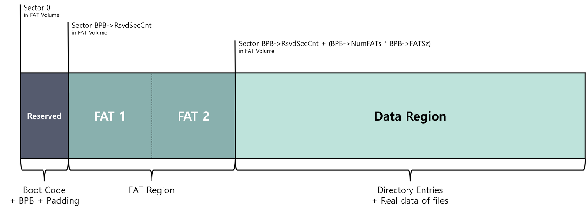

# File, File System

# FAT(File Allocate Table)

- MS에서 운영체제의 기본 파일 시스템으로 사용하기 위해 개발된 파일 시스템
    - 테이블을 사용하여 스토리지 볼륨의 클러스터를 추적하고 해당 클러스터가 관련 파일 및 디렉터리를 통해 서로 연결되는 방식을 추적하기 때문에 파일 할당 테이블이라는 이름이 붙여졌다.
    - 파일 이름을 디스크의 실제 위치에 매핑하는 테이블을 사용하여 장치에 있는 각 파일의 위치를 추적한다.
- 1993년 Windows NT 3.1 이후 NTFS로 기본 파일 시스템은 변경되었지만, USB 메모리 등에서 여전히 사용되고 있다.
- 비트의 개수에 따라 FAT12, FAT16, FAT32 등으로 나뉜다. 비트의 개수는 곧 표현 가능한 최대 클러스터 수이기도 하다.
- 시스템에 있는 파일의 인덱스를 제공하며 드라이브 포맷 시 정적으로 할당된다. 여기에는 각 클러스터(데이터 저장 영역)에 대한 항목이 포함된다.
    
    ### 구조
    
    - 부트 섹터 :
        - 볼륨의 레이아웃 및 파일 시스템 구조를 포함하여 볼륨에 액세스하기 위해 파일 시스템에 필요한 정보를 저장한다.
    - 파일 할당 테이블 :
        - 기본 할당 테이블과 기본 테이블에 액세스할 수 없는 경우 백업 역할을 하는 테이블의 복제본을 저장한다.
    - 루트 디렉터리 :
        - 볼륨에 저장된 파일과 폴더를 설명하는 항목이 포함된 디렉터리 테이블을 저장한다.
        - FAT12/FAT16의 경우 루트 디렉터리는 저장 매체의 지정된 위치(할당 테이블 바로 뒤)에 존재하며 최대 항목 수가 고정되어 있다
        - FAT32의 루트 디렉터리는 데이터 영역에 유지되며 최대 항목 수가 고정되어 있지 않다.
    - 파일 데이터 영역 :
        - 실제 저장된 파일 및 디렉터리 데이터를 저장한다
        - 볼륨의 대부분을 구성하는 클러스터로 나뉜다
        - 클러스터는 순차적으로 번호가 지정되며 할당 테이블의 목록에 해당한다.
- FAT가 파일을 관리하는 방법은 다음과 같다.
    - 파일이 생성되거나 저장되면 OS는 하나 이상의 클러스터를 파일에 할당하고 FAT의 해당 항목을 업데이트하여 이러한 클러스터가 현재 사용 중임을 나타낸다.
        - FAT의 첫 번째 항목은 디스크의 모든 파일과 디렉터리 목록이 포함된 디스크의 루트 디렉터리용으로 예약되어 있다.
    - 파일에 액세스하기 위해 OS는 FAT를 사용하여 파일의 첫 번째 클러스터를 찾은 뒤 FAT 항목의 포인터를 사용하여 파일을 구성하는 클러스터 체인을 따라 각 후속 클러스터를 찾는다.
        - 파일이 삭제되거나 이동되면 운영 체제는 FAT의 해당 클러스터를 사용 가능한 클러스터로 표시하여 새 파일에서 사용할 수 있도록 한다.
    - FAT는 사용 가능한 클러스터를 추적하고 필요에 따라 새 파일에 할당하여 디스크의 사용 가능한 공간을 관리하는 데 도움이 된다.
        - 파일이 저장되거나 수정되면 OS는FAT를 확인하여 파일을 보관할 수 있을 만큼 큰 무료 클러스터 시퀀스를 찾아 파일에 할당한다.
    
    ### 장점
    
    - 다양한 운영 체제와의 호환성
        - WIndows, Mac OS, Linux를 포함한 다양한 OS와 호환되는 널리 사용되는 파일 시스템이다.
        - FAT를 이용하여 서로 다른 컴퓨터와 장치 간 파일을 쉽게 공유할 수 있다.
    - 구현하기 쉬움
        - FAT는 다양한 유형의 저장 장치에서 구현하기 쉬운 비교적 간단한 파일 시스템이다.
        - 이로 인해 USB 드라이브 및 SD 카드와 같은 이동식 저장 장치에 널리 사용된다.
    - 대형 디스크 크기 지원
        - FAT는 대형 디스크 크기를 지원하며 FAT32 버전 기준 최대 2 테라바이트 크기의 디스크를 지원할 수 있다
    - 데이터 손상 위험 감소
        - FAT 파일 시스템은 저널링 메커니즘을 사용하여 정전이나 기타 시스템 충돌로 인한 데이터 손상 위험을 최소화한다.
    
    ### 단점
    
    - 조각화 문제
        - 파일이 생성, 삭제 및 수정됨에 따라 해당 파일이 차지하는 클러스터가 디스크 전체에 분산되어 조각화가 발생할 수 있다.
    - 제한된 보안 기능
        - FAT는 액세스 제어 및 파일 권한에 대한 지원이 제한되어 있어 무단 액세스 및 수정에 더 취약하다
    - 긴 파일 이름에 대한 제한적 지원
        - FAT12 기준으로는 최대 8글자 및 3글자의 확장자를 가진 짧은 이름만 지원한다.
        - FAT16 및 FAT36 기준으로는 더 긴 파일 이름을 지원하지만 여전히 파일 이름의 최대 길이 및 문자 집합 측면에서 제한 사항이 존재한다.

# NTFS(New Technology File System)

- MS에서 1993년 FAT를 대체하기 위해 개발한 독점 저널링 파일 시스템이다. Linux 및 BSD에서도 지원된다.
- 최대 파티션 크기는 약 2TB이며, 개별 파일에는 크기 제한이 없다.
- 특정 내용으로 구조체를 감싸는 포괄적인 데이터 구조체(Wrapper)를 사용하여 확장성을 제공한다.
    
    ### NTFS의 특징
    
    - USN Journal(Update Sequence Number Journal or Change Journal)
        - NTFS의 모든 파일 및 디렉터리의 변경 사항을 기록하는 로그 파일로 파일 이름, 변경 시간, 변경 타입 등 변경 사항에 대한 정보를 목록화하여 볼륨의 변경 여부를 확인할 때 사용한다.
    - ADS(Alternate Data Stream)
        - NTFS는 파일명, 소유자, 시간 정보 등을 속성(Attribute)이라는 스트림을 통해 표현하며, 데이터 역시 하나의 스트림으로 표현된다.
        - 일반적으로 파일 당 하나의 데이터 스트림을 사용하나, ADS는 하나의 파일이 하나 이상의 데이터를 저장할 수 있도록 지원하는 것이다.
    - Sparse 파일
        - 파일의 데이터가 대부분 0으로 채워져 있는 경우, 해당 파일의 내용을 그대로 저장하지 않고, 크기 정보만을 담는 파일을 말한다.
    - 파일 압축
        - NTFS는 파일 시스템 수준의 압축을 지원하며, 압축 방식으로는 LZ77을 사용한다.
        - 파일 압축은 공간을 절약하는데 많은 도움을 주지만, 파일이나 디렉터리에 접근할 때마다 압축을 풀어야 하므로 성능이 저하된다.
    - EFS(Encrypting File System)
        - EFS는 NTFS 상의 파일 및 디렉터리를 암호화하는 기능으로 CryptoAPI와 File System Run-Time Library(FSRTL)을 사용했으며, 빠른 암호화/복호화를 위해 FEK(File Encryption Key)를 통한 대칭키 방식으로 암호화한다.
    - VSS(Volume Shadow Copy Service)
        - 새롭게 덮여 쓰인 파일 및 디렉터리에 대해 백업 본을 유지하는 기능이다
        - 시스템 재부팅 과정에서 시스템의 저널 정보와 함께 안전한 복구를 도와준다.
    - Quotas
        - 다중 사용자를 지원하는 환경에서 각 사용자의 디스크 사용량을 제한하는 기능
        - 쿼터 기능이 설정된 시스템에서 자신에게 할당된 이상의 공간을 사용할 경우 경고메시지를 받는다
    - 유니코드 지원
        - 모든 파일, 디렉터리, 볼륨 이름 등을 지정할 때 유니코드를 사용한다
    - 동적 배드 클러스터 재할당
        - 배드 섹터가 발생한 클러스터는 사용할 수 없으므로, 새로운 클러스터를 할당해 정상 데이터를 자동으로 재할당한 클러스터에 복사하는 기법
        - 배드 섹터가 발생한 클러스터는 플래그를 통해 더 이상 사용하지 않도록 관리된다.
    
    ### NTFS의 구조
    
    - 파티션 부트 섹터
        - PBS라고도 하며 부트 정보를 보유한다.
    - 마스터 파일 테이블
        - MFT의 약자로 파일 이름, 생성 날짜, 액세스 권한, 크기 등을 포함하는 메타데이터를 저장하는 디렉터리다
    - 메타 파일
        - 파일 시스템을 정의 및 구성하고, 중요한 파일 시스템 데이터를 백업하고, 파일 시스템 변경 사항을 버퍼링하고, 여유 공간 할당을 관리하고, 메타데이터를 보다 효율적으로 구성하는 데 도움이 된다.
    - 데이터 영역
        - 파티션 또는 외장 드라이브에 파일 및 데이터를 저장하는 단위

# ext(EXTended file system)

- Linux에서 미닉스 파일시스템을 기반으로 개발된 파일 시스템이다.
- ext 파일 시스템은 크게 Boot Sector와 Block Group으로 구분된다. 블록은 기본적으로 데이터를 저장하는 단위를 나타내며, 저장 장치에서 한 번의 I/O 과정에서 수행하는 단위가 된다.
- ext 파일 시스템은 ext, ext2, ext3, ext4가 지원된다.
    - 최초 ext 파일 시스템에는 별도 액세스(Separate access), 아이노드 수정(inode modification), 데이터수정 타임스탬프(data modification time stamps)에 대한 지원이 없었으나, ext2 파일시스템 이후 해당 문제는 해결되었다.
    - ext3 이후, 저널링(journaling) 기능의 추가로 파일 시스템의 복구 가능성을 높였다.
        
        
        | 특징 | Ext2 | Ext3 | Ext4 |
        | --- | --- | --- | --- |
        | 도입일 | 1993년 1월 | 2001년 11월 | 불안정판 : 2006년 10월안정판 : 2008년 10월 |
        | 도입 운영체제 | 리눅스 | 리눅스 2.4.15 | 불안정판 : 리눅스 2.6.19안정판 : 2.6.28 |
        | 파티션 ID | MBR : 0x83GPT : EBD0A0A2-B9E5-4433-87C0-68B6B72699C7 | MBR : 0x83GPT : EBD0A0A2-B9E5-4433-87C0-68B6B72699C7 | MBR : 0x83GPT : EBD0A0A2-B9E5-4433-87C0-68B6B72699C7 |
        | 디렉터리 구조 | - | - | Linked List, Hashed B-tree |
        | 파일 구조 | Bitmap(여유 공간), Table(메타데이터) | Bitmap(여유 공간), Table(메타데이터) | extents, Bitmap |
        | 불량블록 구조 | Table | Table | Table |
        | 최대 파일 크기 | 16GB - 2TB | 16GB - 2TB | 16TB |
        | 최대 파일 수 | 1018 | 가변 | 40억 |
        | 최대 파일이름 길이 | 255 Byte | 255 Byte | 256Byte |
        | 최대 볼륨 크기 | 2TB - 32TB | 2TB - 16TB | 1EiB |
        | 날짜 사용권한 | 수정, 특성, 수정, 접근 | 수정, 특성, 수정, 접근 | 수정, 특성, 수정, 접근, 삭제, 작성 |
        | 날짜 범위 | 1901.12.14 - 2038.01.18 | 1901.12.14 - 2038.01.18 | 1901.12.14 - 2515.04.25 |
        | 날짜 정밀도 | 1초 | 1초 | 나노초 |
        | 파일 시스템 권한 | POSIX | 유닉스 허가, 접근제어 리스트, 임의 보안 특성 | POSIX |
        | 압축 지원여부 | 지원하지 않음 (패치를 통해 사용가능) | 지원하지 않음 (비공식 패치를 통해 사용가능) | 지원하지 않음 |
        | 암호화 지원여부 | 지원하지 않음 | 지원하지 않음 (블록 장치 수준에서 제공됨) | 지원하지 않음 |
        | 운영 체제 | 리눅스, BSD, Windows(IFS), OS X(IFS) | 리눅스, BSD, Windows(IFS) | 리눅스, Windows(Ext2fsd) |

# HFS(Hierarchical File System)

- 일련의 폴더와 하위 폴더를 통해 컴퓨터의 디지털 정보를 정렬하고 구성하는 데 사용된다.
- 모든 데이터를 포함하는 가장 큰 단위를 일반적으로 “루트”라고 하며 메뉴 상단 또는 파일 경로의 가장 왼쪽 항목으로 시각화할 수 있다.
- 데이터 포크와 리소스 포크라는 두 가지 구조를 지원한다.
    - 데이터 포크의 데이터는 파일에 대한 오프셋을 통해 액세스된다.
    - 리소스 포크는 실행 가능한 코드와 아이콘, 메뉴, 사운드 등의 프로그램 요소를 보관하는 미니 데이터베이스처럼 작동한다.

# **APFS(APple File System)**

- 스토리지 시스템의 데이터를 구성하고 구조화하기 위한 독점 시스템으로, Mac에서 사용되던 HFS+ 시스템을 대체하여 Apple에서 개발되었다.
- 암호화를 염두에 두고 설계한 전매 파일 시스템이다. 플래시/SSD 저장 장치에 최적화되어 있다
- 강력한 암호화, COW 메타데이터, 공간 공유, 파일 및 디렉토리 복제, 스냅샷, 빠른 디렉토리 크기 조절, 원자적 안전 저장 프리미티브 및 향상된 파일 시스템 구조를 제공한다.
- I/O 합병을 사용하는 고유의 COW 설계로 데이터 신뢰성을 지키면서도 성능이 확보된다.
    
    ### 주요 기능
    
    - 클론
        - 추가 공간을 사용하지 않고도 거의 즉시 파일을 복사할 수 있다.
        - 한 위치에서 다른 위치로 파일을 비트 단위로 복사하는 대신 복제본은 원본 파일을 참조하여 두 파일 간에 동일한 데이터 블록을 공유한다
        - 하나의 파일을 변경하면 변경된 데이터 블록만 새 복제본에 기록되고, 원본과 복제본은 모두 변경되지 않은 데이터 블록을 계속 공유한다.
    - 스냅샷
        - 특정 시점을 나타내는 볼륨 스냅샷을 생성할 수 있다.
        - 스냅샷을 사용하면 효율적인 백업이 가능하며, 특정 시점의 상태로 돌아갈 수 있다
        - 스냅샷은 원본 볼륨과 해당 데이터에 대한 읽기 전용 포인터다
        - 새 스냅샷은 원래 볼륨에 대한 포인터를 지정하는 데 필요한 공간 외에는 실제 공간을 차지하지 않는다.
    - 암호화
        - APFS는 AEX-XTS 또는 AES-CBC 모드를 사용하여 강력한 전체 디스크 암호화를 지원한다
        - 파일과 메타데이터가 모두 암호화되며, 지원되는 암호화 방법은 일반(암호화 없음), 단일 키 방식, 다중 키 방식이 지원된다.
    - 공간 공유
        - 공간 공유를 통해 파티션 크기를 미리 정의할 필요가 없다
        - 대신 모든 볼륨은 드라이브의 기본 여유 공간을 공유한다
        - 공간 공유를 통해 드라이브의 여러 볼륨을 다시 분할할 필요 없이 필요에 따라 동적으로 늘리거나 줄일 수 있다
    - Copy-On-Write
        - 데이터 보호 체계로, 변경 사항이 없는 한 데이터 구조를 공유할 수 있게 해 준다.
        - 변경이 요청(쓰기)되면 원본이 그대로 유지되도록 새로운 고유 복사본이 만들어진다.
        - 쓰기가 완료된 후에야 파일 정보가 최신 데이터를 가리키도록 업데이트된다.
    - Atomic Safe-Save
        - 기록 중 복사 개념과 유사하지만 파일이나 디렉터리 이름 바꾸기 또는 이동과 같은 모든 파일 작업에 적용된다.
        - 정전이나 CPU 문제 등 어떤 이유로든 쓰기가 완료되지 않더라도 원본 파일은 그대로 유지되게 할 수 있다
    - Sparse 파일
        - 비스파스(non-sparse) 파일 시스템에서는 저장할 준비가 된 데이터가 없더라도 파일 공간을 미리 예약해야 하는 것과 달리, 스파스 파일 시스템에서는 필요할 때만 파일 공간을 늘릴 수 있다.
    
    ### HPS+ 와 비교
    
    |  | Mac OS 확장(HFS+) | Apple 파일 시스템(ApFS) |
    | --- | --- | --- |
    | 할당 블록 수 | 2 32 (40억) | 2 63(9경) |
    | 파일 ID | 32비트 | 64비트 |
    | 최대 파일 크기 | 2 63바이트 | 2 63 바이트 |
    | 타임스탬프 세분성 | 1 초 | 1 나노초 |
    | 기록 중 복사 |  | ✅ |
    | 충돌 방지 | 저널링 | ✅ |
    | 파일 및 디렉터리 복제 |  | ✅ |
    | 스냅샷 |  | ✅ |
    | 공간 공유 |  | ✅ |
    | 기본 암호화 |  | ✅ |
    | 스파스 파일 |  | ✅ |
    | 빠른 디렉토리 크기 조정 |  | ✅ |