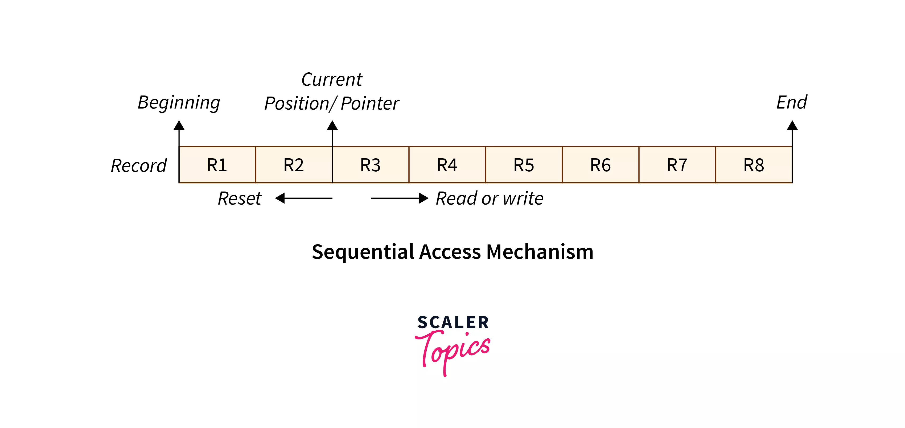

# File Access Methods

# 순차적 접근(Sequential Access)

- 가장 간단한 접근 방법이다. 파일의 정보는 한 레코드씩 순서대로 처리된다. 가장 일반적인 방식이며, 편집기와 컴파일러가 순차적 접근 방식을 사용한다.
- 파일을 한 단어씩 읽은 뒤 파일의 기본 주소에 연결되는 포인터가 만들어진다.
    - 사용자가 파일의 첫 번째 단어를 읽을 때 포인터는 이를 사용자에게 제공하고 그 값을 다음 단어로 올린다.
    - 위 절차가 파일이 완료될 때까지 계속된다.
    - 쓰기 작업의 경우 메모리를 할당하고 포인터를 파일 끝으로 이동한다.
- 파일의 데이터는 파일에 나타나는 순서대로 평가되므로 순차 접근 메커니즘을 사용하여 파일 데이터에 쉽고 간단하게 접근할 수 있다.
- 구현하기 매우 쉬우며, 다음 항목에 빠르게 접근할 수 있도록 사전식 순서를 사용한다.
    - 특정 순서로 파일의 모든 레코드에 액세스해야 하는 애플리케이션에 적합하다
    - 데이터가 무작위가 아닌 순차적으로 기록되므로 데이터 손상 가능성이 적다
    - 필요한 데이터만 읽고 불필요한 데이터를 읽지 않기에 대용량 파일에 효율적인 방법이다
    - 데이터가 순차적으로 저장되고 필요한 경우 쉽게 복원할 수 있으므로 백업 및 복원 작업을 위한 안정적인 방법이다
- 다음에 접근해야 하는 파일 레코드가 현재 레코드 옆에 없으면 속도가 느리다
    - 새 레코드를 삽입하려면 상당한 양의 파일을 이동해야 할 수도 있다
    - 특정 레코드에 대한 빠른 접근이 허용되지 않는다. 특정 기록을 찾기 위해선 전체 파일을 순차적으로 검색해야 한다
    - 파일이 자주 업데이트 되는 응용 프로그램에는 적합하지 않다.
    - 레코드의 길이가 다양한 경우 순차 접근으로 인해 저장 공간이 낭비될 수 있다.

# 직접 접근(Direct Access)

- 프로그램이 레코드를 빠르게 읽고 쓸 수 있도록 하는 고정 길이 논리 레코드다.
- 특별한 순서는 없으며 디스크는 모든 파일 블록에 대한 무작위 접근을 허용하므로 직접 접근은 파일의 디스크 모델을 기반으로 한다.
- 직접 접근의 경우 파일은 번호가 매겨진 블록 또는 레코드의 시퀀스로 간주된다.
- 직접 접근 파일에 대한 읽기 및 쓰기 순서에는 제한이 없다.
- 사용자가 OS에 제공하는 블록 번호는 일반적으로 상대 블록 번호이며, 첫 번째 상대 블록 0부터 1씩 증가한다.
- 파일에 즉시 접근할 수 있어 평균 접근 시간이 단축되며, 블록에 접근하기 위해 그 앞의 블록을 모두 탐색할 필요가 없다.
- 일반적으로 데이터베이스 애플리케이션에서 사용한다.

# 인덱스 순차 방식(Index Sequential Method)

- 순차 접근 방식의 상위에 구축된 파일에 접근하는 또 다른 방식이다.
- 파일에 대한 색인을 구성하며, 색인에는 다양한 블록에 대한 포인터가 포함되어 있다.
- 파일에서 레코드를 찾으려면 먼저 색인을 검색한 다음 포인터를 사용하여 파일에 직접 접근한다.
- 색인 테이블이 적절하게 배열되어 있다면 레코드에 매우 빠르게 접근할 수 있다.
- 파일의 어느 위치에나 빠르게 레코드를 추가할 수 있다
- 다른 파일 접근 방법과 비교할 때 비용이 많이 들고 효율성이 떨어진다
- 추가 저장 공간이 필요하다.

# 상대 기록 접근(Relative Record Access)

- 상대 레코드 접근은 파일 포인터의 현재 위치를 기준으로 레코드에 접근하는 파일 접근 방법이다.
- 특정 주소나 키 값이 아닌, 현재 레코드를 기준으로 한 위치를 기준으로 레코드를 탐색한다
- 개별 기록에 접근하는 데는 효율적이지만 특정 기록에 대한 무작위 접근이나 빈번한 업데이트가 필요한 파일에는 적합하지 않을 수 있다.
- 상대 레코드 접근에는 고정 길이 레코드가 필요하며 일부 애플리케이션에서는 유연성이 충분하지 않을 수 있다.
- 특정 순서로 레코드를 처리하거나 순차적으로 접근 되는 파일에 유용하다
    
    ### 장점
    
    - 무작위 접근
        - 상대 레코드 접근을 통해 파일의 레코드에 무작위로 접근할 수 있다.
        - 시스템은 파일 포인터의 현재 위치에서 특정 오프셋에 있는 모든 레코드에 접근할 수 있다
    - 효율적인 검색
        - 시스템은 현재 레코드와 건너뛰어야 하는 모든 레코드만 읽으면 되므로 개별 레코드에 접근할 때는 상대 레코드 접근이 순차 접근보다 효율적이다
    - 순차적 처리에 유용
        - 상대 레코드 접근은 특정 순서로 레코드를 처리하는 데 유용하다
        - 레코드가 특정 순서로 정렬된 경우 시스템은 파일 포인터의 현재 위치를 기준으로 다음 또는 이전 레코드에 접근할 수 있다
    
    ### 단점
    
    - 고정 레코드 길이
        - 상대 레코드 접근에는 고정 길이 레코드가 필요하다.
        - 레코드의 길이가 다양한 경우 각 레코드의 길이가 동일하도록 패딩을 사용해야 할 수도 있다
    - 제한된 유연성
        - 상대 레코드 접근은 그다지 유연하지 않다
        - 다른 레코드의 상대적 위치를 방해하지 않고 파일 중간에 레코드를 삽입하거나 삭제하는 것은 어렵다
    - 제한된 적용
        - 상대 레코드 접근은 순차적으로 또는 어느 정도 규칙적으로 접근 되는 파일에 적합하지만 자주 업데이트 되거나 특정 레코드에 대한 무작위 접근이 필요한 파일에는 적합하지 않을 수 있다.

# 콘텐츠 주소 지정 가능 접근(Content Addressable Access)

- 주소가 아닌 콘텐츠를 기반으로 레코드나 블록에 접근할 수 있도록 하는 파일 접근 방법이다
- 해시 함수를 사용하여 각 레코드나 블록에 대한 고유 키를 계산하고, 시스템은 해당 키를 지정하여 모든 레코드나 블록에 접근할 수 있다
- 각 레코드나 블록에는 해시 함수를 사용하여 생성된 고유 키가 있다
- 키는 위치나 주소가 아닌 레코드나 블록의 콘텐츠를 기반으로 계산된다.
    
    ### 장점
    
    - 효율적인 검색
        - 레코드나 블록의 내용을 기반으로 효율적인 검색을 허용하므로 대규모 데이터베이스나 파일 시스템을 검색하는 데 이상적이다
    - 유연성
        - 레코드나 블록을 쉽게 삽입하고 삭제할 수 있으므로 다른 접근 방법보다 더 유연하다
    - 데이터 무결성
        - 각 레코드나 블록에 해당 콘텐츠를 기반으로 생성된 고유 키가 있으므로 데이터 무결성을 보장한다
    
    ### 단점
    
    - 오버헤드
        - 각 레코드나 블록에 대해 해시 함수를 계산해야 하므로 추가 오버헤드가 필요하다
    - 충돌
        - 두 개의 레코드나 블록이 동일한 키를 가질 수 있는 경우 충돌 가능성이 있다
        - 좋은 해시 함수를 사용하면 최소화할 수 있지만, 완전히 없앨 수는 없다
    - 제한된 키 공간
        - 키 공간은 사용되는 해시 함수의 크기에 따라 제한되며 이로 인해 충돌 및 기타 문제가 발생할 수 있다