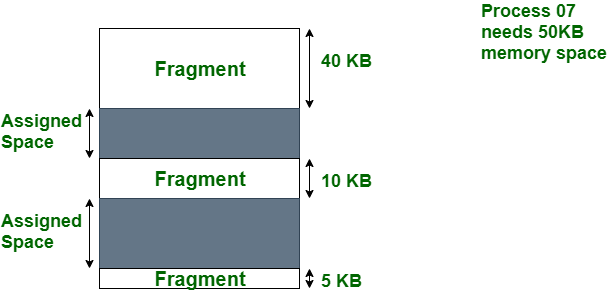

# Fragmentation

# 정의

- 메모리의 여유 공간(Fragments)은 프로세스가 물리적 메모리 블록에서 로드되거나 언로드될 때마다 생성된다.
- 단편화는 스토리지 공간이 비효율적으로 사용되어 용량이나 성능, 그리고 종종 두 가지 모두를 감소시키는 현상이다.
- 단편화의 정확한 결과는 사용 중인 저장소 할당 시스템과 단편화 형태에 따라 달라진다.
- 대체로 단편화로 인해 저장 공간이 낭비되며, 이 경우 단편화라는 용어는 낭비된 공간 자체를 의미하기도 한다.
- 프로그램이 시스템에 메모리 블록을 요청할 때 블록은 청크(chunks)로 할당된다.
    - 프로그램이 청크 작업을 마치면 해당 청크를 다시 시스템에 해제하여 추후 다른 프로그램이나 동일한 프로그램에 할당할 수 있도록 한다.
    - 프로그램이 청크를 보유하는 크기와 시간은 다양하며, 수명(life-cycle) 동안 컴퓨터 프로그램은 많은 메모리 청크를 요청하고 해제할 수 있다.
    - 프로그램이 시작되면 여유 메모리 영역은 길고 연속적이지만, 시간이 지남에 따라, 그리고 사용함에 따라 긴 연속 영역은 점점 더 작은 연속 영역으로 단편화된다. (청크의 할당과 해제로 인해)
- 단편화에는 외부 단편화, 내부 단편화, 데이터 단편화가 있다.

# 외부 단편화(External Fragmentation)

- 메모리가 프레임워크 전체에 분산된 작은 여유 공간 블록으로 분리되어 더 큰 인접 메모리 블록을 프로세스에 배포하기 어렵게 만드는 현상을 말한다.
- 메모리 분할은 일정 시간이 지난 후 프로세스의 할당 및 할당 해제로 인해 발생한다.
- 프로세스가 쌓이고 메모리에 덤프됨에 따라 프로세스 사이에 간격이 발생하고 단편화가 발생한다.
- 단편화는 메모리 할당 및 할당 해제의 동적 특성으로 인해 발생한다.
    - 프로세스는 메모리에 쌓이고 추후, 일반적으로 필요하지 않을 때 전달되므로 프로세스 사이에 간격이 남는다.
    - 장기적으로 이러한 구멍이 모여서 분할될 수 있으므로, 메모리가 여러 개의 작은 세그먼트로 분리된다.
- 외부 단편화는 본질적으로 메모리를 프로세스에 동적으로 할당하고 메모리 요구 사항이 변화하는 시스템에 영향을 미친다.
- 외부 단편화의 주요 원인은 다음과 같다.
    - 원인
        - 가변적인 프로세스 크기
            - 컴퓨터 프레임워크의 프로세스에는 메모리 전제 조건이 변경되는 경우가 많다.
            - 프로세스가 스택되어 메모리에 덤프됨에 따라 분배된 메모리 블록의 크기가 대조될 수 있다.
            - 이로 인해, 할당된 메모리 블록 간에 크기가 변동하는 구멍이 발생한다.
        - 메모리 할당 및 할당 해제
            - 프로세스가 메모리에 쌓이면 특정 메모리 블록을 소유한다.
            - 따라서 프로세스가 완료되거나 종료되면 관련된 메모리 블록이 여유 메모리 풀로 다시 전달된다.
            - 그러나 전달된 메모리 블록이 인접하지 않을 경우 동적 메모리 블록 사이에 구멍이 생길 수 있다.
            - 시간이 지나면 구멍이 늘어나 새로운 프로세스에 배포할 단일 메모리 블록을 찾기 어려워질 수 있다.
        - 비균일 메모리 릴리스
            - 다른 메모리 할당과 일치하지 않는 방식으로 방전 메모리(Discharge memory) 블록을 처리하는 경우 예측할 수 없는 크기의 구멍이 형성될 수 있다.
        - 메모리 할당 방법론
            - 최적 또는 최악 적합과 유사한 일부 메모리 할당 절차는 조각화를 악화시킬 수 있다.
        - 고정 분할
            - 메모리가 고정 크기 할당으로 분리되는 고정 분할이 있는 프레임워크에서는 프로세스에 세그먼트 크기와 정확하게 일치하지 않는 크기의 메모리가 필요한 경우 외부 분리가 발생할 수 있다.
            - 이는 내부 불연속성을 유발할 수 있다.
        - 높은 프로세스 회전율
            - 정기적인 프로세스 스태킹(Stacking) 및 덤핑을 사용하는 프레임워크는 외부 불연속성에 대해 더 무방비하다.
            - 프로세스가 빠르게 쌓이고 제거되는 시점에서 메모리에 공백이 남아 조각화에 기여할 수 있다.
- 외부 단편화는 OS의 전시(exhibition) 및 메모리 관리에 영향을 미칠 수 있다.
    - 메모리 사용량 감소, 확정된 할당 실망(Disappointments), 느린 메모리 액세스
- 외부 단편화는 일반적으로 메모리 압축과 페이징을 통해 개선한다.

# 내부 단편화(Internal Fragmentation)

- 잘못된 메모리 할당으로 인해 발생하는 문제로 메모리가 낭비된다.
- 프로세스가 시스템에 로드되면 작업에 필수적인 메모리를 요청하는데, OS는 작업할 프로세스에 메모리를 할당하지만 메모리가 프로세스 요구 사항보다 작거나 커지면 추가 공간은 사용되지 않는다.
- 이 작은 양의 메모리 미활용이 OS에 나타나는 주요 내부 단편화다
- 프로세스가 작업을 위해 메모리를 요청하면 대부분의 시스템은 고정된 크기의 블록이나 페이지에 메모리를 할당하는데, 이 때 대부분의 경우 할당되는 메모리 블록은 프로세스에서 요청한 메모리의 양보다 크다. 이것이 내부 단편화가 발생하는 주요 원인이 된다.
- 일부 경우에서는 메모리를 요청하는 모든 프로세스에 일정한 양의 메모리가 할당되는데, 일정한 양보다 적은 양의 메모리를 요청/요구하는 프로세스는 결국 상당한 양의 할당된 메모리를 낭비하게 된다. 이 역시 내부 단편화의 원인 중 하나다.
- 내부 단편화로 인해 발생하는 영향은 다음과 같다.
    - 비효율적인 메모리 활용
    - 성능 지연
    - 메모리의 붕괴
    - 가상 메모리 관리의 문제점
- 내부 단편화를 방지하는 방법은 다음과 같다.
    - 가변 크기 할당 블록
    - 동적 메모리 할당

# 차이점 비교

| NO | 내부 단편화 | 외부 단편화 |
| --- | --- | --- |
| 1. | 내부 단편화에서 고정 크기 메모리는 처리하도록 지정된 블록의 제곱 단위다. | 외부 단편화에서는 가변 크기 메모리 블록이 지정된 크기의 사각형을 사용한다. |
| 2. | 내부 단편화는 메서드나 프로세스가 메모리보다 작을 때 발생한다. | 외부 단편화는 메서드나 프로세스가 제거될 때 발생한다. |
| 3. | 내부 단편화의 해결책은 최적의 블록(Best-fit)이다 . | 외부 단편화에 대한 해결책은 압축과 페이징이다 . |
| 4. | 내부 단편화는 메모리가 고정된 크기의 파티션으로 분할될 때 발생한다 https://www.geeksforgeeks.org/fixed-or-static-partitioning-in-operating-system/ | 외부 단편화는 메모리가 프로세스 크기에 따라 가변 크기 파티션으로 분할될 때 발생한다. |
| 5. | 할당된 메모리와 필요한 공간 또는 메모리의 차이를 내부 단편화라고 한다. | 연속되지 않은 메모리 조각 사이에 형성된 사용되지 않은 공간은 너무 작아서 새로운 프로세스를 제공할 수 없다. 이를 외부 단편화라고 한다. |
| 6. | 내부 단편화는 페이징 및 고정 파티셔닝에서 발생합니다. | 외부 단편화는 분할 및 동적 분할을 통해 발생합니다 . |
| 7. | 프로세스 요구 사항보다 큰 파티션에 프로세스를 할당할 때 발생한다. 남은 공간으로 인해 시스템 성능이 저하된다. | 이는 필요한 메모리 공간과 정확히 동일한 더 큰 파티션에 프로세스를 할당할 때 발생한다. |
| 8. | Worst-Fit 메모리 할당 방식에서 발생합니다 . | 이는 Best-Fit 과 First-Fit메모리 할당 방식에서 발생합니다. |