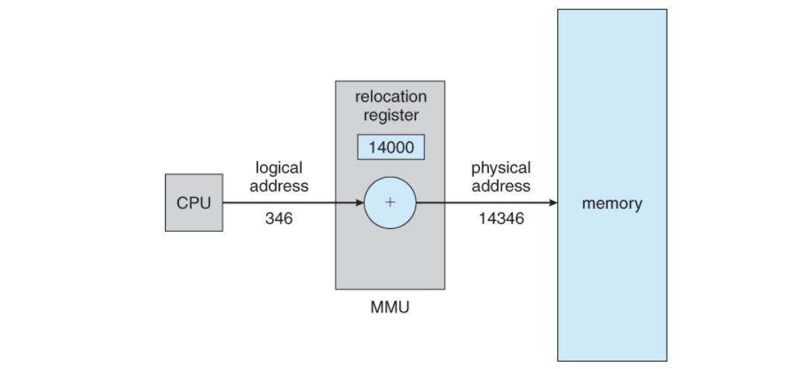

# MMU

# 정의

- MMU는 프로세서와 관련된 모든 메모리 및 캐싱 작업을 처리하는 컴퓨터 하드웨어 구성 요소이다. 메모리 관리의 모든 측면을 담당한다.
- 일반적으로 프로세서에 통합되어 있지만 일부 시스템에서는 별도의 IC를 차지한다.
- 모든 데이터 요청 입력은 MMU로 전송되며 MMU는 데이터를 RAM 또는 ROM 저장소에서 검색해야 하는지 여부를 결정한다.
- MMU는 하드웨어 메모리 관리, OS 메모리 관리, 애플리케이션 메모리 관리의 세 가지 주요 기능을 수행한다.
    - 하드웨어 메모리 관리
        - 시스템의 RAM 및 캐시 메모리 관리 및 규제
    - OS 메모리 관리
        - 개체와 데이터 구조 간의 리소스 조절
    - 애플리케이션 메모리 관리
    - 프로그램 간에 메모리를 할당하고 최적화(종료된 작업에서 확보된 메모리 공간 재활용)
- 일반적으로 TLB 연관 캐시를 통해 가상 페이지 번호를 실제 페이지 번호로 변환한다.
- 프로그램이 실제 메모리에 없는 페이지의 위치를 참조하는 경우 OS에 인터럽트를 발생시킨다.
    - 그 뒤 OS는 메모리에서 덜 사용되는 블록을 선택하고, 읽은 후 수정된 경우 백업 스토리지에 기록하고, 백업 스토리지에서 해당 블록으로 페이지를 읽어 MMU를 설정하여 매핑한다.
    - 프로그램이 사용할 수 있도록 원래 요청한 페이지를 차단하는 역할도 한다.

# 역할

- 메모리 배포
    - 일반적으로 시스템 프로세스가 실행되기 전과 후에 시스템 요구 사항을 가장 잘 충족할 수 있는 위치로 메모리 리소스를 이동한다
- 모니터링
    - 모든 메모리 리소스를 추적
- 능률
    - 주 메모리와 기타 메모리 리소스 절약
- 시스템 무결성
    - 메모리 조각화(Segmentation) 및 불량 메모리 할당 가능성 감소
- 데이터 무결성
    - 데이터 무결성이 유지되도록 보장
- 데이터 위험
    - 데이터 손상 위험을 최소화
- 비용 조정
    - 메모리 관련 비용을 절감

# 장점

- MMU는 메모리 보호(Memory Protection)을 사용하여 페이지 오류에 따른 소프트웨어 버그를 방지할 수 있다.
    - OS는 MMU의 메모리 보호 기능을 사용하여 특정 프로그램이 메모리에 액세스하는 것을 차단함으로써 잘못된 프로그램으로부터 보호할 수 있다.
- 페이징된 MMU를 통해 메모리의 외부 조각화(Segmentation) 문제를 완화한다.
    - 메모리 블록이 할당되고 해제된 후 여유 메모리는 조각화되어 가장 큰 연속 여유 메모리 블록이 전체 양보다 훨씬 작을 수 있다.
    - 가상 메모리를 사용하여 연속된 가상 주소 범위를 여러 개의 비연속적인 메모리 블록에 매핑함으로써 외부 조각화 문제를 완화할 수 있다.
    - 단, 위와 같은 페이징 매핑은 내부 단편화 문제를 야기할 수 있다.