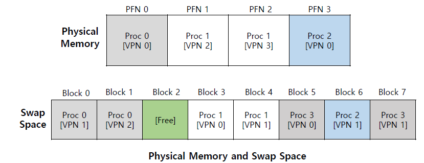

# Swapping

# 정의

- 현재 사용하지 않는 메모리 내용을 디스크로 스와핑하여 다른 응용 프로그램이나 프로세스에서 사용할 수 있도록 하는 메모리 회수 방법.
- 메모리의 정확한 상태 또는 페이지가 디스크에 복사되어 데이터를 연속적으로 만들고 나중에 쉽게 복원할 수 있다.
    - 요구사항에 따라 물리적 메모리와 가상 메모리 사이를  효율적으로 전환할 수 있다.
    - 우선순위 기반 선점형 스케줄링이 사용된다.
- 메모리 스와핑은 OS 커널이나 (가상화 환경의 경우) 하이퍼바이저에 의해 수행된다.
- 기본적으로 메모리 스와핑 프로세스는 물리적 RAM이 완전히 소모되고 추가 프로세스와 애플리케이션 실행을 위해 공간이 필요한 경우 수행된다.
    - 운영체제(혹은 하이퍼바이저)는 이를 자동으로 관리하고, 물리 메모리 공간을 스왑 공간에 매핑해 가상 메모리 용량(비물리적 RAM)을 형성한다.
        - 스왑 공간 : 하드 드라이브에 저장된 가상 메모리 조각
- 스와핑의 기본적인 목표는 컴퓨터 하드웨어가 실제로 보유하는 것보다 더 많은 사용 가능한 메모리를 활성화하는 것에 있다.
- 시스템에서 메모리 스와핑을 수행해야 하는 애플리케이션이 많아질수록 오버헤드 증가로 인해 성능이 느려진다.

# 장점

- 최대 메모리 활용도
    - 스와핑을 통해 메모리를 확보하고 더 많은 애플리케이션을 원활하게 작동할 수 있다.
    - 스왑 파일은 각 프로그램이 자체 전용 메모리를 갖도록 보장하여 전반적인 성능을 향상시킨다
- 지속적인 운영
    - 우선순위 기반 프로세스 스케줄링에서는 우선순위가 낮은 활동을 우선순위가 높은 프로세스로 대체하여 운영 중단을 최소화하는 스와핑 방법을 사용할 수 있다.
- 시스템 최소화
    - 스와핑을 통해 CPU는 많은 작업을 동시에 수행할 수 있으므로 대기 시간이 줄어들 수 있다.
    - 결과적으로 단일 메인 메모리에서 많은 프로세스를 제어하기가 더 수월해진다
- 향상된 멀티태스킹
    - 더 많은 프로그램이 동시에 실행되고 RAM을 효과적으로 사용할 수 있도록 하여 멀티프로그래밍 수준을 높이는 데도 도움이 된다.

# 한계

- 성능
    - 메모리 스와핑으로 인해 실행되는 경우 디스크 저장 공간은 프로세스 실행에 사용되는 실제 RAM과 동일한 성능을 제공할 수 없다
- 디스크 제한 사항
    - 저장 매체의 안정성과 접근성은 시스템 메모리만큼 안정적이지 않을 수 있는 파일을 교환하는 데 도움이 된다.
- 용량
    - 운영 체제 또는 하이퍼바이저에 할당된 스왑 공간은 스왑할 수 있는 메모리 양을 제한한다
- 정보 손실
    - 집중적인 교환 중 컴퓨터의 전원이 꺼질 경우 사용자는 모든 프로그램 관련 정보를 잃을 수 있다
- 페이지 오류 증가
    - 스와핑 기술이 수준 이하인 경우 복합 방법을 사용하면 더 많은 페이지 오류가 발생하여 처리 속도가 느려질 수 있다.