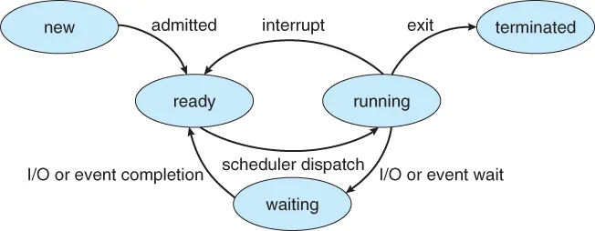

# Process

# Definition

- 하나 이상의 스레드에 의해 실행되는 컴퓨터 프로그램의 인스턴스다
- 프로세스는 프로세스를 추적할 수 있도록 특정 데이터 집합이 연결되어 실행되는 프로그램이다.
- 대부분의 경우 하나의 프로그램에는 하나의 프로세스가 연결되어 있다.

# State

- 생성부터 완료까지 프로세스는 다양한 상태를 거친다. 일반적으로 프로세스는 실행 중 5가지 상태 중 하나로 나타낼 수 있다.
    
    
    
    - New
        - 운영 체제가 주 메모리에 불러올 준비가 된 프로세스가 포함된다.
    - Ready
        - 실행할 준비가 되어 있고 현재 시스템의 주 메모리에 있는 프로세스가 포함되어 있다.
        - 운영 체제는 보조 메모리의 프로세스를 주 메모리(RAM)으로 가져온다.
        - 해당 프로세스는 주 메모리에 존재하며 CPU에 할당되기를 기다린다.
    - Running
        - 현재 시스템의 CPU에 의해 실행되는 프로세스가 포함된다.
    - Waiting(Block)
        - 프로세스는 running 상태에서 block으로 전환되거나 scheduling 알고리즘에 따라 또는 프로세스의 내부 동작으로 인해 대기(waiting) 된다.
    - Termination
        - 실행이 완료된 프로세스는 종료 상태가 된다.
        - 해당 프로세스(PCB)의 모든 내용도 운영 체제에 의해 삭제된다.

# Logic

- 주로 컴퓨터 시스템이나 소프트웨어에서 프로세스의 동작 및 제어를 설명하는 논리적인 구성 요소를 의미한다.
- 주로 다음과 같은 문맥에서 사용된다.
    
    ### Process Management
    
    - 운영 체제에서는 프로세스 관리를 통해 운영체제는 여러 프로세스를 동시에 실행하고 관리한다.
    - 프로세스 관리는 프로세스 생성, 종료, 일시 중단, 병합 및 우선순위 조절과 같은 작업을 포함하며, 이러한 작업을 제어하기 위한 논리가 Process Logic
    
    ### Program Flow
    
    - 소프트웨어 프로그램에서는 프로그램 실행 흐름을 제어하는 부분이다.
    - 조건문, 반복, 함수 호출 및 제어 구조를 사용하여 프로그램이 특정 조건에서 어떻게 동작해야 하는지를 정의한다.
    
    ### Multi-threading
    
    - 멀티스레드 프로그래밍에서는 다중 스레드가 동시에 실행되므로 각 스레드 간의 실행 순서와 데이터 공유를 제어해야 하는데, 이 역할이 Process Logic
    
    ### Synchronization and Concurrency
    
    - 여러 프로세스 또는 스레드 간의 동기화와 병행성을 관리하는 논리도 Process Logic에 포함된다. 이는 경쟁 조건과 데드락과 같은 문제를 방지한다.
    
    ### Data Processing and Algorithms
    
    - 데이터 처리 알고리즘에서 프로세스 로직은 데이터를 입력에서 출력으로 변환하는 방법을 정의하는 데 사용된다.

# Context Switching

- 문맥 교환은 CPU가 멀티태스킹 환경에서 여러 프로세스 간에 전환할 수 있도록 하는 운영 체제의 중요 개념이다.
- 문맥 교환이 발생하면 운영 체제는 CPU Register의 내용과 기타 관련 정보를 OS의 PCB에 저장하여 현재 프로세스의 Context를 저장한다. 그 뒤 CPU는 자유롭게 다른 프로세스를 실행할 수 있고 운영 체제는 PCB에서 다음 프로세스의 저장된 Context를 불러온다.
- PCB에는 프로세스를 관리하는 데 필요한 모든 정보가 포함되어 있으며 프로세스가 일시 중지되거나 선점 되면 운영 체제는 PCB를 업데이트하여 현재 상태와 Resource를 반영한다.
- PCB를 사용한 문맥 교환은 복잡하고 Resource 집약적인 작업이므로 운영 체제에서 프로세스를 최적화하여 overhead를 최소화하고 시스템 성능을 향상시키는 것이 중요하다.
- 최신 운영 체제는 정교한 알고리즘과 데이터 구조를 사용하여 PCB를 관리하고 문맥 교환에 필요한 시간과 Resource를 최소화한다.

# IPC(Inter-Process Communication)

- 프로세스가 서로 통신하고 작업을 동기화할 수 있도록 하는 메커니즘
- 프로세스는 공유 메모리, 메시지 전달의 두 가지 방식으로 서로 통신할 수 있다.
    
    ### Shared memory
    
    
    
    - 프로세스가 일부 변수를 공유해야 하며 이는 전적으로 프로그래머가 구현하는 방법에 따라 달라진다.
    - 여러 프로세스가 공통 공유 메모리에 액세스 할 수 있으며 공유 메모리를 통해 통신한다.
    - 한 프로세스는 한 번에 변경 사항을 적용하고 다른 프로세스는 변경 사항을 확인한다.
    - 커널을 사용하지 않는다.
        - 제한된 버퍼에서 생산자와 소비자가 공통 메모리를 공유한 경우의 sudo 코드
            
            ```cpp
            #include <iostream>
            #include <mutex>
            #include <thread>
            #include <vector>
             
            #define buff_max 25
            #define mod %
             
            struct item {
              // different member of the produced data
              // or consumed data   
              // ---------
            };
             
            // An array is needed for holding the items.
            // This is the shared place which will be 
            // access by both process  
            // item shared_buff[buff_max];
             
            // Two variables which will keep track of
            // the indexes of the items produced by producer
            // and consumer The free index points to
            // the next free index. The full index points to
            // the first full index.
            std::atomic<int> free_index(0);
            std::atomic<int> full_index(0);
            std::mutex mtx;
             
            void producer() {
              item new_item;
              while (true) {
                // Produce the item
                // ...
                std::this_thread::sleep_for(std::chrono::milliseconds(100));
                // Add the item to the buffer
                while (((free_index + 1) mod buff_max) == full_index) {
                  // Buffer is full, wait for consumer
                  std::this_thread::sleep_for(std::chrono::milliseconds(100));
                }
                mtx.lock();
                // Add the item to the buffer
                // shared_buff[free_index] = new_item;
                free_index = (free_index + 1) mod buff_max;
                mtx.unlock();
              }
            }
             
            void consumer() {
              item consumed_item;
              while (true) {
                while (free_index == full_index) {
                  // Buffer is empty, wait for producer
                  std::this_thread::sleep_for(std::chrono::milliseconds(100));
                }
                mtx.lock();
                // Consume the item from the buffer
                // consumed_item = shared_buff[full_index];
                full_index = (full_index + 1) mod buff_max;
                mtx.unlock();
                // Consume the item
                // ...
                std::this_thread::sleep_for(std::chrono::milliseconds(100));
              }
            }
             
            int main() {
              // Create producer and consumer threads
              std::vector<std::thread> threads;
              threads.emplace_back(producer);
              threads.emplace_back(consumer);
             
              // Wait for threads to finish
              for (auto& thread : threads) {
                thread.join();
              }
             
              return 0;
            }
            ```
            
    
    ### Messaging Passing
    
    
    
    - 프로세스가 어떤 종류의 공유 메모리도 사용하지 않고 서로 통신한다.
    - 두 프로세스간 통신은 다음과 같이 진행된다.
        - 통신 링크 설정 (이미 존재하는 경우 다시 설정할 필요 없음)
        - 기본 primitives를 사용하여 메시지 교환 시작
            - 최소 두개의 기본 요소 필요
                - send(메시지, 대상) 또는 send(메시지)
                - receive(메시지, 호스트) 또는 receive(메시지)
    - 메시지 크기는 고정된 크기이거나 가변적인 크기일 수 있다.
    - 크기가 고정되면 OS 설계자에게는 쉽지만 프로그래머에게는 복잡하며, 가변 크기라면 프로그래머에게는 쉽지만 OS 설계자에게는 복잡하다
    - 표준 메시지는 헤더와 본문의 두 부분으로 구성될 수 있다.
        - 헤더 : 메시지 유형, 대상 ID, 소스 ID, 메시지 길이 및 제어 정보 저장
            - 제어 정보에는 버퍼 공간 부족 시 수행 방법, 시퀸스 번호, 우선 순위 등의 정보가 포함된다.
    - 메시지는 일반적으로 FIFO 스타일을 사용하여 전송된다.
    - Message Link의 구현 참고
        
        [Inter Process Communication (IPC) - GeeksforGeeks](https://www.geeksforgeeks.org/inter-process-communication-ipc/)