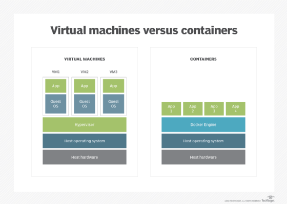

# Container

# 정의

- 컨테이너는 배포용 애플리케이션을 가상으로 패키지하고 격리할 수 있는 소프트웨어 유형이다.
- 애플리케이션의 코드와 종속성을 함께 패키징하여 애플리케이션이 모든 컴퓨팅 환경에서 안정적으로 실행되도록 한다.
- 컨테이너는 가상 머신 없이 OS 커널에 대한 액세스를 공유한다. 소규모 마이크로서비스, 대규모 애플리케이션 또는 경량 컨테이너 OS를 실행하는 데 사용될 수 있다.
- 컨테이너 기술은 시스템 컨테이너화와 애플리케이션 컨테이너화로 나뉜다. 두 스타일 모두 기본 인프라에서 애플리케이션 코드를 추상화하여 버전 관리를 단순화하고 다양한 배포 환경에서 이식을 가능하게 한다.
    - 애플리케이션 컨테이너
        - Docker가 대표적으로, OS에서 실행될 애플리케이션의 파일, 종속성 및 라이브러리를 캡슐화한다.
        - 사용자는 여러 독립 애플리케이션 또는 단일 애플리케이션을 구성하는 여러 서비스에 대해 별도의 컨테이너를 만들고 실행할 수 있다.
    - 시스템 컨테이너
        - LXC가 대표적으로, 기술적으로 애플리케이션 컨테이너 및 VM과 유사하다.
        - OS가 VM에서 캡슐화되어 실행되는 방식과 마찬가지로 OS를 실행할 수 있다.
        - 단, 시스템 컨테이너는 시스템의 하드웨어를 에뮬레이트하지는 않으며, 대신 애플리케이션 컨테이너와 유사하게 작동한다.
        - 사용자는 다양한 라이브러리, 언어 및 시스템 데이터베이스를 설치할 수 있다.

# 주요 특징 및 개념

- 가상화(Virtualization)
    - 컨테이너는 OS 수준의 가상화를 사용하여 애플리케이션을 격리된 환경에서 실행한다.
    - 이는 호스트 시스템에 설치된 OS의 커널을 공유하면서도 각각의 컨테이너가 자체 파일 시스템과 프로세스 공간을 보유할 수 있도록 한다.
- 이식성(Portability)
    - 컨테이너는 의존성과 환경 설정을 포함하여 애플리케이션을 패키지화한다.
    - 이로써 애플리케이션은 어디에서든 실행될 수 있으며, 개발 환경에서 프로덕션 환경으로 쉽게 전이할 수 있다.
- 경량(Lightweight)
    - 컨테이너는 가상 머신보다 경량이며 빠르게 시작되고 중지된다.
    - 이는 가상 머신과 달리 각 컨테이너가 고유한 OS를 실행하지 않기 때문이다.
- 이미지(Image)
    - 컨테이너는 이미지로 패키지된다. 이미지는 실행 가능한 애플리케이션을 만들기 위해 필요한 모든 것을 포함하고 있다
    - Docker 이미지의 경우, 컨테이너 실행을 위한 파일 시스템, 코드, 라이브러리 및 종속성 등이 포함된다.
- 격리(Isolation)
    - 각 컨테이너는 다른 컨테이너와 격리되어 하나의 컨테이너에서 발생한 문제가 다른 컨테이너에 영향을 미치지 않는다
    - 이는 응용 프로그램 간의 충돌을 방지하고 보안을 강화한다

# 작동 방식(Docker 기준)

- 이미지 빌드
    - 도커 파일 작성
        - 개발자는 컨테이너를 어떻게 빌드할지 정의하는 도커 파일을 작성한다.
        - 도커 파일은 베이스 이미지, 애플리케이션 코드, 의존성, 환경 설정 등을 정의한다.
    - 도커 이미지 빌드
        - 도커 파일을 사용하여 도커 이미지를 빌드한다.
        - 이미지는 여러 계층(layer)으로 구성되며, 각 계층은 도커 파일의 각 단계에 해당한다.
- 이미지 실행
    - 도커 이미지 실행
        - 빌드된 도커 이미지를 사용하여 컨테이너를 실행한다.
        - 이때 컨테이너는 호스트 시스템의 운영 체제 커널을 공유하지만, 자체적인 파일 시스템과 프로세스 공간을 갖는다.
    - 컨테이너 격리
        - 각 컨테이너는 격리된 환경에서 실행된다.
        - 이는 호스트 및 다른 컨테이너에 영향을 미치지 않고 독립적으로 실행되도록 하는 중요한 특성이다.
- 리눅스 네임스페이스(Linux Namespaces)
    - PID 네임스페이스
        - 각 컨테이너는 자체 프로세스 ID 공간을 가진다.
        - 이로써 컨테이너는 다른 컨테이너나 호스트 시스템의 프로세스에 영향을 받지 않는다.
    - 망 네임스페이스
        - 각 컨테이너는 자체 네트워크 인터페이스, IP 주소, 라우팅 테이블을 가진다.
        - 따라서 각 컨테이너는 독립적인 네트워크 환경을 갖는다.
    - 마운트 네임스페이스
    - 각 컨테이너는 자체 파일 시스템을 가지며, 호스트 시스템과 다른 컨테이너에 대한 액세스를 격리한다.
- Cgroups(Control Groups)
    - 리소스 제한
        - 각 컨테이너는 CPU, 메모리, 디스크 I/O 등의 리소스에 대한 제한을 설정할 수 있다.
    - 우선 순위 지정
        - 리소스가 부족한 경우 각 컨테이너에 대한 우선 순위를 지정하여 리소스 할당을 관리한다.
- 도커 데몬
    - 도커 데몬은 컨테이너의 생성, 실행, 관리를 담당하는 백그라운드 프로세스다.
    - 도커 CLI(Command Line Interface)나 API를 통해 도커 데몬에 명령을 전달하여 컨테이너를 조작한다.
- 이미지 공유
    - 도커 이미지는 도커 레지스트리(Docker Registry)를 통해 저장 및 공유된다.
    - 개발자는 빌드한 이미지를 도커 허브와 같은 레지스트리에 업로드하거나, 다른 개발자들과 이미지를 공유할 수 있다.

# VM과의 비교

- 몇 가지 기본적인 유사점을 공유하지만, 컨테이너와 가상화는 가상화된 아키텍처가 하드웨어 시스템을 에뮬레이트한다는 점에서 다르다.
- 소프트웨어 계층은 가상화에서 풀링된 CPU, 메모리, 스토리지 및 네트워크 리소스의 하드웨어를 에뮬레이트하는 데 사용되며, 이는 여러 VM 인스턴스에서 여러 번 공유할 수 있다.
- 각 VM이 게스트 OS를 실행하기에 VM에는 메모리, 디스크, 네트워크 입/출력과 같은 상당한 리소스 오버헤드가 필요할 수 있다. 이는 VM이 컨테이너보다 클 수 있고, 생성하는 데 시간이 더 오래 걸릴 수 있음을 의미한다.
- 컨테이너는 OS 커널을 공유하므로 하나의 OS 인스턴스가 여러 개의 격리된 컨테이너를 실행할 수 있다. 컨테이너를 지원하는 OS는 VM용 OS보다 더 작고 기능도 더 적을 수 있다
- 기본 하드웨어를 가상화하는 것과 달리 컨테이너는 OS를 가상화하므로 각 개별 컨테이너는 애플리케이션, 해당 라이브러리 및 종속성만 보유한다. 컨테이너는 게스트 OS를 사용할 필요가 없으므로 VM보다 가볍다.