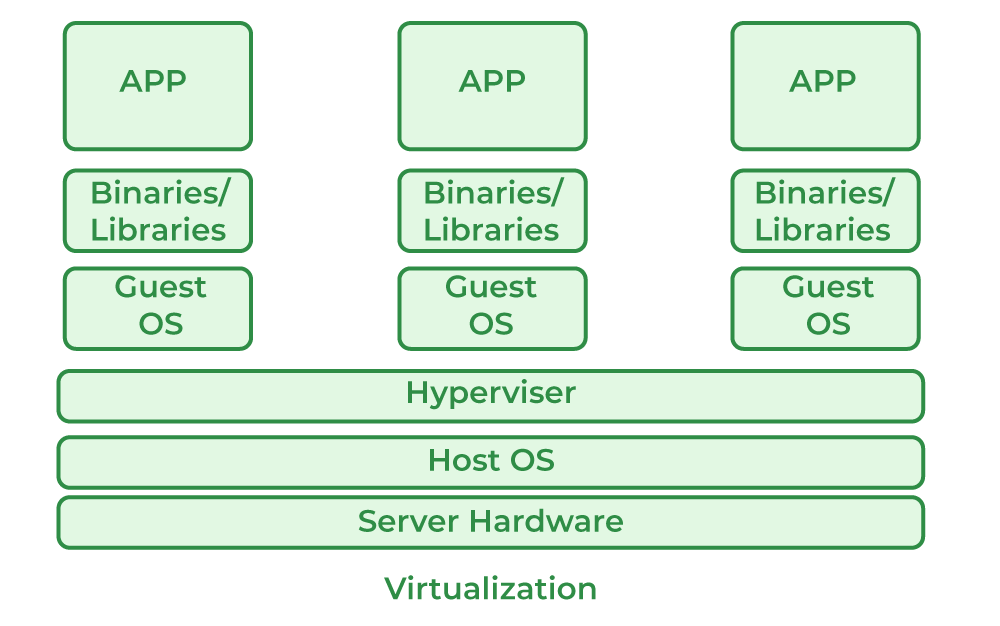

# Virtualization

# 정의

- 물리적으로 다른 시스템을 논리적으로 통합하거나 하나의 시스템을 논리적으로 분할해 자원을 사용하게 하는 기술
- 하드웨어 기능을 시뮬레이션하여 가상 시스템을 생성하는 소프트웨어를 사용한다. 이를 통해 단일 서버에서 여러 OS, 둘 이상의 가상 시스템 및 다양한 애플리케이션을 운영할 수 있다.
- OS 가상화는 하드웨어가 여러 OS 이미지를 동시에 실행할 수 있도록 소프트웨어를 사용하는 것이다.
- 가상화 기술의 주요 용도는 하이퍼바이저와 같은 소프트웨어 계층을 사용하여 기본 하드웨어를 에뮬레이트하는 서버 가상화이다. 여기에는 CPU 메모리, I/O, 네트워크 트래픽이 포함되는 경우가 많다.

# 작동 방식

- 하이퍼바이저가 물리적 환경에서 물리적 리소스를 분리한다
- 필요에 따라 물리적 환경에서 다양한 가상 환경으로 리소스를 가져오고 분할한다
- 시스템 사용자는 가상 환경 내에서 작업하고 계산을 수행한다
- 가상 환경에 실행되면 사용자나 프로그램이 물리적 환경에서 추가 리소스가 필요한 명령을 보낼 수 있다. 이에 대한 응답으로 하이퍼바이저는 메시지를 물리적 시스템에 전달하고 변경 사항을 저장한다.

# 목적

- Performance
    - IT 자원들을 하나의 풀로 묶어서 컴퓨팅 파워를 향상한다
- Scalability
    - 더 큰 애플리케이션, 트래픽, DB 지원
- Availability, Reliability, Resiliency
    - 데이터, 애플리케이션, 컴포넌트들의 다중 카피들을 생성하여 높은 가용성 확보
- Flexibility, Agility
    - 애플리케이션과 OS의 인스턴스들을 필요에 따라 빠르게 만들고 폐지
- Resource Optimization
    - 시스템의 물리적 재구성 없이 다양한 비즈니스 애플리케이션에 맞게 IT 자원들을 최적으로 구성

# 원리

- 공유(Sharing)
    - 물리적으로 위치한 자원을 사용자에게 나누어 사용할 수 있도록 한다.
    - 관련 기술 : 파티셔닝, VLAN
- 단일화(Aggregation)
    - 분산자원을 통합, 논리적 단순화를 통해 자원 활용 향상 및 관리 용이
    - 관련기술 : 클러스터링
- 에뮬레이션(Emulation)
    - 가상화로 인한 논리적 객체는 물리적인 객체와 동일한 기능을 수행한다
    - 관련 기술 : VTL, 에뮬레이터
- 절연(Insulation)
    - 물리적인 자원의 교체나 변경에도 서비스를 안정적으로 유지한다
    - 관련 기술 : RAID, HA, L4

# 유형

| 유형 | 요소 | 설명 |
| --- | --- | --- |
| 애플리케이션 가상화 | Service | - 실해오디는 기반 운영체제로부터 운용 SW를 캡슐화하는 기술
- 서비스하는 애플리케이션 단위 가상화 수행 |
| 서버 가상화 | OS 레벨 가상화 | - OS 단위 가상화 수행
    - 하나의 운영체제 환경 위에서, 복수의 운영체제 환경으로 분할, 지원하는 서버가상화 기술
    - OS에서 서버들을 가상화한다  |
| 서버 가상화 | 하이퍼바이저 | - H/W 상위 가상화 |
| 서버 가상화 | 컨테이너 | - 실행환경 포함 가상화 |
| 서버 가상화 | 도커 |  |
| 스토리지 가상화 | EMC | - EMC 기반 저장소 가상화 |
| 스토리지 가상화 | LUN | - Logical Unit Number 기반 |
| 스토리지 가상화 | SDS | - SW 주도의 스토리지 관리 |
| 데스크톱 가상화 | VDI | - PC 구성요소 가상화하여 중앙 서버 집중
- 원격에서 사용자 접속 사용하는 방식 |
| 네트워크 가상화 | SPN | - SW Driven NW 가상화

- 사용 가능한 대역폭을 채널로 분할하여 네트워크에서 사용 가능한 리소스를 결합하는 방법 

- 각 채널은 서로 독립적이며 특정 서버나 장치에 실시간으로 할당(또는 재할당)할 수 있다.  |

# 장점

- 비용 절감
    - 기존 하드웨어의 활용도를 극대화하고 추가 물리적 시스템이나 서버의 필요성을 줄일 수 있다.
    - 하드웨어 비용 절감뿐만 아니라, 하드웨어의 유지 관리 비용 역시 절감된다.
- 능률
    - 서로 다른 애플리케이션을 실행하기 위해 여러 개의 별도 서버를ㄹ 사용하는 대신 동일한 물리적 서버에 모두 수용된 서로 다른 가상 머신에서 여러 애플리케이션을 실행할 수 있다.
    - 이를 통해 IT 관리 작업이 줄어들고 기존 리소스의 활용도가 향상되며 전반적인 효율성이 향상된다.
- 유지 관리 감소
    - 단일 콘솔을 통해 여러 가상 머신을 관리할 수 있으므로 IT 관리 및 유지 관리에 필요한 비용이 감소한다
- 재해 복구
    - 비즈니스 연속성을 향상시키고 재해 복구를 더 쉽게 만든다.
    - 하드웨어에 장애가 발생할 경우 쉽게 복제하고 다른서버로 옮길 수 있으며, 백업을 신속하게 생성할 수 있다.
- 확장성과 유연성
    - 가상화를 사용하면 필요에 따라 가상 머신을 신속하게 생성하거나 제거할 수 있어 비즈니스의 변화하는 요구 사항에 대응하기 쉽다
- 더 나은 환경 발자국
    - 유지 관리 비용 절감에 따른 에너지 소비 감소와 환경적 관점에서 비즈니스에 도움이 된다.

# 단점

- 복잡성
    - 가상화는 업데이트 및 유지 관리 측면을 크게 단순화할 수 있지만 기술 자체의 구현은 복잡할 수 있다.
    - 특히, IT 리소스가 제한된 경우 더욱 그렇다
- 설치 비용
    - 가상화는 장기적으로 비용 절감으로 이어지는 경우가 많지만 초기 설정 및 구현 단계에는 비용이 많이 들 수 있다.
- 성능
    - 단일 서버에 너무 많은 가상 머신을 생성할 경우 서버에 과부하를 주지 않는 것이 중요하다. 너무 많은 서버를 생성할 경우 성능 문제를 야기할 수 있다
- 보안 위험
    - 가상화를 사용하려면 방화벽 및 침입 탐지 시스템과 같은 사이버 보안 조치를 구현해야 한다.
    - 장기적인 보안 검사도 필수이며 가상 머신이 손상될 경우 동일한 서버에 있는 다른 가상 머신도 영향을 받을 수 있다
- 상호의존성
    - 단일 물리적 서버에 의존하는 여러 가상 머신이 있는 경우 서버에 장애가 발생하면 해당 서버에 실행 중인 모든 가상 머신이 다운될 수 있다