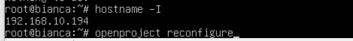

# OpenProject

# 설치 / 초기 설정

- Ubuntu 22.04.03-live-server-amd64 기준 OpenProject 설치
    1. apt-get update
        
        ```json
        sudo apt-get update
        ```
        
    2. apt-transport-https 설치
        
        ```json
        sudo apt-get install apt-transport-https ca-certificates wget
        ```
        
        - HTTPS 또는 HTTP 보안 프로토콜을 통해 저장소에 대한 액세스를 허용하는 패키지
    3. PGP key 가져오기
        
        ```json
        sudo wget -O /etc/apt/trusted.gpg.d/openproject.asc https://dl.packager.io/srv/opf/openproject/key
        ```
        
        - OpenProject package에 접근하기 위한 PGP key 가져오기
    4. OpenProject package 소스 추가
        
        ```json
        sudo wget -O /etc/apt/sources.list.d/openproject.list \
          https://dl.packager.io/srv/opf/openproject/stable/13/installer/ubuntu/22.04.repo
        ```
        
        - wget으로 package 소스 추가
    5. OpenProject install
        
        ```json
        sudo apt-get install openproject
        ```
        
- OpenProject 초기 설정
    1. cmd에서 openproject reconfigure 실행
        
        
        
    2. openproject edition = default 설정
        
        
        
        - BIM(Building Information Modeling)은 건설사 모델링 용 패키지로 default로 사용합니다.
    3. postgres/autoinstall = install 설정
        
        
        
        - Openproject 사용에 필요한 DB 정보로 PostgreSQL server를 설치할 수 있습니다.
        - skip시 데이터베이스에 연결하지 않으며, DATABASE_URL 환경 변수를 통해 수동으로 데이터베이스를 지정해야 합니다.
    4. server/autoinstall = install 설정
        
        
        
        - OpenProject는 내부 Ruby 애플리케이션 서버와 함께 제공되지만 이 서버는 포트 6000의 local 인터페이스에서만 수신 대기합니다. 외부 연결을 위해선 proxy 역할을 하는 웹 서버가 필요합니다.
        - 해당 옵션을 통해 역방향 proxy로 작동하도록 Apache2 웹 서버를 자동 설치할 수 있습니다.
        - skip을 통해 Apache2 웹 서버를 설치하지 않을 경우 별도의 Apache2나 Nginx 웹 서버를 설치하고 설정해야 합니다.
    5. server/hostname = 임의 설정
        
        
        
        - Apache VirtualHost인 정규화된 도메인(FQDN) 입력입니다.
        - DNS가 있을 경우에는 도메인을,
        - 없을 경우에는 Hypher-V의 linux 서버 호스트 아이디 (hostname -I로 확인 가능)를 입력합니다.
    6. server/server_path_prefix = 임의 설정
        
        
        
        - 서버 경로 접두어 설정이다. 공란으로 할 경우 5번의 hostname 만으로 접근합니다.
    7. server/ssl = no 설정
        
        
        
        - HTTPS 접근이 필요할 경우에만 yes를 지정한다. HTTP 접근은 no를 통해 가능합니다.
        - HTTPS 접근을 위해 yes를 지정할 경우, 아래의 별도 창을 통해
            - 절대 SSL 인증서 경로
                
                
                
            - 절대 SSL 개인 키 경로
                
                
                
            - 인증서에 대한 인증 기관 번들의 경로(선택 사항, 공란 가능)
                
                
                
        - 를 입력해야 합니다.
    8. repositories/api-key = 임의 설정
        
        
        
        - repository를 사용하기 위해 API key가 필요합니다.
        - 최초 대화창 생성 시 자동으로 생성되며, 필요시 변경하여 입력 가능합니다.
    9. repositories/svn-install = 임의설정
        
        
        
        - repository를 관리하기 위한 툴로 SVN이 필요할 경우 install을 통해 설치합니다.
        - SVN이 필요하지 않을 경우 skip으로 건너뛸 수 있습니다.
        - install을 지정 시, svn-path 입력이 필요합니다.
            
            
            
    10. repositories/apache-wrapper-token = 임의 설정
        
        
        
        - repository를 사용하기 위한 access key 설정입니다.
        - API key와 마찬가지로 임의 생성되며, 필요 시 변경 가능합니다.
    11. repositories/git-install = install 설정
        
        
        
        - repository로 git을 사용할 경우 install을 선택하여 설치 할 수 있습니다.
        - GIT이 필요하지 않을 경우 skip을 통해 건너뛸 수 있습니다.
        - install 시 git-path가 필요합니다.
        - 아래의 대화 창을 통해 git repository로 사용할 directory를 입력합니다.
            
            
            
    12. repositories/git-http-backend
        
        
        
        - git http backend CGI 디렉터리를 설정합니다.
    13. memcached/autoinstall = install 설정
        
        
        
        - OpenProject 인스턴스가 연결할 수 있는 로컬 memcached 서버를 설치한다.
        - install을 눌러 설치합니다.
        - 여러 공유 인스턴스를 구성하는 경우 같은 다른 caching 메커니즘이 필요하지 않다면 install이 권장된다.
    14. openproject/admin_email = 임의 설정
        
        
        
        - 최초 생성되는 관리자 계정의 이메일 주소를 입력합니다.
    15. openproject/default_language 설정 
        
        
        
        - 최초 설정 시에만 확인되며, 이후에는 별도로 지정해야 합니다.
    16. 이후 hostname -I 명령어로 확인된 IP로 접속 시 접근 가능합니다.

# 활용

- 프로젝트 생성
    1. 좌측 상단 프로젝트 선택을 클릭하여 프로젝트 검색, 목록, 생성 창을 활성화합니다. 
        
        
        
    2. 우측 하단의 + 프로젝트 버튼을 눌러 신규 프로젝트 생성 화면으로 이동합니다. 
        
        
        
        - 사전 정의된 템플릿이 있을 경우 템플릿을 지정할 수 있습니다.
        - 이름* 칸을 통해 프로젝트의 이름을 지정합니다.
        - 프로젝트가 다른 프로젝트의 하위 성질을 가지고 있을 경우, 하위 프로젝트를 지정할 수 있습니다.
        - 상위 프로젝트일 경우, x표를 눌러 지정된 상위 프로젝트를 제거할 수 있습니다.
            
            
            
        - 고급 설정을 통해 프로젝트에 대한 설명, 공용 프로젝트 여부(공용 시 모든 구성원이 확인 가능), 프로젝트 상태, 프로젝트 상태 설명을 지정할 수 있습니다.
        - 해당 설정은 프로젝트 생성 후 프로젝트 설정에서 다시 지정할 수 있습니다.
        - 템플릿을 사용했을 경우, 복사 설정이라는 별도의 메뉴가 확인 가능합니다.
            
            
            
        - 해당 기능은 원본이 되는 템플릿에서 메뉴들을 추가, 제거할 수 있습니다.
    3. 생성된 프로젝트는 좌측 상단의 목록을 통해 확인, 진입 가능합니다.
        
        
        
    4. 프로젝트 생성 후 프로젝트 설정의 모듈 메뉴에서 프로젝트에서 사용하는 메뉴를 지정할 수 있습니다. 
        
        
        
- TASK 생성
    1. TASK 추가를 위해 작업을 진행할 프로젝트에 들어갑니다.
        
        1-1. 프로젝트 설정의 작업 패키지 유형을 통해 활성화할 작업 패키지 유형을 선택합니다.
        
        
        
    2. 좌측 패널의 작업 패키지에 진입합니다.
        
        
        
    3. 원하는 viewer 형식을 선택합니다.
        
        
        
        1. 모두 열림 / 최근 활동 / 최근에 만듧 / 기한 지남 / 내가 만듦 / 내게 할당됨의 그리드 형식
            
            
            
        2. Gantt 차트
            
            
            
        3. 요약 
            
            
            
    4. 상단의 + 만들기 메뉴를 통해 신규 TASK를 생성할 수 있습니다.
        
        
        
        - 혹은, 그리드의 하단에 + 새 작업 패키지 만들기를 통해서도 간단하게 새로운 TASK를 생성할 수 있습니다.
    5. TASK 간 부모/자식 관계를 설정할 수 있습니다. 
        
        
        
        - 단, 부모/자식 관계 설정 시 부모 TASK의 시작/완료 날짜는 수동 스케줄링을 지정하지 않는 이상 최하위 자식 TASK에 종속됩니다.
            
            
            
        - 부모/자식 관계 설정은 그리드에서 대상 TASK를 우클릭 한 후 계층 내어쓰기, 팔로워 추가, 선행 단계 추가를 통해 설정할 수 있습니다.
    6. 생성된 TASK를 관리할 수 있습니다.
        - 생성된 TASK는 언제라도 상태를 변경할 수 있습니다.
        - TASK 그리드에서 보여지는 항목은 우측 톱니바퀴 모양을 통해 열 추가, 삭제, 순서 변경 등을 할 수 있습니다.
            
            
            
        - 개별 TASK는 그리드의 ID를 눌러 상세 페이지로 진입 가능합니다.
        - 페이지의 견적 및 시간, 세부 정보, 비용 등을 통해 프로젝트 전체의 TASK를 시간 및 비용 관리가 가능합니다.
- Wiki / 문서
    
    ### Wiki
    
    
    
    - Wiki는 프로젝트에 관련된 문서, 참고 자료 등을 저장하기 위해 사용되는 공간입니다.
    - 좌측 패널의 Wiki 탭을 통해 진입, 기존 Wiki를 읽거나 신규 Wiki를 작성할 수 있습니다.
    - 단순 텍스트, 첨부 파일, 표, Markdown 소스, Wiki간 부모 자식 관계 등을 관리할 수 있습니다.
    
    ### 문서
    
    - 문서는 카테고리를 통해 문서 간 종류를 지정할 수 있으며, 개별 문서 간 부모 자식 관계를 설정할 수 없다는 점을 제외하면 Wiki와 동일합니다.
        
        