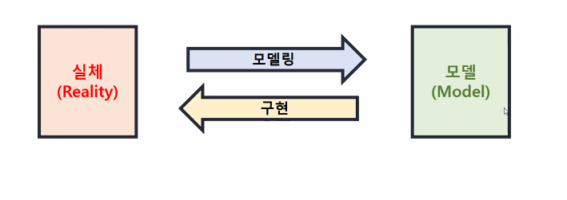

# Modeling

<aside>
💡 모델링의 목적은 결국 무결성과 성능 향상에 있다.

</aside>

# Orientation

- 모델링이란
    - 모델을 만드는 작업, 즉 현실 세계를 단순화 시켜 표현하는 기법.
        
        
        
    - 위의 그림에서 요구사항, 분석, 설게 단계가 모델링 단계.
    - 일종의 설계도라고 생각하면 된다.
        
        
        
    - 간략화된 관계도일 뿐, 요구사항 단계만 해도 추출, 분석, 명세화(문서화), 검증, 유지보수 단계로 복잡하다.
- 모델링의 주요 개념
    - 엔티티(Entity)
        - 업무의 관심 대상이 되는 정보를 가지고 있거나 그에 대한 정보를 관리할 필요가 있는 유형, 무형의 사물. (유형, 문형, 문서, 이력(이력과 내역), 코드) [개체, 테이블]
        1. 업무의 관심 대상이 되는 사물이어야 한다.
        2. 두 개 이상의 인스턴스를 소유해야 한다.
        3. 마땅한 속성을 소유해야 한다.
            
            
            
        - 다른 속성을 포함하고 있으면 엔티티, 엔티티에 포함되어 있으면 속성.
        - 엔티티 기술서:
            
            
            
        - 엔티티 리스트 :
            
            
            
    - 속성(Attribute)
        - 엔티티에서 관리해야 할 최소 단위 정보 항목. 엔티티는 하나 이상의 속성을 포함한다. [컬럼]
        1. 속성의 의미가 분명히 드러나게 작성해야 한다.
        2. 해당 업무에서 사용하는 이름을 부여할 것. 
        3. 서술식(수식어, 소유격)과 약어의 사용을 금한다.
        4. 엔티티에서 유일하게 식별 가능하도록 지정해야 한다. (중복되선 안된다.)
    - 인스턴스(Instance)
        - 엔티티의 속성으로 실제로 구현된 하나의 값. [튜플, 행]
    - 카디널리티(Cardinality)
        - 각 엔티티에 속해 있는 인스턴스들 간에 수적으로 어떤 관계에 있는지를 나타낸다.
        종류로는 1:1, 1:N, M:N의 관계가 있다.
    - 주식별자(Primary Identifier)
        - 엔티티 내에 있는 각각의 인스턴스를 구별하는 기준으로, 주식별자의 데이터로 나머지 속성을 정의할 수 있도록 하는 것.
        → 주식별자가 될 수 있지만 주식별자가 아닌 것을 후보식별자라고 칭한다.
        - 주식별자는 유일성, 최소성, 불변성, 존재성의 특징을 가진다.
        - 엔티티의 속성 중 주식별자 속성이 없다면 새로운 속성을 만들어준다.(인위적 주식별자, 인조식별자)
    - 외래식별자(Foreign Identifier)
        - 엔티티와 엔티티를 연결해주는 고리의 역할로 다른 엔티티의 주식별자가 넘어와 관계를 가지는 것._
        → 엔티티의 외래식별자는 반드시 타 엔티티의 주식별자와만 관계를 가진다.
    - 설계
        
        
        
    - 무결성
        - 무결성은 데이터의 값이 정확한 상태(안전성과 정확성)을 의미한다.
        - 정합성은 데이터가 서로 모순이 없이 일관되게 일치해야 함을 의미하는 반면, 무결성은 데이터가 완전하고 정확해야 한다는 의미이다.
            
            
            

# 관계

- 카디널리티(Cardinality)
    - 릴레이션에서 튜플의 개수이자 상위(부모) 엔터티의 인스턴스 하나가 하위(자식)엔터티의 인스턴스 몇 개와 관련이 있는지 혹은 그 반대를 나타내는 것.
    - 카디널리티를 통해 관계가 있는 두 언테티는 일대일, 일대다, 다대다 관계를 나타낸다.
    - 단, 다대다 관계는 교차 엔터티를 통해 다대다 관계를 일대다 관계로 해소해 주어야 한다.
- 옵셔널리티(Optionality)
    - 상위 엔터티와 하위 엔터티가 서로 연관되는 값이 반드시 존재해야 하는지 존재하지 않아도 되는지를 의미한다.
    - 서로 연관되는 값이 반드시 존재하면(최소 1개 이상) Mandatory이다.
    - 서로 연관되는 값이 반드시 존재하지 않아도 된다면(최소 0개 이상) Optional이다.
- 관계 디그리(Relationship Degree)
    - 하나의 관계에 포함된 엔터티의 개수를 뜻한다.
    - 하나의 관계는 하나의 엔터티나 두개의 엔터티 뿐 아니라 3개 이상의 엔터티에서도 발생한다.
    1. 1개체 관계(Unary Relationship) : 한 개의 엔터티가 연관된 관계(재귀 관계, Recursive Relationships)
    2. 2개체 관계(Binary Relationship) : 두 개의 엔터티가 연관된 관계
    3. 3개체 관계(Ternary Relationships) : 세 개의 엔터티가 연관된 관계
    4. N개체 관계(N-ary Relationships) : N개의 엔터티가 연관된 관계
- 일대일 관계(One-to-One Relationship)
    
    
    
    - 상위 엔터티의 하나의 인스턴스가 하위 엔터티의 하나의 인스턴스와 연관되는 관계를 말한다.
    - 성능이나 업무 규칙에 의해 일대일 관계를 채택할 수 있다.
    - 데이터의 성격이 다르면 업무를 표현하기 위해서 일대일 관계를 채택할 수도 있다.
    - 유사한 속성을 과도하게 일대일로 분해하는 것은 유의해야 한다.
- 배타 관계(Exclusive Relationship)
    
    
    
    - 두 개 이상의 상위 엔터티와 관계를 가지며 상호 배타적(하위 엔터티의 하나의 인스턴스가 한번에 하나의 부모 엔터티와 관계를 가지게 됨)일 때의 관계
- 재귀 관계(Recursive Relationship)
    
    
    
    - 하나의 엔터티에서 인스턴스가 같은 엔터티의 다른 인스턴스와 관계를 가진다.
    - 주로 계층 구조로 상위와 하위의 개념인 게층 구조가 생기는 데이터를 관리하는데 사용되며, 엔터티의 개수가 늘어나 조인해야 할 엔터티가 늘어나는 것을 방지해준다.
- M:N 관계
    
    
    
    
    
    - M : N 관계는 구현이 불가능하기에 1 : N 관계 등으로 해소가 필요하다.
- 아크관계(Arc relationship)
    - 개념과 정의
        
        
        
        - 어떤 엔티티가 두 개 이상의 다른 엔티티의 합집합과 관계를 가지는 것. 배타적(Exclusive)관계라고도 한다.  아크 관계는 동일한 관계가 서로 다른 하나 이상의 엔티티와 베타적으로 관계를 갖고 있을 때, 이를 하나로 통합하는 과정에서 발생한다.
        - Java의 상속관게처럼, 슈퍼타입에 종속받는 서브타입을 이용한다. 이 때, 서브타입은 한 순간에 한가지만 들어오며, 늘 Optional 표시가 되어있어야 한다.
    - 방식
        1. 통합 테이블로 변환: 서브테이블에 있는 모든 컬럼을 하나의 슈퍼타입에 통합한다. 각각의 서브타입 정보를 구분하기 위한 구분 컬럼이 필요하다.
            
            
            
        2. 각 서브타입 테이블로 변환: 각 서브타입 컬럼에 슈퍼타입에 있는 모든 속성을 포함하도록 구성한다. 
            
            
            
        3. 슈퍼타입, 서브타입을 각 테이블로 변환: 슈퍼타입 테이블과 서브타입 테이블 간에 필수 혹은 선택의 관계로 구성된다.
        서브타입 테이블에는 구분 컬럼이 있어 각각의 레코드가 어느 테이블과 연관되는지 구별 가능하다. 
        → 레코드: 관계형 데이터 모델에서의 행 또는 튜플.
            
            <aside>
            💡 보통 가장 자주 쓰이는 방식
            
            </aside>
            
            
            

# 개념적 모델링

- 릴레이션
    - 가로와 세로로 이루어진 2차원 데이터로 테이블의 형태를 가진다.
    - 어트리뷰트는 머리(Head)부분이며, 튜플은 몸통(Body)부분에 해당한다.
    - 이 때 튜플의 집합이 릴레이션
        
        
        
    - : 위 그래프에서 차수와 카디널리티 모두 4개.

# 논리적 모델링

- 개념과 정의
    - 개념 모델을 상세화하는 작업으로 전체 속성을 도출하고 도출되지 않은 대부분의 엔티티들과의 관계들을 도출하는 단계
    - 정규화를 진행하는 단계
    - DBMS의 종류나 제품에 상관없이 진행하며, 결과물인 ERD는 어떤 데이터베이스를 사용해도 적용이 가능하다.
    - 주의사항으로는 다음의 4가지가 있다.
    1. 업무 요건을 빠짐없이 명확하게 반영해야 한다.
    2. 더 이상 삭제할 엔터티나 속성은 없어야 한다.
    3. 주 식별자에 있어 효율성에 따라 인조 식별자를 채택할지에 대해 결정한다.
    4. 지나치게 성능 문제를 해결하려고 하지 않는다.
- 함수 종속
    - 릴레이션 내에 존재하는 속성 간의 종속성을 의미한다.
    - 대표 속성(식별자)와 나머지 속성 사이의 연관 관계가 함수 종속.
    - 속성 간의 종속성을 나눌 때 기준이 되는 결정자(Determinant)와 결정자의 값에 의해 유일하게 식별될 수 있는 값을 종속자(Dependent)라고 한다.
        
        
        
    - 부분 함수적 종속: 결정자가 다른 결정자에 의해 종속될 때, 해당 결정자와 종속되는 결정자의 관계를 부분 함수적 종속이라고 한다.
    - 이행적 함수적 종속: 하나의 결정자가 두 개의 결정자에 의해 종속될 때. 이행적 함수적 종속 관계라고 한다.

- 정규화
    
    정규화의 목적은 중복 데이터를 제거하여 안전성과 확장성을 도마하는데 있다.
    
    - 비정규화 테이블
        - 정규화 과정이 이루어지지 않은 개념적 모델링 상태의 테이블
    
    - → 다가 속성(다치 속성)의 제거. 모든 속성이 원자값을 가지도록 한다.
    
    - 제 1 정규화
        - 엔티티에서 하나의 속성이 복수의 값을 갖도록 설계되었을 때, 하나의 속성이 단일 값을 갖도록 하는 것. (DB로 치면, 하나의 컬럼이 하나의 값을 갖도록 하는 것.)
    
    - → 부분 함수적 종속 제거. 키가 아닌 모든 속성이 기본키 그룹에 완전하게 함수적으로 종속된다.
    
    - 제 2 정규화
        - 결정자 중에서 다른 속성을 종속시키는 속성이 있으면 다른 엔티티로 빼내는 과정.
    
    - → 이행적 함수적 종속 제거, 키가 아닌 모든 속성이 기본키에 직접적으로 종속된다.
    
    - 제 3 정규화
        - 주식별자가 아닌 속성들 중에서 종속 관게에 있는 속성을 찾아 제거하는 단계.
    
    - → 후보키가 아닌 결정자 제거, 모든 결정자가 후보키가 되도록 한다.
    
    - BCNF
        - 보이스코드 정규형. 결정자의 속성이 일반 속성이며, 종속자 속성이 주 식별자에 포함되어 있어야 한다.
    
    - 다치속성 제거
    
    - 제 4정규형
        - 다가 종속인 속성들 간에 서로 직접적인 연관이 없을 때, 다가 종속인 속성들을 새로운 엔터티로 분해한다.
    
    - 조인 종속성 이용
    
    - 제 5정규형
        - 조인 후 원래의 릴레이션으로 복원될 수 있도록 테이블을 분해하여 조인 종속성을 제거한다.
        - 무손실 조인(Lossiess Join) : 하나의 릴레이션을 여러 개의 릴레이션으로 분해하고 공통 속성으로 조인하여 데이터 손실 없이 다시 원래의 릴레이션으로 복원할 수 있음
        - 비부가적 조인: 하나의 릴레이션을 여러 개의 릴레이션으로 분해하고 원본 릴레이션에 없는 데이터가 존재하지 않음
        - 5정규형은 무손실 분해가 되며, 필요 없는 데이터가 생기지 않는 비부가적 분해가 된 것.

<aside>
💡 정규화 과정에서 join의 과정이 많아질 수 있기에, 정규화 과정을 역순으로 진행(역정규화) 하기도 한다. 단, 이는 우선 정규화 이후, 성능에 따라 진행되는 것으로 먼저 진행하는 것은 아니다.

</aside>

- 이상 (Anomaly)
    
    
    
    - 삽입 이상 :
        
        
        
    - 갱신 이상 :
        
        
        
    - 삭제 이상 :
        
        
        

# 물리적 모델링

- 개념과 정의
    - 논리적 설계의 산출물인 ERD의 요소들을 관계형 데이터베이스의 요소들로 전환하는 것.
    - 특정 DBMS를 전제로 진행한다. (전용 DBMS의 특성을 고려해야 한다.)
    
    
    

# 반정규화

- 개념과 정의
    - 정규화 작업이 완료된 후 데이터 물리 모델링 과정 중 시스템의 성능 향상, 개발 과정의 편의성, 운영의 단순화를 추구하는 과정.
    - 중복을 감수하고 데이터베이스의 성능을 향상시키는 것(특히 검색  속도). (JDBC에서 DB에 join하는 과정이 많아질 수록 속도가 하락되기에, 정규화 과정에서 증가한 테이블을 다시 합치는 과정)
    - 정규화를 통한 데이터 무결성 유지와 많은 사용자가 동시 이용하는 환경에서 일정 성능을 유지하는 것 사이의 타협.
- 반정규화의 CASE
    1. 엔티티의 통합: 항상 혹은 대부분 조인에 의한 검색을 하고, 검색이 빈번히 이루어지는 두 개의 엔티티를 대상으로 한다.
    2. 수직분할에 의한 반정규화: 엔티티의 튜플 수 및 속성의 수가 매우 많고, 엔티티의 속성들이 그룹화되어 각 그룹의 특정 부서 혹은 응용 프로그램에 의해서만 사용될 때 
    3. 수평분할에 의한 반정규화: 한 테이블 내에서 튜플의 조회 빈도에 따라 엔티티를 분할한다.
    4. 속성의 중복에 의한 반정규화: 조인하여 가져다 쓰는 속성의 수가 적을 때는 엔티티의 통합은 비효율적이다. 따라서 속성을 중복하여 저장한다.
    5. 관계에 대한 반정규화: 속성의 중복에 의한 반정규화와 비슷하나 차이가 있다면 중복되는 속성이 다른 엔티티와의 관계를 맺어주기 위한 외래키로 사용된다는 점이 있다. (조인해야 할 엔티티를 줄여 준다.)
- 인덱스
    - 보통 Full Scanning을 하지 않기 위해 사용한다.
    - 인덱스로 지정한 컬럼에 의해 검색했을 때, 검색 결과가 전체 튜플의 10 ~ 15% 미만일 때 인덱스 사용이 효율적이다.
    - DML 작업이 많을 때는 오히려 성능 저하의 원인이 된다. (매번 인덱스를 새로 생성해야 하기 때문)

# 이상(Anomaly)

- 정의
    - 이상이란 중복된 데이터로 인해 데이터에 의도하지 않은 현상이 발생하는 것을 의미한다.
    - 삽입 이상, 갱신 이상, 삭제 이상이 존재한다.
- 삽입 이상(Addition Anomaly)
    - 릴레이션에서 새로운 인스턴스를 삽입할 때 발생하는 데이터 이상 현상.
    - 불필요한 정보를 함께 저장하지 않고는 어떤 정보를 저장하는 것이 불가능하다.
    
    
    
- 갱신 이상(Update Anomaly)
    
    
    
    - 릴레이션에서 속성의 값을 업데이트할 때 발생하는 데이터 이상 현상
    - 반복된 데이터 중에 일부만 수정하면 데이터의 불일치가 발생한다.
- 삭제 이상(Deletion Anomaly)
    - 릴레이션에서 인스턴스를 삭제할 때 발생하는 데이터 이상 현상
    - 유용한 정보를 함께 삭제하지 않고는 어떤 정보를 삭제하는 것이 불가능하다.
        
        
        

# SpringSecurity의 권한 관련 설정을 위한 Modeling

