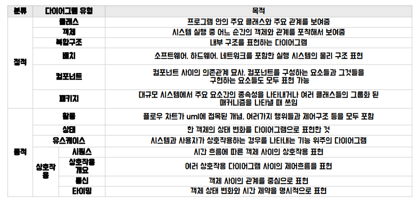

# UML

# UML의 개념

- UML이란?
    - 통합 모델링 언어(Unified Modeling Language).
    - 소프트웨어 공학에서 사용되는 표준화 된 범용 모델링 언어로, 소프트웨어의 개념을 다이어그램으로 그리기 위해 사용하는 시각적인 표기법.
    - 주요 개념들:
        
        
        
- 유스케이스 다이어그램
    
    
    
    - 외부의 알바, 손님, 주방장은 엑터
    → 엑터(Actor)는 일반적으로 시스템 외부에 존재하면서 시스템과 상호작용하는 개체. 엑터는 사람, 기계, 소프트웨어 등이 될 수 있다.
    - 시스템 결제라는 네모 칸이 프로그램(애플리케이션)
    - 시스템 결제 안의 각 동그라미들(치킨 서빙, 맥주 서빙, 음식 서빙)들은 각각의 기능으로, 트랜잭션 단위를 의미한다. 정식 명칭은 유스케이스
    → 유스케이스(UseCase)는 시스텀의 행위(behavior)를 정의하기 위해 사용하는 요소로 일반적으로 유스케이스는 엑터와 상호작용을 한다.
    - 관계
        - 각각을 지향하는 화살표들은 유스케이스와 엑터, 엑터와 엑터 사이의 관계를 의미한다.
        - 엑터와 유스케이스를 가리키는 실선 화살표는 연관 관계로, 유스케이스와 엑터 간의 상호 작용을 의미하는 관계.
        - 유스케이스와 유스케이스를 가리키는 점선 화살표이며, <<include>>를 포함한 관계는 포함 관계 (stereo type). 화살표가 시작한 유스케이스가 화살표가 가리키는 유스케이스를 반드시 해야만 하는 관계를 의미한다.
        - 유스케이스와 유스케이스를 가리키는 점선 화살표이며, <<extend>>를 포함한 관계는 확장관계. 화살표가 시작한 유스케이스가 화살표가 가리키는 유스케이스를 선택적으로 실행하는 관계.
        - 유사한 유스케이스들 또는 엑터들이 추상화한 유스케이스 하나를 가리키는 실선 의 큰 삼각형 화살표는 일반화 관계. 관계도의 복잡화를 막고 간략화하기 위해 유사한 기능의 유스케이스들을 묶는데 사용한다.
- 클래스 다이어그램
    - 정적(구조) 다이어그램으로 UML 모델링에서 가장 일반적으로 사용
    - 시스템의 구조와 구조 간 상호 관계를 나타낸다.
    - 시스템의 논리적 및 물리적 구성요소 설계 시 주로 활용한다.
        
        
        
    - 이 중 합성관계와 집합 관계는 사장된 추세.
    - 관계
        - 연관 관계 
        한 클래스가 필드로 다른 클래스를 참조할 때를 의미한다.
        
        클래스 간의 관련성을 뜻하는 것으로 메시지 전달의 통로 역할을 한다.
        
        방향성이 있는 연관 관계의 경우, 방향성은 메시지 전달의 방향을 의미하며 반대 방향은 
        불가능하다.
        
        관계를 맺을 수 있는 실제 상대 인스턴스의 수를 다중성을 통하여 지정할 수 있다.
        이 때 다중성은 동일한 의미/역할을 하는 복수의 인스턴스들과의 관계이다.
        - 다중 연관
        동일한 클래스 간에 존재하는 복수의 연관관계를 의미한다.
        다른 의미/ 역할을 하는 복수의 인스턴스 인스턴스들과의 관계
        - 집합 관계
        부분 인스턴스가 다수의 전체 인스턴스에 의해 공유될 수 있는 관계
        
        전체 인스턴스가 사라져도 부분 인스턴스는 존재한다.
        - 합성 관계
        부분 인스턴스가 오직 하나의 전체 인스턴스에 포함될 수 있다.
        
        전체 인스턴스가 사라지면 부분 인스턴스도 사라진다. 
        
        단, 집합 관계와 합성 관계는 최근 사장된 추세이다.
        
        - 일반화 관계
        보다 일반적인 클래스와 보다 구체적인 클래스 간의 관계를 의미하는 것으로 한 클래스(상위 클래스)가 다른 클래스(하위 클래스)보다 일반적인 개념/대상임을 의미하는 관계
        시
        - 실체화(인터페이스 구현) 관계
        인터페이스에 명세 된 기능을 클래스에 의해서 구현한 관계
        - 의존 관계
        두 클래스의 연산 간의 호출 관계를 표현한 것으로 제공자의 변경이 이용자에게 영향을 미칠 수 있음을 의미한다. (제공자의 변경이 이용자의 변경을 유발한다.)
        
        이용자는 의존 관계를 통해서 제공자의 연산을 호출할 수 있다.
        - 인터페이스 의존 관계
        인터페이스와 인터페이스 이용자 간의 의존 관계를 표현할 때 사용한다.
- 시퀸스 다이어그램
    - 정의
- V프로세스
    
    
    
    - 블랙박스 분석은 해당하는 기능을 정확히 인지하지 못 했을 때 이루어지는 모델링이며, 화이트박스 분석은 해당 기능을 명확히 인지한 후 이루어지는 모델링.