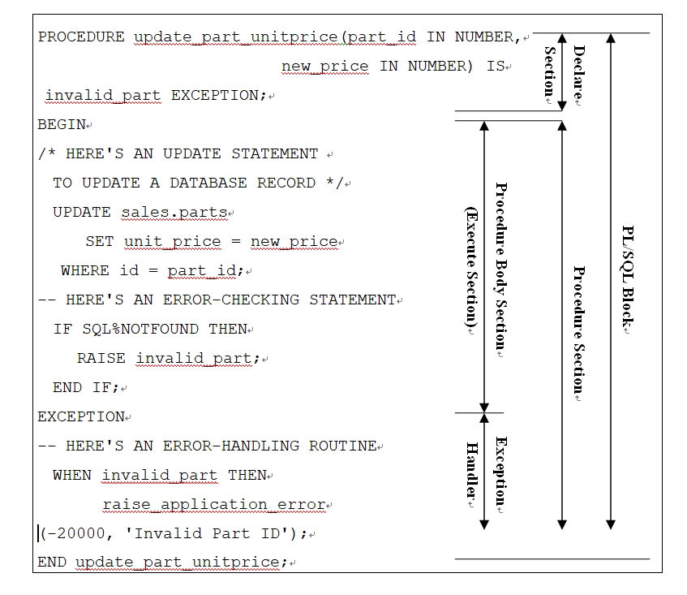

# White PL/SQL 교육

<aside>
💡 Program 시행 시 O/S의 Main Memory에 첫 번째 프로그램은 온전히 올라오고, 동일 프로그램을 다른 스레드 단위로 시행 시 변수 등의 정보가 담겨있는 헤더 부분만 올라오고, 나머지 부분은 첫 번째 프로그램을 공유, 포인터만 올라온다.

</aside>

# PL/SQL 개요

- PL/SQL의 목적
    - OSI 계층에 따라 데이터를 오고 가는 과정에서 Performence는 필연적으로 떨어진다. PL/SQL은 Data만을 다룰 때, 계층 간의 이동을 최소화 하기 위해 만들어졌다.
    - SQL은 Language가 아닌 하나의 Program으로 이해하자.
    - SQL은 여러 가지 Transction을 하나로 묶어 처리하지만, PL/SQL은 하나의 일을 여러 가지 단계로 나눠 중간 과정을 확인하고, Loop 등을 이용해 처리하는 것.
    - PL/SQL은 다른 모든 Program Language처럼 변수 선언부, 처리부(사칙 연산, 조건, 반복), 예외처리부로  이루어져있다.
- PL/SQL Block의 구조
    
    
    
    - PL/SQL에서 가장 어렵고 중요한 부분은 EXCEPTION BLOCK이다. 예와처리를 중요시하자.
    - 프로시저의 이름이 필요할 때는 프로시저의 이름을 명시하며, 이름이 필요 없으면 DECLARE로 시작한다. 단, DECLARE는 변수 선언이 없을 경우 생략 가능하다.
    - Procedure Body Section 안에서 별도의 블록으로 Excetion 처리를 규정, 격리한다.

# 프로그램 선언

- 변수의 형태
    
    
    
    - CHAR와 VARCHAR2의 차이는 고정 길이 문자열과 가변 길이 문자열의 차이. CHAR는 고정, VARCHAR2는 가변
    - 오라클에서도 ANSI 데이터 형을 지원하지만, 내부적으로는 ORACLE 데이터 형으로 변환한다. 이는 타 프로그램과의 호환성을 위함이다.
        
        
        
        
        
    - 서브 타입은 타 데이터베이스 시스템과의 호환성을 위해 지원한다
    - 변수는 아래와 같이 선언한다.
        
        
        
    - constant는 상수일 경우 사용. 상수의 경우 초기값 선언은 필수.
    - %type	: table.column%type, variable%type
    → 특정 테이블의 특정 컬럼과 동일한 자료형으로 지정한다.
    - %rowtype	: table%rowtype
    → 특정 테이블의 RowType과 동일한 자료형으로 지정한다.
    - rowid		:  char(18)의 sub-type이다. 
    → 따라서 DB의 rowid를 rowid 데이타 타입의 변수에 저장할 경우에는 rowidtochar() function을 사용해야 한다.
    → rowid는 데이터가 가지고 있는 Physical한 위치 정보
- 사용자 정의 서브 타입/복합형
    - DECLARE문에서 서브타입을 이용한 변수를 선언할 수 있다.
        
        
        
    - 이를 통해 변수의 크기 변화 등의 경우, 유지보수성을 높일 수 있다.
    - 사용자 정의 복합형으로 PL/SQL 3.0에는 RECORD, TABLE, ARRARY로 크게 나눌 수 있다.
        - RECORD : PL/SQL Version 2.0 이상에서만 사용가능하다. 개별 field의 이름을 부여할 수 있으며 type 선언시 초기값을 부여할 수 있다. 같은 Record type일지라도 직접 record의 값을 record에 assign할 수 없다.
            
            
            
        - TABLE : PL/SQL Version 2.0 이상에서만 사용가능하다. Version 2.0에서는 극히 제한적이었으나 3.0이상에서는 매우 편리하게 확장된 기능을 제공한다.
            
            
            
            - Version 2.0에서의 정의 및 제약
                
                ※ PL/SQL Table은 1개의 column과 한개의 primary key로 되어 있으며 둘 다 이름을 부여할 수 없다.
                
                ※ PL/SQL Table의 primary key를 이용하여 array처럼 사용할 수 있다.
                
                ※ PL/SQL Table의 크기는 제약이 없으며 그 row의 수는 데이타가 들어옴에 따라 자동적으로 증가하므로 선언할 필요 없다.
                
                ※ Table Variable 선언시 초기값을 줄 수 없다.
                
                
                
            - Version 3.0에서의 정의(NESTED TABLEs)
                
                ※ 중첩 테이블 타입을 선언하며, 데이터베이스 테이블처럼, 한개 이상의 열과 **무제한**적인 행 번호를 가진 변수를 만들 수 있다.
                
                
                
        - VARYING ARRAYS(VARRAY)
            
            ※ 테이블과 유사하나, 하나 이상의 열과 **제한된** 행 번호를 가진 변수를 선언하는 것이다.
            
            
            
            - 중첩 테이블(TABLE)과 배열(VARRAY)의 고려 사항
                
                ※ 중첩 테이블에는 몇 개의 행이 있다. 테이블 크기는 갑자기 늘어나거나 줄어들 수 있다.
                
                ※ 배열(VARRAY)는 일정한 행 수를 지니므로, 가능한 행 수를 제한한다.
                
                ※ 중첩 테이블은 드믄 드믄 있을 수 있다. 프로그램은 비연속 서브스크립트를 이용해 회원들을 중첩 테이블에 입력할 수 있으며 테이블 어디에서나 각 회원들을 삭제할 수 있다.
                
                ※ 배열은 조밀하게 있어야 한다. 프로그램은 연속 서브스크립트를 이용해 회원들을 삽입하여야 한다.
                
            - 중첩 테이블과 배열의 초기화
                
                ※ 중첩 테이블을 초기화하려면 PL/SQL 프로그램은 그 타입에 대한 생성자(Creator) 기능을 이용한다. 생성자는 중첩 테이블이나 배열 타입명과 같은 이름이다.
                
                
                

# 프로그램의 기능 기술

- Operators
    
    
    
    - ※ DB내의 table명이나 column명은 대입식의 좌, 우측 어느 곳에도 올 수 없다.
    - ※ 좌측과 우측의 데이타 형태는 서로 같거나 내부적으로 conversion될 수 있어야 한다.
    
    
    
    - Oracel 연산자는 전위 후위 구분이 없다.
    
    
    
    
    
    
    
    
    
- 중첩 테이블과 배열의 Collection Method
    - Collection Method
        
        
        
        - DELETE Method는 Array가 조밀해야 한다는 이유로 중첩 테이블에만 사용할 수 있다.

# SQ문 및 Transcation 처리

- SQL문의 사용 및 컬럼명과 변수명의 구분
    - Select 문에는 그 값을 받기 위하여 into 절이 있다. 이때 into 다음의 변수들은 select 되는 값들과 그 데이타 형태가 같아야 한다.
        
        
        
    - SQL문에 있는 컬럼,변수명의 구분은 먼저 컬럼인지를 체크하고 아니면 PL/SQL 변수인지를 체크한다.
    - SQL문은 수식문의 일부로서는 나타날 수 없다.
    - 컬럼명은 수식문의 일부로서 나타날 수 없다.
- Transaction
    
    
    
    - Transaction : 특히 인사 업무 관련해서, 업무의 시작부터 끝까지 완료되기까지의 단위. 트랜잭션의 단위는 업무 연관성과 연관지어 결정한다.
    - Transaction 단위 설정에 실패할 경우, Gabarge Data의 발생으로 인한 결과 값 차이가 발생할 수 있어 위험하다.
    - Client가 DDL 명령어를 통해 PMON에 요청하고, PMON은 SGA의 BUFFER 영역에 데이터를 저장한다. 이후 COMMIT, BUFFER가 가득 찼을 때(BUFFER를 비워야 할 때), DB의 스케쥴 내에서 정해진 때에 DBWR을 통해 HD의 TABLE에 값을 기록한다. COMMIT이 이루어질 때마다 BUFFER와 DBWR 사이의 통신이 이루어지므로, COMMIT은 작을 수록 좋다.
    - SAVEPOINT... ROLLBACK TO는 후에 일정 처리 부분까지만 롤백할 수 있는 기능을 제공한다.
    - SAVEPOINT 명령문을 이용하여 롤백할 위치를 지정한 후, ROLLBACK TO 를 이용하여 해당 표시된 위치 이후 작업된 내용들만 롤백시킨다.

# 조건문 및 순환문 처리

- IF문
    
    
    
    - ELSIF절은 여러 번 반복될 수 있다.
    - 조건문(condition)은 boolean 형태의 값으로 나타나야 한다.
    - 조건문의 결과가 null일 경우 ELSE로 처리된다.
    - NULL은 사칙연산이 안되기에 조건 처리 시 주의해야 한다.
        
        
        
- LOOP문
    - 단순 순환문(Simple Loop)
        
        
        
        - 모든 단순 순환문은 반드시 EXIT WHEN이나 EXIT를 사용하여 LOOP를 종료해야 한다. 그렇지 않으면 무한히 실행된다.
    - Numeric For Loop
        
        
        
        - Index 변수는 FOR LOOP 문장내에서만 선언되어 사용되므로 이를 Declare Section에 기술할 필요는 없다.
        - Index 변수의 값은 자동적으로 FOR LOOP가 한번 수행될 때마다 증가(감소)하며, FOR LOOP내에서 이를 참조할 수는 있지만 변경할 수는 없다.
        - FOR LOOP 내에서 LOOP를 종료하고 LOOP밖으로 나올 경우에는 EXIT나 EXIT WHEN을 사용하며, 다음 순환의 경우에는 CONTINUE를 사용한다.
        - EXIT : LOOP가 종료되고 END LOOP; 다음의 문이 수행된다.
        - CONTINUE : LOOP내의 다음 문장들을 수행하지 않고 LOOP 처음으로 돌아가서 다음 조건들을 처리한다.
    - While LOOP
        
        
        
- Label 과 GOTO 문의 처리
    - Label의 선언
        
        
        
    - PL/SQL 불록에 명칭을 부여할 경우
        
        
        
    - Loop에 명칭을 부여할 경우
        
        
        | SIMPLE LOOP | NUMERIC FOR LOOP | WHILE LOOP |
        | --- | --- | --- |
        | <<LABEL_NAME>>
        LOOP
          ......;
        END LOOP LABEL_NAME; 
          ......; | <<LABEL_NAME>>
        FOR I IN 1..100 LOOP
          ......;
        END LOOP LABEL_NAME; 
          ......; | <<LABEL_NAME>>
        WHILE I <= 100 LOOP
          ......;
        END LOOP LABEL_NAME; 
          ......; |
        - LOOP불록 시작 위치에 Label을 부여한다. 블록 끝은 "END LOOP Label명;"으로 맺는다
    - GOTO문의 처리
        
        
        
        - IF문이나 LOOP내로 분기하여 들어갈 수 없다.

# Cursor

- Cursor의 사용
    - Cursor라 함은 대상이 되는 데이타베이스 데이타를 일시적으로 저장하는 기능을 갖는 메모리상의 buffer(물리적 Block)이다. 모든 SQL문은 그 수행 과정상 Cursor를 사용하게 된다.
    - 여러 record를 읽어 순차적으로 처리하는 경우에 프로그램에서는 그에 해당하는 Cursor를 그 이름을 부여하여 사용해야 한다.
    - SQL문이 수행될 때 자동적으로 사용되는 프로그램에서 정의하지 않은 cursor를 implicit cursor라 하며 이들을 언급할 경우에는 그 명칭을 "SQL"이라 칭한다.
    - 한편, 프로그램에서 정의한 cursor은 explicit cursor라 칭하며 그 명칭은 이용자(프로그램)가 부여한다.
    - PL/SQL에서는 SQL의 결과 세트에 두개 이상의 행이 있을 경우에는 에러를 발하게 된다. PL/SQL에서 여러 행을 읽어서 어떤 작업을 하려면 커서를 선언하여 사용해야 한다.
    - PMON을 거쳐 SGA의 CURSOR에 들어간 SQL문들은 우선 Data Dictionary의 테이블과 정보가 일치하는지 매핑(Driveded)한다. 매핑 후 일치하는 데이터가 있을 경우, Parsing 한다. 이후 Execute를 통해 CURSOR를 BUFFER로 옮긴다. 이후 HD의 Table로 이동하는 것.
    - 이 때, CURSOR의 수가 부족할 경우 에러가 발생한다. (*Cursor* is *not open Exception)*
    - ORACLE은 인터프립터가 라인 단위가 아닌 블록 단위로 수행하기에 수행 시간이 더 빠르다.
- Explicit Cursor
    - 다중 행 커서에 해당하는 행들을 처리하려면 프로그램은 커서를 선언한 후 세가지 단계를 수행해야 한다. 커서를 열고, 행을 가져온 다음, 커서를 닫는 것이 그것이다. 전형적으로 행별 작업 처리를 위해 LOOP 문을 함께 사용하게 된다.
    - 커서의 선언
        
        
        
        - SELECT문에 INTO절은 없다.
        - 커서의 인식 범위는 변수의 경우와 같다.
            
            
            
        - OPEN
            - Open될 때, Select문이 수행되어 cursor에 그 데이타가 보관된다.
        - FETCH
            - Cursor로부터 1개의 record을 읽어 정해진 변수에 그 값을 넣는 작업이다.
            - 컬럼과 변수는 그 순서에 따라 연결된다.
            - into 다음의 변수의 갯수, 변수의 형태는 select문의 컬럼의 수 및 그 형태와 일치하여야 한다.
        - CLOSE
            - 사용중인 cursor를 (조건을 달리하여) 재차 Open할 경우에는 close할 필요없이 open을 기술한다.
    - CURSOR의 속성 변수들
        - PL/SQL 프로그램은 %ISOPEN, %FOUND, %NOTFOUND, %ROWCOUNT와 같은 몇 가지 고유한 커서 속성을 사용하여 커서 프로세싱 시기를 결정할 수 있다.
            
            
            | Explicit CURSOR | Implicit CURSOR | 설      명 |
            | --- | --- | --- |
            | cursor_name%ISOPEN | SQL%ISOPEN | 커서가 이미 OPEN되어 있으면 TRUE, 그렇지 않으면 FALSE.
            SQL%ISOPEN은 항상 FALSE임 |
            | cursor_name%FOUND | SQL%FOUND | FETCH한 결과 데이터가 있어서 성공한 경우는 TRUE, 그렇지 않으면 FALSE. |
            | cursor_name%NOTFOUND | SQL%NOTFOUND | Fetch를 수행한 결과 더이상 Cursor에 데이타가 없어서 실패한 경우에 TRUE |
            | cursor_name%ROWCOUNT | SQL%ROWCOUNT | 커서에서 fetch한 행의 수, 또는 SQL문에서 처리한 행의 수를 나타낸다. |
        - ROWCOUNT를 통해 UPDATE 한 행의 수를 확인 가능하다.
        - SELECT INTO의 경우 PL/SQL에서 결과는 하나의 행만 나와야 한다. 따라서 BEGIN 절을 이용, 별도의 블록으로 둬야 한다.
        - Update, Delete의 경우 SQL%FOUND, SQL%NOTFOUND등을 이용, 예외처리를 해야 한다.
    - CURSOR PARAMETER 사용
        - 프로그램이 커서 파라미터를 가진 커서를 열면, 프로그램은 각 커서 파라미터에 대한 값을 지시한다
            
            
            
        - 파라미터의 변수 타입을 선언할 때는 길이등은 선언하지 않는다.
        - CLOSE는 가급적 명시적으로 담는다.
    - CURSOR FOR LOOP
        - Cursor for loop는 cursor의 open, fetch, close와 Numeric for loop가 결합된 형태로 다음과 같은 문법에 의한다.
            
            
            
        - OPEN, FETCH, CLOSE는 기술되지 않는다.
        - Cursor를 재 open하기 위해 loop내부에 open문을 기술할 수는 없다.
        - For Loop가 시작되는 시점에 내부적으로 Cursor가 OPEN된다.
        - 매 Loop 시작 시점에 내부적으로 Fetch가 이루어져, Loop 내부에서는 각각의 record에 대한 처리문만 기술되고 이때 record의 각 항목에 대한 언급은 record_name.column_name으로 한다.
        - 더이상 Fetch할 기록이 없으면 Loop가 종료되며 내부적으로 Close가 수행된 후, cursor for loop문의 수행이 종료하게 된다.
        - <record_name>은 declare문에 기술 할 필요는 없으며 for loop가 수행되는 동안 내부적으로 다음과 같은 선언 효과가 있다.
        
        
        
    - 동적인 SQL 사용하기(DBMS_SQL Package)
        - PL/SQL 프로그램은 수행 속도를 개선하기 위하여 프로그램을 편집할 때 모든 SQL을 정적으로 묶는다.  즉 편집할 때, SQL에 참조된 데이터베이스 객체와 일치하며, 필요한 권한은 참조된 객체등에 액세스할 수 있도록 보증한다.
        - SQL 바인딩은 프로그램 컴파일 시기에 일어나기 때문에, 실행할 시기에 일어날 필요가 없다.
        - 따라서 PL/SQL 프로그램은 실행중에 제공한 SQL문장을 받아들일 수 없다. 또한 바인딩 조건으로 인하여 SQL DDL을 실행할 수 없는 특성이 있다.
        - 동적인 SQL을 사용할 수 있으면 매우 융통성있는 프로그램을 작성할 수 있다.  이를 위해서는 DBMS_SQL 패키지라는 특별한 데이터베이스 유틸리티를 사용한다.
            
            
            | 사용 예 | 설 명 |
            | --- | --- |
            | CREATE OR REPLACE PROCEDURE drop_table (
             schema_name in out varchar2,
             table_name in out varchar2) IS
              cursor_id INTEGER;
              return_value INTEGER;
              command_string VARCHAR2(250);
            BEGIN
              command_string := 'DROP TABLE '||schema_name||'.'
                                   ||table_name;
              cursor_id := dbms_sql.open_cursor;
              dbms_sql.parse(cursor_id, command_string, dbms_sql.v7);
              return_value := dbms_sql.execute(cursor_id);
              dbms_sql.close_cursor(cursor_id);
            END drop_table; | 
             
             
             
             
             
             
            DDL SQL input
             
            CURSOR 할당
            PARSING SQL
            SQL 수행
            CURSOR Release |
        - 동적인 SQL의 필요한 단계의 정확한 형태와 수는 실행하고자 하는 명령문의 타입에 달려 있다. 위의 예는 동적인 SQL으로 PL/SQL 프로그램이 DDL을 실행하는 방법을 보여 준다. 쿼리와 같은 타입의 동적인 SQL 문장은 몇 가지 단계가 더 필요하다.

# EXCEPTION

- Exception
    - Exception이라 함은 PL/SQL프로그램의 begin이후 정상적인 처리 중 발생하는 비정상적인 경우를 말하고, 이에 대처하는 처리내용을 기술하는 부분이 Exception절(Exception Handler)이라 할 수 있다.
    - 모든 ORACLE Error는 자동적으로 Exception을 발생시키며 이들 중 자주 쓰이는 것들은 그 고유한 명칭을 갖고 있다. 또한 프로그램을 통하여 이용자가 Exception을 정의하여 사용할 수 있는데 전자를 Predefined Internal Exception이라 하고 후자를 User-defined Exception이라 한다.
    - Predefined Internal Exception
        - PL/SQL에는 공통적인 오라클 에러에 해당하는 많은 미리 정의된 예외(약 20여개)가 있다.
        - 프로그램은 SELECT INTO문이 행이 없는 결과 세트가 있을 때는 NO_DATA_FOUND 예외를 발견하며, 결과 세트에 둘 이상의 행이 있을 경우에는 TOO_MANY_ROWS 예외를 발견한다.
        - 프로그램은 INSERT나 UPDATE문이 이미 테이블에 있는 키값을 복사할 때, DUP_VAL_ON_INDEX 예외를 발견한다.
        - 프로그램은 명령이 0으로 나누고자 할 때, ZERO_DIVIDE 예외를 발견한다.
            
            
            | EXCEPTION NAME | ORACLE
            ERROR CODE | 설명 |
            | --- | --- | --- |
            | TOO_MANY_ROWS | ORA-01422 | 하나의 행을 읽는 문장에서 2개 이상의 행이 읽혀졌을 때 발생한다. |
            | NO_DATA_FOUND | ORA-01403 | 하나의 행을 읽는 문장에서 해당되는 행이 하나도 없을 경우 발생 |
            | INVALID_CURSOR | ORA-01001 | 커서의 사용이 잘못된 경우에 발생한다. 오픈하지 않고 패치하는 경우 등. |
            | VALUE_ERROR | ORA-06502 | 변수 형태의 불일치, 또는 자릿수의 부족등으로 truncation이 일어날 경우 발생한다. 단, 내부적으로 conversion이 가능하면 일어나지 않는다. |
            | ZERO_DIVIDE | ORA-01476 | 0으로 나눌 경우 발생한다 |
            | DUP_VAL_ON_INDEX
             | ORA-00001
             | unique index가 있는 column(들)에 이미 존재하는 것과 같은 값이 insert될 경우에 발생한다. |
            | CURSOR_ALREADY_OPEN | ORA-06511 |  |
            | INVALID_NUMBER | ORA-01722 | 넘버 타입이 아니다 |
            | LOGIN_DENIED | ORA-01017 |  |
            | NOT_LOGGED_ON | ORA-01012 | 로그인이 안됨 |
            | PROGRAM_ERROR | ORA-06501 | 프로그램을 콜했는데 찾을 수 없는 등 에러 |
            | STORAGE_ERROR | ORA-06500 | 저장장치 에러 |
            | TIMEOUT_ON_RESOURCE | ORA-00051 | 타임아웃 |
            | TRANSACTION_BACKED_OUT | ORA-00061 | 롤백되어버린 상태 |
    - User-defined Exception
        - Declare Section에 사용자 정의 예외를 정의하여야 한다.
            
            
            
    - EXCEPTION_INIT
        - Exception들은 그 이름에 의해서만 Handler에서 처리될 수가 있다. 따라서 Oracle Error Code에 의해서는 다룰 수가 없으며, 이 경우에는 Error Code에 Exception 명칭을 부여하여 사용하여야 한다. 이 명칭 부여 기능을 수행하는 것이 EXCEPTION_INIT이며 이는 declare절에 나타나야 한다.
            
            
            
- Exception Handler
    - 정상적인 처리상에서 예외가 발생했을 경우 이를 처리하기 위한 SECTION이다. 이 예외처리 부분이 수행되면 해당 블록의 처리는 종료된다.
        
        
        
        - WHEN 에서 해당 EXCEPTION을 만나면 THEN 이하 다음 WHEN 절 전까지의 명령문을 수행하고 해당 블록의 수행을 종료한다.
        - WHEN OTHERS THEN ....
        → Exception Handler에서 언급안된 나머지 Exception들에 대한 처리 제어이다.
        - WHEN OTHERS THEN ....
        → Exception Handler에서 언급안된 나머지 Exception들에 대한 처리 제어이다.
- Exception의 처리
    - DeadLock의 경우, 가장 간단한 처리 방식은 데이터(테이블)의 순서를 미리 정해주는 것. -
    
    
    
    - Exception이 발해진 현재의 PL/SQL Block에서 Exception Handler를 찾는다.
    - 현재의 Block에 Exception Handler가 정의되어 있으면 그를 수행하고 현재의 Block을 종료하며, 없으면 상위 PL/SQL Block내의 Exception Handler를 찾는다.
    - 위 과정을, Exception Handlerfmf 찾을 때까지 계속한다.
    - 최상위 Block에서도 Exception Handler를 찾지 못한 경우에는 Exception은 PL/SQL을 이용하는 환경(SQL/Form, SQL*Plus, Application 등)으로 넘겨진다.

# PL/SQL Built-in Function

<aside>
💡 ★ MLSLABEL형태(LABEL)에 관련된 함수들은 Trusted ORACLE에서만 사용할 수 있다.

</aside>

- Error Reporting Functions
    - function SQLCODE return NUMBER
        - 가장 최근 발생한 exception의 error number를 return한다. exception handler내에서 의미가 있다. 그 외에서는 항상 0 이다.
    - function SQLERRM[(error_number NUMBER)] return CHAR
        - error number에 해당하는 error message를 return한다. error number가 없을 경우에는 가장 최근에 발생한 exception의 error message를 return 한다.
- Number Functions
    - function abs(n NUMBER) return NUMBER
        - n의 절대값을 return한다.
    - function ceil(n NUMBER) return NUMBER
        - n보다 크거나 같은 정수 중 가장 작은 정수값을 return한다.
    - function cos(a NUMBER) return NUMBER
        - cosine값을 return한다.(a:radian)
    - function cosh(n NUMBER) return NUMBER
        - hyperbolic cosine 값을 return한다.
    - function exp(n NUMBER) return NUMBER
        - exponential(e = 2.71828)의 n 승 값을 return한다.
    - function floor(n NUMBER) return NUMBER
        - n보다 작거나 같은 정수 중 가장 큰 정수값을 return한다.
    - function ln(n NUMBER) return NUMBER
        - 자연 log n(n > 0)의 값을 return한다.
    - function log(m NUMBER, n NUMBER) return NUMBER
        - base m인 log n의 값을 return한다.(m > 1, n > 0)
    - function mod(m NUMBER, n NUMBER) return NUMBER
        - m을 n으로 나눈 나머지 값을 return한다.
    - function power(m NUMBER, n NUMBER) return NUMBER
        - m의 n승을 return한다.
    - function round(m NUMBER[, n NUMBER]) return NUMBER
        - m의 값을 소숫점이하 n자릿수에서 반올림한 값을 return한다. n이 생략되면0의 자릿수에서 반올림하며, n이 음수이면 소숫점 왼쪽에서 반올림이 이루어 진다.
    - function sign(n NUMBER) return NUMBER
        - n이 음수이면 -1, 양수이면 1, 0이면 0을 return한다.
    - function sin(a NUMBER) return NUMBER
        - sine값을 return한다.(a:radian)
    - function sinh(n NUMBER) return NUMBER
        - hyperbolic sine 값을 return한다.
    - function sqrt(n NUMBER) return NUMBER
        - square root값을 return한다.
    - function tan(a NUMBER) return NUMBER
        - tangent값을 return한다.(a:radian)
    - function tanh(n NUMBER) return NUMBER
        - hyperbolic tangent 값을 return한다.
    - function trunc(m NUMBER[, n NUMBER]) return NUMBER
        - m의 값을 소숫점이하 n자릿수에서 절사한 값을 return한다. n이 생략되면 0의 자릿수에서 절사하며, n이 음수이면 소숫점 왼쪽에서 절사가 이루어 진다.
- Character Functions
    - function ascii(char VARCHAR2) return NUMBER
        - char의 내부 코드값을 return한다.(7-bit ASCII, EBCDIC/Page500)
    - function chr(num NUMBER) return VARCHAR2
        - num의 코드값을 같는 문자를 return한다.(7-bit ASCII, EBCDIC/Page500)
    - function concat(str1 VARCHAR2, str2 VARCHAR2) return VARCHAR2
        - str1에 str2를 붙인 string을 return한다.
    - function initcap(str VARCHAR2) return VARCHAR2
        - str내의 각 단어 첫 글자를 대문자로 변환한 문자열을 return한다.
    - function instr(str1 VARCHAR2,str2 VARCHAR2[,pos NUMBER[,n NUMBER]]) return NUMBER
        - str1의 pos위치에서부터 n번째 str2와 같은 문자열이 시작되는 위치를 return한다. pos가 음수이면 str1의 끝에서부터 계산한다. pos와 n의 생략시 값은 1로 본다. 못찾을 경우는 0이 return된다.
    - function instrb(str1 VARCHAR2,str2 VARCHAR2[,pos NUMBER[,n NUMBER]])
    return NUMBER
        - str1의 pos위치에서부터 n번째 str2와 같은 문자열이 시작되는 위치를 return한다. pos가 음수이면 str1의 끝에서부터 계산한다. pos와 n의 생략시 값은 1로 본다. 못찾을 경우는 0이 return된다.
        - function 명칭 끝에 b가 있는 것은 2 byte code 문자열에서 지원되는 함수임을 의미한다.
    - function length(str CHAR) return NUMBER, 
    function length(str VARCHAR2) return NUMBER
        - str의 문자수를 return한다. str이 null이면 null 값이 return된다.
    - function lengthb(str CHAR) return NUMBER,
    function lengthb(str VARCHAR2) return NUMBER
        - str의 문자수를 return한다. str이 null이면 null 값이 return된다.
    - function lower(str CHAR) return CHAR,
    function lower(str VARCHAR2) return VARCHAR2
        - 모든 문자를 소문자로 변환하여 그 값을 return한다.
    - function lpad(str VARCHAR2, len NUMBER[,pad VARCHAR2])
    return VARCHAR2
        - 문자열 pad를 문자열 str좌측(앞)쪽에 반복하여 붙여 총길이가 len이 되도록하여 그 문자열을 return한다.
    - function ltrim(str VARCHAR2[, set VARCHAR2]) return VARCHAR2
        - 문자열 str의 좌측(앞)에 있는 set문자열을 절사한 문자열을 return한다. set이 생략되면 space로 간주한다.
    - function nls_initcap(str VARCHAR2[, nlsparms VARCHAR2]) return VARCHAR2
        - str내의 각 단어 첫 글자를 대문자로 변환한 문자열을 return한다. nlsparms는 'NLS_SORT = <sort>'형태이다. sort는 언어상의 순을 의미하며 그렇지 않을 경우에는 BINARY를 쓸 수도 있다.
    - function nls_lower(str VARCHAR2[, nlsparms VARCHAR2]) return VARCHAR2
        - 모든 문자를 소문자로 변환하여 그 문자열을 return한다.
    - function nls_upper(str VARCHAR2[, nlsparms VARCHAR2]) return VARCHAR2
        - 모든 문자를 대문자로 변환하여 그 문자열을 return한다.
    - function nlssort(str VARCHAR2[, nlsparms VARCHAR2]) return RAW
        - 문자열의 언어상 순서를 return한다.
    - function replace(str1 VARCHAR2, str2 VARCHAR2[, str3 VARCHAR2])
    return VARCHAR2
        - str1에 있는 str2 문자열을 모두 str3문자열로 바꾼 문자열을 return한다. str3가 생략되면 str2 문자열을 모두 삭재한 문자열이 return되며 str2, str3 모두 생략되면 null이 return된다.
    - function rpad(str VARCHAR2, len NUMBER[,pad VARCHAR2]) return VARCHAR2
        - 문자열 pad를 문자열 str우측(뒤)쪽에 반복하여 붙여 총길이가 len이 되도록하여 그 문자열을 return한다.
    - function rtrim(str VARCHAR2[, set VARCHAR2]) return VARCHAR2
        - 문자열 str의 우측(뒤)에 있는 set문자열을 절사한 문자열을 return한다. set이 생략되면 space로 간주한다.
    - function soundex(str VARCHAR2) return VARCHAR2
        - str의 발음표현문자열이 return된다. 이에 관한 것은 'The Art of Computer Programming', Volumn 3, Donald Knuth를 참조하기 바란다.
    - function substr(str VARCHAR2, pos NUMBER[, len NUMBER]) return VARCHAR2
        - str의 pos위치에서부터 len만큼의 문자열을 return한다.
    - function substrb(str VARCHAR2, pos NUMBER[, len NUMBER]) return VARCHAR2
        - str의 pos위치에서부터 len만큼의 문자열을 return한다.
    - function translate(str VARCHAR2, set1 VARCHAR2, set2 CHAR) return VARCHAR2
        - str내의 set1에 있는 문자들을 각기 set2에 있는 문자로 변환하여 return한다. set1에는 있는데 그 해당되는 문자가 set2에 없으면 이 문자들은 삭제된다.
    - function upper(str CHAR) return CHAR
        - str의 모든 문자를 대문자로 변환한다.
- Conversion Functions
    - function chartorowid(str CHAR) return rowid
    function chartorowid(str VARCHAR2) return rowid
        - rowid 형태로 변환한다.
    - function convert(str VARCHAR2, set1 VARCHAR2[, set2 VARCHAR2])
    return VARCHAR2
        - str을 set2 문자형태에서 set1 문자형태로 변환한다.
        
        | 문 자 형 태 | 설           명 |
        | --- | --- |
        | US7ASCII | U.S 7-bit ASCII character set |
        | WE8DEC | DEC West European 8-bit character set |
        | WE8HP | HP West European Laserjet 8-bit character set |
        | F7DEC | DEC French 7-bit character set |
        | WE8EBCDIC500 | IBM West European EBCDIC Code Page 500 |
        | WE8PC850 | IBM PC Code Page 850 |
        | WE8ISO8859P1 | ISO 8859-1 West European 8-bit character set |
    - function hextoraw(str CHAR) return RAW
    function hextoraw(str VARCHAR2) return RAW
        - 16진수 형태의 str를 RAW 형태로 변환한다.
    - function rawtohex(bin RAW) return VARCHAR2
        - binary 형태의 bin을 16진수 형태로 번환한다.
    - function rowidtochar(bin ROWID) return VARCHAR2
        - rowid 형태를 문자열 형태로 변환한다.
    - function to_char(dte DATE[, fmt VARCHAR2[, nlsparms]]) return VARCHAR2
        - 일자 형태를 문자열로 변환한다.
    
    | Format Model
    (FMT) | 설 명
    (Descriptions) | Format Model
    (FMT) | 설 명
    (Descriptions) |
    | --- | --- | --- | --- |
    | CC, SCC | century(S prefixes dates with a minus sign) | WW | week of year(1-53) |
    | YYYY,
    SYYYY | year(S prefixes dates with a minus sign) | IW | week of year(1-52, 1-53) based on ISO standard |
    | IYYY | year based on ISO standard | W | week of month(1-5) |
    | YYY, YY, Y | last three, two, or one digit(s) of year | DDD | day of year(1-366) |
    | IYY, IY, I | last three, two, or one digit(s) of ISO year | DD | day of month(1-31) |
    | Y,YYY | year with comma | D | day of week(1-7) |
    | YEAR, SYEAR | year spelled out(S prefixes dates with a minus sign) | DAY | name of day |
    | RR | last two digits of year in another century | DY | abbreviated name of day |
    | BC, AD | BC or AD indicator | J | julian day(number of days since Jan 1, 4712) |
    | B.C., A.D. | BC or AD indicator with periods | AM, PM | meridian indicator |
    | Q | quarter of year(1-4) | A.M., P.M. | meridian indicator with periods |
    | MM | month(01-12) | HH, HH12 | hour of day(1-12) |
    | RM | Roman numeral month(I-XII) | HH24 | hour of day(0-23) |
    | MONTH | name of month | MI | minute(0-59) |
    | MON | abbreviated name of month | SS | second(0-59) |
    | SSSSS | seconds past midnight(0-86399) |  |  |
    - function to_char(num NUMBER[, fmt VARCHAR2[, nlsparms]]) return VARCHAR2
        - 숫자를 문자열로 변환한다.
    - function to_char(label MLSLABEL[, fmt VARCHAR2]) return VARCHAR2
        - MLSLABEL 형태를 문자열로 변환한다.
            
            'NLS_DATE_LANGUAGE = <language>'
            
            ---
            
            'NLS_NUMERIC_CHARACTER = ''dg'' (d:decimal(.), g:group(,))
            
            ---
            
            'NLS_CURRENCY = ''text''
            
            ---
            
            'NLS_ISO_CURRENCY = ''text''
            
            ---
            
    - function to_date(str VARCHAR2[, fmt VARCHAR2[, nlsparms]]) return DATE
        - 문자열 형태의 일자를 일자형태로 변환한다.
    - function to_date(num NUMBER, fmt VARCHAR2[, nlsparms]) return DATE
        - 숫자형태의 일자를 일자형태로 변환한다.
    - function to_label(str CHAR[,fmt VARCHAR2]) return MLSLABEL
    function to_label(str VARCHAR2[,fmt VARCHAR2]) return MLSLABEL
        - 문자열의 형태를 MLSLABEL 형태로 변환한다.
    - function to_multi_byte(str CHAR) return CHAR
    function to_multi_byte(str VARCHAR2) return VARCHAR2
        - single byte형태의 문자를 각기 multi-byte형태의 문자로 변환한다.
    - function to_number(str CHAR[, fmt VARCHAR2[, nlsparms]]) return NUMBER
    function to_number(str VARCHAR2[, fmt VARCHAR2[, nlsparms]]) return NUMBER
        - 문자열 형태의 숫자를 숫자 형태로 변환한다.
    - function to_single_byte(str CHAR) return CHAR
    function to_single_byte(str VARCHAR2) return VARCHAR2
        - multi-byte 형태의 문자를 single byte 형태의 문자로 변환한다.
- Date Functions
    - function add_months(dte DATE, num NUMBER) return DATE
    function add_months(num NUMBER, dte DATE) return DATE
        - dte 일자에 num만큼의 개월수를 더하거나 뺀 일자를 return한다. dte의 일자가 가감된 월의 일수가 작아서 없을 경우에는 마지막일자를 return 한다.
    - function last_day(dte DATE) return DATE
        - dte가 속한 월의 마지막 일자를 return한다.
    - function months_between(dte1 DATE, dte2 DATE) return NUMBER
        - dte1과 dte2사이의 개월수를 return한다. dte1이 dte2보다 나중 일자인 경우에는 양수가 return되고 반대의 경우에는 음수가 return된다. dte1과 dte2의 일자(월은 틀림)가 같은 경우, 또는 말일인 경우에는 정수가 return되고 그렇지 않으면 1 개월을 31일로 산출한 실수(소숫점이 있는)가 return된다.
    - function new_time(dte DATE, zon1 VARCHAR2, zon2 VARCHAR2) return DATE
        - zon1에 있는 dte를 zon2의 일시로 바꾸어 return한다.
    
    | Time Zone(zon) | Description |
    | --- | --- |
    | AST | Atlantic Standard Time |
    | ADT | Atlantic Daylight Time |
    | BST | Bering Standard Time |
    | BDT | Bering Daylight Time |
    | CST | Central Standard Time |
    | CDT | Central Daylight Time |
    | EST | Eastern Standard Time |
    | EDT | Eastern Daylight Time |
    | GMT | Greenwich Mean Time |
    | HST | Alaska-Hawaii Standard Time |
    | HDT | Alaska-Hawaii Daylight Time |
    | MST | Mountain Standard Time |
    | MDT | Mountain Daylight Time |
    | NST | Newfoundland Standard Time |
    | PST | Pacific Standard Time |
    | PDT | Pacific Daylight Time |
    | YST | Yukon Standard Time |
    | YDT | Yukon Daylight Time |
    - function next_day(dte DATE, day VARCHAR2) return DATE
        - dte 다음의 일자중 day요일에 해당되는 가장 빠른 일자가 return된다.
    - function round(dte DATE[, fmt VARCHAR2]) return DATE
        - dte 일자를 fmt에 정의된 형태로 반올림한 일자를 return한다.
    
    | Format(FMT) | 반올림 형태 |
    | --- | --- |
    | CC, SCC | YY00년 1월 1일 |
    | SYYY,YYYY,YEAR | YYYY년 1월 1일 |
    | Q | 해당 분기의 2번째 월 16일 |
    | MONTH, MON, MM | 월 1일 |
    | WW | 년별 주의 첫번째 일자 |
    | W | 월별 주의 첫번째 일자 |
    | DDD, DD, J | 일자 |
    | DAY, DY, D | 가장가까운 일요일 |
    | HH, HH12, HH24 | 시간 |
    | MI | 분 |
    - function sysdate return DATE
        - 현재의 시스템 일시를 return한다.
    - function trunc(dte DATE[, fmt VARCHAR2]) return DATE
        - dte 일자를 fmt에 정의된 형태로 절사한 일자를 return한다.
- miscellaneous Functions
    - 여기에 정의되는 함수들은 모두 SQL 문에서 사용가능하고 decode만을 제외한 모든 함수들은 procedure에서도 사용 가능하다.
    - function decode(expr, search1, result1[, search2, result2]...,default)
    - expr의 결과가 search1이면 result1이 return되고,..., 일치하는 것이 없으면 default 값이 return되며 이도 정의되어 있지 않으면 null이 return된다.
    - function dump(expr DATE[, fmt BINARY_INTEGER
        
        [, pos BINARY_INTEGER[, len BINARY_INTEGER]]]) return VARCHAR2
        
    - function dump(expr NUMBER[, fmt BINARY_INTEGER
        
        [, pos BINARY_INTEGER[, len BINARY_INTEGER]]]) return VARCHAR2
        
    - function dump(expr VARCHAR2[, fmt BINARY_INTEGER
        
        [, pos BINARY_INTEGER[, len BINARY_INTEGER]]]) return VARCHAR2
        
    - expr의 내부 표현방식이 return된다.
        - **fmt : 8=octal, 10=decimal(default), 16=hexadecimal, 17=single character**
    - function greatest(expr1, expr2, expr3, ...)
        - 열거된 항목 중 가장 큰 값을 return한다.
    - function greatest_lb(label [,label] ...) return MLSLABEL
        - 열거된 label중 가장 큰 lower bound의 label을 return한다.
    - function least(expr1, expr2, expr3, ...)
        - 열거된 항목중 가장 작은 값을 return한다.
    - function least_ub(label [,label] ...) return MLSLABEL
        - 열거된 label중 가장 작은 upper bound의 label을 return한다.
    - function nvl(str1 CHAR, str2 CHAR) return CHAR
        
        function nvl(str1 VARCHAR2, str2 VARCHAR2) return VARCHAR2
        
        function nvl(dte1 DATE, dte2 DATE) return DATE
        
        function nvl(bool1 BOOLEAN, bool2 BOOLEAN) return BOOLEAN
        
        function nvl(num1 NUMBER, num2 NUMBER) return NUMBER
        
        function nvl(lbl1 MLSLABEL, lbl2 MLSLABEL) return MLSLABEL
        
    - 각기 항목1의 값이 null이 아니면 항목1의 값을 return하고 null이면 항목2의 값을 return한다.
    - function uid return NUMBER
        - 현재의 Oracle 이용자에게 부여된 ID 번호를 return한다.
    - function user return VARCHAR2
        - 현재 사용중인 username을 return한다.
    - function userenv(str VARCHAR2) return VARCHAR2
        - 현재의 여러 연결 정보를 return한다.
    
    | str | Return Information |
    | --- | --- |
    | 'ENTRYID' | auditing entry identifier |
    | 'LABEL' | session label |
    | 'LANGUAGE' | langulage, territory, database character set |
    | 'SESSIONID' | auditing session identifier |
    | 'TERMINAL' | operating system identifier for the session terminal |
    - ENTRYID 와 SESSIONID는 remote database를 access하는 SQL문에서는 사용할 수 없다.
    - function vsize(expr DATE) return NUMBER
    function vsize(expr NUMBER) return NUMBER
    function vsize(expr VARCHAR2) return NUMBER
        - 내부 표현상의 byte 수를 return한다.

# Subprograms

- Subprogram
    - 장점
        - Modularity
        - Reusability
        - Maintainability
        - Abstraction
    - 단점
        - declare부분 마지막에서 subprogram을 정의해야 한다.
        - 앞서 정의되는 subprogram에서 뒤에 정의될 subprogram을 invoke할 수 없다.(Forward Declaration)
    
    
    
    - Recursive Subprograms
        - Self-recursive subprogram
        - Mutually recursive subprograms
        - Recursion은 Iteration보다 간단하고, 작고, 읽기 쉬운 장점이 있으나 보통 속도, 메모리 사용에 있어서 비효율적이다.
        
        
        
    - Stored Subprogram 장점
        - Higher Productivity
        - **Better Performance**
        - **Memory Savings**
        - Application Integrity
        - Tighter Security
    - Calling Stored Subprogram
        
        
        | 프로그램 형태 | 사용 방법 |
        | --- | --- |
        | Another subprogram(PL/SQL) | begin
          ......
          subprogram_name(argument,...);
          ......
        end; |
        | Application Program(ESQL) | exec sql execute
            begin
             subprogram_name(argument,...);
            end; |
        | SQL/plus | SQL> execute subprogram_name(argument,...);
        SQL> begin subprogram_name(argument,...); end; |
- Stored Procedures & Functions
    - 서브프로그램은 파라미터가 있고 애플리케이션이 호출할 수 있는 기존 PL/SQL 프로그램이다. 내장 서브프로그램을 이용하여 오라클 데이터베이스 안에 편집된 애플리케이션 로직 부분을 저장할 수 있다.
    - 오라클 데이터베이스는 스키마 객체처럼 두 타입의 서브 프로그램을 저장한다.
        - 저장 프로시저(Stored Procedures)는 운영을 수행하는 PL/SQL 서브 프로그램이다.
        - 내장 함수(Stored Function)은 값을 계산하여 호출 환경에 리턴하는 PL/SQL 서브 프로그램이다.
    - Stored Procedures
        
        
        
    - Stored Functions
        
        
        
        - 함수는 자신의 호출 환경으로 값을 리턴한다는 점에서 프로시저와 다르다. 함수의 명세는 리턴값의 타입을 선언한다.
        - 함수의 body는 하나 이상의 RETURN문을 포함하여 값을 호출 환경으로 리턴해야 한다.
    - Parameters
        
        
        
        - datatype은 unconstraint해야 한다. 즉 size및 not null등 constraint를 갖지 않는다.
    - 프로시저와 함수의 호출
        - 애플리케이션은 레퍼런스(프로시저명)에 의해 프로시저를 호출하며 모든 프로시저 파라미터에 인자를 제공한다.
        - 애플리케이션은 할당문에서 레퍼런스(함수명)에 의해 함수를 호출하며 모든 함수의 파라미터에 인자를 제공한다. 사용자 정의 함수는 SQL문에서도 사용 가능하다. (※ WHERE절에서도 가능)
            
            
            

# Package

- Package 개념
    - 서로 관련이 있는 procedures, functions, 기타 object등을 묶어 database내에 함께 저장하는 것이 Stored Package이다. 패키지는 특별한 데이터베이스 애플리케이션과 관련된 많은 PL/SQL 프로시저와 함수를 체계화하는데 특히 유리하다.
        - 사용 오브젝트
            - procedures
            - functions
            - variables
            - constants
            - cursors
            - exceptions
        - Package의 장점
            - 효율적으로 응용프로그램을 개발할 수 있다.
            - Memory를 선점할 수 있다.
            - 권한에 대한 관리가 용이하다.
            - 다른 종속적인 object들에 대한 recompile없이 package를 수정할 수 있다.
            - 동시에 여러개의 package를 메모리에 올릴 수 있다.
            - package내의 여러 procedure와 function에서 공통으로 사용할 수 있는 변수 및 cursor를 선언할 수 있다.
            - 한 package내에 서로 다른 수나 타입의 argument를 갖는 같은 이름의 procedure나 function을 선언할 수 있다.(overloading)
        - 명세(Specification)
            - 패키지 명세(Package Specification)는 인터베이스를 패키지로 한정한다. 패키지 명세에다 패키지 외부 프로그램에서 사용하고 싶은 모든 패키지 변수와 상수, 커서와 프로시저, 함수 그외 다른 것들을 선언해 놓는다.
                
                
                
        - Body
            - 패키지 Body는 패키지 명세에 선언되어 있는 모든 프로시저와 함수를 정의한다. 또한 그외 자체의 생성물들을 정의할 수 있다.
                
                
                
            - 애플리케이션에서 패키지의 객체를 참조할 경우는 일반적으로 표준 도트 기호법을 사용한다.
        - 패키지 명세(Package Specification)에 선언된 Procedure, Variable, Exception, Cursor등은 Package 밖에서 이를 사용할 수 있으나 Body에서 선언된 것들은 Package내에서만 사용가능하다.(Public & Private)
- DBMS Utility Packages
    - 오라클에는 SQL이나 PL/SQL로는 이용할 수 없는 추가 함수를 제공하는 미리 구축된 유틸리티 패키지가 몇 가지 있다. 다음은 Oracle8에 유용한 미리 구축된 패키지의 일부이다.
        
        
        | 패키지 이름 | 설명 |
        | --- | --- |
        | DBMS_ALERT | 애플리케이션이 폴링없이 경계 조건들을 지정하고 신호를 보낼 수 있도록 하는 프로시저와 함수 |
        | DBMS_AQ
        DBMS_AQADM | 트랜잭션의 실행을 큐하고 큐잉 메커니즘을 관리하는 프로시저와 함수 |
        | DBMS_DDL
        DBMS_UTILITY | PL/SQL 프로그램내의 제한된 수의 DDL문에 대한 액세스를 제공하는 프로시저 |
        | DBMS_DESCRIBE | 저장 프로시저와 함수용 API를 설명하는 프로시저 |
        | DBMS_JOB | 메커니즘을 큐하여 데이터베이스의 작업을 관리하는 프로시저와 함수 |
        | DBMS_LOB | BLOB, CLOB, NCLOB, 그리고 BFILE을 조작하는 프로시저와 함수 |
        | DBMS_LOCK | 애플리케이션이 공유자원에 대한 엑세스를 통합할 수 있도록 하는 프로시저와 함수 |
        | DBMS_OUTPUT | PL/SQL 프로그램이 터미널 출력을 생성할 수 있도록 하는 프로시저와 함수 |
        | DBMS_PIPE | 데이터베이스 세션이 파이프(통신 채널)를 이용하여 통신할 수 있도록 하는 프로시저와 함수 |
        | DBMS_ROWID | 애플리케이션이 base-64 character external ROWID를 쉽게 인터프리트할 수 있도록 하는 프로시저와 함수 |
        | DBMS_SESSION | 애플리케이션 사용자의 세션을 제어하는 프로시저와 함수 |
        | DBMS_SQL | PL/SQL 프로그램 안팎에서 역동적인 SQL을 수행하는 프로시저와 함수 |
        | DBMS_TRANSACTION | 제한된 양의 트랜잭션 제어를 수행하는 프로시저 |
        | UTL_FILE | PL/SQL 프로그램이 텍스트 화일을 읽고 서버의 화일 시스템에 기록할 수 있도록 하는 프로시저와 함수. |
    - Dbms_output Package는 ****Procedure, Package, Trigger등을 개발할 때 도움을 주기위해 get_line, put_line, put, new_line등과 갖은 procedure를 갖고 있다.
    - Raise_Application_Error(error_number, 'message_text') Procedure
        - 현재 수행중인 Procedure를 종료하고 error_number와 message_text를 상위의 Application에 전달한다.
        - Error_number : -20999 < error_number < -20000
        - Message_text : <= 2K bytes

# Trigger

- DBMS Triggers
    - DBLayer에서 데이터 무결성 등을 이유로 사용한다.
    - Trigger는 Table이 변경될 경우 disable 처리된다. 따라서 Table이 변경됐을 경우 Trigger를 enable로 변경해야 한다. (Admin Tool)
        - 트리거 ABLE 수정 : ALTER trigger_name DISABLE|ENABLE;
    - 데이터베이스 트리거는 테이블과 관련있는 저장 프로시저이다. 일반적으로, 애플리케이션이 트리거의 실행 조건에 맞는 SQL DML문이 있는 테이블을 목표로 정하면, 오라클은 작업을 수행하도록 트리거를 자동으로 실행한다.
        
        
        
    - 트리거의 정의에는 트리거를 실행하는 INSERT와 UPDATE, DELETE를 포함한 트리거문의 리스트가 포함된다. 트리거는 단 하나의 테이블과 관련있다.
    - 특정 애플리케이션 논리를 제공하는 트리거문 전/후에 실행되도록 트리거를 설정할 수 있다.
    - 트리거는 영향을 미친 행의 수에 상관없이 단 한번만 수행하는 명령 트리거(statement trigger)와 행별로 수행되는 행 트리거(row trigger)가 있다.
    - 한 테이블에는 최대 8개의 서로 다른 트리거를 정의할 수 있다.
        
        
        
    - COMMIT, ROLLBACK, SAVEPOINT등의 문을 trigger 또는 trigger에 의하여 불려지는 procedure내에 기술할 수 없다.
    - 트리거가 트리거를 실행하는 다른 타입의 명령문을 허용하면 INSERTING, UPDATING, DELETING predicates를 이용한 조건문은 트리거 명령문의 타입을 식별할 수 있다.
    - correlation values로 행 트리거는 현 행의 신구(新舊)  필드값을 액세스 할 수 있다. INSERT일 경우에는 :OLD 값은 모두 NULL이고, DELETE일 경우에는 :NEW값이 모두 NULL이다.
    - OLD 값을 빼주고, NEW값을 더하는 단순한 로직으로 진행하자.

# External Procedures

- External Procedures(외부 프로시저)
    - PL/SQL 프로그램에서 외부 공유 라이브러리에 있는 외부 프로시저를 사용하여 원하는 작업을 마치는 프로그램을 작성할 경우에 이를 지원하는 것이다
    - 프로시저와 함수의 외부 공유 라이브러리를 이용하기 위해서는 다음과 같은 작업을 해야 한다.
        
        
        

# Reference

[Oracle PLSQL Programing정리(박상현).pptx](White_PL_SQL_교육/Oracle_PLSQL_Programing%25EC%25A0%2595%25EB%25A6%25AC(%25EB%25B0%2595%25EC%2583%2581%25ED%2598%2584).pptx)

[ORACLE PLSQL3.0(Oracle 8.x).doc](White_PL_SQL_교육/ORACLE_PLSQL3.0(Oracle_8.x).doc)