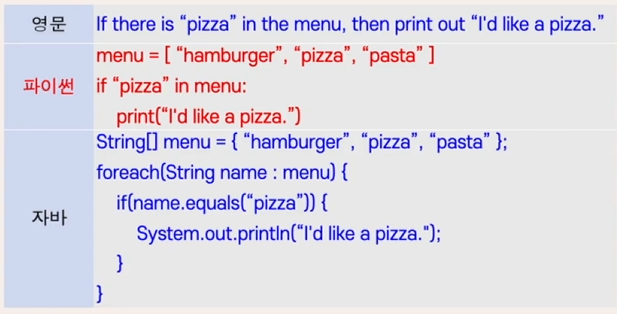
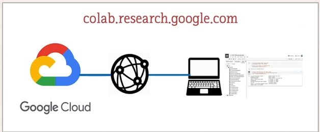
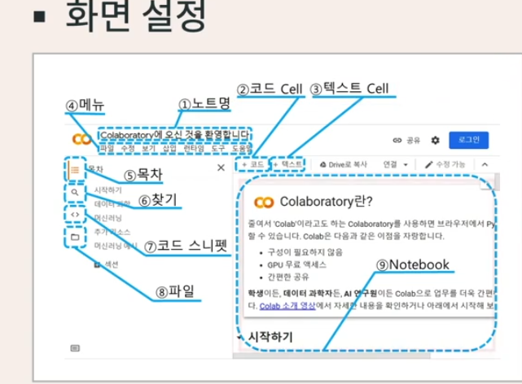
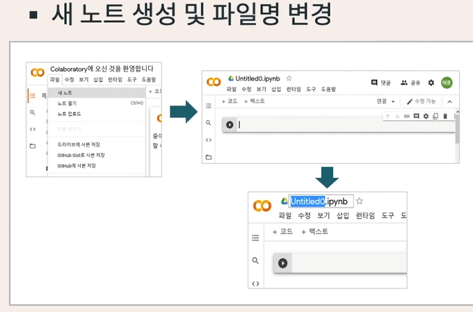
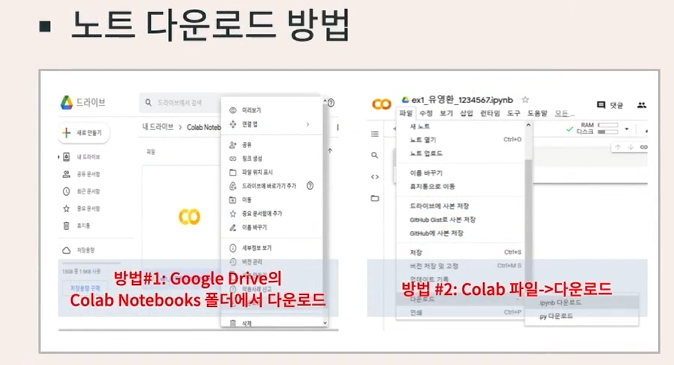

# Python

> Notion 원본: <https://www.notion.so/2a35a06fd6d380e2a350f1f8ab9ca0b1>
> 동기화일: 2026-04-21

> 이미지 다운로드 실패 알림: 본 환경의 HTTP 프록시 정책상 S3 호스트(`prod-files-secure.s3.us-west-2.amazonaws.com`) 접근이 차단되어 이미지를 로컬로 내려받지 못했습니다. 아래 `` 링크는 Notion의 원본 Pre-signed URL을 유지하며, 서명 URL은 약 1시간 내 만료됩니다. 영구 보관이 필요한 경우 별도 경로에서 재다운로드가 필요합니다.

# 파이썬 시작하기

이론

- 파이썬의 특징
  - 자연어 유사성
    - 자연어와 유사
    - 자연어에 가까울수록 사람이 배우기 좋다

      

  - 간결성
    - 짧은 코드
    - 단순한 문법
      - 예) 들여쓰기를 통해 코드 묶음 지정
      - 같은 자리 수만큼 들여쓰기가 되어 있는 연속적인 문장들은 하나의 묶음으로 인식
      - 잘 정리되고 간결함
    - 비교
      - C, C++, 자바 등 : 중괄호({}) 사용
      - 엔트리: 블록으로 묶음
  - 코드 재사용성
    - 오픈 소스 활용
    - 웹 개발, 과학 수치 연산, 데이터 분석, 인공지능 등 다양한 분야를 위한 파이썬 도구들이 공유되고 쉽게 사용
    - 빠른 개발 속도
- 파이썬 활용 사례
  - 인터넷 데이터 수집
  - 데이터 시각화
  - 머신러닝
  - 이미지 및 영상 데이터 처리
  - 음성 인식 및 합성

실습

- 인터프리터 vs. 컴파일러
  - 컴퓨터가 쓰는 말(기계어)은 인간의 언어와 다르다.
    - 음소가 0과 1 두 개
    - 0과 1의 조합으로 몇 가지 기본 명령 구성
    - 기본 명령을 순차적으로 수행하여 복잡한 목표 달성
  - 프로그래밍 언어
    - 인간이 이해할 수 있는 자연어 유사 언어 (예) 파이썬, C, C++, 자바,
    - 실행을 위해서는 기계어로 번역 필요
  - 프로그래밍 언어 → 기계어 번역 프로그램
    - 컴파일러 : 전체 프로그램을 한 번에 번역
    - 인터프리터 : 한 문장씩 번역
  - 파이썬은 대표적인 인터프리터 언어
  - 파이썬을 '내 컴퓨터'에서 사용하기 위해서는 인터프리터와 통합 개발 환경 설치 필요
- Google Colab 소개
  - 통합개발환경 설치 없이 웹 접속만으로 파이썬 프로그램 개발 가능
  - 최신 공개 라이브러리 지원

    

  

  

  

  

