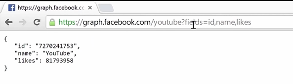

# REST API

<aside>
💡 **결국, REST API는 서로 다른 API가 Data를 HTTP Protocol을 통해 주고 받을 때, JSON, XML등을 이용하여 통신하는 방식 및 방법론**

</aside>

<aside>
💡 HTTP URL을 통해 자원을 명시하고, HTTP Method(POST(생생, Create), GET(조회, Read), PUT(수정, Update), DELETE(삭제, Delete))를 통해 해당 자원에 대한 CRUD Operation을 적용한다.

</aside>

- REST API 정의
    - API : Application Programming Interface, 기본적으로 한 소프트웨어가 다른 소프트웨어와 통신할 수 있도록 하는 것.
    - REST API : Representational  State Transfer API. 표현 상태 전송 API.  
    → 자원(R*esource*)을 이름(R*esource Representation*)으로 구분하여 해당 자원의 상태(State), 정보를 주고 받는 모든 것.
    - REST는 기본적으로 웹의 기존 기술과 HTTP 프로토콜을 그대로 활용하기에, 웹의 장점을 최대한 활용할 수 있는 소프트웨어 개발 이키텍쳐의 한 형식.
    - REST는 자원 기반의 구조(ROA, Resource Oriented Architecture) 설계의 중심에 Resource가 있고, HTTP Method를 통해 Resource를 처리하도록 설계된 아키텍쳐.
    - 현대에 이르러서는 반드시 그럴 필요는 없지만, 기본적으로 REST API는 웹과 거의 동일하게 작동한다. 클라이언트가 서버를 호출하고, HTTP 프로토콜을 통해 데이터를 다시 가져온다.
    - REST API와 일반 웹 페이지 로드 간의 많은 유사성을 보여주는 좋은 방법 중 하나는 Facebook의 그래프에서 찾을 수 있다. 
    → [www.facebook.com/youtube](http://www.facebook.com/youtube) → Facebook의 youTube 페이지.
    → [graph.facebook.com/youtube](http://graph.facebook.com/youtube) → JavaScript Object Notation, JSON 방식의 데이터 확인 가능. (KET : VALUE로 이루어진)
    - URL에 Id, 이름, 좋아요에 대한 필드값을 추가 시 해당 정보만 반환됨을 확인할 수 있다. 
    → 매개변수가 해당 Response에서 얻은 데이터를 필터링 했다는 의미.
        
        
        
    - 아래의 이미지를 통해 REST API의 Response에 대해 확인 가능하다.
        
        
        
    - HTTP/1.1 200 OK  : 
    → 모든 것이 정상적으로 작동했다는 의미.
    - X-Ratelimit-Limit : 5000
    → 하나의 엑세스 토큰을 사용하여 Instagram API에 대해 만들 수 있는 총 요청 수인 5000개의 ex-rate 제한이 있다는 의미.
    - X-Ratelimit-Remaining : 4994
    → 남은 X-Rate 제한 확인.
    - Set-Cookie, Content-Type : 
    → 쿠키 및 콘텐츠 유형 애플리케이션 JSON 유형 확인 가능.
    - REST의 전략 : 
    → 이전 필드를 삭제하지 말고 지원하라.
    → rel-based한 링크를 사용하여 client가 URI를 하드코드하지 않게 한다.
    → old 링크들을 가능한 한 오래 보유해라. URI가 바뀐다고 하더라고 기존 rels를 보유하여 기존 고객들이 새로운 기능으로 연결되게 하라. 
    → 클라이언트에게 다양한 상황에서 행동들을 알려주기 위해 데이터를 단순 적재 하지말고 Link를 사용해라.
- REST의 장단점
    - 장점
        - HTTP 프로토콜의 인프라를 그대로 사용하므로 REST API 사용을 위한 별도의 인프라 구축의 필요가 없다.
        - HTTP 프로토콜의 표준을 최대한 활용하여 여러 추가적인 장점을 함께 가져갈 수 있게 해 준다.
        - HTTP 표준 프로토콜에 따르는 모든 플랫폼에서 사용이 가능하다.
        - Hypermedia API의 기본을 충실히 지키면서 범용성을 보장한다.
        - REST API 메시지가 의도하는 바를 명확하게 나타내므로 의도하는 바를 쉽게 파악할 수 있다.
        - 여러가지 서비스 디자인에서 생길 수 있는 문제를 최소화한다.
        - 서버와 클라이언트의 역할을 명확하게 분리한다.
    - 단점
        - 표준이 존재하지 않는다.
        - HTTP Method 형태가 제한적이다.
        - 테스트할 일이 많은 서비스라면 HTTP Header의 복잡성이 커진다.
        - 구형 브라우저에서 제대로 지원해주지 못 하는 부분이 존재한다.
- 구성 요소
    - 자원(Resource) : URL
    
    → 모든 자원에 고유한 ID가 존재하고, 이 자원은 Server에 존재한다.
    → 자원을 구분하는 ID는 ‘/groups/:group_id’와 같은 HTTP URL이다.
    → Client는 URL을 이용해서 자원을 지정하고 해당 자원의 상태(정보)에 대한 조작을 Server에 요청한다.
    - 행위(Verb) : HTTP Method
    
    → HTTP 프로토콜의 Method를 이용한다.
    → HTTP 프로토콜은 GET, POST, PUT, DELETE와 같은 메서드를 제공한다.
    - 표현(Representation of Resource)
    
    → Client가 자원의 상태(정보)에 대한 조작을 요청하면 Server는 이에 적절한 응답(Representation)을 보낸다.
    → REST에서 하나의 자원은 JSON, XML, TEXT, RSS등 여러 형태의 Representation으로 나타내어질 수 있다.
    → JSON 혹은 XML을 통해 데이터를 주고 받는 것이 일반적.
- 특징
    - Server-Client 구조
    
    → 자원이 있는 쪽이 Server, 자원을 요청하는 쪽이 Client가 된다. 
    → 상호 의존성이 줄어든다.
    
    - Stateless
    
    → HTTP 프로토콜은 Stateless Protocol이므로 REST 역시 무상태성을 가진다.
    → Client의 context를 Server에 저장하지 않는다. (Session과 Cookie같은 Context정보를 신경쓰지 않아도 된다. 즉, 구현이 단순해진다.)
    → Server는 각각의 요청을 완전히 별개의 것으로 인식하고 처리한다.(비동기식)
    → 작업을 위한 상태정보를 따로 저장하거나 관리하지 않는다.
    
    - Cacheable(캐시 처리 가능)
    
    → 웹 표준 HTTP 프로토콜을 그대로 사용하므로 웹에서 사용하는 기존 인프라 활용 가능
    → HTTP 프로토콜 표준에서 사용하는 Last-Modified 태그나 E-Tag를 이용하여 캐싱구현 가능
    → 캐시 사용을 통해 응답시간이 빨라지고, REST Server 트랜잭션이 발생하지 않아 응답 시간, 성능, 서버의 자원 이용률 향상 가능
    
    - Layered System(계층화)
    
    → Client는 REST API Server만 호출한다.
    → REST Server는 다중 계층으로 구성될 수 있다.
    → API Server는 순수 비지니스 로직을 수행하고 그 앞단에 보안, 로드 밸런싱, 암호화, 사용자 인증 등을 추가하는 방식으로 구조상의 유연성을 줄 수 있다. 
    → 로드 밸런싱, 공유 캐시 등을 통해 확장성과 보안성을 향상시킬 수 있다.
        
        → PROXY, 게이트웨이 같은 네트워크 기반의 중간 매채 사용 가능
        
    - Code-On-Demand(optional)
    
    → Server로부터 스크립트를 받아 Client에서 시행한다.
    → 반드시 충족할 필요는 없다.
    
    - Uniform Interface(인터페이스 일관성)
    
    → URL로 지정한 Resource에 대한 조작을 통일되고 한정적인 인터페이스로 수행하는 아키텍쳐 스타일
    → HTTP 표준 프로토콜에 따르는 모든 플랫폼에서 사용 가능 ( 특정 언어나 기술에 종속되지 않는다.)
    
    - Self-descriptiveness (자체 표현 구조)
    
    → REST API 메시지만 보고도 이를 쉽게 이해 할 수 있는 자체 표현 구조로 구성되어 있다.
- 설계 기본 규칙
    - Document : API를 효과적으로 사용할 수 있도록 각 API의 입력, 출력 및 끝점 URL을 설명하는 문서.
    - Collection Resources : 서버에서 관리하는 Directory로, 동일한 유형의 오브젝트 목록에 대한 Access를 제공한다.
    - Store : Client에서 관리하는 Resources 저장소.
    - URL은 정보의 자원을 표현해야 한다.
    
    → Resource는 동사보다는 명사를, 대문자보다는 소문자를 사용한다.
    → Resource의 Document 이름으로는 단순 명사를 사용해야 한다.
    → Resource의 Collection 이름으로는 복수 명사를 사용해야 한다.
    → Resource의 Store 이름으로는 복수 명사를 사용해야 한다.
    - 자원에 대한 행위는 HTTP Method로 표현한다.
    
    → URL에 HTTP Method가 들어가면 안된다.
    → URL에 행위에 대한 동사 표현이 들어가면 안된다.
    → 경로 부분 중 변하는 부분은 유일한 값으로 대체한다. (즉, id는 하나의 특정 resource를 나타내는 고유값이다.)
    
    - / 구분자는 계층 관계를 나타내는데 사용한다.
    - URL 마지막 문자에 / 구분자를 포함하지 않는다.
    
    → URL에 포함되는 모든 글자는 Resource의 유일한 식별자로 사용되어야 하며, URL이 다르다는 것은 Resource가 다르다는 의미이다. 
    →REST API는 분명한 URL을 만들어 통신을 해야 하기 때문에 혼동을 주지 않도록 URL 경로의 마지막에 / 구분자를 사용하지 않는다.
    
    - - 은 URL 가독성을 높이는데 사용한다.
    
    → 불가피하게 긴 URL 경로가 필요할 경우 하이픈을 사용한다.
    - 밑줄(_, underbar)는 사용하지 않는다.
    - URL 경로에는 소문자가 적합하다. 
    
    → RFC 3986(URL 문법 형식)은 URL 스키마와 호스트를 제외하고 대소문자를 구별하도록 규정하기 때문.
    - 파일 확장자는 URL에 포함하지 않는다.
    
    → REST API에서는 메시지 바디 내용의 포맷을 나타내기 위한 파일 확장자를 URL 안에 포함시키지 않는다. 
    → Accept Header를 사용한다.
        
        
        
    - 응답 상태 코드 :
        
        
        
        
        
        
        
- Code(Spring STS4 기준)
    
    
    
    - Spring Web에 대한 DI 필요.
    
    
    
    - 전달할 메시지의 Resource를 담은 Class 파일 생성. (Resource Representational Class)
    - 생성자 및 접근자가 있는 Java 객체가 필요하다.
        
        
        
    - RESTful 웹 서비스를 구축하기 위한 접근 방식에서 HTTP 요청은 Controller에 의해 처리된다. 이와 같은 구성 요소는 @RestController Annotation으로 식별되며, Resource Representational Class의 새 Instence를 반환하여 /greeting 에 대한 Get요청을 처리한다.
    - @GetMapping Annotation으로 HTTP Get 요청 Mapping
    - @RequestParam은 Query String의 매개 변수 이름의 값을 greeting() method의 ‘name’ 매개변수와 바인딩한다. Request에 name 매개변수가 없는 경우, 기본 Value of World가 사용된다.
    - Method의 본문을 Implement 하면 counter (AtomicLong Class의 생성자) 다음 값를 기반으로 ID 및 content 속성을 가진 새로운 Greeting 객체를 만들고 반환하며, greeting Template을 사용하여 지정된 이름의 형식(”Hello, %s!”)을 지정(formating)한다.
    - 기존의 MVC Controller와 달리, RESTful 웹 서비스 컨트롤러는 HTTP response body를 생성하기 위해 객체를 채우고 반환하는 방식을 취한다. 객체 데이터는 JSON, XML 등을 이용하여 HTTP  Response에 직접 기록된다.
    - @RestController Annotation을 통해 Method가 View 대신 Domain 객체를 반환한다.
    - 실행 화면 목록
        
        
        
    - 최초 접속 시 기존 지정된 id와 content 출력(AtomicLong으로 생성된 id 값 1과, template의 Hello와 @RequestParam의 defaultValue World)
        
        
        
    - URL에 name = User로 변경 시, @RequestParam의 defaultValue가 아닌 유저 입력값인 User로 변환된 것 확인 가능
    - id 값이 매 요청마다 변경되는 것은 동일한 GreetingController instance에서 작업이 이루어지며, counter 필드가 각 호출(Request) 마다 새로이 생성되어(instance) 증가, 반환되고 있다는 의미.
- HATEOAS
    - 개념
        - Hypermedia As The Engine Of Application State
        - 링크에 사용 가능한 URL을 리소스로 전달하여 client가 참고하여 사용할 수 있도록 하는 것.
        - 즉, REST Api를 사용하는 클라이언트가 전적으로 서버와 동적인 상호작용이 가능하도록 하는 것.
        - Spring HATEOAS는 Spring, 특히 Spring MVC로 작업할 때 HATEOAS 원칙을 따르는 REST 표현을 쉽게 생성할 수 있는 몇 가지 API를 제공한다. 해결하려고 하는 핵심 문제는 링크 생성 및 표현 어셈블리(assembly)다.
        - HATEOAS의 특징은 다음과 같다. 
        → 링크용 모델 클래스, 리소스 표현 모델
        → Spring MVC Controller Method를 가리키는 링크를 생성하는 링크 빌더 API
        → HAL과 같은 하이퍼미디어 형식 지원
        - Spring Boot는 다음을 수행한다.
        → HAL 지원 구성
        → Entity Link에 대한 지원 등록
        → 메시지 변환기 지원 연결
        - HATEOAS의 가장 큰 장점은 Client 사이드에서는 “rel”의 이름으로 요청 URI를 사용하기에, URI 수정이 발생하더라도 Client 사이드는 수정이 이루어지지 않는다.
    - 구현
        - 다음의 종속성 추가가 필요하다.
        - pom.xml 기준
            
            
            
        - gradle 기준
            
            
            
        - 서비스는 선택적으로 쿼리 문자열의 매개변수를 사용하여 요청 /greeting을 처리 할 리소스를 노출한다. 요청은 인사말을 나타내기 위해 본문에 JSON이 포함된 응답을 반환해야 한다.
        - 그 외에도 리소스의 JSON 표현은 _links 속성의 하이퍼미디어 요소 목록으로 보강된다. 이것의 가장 기본적인 형태는 리소스 자체를 가리키는 링크다. 표현은 아래와 유사해야 한다.
            
            
            
        - 인사말의 Context 텍스트 표현이다. _links 요소에는 링크 목록이 표현되어 있다. (이 경우, rel 관계 유형 및 엑세스된 리소스를 가리키는 href 속성과 정확하게 일치한다.)
        - 인사말 표현을 모델링하려면 리소스 표현 클래스를 만든다. _links 속성은 표현 모델의 기본 속성이기 때문에 Spring HATEOAS는 링크의 인스턴스를 추가하고 이전에 표시된 대로 렌더링되도록 하는 기본 클래스(RepresentationModel)와 함께 제공된다.
            
            
            
            
            
        - JsonCreator를 import 함으로서 Jackson이 POJO의 인스턴스를 생성할 수 있는 방법을 알려준다.
        - JsonProperty를 import 함으로서 jackson이 이 생성자 인수를 넣어야 하는 필드를 표시한다.
        - Spring의 RESTful 웹 서비스 구축에 대한 접근법에서 HTTP 요청은 Controller에 의해 처리되므로, 구성 요소는 @Controller Annotation과 @ResponseBody Annotation을 결합한 @RestController Annotation으로 식별된다.
        - 아래의 Greeting Controller는 greeting() 클래스의 새 인스턴스를 반환하여 /greeting에 대한 GET 요청을 처리한다.
            
            
            
        - @RequestParam은 쿼리 문자열 매개 변수 이름의 값을 greeting() 메서드의 이름 매개 변수로 바인딩한다. defaultValue 특성을 사용하기에 이 쿼리 문자열 매개 변수는 암묵적으로 필요하지 않다. 요청에 없으면 기본 Value of World가 사용된다.
        - @RestController Annotation 이 클래스에 있으므로 암시적 @ResponseBody Annotation이 greeting() 메서드에 추가된다. 따라서 Spring MVC는 반환된 HttpEnttity와 해당 페이로드(Greeting)을 응답에 직접 렌더링한다.
        - Spring의 HATEOAS는 다양한 X-FORWARDED-Headers를 존중한다. 프록시 뒤에 Spring HATEOAS 서비스를 두고 X-FORWARDED-HOST Headers로 올바르게 구성하면 결과 링크가 올바르게 포멧된다.
        - linkTo()와 methodOn()은 ControllerBuilder의 static method이다. Controller에 가짜 method call을 만든다. 리턴 된 LinkBuilder는 컨트롤러 메서드의 매핑 Annotation을 검사하여 메서드가 매핑 된 URI를 정확하게 빌드한다. 그리고 withSelfRel()은 Greeting 표현 모델의 Link 인스턴스를 마든다.
        - withSelfRel()을 사용하여 호출하면 Greeting 표현 모델에 추가하는 링크 인스턴스가 생성된다.
            
            
            
        - 최초 접속시 위와 같은 기본 Context 표현이 나타난다. 이후 쿼리 문자열에 내용을 추가하여 아래와 같은 페이지를 표현할 수 있다.
            
            
            
        - 이 변경사항을 통해 greeting Controller의 @RequestParam 배열이 예상대로 작동했음을 알 수 있다. name 매개변수에 World의 기본값이 지정되었지만, 쿼리 문자열을 통해 항상 명시적으로 재정의할 수 있다.
    - HAL
        - Hypertext Application Language
        - 리소스와 API 사이를 하이퍼링크를 쉽게 하고 일관성 있게 하기 위한 간단한 포맷이다. HAL을 도입하는 것은 API를 탐색가능하게 하고 문서화 된 것이 API 자체에서 쉽게 보인다. 간단히 말해 API가 일을 쉽게 하고 클라이언트 개발자들에게 더 매력적으로 다가온다.
- References
    
    [REST API concepts and examples](https://www.youtube.com/watch?v=7YcW25PHnAA)
    
    [[Network] REST란? REST API란? RESTful이란? - Heee's Development Blog](https://gmlwjd9405.github.io/2018/09/21/rest-and-restful.html)
    
    [Building REST services with Spring](https://spring.io/guides/tutorials/rest/)
    
    [Building a RESTful Web Service](https://spring.io/guides/gs/rest-service/)
    
    [REST API 제대로 알고 사용하기 : NHN Cloud Meetup](https://meetup.toast.com/posts/92)
    
    [[Spring] RESTful의 HATEOAS 관련 내용 정리 - RESTful 하려면 어떤 조건들이 필요할까?](https://pjh3749.tistory.com/260)