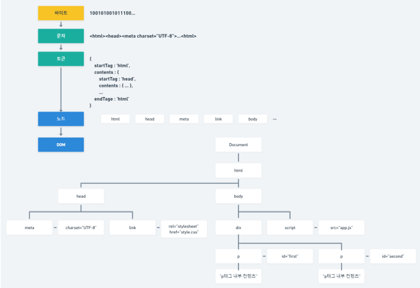

# React - 김용승 강의

# Intro



- 개요, React를 사용하는 이유
    
    
    
    - HTML을 웹 브라우저에서 파싱(이해) 해서 DOM(Node)로 만든다.  
    → 관련 이슈 : 크로스 브라우저 이슈
    - 노드들을 가지고 어떻게 화면을 구성할지를 정하는 것이 DOM Tree
    → DOM TREE의 구조는 document → html → head → body 같은 식.
    - DOM TREE는 구조, 뼈대이며, 구조를 어떻게 꾸밀지 정하는 것은 CSSOM Tree
    - CSSOM Tree도 Tree 구조가 필요하며, body로 시작한다. 
    → 각 트리 구조에 맞는 매칭이 필요하기 때문에
    → body → header section → article 같은 형식
    - Dom Tree와 CSSOM Tree를 결합한 것이 Render Tree
    - Render Tree 이후 화면에 그리는 것이 렌더링, 렌더(Render)
    - Rendering 이후 Data의 변화로 화면에 변화가 생겼을 때, 기존의 화면은 변경된 부분을 수정하는 것이 아닌, 새로 그려내는 방식으로 이루어졌다.
    - 이 불편함으로 나온 기술이 Ajax. 변경된 DOM을 지우고 해당 DOM만을 그려내는 것.
    - 단, Ajax 역시 DOM을 기반으로 새로 작성하는 과정을 가지기에, DOM 내부의 일부 Component의 변화에도 모든 DOM을 새로 작성하는 과정의 불편함에서 나온 것이 가상 DOM.
    - 그 가상 DOM을 다루는 기술이 바로 React
    - 가상 DOM은 기존의 Render Tree의 복사본 정도로 러프하게 이해할 수 있다.
    - 이 때 가상 DOM은 별도의 기능은 없고, Render Tree에 변경이 있었을 때 변경사항을 확인하기 위한 역할을 한다.
    - 가상 DOM의 장점은 가상 DOM을 기반으로 원본과의 차이를 비교 ()diffing, diff) 하는 과정을 가지기에 속도가 빠르다. (변경사항의 위치를 알고 있기에)
    - 또한, 변화한 부분만을 인지할 수 있기에 새로운 Render Tree를 Rendering 하는 과정을 거치지 않아도 된다.
    - jQuery는 사장되어 가고 있지만, React는 점점 더 떠오르는 추세.
- 개요, CDN, CORS, SOP
    - React에서는 기존의 Render Tree의 CSS 요소들을 state를 통해 별도로 관리한다.
    - React는 아직 Library. Library는 API들이 모여 있는 요소.
    - React의 다음 단계는 svelte. svelte는 가상 DOM을 사용하지 않고 Render Tree에서 일어날 수 있는 모든 변화의 경우를 알고리즘을 통해 분류, 관리하는 것.
    - CDN(Content delivery network) : 네트워크 트래픽을 감소시키기 위해 DB 허브에서 각 지역별로 DataSource를 보내고, 해당 지역의 가장 트래픽이 낮은 시간에 본사에서 데이터를 전송하는 방식.
    - SOP(Same Origin Policy) : 도메인 뒤의 QueryString의 변경 외에, 페이지 이동 시 도메인이 변경됐을 경우 접속을 막는 기술.
    - 단, 다른 도메인의 정보를 가져다 사용해야 하는 경우가 있다. 이 때 SOP 기술에 의해 접속이 막는 것을 방지하기 위한 기술이 CORS (Cross-Origin Resource Sharing)
    - Tag에 해당하는 Element Node(’h1’), Attribute Node(’greeting’), Text Node(’hello world’)
        
        ```jsx
        const greetingElement = React.createElement('h1', {id: 'greeting'}, 'hello world');
        ```
        
        <aside>
        💡 React.createElement를 사용해 h1번 태그를 표현하는 엘리먼트를 만들 수 있다. 
                    첫 번째 인자 : 만들려는 엘리먼트의 타입을 문자열로 정의한다.
                    두 번째 인자 : 만드는 엘리먼트의 프로퍼티를 표현한다.
                    세 번째 인자 : 엘리먼트의 자식 노드를 표현한다.
        
        </aside>
        
    - 이후 붙이고 싶은 요소 (”root” div)를 가져와서 Root로 삼는 것이 createRoot.
    - 이 후 루트에 렌더링(greetingElement)을 하는 것.
        
        ```jsx
        ReactDOM.createRoot(document.getElementById('root')).render(greetingElement);
        ```
        
        ```
        const domContainer = document.getElementById('root');
                const root = ReactDOM.createRoot(domContainer);
                root.render(greetingElement);
        ```
        
        
        
    - 렌더링(.render()) 시 Virtual Dom과 Real Dom을 Diffing, 변경 사항을 반영한다.
    - 단, 이 때 React Element는 리엑트에게 Dom 엘리먼트를 구성하는 방법을 알려주는 자바스크립트의 객체이며, 실제 DOM이 아니다.
    - 핵심은 렌더링 시(메소드를 호출하는 순간) 만들어둔 Element가 DOM이 되는 것.
- 개요, 함수 기반과 클래스 기반 컴포넌트
    - Element를 만들고 반환하는 것이 Component의 역할.
    - 엘리먼트 : 요소 노드, 어트리뷰트 노드, 텍스트 노드로 만들어지는 가상 DOM 개념
    - 컴포넌트 : 엘리먼트를 반환하는 개념을 가진 화면의 구성 단위
        
        ```jsx
        // 클래스형 컴포넌트
        class HelloWorld extends React.Component {
            render(){
                return React.createElement(
                    'h1',
                    {className: 'greeting'},
                    'Hello world'
                );
            }
        }
        
        // 함수형 컴포넌트 
        function HelloWorld() {
            return React.createElement('h1', {className: 'greeting', id : 'test'}, 'Hello world');
        }
        ```
        
        - 컴포넌트의 생성 방식은 리엑트 16이후 추가된 함수 기반의 컴포넌트 생성 방법이 주된 방식이다.

# Component - JSX

- JSX Intro
    - 바벨(Babel) : ES6+, ES next 문법을 ES5 문법으로 변환해 주는 도구이다. 추가로 JSX를 순수 리엑트로 변환해 주는 기능이 포함되었다. (바벨이 JSX 처리 표준으로 사용된다.)
        - 바벨 적용 방법(CDN)
            1. 바벨 CDN 구문을 추가한다.
            2. script 태그 type 속성(MIME 타입)에 text/bable 속성값을 추가한다.
                
                ```jsx
                <script type="text/babel">
                        const helloworld = <h1>Hello World!</h1>;
                
                        ReactDOM.createRoot(document.getElementById('root')).render(helloworld);
                    </script>
                ```
                
    - JSX : javascript xml. javascript를 xml 형식으로 적어도 해석, 변환할 수 있게 해 준다. (바벨 필요)
        - xml(Extensible Markup Language) : 마크업 랭귀지(markup language). 키(<h1>)와 값(Hello World!)으로 이루어진 형식.
- Expression In JSX
    - JSX 문법 내에 중괄호를 이용하여 모든 javascript 표현식(문법)을 넣을 수 있다.
    
    ```jsx
    <script type="text/babel">
    
        function formatName(user) {
            return `${user.lastName} ${user.firstName}`;
        }
    
        const user = {
            firstName : 'Gildong',
            lastName : 'Hong'
        };
    
        const element = <h1>Hello, {formatName(user)}</h1>;
    
        ReactDOM.createRoot(document.getElementById('root')).render(element);
    
    </script>
    ```
    
- Fragment
    - JSX는 편리한 문법이지만 몇가지 규칙을 준수해야 한다. 동일 레벨의 노드들이 연달아 정의되는 경우 문법적인 에러가 발생하게 된다.
        - 최상위 엘리먼트가 두 개 이상이면 에러가 발생한다. (하나의 돔 트리만 생성해야 한다.)
            
            ```jsx
            const element = (
               <h1>Hello</h1>
               <h3>phone</h3>
            );
            ```
            
        - 2. <div> 태그로 감싸서 하나의 돔 트리를 생성할 수 있도록 한다.
            
            ```jsx
            const element = (
                <div>
                    <h1>Hello, {user.name} </h1>
                    <h3>phone: {user.phone} </h3>
                </div>
            );
            ```
            
        - 3. <React.Fragment>로 감싸서 형식상의 돔 트리상 상위 엘리먼트를 만들어 준다.
            
            ```jsx
            const element = (
                <React.Fragment>
                    <h1>Hello, {user.name} </h1>
                    <h3>phone: {user.phone} </h3>
                </React.Fragment>
            );
            ```
            
        - 4. React 라이브러리로부터 Fragment 객체만 구조분해 할당을 해주면 React. 을 생략할 수 있다.
            
            ```jsx
            const Fragment = React.Fragment;
            //  const {Fragment} = React;
            	const element = (
                  <Fragment>
                      <h1>Hello, {user.name} </h1>
                      <h3>phone: {user.phone} </h3>
                  </Fragment>
              );
            ```
            
        - 5. React.Fragment의 축약 문법인 <></>로 감싸서 사용할 수 있다. (Babel 17 이상부터 지원함)
            
            ```jsx
            const element = (
                <>
                    <h1>Hello, {user.name} </h1>
                    <h3>phone: {user.phone} </h3>
                </>
            );
            ```
            
- Attribute
    - JSX를 이용해 엘리먼트를 정의할 시 attribute도 정의할 수 있다.
    - 주의할 사항은 class라는 속성은 className이라는 속성으로 사용해야 한다.
    - 또한 이벤트 관련 속성은 낙타봉 표기법이라는 점에 유의한다.(onclick -> onClick)
        - 문자열로 속성값 정의하는 방법
            
            ```jsx
            const element = <h1 id="title" className="highlight">Hello World!</h1>;
            ```
            
            - 문자열 방식은 이벤트 관련 어트리뷰트는 적용되지 않는다.
        - javascript 표현식을 이용하는 방법
            
            ```jsx
            const element = <h1 id={id} className={className} onClick={test}>Hello World!</h1>
            
            function test(){
                console.log('클릭했네');
            }
            ```
            
- Inline Styling Attribute
    - 다수의 style을 적용하기 위해선 별도의 style 객체를 만든 뒤 js 표현식 방식으로 해당 객체를 적용하는 방법으로 사용한다.  (중괄호를 다수 사용하여 적용은 가능하다.)
    - 단, 케밥 표기법을 캐멀 케이스로 작성해야 하며 속성 값은 문자열 혹은 숫자 형태로 작성해야 한다. (객체를 사용하면 안 된다.)
        
        ```jsx
        const style = {
            backgroundColor : 'black',
            color : 'white',
            cursor : 'pointer',
            textAlign : 'center',
            paddin: 20                      // 단위를 작성하려면 문자열로 사용하지만 단위를 생략하면 숫자만 사용 가능(생략 시 px를 붙인다.)
        }
        
        const element = (
            <>
                <h1 style={style}>Hello World!</h1>
                <h3>inline styling test</h3>
            </>
        );
        ```
        
- Event Attribute
    - JSX에서 이벤트 속성을 표현식으로 연결하여 사용할 수 있다.
        1. 인라인으로 간단한 이벤트 적용 시 JSX의 자바스크립트 표현식 내에 이벤트 핸들러 함수(이벤트 처리 함수) 작성
            
            ```jsx
            const element = (
                <>
                    <h1>Event Attribute</h1>
                    <button onClick={() => alert(`Hello World!`)}> 클릭하세요</button>
                </>
            );
            ```
            
        2. 이벤트 동작 시 사용할 이벤트 핸들러 사전 정의 후 JSX 내에 표현식으로 사용
            
            ```jsx
            const onClickHandler = () => {
                alert(`Hello world!`);
            };
            
            const element = (
                <>
                    <h1>Event Attribute</h1>
                    <button onClick={onClickHandler}> 클릭하세요</button>
                </>
            );
            ```
            
- Comment In JSX
    - JSX 내에서의 주석을 작성하는 방법은 일반적인 자바스크립트의 주석을 작성할 때와는 조금 다르다. 그 방식은 아래와 같다.
        
        ```jsx
        const element = (
            <>
                <h1>Comment In JSX</h1>
                {/* JSX 내에서의 주석은 이렇게 작성한다. */}
                {
                    // JSX 내에서의 한 줄주석은 표현식을 한줄이 아닌 여러 줄로 작성하면 적용할 수 있다.
                }
                <h3 
                    className="text" // 시작 태그에도 주석을 작성할 수 있다.
                >
                    JSX 내의 주석 사용하는 방법
                    {
                        // 한 줄 주석
                    }
                </h3>   {/* 닫기 태그는 태그 내부에 주석을 일반적으로 하지 않는다. */}
                /* 이런 주석이나 */
                // 이런 주석은 그대로 화면에 나타나게 된다.
            </>
        );
        ```
        

# Component - Rendering

- Rendering Element
    - <div id=”root”></div> 안에 들어가는 모든 엘리먼트를 ReactDOM에서 관리하기 때문에 이것을 루트(root) DOM 혹은 루트 Node라고 부른다.
    - 일반적으로 React로 구현된 애플리케이션은 하나의 루트 DOM이 있다.
    - 단, 리액트를 기존 앱에 통합하려는 경우 원하는 만큼의 독립된 루트 DOM노드를 가질 수도 있다.
    - React Element를 루트 DOM 노드에 랜더링 하려면 ReactDOM.createRoot(루트 DOM노드).render(랜더링 할 엘리먼트)로 전달하면 된다.
        
        ```jsx
        ReactDOM.createRoot(document.getElementById('root')).render(element);
        ```
        
- Rendered Element
    - React는 최초 생성 시에는 가상 DOM의 태그들을 실제 DOM Tree에 Rendering 한다. 이후에는 가상 DOM과 실제 DOM Tree를 비교(diff 알고리즘 사용)하여, 다른 점만 새로 Rendering한다.
        - 리액트 엘리먼트는 실제 DOM과는 다르게 메모리상에서 연산되는 가상의 돔(virtual DOM)이다. 엘리먼트를 새롭게 만들면 render 호출 시 가상 DOM에 새로운 엘리먼트를 생성하고 실제 렌더트리와 비교한다. (diff 알고리즘 사용) 비교한 결과 변화가 있는 부분만 변경이 일어난다.
            
            ```jsx
            let root = ReactDOM.createRoot(document.getElementById('root'));
            
            function tick() {
                const element = (
                    <>
                        <h1>What time is it now?</h1>
                        <h3>It is {new Date().toLocaleTimeString()}</h3>
                    </>
                );
            
                root.render(element);       
            }
            
            setInterval(tick, 1000);
            ```
            
    - 리액트 엘리먼트는 불변객체(immutable)이다.
    - 엘리먼트를 생성한 이후에는 해당 엘리먼트의 자식이나 속성을 변경할 수 없다.
    - 따라서 엘리먼트를 업데이트 하기 위해서는 완전히 새로운 엘리먼트를 만들고 ReactDOM.render로 다시 렌더링을 하는 방식을 사용한다.
    - 리액트의 컨셉은 변화가 있는 엘리먼트를 찾아서 어떻게 바꿀 것인지를 고민하는 것이 아닌 기존 가상돔의 엘리먼트를 지우고 새롭게 엘리먼트를 생성하는 방식으로 고안되었다.
- Conditional Rendering
    - 여러 개의 엘리먼트 중 특정 조건에 따라 하나의 엘리먼트만 렌더링할 수 있다.
        1.  렌더링 시 조건 비교 후 조건부 렌더링하기(조건식이 간단할 때) 
            
            ```jsx
            const positiveElement = <h1>앞으로 점점 더 재미있어 질 겁니다. </h1>;
            const negativeElement = <h1>재미있다고 그냥 믿으세요. </h1>;
            
            root.render(
                (answer === 1) ? positiveElement: negativeElement
            );
            ```
            
        2. JSX 내에서 조건부로 엘리먼트 생성하기(특정한 상황에 따라 다른 엘리먼트를 생성하는 것이 더 좋은 방법이다.)
            1. if문으로 조건부 엘리먼트 생성하기
                
                ```jsx
                let element;
                if(answer === 1) {
                
                    element = <h1>앞으로 점점 더 재미있어 질 겁니다.2 </h1>;
                
                } else {
                
                    element = <h1>재미있다고 그냥 믿으세요.2 </h1>;
                
                }
                ```
                
            2. 삼항연산자로 조건부 엘리먼트 생성하기(const와 삼항연산자를 쓰는 구문을 더 많이 사용한다.)
                
                ```jsx
                const element = (answer === 1) ? (
                    <h1>앞으로 점점 더 재미있어 질 겁니다.3 </h1>
                ) : (
                    <h1>재미있다고 그냥 믿으세요.3 </h1>
                );
                ```
                
            3. && 연산자를 이용한 조건부 엘리먼트 생성하기(조건이 맞을 때만 엘리먼트가 보이게 할 경우)
                
                ```jsx
                const element = answer === 1 && <h1>앞으로 점점 더 재미있어 질 겁니다.4 </h1>
                ```
                
                - false 조건을 가지고 렌더링을 하는 경우 조건에 일치하지 않으면 렌더링 되는 요소가 없지만 0은 Falsy한 값임에도 조건부 엘리먼트 생성을 하게 되면 0을 반환한다.

# Component

- Class Type Component
    - ES6에서 제공되는 클래스 문법을 이용해 렌더링 될 컴포넌트를 정의하는 방법을 제공한다.
    - render() 함수는 반드시 작성되어야 하며, 반환값으로는 렌더링 될 리액트 엘리먼트를 정의한다. (일반적으로 JSX 사용함)
    - JSX만으로도 리액트 엘리먼트를 정의할 수 있지만 클래스형으로 컴포넌트를 작성하게 되면 여러가지 장점이 있다.
    - 중복되는 엘리먼트를 추상화해서 컴포넌트로 작성하고, 작성된 컴포넌트를 재사용하는 것이 리액트가 추구하는 한 가지 방향이다.
    - 컴포넌트를 정의하는 방법은 클래스형 컴포넌트와 함수형 컴포넌트가 있다.
    - 사용하는 것은 함수형 컴포넌트가 더 간결하고 선언하기도 편하며, 메모리도 덜 사용하기에 더 권장되는 방식이다.
    - 하지만 state 사용 및 라이프 사이클 기능, 임의의 메소드 정의 등은 클래스 컴포넌트에서만 사용 가능한 방식이다.
    - 이러한 함수형 컴포넌트의 기능적 한계로 훅스(hooks)를 제공하고 있다.
        - 클래스형 컴포넌트를 만들게 되면 사용자 정의 컴포넌트를 엘리먼트 형태로 사용할 수 있다.(사용자 정의 태그처럼)
            
            ```jsx
            class Title extends React.Component {
                render() {
                    return (
                        <h1>Class Component</h1>
                    );
                }
            }        
            
            // 1. 앞글자 대문자, 2. 닫기 태그 존재, 3. 클래스나 함수 이름과 동일해야 한다.
            ReactDOM.createRoot(document.getElementById('root')).render(<Title/>);      
            ```
            
- Function Type Component
    - 함수형 컴포넌트는 간결하게 작성 가능하다.
    - 함수의 반환값으로 ReactElement만 정의해서 반환하면 된다. (일반적으로 JSX 사용)
    - 함수형 컴포넌트 작성 시 유의사항은 앞 글자를 대문자로 정의해야 한다는 것이다.
    - 사용자 정의 엘리먼트를 이용할 시 <Title/> 이런형태로 사용하게 되는데, 앞 글자가 소문자이면 html로 인식하게 되고 존재하지 않는 html 태그 엘리먼트이기 때문에 제대로 그려지지 않는다.
    - 함수형 컴포넌트의 단점은 state와 라이프사이클 API 사용이 불가능하다는 것이었는데 v16.8부터 hooks를 제공하며 이 문제가 해결되었다.
        
        ```jsx
        function Title(){
            return( 
                <h1>Function Component</h1>
            );
        }
        
        ReactDOM.createRoot(document.getElementById('root')).render(<Title/>);
        ```
        
- Component Composition
    - 컴포넌트는 자신의 출력에 따른 컴포넌트를 참조할 수 있다.
    - 컴포넌트는 재사용 가능한 크기로 작게 유지해야 하며, 순수 함수처럼 작성되어야 한다.
        
        ```jsx
        const user = {name, age, phone, email};         // property 단축 구문
        
        function NameCard() {
            return <h1>{user.name}</h1>;
        }
        
        function AgeCard(){
            return <h2 style={{color: 'orangered'}}>{user.age}</h2>;
        }
        
        function PhoneCard(){
            return <h3 style={{color: 'red'}}>{user.phone}</h3>;
        }
        
        function EmailCard(){
            return <h3 style={{backgroundColor: 'yellow'}}>{user.email}</h3>;
        }
        
        function UserInfo(){
            return (
                <div style={{width: 300, border: '1px solid black'}}>
                    <NameCard/>
                    <AgeCard/>
                    <PhoneCard/>
                    <EmailCard/>
                </div>
            );
        }
        
        ReactDOM.createRoot(document.getElementById('root')).render(<UserInfo/>);
        ```
        

# Component - Props


- Props Basic
    - Props는 properties의 약어로, 컴포넌트의 속성을 설정할 때 사용하는 요소이다.
    - props 값은 해당 컴포넌트를 사용하는 부모 컴포넌트에서 설정할 수 있다. (부모 컴포넌트가 없어도 props 재료를 컴포넌트에 줄 수 있다.)
    - props는 읽기 전용 객체이기 때문에 수정해서는 안된다.
    - Props는 부모 컴포넌트로부터 자식 컴포넌트가 물려받은 재료(Parameter)이며, 수정할 수 없는 값이다.
    - 리액트는 매우 유연하게 사용하지만 한 가지 엄격한 규칙이 있다.
        - 모든 React 컴포넌트는 자신의 props를 다룰 때 반드시 순수 함수처럼 동작해야 한다.
    - 동일한 입력값에 대해 동일한 결과를 반환하는 것을 순수 함수라고 하며, 컴포넌트는 반드시 이러한 순수 함수처럼 작성 되어야 한다.
        
        ```jsx
        const name1 = '홍길동';
        const name2 = '유관순';
        
        /* 컴포넌트 호출 시 props를 넘기지 않으면 props는 빈 객체가 생성된다. */
        function Title(props){
            return <h1>안녕하세요 {props.name}님 반갑습니다. </h1>;
        }
        
        /* props.name이 존재하지 않는 경우 기본값 설정 */
        Title.defaultProps = {
            name: '기본이름'
        }
        
        ReactDOM.createRoot(document.getElementById('root')).render(
            [
        
                <Title name={name1}/>,
                <Title name={name2}/>,
                <Title name='이순신'/>,
                <Title/>                    
        
            ]    
        );
        ```
        
- Children Props
    - props.children은 자식 노드를 전달하는 역할로, 리액트 컴포넌트를 사용할 때 태그 사이의 내용을 props의 children 속성에서 관리한다.
        
        ```jsx
        function ChildNodePrinter(props){
            console.log(props);
        
            return (
        
                <>
                    <h1>자식 노드가 가지고 있는 값은?</h1>
                    <h3>children:<font style={{color: 'orangered'}}>{props.children}</font> </h3>
                </>
            )
        }
        
        ReactDOM.createRoot(document.getElementById('root')).render(
            [
                <ChildNodePrinter>텍스트 노드</ChildNodePrinter>,
                <ChildNodePrinter><div>텍스트 노드</div></ChildNodePrinter>,
                <ChildNodePrinter><div>1</div><div>2</div><div>3</div></ChildNodePrinter>
            ]
        );
        ```
        
        - children을 통해 자식 노드에 접근할 수 있다.
- Props Destructuring Assignment
    - 구조분해할당 문법을 사용해 Props로 전달받은 인자들을 편리하게 사용할 수 있다. (props. 생략 가능)
        1. 전달 받은 props 인자를 내부에서 구조 분해 할당을 이용해 사용하는 방법
            
            ```jsx
            function PropsPrinter(props){
            
                /* props 객체에서 name과 children이라는 key를 가진 프로퍼티 값을 꺼내 동일한 이름의 변수에 할당한다. (객체 구조 분해 할당) */ 
                const {name, children} = props;
                return (
                    <>
                        <h1>제 이름은 {name} 입니다.</h1>
                        <h3>제가 가지고 있는 children은 {children}입니다.</h3>
                    </>
                )
            }
            ```
            
        2. 매개변수에서 구조 분해 할당
            
            ```jsx
            function PropsPrinter({name, children}){
            
                return (
                    <>
                        <h1>제 이름은 {name}입니다.</h1>
                        <h3>제가 가지고 있는 children은 {children}입니다. </h3>
                    </>
            
                )
            }
            ```
            
- Props Type Verify
    - props를 통해 매개변수를 던질 경우 변수의 타입을 제한, 오류를 발생시킴으로서 유효성을 검증할 수 있다.
    - 별도의 라이브러리를 cnd 방식으로 추가한 후
        
        ```jsx
        PropsVerify.propTypes = {
        	name : PropTypes.String,                        // name props의 속성은 string 형이어야 한다.
          favoriteNumber: PropTypes.number.isRequired     // favoriteNumber props의 속성은 number형이면서 필수값이다.
        }
        ```
        
        - 위 방식으로 유효성을 검증한다.
    - 검증시 동작은 잘 하긴 하지만 props의 name 타입이 잘못 되었다는 것을 콘솔의 warning을 통해 알려주게 된다.
    - 필수적인 설정은 아니지만 큰 규모의 프로젝트를 진행한다거나 다른 개발자와 협업한다면, 해당 컨포넌트에 어떤 props가 필요한지 쉽게 알 수 있게 해서 개발 능률이 좋아질 수 있다.

# Component - State

<aside>
💡 State 사용을 통해 선택자로 노드 요소를 가져오지 않아도 노드 요소를 관리할 수 있다.
State의 변화 시 Rerendering 된다.

</aside>

- State Basic
    - state는 컴포넌트 내부에서 바꿀 수 있는(바뀔 수 있는) 값을 의미한다.
    - props는 컴포넌트가 사용되는 과정에서 부모 컴포넌트가 설정하고 주는 읽기 전용 값이지만 state는 컴포넌트 내부에서 설정되는 값이다.
    - 리액트는 클래스형 컴포넌트에서 state를 직접 사용할 수 있다. 하지만 함수형 컴포넌트에서는 직접 state를 사용하는 것이 불가능하다. 따라서 함수형 컴포넌트에서도 state를 관리할 수 있는 기능을 useState라는 hooks로 제공하고 있다.
        
        ```jsx
        class Counter extends React.Component{
        
            constructor(props) {
                
                super(props);       // 반드시 명시해야 한다.
        
                this.state = {
                    number: 0               // 변경 될 관리할 값이다. 초기값을 설정한다.
                };
            }
        
            render() {
        
                const {number} = this.state;
        
                return (
                    <>
                        <h1>{number}</h1>
                        <button onClick={() => this.setState({ number : number - 1})}>- 1</button>
                        <button onClick={() => this.setState({ number : number + 1})}>+ 1</button>
                    </>
                );
            }
        }
        ```
        
        - 클래스형 컴포넌트는 React.Component를 extends 해서 구현하며, props를 매개변수로 받아 state를 사용하기 위해 constructor를 사용한다. 이 때 constructor는 가장 먼저 호출되며, super를 통해 부모 컴포넌트로부터 전달받은 props를 부모 클래스의 생성자에 전달하면서 컴포넌트를 생성한다. (constructor는 생략 시 자동 생성된다.)
        - 생성자 안에서 state는 3개의 규칙이 필요하다.
            1.  state는 this.를 명시해야 한다.
            2. 이름은 반드시 state여야 한다.
            3. state에 저장되는 값의 형태는 반드시 Object 리터럴 형태로 작성해야 한다.
        - 클래스형 컴포넌트의 state값은 변경 시 별도의 메소드 setState()가 필요하다.
        - state의 변화는 state에 객체 형태로 컴포넌트가 관리할 값들이 저장되어 있을 때 state 객체의 프로퍼티에 직접 접근해서 수정하거나 state 객체를 직접 새로운 객체로 바꾸는 것이 아닌, state의 setter 메소드(setState())를 호출하고 관리할 값에 변화를 준 새로운 객체를 인수로 전달해야 한다.
        - 이 때 setState()를 통해 state에 변화를 주면 자동으로 render()는 재호출 된다.(라이프 사이클 관련). 그러면 render()가 반환하는 새로운 엘리먼트를 가상DOM에 갈아끼우게 되고 실제 DOM Tree와 차이나는 부분만 확인해서 화면에서 차이나는 부분만 다시 그려주게 된다.
- Prev State
    - 클래스의 속성으로도 state를 추가하는 것도 가능하다. (이 때 this.는 사용 불가능하다.)
        
        ```jsx
        class Counter extends React.Component{
            state = {
                number: 5
            };
        }
        ```
        
    - this.state로는 함수 안에서 시간의 흐름에 따른 백그라운드 값을 활용한 누적 개념을 할 수 없다. 이는 비동기 방식으로 state를 백그라운드에서 업데이트 하기 때문에 상태를 변경하는 것이 이 함수에서 반영되는 상태가 아니기 때문이다. state는 메모리에만 임시로 변경된 상태를 가지고 해당 함수가 종료되면 마지막 setState 함수만 변경 내역으로 반영한다.
        - this.setState를 사용할 시 상태가 비동기방식으로 백그라운드에서 업데이트 된다.
        - 또한, 하나의 이벤트 핸들러에서 여러 번 setState를 호출한다고 해도 동기적으로 누적해서 state 변화를 취급하지 못한다.
    - 이러한 문제를 해결하기 위해서는 setState에 콜백함수를 넘기고 prevState를 이용하면 된다. (실시간으로 변화되는 state 객체를 활용할 수 있고 결과적으로 수정하는 state도 실시간으로 변화된 결과를 반영할 수 있다. (state 변화 누적))
        - 즉, 변경할 state 객체 대신 함수를 인자로 전달하는 것이다. 전달하는 콜백 함수의 첫 번째 인자는 이전 상태 값을 가리키는 prevState이며, 두 번째 인자는 현재 컴포넌트가 가지는 props이다. (props는 생략 가능)
            
            ```jsx
            <button onClick = { () => {
            
              // console.log(`before setState number: ${this.state.number}`);        
              // this.setState({number: number + 1})
              // console.log(`after setState number: ${this.state.number}`);
              // this.setState({number: this.state.number + 1})
              // console.log(`final setState number: ${this.state.number}` );         
            	/* 3개의 값은 같으며, 값은 변화가 일어나기 전의 값으로 출력된다. 
            		 (즉, 랜더링 되기 전의 값으로 출력된다. 이는 state의 변화가 
            			rendering 이후 발생하기 때문이다.)
            	*/  
            
            		// 콜백 함수를 통한 prevState 인자 전달, state 변경
                this.setState((prevState, props) => {
                    return {
                        number : prevState.number + 1
                    };
                });
            
                this.setState((prevState, props) => { 
                    return {
                        number : prevState.number + 1
                    };
                });
            
                this.setState(prevState => {return { number : prevState.number + 1}});
                /*
                    화살표 함수에서 중괄호({}) 생략 및 return 구문 생략 시 반환값이 리터럴
                    객체라면 소괄호(())를 씌워야 리터럴 객체를 반환한다. 
                */
                this.setState(prevState => ({ number : prevState.number + 1}));
                
              }}
            > 
            +1 
            </button>
            ```
            
- After Set State
    - setState 실행 이후 특정한 작업을 실행하고 싶을 때 두 번째 인자로 콜백함수를 전달하여 처리할 수 있다.
        
        ```
        <button onClick = {() => {
            this.setState(
                            {isOn : !isOn},
                            () => console.log(isOn? '불이 켜졌습니다' : '불이 꺼졌습니다')
                        )
        }}>
            {isOn? 'ON' : 'OFF'}
        </button>
        ```
        
- useState
    - 함수형 컴포넌트는 기본적으로 state를 사용할 수 없었다. 하지만 리액트 16.8버전 이후 useState라는 함수를 이용하여 함수 컴포넌트에서도 state를 관리하고 사용할 수 있게 되었다.
    - useState 함수는 함수형 컴포넌트 안에서 사용할 것, 반환형이 2칸짜리 배열이다.
        - 각각의 state에 해당하는 setter메소드로 state를 수정할 때마다 함수형 컴포넌트가 다시 실행된다. (리렌더링)
    - useState는 React 객체에서 내부에 존재하는 함수형 속성이다. 따라서 React.useState() 형태로 호출해서 사용해야 한다. 하지만 구조분해 할당을 이용하여 미리 전역 변수로 선언해두고 나면 React.을 생략하고 useState()로 사용할 수 있다.
        
        ```jsx
        const {useState} = React;
        ```
        
    - message라는 상태(state)와 setter 메소드를 배열 구조 분해 할당으로 각각의 변수에 할당한다. (여러 개의 상태들을 한 컴포넌트 내에서 사용해도 된다.)
        
        ```jsx
        const [message, setMessage] = useState('기본상태');
        ```
        
    - return() 을 통해 각 컴포넌트를 할당한다. 방식은 기존과 동일하다.
        
        ```
        return (
            <>
                <h1 style={{color, backgroundColor}}>{message}</h1>
                <div>
                    <button onClick={onClickEnter}>입장</button>    
                    <button onClick={onClicLeave}>퇴장</button>    
                </div>
                <div>
                    <button onClick = {() => setColor('red')}> 빨간색 </button>
                    <button onClick = {() => setColor('purple')}> 보라색 </button>
                    <button onClick = {() => setColor('green')}> 초록색 </button>
                </div>
                <div>
                    <button onClick = {() => setBackgroundColor('white')}> 기본 배경 </button>
                    <button onClick = {() => setBackgroundColor('black')}> 반전 배경 </button>
                </div>
            </>
        );
        ```
        

# Component - Event

- Event System
    - 리액트의 이벤트 시스템은 웹 브라우저의 HTML 이벤트와 인터페이스가 동일하기 때문에 사용 방법이 거의 유사하다. 하지만 몇 가지 주의 사항이 있다.
        1.  이벤트 속성의 이름은 케멀 표기법으로 작성해야 한다. (onclick -> onClick, 그 외에는 위 사이트 참조)
        2. 이벤트에 실행 할 자바스크립트의 코드를 전달하는 것이 아닌 함수 형태의 값을 전달한다.
            
            ```
            // 호출		
            html -> <button onclick ="alert('hello world')">클릭</button>
            // 함수 삽입
            react -> <button onClick = {() => alert('hello world')}>클릭</button>
            ```
            
        3. DOM 요소에만 이벤트를 설정할 수 있다. 
            - 컴포넌트에 onClick이라고 해서 전달하면 props 객체에 담기는 값이 될 뿐이다.
            - 하지만 컴포넌트 내부에서 props에 전달되어 온 함수를 이벤트 핸들러로 추가할 수 있다.
    - Event 연결 방식
        1.  직접 이벤트 속성에 이벤트 핸들러 함수 정의하며 이벤트 연결
            
            ```
            render() {
                console.log(this.props)
            
                return (
                    <button onClick = {() => alert('인라인 함수 이벤트')}>{this.props.children}</button>
                );
            }
            ```
            
        2. render 함수 외부에 이벤트 핸들러 함수 정의 후 함수 전달하여 이벤트 연결
            
            ```
            onClickHandler = () => alert('외부 함수 이벤트 동작 확인');
            
            /* 클래스 내부의 함수(메소드)를 호출 할 때는 this.를 반드시 붙여줘야 한다. */
            render() {
                return (
                    <button onClick = {this.onClickHandler}>버튼{this.props.Children}</button>
                );
            }
            ```
            
        3. component에 이벤트를 props로 전달 후 연결
            
            ```
            render(){
                console.log(this.props)
            
                const { onClickPropsKey, children} = this.props;
            
                return (
                    <button onClick = {onClickPropsKey}>{children}</button>
                )
            }
            
            <EventButton onClickPropsKey = {() => alert('props로 이벤트 전달 후 연결 확인')}>이벤트버튼</EventButton>
            ```
            
- Event Handling
    - 이벤트 핸들링을 통해 동적으로 state를 관리하고, 해당 state를 여러 곳에서 사용할 수 있다.
    - React.Component를 상속받은 class를 사용한다.
        
        ```
        class EventComponent extends React.Component {
        
            state = {
                message : 'a'
            };
        
            render() {
                return (
                    <>
                        <h1>이벤트 핸들링</h1>
                        <input 
                            type = "text"
                            name = "message"
                            placeholder="텍스트입력"
                            onChange = {
                                
                                (e) => {
                                
                                    this.setState({
                                        message : e.target.value
                                    })
                                }
                            }
        
                            value={this.state.message}
                        />
                        
                        <button
                            onClick = {
                                () => {
                                    alert(`${this.state.message} 지워짐`);
                                    this.setState({
                                        message : ''
                                    });
                                }
                            }
                        >확인</button>
                    </>
                )
            }
        }
        ```
        
- Event Handling Separation
    - 성능적으로 별로 큰 차이는 없지만 가독성을 위해 컴포넌트 내부 함수로 이벤트 핸들러 메소드를 분리한 후에 render 함수 안에서는 미리 선언된 함수를 사용하는 걸로 render 함수의 가독성을 향상시킬 수 있다.
        - 벤트 핸들러에서 실행할 내용이 많을 수록 가독성은 더 좋아진다.
    - 함수가 호출될 때는 this는 호출부에 따라 결정되게 된다. (메소드 호출 대상에 따라 달라짐)
    - 클래스의 임의 메소드가 특정 HTML 요소의 이벤트 핸들러가 되는 순간 메소드와 this의 관계가 끊어져 버린다.
    - 이 때문에 임의 메소드가 이벤트로 등록 되어도 this가 컴포넌트 자신으로 제대로 가리키기 위해서 메소드를 constructor에서 말하는 (컴포넌트 자신) this와 바인딩 하는 작업이 필요하다. 만약 바인드 하지 않는다면 this는 undefined가 된다.
        
        ```
        this.onChangeHandler = this.onChangeHandler.bind(this);
        this.onClickHandler = this.onClickHandler.bind(this);
        ```
        
        ```
        onChangeHandler(e) {
            this.setState({
                message : e.target.value
            });
        }
        
        onClickHandler(e){
            alert(this.state.message);
        
            this.setState({
                message : ''
            });
        }
        
        render(){
        
            return (
                <>
                    <h1>이벤트 핸들링 - 핸들링 메소드 분리</h1>
                    <input
                        type="text"
                        name="message"
                        placeholder="텍스트를 입력"
                        onChange={this.onChangeHandler}
                        value={this.state.message}
                    />
                    <button onClick = {this.onClickHandler}>확인</button>
                </>
            );
        }
        ```
        
- Event Handling Arrow Function
    - 이벤트 핸들러로 등록할 메소드를 화살표 함수를 하면 자동 바인드가 이루어진다.
        
        ```jsx
        onChangeHandler = (e) => {
            this.setState({
                message : e.target.value
            });
        }
        
        onClickHandler = (e) => {
            alert(this.state.message);
        
            this.setState({
                message : ''
            });
        }
        ```
        
- Multiple Event Handling
    - 각각의 핸들러 메소드가 처리할 상태 프로퍼티 키가 다를 경우 각각의 핸들러 메소드를 작성할 수 있다.
        
        ```
        onChangeHandler = e => {
            this.setState({
                username : e.target.value
            });
        
        }
        
        onChangeHandler2 = e => {
            this.setState({
                password : e.target.value
            });
        }
        ```
        
    - 혹은, 이벤트가 발생한 input 태그의 name 속성 값을 활용하여 하나의 핸들러 메소드로 처리할 수 있다.
        
        ```
        onChangeHandler = e => {
            this.setState({
                [e.target.name] : e.target.value
            });     // e.target.name에 대괄호를 씌우는 이유는 해당 변수 안에 있는 값을 프로퍼티 키로 적용하기 위함이다. 
        }
        ```
        
- Function Component Event Handling
    - 위의 Multiple Event Handling에서 시행했던 class Component를 함수 Component로도 사용할 수 있다.
        
        ```
        const{useState} = React;
        
        function LoginComponent(){
        
            const [username, setUsername] = useState('');
            const [password, setPassword] = useState('');
        
            const onChangeUsername = e => setUsername(e.target.value);
            const onChangePassword = e => setPassword(e.target.value);
            const onClickHandler = () => {
                alert(`username: ${username} \n password: ${password}`);
                setUsername('');
                setPassword('');
            }
        
            return (
                <>
        
                    <h1>로그인</h1>
        
                    <label>아이디: </label>
                    <input
                        type="text"
                        name="username"
                        placeholder="아이디 입력"
                        value ={username}
                        onChange={onChangeUsername}
                    />
                    
                    <br/>
                    <label>비밀번호</label>
                    <input
                        type="password"
                        name="password"
                        placeholder="비번 입력"
                        value = {password}
                        onChange = {onChangePassword}
                        />
        
                    <br/>
                    <button onClick={onClickHandler}>로그인</button>
        
                </>
            );
        }
        ```
        
- Multiple Function Component Event Handling
    - 함수형 컴포넌트는 state로 관리되는 객체의 부분적인 변수값을 수정할 때 나머지 부분을 스프레드 연산자를 이용하여 객체 복사를 하는 개념을 사용해야 한다.
    - 함수 컴포넌트 스프레드 연산자를 사용해 기존 from 객체의 나머지 프로퍼티 복사, 이벤트가 발생한 name과 일치하는 프로퍼티 값은 value값으로 수정. 통째로 수정한 객체를 setFrom에 던져준다.
        
        ```
        const onChangeHandler = e => {
            const changedForm = {
                ...from,                            
                [e.target.name] : e.target.value    
            }   
        
            setFrom(changedForm)                    
        };
        
        const onClickHandler = () => {
            alert(`username: ${username} \n password : ${password}`);
        
            setForm({
                username : '',
                password : ''
            })
        }
        ```
        

# Component - Iteration

- Key
    - arr.map(callback);
        - callback 함수의 파라미터로 전달 된 배열 내 각 요소를 원하는 규칙에 따라 변환 후 그 결과로 새로운 배열을 반환한다.
    - callback : 새로운 배열 요소를 생성하는 규칙을 담은 함수로 파라미터는 3가지를 가질 수 있다.
        - currentValue : 현재 처리하고 있는 요소
        - index : 현재 처리하고 있는 요소의 index값
        - array : 현재 처리하고 있는 원본 배열
        
        ```
        const fruit = ['사과', '바나나', '수박'];
        fruit.map((currentValue, index, array) => {
            console.log(currentValue);
            console.log(index);
            console.log(array);
        })
        ```
        
    - props 객체의 names 배열을 map을 활용하여 각각의 요소를 가지는 li요소 배열을 반환한다.
        
        ```
        return(
            <ul>
                {names.map((name, index) => <li key = {index}>{name}</li>)}
            </ul>
        );
        
        ReactDOM.createRoot(document.getElementById('root')).render(<Items names={names}/>)
        ```
        
    - 리액트에서 key는 컴포넌트 배열을 랜더링 했을 때 어떤 원소에 변동이 있는지를 알아내기 위해 사용하는 식별자 역할을 한다.
    - 키가 존재하지 안을 때는 가상 DOM이 실제DOM과 비교하는(diff) 과정에서 리소스를 순차적으로 비교해 가며 변화를 감지한다.
    - 하지만 key가 존재하다면 이 값을 이용하여 어떤 변화가 일어났는지를 더 빨리 감지할 수 있다.
- Iteration Sample
    
    ```jsx
    <script type="text/babel">
    
        const {useState} = React;     // 1
    
        function App(){
    
            const [names, setNames] = useState([
                
                {id : 1, name: '홍길동'},
                {id : 2, name: '유관순'},
                {id : 3, name: '이순신'}
    
            ]);
    
            const [inputText, setInputText] = useState('');   // 2
            const [nextId, setNextId] = useState(4);          // 3
    
            const onChangeHandler = e => setInputText(e.target.value);   //4
            const onClickHandler = () => {
                const changedNames = names.concat({
                    id: nextId,
                    name: inputText
                });  //5
                
                setNextId(nextId + 1);
                setNames(changedNames);
                setInputText('');
                
            }
    
            const onRemove = id => {
                
                /* id로 넘어온(더블 클릭한 회원의 id)와 일치하지 않는 객체만 다시 배열로 반환 */
                const changedNames = names.filter(name => name.id !== id);      
                setNames(changedNames);
            }      // 6
    
    				// 6
            const nameList = names.map(name => <li key={name.id} onDoubleClick={() => onRemove(name.id)}>{name.name}</li>);
            
            return(
                <>
                    <input value={inputText} onChange ={onChangeHandler}/>
                    <button onClick={onClickHandler}>추가</button>
                    <ul> {nameList} </ul>
                </>
            )
        }
    
        ReactDOM.createRoot(document.getElementById('root')).render(<App/>)
    </script>
    ```
    
    1. useState 구조분해할당 문법으로 객체 생성
    2. names과 names의 setter 객체로 이루어진 배열 객체 (names의 초기값은 ‘’)
    3. nextId과 nextId의 setter 객체로 이루어진 배열 객체 (nextId의 초기값은 4)
    4. 이벤트 발생 시 파라미터를 inputText 에 할당하는 이벤트 객체
    5. 클릭 시 id에 nextId, name에 inputText를 할당한 뒤 배열의 요소로 추가하여 inputText에 할당하는 이벤트 객체
    6. 더블 클릭 시 id로 넘어온 값과 일치하지 않는 객체만을 대상으로 배열 재생성 하는 이벤트 객체
    7. nameList 객체는 names 배열 요소들을 값으로 key = name.id며, 더블 클릭시 onRemove 이벤트를 발생하는 li 객체를 생성한다.

# Component - LifeCycle


- LifeCycle Method For Mount
    - 컴포넌트의 라이프 사이클 메소드는 총 9가지가 있다. (위 도표 참조)
    - 라이프 사이클 메소드는 클래스형 컴포넌트에서만 사용이 가능하다.
    - 라이프 사이클은 총 3가지 카테고리인 마운트, 업데이트, 언마운트로 나뉜다.
        - 마운트 : DOM이 생성되고 웹 브라우저상 나타나는 것을 마운트(Mount)라고 한다.
        - 업데이트 : 컴포넌트의 상태가 바뀌는 경우를 의미하며, 총 4가지의 업데이트 상황이 있다.
            - props 변경, state 변경, 부모 컴포넌트 리렌더링, this.forceUpdate로 강제 렌더링 트리거
        - 언마운트 : 컴포넌트를 DOM에서 제거하는 것을 언마운트(UnMount)라고 한다.
    - 마운트 시 constructor -> getDerivedStateFromProps -> render -> componentDidMount 순으로 호출이 된다.
    - 생명주기 도표 : [https://projects.wojtekmaj.pl/react-lifecycle-methods-diagram/](https://projects.wojtekmaj.pl/react-lifecycle-methods-diagram/)
    - 컴포넌트 생성 순서
        1. constructor()
            - 컴포넌트를 만들 때는 생성자가 처음으로 실행된다.
            - 생성자 내에서는 state를 초기화 할 수 있다.
            - (getDerivedStateFromProps를 쓰려면 반드시 state를 초기화 해야 한다.)
            
            ```
            constructor(props){ 
            
                super(props);
            
                console.log('constructor');
            
                this.state = {
                    text: ''
                };
            }
            ```
            
        2. getDerivedStateFromProps()
            - props에 있는 값을 state에 넣을 때 사용하는 메소드
            - 리액트 16.3 이후에 새로 만든 라이프 사이클 메소드이다. props로 받아온 값을 state에 동기화 시키는 용도로 사용하며, 마운트와 업데이트 시 호출된다.
                
                ```
                static getDerivedStateFromProps(nextProps, nextState){
                
                    console.log('getDerivedStateFromProps');
                
                    return null;            // state를 변경할 필요가 없다면 null 반환
                }
                ```
                
        3. render()
            - 리액트 엘리먼트를 가상돔으로 구성하고 실제 랜더트리까지 구성하는 시점에 호출되는 메소드
            - 랜더링 될 컴포넌트의 형태를 리액트 컴포넌트로 반환한다.
            - 라이프 사이클 메소드 중 유일한 필수 메소드이다.
            - redner 메소드는 this.props와 this.state에 접근할 수 있다.
            - 아무런 컴포넌트도 보여주고 싶지 않다면 null 혹은 falsy 값을 반환한다.
            - 주의 사항
                - 이 메소드 내에서는 이벤트 설정이 아닌 곳에서 setState를 사용하면 안된다.
                - 브라우저의 DOM에 접근해서도 안된다. ( DOM 정보를 가지고 오거나 state에 변화를 줄 때 componentDidMount에서 처리해야 한다.)
                    
                    ```
                    render() {
                    
                        console.log('render');
                    
                        return (
                            <>
                                <h1>확인</h1>
                            </>
                        )
                    }
                    ```
                    
        4. componentDidMount()
            - 컴포넌트가 웹 브라우저 상에 나타난 후 호출되는 메소드
            - 컴포넌트를 다 만든 후 첫 렌더링을 마치고 나면 호출된다. (DOM이 그려지고 난 후, Mount 이후)
            - 다른 자바스크립트 라이브러리 또는 프레임워크의 함수를 호출하거나 이벤트 등록, setTimeout, setInterval, 네트워크 요청 같은 비동기 작업을 처리하면 된다.
                
                ```
                componentDidMount() {
                
                    console.log('componentDidMount');
                }
                ```
                
- LifeCycle Method For Update
    - 컴포넌트 업데이트 생명주기에 대한 업데이트 기준은 크게 4가지로 나뉜다.
        1. props 변경
        2. state 변경
        3. 부모 컴포넌트 리렌더링
        4. this.forceUpdate로 강제 렌더링 트리거(render 내에서는 가급적 사용 자제.)
    - 이 중 1 ~ 3의 경우 호출되는 생명주기 메소드는 동일하다.
        - getDerivedStateFromProps -> shouldComponentUpdate -> render -> getSnapshortBeforeUpdate -> componentDidUpdate
    - 4의 경우는 바로 render 함수를 호출한다.
    - getDerivedStateFromProps()
        - props에 있는 값을 state에 넣을 때 사용하는 메소드
        - 리액트 16.3 이후에 새로 만든 라이프 사이클 메소드이다.
        - props로 받아온 값을 state에 동기화 시키는 용도로 사용하며, 마운트와 업데이트 시 호출된다.
            
            ```
            static getDerivedStateFromProps(nextProps, nextState) {
            
                console.log('getDerivedStateFromProps')
            
                console.log(nextProps);     // 리렌더링 시 변경된 props 값
                console.log(nextState);     // 리렌더링 시 변경된 state 값
                
                /* 아래와 같은 조건문으로 인수들을 활용해 prop에 변화가 생기면 state에도 변화를 줄 수 있는 코드를 작성할 수도 있다. */
                // if(nextProps.text !== nextState.prevProp) {
                //     return {now: nextProps.text};
                // }
            
                return null;    // state에 변화를 주고 싶지 않다면 null을 반환
            }
            ```
            
    - shouldComponentUpdate()
        - 컴포넌트가 리렌더링을 할 것인지 말 것인지를 결정하는 메소드 (render() 메소드 호출 유무 결정)
        - 주로 성능 최적화를 목적으로 하며, 상황에 따라 리렌더링을 방지할 목적으로 사용한다.
            
            ```
            shouldComponentUpdate(nextProps, nextState) {
            
                console.log('shouldComponentUpdate');
            
                console.log(nextProps);     
                console.log(nextState);
            
                return true;
            }
            ```
            
    - render()
        - 컴포넌트를 렌더링 하는 메소드
            
            ```
            render() {
                console.log('render')
            
                return (
                    <> 
                        <button
                            onClick={() => this.setState({now: new Date().toLocaleTimeString()})}
                        >
                            현재 시간 확인하기
                        </button>
                        <h1>{this.state.now}</h1>
                    </>
                )
            }
            ```
            
    - getSnapshotBeforeUpdate()
        - 컴포넌트의 변화를 실제 DOM에 반영하기 직전에 호출하는 메소드
        - 리액트 16.3 이후 만들어진 메소드이다.
        - render에서 만들어진 결과물이 브라우저에 실제 반영되기 직전에 호출되며, 해당 메소드의 반환값은 componentDidUpdate에서 전달받을 수 있다.
        - 주로 업데이트 하기 직전의 값을 참고할 일이 있을 때 활용한다. (대표적으로 스크롤바 위치 유지)
            
            ```
            getSnapshotBeforeUpdate(prevProps, prevState) {
             
                console.log('getShnapshotBeforeUpdate');
            
                /* componentDidUpdate의 snapshot 인수 (3번째)로 전달 된다. */
                return {
                    message: '스냅샷'
                }
            }
            ```
            
    - componentDidUpdate()
        - 컴포넌트 업데이트 작업이 끝난 후 호출하는 메소드
        - 리렌더링이 끝나고 화면이 update 된 후 실행된다.
        - 업데이트가 끝난 직후이기 때문에 DOM관련 처리를 해도 되며, 컴포넌트가 이전에 가졌던 데이터를 prevProps, prevState로 접근할 수 있다.
        - 또한, getSnapshotBeforeUpdate에서 반환하는 값을 세 번째 파라미터로 전달 받을 수도 있다.
            
            ```
            componentDidUpdate(prevProps, prevState, snapshot){
            
                console.log('componentDidUpdate')
                console.log(snapshot);
            }
            ```
            
- LifeCycle Method For Unmount
    - 언마운트(화면에서 DOM 제거) 카테고리의 생명주기 메소드는 componentWillUnmount이며 언마운트 시 호출된다.
    - componentWillUnmount()
    - componentDidMount 시점에 등록한 이벤트, 타이머, 직접 생성한 DOM이 있다면 여기서 제거하는 작업을 주로 하게 된다
        
        ```
        componentWillUnmount() {
        
            console.log('componentWillUnmount')
        
        }
        ```
        
- LifeCycle Method For Error
    - React에서 에러를 컨트롤 하기 위해선 Class 컴포넌트를 랜더링 할 때 에러를 처리하기 위한 상위 Component로자식 Component를 감싸는 식으로 Class Component를 생성한다.
        
        ```
        class App extends React.Component {
            render() {
                return (
                    <ErrorBoundery>
                        <TimePrinter/>
                    </ErrorBoundery>
                );
            }
        }
        ```
        
    - React에서 Error를 핸들링 하기 위한 함수는 두 가지가 있다.
        1. static getDerivedStateFromError(error)
            - 자손 컴포넌트에서 오류가 발생했을 때 자동 호출되는 메소드
            - static으로 선언해야 한다.
            - 이 메소드는 매개변수로 오류를 전달 받고, 갱신된 state값을 반드시 반환해야 한다.
            - 주의할 점은 render 단게에서 호출되기 때문에, 여기에서 부수적인 효과를 발생시키면 안된다.
                
                ```
                static getDerivedStateFromError(error) {
                
                    console.log('getDerivedStateFromError');
                
                    return {hasError: true};
                }
                ```
                
        2. componentDidCatch(error, info)
            - 자손 컴포넌트에서 오류가 발생했을 때 호출된다.
            - error와 info 두 개의 매개변수를 전달 받는다.
                - error - 발생 오류
                - info - 어떤 컴포넌트가 오류를 발생시켰는지에 대한 정보를 포함한 객체
            - 오류 로그들을 기록하는 특정 메소드를 호출한다거나 하는 일들을 처리할 수 있다.
                - setState()를 호출하여 상태를 변경하여 역시나 에러 페이지를 렌더링 할 수 있지만 이 방식은 개발환경에서는 가능하지만 이후 릴리즈(향후 버전)에서는 사용할 수 없게 된다.
                - 따라서 해당 메소드에서 setState를 호출하는 대신 getDerivedStateFromError 메소드에서 변경 될 state 객체를 반환하여 UI를 핸들링 하는 것이 더 좋다.
                    
                    ```
                    componentDidCatch(error, info) {
                        console.log('componentDidCatch');
                        console.log({error, info});
                    }
                    ```
                    

# Hooks - useEffect

- useEffect Basic
    - Hooks는 리액트 16.8에서 새로 도입된 기능으로, 함수 컴포넌트에서 사용 불가능한 생명주기 메소드의 한계점으로 인해 상태 관리 및 렌더링 이후 시점 컨트롤 등 다양한 문제를 해결하기 위해 만든 함수 집합을 의미한다.
    - 컴포넌트가 랜더링 된 이후에 특정 작업을 수행할 필요가 있다면 클래스형 컴포넌트에서는 componentDidMount 혹은 componentDidUpdate 메소드를 이용하면 된다.
    - 하지만, 함수형 컴포넌트에서는 생명주기 API 사용이 불가능하다.
    - 그렇기에 함수형 컴포넌트에서도 렌더링 된 이후 시점에 수행 할 내용이 필요한 경우 사용할 수 있는 기능을 hooks로 제공하고 있고 그게 useEffect이다.
        
        ```jsx
        useEffect(() => {
            console.log('렌더링 이후 동작...');
            console.log(message);
        });
        ```
        
    - 마운트나 업데이트 된 이후 시점에서 실행하고 싶은 것을 useEffect를 이용해서 처리할 수 있다. (렌더링 이후 시점)
- useEffect Mount
    - useEffect는 기본적으로 마운트 된 시점과 업데이트 된 시점 두 가지 모두 동작하게 된다.
    - 마운트 될 때만 동작하고 업데이트 시에는 동작하지 않게 컨트롤 할 수도 있다.
        
        ```
        useEffect (
        
            () => {console.log('마운트 시점에만 동작함...')},
            []    // 두 번째 인자로 빈 배열을 넣으면 업데이트 시점에는 더 이상 동작하지 않고 마운트 시점(렌더링 이후)에만 동작하게 된다. 
        )
        ```
        
- useEffect Update
    - useEffect는 기본적으로 마운트 시점에 동작하고 또한 원하는 값의 변경 시점에만 동작하게 각각 만들 수 있다.
    - 그 뿐 아니라 변화 감지 대상에 변화가 없으면 쓸데없이 동작하지 않는다.
        
        ```
        useEffect(
            () => {console.log('username update...')},
            [user.username]                 
        		// 동작하기 전의 변경 전 값과 변경 후 값을 비교하여 일치하면 호출을 건너뛴다.
        )
        
        useEffect(
            () => {console.log('password update...')},
            [user.password]
        )
        ```
        
- useEffect Cleanup
    - UseEffect의 Cleanup은 언마운트 전 이전 값들을 지우기 위해 사용한다.
    - 업데이트 시의 Flow는 아래와 같다.
        
        
        
    - useEffect의 Cleanup
        
        ```jsx
        useEffect(() => {
            console.log('useEffect')
        
            /* 정리 함수를 반환한다. */
            return () => {
                console.log('clean-up...')
            }
        })
        ```
        
    - useEffect는 기본적으로는 렌더링 직후와 업데이트 직후 호출 된다.
    - 컴포넌트가 마운트 해제되기 직전이나 업데이트 되기 직전에 실행할 내용이 있다면 정리(clean-up)을 할 수 있다.
    - 이전 effect 내용을 정리하고 난 뒤 새로운 effect가 동작하도록 할 때 사용한다.
    - 이전 effect가 남아있는 상태에서 새로운 effect가 발생하게 되면 마운트 해제가 일어나고 나서도 메모리 누수나 충돌이 발생할 가능성이 있다.
    - 정리 함수는 클래스 컴포넌트의 componentWillUnmount에서 하는 역할과 동일하다.
- useEffect Cleanup Example
    - useEffect를 통해 시행된 연산이 반복적으로 실행 될 경우, 해당 연산은 언마운트 이후에도 삭제되지 않고 작동, 리소스를 낭비한다. (Ex; 타이머)
    - 이런 경우를 방지하기 위해 return 과정에서 이전에 시행되고 있던 메소드를 제거해야 될 필요가 있다.
        
        ```
        useEffect(
            () => {
        
                // console.log('Timer 컴포넌트 마운트 될 때만 동작...')
                console.log('타이머 시작');
                const timer = setInterval(() => {
                                console.log(new Date().toLocaleTimeString());
                            }, 1000);
        
                /* 함수를 반환하면 해당 컴포넌트를 언마운트 시 setInterval을 통해 Interval을 먼저 종료 시킨다. */
                return () => {
                    clearInterval(timer);
                    console.log('타이머가 종료됩니다...');
                }
            },
            []
        )
        ```
        

# Hooks - useReducer

- Reducer Basic
    - Reducer의 사용 목적은 여러 개의 state를 관리하기 쉽게 하기 위해 만들어진 hook이다.
    - useReducer : 외부 함수(리듀서)에서 컴포넌트의 state를 action에 따라 관리할 수 있다.
    - Reducer를 사용할 경우, 컴포넌트에선 직접 state를 수정(setState) 하지 않는다.
        
        ```
        function Counter(){
        
            const [state, dispatch] = useReducer(reducer, {value : 0});
        
            return (
                <>
                    <h1>counter : {state.value}</h1>
                    <button onClick = {() => dispatch({type : 'DECREMENT'})}>- 1</button>
                    <button onClick = {() => dispatch({type : 'INCREMENT'})}> + 1 </button>
                </>
            )
        }
        ```
        
    - 별도의 외부 함수인 reducer를 만든 뒤, 매개변수로 받은 action에 따라 state를 수정 한다.
        
        ```
        function reducer(state, action) {
        
            // console.log(state);
            // console.log(action);
        
            switch(action.type){
                case 'DECREMENT' :
        
                    return { value : state.value - 1};
        
                case 'INCREMENT' :
        
                    return { value : state.value + 1};
        
                default : 
                    return state;
            }
            return state;
        
        }
        ```
        
- Reducer Form Control
    - 리듀서를 활용하면 input 태그들의 상태 관리를 간결하게 할 수 있다.
        
        ```
        function reducer(state, action) {
            return {
                ...state,
                [action.name] : action.value
            };
        }
        
        function RegistForm() {
            
            const [state, dispatch] = useReducer(reducer, {
                name : '',
                nickname : ''
            });
            
            const {name, nickname} = state;
            const onChangeHandler = e => dispatch(e.target);
        
            return (
                <>
                    <label>이름 : </label>
                    <input type="text" name="name" onChange={onChangeHandler}/>
                    <br/>
        
                    <label>닉네임 : </label>
                    <input type="text" name="nickname" onChange={onChangeHandler}/>
                    <br/>
        
                    <div>
                        <h3> 입력한 이름: {name}</h3>
                        <h3> 입력한 닉네임: {nickname}</h3>
                    </div>
                </>
            );
        }
        ```
        
    - onChange의 onChangeHandler는 dispatch() method를 통해 input 태그의 변화가 있을 때마다 reducer 함수를 호출한다.
    - reuducer 함수의 state로 넘어간 input 태그의 value는 구조분해할당 문법으로 객체 형태의 action.name이 된다.
    - 여기서 action.name은 구조분해할당 문법으로 state의 {name, nickname}이므로, 넘어온 값(name, nickname}에 대해 값을 할당한다.

# Hooks - useMemo

- Hard Calculator
    
    ```
    const hardSum = hardCalculator(hardNumber);
    
    console.log(hardSum);
    
    return (
        <>
            <h3>어려운 계산기</h3>
            <input
                type="number"
                value={hardNumber}
                onChange={e => setHardNumber(parseInt(e.target.value))}
            />
            <span> + 10000 = {hardSum}</span>
        </>
    );
    ```
    
    - 지역변수는 state가 변화될 때마다 다시 초기화된다.
        - input태그의 변화(state의 변화)가 생길 때마다 지역변수부터 return 구문까지 재실행(리렌더링) 된다.
- Complex Calculator
    - 시간이 얼마 걸리지 않는 연산을 수행해서 state가 바뀔 때도 다시 화면을 랜더링 하기 위해 해당 App 함수를 다시 실행하기 때문에 지역변수를 초기화하기 위한 hardCaclulator 및 easyCacluator 함수를 둘 다 다시 수행한다. (불필요한 작업으로 느려진다.)
        
        ```
        function App() {
        
            const [hardNumber, setHardNumber] = useState(1);
            const [easyNumber, setEasyNumber] = useState(1);
        
            const hardSum = hardCalculator(hardNumber);
            const easySum = easyCalculator(easyNumber);
        
            return(
                <>
                    <h3>어려운 계산기</h3>
                    <input 
                        type="number"
                        value={hardNumber}
                        onChange={e=> setHardNumber(parseInt(e.target.value))}
                    />
                    <span> + 10000 = {hardSum}</span>
                    
                    <h3>쉬운 계산기</h3>
                    <input 
                        type="number"
                        value={easyNumber}
                        onChange={e=> setEasyNumber(parseInt(e.target.value))}
                    />
                    <span> + 1 = {easySum}</span>
        
                </>
            );
            
        }
        ```
        
- Performance Optimization
    - Memo hook을 사용하기 위해선 우선 state 처럼 React에서 제공하는 Memo 함수를 꺼내야 한다.
        
        ```jsx
        const {useState, useMemo} = React;
        ```
        
    - 간단한 작업을 할 때도 시간이 오래 걸리는 작업까지 함께 수행하기에는 너무 비효율적이기 때문에 어려운 연산을 통해 나온 값을 메모리 상에 저장해(캐싱) 두고, 그 값이 변경되지 않을 때는 다시 렌더링(연산)되지 않도록 한다. 연산으로 얻은 값 자체를 메모라이즈 하기 위해 사용되는 hooks가 useMemo이다.
        
        ```
        const hardSum = useMemo(() => {
            return hardCalculator(hardNumber)
        }, [hardNumber]);
        
        const easySum = useMemo(() => {
            return easyCalculator(easyNumber)
        }, [easyNumber]);
        ```
        
- Object Type Problem
    - useMemo는 state의 값에 따라 저장한 값을 쓸 지 다시 연산한 값을 쓸지 정하게 된다.
    - 지역변수에 대입되는 객체의 경우 매번 새로운(주소값이 다른) 객체를 생성해서 대입되게 된다.
    - 이 때 이 지역변수의 변화는 useEffect같은 기능을 호출하냐 안하냐라는 문제를 야기하게 될 수 있으므로 객체의 지역변수에 변화를 주고 싶지 않을 때 useMemo를 사용할 수 있다.
        1. 지역 변수에 문자열로 초기화(number state 변화 시 location에 변화가 없다. (재할당) - 기본 자료형이라서)
            
            ```jsx
            const location = isKorea ? '한국' : '외국';
            ```
            
        2. 지역 변수에 객체로 초기화(number state 변화 시 location에 변화가 있다. (재할당) - 객체의 주소값이라서)
            
            ```jsx
            const location = {
                country : isKorea ? '한국' : '외국'
            };
            ```
            
        3. 지역 변수에 useMemo의 반환값으로 초기화(number state 변화 시 location에 변화가 없다. (재할당을 하지 않는다.) - isKorea가 동일하므로)
            
            ```jsx
            const location = useMemo(() => {
                return {
                    country: isKorea ? '한국' : '외국'
                }
            }, [isKorea])
            ```
            
    - useEffect를 사용해서 콜백함수를 mount 시점 및 location 값에 변화가 있을 때만 동작하게 한다.
        
        ```
        useEffect(() => {
            console.log('useEffect 호출');
        }, [location]);
        ```
        

# Hooks - useCallback

- Problem
    
    ```
    useEffect(() => {
        console.log('printNumber 값 변화')
    }, [printNumber]);
    
    return (
        <>
            <input
                type="number"
                value={number}
                onChange={e => setNumber(e.target.value)}
            />
    				{/* boolean 값은 문자열로 바꿔야 JSX문법으로 화면에 표현된다. */}
            <button onClick={() => setToggle(!toggle)}>{String(toggle)}</button> 
            <br/>
            <button onClick={printNumber}>PrintNumberState</button>
        </>
    )
    ```
    
    - number 또는 toggle state가 변경될 때 함수가 다시 생성되는 것은 불필요하다.
    - 하지만 매번 함수가 다시 생성되어 반환되고 useEffect에서는 해당 지역 변수에 변화가 있다고 인지하게 된다.
- Function Memorization
    - 다른 hook처럼, useCallback을 추가한다.
        
        ```jsx
        const {useState, useEffect, useCallback} = React;
        ```
        
    - 사용방법은 useMemo와 거의 동일하다.  의존성배열의 값에 대해서만 Callback함수가 작동한다.
        
        ```
        const printNumber = useCallback(
            () => {
            console.log('current number: ', number);      
            },
            [number]
        );
        ```
        
    - 함수 생성이 불필요하게 계속 될 때 useCallback을 이용하여 함수를 memorization해서 사용할 수 있다.
        - 의존성 배열 자리에 빈 배열을 두게 되면 마운트 시점에 한번 지역변수 초기화를 위해 사용되고 나서 함수는 새로 정의 되지 않으므로 항상 number의 초기값인 0만 나오게 된다.
        - 의존성 배열에 빈 배열을 둘 경우, useCallback은 값을 저장하는 방식으로 사용된다. useEffect는 DOM이 처음으로 마운트 되는 시점에만 작동한다.
- Composited Component Usecallback
    - 부모 컴포넌트로, size와 isDark를 useState를 이용해 구조분해할당 문법으로 객체 할당한다. 이후 해당 state를 자식 컴포넌트로 넘긴다.
    - 이 때 useCallback을 사용, return 값을 [size] 의존성 배열이 변경될 때만 반환하도록 한다.
    - 이럴 경우 isDark 객체의 변화에는 부모 컴포넌트가 자식 컴포넌트로 객체를 반환하지 않아 style 객체의 값인 backgroundColor, width, height 값은 리렌더링이 일어나지 않는다.
        
        ```
        function App() {
        
            const [size, setSize] = useState(200);
            const [isDark, setIsDark] = useState(false);
        
            const genSquareStyle = useCallback(
                () => {
                    return {
                                backgroundColor: 'orangered',
                                width : `${size}px`,
                                height: `${size}px`
                    }
                },
                [size]
            );
        
            return (
                <div style={{backgroundColor: isDark? 'black' : 'white'}}>
                    <input 
                        type="range"
                        min="100"
                        max="300"
                        onChange={(e) => setSize(e.target.value)}
                    />
                    <button onClick={() => setIsDark(!isDark)}>{isDark.toString()}</button>
                    <Square genSquareStyle={genSquareStyle} />
                </div>
            )
        }
        ```
        
    - 자식 컴포넌트로, 부모 컴포넌트로부터 받은 genSquareStyle 객체를 props로 받는다.
    - useEffect를 사용, 부모가 준 props의 변화의 유무에 따라 다른 로직을 실행하게 할 수 있다.
        - genSquareStyle props 객체를 의존성 배열로 사용
            
            ```
            function Square({genSquareStyle}) {
                        // console.log(genSquareStyle);
                        console.log('부모 컴포넌트가 업데이트 되서 자식 컴포넌트인 Square도 업데이트 된다. ')
            
                        const [style, setStyle] = useState({});
                        /* 
                            보모인 App 컴포넌트가 업데이트 되어 자식인 Square 컴포넌트도 리렌더링 될 때, 부모가 준 props에 변화가 
                            있을 때와 없을 때를 자손 컴포넌트의 useEffect로 구분하여 적용할 수 있다. 
                        */
                        useEffect(
                            () => {
                                console.log('style 변경');
                                setStyle(genSquareStyle());
                            },
                            [genSquareStyle]
                        )
            
                        return (
                            <div style={style}></div>
                        );
                    }
            ```
            

# Hooks - useRef

- Rendering Problem
    - state로는 변화를 누적시키는 개념을 사용하기 힘들다.
        - prevState는 class에서만 가능하고 함수형 컴포넌트에서는 지원되지 않는다.
        - 이는 state가 변화가 있을 때마다 최신화되기 때문이다.
        
        ```
        function Counter() {
        
            const [count, setCount] = useState(0);
        
            console.log("Counter 렌더링 됨...");
        
            const increseCount = () => {
                setCount(count + 1);
            };
        
            return (
                <>
                    <h1>count: {count}</h1>
                    <button onClick={increseCount}>카운트 증가</button>
                </>  
            );
        }
        ```
        
- Resolve As UseRef
    - useRef는 값의 변화시마다 화면을 새로 렌더링 하지는 않는다. 그러나 지역변수와는 달리, 렌더링시 값이 초기화 되지 않고 변화된 값을 렌더링 시 반영한다.
        
        ```
        /* state 변화, 지역변수 변화, useRef값 변화 */
        const [count, setCount] = useState(0);
        let variable = 0;
        const countRef = useRef(0);
        ```
        
    - 지역 변수에 변화를 줘도 Update에 해당 하지는 않기 때문에 언마운트 및 마운트가 일어나지 않아 화면에 변화는 없다.
        
        ```jsx
        const increaseVariable = () => {
            variable += 1;
            console.log('variable', variable);
        };
        ```
        
    - useRef에 변화를 줘도 Update에 해당 하지는 않기 때문에 언마운트 및 마운트가 일어나지 않아 화면에 변화는 없다.
        
        ```
        const increaseCountRef = () => {
            // console.log(countRef.current);
            countRef.current = countRef.current + 1;
            console.log('current:', countRef.current)
        }
        ```
        
- Inputref
    - useRef는 태그를 기억하고 있기에 필요한 순간마다 원하는 개념을 꺼내 오는 방식으로 사용된다.
    - input 태그의 ref 속성에 useRef 값을 적용하면 useRef는 해당 태그를 참조한다.(일종의 저장해서 쓰는 선택자 개념이다.)
        
        ```
        return(
            <>
                <input 
                    type="text"
                    name="username"
                    placeholder="이름"
                    onChange = {onChangeHandler}
                    value={form.username}
                    ref={usernameRef}
                />
                <br/>
                <button onClick={onClickHandler}>로그인</button>
            </>
        )
        ```
        
    - 마운트 시점에 useRef로 저장한 태그에 포커스를 잡을 수 있다.
        
        ```
        useEffect(() => {
                        console.log(usernameRef);
                        usernameRef.current.focus();        // 마운트 시점에 useRef로 저장한 태그에 포커스 잡기
                    }, [])
        ```
        
    - 버튼 클릭 시점에 useRef로 저장한 태그에 포커스를 잡을 수 있다.
        
        ```
        const onClickHandler = () => {
            alert(`username : ${form.username} \n password: ${form.password}`);
            setForm({
                username:'',
                password:''
            });
            usernameRef.current.focus();        
        }
        ```
        

# Hooks - useContext

- Props Drilling
    - 계층 구조의 Component에서, props를 넘기는 방법으로 drilling이 있다. 상위 컴포넌트에서부터 해당 props를 사용하는 Component까지 props를 연이어서 넘기는 방식이다.
        
        ```
        function App() {
            const [isDark, setIsDark] = useState(false);
        
            return <Page isDark={isDark} setIsDark={setIsDark}/>;
        }
        ```
        
        ```
        function Page({isDark, setIsDark}) {
            return(
        
                <div className="page">  
                    <Header isDark={isDark}/>
                    <Content isDark={isDark}/>
                    <Footer isDark={isDark} setIsDark={setIsDark}/>
                </div>
            )
        }
        ```
        
        ```
        function Footer({isDark, setIsDark}) {
        
            const toggleHandler = () => {setIsDark(!isDark)}
            return(
                <footer
                    className="footer"
                    style={
                        {
                            backgroundColor : isDark ? 'black' : 'lightgray',
                            color : isDark ? 'white' : 'black'
                        }
                    }
                >
                    <button onClick={toggleHandler}>{isDark ? '라이트모드' : '다크모드'}</button>
                    Copyright 2023. keaunsol-na. all rights reserved.
                </footer>
            )
            
        }
        ```
        
- useContext
    - context는 React 컴포넌트 트리 안에서 전역적으로 데이터를 공유할 수 있도록 고안된 방법이다.
    - 트리 구조가 복잡해질 수록 하위 컴포넌트로 props를 전달하기 위해 drilling이 발생할 수 있게 되고, 그러면 유지보수가 매우 힘들어지고 코드를 읽기도 힘들어지게 된다.
    - 하지만 context를 사용하면 중간 컴포넌트들에게 props를 넘겨주지 않아도 되고, 유지보수도 훨씬 수월해지게 된다.
    - 단, context를 사용하면 컴포넌트를 재사용하기 어려워지기 때문에 꼭 필요할 때만 써야 한다. 따라서 때에 따라서는 context보다 props drilling이 더 간단한 해결책일 수 있다.
        - createContext, useContext 추가
            
            ```jsx
            const {useState, createContext, useContext} = React;
            ```
            
        - context 객체를 createContext를 통해 만들게 되고 defaultValue가 없는 경우에는 null로 설정할 수 있다.
        - context 객체를 구독하고 있는 컴포넌트를 렌더링 할 때 React는 트리 상위에서 가장 가까이 있는 Provider로부터 현재 값을 읽어들인다. 이 때 적절한 provider를 찾지 못할 때 쓰이는 값이 defaultValue이다.
            
            ```jsx
            const DarkModeContext = createContext(null);
            ```
            
        - context에서 값을 꺼내올 때는 useContext를 사용해서 const 객체를 가져온다. 이 후 구조분해할당 문법 등으로 useConetxt 안의 객체들을 꺼내와 사용할 수 있다.
            
            ```
            function Footer() {
            
                const context = useContext(DarkModeContext);
                const {isDark, setIsDark} = context;
            
                const toggleHandler = () => {setIsDark(!isDark)}
                return(
                    <footer
                        className="footer"
                        style={
                            {
                                backgroundColor : isDark ? 'black' : 'lightgray',
                                color : isDark ? 'white' : 'black'
                            }
                        }
                    >
                        <button onClick={toggleHandler}>{isDark ? '라이트모드' : '다크모드'}</button>
                        Copyright 2023. keaunsol-na. all rights reserved.
                    </footer>
                )
                
            }
            ```
            
        - Provider는 value prop을 이용하여 하위 컴포넌트에게 값을 전달한다.
        - 이 때 값을 전달받을 수 있는 컴포넌트 수에는 제한이 없다.
        - 해당 Provider는의 Context 이름으로부터 useContext hooks를 활용하여 어느 컴포넌트든 필요한 순간 가져다 쓸 수 있게 한다.
            
            ```
            return (
                <DarkModeContext.Provider value={{isDark, setIsDark}}>
                    <Page/>;
                </DarkModeContext.Provider>
            )
            ```
            

# Hooks - Custom Hooks

- Problem
    - Custom Hooks는 반복되는 코드를 줄이기 위해(개선하기 위해) 주로 사용한다.
    - 그렇기에 이벤트 핸들러 등이 처리하는 일이 동일하지 않다면 custom-hooks를 고려하지 않는다.
        - 일반적으로 input 태그들의 이벤트 핸들러는 유효성 검사 목적으로 각각 따로 작성할 일들이 있다.
            
            ```
            const handleName = (e) => {
                setName(e.target.value);
                
                if(e.target.value.match(/[가-힣]+/))  // 정규표현식을 활용한 결과를 조건식에 쓸 수 있는지 판단. 
                    console.log('한글')
            }
            
            const handlePassword = (e) => {
                setPassword(e.target.value);
                
                if(e.target.value.length >= 10)
                console.log('10자 이상')
            
            }
            
            const handleEmail = (e) => setEmail(e.target.value);
            ```
            
    - 즉, state 관리만 하는 등 역할이 겹친다면 custom hooks를 고려할 수 있다.
- Custom Hook
    - 별도의 함수형 컴포넌트를 만든 뒤 객체를 반납하는 방식으로 Custom Hooks를 사용할 수 있다.
        
        ```
        function useInput() {
        
            const [value, setValue] = useState('');
            const onChange = (e) => setValue(e.target.value);
        
            return {value, onChange};
        }
        ```
        
    - 만들어진 객체를 꺼내 쓸 수 있다.
        
        ```
        function App() {
        
            const name = useInput();
            const password = useInput();
            const email = useInput();
        
            return (
                <div>
                    <label>이름: </label>
                    <input type="text" value={name.value} onChange={name.onChange}/>
                    <br/>
                    <label>비밀번호: </label>
        						{/* 바벨에서 제공되는 축약형 문법 */}
                    <input type="password" {...password}/>  
                    <br/>
                    <label>이메일: </label>
                    <input type="email" {...email}/>
                    <br/>
                    <h4>name: {name.value}</h4>
                    <h4>password: {password.value}</h4>
                    <h4>email: {email.value}</h4>
                </div>
            )
        }
        ```
        
    - input 태그에 입력 받은 값을 state로 관리하는 이유
        1.  사용자가 입력한 값을 선택자 없이 읽어오기 위함
        2. react는 form태그를 쓰지 않는다. (state의 값을 비동기 방식 통신을 하여 다른 곳으로 전송하게 된다.)

# Async - Intro

- Intro
    - JS는 싱글 스레드로 원칙적으론 멀티 스레드 지원이 안 된다.
    - 동기 작업 : 하나의 작업을 실행하고 마친 뒤에 다음 작업을 순차적으로 실행한다. (블로킹)
    - 비동기 작업 : 메인 흐름은 멈추지 않는 상태에서 특정 작업들을 백그라운드에서 처리하여 동시에 처리하는 것처럼 실행한다. (넌블로킹)
    - 비동기 작업을 할 때 가장 많이 사용하는 방식이 콜백 함수를 이용하는 방식이다.
        
        ```
        <script>
        
          function sayHello() {
              console.log('Hello World!');
          }
        
          /* 아래 코드는 동기식으로 작성한 순서대로 실행된다. */
          // sayHello();
          // console.log('end')
        
          /* 
              아래 코드는 실행할 코드를 setTimeout의 첫번째 인수로 콜백함수로써 넘겨주고 
              실행은 비동기식으로 작성 순서와 상관없이 실행된다. (병렬적으로)
          */
          setTimeout(sayHello, 3000);        // 비동기 통신 기능이 있는 Method
          console.log('end');
        </script>
        ```
        
- Callback Function
    - 비동기 처리를 하기 위한 흔한 방법은 콜백함수를 이용하는 것이다.
    - 하지만 특정 비동기 처리 이후 수행할 내용을 또 정의해야 하는 경우 콜백함수의 중첩이 생기고 이러한 것들이 많이 추가되면 콜백 지옥이 펼쳐진다.
        
        ```
        increase(0, result => console.log(result))
        
        console.log('start...');
        increase(0, result => {
            console.log(result);
        
            increase(result, result => {
                console.log(result);
        
                increase(result, result => {
                    console.log(result);
        
                    increase(result, result => {
                        console.log(result)
                      
                        increase(result, result => {
                            console.log(result)
                            console.log('end...')
                        })
                    })
                })
            });
        });
        
        console.log('메인 end')
        ```
        
        
        
    - 여러번 순차적으로 결과들을 콜백 함수로 던지기 위해서는 중첩을 사용해서 호출할 수 있다.
    - 하지만 이러한 형태는 가독성도 좋지 않고 유지보수도 힘든 피해야 하는 패턴 중 하나이다.
    - 이러한 형태를 콜백 지옥이라고 하며, 사용하지 않도록 하자.
    - (가장 바깥쪽 비동기 처리가 끝나고 안쪽 비동기 처리가 시작된다.)
- Promise
    - promise는 콜백지옥과 같은 코드가 형성되지 않게(비동기 통신간에 순서를 정하기 쉽게) 하는 방안으로 ES6에서 도입되었다.
        - (현재 시점에 ES6가 지원되는 브라우저에서 작업하고 있기 때문에 promise 사용을 위해 바벨은 필요 없음)
    - 내부적으로 비동기 처리를 하고 promise를 반환하는 함수
        
        ```
        function increase(number) {
        
            const promise = new Promise((resolve, reject) => {
                setTimeout (
                    () => {
                        const result = number + 10;
        
                        if(result > 50) {
                            const e = new Error('NumberTooBig');
        
                            return reject(e);
                        }
        
                        resolve(result);
                    },
                    1000
                );
            });
            return promise;
        }
        ```
        
    - promise 객체 생성 이유는 아래와 같다.
        1. 비동기 처리 함수를 실행 시 성공, 실패에 대한 처리가 용이하게 reslove 및 reject를 제공한다.
        2. promise 객체가 제공하는 메소드를 사용하기 위함(콜백 지옥 상황을 해소해 주기 때문(가독성 상승, 메소드 체이닝 방식 제공))
    - increase 함수 호출 후에는 promise가 반환된다.
    - promise는 resolve함수에 던져진 인수를 기억하고 있다.
    - promise를 통해 then함수를 호출하고 던져지는 콜백함수의 인수로 기억했던 reslove 함수의 인수를 넣어준다.
    
    ```jsx
    <script>
    
        increase(0)
            .then(number => {                   
    						// promise 내부의 resolve가 호출되고 결과가 담기고 난 뒤가 then이 실행되는 시점
                console.log(number);
    
                return increase(number);        // increase(10);
            })
            .then(number => {
                console.log(number);
    
                return increase(number);        // increase(20);
            })
            .then(number => {
                console.log(number);
                console.log('end');
            })
            .catch(e => {                       
    						// reject에 들어간 에러 객체를 콜백함수의 인수로 넣어준다.
                console.log(e, '가 발생했네');
            })
            .finally(() => {
                console.log('finally 실행...');
            });
    
    </script>
    ```
    
- Async Await
    - async await는 promise를 더 쉽게 사용할 수 있게 ES2017(ES8)에서 추가되었다.
    - await는 두 가지 기능이 있으며, 다음과 같다.
        1. await가 달린 함수의 결과인 promise에 담긴 결과(promise 내부의 resolve에 담긴 결과)를 반환한다.
        2. await가 달린 비동기 처리들은 동기식으로 동작하게 한다.
    - awiat를 사용할 함수의 경우 함수의 앞에 async를 붙여줘야 한다.
    - 이후 비동기식으로 시행할 함수의 앞에 await를 붙여주면 끝.
    - 단, await를 붙여주지 않을 경우에는 비동기식으로 처리하기에 결과값이 동일하게 나온다.
        
        ```
        async function run() {
        
            try{
        
                let result = await increase(0);
                console.log(result);
        
                result = await increase(result);
                console.log(result);
        
            } catch(e) {
        
                console.log(e, ' 발생')
        
            }
        
        }
        
        run();
        ```
        

# Async - Api


- Fetch Async Await
    - 자바스크립트를 사용하면 필요할 때 서버에 네트워크 요청을 보내고 새로운 정보를 받아올 수 있다.
    - Ajax를 이용해 페이지 새로고침 없이(비동기식) 서버에서 데이터를 가져올 수 있다.
    - Ajax 외에도 서버에 네트워크 요청을 보내고 받아올 수 있는 방법 중 fetch api를 이용할 수 있다.
    - fetch는 구식 브라우저에서는 지원하지 않지만 대부분의 모던 브라우저가 지원하고 있다.
    - 기본 사용 방법
        
        ```
        let promise = fetch(url, {option});       
        ```
        
        - url : 접근하고자 하는 url
        - options : 선택 매개변수로 http method나 headers, body 내용을 객체로 지정할 수 있다.
    - options에 아무 값도 넣지 않으면 기본 GET 메소드(8가지 http method 중)로 요청을 하게 된다.
    - fetch를 호출하면 브라우저는 네트워크 요청을 보내고 promise를 반환한다.
    - 반환받은 promise가 내장 클래스 Response 인스턴스와 함께 이행 상태가 된다.
    - 아직은 본문(body)가 도착하기 전이지만 개발자는 응답 헤더를 보고 요청이 성공적으로 처리되었는지 확인할 수 있다.
    - 네트워크 문제로 존재하지 않는 경로 혹은 http 요청을 보낼 수 없는 상태에서는 promise는 거부 상태가 된다.
    - 단, PromiseResult라는 프로미스 안의 프로퍼티에는 직접 접근이 불가능하다.
    - Promise 객체의 정보를 꺼내는 방법은 아래의 2가지가 있다.
        1. Promise 객체에서 제공하는 메소드인 then을 활용해서 Response 객체(fetch API를 통한 비동기 통신의 결과(resolve 함수에 들어가는 값))를 꺼내는 방법
            
            ```
            promise.then((response) => {
                console.log(response)
            });
            ```
            
        2. async await를 활용해서 결과 객체 꺼내기
            
            ```
            const response = await promise;
            console.log(response)
            
            console.log(`응답 상태 : ${response.status}`)
            
            console.log('응답 헤더')
            // console.log(response.headers);
            
            /* 
            	response.headers에 대한 내용 중 일부는 
            	숨김 프로퍼티([Symbol.iterator])라서 for of 문으로 확인해야 한다. 
            */
            // console.log(response.headers[Symbol.iterator]().next().value);
            for(let [key, value] of response.headers) {
                console.log(`${key}: ${value}`);
            }
            
            console.log(`본문 내용 사용 여부: ${response.bodyUsed}`);       // false
            
            /* Response 객체의 text() 메소드 */
            // const responseText = await response.text();
            // console.log(responseText);
            
            /* 
            	Response 객체의 json() 메소드 결과로 넘어온 
            	json 문자열을 파싱(문자열을 잘라서 js 객체로 변환) 해서 
            	promise 객체를 반환 
            */
            const json = await response.json();
            console.log(json)
            ```
            
        - 이 때 주의할 점은 응답을 1회 받고 난 후 body 내용을 확인 후에는 더 이상 응답 body 내용에 접근할 수 없다. 다시 요청해야 한다.
- Fetch Then
    - async/await를 활용하지 않고 fetch의 반환값인 promise가 제공하는 then 메소드를 활용하여 결과값을 콜백함수에서 활용할 수 있다.
        
        ```
        fetch('https://jsonplaceholder.typicode.com/users')
        .then((response) => {
            console.log(response);
            return response.json();
        }).then((json) => {
            console.log(json) // promise의 resolve로 던져진 값
        });
        ```
        
- Axios
    - axios는 데이터 변환처리(json()) 등을 하지 않아도 되므로 편리하게 사용할 수 있다. (이미 파싱된 데이터가 data라는 조회 결과 response 객체의 프로퍼티로 들어있다.)
        
        ```
        function callAPI(){
            // console.log('확인');
            axios.get('https://jsonplaceholder.typicode.com/users')
                .then(res => console.log(res.data))
                .catch(err => console.log(err));
        }
        ```
        
    - 별도의 라이브러리 인식이 필요하다.
        
        ```java
        <script src="https://unpkg.com/axios/dist/axios.min.js"></script>
        ```
        
- Github Api Imoji
    - 최상위 컴포넌트.
        
        ```
        function App() {
        
            const [imgUrl, setImgUrl] = useState('');
            return(
                <>
                    <SearchBox setImgUrl={setImgUrl}/>
                    <br/>
                    <ImageBox imgUrl={imgUrl}/>
                </>
            )
        }
        ```
        
    - 검색을 통해 github api에서 이모지를 가져오는 컴포넌트
        
        ```
        function SearchBox({setImgUrl}) {
        
            const [imojiName, setImojiName] = useState('');
        
            const onChangeHandler = (e) => {
                setImojiName(e.target.value);
            }
        
            const onClickHandler = () => {
                
                /* 버튼을 누르면 github api 서버로부터 이모지 데이터를 받아온다. */
                /* 1. fetch로 할 시 */
                // fetch('https://api.github.com/emojis')
                // .then((response) => {
                //     return response.json()
                // }).then((result) => {
                //     console.log(result);
                //     setImgUrl(result[imojiName]);
                // });
        
                /* 2. axios로 할 시 */
                axios.get('https://api.github.com/emojis')
                .then(res => {
                    console.log(res.data);
                    setImgUrl(res.data[imojiName]);
                });
        
                /* 사용자가 input 태그에 글을 입력하면 그 입력값으로 이미지의 url 주소를 가져와야 한다. */
                // setImgUrl('https://github.githubassets.com/images/icons/emoji/unicode/1f522.png?v8')
        
            };
        
            return (
                <>
                    <input type="text" onChange={onChangeHandler}/>
                    <button onClick={onClickHandler}>검색</button>
                </>
            );
        }
        ```
        
        - (fetch 기준) : fetch를 통해 github에서 REST API 방식으로 가져온 ajax 데이터를 .then을 활용, parsing하여 부모창으로부터 받은 props인 setImogiName에 값을 할당한다.
        - 해당 값은 onChangeHandler핸들러를 통해 등록된 input 태그의 value로 요청한 것이다.
        - 값이 return 될 경우 re-rendering 되어 imgUrl의 props값이 변경된다. 해당 값은 이미지의 url 주소이기에 imageBox component의 src 값이 된다.
            
            ```
            function ImageBox({imgUrl}) {
                return !!imgUrl ? : <h1>텅</h1>;
            }
            ```
            

# Async - Data Component

- Rendering Component After Fetch
    
    ```
    function App() {
        return (
            <>
                <Title/>
                <ItemList/>
            </>
        );
    }
    ```
    
    - Root Component App
    
    ```
    function Title() {
        return <h1>회원목록</h1>;
    }
    ```
    
    - List의 제목을 반환하는 Component
    
    ```
    function ItemList() {
        const [users, setUsers] = useState([]);
    
        useEffect(() => {
            fetch('https://jsonplaceholder.typicode.com/users')
            .then(response => response.json())
            .then(responseUsers => {
                console.log(responseUsers);
                setUsers(responseUsers);
            });
        },
        []          // 의존성 배열을 빈배열로 줘서 useEffect의 콜백함수(비동기로 users 데이터 요청) 실행을 마운트 시점에만 동작하게 한다. (중요)
        );
    
        return (
            <div>
                {users.map(user => <Item user={user}/>)}
            </div>
        )
    }
    ```
    
    - useEffect의 fetch를 이용해 데이터를 REST API 방식 소통으로 받아온다. 이후 then으로 데이터를 파싱 후 useState를 활용하여 데이터를 할당한다.
    - 반환값은 users 배열로부터 .map을 활용하여 값을 하나하나씩 꺼내 Item Component에 props로 전달한다.
    
    ```
    function Item({user}){
        console.log(user)
        return (
            <div className = "item">
                <h4>{user.name}</h4>
                <p>
                    id : {user.id} <br/>
                    email : {user.email} <br/>
                    phone : {user.phone} <br/>
                </p>
    
            </div>
        )
    }
    ```
    
    - 상위 Component ItemList로 받은 props user 객체를 프로퍼티 방식으로 접근하여 화면에 뿌려준다.
- Weather Promise
    
    ```
    function App() {
        return(
            <>
                <h1>확인</h1>
                <Weather/>
            </>
        )
    
    }
    ```
    
    - root Component
    
    ```
    const [position, setPosition] = useState({});
    const [cityName, setCityName] = useState('');
    const [weather, setWeather] = useState({});
    const [wind, setWind] = useState({});
    ```
    
    - props로 사용할 State들.
    
    ```
    useEffect(() => {
        // console.log('마운트 시점만')
    
        new Promise((reslove, reject) => {
    
            navigator.geolocation.getCurrentPosition((currentPosition) => {
    
                setPosition({
                    longitude : currentPosition.coords.longitude,
                    latitude : currentPosition.coords.latitude
                })
    
                reslove(currentPosition.coords);
            });
        }).then(coords => {
            fetch(`https://api.openweathermap.org/data/2.5/weather?lat=${coords.latitude}&lon=${coords.longitude}&appid=${API_KEY}`)
            .then(response => response.json())
            .then(json => {
    
                console.log(json);
                console.log(json.name);                 // 조회 된 도시 이름 문자열
                console.log(json.weather[0]);           // 조회 된 날씨 객체 
                console.log(json.wind);                 // 조회 된 바람 객체
    
                /* state 3개에 각각 따로 저장 */
                setCityName(json.name);
                setWeather(json.weather[0]);
                setWind(json.wind);
            });
        });
    },
    ```
    
    - JS의 navigator.geolocation.getCurrentPosition() 함수를 통해 현재 위치의 위도와 경도를 구한다.
    - 위도(longitude)와 경도(latitude)를 position State에 setPosition State를 통해 Set 한뒤
    - Promise의 성공 시 콜백 함수 reslove()를 통해  currentPosition.cords를 반환한다.
    - 반환 값은 .then을 통해 화살표 함수로 fetch()를 실행한다.
    - fetch의 실행값은 현재의 위도와 경도, API_KEY를 통해 현재 지역의 날씨와 도시 이름 등의 정보를 구하는 API
    - fetch의 결과값을 .then을 통해 파싱한다.
    - 이후 cityName, weather, wind State에 파싱된 결과값을 Set 한다.
        
        ```
        return (
            <>
                <h3>현재 위치</h3>
                <h4>{`위도: ${position.longitude} 위도 : ${position.latitude}`}</h4>
                <h4>{`조회 도시: ${cityName}`}</h4>
                <h4>{`날씨 : ${weather.main} 날씨설명 : ${weather.description}`}</h4>
                <h4>{`풍향 ${wind.deg}도 풍속: ${wind.speed}m/s`}</h4>
            </>
        );
        ```
        
    - 반환 값은 State에 Set된 값들로 컴포넌트를 그려준다.
- Weather Async Await
    - 위의 Weather Promise 예제와는 sync를 통해 비동기 처리를 하는 점 외는 큰 차이가 없다.
    - useEffect() 안에서 처리하던 기능들을 함수 단위로 뜯어낸 정도.
        
        ```
        useEffect(async() => {
                        
            const currentPosition = await getPosition();
            const result = await getWeather(currentPosition);
        
            setCityName(result.name);
            setWeather(result.weather[0]);
            setWind(result.wind);
        
        },
        ```
        
    - async()를 통한 비동기 처리를 통해 함수별로 뜯어낸 뒤 비동기 함수별로 순서를 정할 수 있도록 했다.
- Example
    - Github에서 이모지를 가져오던 API와 날씨 정보를 가져오는 API의 결합.
        
        ```
        <!DOCTYPE html>
        <html lang="en">
        <head>
            <meta charset="UTF-8">
            <meta http-equiv="X-UA-Compatible" content="IE=edge">
            <meta name="viewport" content="width=device-width, initial-scale=1.0">
            <title>Document</title>
            <script crossorigin src="https://unpkg.com/react@18/umd/react.development.js"></script>
            <script crossorigin src="https://unpkg.com/react-dom@18/umd/react-dom.development.js"></script>
            <script crossorigin src="https://unpkg.com/@babel/standalone/babel.min.js"></script>
        </head>
        <body>
            <div id="root"></div>
            <script type="text/babel">
        
                const API_KEY = '207a52923e0d2e1ca4acea1ce48628fc';
        
                const { useState, useEffect } = React;
        
                /* 날씨 이모지 관련 추가 1 */
                function ImageBox({imgUrl}) {
        
                    return (
                        !!imgUrl? : null
                    );
                }   
        
                function Weather() {
        
                    const [position, setPosition] = useState({longitude: 0, latitude: 0});
                    const [cityname, setCityname] = useState('');
                    const [weather, setWeather] = useState({});
                    const [wind, setWind] = useState({});
        
                    /* 날씨 이모지 관련 추가 2 */
                    const [imgUrl, setImgUrl] = useState('');
        
                    function getPosition() {
        
                        return new Promise((resolve, reject) => {
                               navigator.geolocation.getCurrentPosition(currentPosition => {
                                    console.log(currentPosition)
                                    setPosition({
                                        longitude: currentPosition.coords.longitude,
                                        latitude: currentPosition.coords.latitude
                                    });
                                    resolve(currentPosition.coords);
                               });
                        });
                    }
                    
                    function getWeather(currentPosition) {
                        
                        return fetch(`https://api.openweathermap.org/data/2.5/weather?lat=${currentPosition.latitude}&lon=${currentPosition.longitude}&appid=${API_KEY}`)
                        // return fetch(`https://api.openweathermap.org/data/2.5/weather?q=York&appid=${API_KEY}`)
                        .then(res => (res.json()));
                    }
                    
                    /* 날씨 이모지 관련 추가 3 */
                    async function getImage(weather) {
                        console.log(weather);
        
                        // weather = 'weaClearther';
                        let imojiName = '';                
                        switch(weather) {
                            case 'Clear': imojiName = 'sunny'; break;
                            case 'Rain': imojiName = 'umbrella'; break;
                            case 'Thunderstom': imojiName = 'cloud_with_lightning_and_rain'; break;
                            case 'Drizzle': imojiName = 'cloud_with_rain'; break;
                            case 'Snow': imojiName = 'snowman'; break;
                            case 'Clouds': imojiName = 'cloud'; break;
                            case 'Atmosphere': imojiName = 'airplane';
                        }
        
                        const response = await fetch('https://api.github.com/emojis');
                        const json = await response.json();
                        console.log(json);
                        setImgUrl(json[imojiName]);
                    }
        
                    useEffect(
                        async () => {
                            const currentPosition = await getPosition();
                            const result = await getWeather(currentPosition);
                            const weatherImage = await getImage(result.weather[0].main);
                            setCityname(result.name);
                            setWeather(result.weather[0]); // Thunderstom, Drizzle, Rain, Snow, Atmosphere, Clear, Clouds, 
                            setWind(result.wind);
                        }, 
                        []
                    );
        
                    return (
                        <>
                            <h3>현재 위치</h3>
                            <h4>{ `위도 :  ${ position.longitude } 경도 : ${ position.latitude }` }</h4>
                            <h4>{ `조회 도시 : ${ cityname }` }</h4>
                            <h4>{ `날씨 : ${ weather.main } 날씨설명 : ${ weather.description }` }</h4>
                            <h4>{ `풍향 : ${ wind.deg } 풍속 : ${ wind.speed }m/s` }</h4>
                            <ImageBox imgUrl={ imgUrl }/>
                        </>
                    );
                }
                
                function App() {
        
                    return (
                        <>
                            <h1>오늘의 날씨</h1>
                            <Weather/>
                        </>
                    );
                }
        
                ReactDOM.createRoot(document.getElementById('root')).render(<Weather/>);
            </script>
        </body>
        </html>
        ```
        

# Router - React Rounter Config

- React Rounter Config
    - npx 명령어를 통해 패키지를 설치할 수 있다.
        
        ```jsx
        npx create-react-app ./
        ```
        
    - 위 구문은 create-react-app 을 설치하는 명령어
    - 디렉터리 구조
        
        
        
        - public : 외부에서 접근해서 가져올 수 있는 자료들을 관리하는 디렉터리. index.html 페이지를 통해 화면에 작업한다. (singlePage)
        - src : css, js 등의 자료를 저장하는 디렉터리
        - package-lock.json 파일에 json 형태로 나와있는 것이 설명. 해당 설명이 있는 실제 파일 위치가 node-modules.
        - 해당 node-modules는 gitignore에서 무시되므로, 컴퓨터가 변경되면 npm install을 통해 파일을 받아야 한다.
    
    ```jsx
    export default App;
    ```
    
    - 위 구문을 통해 js 파일을 export 하고,
    
    ```jsx
    import App from './App';
    ```
    
    - 위 구문을 통해 형제 레벨에서 export 된 파일을 import 한다.
    - npm start를 통해 웹 페이지를 연다.
    - 터미널 종료는 Ctrl + C
    
    ```jsx
    npm install react-router-dom@6
    ```
    
    - 라우터를 설치하기 위한 구문. @6은 6버전을 의미한다.
    
    ```jsx
    npm uninstall react-router-dom@6
    ```
    
    - 위 명령어로 설치된 패키지를 삭제한다. 단, package.json에는 삭제되지 않기에 해당 구문도 찾아서 삭제해 줘야 한다.
- App
    
    ```jsx
    import {BrowserRouter, Routes, Route} from 'react-router-dom';
    
    function App() {
      return (
        <>
          <BrowserRouter>
            <Routes>
              <Route index element={<Main/>}/>
              <Route path="/about" element={<About/>}/>
              <Route path="/menu" element={<Menu/>}/>
            </Routes>
          </BrowserRouter>
        </>
      );
    }
    ```
    
    - 설치된 react-router-dom 패키지로부터 BrowserRouter, Routes, Route를 Component로가져온다.
    - 이후 BrowserRouter - Routes - Route 구조로 개별 페이지의 path와 element를 지정, queryString으로 요청한 값에 따라 다른 페이지를 보여줄 수 있다.
        - index는 path=”/”와 동일하면, 처음으로 열리는 메인 페이지
    - 라우팅 : 어떤 요청을 어디로 안내 및 매핑을 할 것인지를 정하고 진행하는 것 React에서는 요청에 따라 요청에 매핑 된 Component를 렌더링 한다.
        - BrowserRouter: 라우팅이 필요한 Component들을 감싸는 Component
        - Routes: Route들을 묶어주는 단위(Component)
        - Route: url 요청 주소와 Component를 Mapping해 주는 단위(Component)

# Router - Navbar

- Outlet
    - 상위 노드에서 Layout, Main, MyPage, Login 4개의 Component를 지정한다.
        
        ```
        function App() {
        
          return (
            <BrowserRouter>
              <Routes>
                <Route path="/" element={<Layout/>}>
                    <Route index element={<Main/>}/>
                    <Route path="mypage" element={<MyPage/>}/>
                    <Route path="login" element={<Login/>}/>
                </Route>
              </Routes>
            </BrowserRouter>
          );
        }
        ```
        
    - Layout Component는 Header, Navbar, Outlet 3개의 Component를 지정한다.  단, Outlet은 직접 생성한 Component가 아니다. 상위의 App Component에서 Layout Component(Route)의 자손으로 묶인 Main, MyPage, Login Component가 묶여 하나의 Outlet Component(Route)를 이루게 된다.
        
        ```
        import Header from '../components/Header';
        import Navbar from '../components/Navbar';
        import {Outlet} from 'react-router-dom';
        
        function Layout() {
            return (
                <>
                    <Header/>
                    <Navbar/>
                    <Outlet/>
                </>
            );
        }
        ```
        
    - 이는 구조분해할당 문법으로 가져온 Outlet을 통해 묶이게 된다.
- Link
    
    ```
    import {Link} from 'react-router-dom';
    
    function Navbar() {
        return(
            <div>
                <ul>
                    <li><Link to="/">Home</Link></li>
                    <li><Link to="/mypage">마이페이지</Link></li>
                    <li><Link to="/login">로그인</Link></li>
                </ul>
            </div>
        )
    }
    
    export default Navbar;
    ```
    
    - 구조분해할당 문법으로 react-router-dom으로부터 Link Component를 가져온다.
    - 해당 컴포넌트의 기능은 HTML의 a태그와 거의 동일하다. Link to=””를 통해 해당 위치로 연결한다.
- NavLink
    - NavLink 컴포넌트는 Link 컴포넌트와 사용이 거의 유사하다.
    - 하지만 현재 Nav의 상태가 active인지에 대한 값을 이용하여 스타일을 조작하거나 클래스 이름을 변경할 수 있다.
        
        ```
        import {NavLink} from 'react-router-dom';
        
        function Navbar() {
        
            const activeStyle = {
                backgroundColor : 'blue'
            }
        
            return (
                <div>
                    <ul>
                        <li><NavLink to="/" style={({isActive}) => isActive ? activeStyle : undefined} >Home</NavLink></li>
                        <li><NavLink to="/mypage" style={({isActive}) => isActive ? activeStyle : undefined} >마이페이지</NavLink></li>
                        <li><NavLink to="/login" style={({isActive}) => isActive ? activeStyle : undefined} >로그인</NavLink></li>
                    </ul>
                </div>
        
            )
        }
        
        export default Navbar;
        ```
        
    - 사용 방식은 Link와 크게 다를 것 없다.  추가된 점은 style에 isActive를 통해 동적으로 style 등을 변경할 수 있다.

# Router - Params

- 디렉터리 구조
    
    
    
    - api 안에는 DB등 외부로부터 데이터를 가져오고, Parsing한 뒤 반환하는 기능을 수행한다.
    - data에는 db등의 데이터를 저장한다
    - pages에는 개별 page들을 저장한다.
    - components에는 page들로 이루어진 component를 저장한다.
    - layouts에는 여러 component들로 이루어진 Layout을 저장한다.
- App
    
    ```jsx
    import {BrowserRouter, Routes, Route} from 'react-router-dom';
    import Layout from './layouts/Layout';
    import Main from './pages/Main';
    import About from './pages/About';
    import Menu from './pages/Menu';
    import MenuDetails from './pages/MenuDetails';
    import MenuSearchResult from './pages/MenuSearchResult';
    
    function App() {
      return (
        <BrowserRouter>
          <Routes>
            <Route path="/" element={<Layout/>}>
              <Route index element={<Main/>}/>
              <Route path="main" element={<Main/>}/>
              <Route path="about" element={<About/>}/>
              <Route path="menu">
                <Route index element={<Menu/>}/>
                <Route path=":menuCode" element={<MenuDetails/>}/>
                <Route path="search" element={<MenuSearchResult/>}/>
              </Route>
            </Route>
          </Routes>
        </BrowserRouter>
      );
    }
    
    export default App;
    ```
    
    - :menuCode는 pathvariable, 요청값에 따라 경로가 동적으로 변경된다. menu/1, menu/2 같은 방식으로 다른 path로 요청하고, 동일한 Component를 그려준다. (변수값에 따라 달라지는)
- Menu API
    
    ```
    import menus from '../data/menu-detail.json';
    
    export function getMenuList() {
        return menus;
    }
    
    export function getMenuDetail(menuCode) {
        // pathVariable에서 꺼내온 값은 문자열이다.
    
        /* 파싱된 데이터에서 꺼낸 객체의 menuCode는 숫자이므로 넘겨받은 값을 Number형으로 변환. */
        /* menus 배열에서 filter의 콜백함수가 true를 반환하게 하는 배열 요소만을 가지고 다시 배열로 반환 */
        // console.log(menus.filter(menu => menu.menuCode === parseInt(menuCode))[0]); 
    
        return menus.filter(menu => menu.menuCode === parseInt(menuCode))[0];
    }
    
    export function searchMenu(searchMenuName) {
        // console.log('abc'.match('ab'));              
        // match 함수는 포함 여부에 따라 인수값이 포함되어 있으면 객체를 반환한다.
        // console.log(menus.filter(menu => menu.menuName.match(searchMenuName))); 
    
        return menus.filter(menu => menu.menuName.match(searchMenuName));
    }
    ```
    
    - 하나의 js 파일 안에서 필요에 따라 다른 기능의 함수를 호출하기에 개별 함수마다 export를 달아준다.
    - getMenuList 함수는 json 파일로부터 전체 메뉴 리스트 반환,  json으로 파싱 된 데이터를 반환한다.
    - getMenuDetail 함수는 MenuDetails에서 넘겨준 메뉴코드 값과 일치하는 메뉴 객체를 반환한다.
    - searchMenu 함수는 검색어를 포함한 menu객체들을 배열로 반환한다.
- Menu Details
    
    ```
    import {useParams} from 'react-router-dom';
    import {getMenuDetail} from '../api/MenuAPI';
    import {useEffect, useState} from 'react';
    
    function MenuDetails() {
    
        const {menuCode} = useParams();
        // console.log(menuCode);
        // console.log(getMenuDetail(menuCode));
        const [menu, setMenu] = useState({
            menuName: '',
            menuPrice: 0,
            categoryName: '',
            detail: {}
        });
    
        useEffect(
            () => {
                setMenu(getMenuDetail(menuCode));
            },[]
        );
    
        return (
            <>
                <h2>메뉴 상세 설명</h2>
                <h3>메뉴 이름: {menu.menuName}</h3>
                <h3>메뉴 가격: {menu.menuPrice}</h3>
                <h3>메뉴 종류: {menu.categoryName}</h3>
                <h3>메뉴 설명: {menu.detail.description}</h3>
    
                
            </>
        );
    }
    
    export default MenuDetails;
    ```
    
    - App Component에서 parameter로 던져진 쿼리스트링의 값인 menuCode를 구조분해할당 문법으로 props로 만든다.
    - 해당 방식은 react-router-dom에서 제공하는 hook인 useParams을 사용한다.
    - 컴포넌트는 useEffect를 사용, getmenuDetail 함수의 반환값을 가져온다.
    - 받아온 반환값은 Menu API 폴더의 함수를 통해 가져온 파싱된 DB의 데이터이며, 해당 데이터들로 메뉴를 그려준다.
- Menu
    
    ```
    import {useEffect, useState} from 'react';
    import {getMenuList} from '../api/MenuAPI';
    import MenuItem from '../components/MenuItem';
    import boxStyle from './Menu.module.css';
    // 쿼리스트링으로 작성한 url 요청을 도와줄 hooks
    import {useNavigate} from 'react-router-dom';       
    
    function Menu() {
        const [menuList, setMenuList] = useState([]);
        const [searchValue, setSearchValue] = useState('');
        const navigate = useNavigate();
    
        useEffect(
            () => {
                /* Menu 컴포넌트가 마운트 되기 전에 데이터를 가져와서 state에 담는다. */
                // console.log(getMenuList());     
    
                // Menu컴포넌트 마운트 시점에 api 폴더의 MenuAPI.js에 있는 함수를
                // 활용하여 json으로 파싱 된 db데이터를 불러옴
                
                /* json으로 파싱된 데이터들은 console.table로 찍어보면 표 형태로 나온다.(파싱 안된건 안나옴) */
                // console.table(getMenuList());
    
                setMenuList(getMenuList());                         
            },
            []
        );
    
        /* 검색 버튼을 누르면 쿼리스트링 형태로 검색어를 전달한다. */
        const onClickHandler = () => {
            // console.log(searchValue);
    
            /* useNavigate 훅을 이용하여 링크를 이동시킬 수 있다. */
            navigate(`/menu/search?menuName=${searchValue}`);
        };
    
        return (
            <>
                <h1>판매 메뉴 목록</h1>
    
                <div>
                    <input type="search" name="menuName" onChange={(e) => {setSearchValue(e.target.value)}}/>
                    <button onClick={onClickHandler}>검색</button>
                </div>
    
                <div className={boxStyle.MenuBox}>
                    {menuList.map(menu => <MenuItem key={menu.menuCode} menu={menu}/>)}
                </div>
            </>
        );
    }
    
    export default Menu;
    ```
    
    - setSearchValue를 통해 입력값을 searchValue state에 저장한다.
    - 이후 onClickHandler를 통해 검색 시 searchValue state를 navigate Hock을 이용, 링크를 이동시킬 수 있다.
    - navigate 훅은 쿼리스트링으로 작성한 url 요청을 도와준다. (링크 이동)
- Menu Search Result
    
    ```
    import {useSearchParams} from 'react-router-dom';
    import {searchMenu} from '../api/MenuAPI';
    import {useEffect, useState} from 'react';
    import MenuItem from '../components/MenuItem';
    import boxStyle from './Menu.module.css';
    
    function MenuSearchResult () {
    
        const[searchParam] = useSearchParams();
        // console.log(searchParam.get('menuName'));
        const searchMenuName = searchParam.get('menuName');
        const [menuList, setMenuList] = useState([]);
    
        useEffect(
            () => {
                setMenuList(searchMenu(searchMenuName));              
            }, 
    				[]
        );
    
        return (
            <>
                <h1>검색 결과</h1>
                <div className={boxStyle.MenuBox}>
                    {menuList.map(menu => <MenuItem key={menu.menuCode} menu={menu}/>)}
                </div>
            </>
        );
    }
    
    export default MenuSearchResult;
    ```
    
    - Menu Component에서 useNavigate Hock으로 넘어온 queryString을 useSearchParams hock을 이용해 가져올 수 있다.
    - 이 때 useSearchParams hock으로 가져온 값은 객체이므로, .get()에서 key값을 통해 value를 가져올 수 있다. (queryString)
    - useEffect()를 통해 queryString 방식으로 menuName이라는 키로 넘어온 검색어를 바탕으로 해당 메뉴 이름과 매칭되는 검색 결과 객체를 반환받는다.
- Menu Item
    
    ```
    import itemStyle from './MenuItem.module.css';
    import {Link} from 'react-router-dom';
    
    function MenuItem({menu}) {
        return (
            <Link to={`/menu/${menu.menuCode}`}>
                <div className={itemStyle.MenuItem}>
                    <h3>이름: {menu.menuName}</h3>
                    <h3>가격: {menu.menuPrice}</h3>
                    <h4>종류: {menu.categoryName}</h4>
                </div>
            </Link>
        );
    }
    
    export default MenuItem;
    ```
    
    - Menu Component에서 뿌려줄 메뉴 하나 하나의 객체 역할을 하는 Component.  Link를 통해 각 메뉴를 눌렀을 때 상세 메뉴로 가는 역할도 수행한다.

# Router - Etc

- Error Page
    
    ```
    import { BrowserRouter, Routes, Route } from "react-router-dom";
    import Layout from "./layouts/Layout";
    import Login from "./pages/Login";
    import MyPage from "./pages/MyPage";
    import Main from "./pages/Main";
    import Error from "./pages/Error";
    
    function App() {
      return (
        <BrowserRouter>
          <Routes>
            <Route path="/" element={<Layout/>}>
              <Route index element={<Main/>}/>
              <Route path="main" element={<Main/>}/>
              <Route path="mypage" element={<MyPage/>}/>
              <Route path="login" element={<Login/>}/>
            </Route>
            <Route path="*" element={<Error/>}/>
          </Routes>
        </BrowserRouter>
      );
    }
    
    export default App;
    ```
    
    - Route의 path에 *을 지정하고, element는 만들어둔 Error Page Component를 지정한다. 이럴 경우 위 <Route>에서 지정되지 않은 모든 path는 <Error> Component 이동된다.
- MyPage
    
    ```
    import { Navigate } from "react-router-dom";
    
    function MyPage() {
        const isLogin = false;
    
        if(!isLogin){
            return <Navigate to="/login"/>
        }
    
        return (
            <div>
                <h1>마이 페이지</h1>
            </div>
    
        )
    }
    
    export default MyPage;
    ```
    
    - 조건에 따라 Router의 목적지(Navigate)를 정할 수 있다.
    - useNavigate와 같은 기능이지만 함수식으로 작성할 것인지 컴포넌트 형태로 작성할 것인지에 따라 useNavigate와 Navigate 중에 선택하면 된다.
    - react-router-dom으로부터 Navigate Hock을 import한 뒤 사용한다.

# Redux - Basic


- Redux Intro
    - [https://unpkg.com/redux@latest](https://unpkg.com/redux@latest)에서 redux를 가져온다.
    - 리덕스는 상태관리를 하기 위한 옵저버 패턴의 라이브러리이다.
    - 앱의 상태 전부는 하나의 저장소(store)안에 있는 객체 트리에 저장된다.
    - 상태 트리를 변경하는 유일한 방법은 어떤 행동이 일어날지에 해당하는 action이다.
    - action에 따라 상태를 어떻게 변경할지를 명시하기 위해 함수를 작성하고 이를 reudcer함수라고 한다.
    - 리덕스의 3가지 원칙
        1. Single source of truth
            - 스토어라는 하나뿐인 데이터 공간을 이용하기 때문에 신뢰할 수 있는 데이터다.
        2. State is read-only
            - 리덕스에서는 액션을 전달하는 리듀서 함수를 이용해서만 상태를 변경하며 직접 state를 변경하지 못 한다.
        3. Change are made with pure function
            - 변경은 오로지 순수 함수로만 가능하다. (이 때문에 리듀서를 이용한다.)
    
    ```java
    <script src="https://unpkg.com/redux@4.2.1/dist/redux.js"></script>
    const {createStore} = Redux;
    ```
    
    - Redux로부터 createStore를 가져온다.
    
    ```
    function counter(state = 0, action) {
        /*
            {
                type: 'ACTION_NAME',                    // 필수
                payload: {name : '홍길동', age: 20}     // 옵션
            }
        */
        switch(action.type) {
            case 'INCREMENT': 
                return state + 1;
            case 'DECREMENT':
                return state - 1;
            default:
                return state;
        }
    }
    ```
    
    - redux는 state와 action을 매개변수로 받는다.
        - state는 useState에서 다뤘던 state와 동일한 개념이며,
        - action은 스토어에 운반할 데이터를 말하며 주문서와 비슷한 개념이다.
    
    ```java
    store.subscribe(() => console.log(store.getState()));
    ```
    
    - 앱의 상태를 보관하는 리덕스 저장소를 만든다.
    - 통상 store라고 하며, store가 제공하는 API는 subscribe, dispatch, getState가 있다.
    
    ```java
    const store = createStore(counter);
    ```
    
    - 스토어의 상태변화를 구독하여 실행 될 콜백 함수를 전달한다.
    - 스토어의 상태값이 변화하면 콜백함수가 호출 된다. (리액트와 연동하는 react redux에서는 직접 subscribe를 호출하지 않는다.)
    
    ```
    store.dispatch({type: 'INCREMENT'});
    store.dispatch({type: 'INCREMENT'});
    store.dispatch({type: 'DECREMENT'});
    ```
    
    - dispatch는 리듀서 함수를 호출하며, state는 현재 상태가 리듀서에 자동으로 전달되며 호출된다.
    - dispatch를 이용해 action을 넣어 호출하게 되면 리듀서 함수의 두번째 인자로 값을 전달하게 된다.
    - state를 변경하는 유일한 방법은 dispatch를 통해 리듀서에게 액션을 보내는 것 뿐이다.
- React Redux
    
    ```jsx
    <script src="https://unpkg.com/react-redux@8.0.5/dist/react-redux.js"></script>
    ```
    
    - babel과 redux를 호환하기 위한 라이브러리가 추가로 필요하다.
    
    ```jsx
    const {Provider, useSelector, useDispatch} = ReactRedux;
    ```
    
    - ReactRedux에서 제공하는 hock 3개를 사용한다.
    
    ```jsx
    // function reducer(state = initialState, action) {
    // const {type, payload} = action;
    function reducer(state = initialState, {type, payload}) {
    
        switch(type){
            case 'INCREMENT':
                return state + payload.incrementValue;
            case 'DECREMENT':
                return state - payload.decrementValue;
            default:
                return state;
        }
    }
    ```
    
    - state를 변경하기 위한 리듀서 함수를 작성한다.
    - 이 때 action은 dispatch를 호출하는 쪽에서 전달하는 state에 대한 주문서 개념으로 행위의 종류(type)와 state 변경에 대한 내용(payload)을 담고 있다.
    
    ```jsx
    const store = createStore(reducer);
    ```
    
    - 리듀서 함수를 이용하여 스토어를 생성한다.
    
    ```jsx
    const count = useSelector(state => state);
    ```
    
    - useSelector hock 을 이용하여 store가 관리하는 state를 이용할 수 있다.
    - useSelector는 반드시 인자로 state를 매개변수로 하는 함수를 콜백함수로 전달해야 한다.
    
    ```jsx
    const dispatch = useDispatch();
    ```
    
    - useDispatch hock을 이용하여 dispatch를 호출할 수 있다. (즉, 리듀서를 호출 할 수 있다.)
    - state 변경에 필요한 값은 action에 담아 전달한다.
    
    ```
    const decreaseCounte = () => {
        dispatch({
            type: 'DECREMENT',
            payload: {
                decrementValue: 2
            }
        });
    }
    ```
    
    - 함수를 통해 dispatch한 type과 payload는 reducer 함수에서 사용한다.
- Combine Reducers
    
    ```
    const {Provider, useSelector, useDispatch} = ReactRedux;
    const {combineReducers, createStore} = Redux;
    ```
    
    - combineReducer hock은 관리 할 state가 복잡하거나 reducer 함수로 관리해야 할 성격이 다른 경우 이용할 수 있다.
    
    ```
    const countInitState = {
        currentCount: 0
    }
    const activationInitState = {
        isActivity: false
    }
    
    const userInitState = {
        name: '',
        email: '',
        phone: ''
    }
    ```
    
    - 관리해야 할 state들과 초기값을 설정한다.
    - 리듀서 함수를 작성 시 주의할 사항은 state가 객체일 때 state 객체에 변화를 주기 위해서는 매번 반드시 새로운 객체를 생성해서 반환해야 한다. (리듀서 함수의 state 변경 여부는 주소값 일치 여부를 확인하는 방식으로 성능을 개선시켰기 때문에, 객체 내부의 값만 변경해서 주소값은 동일할 경우 state의 변화가 없는 것으로 감지하게 된다.)
    
    ```
    const rootReducer = combineReducers({
        countReducer: (state = countInitState, action) => {
            console.log('countReducer 호출');
            const {type, payload} = action;
    
            switch(type) {
                case 'INCREMENT':
                    return {
                        currentCount: state.currentCount + payload.incrementValue
                    };
                case 'DECREMENT':
                    return {
                        currentCount: state.currentCount - payload.incrementValue
                    };
                default: 
                    return state;
            }
        },
        activationReducer: (state = activationInitState, action) => {
            console.log('activationReducer 호출');
            const {type} = action;
    
            switch(type) {
                case 'TOGGLE' :
                    return {
                        isActivity: !state.isActivity 
                    };
                default: 
                    return state;
            }
    
        },
        userReducer: (state = userInitState, action) => {
            console.log('userReducer 호출');
            const {type, payload} = action;
    
            switch(type) {
                case 'INPUT':
                    return {
                        ...state,
                        [payload.name]: payload.value
                    };
                default: 
                    return state;
            }
        }
    });
    ```
    
    - combineReducers 객체 안에 여러 개의 reducer를 묶어두는 개념으로, dispatch()가 있을 경우 combineReducers 안의 모든 reducer들을 호출한다. 이후 호출한 reducer들 중 일치하는 action(type)이 있을 경우 해당 reducer를 시행하는 방식이다.
    - reducer를 통해 state에 변화를 준 뒤, 옵저버 패턴으로 구독하고 있는 Component에도 변화가 반영, Re-Rendering 된다.
        
        [Redux DevTools](https://chrome.google.com/webstore/detail/redux-devtools/lmhkpmbekcpmknklioeibfkpmmfibljd/related?hl=ko)
        
    - Redux 활용 시 편리한 Devtools. state와 action 등의 관리가 편리해진다.
    
    ```jsx
    const { currentCount } = useSelector(state => state.countReducer);
    const { isActivity } = useSelector(state => state.activationReducer);
    const { name, email, phone } = useSelector(state => state.userReducer);
    ```
    
    - combineReducers를 이용하는 경우 useSelecotr의 콜백함수를 통해 리듀서별로 관리되는 state를 반환한다.
    
    ```jsx
    const increseCount = () => {
        dispatch({
            type: 'INCREMENT',
            payload: {
                incrementValue: 1
            }
        });
    }
    
    const decreaseCount = () => {
        dispatch({
            type: 'DECREMENT',
            payload: {
                incrementValue: 1
            }
        });
    }
    
    const toggleActivation = () => {
        dispatch({
            type: 'TOGGLE'
        });
    }
    
    const onChangeHandler = (e) => {
        dispatch({
            type: 'INPUT',
            payload: {
                name: e.target.name,
                value: e.target.value
            }
        });
    }
    ```
    
    - useDispatch hock을 호출해서 반환받는 dispatch로 리듀서에 action을 넘기고 state를 수정한다. (combineReducers에 있는 모든 리듀서 함수들이 호출된다.)
- Action function
    - Ducks 패턴에 의하면 초기값, 액션, 리듀서를 관련있는 state별로 modules 폴더에 만들어서 관리한다
    - 액션은 함수 형태로 재사용하도록 작성하여 dispatch 호출 시 인자로 전달할 값을 반환하는 함수를 만들어 둔다.
    - 아래의 script를 통해 Ducks 패턴의 전반적인 구조에 대해 익숙해지자.
    
    ```
    <script type="text/babel">
            
        const {Provider, useSelector, useDispatch} = ReactRedux;
        const {createStore} = Redux;
    
        /* 초기값 */
        const initialState = 0;
    
        /* 액션 */
    
        /* 
    			액션 타입을 상수로 정의한다. 액션에 접두사가 붙는 이유는 
    			다른 모듈과 액션 값이 겹치지 않게 하기 위함이다. (모듈/액션) 
    		*/
        const INCREMENT = 'count/INCREMENT';
        const DECREMENT = 'count/DECREMENT';
    
        const icrease = () => (
            {
                type: INCREMENT,
                payload: {
                    incrementValue: 1
                }
            }
        )
    
        const decrease = () => (
            {
                type: DECREMENT,
                payload: {
                    decrementValue: 1
                }
            }
        )
    
        /* 리듀서 */
        function reducer(state = initialState, action){
            const {type, payload} = action;
    
            switch(type){
                case INCREMENT: 
                    return state + payload.incrementValue;
    
                case DECREMENT:
                    return state - payload.decrementValue;
    
                default: 
                    return state;
            }
        }
    
        /* ----------------------------------------------------------------------------- */
        function App() {
            const count = useSelector(state => state);
            const dispatch = useDispatch();
    
            const increaseCount = () => {
                dispatch(icrease());
            }
    
            const decreaseCount = () => {
                dispatch(decrease());
            }
            return (
                <>
                    <h1>Count: {count}</h1>
                    <button onClick={increaseCount}>1 증가</button>
                    <button onClick={decreaseCount}>1 감소</button>
                </>
            )
        }
        /* ----------------------------------------------------------------------------- */
    
        /* 스토어 */
        const store = createStore(
            reducer,
            window.__REDUX_DEVTOOLS_EXTENSION__ && window.__REDUX_DEVTOOLS_EXTENSION__()
        );
        
        ReactDOM.createRoot(document.getElementById('root')).render(
            <Provider store={store}>
                <App/>
            </Provider>
        );
    </script>
    ```
    
- Redux Actions
    - action별로 type과 payload로 이루어진 객체를 반환하던 이전과 달리, 아래의 3가지 방법으로 action 객체를 다룰 수 있다.
        1. createAction 사용
            
            ```jsx
            const increase = createAction(
            	INCREMENT, (amount = 1) => ({incrementValue: amount})
            );      
              
            const decrease = createAction(
            	DECREMENT, (amount = 1) => ({decrementValue: amount})
            );      
              
            console.log(increase());    // action 객체       
            console.log(decrease());
            ```
            
        2. createActions 사용
            
            ```jsx
            const {count: {increase, decrease}} = createActions({
                        [INCREMENT]: (amount = 1) => ({incrementValue: amount}),
                        [DECREMENT]: (amount = 1) => ({decrementValue: amount})
                    });
            console.log(increase());        
            console.log(decrease());
            ```
            
            - 한번의 createActions 호출 만으로 action 객체를 반환하는 메소드들을 한번에 정의할 수 있다. (하나의 객체로 반환된다.)
        3. handleActions 사용
            
            ```jsx
            const reducer = handleActions(
                {
                    [INCREMENT]: (state, {payload: {incrementValue}}) => {
                        return state + incrementValue;
                    },
                    [DECREMENT]: (state, {payload: {decrementValue}}) => {
                        return state - decrementValue;
                    }
                },
                initialState
            )
            ```
            
            - switch문을 사용하지 않고 action에 따라 state를 처리하는 리듀서 생성

# Redux -middleware

- Middleware
    - Redux의 middleware는 액션에서 리듀서를 호출하기 전에 가로채는 , Filter와 유사한 역할을 한다.
        - 액션 ---- 미들웨어 ---- 리듀서 ---- 스토어
    - 특정 조건에 따라 액션 무시 및 추가 작업, 수정, 로깅, 트리거 액션, 함수 호출 등을 수행하도록 할 수 있다. 비동기 관련 미들웨어 라이브러리로 많이 사용되는 것은 redux-thunk, redux-saga가 있다.
        
        ```jsx
        const consoleLoggingMiddleware = store => next => action => {
            console.log(action);                // 액션을 출력하는 로그 기능을 만든다.
            const result = next(action);        // 다음 미들웨어 혹은 리듀서에게 액션을 전달한다.
        
            return result;                      // next의 반환값(state 결과값)을 반환
        }
        ```
        
- Redux Logger
    - Middleware는 여러 개를 사용할 수도 있고, 미리 만들어져 있는 미들웨어도 사용할 수 있다. (직접 만든 Middleware는 Custom Middleware라고 한다.)
    
    ```jsx
    const logger = reduxLogger.createLogger();
    const store = createStore(reducer, applyMiddleware(logger, consoleLoggingMiddleware));
    ```
    
    - reduxLogger.createLogger()는 로그를 찍어주는 기능을 하는 미들웨어로, 가장 늦게 작동한다. 다수의 미들웨어 적용시에는 applyMiddleware의 인자를 쉼표로 구분하여 적용하면 된다.
- Redux Fetch Problem
    - Redux 사용 중 비동기 통신을 시행할 경우 return 관련하여 문제가 발생한다.
    - 이는 async 함수의 특징 때문인데, asyncd 함수는
        1. 반환값이 promise 객체이다.
        2. 내부에 await가 달린 비동기 함수가 있을 경우 나머지는 기다리지만, 다른 비동기 및 return은 기다리지 않는다. (return은 기다리지 않고 실행 된다. )
    - 의 특징을 가진다.
        
        ```
        [FETCH_DATA]: async() => {
        
            const response =
                await fetch('https://jsonplaceholder.typicode.com/users').then(res => res.json());
        
            /* 비동기 처리의 await를 기다린 뒤 console.log는 동기식으로 이후에 나온다. */
            console.log('fetch 기다리고 나온 결과: ', response)
        
            /* 
                response를 반환할 때 비동기 작업은 아직 실행중이며 결과가 많어지지 않은 상태인데도
                값을 리턴해버리고 promise 객체 자체를 반환해 버린다. 
                즉, 리턴은 위의 비동기 흐름과 상관 없이 해당 함수 자체를 종료시키며 컨트롤 할 수 없다.
            */
            return [
                ...response
            ];
        }
        ```
        
    - 결과적으로 리듀서에서 반환값으로 Promise 객체가 넘어오기에 스프레드 연산을 할 수 없다는 에러가 발생한다.
        - 주의할 점 : 액션의 타입이 언더스코어로 연결된 단어(스네이트 표기법)는 낙타봉 표기법으로 치환되어 함수 이름으로 나온다.
- Redux Fetch Resolve
    - Redux 환경에서 Fetch는 return의 반환 문제가 있다. 이를 해결하기 위해 middleware를 사용할 수 있다.
    
    ```jsx
    const {fetchData} = createActions({
        [FETCH_DATA]: () => {}     // async까지 지워서 payload가 없는 액션의 형태로 만든다.
    });
    const fetchUser = store => next => async action => {
        console.log('action', action);
    
        const response = await fetch('https://jsonplaceholder.typicode.com/users')
                                .then(res => res.json());
    
        console.log('response', response);
        
        next({...action, payload: response});   // 넘겨받은 action에 payload 추가 구문
    }
    
    const reducer = handleActions(
        {
            [FETCH_DATA]: (state, {payload}) => {
    
                 /* payload가 제대로 회원 배열로 넘어옴 */
                console.log('payload: ', payload);
    
                /* 회원 배열 값을 반환해서 state 변경 */
                return payload;
            }
        },
        inititalState
    );
    ```
    
    - action의 경우 async 없이 payload가 없는 액션의 형태로 만든다.
    - 이후 해당 action을 가로챌 미들웨어에서 fetch를 시행 후 넘겨받은 action에 payload를 추가하여 reducer로 반환하는 방식이다.
    - reducer에는 배열 형태로 payload가 넘어오기에 fetch의 비동기 함수를 처리할 수 있다.
- Redux Middleware Thunk
    - thunk은 dispatch를 호출할 때 action생성 함수의 결과인 action객체를 전달하는 것이 아닌 async 콜백함수를 전달하고 미들웨어를 하나만 만들어 쓰고 콜백함수를 다르게 하며 api통신을 하기 위해 사용한다
        - action을 매개변수로 하는 콜백 함수를 async로 하여 api 호출 후 next에 action 객체를 다시 생성하여 호출한다.
    
    ```
    const thunkMiddleware = ({dispatch, getState}) => next => action => {
    
        /* 
    			dispatch 시 함수가 전달되면 전달 된 콜백함수를 호출하며 
    			dispatch와 getState를 전달한다. 
    		*/
        
    		if(typeof action === 'function') {
            return action(dispatch, getState);
        }
    
        /* 
    			함수가 아닌 경우 원래 흐름대로 아무 작업을 하지 않고 
    			다음 미들웨어 혹은 리듀서를 호출한다. 
    		*/
        return next(action);
    }
    ```
    
    - thunk 라이브러리의 작동 로직은 단순하다. dispatch 시 함수가 전달되면 전달 된 콜백함수를 호출하며 dispatch와 getState를 전달한다.
        
        ```
        const fetchUser = async (dispatch, getState) => {
            const response = await fetch('https://jsonplaceholder.typicode.com/users')
                                   .then (res => res.json());
        
            console.log('response : ', response);
        
            dispatch({type: FETCH_DATA, payload: response});
        
        }
        ```
        
        - 전달 된 콜백 함수
    - 함수가 아닌 경우 원래 흐름대로 아무 작업을 하지 않고 다음 미들웨어 혹은 리듀서를 호출한다.
    - 콜백으로 사용할 비동기 함수(thunk)
        - 서브루틴에 추가적인 연산을 삽입할 때 사용되는 서브루틴, 특정 작업을 나중에 하도록 미루기 위해서 함수 형태로 감싼 것이다.
- Middleware Order
    - Middleware가 다수일 경우에는 createStore에서 applyMiddleware 함수의 매개변수 인자로 던져진 순서에 따른다.
        
        ```jsx
        const store = createStore(reducer, 
            applyMiddleware(
                firstMiddleware,
                secondMiddleware,
                thirdMiddleware
            )
        );
        ```