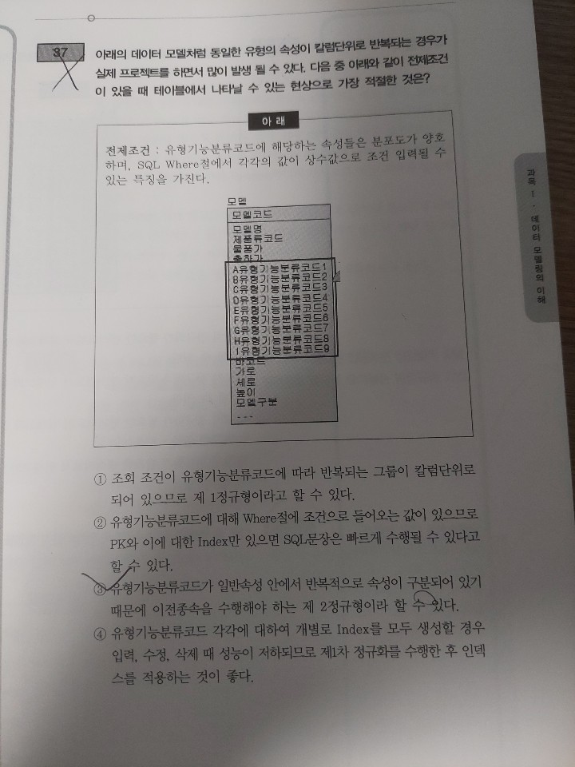
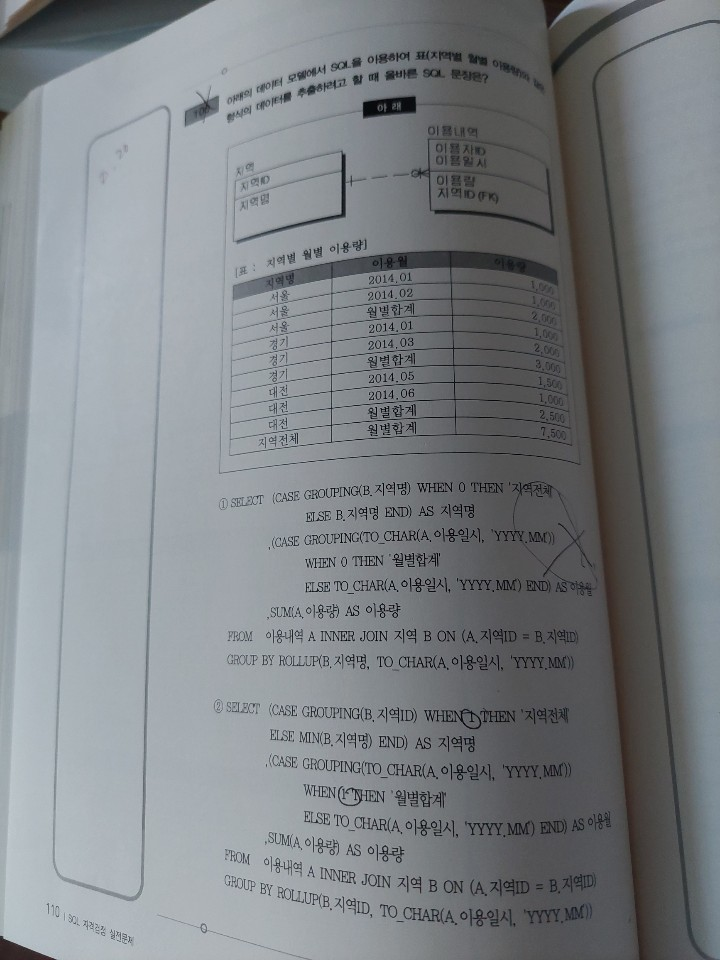
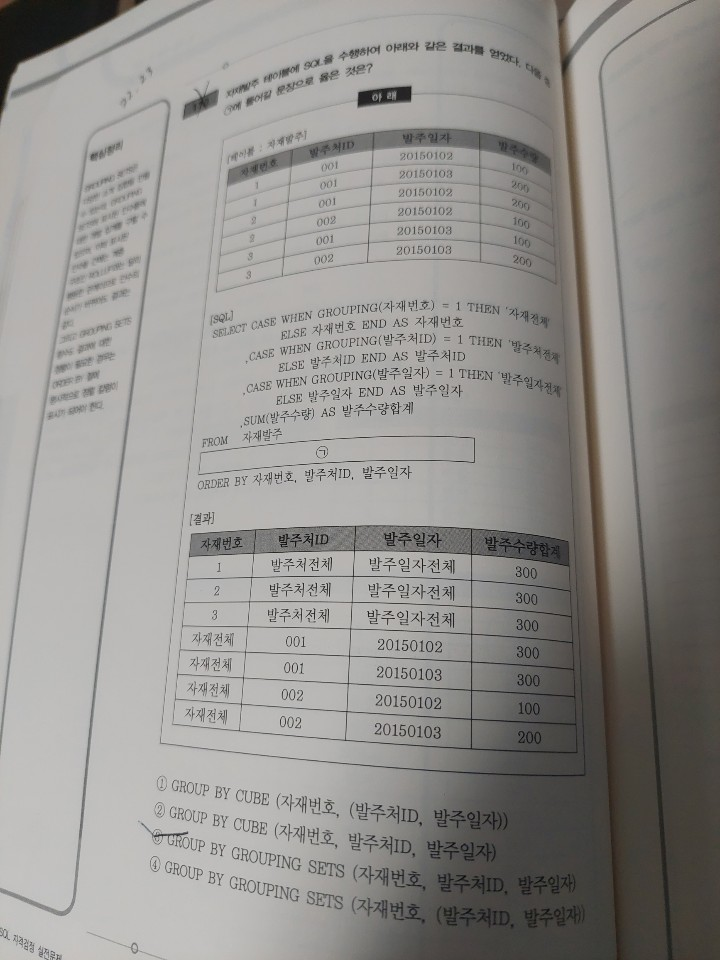
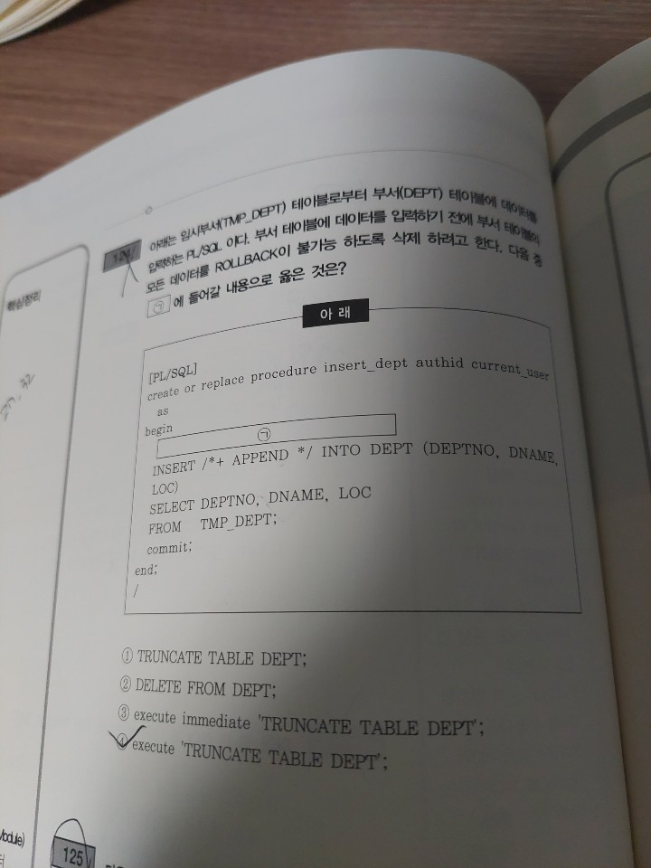

# SQLD

# 과목 I. 데이터 모델링의 이해 -1

- 오답 노트
    - 3번 문항
        
        
        
        - 정답은 3번이다.
        - 1번의 경우, 데이터 모델링의 주의 사항 중 중복에 해당한다. (파티셔닝과 혼동함)
        - 2번의 경우, 비 유연성에 해당한다.
        - 3번의 경우, 프로그램과 테이블간의 연계성을 높일 경우 원자성에 위배될 수 있다.
        - 4번의 경우, 비 일관성에 해당한다.
    - 13번 문항
        
        
        
        - 정답은 1번.
        - 약어의 사용은 가급적 제한해야 할 사항이다. ERD의 테이블 속성명의 약어설정과 혼동했다.
        - 2번의 경우, 업무와의 관계성은 확실할 수록 좋다.
        - 3번의 경우, 중복된 이름이 부여될 경우 원자성에 위배되며 혼동의 우려가 커진다.
        - 4번의 경우, 엔터티는 생성의미대로 이름을 부여해야 한다.
    - 16번 문항
        
        
        
        - 정답은 3번이다.
        - 1번의 경우, 문제를 적절한 것으로 읽었다. 반성하자.
        - 2번의 경우, 원금과 예치기간은 원래 가지고 있어야 하는 속성으로 기본속성이 맞다.
        - 3번의 경우, 이자는 이자율과 원금으로부터 파생된 파생속성이 맞지만, 이자율은 기본속성이다.
        - 4번의 경우, 예금분류는 예금분류는 데이터 모델링을 위해 새로 만들어진 속성인 설계 속성이다.
    - 25번 문항
        
        
        
        - 정답은 4번.
        - 가. 문항의 경우, PK값에 의해 엔터티 내의 모든 인스턴스들이 유일하게 구분되어야 하는, 원자성에 해당한다.
        - 나. 문항의 경우, 유일성을 만족하는 최소의 수라는 문항으로 인해 혼동했다. 비정규화를 고려했기 때문. 정규화 과정에서 주식별자는 유일성을 만족하는 최소의 수가 맞다.
        - 다. 문항의 경우, 지정된 주식별자는 다연히 가급적 변하지 않는 것으로 이루어져야한다.
        - 라. 문항의 경우, PK는 NOT NULL 제약조건을 포함하고 있다. 당연히 맞다.
- 문제 풀이
    - 1번
        - 모델링은 현실세계에 대해서 표현하는 것으로 이해할 수 있다. 다음 중 모델링의 특징으로 가장 부적절한 것은?
        - 모델링의 특징은 다음의 3가지로 요약된다. 추상화(모형화, 가설적), 단순화, 명확화(정확화).
        
        → 추상화 : 자바의 추상화와 유사하다.  일반화와 특수화를 통해 복잡한 현실세계의 모습을 단순하게 표현하는 것. 이 때 추상화를 위한 기법에는 일정한 양식의 표기법이 요구된다. 
        → 일정한 양식의 표기법이란 중복(Duplication), 비유연성,(Inflexibility) 비일관성(Inconsistency) 
        
        → 단순화 : 추상화와 유사하다. 복잡한 현실세계를 약속된 규약에 의해 제한된 표기법이나 언어로 표현하는 것. 추상화에서 조금 더 제약에 강점을 둔 방향성으로 이해하자. 
        
        → 명확화 : 누구나 이해할 수 있도록 복잡함을 제거하고 보다 정확하게 현실을 기술한다.
    - 2번
        - 다음 설명 중 데이터 모델링이 필요한 주요 이유로 가장 부적절한 것은?
        - 앞서의 모델링의 특징과 연관된다. 추상화, 단순화, 명확화.
        - 단, 정답인 3번 문항의 경우 ‘데이터베이스를 구축하기 위한 용도’가 오답 사항으로, 모델링은 데이터베이스 구축만을 위한 용도가 아닌, 모델링 자체로도 업무 파악 등의 이유로 유용함을 의미한다.
    - 3번
        - 다음 중 데이터모델링을 할 때 유의해야 할 사항으로 가장 부적절한 것은?
        - 데이터 모델링의 3가지 유의점에 대한 문항이다. 3가지는 중복, 비유연성, 비일관성.
        
        → 중복(Duplication) : 데이터 모델링은 같은 데이터를 사용하는 사람, 시간, 장소를 파악하는데 도움을 준다. 이는 데이터 베이스가 여러 장소에 같은 정보를 저장하는 잘못에 유의해야 함을 의미한다.
        
        → 비유연성(Inflexibility) : 데이터 모델링을 어떻게 설계했느냐에 따라 사소한 업무변화에도 데이터 모델이 수시로 변경됨으로서 유지보수성의 어려움을 가중시킬 수 있다. 모델링은 데이터의 정의를 데이터의 사용 프로세스와 분리함으로써 데이터 혹은 프로세스의 작은 변화가 애플리케이션과 데이터베이스에 미치는 영향을 최소화한다.
        
        → 비일관성(Inconsistency) : 데이터의 중복이 없더라도 비일관성을 발생할 수 있다. 속성(Attribute)의 기본 속성이 아닌, 설계와 파생 속성이 그 예라고 할 수 있다. 설계 속성과 파생 속성은 기본 속성의 ACID 중 독립성을 침해할 가능성이 높으므로 유의해야 한다.
    - 4번
        - 다음 중 아래 설명이 의미하는 데이터모델링의 유의점에 해당하는 특성은 무엇인가?
        - 비유연성에 대한 설명이다. 비유연성의 핵심은 ‘데이터의 정의를 데이터의 사용 프로세스와 분리하는 것’
    - 5번
        - 다음 중 아래 데이터모델링 개념에 대한 설명에서 ㄱ, ㄴ에 들어갈 단어로 가장 적절한 것은?
        - 개념 - 논리 - 물리 모델링 중 개념적 데이터 모델링과 물리적 데이터 모델링에 대한 설명이다. 
        
        → 개념적 데이터 모델링 : 추상화 수준이 높으며 업무 중심적이고 포괄적인 수준의 모델링. 전사적 데이터 모델링으로도 사용되며 EA 수립시에도 많이 이용한다. 어떠한 자료가 중요하고, 유지되어야 하는지를 결정하는 내용도 포함된다. 
        → 이 때 개념적 데이터 모델링은 사용자와 시스템 개발자가 데이터 요구 사항을 발견할 수 있도록 지원해야 하며, 개념적 데이터 모델링은 현 시스템이 어떻게 변형되어야 하는가를 이해해야 한다.
        
        → 논리적 데이터 모델링 : 시스템으로 구축하고자 하는 업무에 대해 Key, 속성, 관계등을 정확하게 표현하는 단계의 모델링이다. 재사용성이 높은 특징을 가진다. 정규화가 진행되며 상세화를 통해 식별자 확정, 정규화, M;M 관계 해소, 참조 무결성 규칙 정의 등을 수행한다. 
        
        → 물리적 데이터 모델링 : 실제로 데이터베이스에 이식할 수 있도록 성능, 저장 등 물리적인 성격을 고려하여 설계하는 단계의 모델링이다. 테이블, 컬럼 등의 물리적인 저장구조와 사용될 저장 장치, 자료를 추출하기 위해 사용될 접근 방법 등을 결정한다.
    - 6번
        - 다음 중 ANSI-SPARC에서 정의한 3단계 구조(three-level-architecture)에서 아래 내용이 설명하는 스키마구조로 가장 적절한 것은?
        
        3단계 구조(three-level-architecture)는 외부(external)단계, 개념(conceptual)단계, 내부(internal)단계로 구성되어 있다. 세 개의 서로 다른 스키마가 존재한다.
        
        → 외부 단계(External Level) : 추상화의 최상위 단계로 뷰 단계라고도 한다. 뷰 단계에서의 스키마를 외부 스키마(External Schema)라고 하며, 사용자나 응용 프로그래머가 관심있는 부분을 설명하고 나머지 세부사항은 숨긴다. 때문에 각 데이터베이스에 대해 외부 뷰가 있을 수 있다.
        
        → 개념 단계(Conceptual Level) : 물리적 저장 구조의 세부사항을 숨기고, 데이터 유형, 속성, 관계를 기술하는 단계로 논리적 단계라고도 한다. 논리 스키마(Logical Schema)가 포함된다. 데이터베이스의 전체 구조를 추상화하는 단계로 개념 스키마를 통해 구조를 기술한다. 개념 스키마는 하나만 존재하며, 모든 외부 스키마는 개념 스키마로부터 생성된다. 
        
        → 내부 단계(Internal Level) : 물리적 단계라고도 하며, 추상화의 최하위 단계이다. 하나의 내부 스키마가 존재하며 내부 스키마는 개념 스키마에 대한 저장 구조를 정의한 것이므로 저장 스키마라고도 한다. 내부 스키마는 데이터베이스의 물리적 저장 구조를 정의한다. 
        
        → 추가로 논리 스키마(Logical Schema)는 특정 데이터베이스 관리 제품 또는 스토리지 기술과는 독립적으로 표현되는, 관계형 테이블 및 컬럼, 객체 지향 클래스 또는 XML 태그와 같은 데이터 구조 측면에서 표현되는 특정 문제 도메인의 데이터 모델이다. 이는 3단계 구조(three-level-architecture)에는 포함되지 않는 개념이다.
    - 7번
        - 다음 중 고객과 주문의 ERD에 대한 설명으로 가장 부적절한 것은?
        - 관계선의 종류에 대한 문항이다. 관계선의 종류는 아래와 같다.
            
            
            
        - 문항의 관계선은 실선으로 이루어진 One-to-Many 관계선으로, One-필수 관계선을 의미하는(고객에 데이터를 입력할 때는 주문데이터가 존재하는 고객만을 입력할 수 있다.)  4번 문항은 오답이다.
    - 8번
        - 다음 중 ERD에 대한 설명으로 가장 부적절한 것은?
        - ERD는 Entity Relationship Diagram의 약자로 존재하고 있는 것(Entity)들의 관계(Relationship)을 나타낸 도표(Diagram)을 의미한다. 1976년 피터첸에 의해 만들어졌다.
        - 엔터티 도출 → 엔터티 배치 → 관계 설정 → 관계명 기술의 흐름으로 작업을 진행한다.
        - 엔터티의 배치는 좌상단 → 우하단의 방향으로 중요도를 가진다.
    - 9번
        - 다음 중 아래 시나리오에서 엔터티로 가장 적절한 것은?
        - 문항은 속성 중 기본 속성으로 적절한 것을 고르는 문항이다. 환자에 대한 이름, 주소 등을 관리해야 하므로 환자 엔터티가 가장 적절하다.
    - 10번
        - 다음 중 엔터티의 특징으로 가장 부적절한 것은?
        - 엔터티의 특징은 다음과 같다.
        
        → 반드시 해당 업무에서 필요하고 관리하고자 하는 정보이어야 한다.
        → 유일한 식별자에 의해 식별할 수 있어야 한다.
        → 영속적으로 존재하는 인스턴스의 집합이어야 한다. (한 개가 아닌 두 개 이상의)
        → 엔터티는 업무 프로세스에 의해 이용되어야 한다.
        → 엔터티는 반드시 속성이 두 개 이상 있어야 한다.
        → 엔터티는 다른 엔터티와 최소한 한 개 이상의 관계가 있어야 한다.
    - 11번
        - 다음 중 엔터티의 일반적인 특징으로 가장 부적절한 것은?
        - 위 문항과 같은, 엔터티의 특징에 대한 문항이다.
    - 12번
        - 다음 중 다른 엔터티로부터 주식별자를 상속받지 않고 자신의 고유한 주식별자를 가지며 사원, 부서, 고객, 상품, 자재 등이 예가 될 수 있는 엔터티로 가장 적절한 것은?
        - 엔터티의 분류에 대한 문항으로, 엔터티는 다음의 분류를 가진다. 
        
        유무형에 따른 분류 : 
        → 유형 엔터티(Tangible Entity)는 물리적인 형태가 있고 안정적이며 지속적으로 활용되는 엔터티로 업무로부터 엔터티를 구분하기 가장 용의하다. 
        → 개념 엔터티(Conceptual Entity)는 물리적인 형태는 존재하지 않고 관리해야 할 개념적 정보로 구분이 되는 엔터티다. 
        → 사건 엔터티(Event Entity)는 업무를 수행함에 따라 발생하는 엔터티로서 비교적 발생량이 많으며 각종 통계 자료에 이용될 수 있다.
        
        발생 시점에 따른 분류 :
        → 기본/키 엔터티(Fundamental Entity, Key Entity) : 그 업무에 원래 존재하는 정보로서 다른 엔터티와 관계에 의해 생성되지 않고 독립적으로 생성할 수 있고 자신은 타 엔터티의 부모 역할을 하게 되는 엔터티다. 다른 엔터티로부터 주식별자를 상속받지 않으며, 자신의 고유한 주식별자를 가지게 된다. 
        → 중심 엔터티(Main Entity) : 기본 엔터티로부터 발생하고 그 업무에 있어서 중심적인 역할을 한다. 데이터의 양이 많이 발생하며 다른 엔터티와의 관계를 통해 많은 행위 엔터티를 생성한다.
        → 행위 엔터티(Active Entity) : 두 개 이상의 부모 엔터티로부터 발생하고 자주 내용이 바뀌거나 데이터양이 증가한다. 분석 초기 단계에서는 잘 나타나지 않으며, 상세 설계단계나 프로세스와 상관모델링을 진행하면서 도출될 가능성이 높다.
    - 13번
        - 다음 중 엔터티의 이름을 부여하는 방법으로서 가장 부적절한 것은?
        - 엔터티의 명명 기준에 대한 문항이다. 명명 기준은 다음과 같다.
        
        → 가능하면 현업업무에서 사용하는 용어를 사용한다.
        → 가능하면 약어를 사용하지 않는다.
        → 단수 명사를 사용한다.
        → 모든 엔터티에서 유일하게 이름이 부여되어야 한다.
        → 엔터티 생성 의미대로 이름을 부여한다.
    - 14번
        - 업무에서 필요로 하는 인스턴스에서 관리하고자 하는 의미상 더 이상 분리되지 않는 최소의 데이터 단위를 무엇이라 하는가?
        - 속성(Attribute)에 대한 설명이다.
    - 15번
        - 다음 중 속성에 대한 설명으로 가장 부적절한 것은?
        - 속성의 특징에 대한 문항으로, 그 특징은 다음과 같다.
        
        → 속성이란 엔터티가 가지는 항목이다.
        → 더 이상 분리되지 않는 단위로, 업무에 필요한 데이터를 저장할 수 있다.
        → 인스턴스의 구성요소이며 의미적으로 더 이상 분해되지 않는다. 
        → 엔터티에 대한 자세하고 구체적인 정보를 나타낸다.
        → 하나의 엔터티는 두 개 이상의 속성을 가진다. (속성은 집합이다.)
    - 16번
        - 다음 중 아래와 같은 사례에서 속성에 대한 설명으로 가장 부적절한 것은?
        - 속성의 종류에 대한 문항으로 그 종류는 아래와 같다. 
        
        분해여부에 따른 속성의 종류 :
        → 단일 속성 : 하나의 의미로 구성된 것. (ex, 이름, 회원 번호 등)
        → 복합 속성 : 여러 개의 의미가 있는 것 (ex, 주소)
        → 다중값 속성 : 속성에 여러 개의 값을 가질 수 있는 것. 엔터티로 분해가 된다. (ex, 상품 리스트)
        
        특성에 따른 속성의 종류 : 
        → 기본 속성 : 비지니스 프로세스에서 도출되는 본래의 속성 (ex, 회원 ID, 이름)
        → 설계 속성 : 데이터 모델링 과정에서 발생되는 속성으로 유일한 값을 가진다. (ex, 상품코드, 학생 코드)
        → 파생 속성 : 다른 속성에 의해 만들어지는 속성 (ex, 합계, 평균)
        
        엔터티 구성방식에 따른 분류 : 
        → PK 속성 : 엔터티를 식별할 수 있는 속성
        → FK 속성 : 다른 엔터티와의 관계에서 포함된 속성
        → 일반 속성 : PK, FK에 포함되지 않는 속성
    - 17번
        - 다음 중 데이터를 조회할 때 빠른 성능을 낼 수 있도록 하기 위해 원래 속성의 값을 계산하여 저장할 수 있도록 만든 속성으로 가장 적절한 것은?
        - 위 문항과 마찬가지로 속성의 종류에 대한 문항이다.
    - 18번
        - 다음 중 아래 설명이 나타내는 데이터모델의 개념으로 가장 적절한 것은?
        - 도메인에 대한 설명이다. 각 보기에 대한 설명은 다음과 같다. 
        
        → 시스템카탈로그(System Catalog) : 시스템 그 자체에 관련이 있는 다양한 객체에 관한 정보를 포함하는 시스템 데이터베이스다.
        시스템 카탈로그 내의 각 테이블은 사용자를 포함하여 DBMS에서 지원하는 모든 데이터 객체에 대한 정의나 명세에 관한 정보를 유지 관리하는 시스템 테이블이다. 
        데이터 정의어의 결과로 구성되는 기본 테이블, 뷰, 인덱스, 패키지, 접근 권한 등의 데이터베이스 구조 및 통계 정보를 저장한다. 
        카탈로그들이 생성되면 자료사전에 저장되기 때문에 좁은 의미로는 자료 사전이라고도 한다.
        카탈로그에 저장된 정보를 메타 데이터라고 한다.
        
        → 용어 사전(Word Dictionary) : 논리 데이터 모델에 기술된 속성명과 테이블명에 업무적인 용어를 적용하거나 프로젝트에서 사용하기 위한 이름을 부여하여 데이터 모델과 애플리케이션 인터페이스에서 효율적인 정보화시스템을 구축하기 위한 것. 
        
        → 속성 사전(Attribute Dictionary)  : 위와 유사한, 속성을 정의한 것. 
        
        → 도메인(Domain) : 엔터티 타입 내의 속성에 대한 데이터타입과 크기, 제약사항을 지정하는 것.
    - 19번
        - 다음 중 데이터모델링을 할 때 속성의 명칭을 부여하는 방법으로 가장 부적절한 것은?
        - 15번 문항과 유사한 속성의 명명 규칙에 대한 문항이다.
    - 20번
        - 다음 중 데이터모델링의 관계에 대한 설명으로 가장 부적절한 것을 2개 고르시오.
        - 관계선 규칙에 대한 문항이다. 관계선의 종류 및 규칙은 아래와 같다. 
        
        → 일대 일 관계 : 테이블과 테이블 간의 컬럼이 1:1 관계를 이루고 있을 때 사용한다. 
        → 일대 다 관계 : 테이블과 테이블 간의 컬럼이 1:N 관계를 이루고 있을 때 사용하며, N은 없거나 많을 수 있다.
        → 비식별 관계 : 점선으로 표현하며 기본키에 외래키가 포함되어 있지 않을 때 사용한다.
        → 식별 관계 : 실선으로 표현하며 기본키에 외래키가 포함되어 있을 때 사용한다.
    - 21번
        - 다음 중 관계에 대한 설명으로 가장 부적절한 것은?
        - 관계(Relationship) 의 정의에 대한 문항이다. 
        
        → 관계는 상호 연관성이 있는 상태이며, 엔터티의 인스턴스 사이의 논리적인 연관성으로서 존재의 형태로서나 행위로서 서로에게 연관성이 부여된 상태를 의미한다. 
        관계는 엔터티와 엔터티 간 연관성을 표현하기 때문에 엔터티의 정의에 따라 영향을 받기도 하고, 속성 정의 및 관계 정의에 따라서도 다양하게 변할 수 있다. 
        
        → 관계의 분류는 존재에 의한 관계와 행위에 의한 관계로 구분할 수 있다.
            
            
            
        - 관계의 표기법은  관계명(Membership), 관계 차수(Cardinality), 관계 선택사양(Optionality)로 이루어진다. 
        
        → 관계명 : 관계명은 엔터티가 관계에 참여하는 형태를 지칭한다. 각각의 관계는 두 개의 관계명을 가지고 있으며, 각각의 관계명에 의해 두 가지의 관점으로 표현될 수 있다. 
        엔터티에서 관계가 시작되는 편을 관계시작점(The Beginning)이라고 부르고, 받는 편을 관계끝점(The End)이라고 칭한다. 시작점과 끝점 모두 관계이름을 가져야 하며 참여자의 관점에 따라 관계이름이 능동적(Active)이거나 수동적(Passive)으로 명명된다. 
        
        → 관계차수 : 두 개의 엔터티간 관계에서 참여자의 수를 표현하는 것을 의미한다. 
        1:M, 1:1, M:N 관계가 있다. 
        한 개의 관계가 존재하는지, 두 개 이상의 관계명이 존재하는지 파악해야 한다. 
        
        → 관계선택사양 : 모든 참여자가 반드시 관계를 가지는 필수참여관계(Mandatory)와 선택적으로 관계를 가지는 선택적인 관계(Optional)로 이루어져 있다.
    - 22번
        - 다음 중 엔터티간의 관계에서 1:1, 1:M과 같이 관계의 기수성을 나타내는 것으로 가장 적절한 것은?
        - 위 21번 문항과 같이 관계의 정의에 대한 문항이다.
    - 23번
        - 다음 중 두 개의 엔터티 사이에 정의한 관계를 체크하는 사항으로 가장 부적합한 것은?
        - 관계 체크사항에 대한 문항으로, 관계 체크사항은 아래와 같다.
        
        → 두 개의 엔터티 사이에 관심있는 연관규칙이 존재하는가?
        → 두 개의 엔터티 사이에 정보의 조합이 발생되는가?
        → 업무기술서, 장표에 관계연결에 대한 규칙이 서술되어 있는가?
        → 업무기술서, 장표에 관계연결을 가능하게 하는 동사(Verb)가 있는가?
    - 24번
        - 다음 중 두 개의 엔터티 사이에서 관계를 도출 할 때 체크 할 사항을 모두 고른 것은?
        - 위 문항과 같은 관계 체크사항에 대한 문항이다.
    - 25번
        - 다음 중 아래에서 주식별자를 지정할 때 고려해야 할 사항을 묶은 것으로 가장 적절한 것은?
        - 주식별자의 특징에 대한 문항이다. 특징은 아래와 같다.
        
        → 유일성 : 주식별자에 의해 엔터티내에 모든 인스턴스들이 유일하게 구분되어야 한다.
        → 최소성 : 주식별자를 구성하는 속성의 수는 유일성을 만족하는 최소의 수가 되어야 한다.
        → 불변성 : 지정된 주식별자의 값은 자주 변하지 않는 것이어야 한다.
        → 존재성 : 주식별자가 지정이 되면 반드시 값이 들어와야 한다.
            
            
            
    - 26번
        - 다음 중 사원엔터티에서 식별자의 특성에 해당하지 않는 것은 무엇인가?
        - 식별자의 분류 체계에 대한 문항이다.
            
            
            
    - 27번
        - 다음 중 식별자로 가장 부적절한 것은?
        - 위 문항과 같은 식별자의 분류체계 및 정의에 대한 문항이다.
    - 28번
        - 다음 중 아래에서 엔터티 내에 주식별자를 도출하는 기준을 묶은 것으로 가장 적절한 것은?
        - 25번과 같은 주식별자의 특징에 대한 문항이다.
    - 29번
        - 프로젝트를 전개할 때는 식별자관계와 비식별자관계를 선택하여 연결해야 하는 높은 수준의 데이터모델링 기술이 필요하다. 다음 중 비식별자 관계를 선택하는 기준으로 가장 부적절한 것은?
        - 비식별자 관계의 특징 및 규칙에 대한 문항이다. 
        
        → 비식별자 관계는 부모엔터티로부터 속성을 받았지만, 자식엔터티의 주식별자로 사용하지 않고 일반적인 속성으로 사용하는 경우 사용한다. 
        → 약한 연결관계를 표현할 때 사용한다. 
        → JOIN에 참여하는 테이블에 따른 복잡성을 줄이고자 할 때 고려된다. 
        → 자식 일반 속성에 포함된다. 
        → 비식별자 관계에 의한 외부속성을 생성하는 경우는 다음의 3가지다. 
            → 자식 엔터티에서 받은 속성이 필수가 아니어도 무방해서 부모 없는 자식이 생성될 수 있는 경우 
            → 엔터티별로 데이터 생명 주기를 다르게 관리하는 경우 (자식을 남기고 부모 엔터티가 먼저 소멸될 경우)
            → 여러 엔터티가 하나의 엔터티로 통합되어 표현됐는데, 각 엔터티가 별도의 관계를 가질 때
    - 30번
        - 다음 중 비식별자 관계로 연결하는 것을 고려해야 하는 경우로 가장 부적절한 것은?
        - 위 문항과 동일한 비식별자 관계의 특징 및 규칙에 대한 문항이다.

# 과목 I. 데이터 모델링의 이해 -2

- 오답 노트
    - 31번 문항
        
        
        
        - 정답은 1번.
        - 1번의 경우, 문제발생 시점의 SQL을 중심으로 집중하는 튜닝은 성능 데이터모델링이 아니다. 성능 데이터 모델링은 설계단계에서 이루어진다. 해당 문항의 경우, 설계 이후 실사용 과정에서 생각할 수 있는 사항.
        - 2번의 경우, 데이터의 증가가 빠를수록 로우체이닝의 발생 위협이 커진다. 따라서 설계 단계에서의 성능 데이터모델링의 중요성이 커진다.
        - 3번의 경우, 데이터무결성에 대한 생각으로 오답으로 적었다. 역정규화를 하며 테이블은 변경될 수 있다.
        - 4번의 경우, 설계단계에서 꼼곰한 모델링이 이루어질수록 유지보수성의 비용이 감소한다. (Rework비용)
    - 33번 문항
        
        
        
        - 정답은 4번.
        - 바. 문항과 나. 문항이 혼동됐다. 반 정규화 이후, 이력모델, PK/FK, 슈퍼타입/서브타입의 조정이 이루어져야 한다.
    - 37번 문항
        
        
        
        - 정답은 4번.
        - 문제의 테이블은 1정규화가 이루어지지 않은, 비정규화 테이블이다.
        - 따라서 1번과 3번은 오답.
        - 2번의 경우, WHERE절에 유형기능분류코드를 넣을 경우, 각각의 기능분류코드를 OR 연산자를 이용하여 묶어줘야 하므로, SQL문장은 좋은 성능을 발휘하기 힘들다.
        - 따라서, 제 1차 정규화를 통해 중복되는 컬럼들을 별도의 컬럼으로 뜯어낸 뒤, 해당 분류코드를 INDEX로 삼는 것이 가장 옳바른 방안이다.
        
    - 38번 문항
        
        
        
        - 정답은 1번.
        - 위 문제와 마찬가지로, 제 1차 정규화가 이루어지지 않은 비정규화 테이블이다. 정규화에 대한 개념이해 없이 무턱대고 풀었으니 당연히 오답이 발생했다. 반성하자.
        - 위 문항의 경우, 1차 정규화가 필요한 엔터티로, 일재고와 일재고 상세는 1:M 관계가 맞다.
    - 43번 문항
        
        
        
        - 정답은 3번.
        - 주문 엔터티에 단가를 합한 컬럼을 넣을 경우, JOIN으로 인한 성능 저하가 발생하리라 예상했다.
        - 하지만 이는 2번 역시 다르지 않은 부분일 뿐더러, 2번의 경우 일관성 문제까지 발생할 수 있다.
        - 따라서 역정규화의 개념 상에서, 가장 옳바른 방법은 3번인 주문 엔터티에 단가를 합한, 계산된 컬럼을 추가하는 것이 맞다.
    - 45번 문항
        
        
        
        - 정답은 3번.
        - 1번의 경우, 한 테이블에 많은 칼럼을 가지고 있으면 조인은 발생하지 않지만, 로우체이닝이 발생할 위협이 있을 뿐더러, 디스크 I/O의 문제가 발생할 수 있는 등, 문제가 더 많다. 이와 같은 상황으로 인해 역정규화가 필요한 것.
        - 2번의 경우, 한 테이블에 많은 칼럼이 존재할 경우 조회성능저하가 발생하는 것은 맞지만, 칼럼의 위치 조정만으로는 로우 체이닝의 위협을 감당할 수 없어 좋은 방법이라 보기는 어렵다.
        - 3번의 경우, 2번에 대한 가장 적절한 방안으로, 트랜잭션 단위에서 자주 사용되는 컬럼을 1:1 관계로 테이블로 분리하는 역정규화 과정을 통해 조회 성능 향상이 가능하다.
        - 4번의 경우, 로우체이닝에 대한 이해가 없어 고른 문항으로, 로우체이닝으로 인한 위협이 조인으로 인한 성능 저하보다 심할 수 있으므로, 역정규화를 생각하면 분리하는 것이 맞다.
    - 46번 문항
        
        
        
        - 정답은 파티셔닝(Partitioning).
        - 개념은 알고 있었으나, 정확한 단어가 떠오르지 않았다.
    - 47번 문항
        
        
        
        - 정답은 2번.
        - 전제조건을 상세히 생각하지 않았다. 각 엔터티를 개별로 유지할 경우, JOIN으로 인한 성능 저하를 감수하기 어렵다.
        - 따라서 3개의 테이블을 통합하는 과정이 필요하며, 이 때 PK를 사건 분류 코드와 사건번호라는 두 개의 컬럼으로 구성된 복합키로 함으로서, 최대한의 효율을 보일 수 있다.
        - 1번의 경우, UNION으로 테이블을 통합하더라도 JOIN은 동일하게 일어나므로 좋은 방안이라고 보기는 힘들다.
        - 3번의 경우, 성능 향상은 있겠으나 JOIN으로 인한 성능저하는 여전하다.
        - 4번의 경우는 오히려 JOIN할 테이블이 하나 더 늘어나는 경우로, 효율적이라고 보기 힘들다.
    - 48번 문항
        
        
        
        - 정답은 4번
        - 슈퍼타입과 서브타입에 대한 이해가 부족했다.
        - 1번의 경우, 트랜잭션은 모든 수행 단위를 하나의 단위로 묶어두므로, 테이블을 서브타입별로 개별 유지할 경우 JOIN이 필요하므로 성능이 저하된다. (UNION 연산)
        - 2번의 경우, 개별 서브타입별로 트랜잭션 단위가 일어나고, 그 결과를 하나의 테이블에 집적할 시 과도한 데이터로 인한 로우체이닝이 일어날 수 있다.
        - 3번의 경우, 1번과 같은 맥락이다.
        - 4번의 경우, 엔터티가 하나로 통합되어있으며, 해당 엔터티에 대한 전체 트랜잭션이 일어날 경우, JOIN의 감소로 인해 성능은 향상된다.
    - 49번 문항
        
        
        
        - 정답은 4번.
        - 인덱스에 대한 이해가 부족했다.
        - 인덱스는 상수값으로 EQUAL 조건으로 조회되는 컬럼이 가장 앞으로 나오고, 범위 조회하는 유형의 컬럼이 그 다음에 오도록 하는 것이 인덱스의 엑세스 범위를 좁히는 가장 좋은 방법이다.
        - 위 문항의 경우, EQUAL조건으로 조회되는 컬럼은 사무소코드이므로, PK의 순서는 사무소코드가 가장 앞에 나오는 것이 맞다.
        - 또한, 범위값인 거래일자가 그 다음으로 오는 것이 맞다.
    - 50번 문항
        
        
        
        - 위 49번 문항과 같은 맥락. EQUAL 조건인 지사코드가 가장 앞에 오는 것이 인덱스를 활용하는 가장 좋은 방법이다.
    - 52번 문항
        
        
        
        - 정답은 4번
        - 1번의 경우, 공통코드와 기준 정보 등 마스터 데이터를 하나의 데이터베이스에만 저장할 경우, 해당 데이터에 대한 접근이 빈번할 수록 물리적 시간 소요로 인한 성능 저하가 일어나므로, 분산데이터베이스에 복제분산을 적용하는 편이 좋다.
        - 2번의 경우, Near Real Time 특성 없이 데이터베이스 간 통신에 시간이 오래 소요될 수록 분산 데이터 베이스의 효용이 없어진다.
        - 3번의 경우, 백업 사이트는 기존에 있던 데이터베이스로부터 분산기능을 적용함으로서 간단하게 구성할 수 있다.
        - 4번의 경우, GSI는 한 개의 통합된 데이터베이스이므로, 분산 데이터 베이스를 활용함은 적합하지 않은 접근이다.
    
- 문제 풀이
    - 31번
        - 다음 중 성능데이터모델링에 대한 설명으로 가장 부적절한 것은?
        - 성능 데이터 모델링에 대한 문항이다.
        - 성능 데이터 모델링은 데이터베이스 성능향상을 목적으로 설계단계의 데이터 모델링 때부터 정규화, 반정규화, 데이터통합, 테이블분할, 조인구조, PK, FK 등 여러 가지 성능과 관련된 사항이 데이터 모델링에 반영될 수 있도록 하는 것이다.
        - 분석/설계 단계에서 데이터 모델에 성능을 고려한 데이터 모델링을 수행할 경우 성능저하에 따른 재업무(Rework) 비용을 최소화 할 수 있는 기회를 가지게 된다.
        - 데이터의 증가가 빠를 수록 성능저하에 따른 성능 개선 비용은 기하급수적으로 증가한다.
            
            
            
    - 32번
        - 아래 설명을 읽고 다음 ㄱ에 들어갈 단어를 작성하시오.
        - 성능 데이터 모델링의 순서에 대한 질문이다.
        - 성능 데이터 모델링의 순서 및 고려사항은 아래와 같다.
        
        → 데이터 모델링을 할 때 정규화를 정확하게 수행한다.
        → 데이터베이스 용량 산정을 수행한다. (어떤 엔터티에 데이터가 집중되는지)
        → 데이터베이스에 발생되는 트랜잭션의 유형을 파악한다.
        → 용량과 트랜잭션의 유형에 따라 반정규화를 수행한다.
        → 이력모델의 조정, PK/FK조정, 슈퍼타입/서브타입 조정 등을 수행한다.
        → 성능관점에서 데이터 모델을 검증한다.
    - 33번
        - 32번과 같은 성능 데이터 모델링 순서에 대한 질문이다.
    - 34번
        - 성능 데이터 모델링의 고려사항에 대한 질문이다. 위 순서 및 고려사항에서 추가적인 고려사항에 대한 문항이다. 
        
        → 정규화된 모델이 데이터를 주요 관심사별로 분산시키는 효과가 있기에 그 자체로 성능을 향상시키는 효과가 있다. 
        → 일단 정규화가 완성된 모델에 대해서 해당 데이터 모델의 각각의 엔터티에 어느 정도 트랜잭션이 들어오는지 살펴볼 때 가장 좋은 방법이 엔터티에 대한 용량산정이다. 
        → 트랜잭션의 유형에 대한 파악은 CRUD 매트릭스를 보고 파악하거나, 객체지향 모델링을 적용한다면 시퀸스 다이어그램을 통해 확인 가능하다. 
        → 앞서 파악한 용량산정과 트랜잭션의 유형데이터를 근거로 정확하게 테이블에 대해 반정규화를 적용해야 한다. 
        → 반정규화는 테이블, 속성, 관계에 대해 포괄적인 반정규화의 방법을 적용해야 한다. 
        → 대량 데이터가 처리되는 이력모델에 대해 성능 고려를 하고, PK/FK의 순서가 인덱스 특성에 따라 성능에 영향을 미치는 영향도가 크기에 PK/FK는 성능이 우수한 순서대로 컬럼의 순서를 조정해야 한다.
    - 35번
        - 아래와 같은 보관금원장 엔터티에서 관서에 대한 정보가 반정규화 되어 있기 때문에 관서정보를 조회할 때 성능저하가 발생하고 있다. 이 엔터티에 대해 몇 차 정규화가 필요한 지와 분리된 스키마 구조를 가장 바르게 짝지은 것은?
        - 정규형에 대한 문항이다. 각 정규형은 아래와 같다.
        
        → 제 1정규형(1NF) : 
        —> 각 컬럼이 하나의 속성만을 가져야 한다. 
        —> 하나의 컬럼은 같은 종류나 타입(type)을 가져야 한다. 
        —> 각 컬럼이 유일한(unique)이름을 가져야 한다.
        —> 컬럼의 순서가 상관없어야 한다. 
        
        → 제 2정규형(2NF)
        —> 제1정규형을 만족해야 한다. 
        —> 모든 컬럼이 부분적 종속(Partial Dependency)이 없어야 한다. (== 모든 컬럼이 완전 함수 종속을 만족해야 한다.)
        —→ 부분적 종속 : 기본키 중 특정 컬럼에만 종속되는 것. 
        
        → 제 3정규형(3NF)
        —> 제2정규형을 만족해야 한다. 
        —> 기본키를 제외한 속성들간의 이행 종속성(Transitive Dependency)이 없어야 한다. 
        —→ 이행 종속성 : A→B, B→C일 때, A→C가 성립하는 것. 
        
        → BCNF(Boyce-Codd Normal Form)
        —> 제3정규형을 만족해야 한다. 
        —> 모든 결정자가 후보키 집합에 속해야 한다.
            
            
            
        - 위 문항의 경우 관서 번호와 납주자 번호라는 두 PK 값으로 부분적 종속이 이루어지고 있음을 확인할 수 있다. 따라서, 보기의 엔터티는 1정규형이며 2정규화 과정이 필요하다. 부분적 종속 제거를 위해 PK값인 납부자 번호를 PK로 하는 별도의 테이블로 직급명과 통신번호 컬럼을 포함한 외부 테이블로 분리,  나머지 컬럼으로 완전 함수적 종속을 만족한 테이블을 만들어야 한다.
    - 36번
        - 다음 중 아래 일자별매각물건 엔터티에 대한 설명으로 가장 적절한 것은?
            
            
            
        - 정규화에 대한 문항이다.
        - 문항의 일자별 매각 물건의 경우 매각일자, 매각시간, 매각장소를 하나의 테이블로, 매각물건번호(PK), 최저매각가격, 물건상태코드를 하나의 테이블로 분리하는 2정규화 과정이 필요하다.
        - 이때 두 테이블 간의 관계는 1:M 관계다.
    - 37번
        
        
        
        - 아래의 데이터 모델처럼 동일한 유형의 속성이 컬럼단위로 반복되는 경우가 실제 프로젝트를 하면서 많이 발생 될 수 있다. 다음 중 아래와 같이 전제조건이 있을 때 테이블에서 나타날 수 있는 형상으로 가장 적절한 것은?
        → 전제조건 : 유형기능분류코드에 해당하는 속성들은 분포도가 양호하며, SQL WHERE 절에서 각각의 값이 상수값으로 조건 입력될 수 있는 특징을 가진다.
        - 문제의 테이블은 A~I 유형기능분류코드로, 제1정규형의 조건인 
        → 하나의 컬럼은 같은 종류나 타입(type)을 가져야 한다
        을 만족하지 못 하는 비정규화 테이블이다.
    - 38번
        
        
        
        - 다음 중 아래 일재고 엔터티에 대한 설명으로 가장 적절한 것은?
        - 정규화에 관한 문항이다.
        - 문제의 테이블은 1정규형이 이루어지지 않은 비정규화 테이블이다.
        - 그 중 일 재고와 일 재고수량으로 1:M 관계를 가지는 테이블로의 정규화가 필요하다.
    - 39번
        
        
        
        - 역시 정규화에 관한 문항이다.
        - 보기의 경우 PK인 학번, 과목코드에 대한 그룹이 이루어지지 않았으므로 1정규형에 해당한다.
        - 단, 함수종속성을 봤을 때 부분적 종속을 해결하지 못 했음을 알 수 있다.
        - 따라서 1정규형에 해당하며, 2정규화가 필요한 테이블이다.
    - 40번
        - 다음 중 데이터 모델에 대한 반정규화를 고려할 때 판단요소에 대한 설명으로 가장 적절한 것은?
        - 반정규화에 대한 문항이다.
        - 반정규화(De-Normalization)은 정규화된 엔터티, 속성, 관계에 대해 시스템의 성능향상과 개발(Development)과 운영(Maintenance)의 단순화를 위해 중복, 통합, 분리 등을 수행하는 데이터 모델링의 기법이다.
        - 협의의 반정규화는 데이터를 중복하여 성능을 향상시키기 위한 기법이며, 좀 더 넓은 의미의 반정규화는 성능을 향상시키기 위해 정규화된 데이터 모델에서 중복, 통합, 분리 등을 수행하는 모든 과정을 의미한다.
        - 반정규화를 사용하는 이유는 데이터를 조회할 때 디스크 I/O양이 많아 성능이 저하되거나, 경로가 너무 멀어 조인으로 인한 성능저하가 예상되거나, 컬럼을 계산하여 읽을 때 성능이 저하될 것이 예상되는 경우 수행한다.
        - 기본적으로 정규화는 입력/수정/삭제 뿐만 아니라 조회에 대해서도 성능을 향상시키는 역할을 하지만, 엔터티의 갯수가 증가하고 관계가 많아져 조회 성능이 하락하는 경우가 있다.
            
            
            
        - 반정규화의 대상을 조사할 때는 다음의 4가지 경우를 고려한다.
        
        → 자주 사용되는 테이블에 접근(Access)하는 프로세스의 수가 많고 항상 일정한 범위만을 조회하는 경우에 반정규화를 검토한다.
        → 테이블에 대량의 데이터가 있고 대량의 데이터 범위를 자주 처리하는 경우에 처리범위를 일정하게 줄이지 않으면 성능을 보장할 수 없을 경우에 반정규화를 검토한다.
        → 통계성 프로세스에 의해 통계 정보를 필요로 할 때 별도의 통계테이블(반정규화 테이블)을 생성한다. 
        → 테이블에 지나치게 많은 조인(JOIN)이 걸려 데이터를 조회하는 작업이 기술적으로 어려울 경우 반정규화를 검토한다.
        
        - 결론 :
         
        → 2번의 경우 고려사항일 뿐, 탐색 대상 데이터의 크기만으로 반정규화를 시행하는 것이 아니다. 
        → 3번의 경우, window-function을 통해 확인 가능하다.
        → 4번의 경우, 집계 테이블이 반정규화 테이블의 대표적 예시이지만, 그 외에도 반정규화는 다양한 목적으로 수행된다.
    - 41번
        - 다음 중 하나의 테이블의 전체 컬럼 중 자주 이용하는 집중화된 컬럼이 있을 때 디스크 I/O를 줄이기 위해 하당컬럼들을 별도로 모아놓는 반정규화 기법으로 가장 적적한 것은?
        - 반정규화의 기법에 관한 질문이다.  아래 표 참조.
        - 테이블의 반 정규화 :
            
            
            
        - 컬럼의 반 정규화 :
            
            
            
        - 관계의 반 정규화 :
            
            
            
    - 42번
        - 다음 중 컬럼에 대한 반정규화 기법으로 가장 부적절한 것은?
        - 41번 문항과 같은 반정규화 기법에 관한 문항이다. 표 참조,
    - 43번
        
        
        
        - 다음 중 아래의 주문, 주문목록, 제품에 대한 데이터모델과 이를 이용하여 데이터를 조회하는 SQL문에서 조회를 빠르게 수행하기 위한 반정규화 방법으로 가장 적절한 것은?
        - 테이블에 대한 반정규화 중  중복 테이블 추가에 대한 질문이다. 주문과 제품 테이블을 합친 테이블을 추가한다.
    - 44번
        - 다음 중 아래 데이터모델에 대한 설명으로 가장 부적합한 것은?
        - 컬럼에 대한 반정규화 중 이력 테이블 컬럼 추가에 관한 문항이다.
    - 45번
        - 다음 중 컬럼수가 많은 테이블에 대한 설명으로 가장 적절한 것은?
        - 테이블에 대한 반정규화 중 수직분할에 관한 문항이다.
    - 46번
        - 아래 설명에서 데이터 엑세스 성능을 향상시키기 위해 적용하는 방법에 대해서 ㄱ을 채우시오
        - 파티셔닝 기법에 관한 설명이다.
        - 파티셔닝(partitioning)은 데이터베이스를 여러 부분으로 분할하는 것이다.
        - 데이터베이스의 분할은 중요한 튜닝 기법으로 데이터가 너무 커졌을 때, 조회하는 시간이 길어졌을 때 또는 관리 용이성, 성능, 가용성 등의 향상을 이유로 행해지는 것이 일반적이다.
        - 가장 일반적인 것은 분산 데이터베이스 분할로, 각 파티션은 여로 노드에 분산 배치되어 사용자가 각 노드에서 로컬 트랜잭션을 수행 할 수 있다. 이는 가용성과 보안을 유지하면서 특정 뷰에 관한 일반 트랜잭션의 성능을 향상시켜준다.
    - 47번
        - 다음 중 아래 데이터 모델과 SQL문에 대해 개선해야 할 사항에 대한 설명으로 가장 적절한 것은?
        - 슈퍼타입 / 서브타입 모델의 성능 고려에 관한 문항이다.  슈퍼 / 서브 타입 데이터 모델의 변환기술은 다음과 같다.
        
        → 개별로 발생되는 트랜잭션에 대해서는 개별 테이블로 구성한다. (identity)
        → 슈퍼타입 + 서브타입에 대해 발생되는 트랜잭션에 대해서는 슈퍼타입 + 서브타입 테이블로 구성한다. (Rolldown)
        → 전체를 하나로 묶어 트랜잭션이 발생할 때는 하나의 테이블로 구성한다. (Rollup)
            
            
            
            
            
        - 전제조건이 각각의 테이블을 함께 조회하는 경우가 대부분이라 명시되어있으므로, 슈퍼 서브 통합 테이블을 통한 방식을 고려해야 한다.
    - 48번
        - 다음 중 논리데이터모델의 슈퍼타입과 서브타입 데이터모델을 물리적인 테이블 형식으로 변환할 때 설명으로 가장 부적절한 것은?
        - 슈퍼 / 서브 타입 데이터 변환의 주의점에 대한 문항이다.  주의점은 아래와 같다.
        
        → 트랜잭션은 항상 전체를 대상으로 일괄 처리하는데 테이블은 개별로 유지되어 Union 연산에 의해 성능이 저하될 수 있다.
        → 트랜잭션은 항상 서브타입 개별로 처리하는데 테이블은 하나로 통합되어 있어 불필요하게 많은 양의 데이터 때문에 성능이 저하된다. 
        → 트랜잭션은 항상 슈퍼 + 서브 타입을 공통으로 처리하는데 개별로 유지되어있거나 하나의 테이블로 집약되어 있으면 조인으로 인해 성능이 저하된다.
    - 49번
        - 다음 중 아래와 같은 현금출급기실적 테이블과 이 테이블에서 데이터를 조회할 때 사용되는 아래의 SQL 패턴에 관한 설명으로 가장 적절한 것은?
        - 인덱스 효율에 관한 문항이다. 인덱스 사용 효율 및 주의사항은 아래와 같다. 
        
        테이블 : 
        →  테이블은 읽기 연산이 많은 테이블에 적합하다. UPDATE, INSERT, DELETE 쿼리는 인덱스를 재배치하기에 오버헤드가 발생한다. 
        → 데이터가 충분히 많지 않다면 인덱싱을 활용하는 것이 오버헤드가 될 수 있다. 옵티마이저가 비효율적이라고 판단한다면 인덱스를 자체적으로 활용하지 않기도 한다. 
        
        컬럼 : 
        → 인덱스를 설정하지 않은 컬럼을 기준으로 하는 검색 쿼리는 인덱스를 사용하지 않는 것과 같다. 
        → 멀티 인덱싱을 사용할 경우 기준 컬럼의 순서를 정하는 것에 신중해야 한다. (name, age)순으로 인덱싱을 했을 경우 age만으로 검색 쿼리를 날리면 역시 인덱스를 사용하지 않는 것과 같다. 
        → 카디널리티(Cardinality)가 높은 컬럼일수록 인덱싱에 적합하다. 카디널리티가 높다는 것은 중복되는 데이터의 수가 낮다는 뜻이다. Boolean은 값이 TRUE, FALSE 2개 뿐이라 카디널리티가 낮다고 할 수 있다. 데이터 타입이 Boolean인 컬럼을 기준으로 인덱싱을 한다면 모든 값이 TRUE OR FALSE라 인덱싱의 효율이 떨어진다. 이름, 아이디, 주소 같은 데이터가 높은 카디널리티일 수록 효율적이다. 
        → 선택도(Selectivity)가 낮은 컬럼일수록 인덱싱에 적합하다. 선택도가 높다는 것은 해당 데이터가 전체 테이블에서 얼마나 희소한지를 의미한다. 수치화 하면 (같은 값을 가진 데이터) / (전체 데이터)로 표현한다. 여러개의 컬럼을 조합하면 선택도를 낮출 수 있다. 
        
        기타 : 인덱스의 크기가 지나치게 커지지 않도록 주의해야 한다. 이 또한 메모리자원을 소모하기 떄문이다.
    - 50번
        - 다음 중 아래의 엔터티와 이 엔터티를 매우 빈번하게 참조하는 SQL의 성능에 대한 설명으로 가장 적절한 것은?
        - 위 문항과 같은 인덱스 사용 효율에 관한 문항이다.
    - 51번
        - 다음 중 아래 데이터모델에 표현된 FK에 대한 설명으로 가장 적절한 것을 2개 고르시오.
        - 위 문항과 같은 인덱스 사용 효율에 관한 문항이다.
    - 52번
        - 다음 중 데이터가 여러 지역에 분산되어 있지만 하나의 데이터베이스처럼 사용하기를 원하는 분산데이터베이스 환경에서 데이터베이스 분산설계를 적용하여 효율성을 증대시킬 수 없는 것은?
        - 분산 데이터베이스에 대한 문항이다.
        - 분산 데이터베이스는 데이터베이스를 연결하는 빠른 네트워크 환경을 이용하여 데이터베이스를 여러 지역 여러 노드로 위치시켜 사용성/성능 등을 극대화 시킨 데이터베이스라고 정의할 수 있다
        - 분산 데이터베이스가 되기 위해서는 6가지 투명성(Transparency)를 만족해야 한다. 
        
        → 분할 투명성(단편화) : 하나의 논리적 Relation이 여러 단편으로 분할되어 각 단편의 사본이 여러 site에 저장
        → 위치 투명성 : 사용하려는 데이터의 저장 장소 명시 불필요. 위치정보가 Ststem Catalog에 유지되어야 한다. 
        → 지역사상 투명성 : 지역 DBMS와 물리적 DB 사이의 Mapping을 보장. 각 지역 시스템 이름과 무관한 이름을 사용해야 한다.
        → 중복 투명성 : DB 객체가 여러 site에 중복 되어 있는지 알 필요가 없다. 
        → 장애 투명성 : 구성요소(DBMS, Computer)의 장애에 무관한 Transaction의 원자성 유지
        → 병행 투명성 : 다수 Transaction 동시 수행시 경과의 일관성 유지, Time Stamp, 분산 2단계 Locking을 이용 구현.

# 과목 II. SQL 기본

- 오답 노트
    - 8번 문항
        
        
        
        - 정답은 3번.
        - NULL은 숫자 0도, 공백 문자 (””)도 아니다.
    - 15번 문항
        
        
        
        - 정답은 3번.
        - UK는 NULL값을 가질 수 있다.
        - 4번의 경우, FK는 UK도 참조할 수 있다는 점을 생각해 혼동이 갔다.
    - 18번 문항
        
        
        
        - 정답은 RENAME STADIUM TO STADIUM_JSC;
        - ANSI 표준에 대한 이해가 부족했다.
        - → ORACLE 표준으로는, ALTER TABLE STADIUM RENAME TO STADIUM_JSC;
    - 23번 문항
        
        
        
        - 정답은 1번.
        - TRUNCATE와 DROP은 로그를 남기지 않는다고 한다.
        - DELETE의 경우는 로그를 남긴다고 한다. 알지 못 했던 사항이다.
    - 28번 문항
        
        
        
        - 정답은 1번과 4번
        - 각 Read에 대한 이해 자체가 없었다. 각 트랜잭션 격리성 관련 이슈는 아래와 같다.
            
            
            
        - 4번 문항의 isolation의 경우, 격리성으로,  동시에 실행되는 트랜잭션들이 서로 영향을 미치지 않도록 격리해야함을 의미한다.
        - 위 이해를 바탕으로 살펴보면, 1번문항의 경우, 커밋이 되지 않은 수정된 데이터를 읽는 문제이므로 틀린 문항이다.
        - 2번의 경우는 Non-Repeatable Read에 대한 옳은 설명이다.
        - 3번 역시 Phantom Read에 대한 옳은 설명이다.
        - 4번의 경우 격리성이 낮을 경우에 생기는 문제가 아닌 격리성 그 자체에 대한 설명, 목표이다.
    - 29번 문항
        
        
        
        - 정답은 3번.
        - 1번 문항의 경우, 묵시적이라는 단어로 인해 혼동이 왔으나, UPDATE와 CREATE는 별개의 트랜잭션 단위로, UPDATE는 묵시적으로 커밋이 된 것이 맞다. (VAL값이 200)
        - 2번의 경우, SQL Server는 DDL과 DML을 별개의 트랜잭션이 아닌 하나의 트랜잭션 단위로 구성하기에, UPDATE 역시 ROLLBACK으로 커밋되지 않는 것이 맞다.
        - 3번의 경우, 1번과 같은 경우로 DDL과 DML을 별도의 트랜잭션단위로 구분한다.
        - 4번의 경우, SQL Server는 DDL과 DML을 하나의 트랜잭션 단위로 구분하기에 UPDATE와 CREATE 둘 다 이루어지지 않았다.
    - 31번 문항
        
        
        
        - 정답은 3번.
        - INSERT INTO ~ ,2000) 명령문을 제외한 명령문은 모두 ROLLBACK이 이루어졌다. 따라서 정답은 3개(ID 002, 004, 005)인 3번이다.
    - 37번 문항
        
        
        
        - 정답은 4번
        - SQL Server에 대한 전체적인 이해가 부족하다. (ORACLE과의 차이점에 대해 특히)
        - 1번의 경우, INSERT문이 없었기에 오류가 발생한다.
        - 2번의 경우, 서비스명 컬럼에  NULL이 입력된다. NULL은 공백문자 데이터가 아니다.
        - 3번의 경우, 원하는 데이터를 조회하려면 IS NULL을 사용해야 한다.
        - 4번의 경우, SQL Server는 Oracle과는 다르게, ‘’를 NULL이 아닌 공백문자 데이터로 인식함으로, IS NULL로 데이터가 조회되지 않는다.
    - 39번 문항
        
        
        
        - 정답은 4번. 종료일시에 대한 조건이 다르다.
    - 41번 문항
        
        
        
        
        
        - 정답은 3번
        - SELECT LENGTH(C1) : (3, 5)
        - SELECT LENGTH(REPLACE(C1, CHAR(10))) : (2,3)
        - SELECT LENGTH(C1)  - SELECT LENGTH(REPLACE(C1, CHAR(10))) : (1, 2)
        - +1 : (2, 3)
        - SUM(CC) : 5
        - 간단하다고 생각하고 넘어갔는데, 복잡하게 하려면 얼마든지 복잡하게 만들 수 있는게 문자형 함수구나 싶었다.
    - 42번 문항
        
        
        
        - 정답은 3번.
        - 1/24/(60/10) = 10분이다.
        - 하루를 24로 나눈 1시간
        - 60/10 은 1시간을 60분으로 나눈 1분에 10을 곱한 10분
        - 그러므로 문제는 2015년 1월 10일 10시에 10분을 더한 3번.
    - 43번 문항
        
        
        
        - 정답은 LOC WHEN ‘NEW YORK’ THEN ‘EAST’
        - simple_case_expression와 searched_case_expression에 대한 개념 자체가 없어 풀지 못 했다.
        - CASE 표현식은 아래의 이미지 참조.
            
            
            
        - 위의 simple_case_expression을 참조해 동일한 표현식을 만든다면 
        LOC(expr) WHEN(WHEN) ‘NEW YORK(comparison_expr)’ THEN(THEN) ‘EAST(return_expr)’
    - 46번 문항
        
        
        
        - 정답은 NULLIF
        - NULLIF에 대한 개념이 없었다.
        - NVL과의 차이점은 NVL(표현식1, 표현식2)일 때. 표현식1의 값이 NULL이면 표현식2의 값을 출력하는 함수이며 (단, 표현식1과 표현식2의 결과 데이터값이 동일해야 한다.)
        - NULLIF(표현식1, 표현식2)의 경우는 표현식1이 표현식2와 같으면 NULL을, 같지 않으면 표현식1을 리턴한다는 차이점이 있다.
        - 참고사항으로, COALESCE(표현식1, 표현식2...)의 경우, 임의의 개수 표현식에서 NULL이 아닌 최초의 표현식을 나타내는 함수이며, 모든 표현식이 NULL이라면 NULL을 리턴한다.
    - 47번 문항
        
        
        
        - 정답은 4번
        - 자바의 ArithmeticException과 혼동이 생겼다. SQL의 경우, 분자가 0인 경우에는 0을 반환하며, 에러가 발생하지 않는다.
        - 따라서 각각의 SELECT은 0/300 = 0, 5000/0 = 에러 발생, 1000/NULL = NULL이다.
    - 48번 문항
        
        
        
        - 정답은 3번
        - COALESCE 함수에 대한 이해가 없었다.
        - 앞서 46번 문항에서 기술한 바와 같이, COALESCE 함수의 경우, 첫번째 NULL이 아닌 값을 반환하는 함수이므로
        - 위 SELECT문의 결과는 1 + 2 + 3인 6이다.
    - 51번 문항
        
        
        
        - 정답은 3번.
        - SQL2)의 ‘널’을 NULL과 동일시했다.
        - 2번 SELECT문의 경우, 직급이 정해지지 않은(NULL) 25명을 제외한, 차장 10명과 부장 5명을 더한 15명이 맞다.
    - 56번 문항
        
        
        
        - 정답은 3번.
        - SELECT 이후 ORDER BY 절이 시행된다. 따라써 3번 문항의 경우, 이미 GROUP BY 절을 통해 묶인 SELECT 절에서 정의되지 않은 ‘년’으로 ORDER BY 할 수 없다.
        - 2번의 경우, SELECT에 년이라는 컬럼을 조회하지 않더라도, 지역별매출이라는 테이블에 년이라는 컬럼이 있을 경우 ORDER BY가 가능하다. 이 부분을 감안하지 못 했다.
    - 57번 문항
        
        
        
        - 정답은 3번.
        - ORDER BY절에서 별칭이나 컬럼 순서를 나타내는 정수를 혼용해서 사용 가능하다.
        - 4번의 경우, GROUP BY가 아닌 이중 셀렉을 통한 집계 함수만 사용 가능하다고 착각했으나, GROUP BY절을 통해서도 집계 함수가 가능하다고 한다.
    - 60번 문항
        
        
        
        - 정답은 4번
        - WITH TIES 함수에 대한 이해가 부족했다.
        - TOP() 함수, ROWNUM 함수의 경우 중복값을 허용하지 않는다.
        - 단, TOP() WITH TIES 함수를 사용할 경우, 중복값을 허용하여 출력할 수 있다.
    - 64번 문항
        
        
        
        - 정답은 3번.
        - 이걸 왜 틀렸지... 마지막 문제라고 정신을 놓고 풀었나 보다.
        - 와일드카드 S%의 경우 2개 컬럼, %T%의 경우도 2개 컬럼으로 COUNT(*)의 결과는 4개 컬럼이다.
- 문제 풀이
    - 1번
        - 다음 중 데이터 제어어(DCL)에 해당하는 명령어는?
        - DCL은 GRANT, REVOKE의 2개다.
        - PS. DML : SELECT, INSERT, UPDATE, DELETE
        - DDL : CREATE, ALTER, DROP, RENAME
        - TCL : COMMIT, ROLLBACK
    - 2번
        - 다음 중 아래 내용의 범주에 해당하는 SQL 명령어로 옳지 않은 것은?
        - 문항의 설명은 DDL.
    - 3번
        - 아래 내용에 해당하는 SQL 명령어의 종류를 작성하시오
        - 문항의 설명은 TCL.
    - 4번
        - 데이터베이스를 정의하고 접근하기 위해서는 데이터베이스 관리 시스템과의 통신수단이 필요한데 이를 데이터 언어(Data Language)라고 하며, 그 기능과 사용 목적에 따라 데이터 정의어(DDL), 데이터 조작어(DML), 데이터 제어어(DCL)로 구분된다. 다음 중 데이터 언어와 SQL 명령어에 대한 설명으로 가장 부적절한 것은?
        - 비절차적 데이터 조작어는 사용자가 무슨 데이터(What)을 원하는지만 명세한다. 그것을 어떻게(how)접근하여 처리할 것인가에 대해서는 명세하지 않고 데이터베이스 관리 시스템에 위임한다.
    - 5번
        - 다음 중 데이터베이스 시스템 언어의 종류와 해당되는 명령어를 바르게 연결한 것을 2개 고르시오
        - 1번 문항 참조,
    - 6번
        - 다음 중 아래의 데이터 모델과 같은 테이블 및 PK, 제약조건을 생성하는 DDL 문장으로 올바른 것은?
        - 올바른 답(ALTER) :
            
            ```sql
            CREATE TABLE PRODUCT
            (
              PROD_ID VARCHAR2(1) NOT NULL
            , PROD_NM VARCHAR2(100) NOT NULL
            , REF_DT DATE NOT NULL
            , GEGR_NO NUMBER(10) NULL
            );
            
            ALTER TABLE PRODUCT ADD PRIMARY KEY(PROD_ID);
            ```
            
        - 올바른 답(TABLE 안에서) :
            
            ```sql
            CREATE TABLE PRODUCT
            (
              PROD_ID VARCHAR2(1) NOT NULL
            , PROD_NM VARCHAR2(100) NOT NULL
            , REF_DT DATE NOT NULL
            , GEGR_NO NUMBER(10) NULL
            , CONSTRAINT PRODUCT_PK PRIMARY KEY (PROD_ID)
            );
            ```
            
    - 7번
        - 아래와 같이 데이터가 들어있지 않은 왼쪽의 기관분류 테이블(가)를 오른쪽 기관분류 테이블(나)처럼 변경하고자 할 때 다음 중 올바른 sql 문장은?
        - 문항은 분류명의 자료형 크기를 10 → 30으로 변경하고 등록일자의 자료형을 VARCHAR2에서 DATE로 변경하는 것.
            
            ```sql
            ALTER TABLE 기관분류 ALTER COLUMN 분류명 VARCHAR(30) NOT NULL;
            ALTER TABLE 기관분류 ALTER COLUMN 등록일자 DATE NOT NULL;
            ```
            
        - SQLServer는 ORACLE과는 달리 
        ALTER TABLE 테이블명 ALTER COLUMN 컬럼명 데이터 유형 [DEFAULT 식] [NOT NULL] 의 형식을 가진다.
    - 8번
        - 다음 중 NULL의 설명으로 가장 부적절한 것은?
        - SQL에서 NULL은 아직 정의되지 않은 값의 의미를 가진다.
        - 0과 공백은 0이라는 값과 공백이라는 하나의 문자라는 값을 가진다. 즉, NULL이 아니다.
        - NULL은 unknown 또는 N/A(not applicable)이라는 의미로 사용된다.
    - 9번
        - 아래 테이블 T, S, R이 각각 다음과 같이 선언되었다. 다음 중 DELETE FROM T; 를 수행한 후에 테이블 R에 남아있는 데이터로 가장 적절한 것은?
        - ON DELETE CASCADE는 참조값 삭제 시 컬럼을 제거한다.
        - ON DELETE SET NULL은 참조값 삭제 시 NULL값을 채운다.
        - 따라서 T 테이블 삭제 시 S테이블의 값도 삭제 된다.
        - 이후 S테이블의 B컬럼을 참조하는 B는 NULL값이 된다.
    - 10번
        - 다음 중 테이블 생성시 컬럼별 생성할 수 있는 제약조건(Constraints)에 대한 설명으로 가장 부적절한 것은?
        - 제약조건에 대한 문항이다.
        - UNIQUE는 NOT NULL의 제약조건이 포함되지 않는다. 즉, 중복되지 않는다면 NULL값도 입력 가능하다.
    - 11번
        - 다음 중 물리적 테이블 명으로 가장 적절한 것은?
        - 테이블 이름의 명명 규칙에 대한 문항이다.
        - 명명 규칙은 다음과 같다. 
        
        → 테이블명은 객체를 의미할 수 있는 적절한 이름을 사용한다. 가급적 단수형을 권고한다.
        → 테이블 명은 다른 테이블의 이름과 중복되지 않아야 한다. 
        → 한 테이블 내에서는 컬럼명을 중복되게 지정할 수 없다. 
        → 테이블 이름을 지정하고 각 컬럼들은 괄호 “( )” 로 붂어 지정한다.
        → 각 컬럼들은 콤마 “,”로 구분되고, 테이블 생성문의 끝은 항상 세미콜론 “;”으로 끝낸다. 
        → 컬럼에 대해서는 다른 테이블까지 고려하여 데이터베이스 내에서는 일관성 있게 사용하는 것이 좋다. 
        → 컬럼 뒤에 데이터 유형은 꼭 지정되어야 한다.
        → 테이블명과 컬럼명은 반드시 문자로 시작해야 하고, 벤더별로 길이에 대한 한계가 있다. 
        → 벤더에서 사전에 정의한 예약어는 쓸 수 없다. 
        → A-Z, a-z, 0-9, _, $, # 문자만 허용한다.
    - 12번
        - 아래와 같은 테이블 구조를 정의하려고 한다. 이때 아직 부서가 정의되지 않은 사원은 기본부서(코드:0000)으로 배치하고, 입사일자(JOIN_DATE) 기준으로 많은 조회가 발생하므로 입사일자에 index를 생성하려고 한다. 다음 중 올바른 SQL 문장을 2개 고르시오.
        - 정답은 아래와 같다.  (ORACLE 기준)
            
            ```sql
            CREATE TABLE EMP
            (
              EMP_NO VARCHAR2(10) NOT NULL PRIMARY KEY
            , EMP_NM VARCHAR2(30) NOT NULL
            , DEPT_CODE VARCHAR2(4) NOT NULL
            , JOIN_DATE DATE NOT NULL
            , REGIST_DATE DATE NULL
            );
            CREATE INDEX IDX_EMP_01 ON EMP (JOIN_DATE);
            
            ===
            
            CREATE TABLE EMP
            (
              EMP_NO VARCHAR2(10) NOT NULL
            , EMP_NM VARCHAR2(30) NOT NULL
            , DEPT_CODE VARCHAR2(4) NOT NULL
            , JOIN_DATE DATE NOT NULL
            , REGIST_DATE DATE NULL
            );
            ALTER TABLE EMP ADD PRIMARY KEY(EMP_NO);
            CREATE INDEX IDX_EMP_01 ON EMP (JOIN_DATE);
            ```
            
    - 13번
        - 다음 중 아래와 같은 문장으로 ‘학생’ 테이블을 생성한 후, 유효한 튜플들을 삽입하였다. SQL 1, SQL 2 문장의 실행 결과로 가장 적절한 것은?
        - SQL 1은 학생 테이블의 전체 튜플 값을 COUNT하는 QUERY.
        - SQL 2는 학생 테이블의 학번 컬럼의 값을 COUNT하는 QUERY다.
        - 그러나 학번 컬럼이 PRIMARY KEY 이므로, 두 쿼리문의 결과값은 항상 동일하다.
    - 14번
        - 다음 중 외래키에 대한 설명으로 가장 부적절한 것을 2개 고르시오.
        - 외래 키는 하나(또는 여러개)의 다른 릴레이션의 기본키(PK) 필드를 참조하는 데이터의 참조 무결성(Referential Integrity)를 확인하기 위해 사용되는 키(key)를 의미한다. 
        → 한 테이블에 여러개의 FK가 가능하다.
        - 외래키는 릴레이션을 생성할 때 설정하거나, 생성된 릴레이션에 ALTER 명령어를 이용하여 설정하는 방법이 있다.
        - 외래키를 설정할 때 참조되는 릴레이션의 필드는 반드시 UNIQUE나 PRIMARY KEY 제약조건이 설정되어 있어야 한다.
        → UNIQUE 값도 참조할 수 있으므로, NULL값도 가능하다.
    - 15번
        - 다음 중 데이터베이스 테이블의 제약조건에 대한 설명으로 가장 부적절한 것은?
        - NOT NULL : 컬럼에만 사용 가능하다. 해당 컬럼에 반드시 데이터를 입력해야 할 때 사용한다.
        - UNIQUE : 해당 컬럼에 들어가는 값이 테이블 전체에서 유일해야 한다. (중복값을 허용하지 않는다. NULL값 허용)
        - PRIMARY KEY : 기본키라고 부린다. UNIQUE + NOT NULL의 형태를 가지며, 테이블 당 1개의 기본키만 생성 가능하다. 여러 컬럼을 묶어 하나의 기본키로 만들 수 있으며(최대 32개까지 가능) 기본키는 데이터 무결성을 지켜주는 역할을 한다.
        - FOREIGN KEY : 외래키라고 많이 불리는 제약조건이다. 테이블 간의 참조 데이터 무결성을 보장해준다. 참조 데이터 무결성 보장을 통해 참조 관계가 있는 테이블의 데이터 추가, 삭제, 수정을 통제할 수 있다.
        - CHECK : 컬럼에 입력되는 데이터를 CHECK하여 조건에 맞을 경우에만 입력을 허용한다.
    - 16번
        - 4개의 컬럼으로 이루어진 EMP 테이블에서 COMM 컬럼을 삭제하고자 할 때, 아래 SQL 문장의 ㄱ, ㄴ 안에 들어갈 내용을 기술하시오.
        - 컬럼을 삭제하는 명령어는 ALTER TABLE 테이블명 DROP COLUMN 컬럼명 이다. 따라서 정답은
            
            ```sql
            ALTER TABLE EMP DROP COLUMN EMP_NM;
            ```
            
    - 17번
        - 아래 7개의 SQL 문장이 성공적으로 수행되었다고 할 때, A, B, C 세 개의 SQL 문장을 차례대로 실행하면 A와 C의 SELECT 문장 수행결과는 각각 무엇인가?
        - DELETE 를 통해 컬럼 삭제 시 COUNT에서 제외된다. 따라서 A는 3, C는 1
    - 18번
        - STADIUM 테이블의 이름을 STADIUM_JSC로 변경하는 SQL을 작성하시오 (ANSI 표준 기준)
        - RENAME 명령어에 대한 문항으로, 단일 테이블의 이름 변경은 다음과 같다.
        - RENAME TABLE 테이블이름 TO 변경할테이블이름; (ANSI 표준)
        - ALTER TABLE 테이블이름 RENAME 변경할테이블이름; (ALTER)
        - 따라서 정답은
            
            ```sql
            RENAME STADIUM TO STADIUM_JSC;
            ```
            
    - 19번
        - 표준 SQL(SQL:1999) 에서 테이블 생성시 참조관계를 정의하기 위해 외래키를 선언한다. 관계형 데이터베이스에서 Child Table의 PK 데이터 생성시 Parent Table에 PK가 없는 경우, Child Table 데이터 입력을 허용하지 않는 참조 동작(Referential Action)인 것은?
        - SET CASCADE : 개체를 변경/삭제 할 때 다른 개체가 변경/삭제할 객체를 참조하고 있는 경우 함께 변경/삭제 된다.
        - SET RESTRICT : 개체를 변경/삭제할 때 다른 개체가 변경/삭제할 개체를 참조하고 있을 경우 변경/삭제가 취소된다.
        - SET AUTOMATIC : Master 테이블에 PK가 없는 경우 Master PK값을 생성 후 Child를 입력한다.
        - SET DEPENDENT : Master 테이블에 PK값이 존재할 때만 Child 입력을 허용한다.
        - SET DEFAULT : 개체를 변경/삭제할 때 다른 개체가 변경/삭제할 개체를 참조하고 있을 경우 참조키 컬럼에 정의한 DEFAULT 값으로 해당 컬럼 값을 변경한다.
        - SET NULL : 개체를 변경/삭제할 때 다른 개체가 변경/삭제할 개체를 참조하고 있을 경우 참조키 컬럼의 값이 NULL이 된다.
        - NO ACTION : 개체를 변경/삭제할 때 다른 개체가 변경/삭제할 개체를 참조하고 있을 경우 참조하는 테이블의 데이터는 변경되지 않는다.
    - 20번
        - 아래와 같은 SQL문에 대해 삽입이 성공하는 SQL문은?
        - INSERT 시 테이블의 컬럼명을 명시하지 않을 경우 모든 컬럼에 VALUE값을 INSERT 해야 한다.
        - NOT NULL 제약조건이 있을 경우 NULL 값 삽입은 불가능하다.
        - PRIMARY KEY 값은 반드시 INSERT 해야 한다.
    - 21번
        - 아래와 같은 데이터 모델에서 데이터를 조작하려고 한다. 다음 중 오류가 발생하는 SQL 문장인 것은?
        - NOT NULL 제약조건은 값을 삽입해야 한다. 2번 문항이 정답.
    - 22번
        - 아래 데이터 모델과 같이 고객과 주문 테이블이 생성되어 있으며, 고객과 주문 테이블에 입력되어 있는 데이터는 아래 표와 같다. 이 때 FK_001 이라는 제약 조건을 아래 SQL과 같이 설정하였다. 다음 중 오류 없이 정상적으로 수행되는 SQL을 2개 고르시오.
        - 주문 테이블이 고객 테이블을 참조하고 있으므로, 고객 테이블에 없는 고객 ID 값을 주문 테이블에 INSERT할 수 없다.
        - 주문 테이블의 DELETE는 가능하다.
        - 단, 주문 테이블에 고객 ID가 NOT NULL 제약 조건이 있으므로 고객 테이블 삭제 시 SET NULL 참조 동작으로 인해 에러가 발생한다.
    - 23번
        - 개발 프로젝트의 표준은 모든 삭제 데이터에 대한 로그를 남기는 것을 원칙으로 하고, 테이블 삭제의 경우는 허가된 인력만이 정기적으로 수행 가능하도록 정하고 있다. 개발팀에서 사용 용도가 없다고 판단한 STADIUM 테이블의 데이터를 삭제하는 가장 좋은 방법은 무엇인가?
        - TRUNCATE, DROP, DELETE의 차이에 대한 문항이다.
            
            
            
        - 로그를 남기는 것을 원칙으로 하므로 저장공간이 유지되는 DELETE 구문을 사용해야 한다.
        - 이 중 DELETE의 구문은 
        → DELETE FROM 테이블이름 이므로 1번이 정답.
    - 24번
        - 아래의 고객지역 테이블을 대상으로 질의 결과와 같이 거주지와 근무지를 출력하고자 한다. 아래 SQL의 ㄱ안에 들어갈 내용을 작성하시오
        - 중복값을 제거한 SELECT 쿼리문에 대한 문항이다.
        - 중복값 제거에는 DISTINCT를 사용한다.
    - 25번
        - 다음 중 아래와 같은 상황에서 사용할 수 있는 SQL 명령어는?
        - 23번과 유사한 문항으로, 저장공간을 제거하고, 테이블 정의(스키마 정의)는 유지하는 TRUNCATE 구문을 사용해야 한다.
        - TRUNCATE 구문의 문법은 아래와 같다.
        - TRUNCATE TABLE 테이블이름
    - 26번
        - 다음 중 DELETE와 TRUNCATE, DROP 명령어에 대해 비교한 설명으로 가장 부적절한 것을 2개 고르시오
        - 아래 표 참조
            
            
            
    - 27번
        - 데이터베이스 트랜잭션에 대한 설명으로 가장 부적절한 것을 2개 고르시오
        - Transaction에서의 ACID에 대한 문항이다. ACID는 다음과 같다.
        - A(Atomicity, 원자성) : client가 쓰기 몇 개의 작업을 수행하고자 할 때, 그 중 일부만 처리된 후 결함이 발생하여 commit 해서 안되는 상황이면 abort 하는 작업을 의미한다. 
        → 전부 반영되거나, 아무것도 반영되지 않아야 한다.
        - C(Consistency, 일관성) : 트랜잭션이 성공적으로 완료되면 일관적인 DB 상태를 유지해야 한다. 
        → Transaction 전 후 데이터 타입은 유지되어야 한다.
        - I(Isolcation, 격리성) : 동시에 실행되는 transaction은 서로 격리되어야 한다. 하나의 트랜잭션이 다른 트랜잭션을 절대로 방해할 수 없다.
        - D(Durability, 지속성) : Data가 손실될 염려 없이 안전한 저장소를 제공해야 한다. 
        → 성공적으로 Commit 된 데이터는 H/W 결함에도 보존되어야 한다.
    - 28번
        - 데이터베이스 트랜잭션에 대한 격리성이 낮은 경우 발생할 수 있는 문제점으로 가장 부적절한 것을 2개 고르시오
        - Transaction의 격리성 관련 문항으로, 각 Read 문제는 아래와 같다.
        
        
        
    - 29번
        - 테이블 A에 대해 아래와 같은 SQL을 수행하였을 때 테이블 A의 ID ‘001’에 해당하는 최종 VAL의 값이 ORACLE에서는 200, SQL Server에서는 100이 되었다. 다음 설명 중 가장 부적절한 것은? (단, AUTO COMMIT은 FALSE로 설정되어 있다.)
        - ORACLE 기준 CREATE 명령어는 암시적으로 COMMIT을 수행한다. 따라서 ROLLBACK 시에도 CREATE 된 테이블은 삭제되지 않는다.
    - 30번
        - 아래 내용의 ㄱ, ㄴ, ㄷ에 해당하는 단어를 순서대로 작성하시오.
        - TCL 명령어에 대한 설명이다.
        - 각각 순서대로 TRANSACTION, COMMIT, ROLLBACK
    - 31번
        - 아래와 같은 테이블에 SQL 구문이 실행되었을 경우 최종 출력 값을 작성하시오
        - TRANSACTION에 관한 문항이다. SQL은 BEGIN TRANSACTION 구문으로 TRANSACTION을 시작하며, ROLLBACK 시 BEGIN TRANSACTION과는 상관 없이 COMMIT 되지 않은 모든 구문을 취소한다.
        - 따라서 지문에서 유효한 쿼리는 INSERT INTO 품목(품목ID, 단가) VALUES(’005’, 2000) 하나.
    - 32번
        - 아래의 상품 테이블의 데이터에 대하여 관리자가 아래와 같이 SQL문장을 실행하여 데이터를 변경하였다. 데이터 변경 후의 상품ID ‘001’의 최종 상품명을 작성하시오.
        - 마찬가지로 TRANSACTION에 관한 문항. 그 중 SQL의 SAVEPOINT에 관한 문항이다.
        - SQL의 ROLLBACK은 COMMIT하지 않은 모든 쿼리문을 취소하지만, ROLLBACK TRANSACTION SP2; 처럼 특정 SAVEPOINT를 지정할 경우 해당 SAVEPOINT 이전으로 ROLLBACK도 가능하다.
    - 33번
        - 아래의 ㄱ에 들어갈 내용을 적으시오.
        - WHERE절에 대한 문항.
    - 34번
        - 다음 중 SQL의 실행 결과로 가장 적절한 것은?
        - 연산자의 우선 순위에 관한 문항이다. 우선순위는 다음과 같다.
        1. 산술연산자
        2. 연결연산자(||)
        3. 비교연산자
        4. IS/IS NOT NULL, LIKE/NOT LIKE, IN/NOT IN
        5. BETWEEN AND/NOT BETWEEN AND
        6. NOT
        7. AND
        8. OR
    - 35번
        - 다음 중 SELECT COL1 + COL3 FROM TAB_A; 의 결과로 가장 적절한 것은?
        - NULL 연산에 관한 문항이다.  NULL 연산에 대한 규칙은 다음과 같다.
        1. NULL 값과의 연산(+, -, *, /등)은 NULL 값을 리턴한다.
        2. NULL 값과의 비교 연산(>, < 등)은 FALSE를 리턴
        3. 특정 값보다 크거나 작다고 표현 불가능.
    - 36번
        - 다음 SQL문장 중 COLUMN1의 값이 NULL이 아닌 경우를 찾아내는 문장으로 가장 적절한 것은? (ANSI 표준 기준)
        - 부정 비교 연산자의 종류에 관한 문항이다.
        - 부정 비교 연산자는 ≠, ^=, <> 등도 있지만, NULL 값과의 비교는 불가능하다.
        - NULL값과의 비교는 IS, IS NOT으로만 가능하다.
    - 37번
        - 아래와 같은 DDL 문장으로 테이블 생성하고, SQL들을 수행하였을 때 다음 설명 중 옳은 것은?
        - ORACLE과 SQL SERVER의 ‘’ 처리에 대한 문항이다.
        - ORACLE은 INSERT 시 ‘’를 입력했을 경우 NULL값으로 인식한다.
        - SQL SERVER는 공백문자열로 인식한다.
            
            
            
        - SQL SERVER의 공백문자열과의 WHERE 절을 통한 비교 연산은 IS, IS NOT NULL이 아닌 = ‘’ 을 이용한다.
    - 38번
        - 아래와 같이 월별매출 테이블에 데이터가 입력되어 있다. 다음 중 2014년 11월부터 2015년 03월까지의 매출금액 합계를 출력하는 SQL 문장으로 옳은 것은?
        - BETWEEN, IN 연산자에 관한 문항이다.
            
            
            
            
            
    - 39번
        - 아래 테이블 스키마를 참조하여 SQL문장을 작성하였다. 다음 중 결과가 다른 SQL 문장은?
        - 변환 함수에 관한 문항이다.
            
            
            
    - 40번
        - 아래와 같은 내장 함수에 대한 설명 중에서 옳은 것을 모두 묶은 것은?
        - 함수 구분에 대한 문항이다. 함수에 관한 설명은 아래 참조
        1. 내장 함수(BUILT-IN FUNCTION) :
        
        → 데이터 값을 간편하게 조작하는데 사용된다. 
        
        → 함수의 입력 값이 단일행 값이 되는 단일행 함수(Single-Row Function)과 여러 행의 값이 입력되는 다중행 함수(Multi-Row Function)으로 나눌 수 있다.
        
        → 함수는 입력되는 값이 아무리 많아도 출력은 하나만 되는 M:1 관계라는 특징이 있다.
        
        → 단일행 함수의 경우 단일행 내에 있는 하나의 값 또는 여러 값이 입력 인수로 표현될 수 있다. 
        
        → 다중행 함수의 경우도 여러 레코드의 값들을 입력 인수로 사용한다. 
            
            
            
        2. 
    - 41번
        
        
        
        
        
        - 정답은 3번
        - SELECT LENGTH(C1) : (3, 5)
        - SELECT LENGTH(REPLACE(C1, CHAR(10))) : (2,3)
        - SELECT LENGTH(C1)  - SELECT LENGTH(REPLACE(C1, CHAR(10))) : (1, 2)
        - +1 : (2, 3)
        - SUM(CC) : 5
        - PS. REPLACE 함수는 줄바꿈은 제거하지만 띄어쓰기는 제거하지 않는다.
    - 42번
        - 오라클환경에서 날짜형 데이터를 다룰 경우, 아래 SQL 결과로 가장 적절한 것은?
        - 날짜형 함수에 관한 문제. 관건은 1/24/(60/10), ‘YYYY.MM.DD HH24:MI:SS’의 해석
        - 왼쪽부터 읽는다. 1(하루) / 24(24시간) / (60분/10분)
        - 괄호부터 계산한다 1 / 24 / 10(1시간을 60분으로 나눈 뒤 10 곱하기, 10분)
        - 좌항에 10분을 더한다.
    - 43번
        - 아래는 SEARCHED_CASE_EXPRESSION SQL 문장이다. 이때 사용된 SEARCHED_CASE_EXPRESSION은 SIMPLE_CASE_EXPRESSION을 이용해 똑 같은 기능을 표현할 수 있다. 이때 SQL 문장의 ㄱ 안에 들어갈 표현을 작성하시오.
        - CASE WHEN LOC = ‘NEW YORK’ THEN ‘EAST’를 SIMPLE_CASE_EXPRESSION으로 변경하는 문제.
        - SIMPLE_CASE_EXPRESSION은 CASE문을 간략히 표현하는 것으로, 
        CASE COLUMN WHEN A THEN B ELSE C END 의 형식을 가진다.
        - 따라서 위 CASE문의 SIMPLE_CASE_EXPRESSION은 
        LOC WHEN ’NEW YORK’ THEN ‘EAST’
        - SIMPLE_CASE_EXPRESSION의 핵심은 연산자의 제거.
    - 44번
        - 팀별 포지션별 FW, MF, DF, GK 포지션의 인원수와 팀별 전체 인원수를 구하는 SQL을 작성할 때 결과가 다른 것은?
        - CASE문에 대한 문항.
        - SIMPLE CASE문은 
        → CASE COLUMN WHEN A THEN B ELSE C END
        - SEARCHED CASE문은 
        → CASE WHEN COLUMN = A THEN B ELSE C END
        - 4번 문항만 ELSE가 포함되어 값이 달라진다.
    - 45번
        - 다음 중 아래 TAB1을 보고 각 SQL 실행 결과를 가장 올바르게 설명한 것을 고르시오
        - NULL 값 처리에 관한 문항.
        - NULL값과의 비교는 IS, ISNOT만 가능
        - NULL값은 SELECT시 null로 나온다. 공집합이 아니다.
        - ISNULL은 좌항이 NULL일 경우 우항으로 치환하여 반납한다.
        - NULL값은 COUNT 시 집계되지 않는다. 단, 공백문자열은 NULL값이 아니다.
    - 46번
        - 사원 테이블에서 MGR의 값이 7698과 같으면 NULL을 표시하고, 같지 않으면 MGR을 표시 하려고 한다. 아래 SQL문장의 ㄱ 안에 들어갈 함수명을 작성하시오.
        - NULLIF에 대한 문항이다.
        - NULLIF는 좌항이 우항과 같으면 NULL을, 그렇지 않으면 좌항을 반납하는 함수다.
    - 47번
        - 다음 중 아래 데이터를 가지고 있는 EMP_Q 테이블에서 세개의 SQL 결과로 가장 적절한 것은?
        - NULL값 및 숫자 연산에 관한 문항이다.
        - NULL은 사칙연산의 좌항 우항 중 하나라도 NULL이 있으면 NULL을 반환한다.
        - 또한, 제수가 0인 경우 아래의 에러를 반환한다.
            
            
            
    - 48번
        - 다음 중 아래와 같은 데이터 상황에서 SQL의 수행 결과로 가장 적절한 것은?
        - COALESCE 함수에 관한 문항이다.
        - COALESCE 함수는 처음으로 NULL값이 아닌 값을 반환한다.
    - 49번
        - 아래의 각 함수에 대한 설명 중  ㄱ, ㄴ, ㄷ에 들어갈 함수를 차례대로 작성하시오
        - 각각 NVL, NULLIF, COALESCE 함수에 대한 문항이다.
    - 50번
        - 다음 중 아래 각각 3개의 SQL 수행 결과로 가장 적절한 것은?
        - AVG 함수에 관한 문항이다.
        - AVG 함수는 NULL값을 평균을 구하는 항에 포함하지 않는다.
        - 즉, 3개 컬럼 중 하나의 컬럼이 NULL이라면 2개 컬럼의 평균을 구한다. (A+B)/2
    - 51번
        - 어느 기업의 직원 테이블(EMP)이 직급(GRADE) 별로 사원 500명, 대리 100명, 과장 30명, 차장 10명, 부장 5명, 직급이 정해지지 않은(NULL) 사람 25명으로 구성되어 있을 때 다음 중 SQL문을 SQL1)부터 SQL2)까지 순차적으로 실행한 결과 건수를 순서대로 나열한 것으로 가장 적절한 것은?
        - WHERE절을 통한 집계함수의 문제.
        - ‘널’과 NULL 값은 다르다. NULL값은 WHERE절을 통해 탐색 시 IS NULL 혹은 IS NOT NULL로만 가능하다.
    - 52번
        - 아래는 어느 회사의 광고에 대한 데이터 모델이다. 다음 중 광고매체 ID별 최초로 게시한 광고명과 광고시작일자를 출력하기 위하여 아래 ㄱ에 들어갈 SQL로 옳은 것은?
        - 집계함수를 통한 서브쿼리 문항.
    - 53번
        - 다음 중 오류가 발생하는 SQL문장인 것은?
        - 중첩된 그룹함수의 경우 최종 결과값은 1건이다. GROUP BY 절과 AVG(COUNT)절을 같이 사용할 경우 단일 그룹의 그룹 함수가 아니라는 오류가 발생한다.
    - 54번
        - 다음 중 아래와 같은 테이블 A에 대해서 SQL을 수행하였을 때의 결과로 가장 적절한 것은?
        - GROUP BY 절과 HAVING 절 문항.
    - 55번
        - 다음 중 아래 SQL의 실행결과로 가장 적절한 것은?
        - GROUP BY, HAVING, ORDER BY, CASE 문을 통합한 문항. 
        → ORDER BY가 ASC 기본값이지만, ID=999 가 CASE 문으로 0으로 치환됐으므로, 999 → 100 순으로 정렬한다.
    - 56번
        - 다음 SQL 중 오류가 발생하는 것은?
        - GROUP BY 절로 묶인 경우, SELECT 절에 없는 행으로 ORDER BY할 수 없다.
        → 원칙적으로 SELECT 절에 없는 COLUMN으로 ORDER BY 할 수 없다. 하지만 ORACLE은 핸 기반이기에 가능하다. 단, GROUP BY로 묶었을 경우 내부적으로 SUB QUERY의 형식으로 작동하기에 SELECT 절에 없는 COLUMN으로 ORDER BY가 불가능하다.
    - 57번
        - 다음 중 ORDER BY 절에 대한 설명으로 가장 부적절한 것은?
        - NULL값의 정렬에 대한 문항.
        - ORACLE에서는 NULL값을 가장 큰 값으로 간주한다.
        - 반면 SQL SERVER에서는 NULL값을 가장 작은 값으로 간주한다.
    - 58번
        - 다음 SQL의 실행 결과로 가장 적절한 것은?
        - ORDER BY와 CASE 문에 관한 문항.
        - DESC로 정렬했기에 큰 수가 앞으로 정렬된다.
        - 단, CASE 문을 사용했기에 A가 먼저 정렬된다.
        - 따라서 정렬 순서는 A → B OR C
        - B와 C는 CASE문을 통해 2가 되었기에, AMT COLUMN을 기준으로 정렬한다.
        - 각 값은 300과 100
        - 기본 ORDER BY가 DESC기에, B → C 순으로 정렬한다.
    - 59번
        - 다음 중 SELECT 문장의 실행 순서를 올바르게 나열한 것은?
        - FROM → WHERE → GROUP BY → HAVING → SELECT → ORDER BY
    - 60번
        - 아래의 팀별성적 테이블에서 승리건수가 높은 순으로 3위까지 출력하되 3위와 승리건수가 동일한 팀이 있디만 함께 출력하기 위한 SQL 문장으로 올바른 것은?
        - 집계함수에 관한 문항이다.
        - 집계시 동률 값을 함께 출력하기 위한 집계함수는 TOP(N) WITH TIES 함수다.
        - 따라서 3위까지의 집계는 TOP(3) WITH TIES
        - 이후 승리건수가 높은 순이기에 내림차순 DESC로 정렿한다.
    - 61번
        - 다음 중 5개의 테이블로부터 필요한 컬럼을 조회하려고 할 때, 최소 몇 개의 JOIN 조건이 필요한가?
        - JOIN을 위한 최소 테이블 수는 테이블 수 - 1이다.
    - 62번
        - 아래의 영화 데이터베이스 테이블의 일부에서 밑줄 친 속성들은 테이블의 기본 키이며 출연료가 8888 이상인 영화명, 배우명, 출연료를 구하는 SQL로 가장 적절한 것은?
        - JOIN은 UNIQUE 한 값으로 해야 한다.
        - 문항에서 UNIQUE 값 없이 PK 값만 주어졌으므로, PK 값으로조인한다.
        - 출연의 영화번화와 영화의 영화번호,
        - 출연의 배우번호와 배우의 배우번호를 JOIN 한다.
        - 이후 WHERE 절로 출연료 8888 이상을 집계한 후
        - SELECT으로 값을 출력한다.
    - 63번
        - 다음 중 아래에서 JOIN에 대한 설명으로 가장 적절한 것은?
        - JOIN 수행 원리에 대한 문항.
        - 일반적으로 JOIN은 PK와 FK 값의 연관성에 의해 수행된다.
        - DBMS 옵티마이저는 항상 2개씩 테이블을 짝지어 JOIN을 수행한다.
        - EQUI JOIN은 =연산자로, 그 외 비교 연산자는 NON EQUI JOIN이다.
        - NON EQUI JOIN은 설계상의 문제로 수행이 불가능한 경우도 있다. 그 경우는 못 찾았다…. 추후 보강 필요
    - 64번
        - 다음 SQL의 실행 결과로 맞는 것은?
        - LIKE를 이용한 JOIN. LIKE는 동등 연산자이므로 EQUI JOIN으로 간주한다.
        - RULE_TBL 테이블의 ROLE COLUMN은 와일드 카드를 사용하므로, EMP_TML 테이블의 ENAME COLUMN과 일치하는 와일드 카드의 값을 찾으면 된다.
        - S%의 SMITH, SCOTT와
        - %T%의 SMITH, SOCTT
        - 두 COLUMN의 COUNT 값은 2.
- 참조 사항
    - 19번 문항
        
        
        
        - 정답은 맞췄지만, DEPENDENT에 대한 이해가 없이 맞춘 문항이다.
        - DEPENDENT는 MASTER 테이블에 PK가 존재할 때만 CHILD 입력을 허용하는 참조동작이다.
    - 25번 문항
        
        
        
        - TRUNCATE의 경우 특정 테이블의 모든 데이터를 삭제하고, 디스크 사용량을 초기화 한다.
        - DELETE의 경우 테이블의 데이터를 삭제하지만 디스크 사용량은 초기화하지 않는다.
        - DROP의 경우 데이터를 모두 삭제하고 디스크 사용량도 초기화하지만, 테이블의 스키마 정의도 함께 삭제한다.
    

# 과목 II. SQL 활용

- 오답 노트(1)
    - 65번 문항
        
        
        
        - 정답은 2번.
        - 순수 관계 연산자란 관계형 데이터베이스 모델에서 사용하기 위해 만들어진 관계 연산자를 의미한다.
        - 순수 관계연산자의 종류로는 SELECT, PROJECT, JOIN, DIVIDE의 4가지가 있다.
        - SELECT : 릴레이션에 존재하는 튜플 중에서 선택 조건을 만족하는 튜플의 부분집합을 구하여 새로운 릴레이션을 만드는 수평연산
        - PROJECT : 주어진 릴레이션에서 속성 List에 제시된 Attribute만을 추출하는 수직연산자.
        - JOIN : 공통 속성을 중심으로 두 개의 릴레이션을 하나로 합쳐서 새로운 릴레이션을 만드는 연산.
        - DIVIDE(DIVISION) : 두 개의 릴레이션이 있을때 하나의 속성(A)이 다른 하나의 속성(B)값을 모두 가진 튜플에서 B가 가진 속성을 제외한 속성만을 구하는 연산.
    - 66번 문항
        
        
        
        
        
        - 정답은 3번과 4번.
        - Oracle 표준은 가시성이 너무 떨어지는 것 같다...
        - 1번의 경우, WHERE 절의 이중 셀렉문에서 비선호컨텐츠와 추천 컨텐츠 사이의 릴레이션이 존재하지 않아 NOT EXISTS를 통해 모든 컨텐츠가 배제된다.
        - 2번의 경우, 비선호 컨텐츠를 추천하지 않게 하는 조건이 존재하지 않는다.
    - 72번 문항
        
        
        
        
        
        - 정답은 1번.
        - LEFT OUTER JOIN의 경우 좌측의 항에서 데이터를 읽어온 뒤 우측의 데이터를 추가하는 형식이다. 모든 JOIN을 INNER JOIN으로 적용했을 경우는 3번이 답이지만... INNER JOIN과 OUTER JOIN의 적용 방식에 혼동이 있었다.
    - 73번 문항
        
        
        
        - 정답은 4번.
        - 1,2번은 당연하고, 3번의 경우 UNION ALL 집합 연산자만 보고 성급하게 틀리다고 판단했다. WHERE절의 NOT EXISTS를 통해 UNION ALL은 중복되는 교집합을 제거한, 1, 2번과 동일한 조회 결과를 가지게 된다.
    - 78번 문항
        
        
        
        - 정답은 5개.
        - 이중 셀력문의 s.d_num의 s를 from 절의 student라고 인식하지 못 했다. where절의 이중 셀렉문 안에서 from절의 약어를 사용할 수 없다고 판단했기 때문. where절의 조건문이 오류라 조회결과는 NULL이 나온다고 판단했다.
        - 그러나 이중 셀렉문에서도 from절의 약칭을 사용할 수 있다. 따라서 해당 조건식은 d_num이 30인 튜플 하나를 제외한 5개의 튜플이 조회되는 것이 맞다.
    - 80번 문항
        
        
        
        - 정답은 2번
        - 문항은 INTERSECT 집합 연산자(교집합)을 활용하여 서비스가 이용된적 있었던 서비스ID, 서비스명, 서비스URL을 조사하는 쿼리문이다.
        - 1번의 경우 이용된적 있었던 서비스를 조회하는 것은 같다. 다만 서비스와 서비스이용 테이블이 1:N관게인만큼, 서비스이용의 서비스ID를 조회하는 SELECT절은 문항의 보기와 다른 결과를 출력한다. (동일한 서비스ID 다수 조회). 따라서 GROUP BY절이 추가로 필요하다.
        - 2번의 경우 이중 쿼리의 SELECT 1이 의미하는 바를 알지 못 했다. SELECT 1의 경우, 조건절에 해당하는 튜플의 수 만큼의 1을 반환하는 SELECT절이다.
        따라서 2번의 이중쿼리의 경우, MINUS 차집합 관계연산자를 통해 한 번도 이용된 적 없는 서비스의 튜플 수를 조회한 뒤
        NOT EXISTS WHERE절 연산자와 바깥 쿼리의 WHERE절을 통해 이용된 적 있는 서비스의 ID, 이름, URL을  조회하는 결과를 도출할 수 있다.
        - 3번의 경우 FROM절의 LEFT OUTER JOIN을 통해 이용된적 없는 서비스만 조회된 상태이다. 여기에 WHERE절로 서비스ID가 NULL인 결과를 조건절로 걸어둘 경우 원하는 결과가 조회되지 않는다. IS NULL이 아닌 IS NOT NULL을 사용해야 한다.
        - 4번의 경우 서비스와 서비스이용의 카디널리티는 1:N 관계이므로, 이중 셀렉문의 결과는 NULL이 출력된다. 
        NULL을 대상으로 WHERE 절에서 IN 연산자를 사용한 결과는 역시 NULL로, 해당 조회문은 NULL을 출력한다.
    - 82번 문항
        
        
        
        - 정답은 2번.  ORDER BY절의 디폴트 값은 ASC, 오름차순이다. 알파벳의 경우 J가 S보다 낮은 수(유니코드 기준)이므로, 정렬 순서는 2번이 맞다.
    - 83번 문항
        
        
        
        - 정답은 1번.
        GROUP BY절을 안 보고 넘어갔다. GROUP BY 절로 인해 중복되는 컬럼이 제외되므로, COUNT의 결과는 1행씩만 출력된다. 
        집중 좀 하고 풀자...
    - 86번 문항
        
        
        
        - 정답은 3번.
        - 1번의 경우 회원기본정보와 회원상세정보는 1:1 양쪽 필수 관계이므로 NULL이 나온다.
        - 2번의 경우 UNION ALL은 중복을 포함하므로, 회원 기본정보의 전체건수에 회원 상세정보의 전체건수를 더한 값이 나온다.
        - 3번의 경우 INTERSECT 집합 연산자는 교집합을 의미하므로, 1:1 양쪽 필수 관계인 두 테이블의 교집합을 연산한 결과의 건수는 INNER JOIN한 결과의 건수와 동일하다.
        - 4번의 경우 UNION은 중복을 허용하지 않는 합집합이므로, 1:1 양쪽 필수 관계에서의 INTERSECT와 그 결과가 동일하다.
    - 87번 문항
        
        
        
        - 정답은 C.
        - PRIOR와 SIBLINGS를 비롯한 종속 계층 구조에 대한 이해가 전반적으로 부족했다.
        - 위 문항의 경우 START WITH 구문을 통해 첫번째 튜플에서 시작하며
        - CONNECT BY PRIOR (C1=C2)를 통해 종속관계를 맺는다. 이 때 종속관계는
        - C1은 PK값, C2가 C1의 자식인 종속관계임을 알 수 있다.
        - 따라서 ORDER SIBLINGS BY C3 DESC는 종속관계를 기준으로 C3를 내림차순으로 정렬하라는 구문이 된다.
        - 따라서 가장 상위 계층인 A가 가장 위에 정렬되며
        - B→ D의 상속관계일 때 A→C→B→D의 관계도를 가지게 된다.
        - 따라서 2번째 표시될 값은 C.
    - 89번 문항
        
        
        
        - CONNECT BY의 조건절은 WHERE절과는 달리, START WITH에서 정의된 항목이 WHERE절에서 필터링되지 않는다.
        - 따라서 매니저사원번호가 NULL인 001, 홍길동은 입사일자가 조건절에 맞지 않아도 결과 조회 값에 포함된다.
        - 따라서 답은 1번.
    - 91번 문항
        
        
        
        
        
        - 정답은 1번.
        - 보기의 결과 집합은 일본지사를 앵커로 상위의 모든 노드와 하위의 모든 노드를 출력한 결과 집합이다.
        - 따라서 START WITH 부서코드 = ‘120’이 앵커로서 필요하다. 
        → 2번, 3번, 4번 모두 오답
    - 93번 문항
        
        
        
        - 정답은 3번.
        - 결과집합은 작은 날짜부터 오름차순으로 정렬되며, 날짜마다 매출액을 누적해서 더하는 결과집합이다.
        - 1번의 경우, GROUP BY절로 그룹핑된 뒤 SUM 함수가 사용되므로, 일자별 누적 매출액이 아닌 일별 매출액이 조회된다.
        - 2번의 경우, 일자별 누적금액을 조회하는 것은 같으나  SELECT에서 B의 일자를 조회해서, 가장 낮은 날자가 가장 많은 매출액을 올린 것으로 조회된다.
        - 3번의 경우, FROM절에서 SELF-JOIN을 이용하여 일자별 누적 매출액을 만든뒤, 해당 테이블에서 SELECT 하는 방식으로 원하는 결과값을 도출할 수 있다.
        - 4번의 경우 2번과 같다.
    - 94번 문항
        
        
        
        - 정답은 3번.
        - WHERE절의 서브쿼리로 조회된 결과집합을 통해 조회된 값은 (A=1, B=a), (A=2, B=a)의 2 행이다.
        - 해당 행을 DISTINCT 했을 때, B의 a행이 겹쳐 하나의 값만 출력될것이라 예상했으나, A와 B 튜플의 값을 하나의 값으로 계산하므로, (1,a)와 (2,a)는 서로 다른행으로 인식. DISTINCT를 통해 제거되는 행은 없다.
        - 따라서 count()의 결과값은 2.
    - 97번 문항
        
        
        
        - 정답은 3번
        - 문항의 보기는 동의 항복 테이블에서 동의 여부가 하나라도 N인 회원을 구하는 쿼리문이다.
        - 1번의 경우 WHERE절의 서브쿼리를 통해 동의여부가 N인 회원을 구한뒤, EXISTS 구문을 통해 서브쿼리의 결과집합과 일치하는 회원의 번호와 이름을 조회는 쿼리이다.
        - 2번의 경우 WHERE절의 서브쿼리를 통해 동의여부가 N인 회원의 번호를 구한 뒤, IN 연산자를 통해 서브쿼리의 결과집합과 하나라도 일치하는 회원의 번호와 이름을 조회하는 쿼리이다.
        - 3번의 경우, WHERE절의 서브쿼리를 통해 동의항목에서 동의여부가 N인 튜플의 수를 구한뒤, 해당 결과가 0보다 큰 경우 회원번호와 회원명을 조회하는 쿼리이다. 따라서 회원 테이블의 모든 결과값이 출력된다.
        - 4번의 경우, 회원 테이블과 동의여부가 N인 동의항목 테이블을 JOIN한 뒤, GROUP BY절을 통해 중복값을 제거한 쿼리이다.
    - 98번 문항
        
        
        
        - 정답은 3번.
        - 삼중 서브쿼리문이다.  WHERE절을 통해 시작일자가 2014.10.01 이상인, JOIN을 통해 메일이 한 번이라도 발송이 된 회원의 ID, 회원명,, 이메일을 조회한다.
        - 단, 이때 HAVING절을 통해 메일이 발송된 회원이 아닌, 메일 발송이 누락된 회원을 조회하는 쿼리문으로 변경된다.
        - 따라서 1번은 오답.
        - 2번의 경우, ㄴ을 제거하고 EXISTS 연산자를 IN 연산자로 변경시 HAVING 절의 서브쿼리에서 오류가 발생한다.
        - 3번의 경우 ㄷ은 회원별 메일 발송 건수를 조회한 뒤, 해당 건수와 특정 기간 내의 메일 발송 건수를 비교하는 구문이다.  (정답)
        - 4번의 경우, GROUP BY 절 대신 HAVING절을 사용한다고 오류가 발생하는 것은 아니다.
    - 99번 문항
        
        
        
        - 정답은 2번.
        - 1번의 경우, 단일 행 서브쿼리의 실행 결과가 하나인 것은 맞지만, IN, ALL이 아닌 >, <, ≥, ≤의 연산자를 사용한다.
        - 2번의 경우, 다중 행 서브쿼리의 비교 연산자(IN, ALL, ALL IN는 단일 행 서브쿼리의 비교 연산자로 사용할 수 있다.
        - 3번의 경우, 연관 서브쿼리는 메인쿼리가 사용하는 테이블의 값을 서브쿼리가 이용해서 결과를 만들 때 사용된다. 메인쿼리에 값을 제공하기 위한 목적으로 사용하는 것은 비연관 서브쿼리이다.
        - 4번의 경우, 서브쿼리는 메인쿼리에서 값을 받을 수도 있지만, 메인쿼리에 값을 줄 수도 있기에 옳은 문장은 아니다.
    - 100번 문항
        
        
        
        - 정답은 3번.
        - 1번의 경우, 
        다중 행 연관 서브쿼리(EXISTS (SELECT 1 FROM 사원 X WHERE X.부서번호 = A.부서번호)와 
        단일 행 연관 서브쿼리 (SELECT COUNT(*) FROM 부양가족 Y WHERE (Y.사원번호 = B.사원번호), 
        Inline View(FROM 부서 A, (SELECT * FROM 사원 WHERE 입사년도 = ‘2014’) B가 모두 사용되었기에 적절하다.
        - 2번의 경우, SELECT절에 사용된 서브쿼리는 단일 행 연관 서브쿼리인 동시에 결과값을 하나만 출력하는 (COUNT(*)) 스칼라 서브쿼리이기에 옳다.
        - 3번의 경우, 이미 FROM절을 통해 특정 입사년도에 해당하는 튜플만 가져왔기에, WHERE절에서 입사년도 조건을 다시 걸 필요는 없다.
        - 4번의 경우,  동적 뷰(Dynamic View)는 하나 또는 두개의 테이블에서 데이터를 포함할 수 있으며, 지정된 테이블 또는 테이블의 모든 열을 자동으로 포함할 수 있는 뷰이다.  FROM절의 서브쿼리는 * 을 통해 테이블의 모든 열을 자동으로 포함할 수 있으므로 동적 뷰가 맞다.
- 오답 노트(2)
    - 101번 문항
        
        
        
        
        
        - 정답은 2번.
        - 1번의 경우, 최대 평가 항목을 구하는 것은 맞지만, 특정 제품을 선택하는 것이 아닌, 모든 제품의 최대 평가 항목을 구하는 쿼리문이다.
        - 2번의 경우, FROM절의 JOIN을 통해 평가 대상 항목과 평가 대상 상품을 구한뒤, WHERE절의 서브쿼리를 통해 평가 대상 상품의 최고 점수(MAX) 평가항목별 점수를 구할 수 있다.
        - 3번의 경우, GROUP BY 절을 통해 평가항목별 MAX값을 구하게 된다.
        - 4번의 경우, 3번과 마찬가지로 GROUP BY절을 통해 특정 상품이 아닌 평가 항목별 MAX값을 구하게 된다.
    - 105번 문항
        
        
        
        
        
        - 정답은 3번.
        - ROLLUP은 집계함수로 그룹별 중간 집계를 표시한다. 따라서 2번과 4번은 오답.
        - 1번의 경우 ROLLUP 집계함수가 적용된 것은 맞으나,  FROM절에서 LEFT OUTER JOIN이 아닌 INNER JOIN을 사용, 서비스 테이블과 서비스 가입 테이블의 JOIN 과정에서 서비스ID = 004의 결과값이 사라진 채 출력되었다.
    - 106번 문항
        
        
        
        
        
        - 정답은 2번
        - 결과값을 보면 집계는 각 이용월에 대해서와 지역명 전체에 대해서 이루어졌음을 알 수 있다.
        - 따라서 필요한 집계함수는 GROUP BY절.
        - 1번의 경우는 SELECT절에서 GROUPING시 조건이 잘못 걸려 있다. (WHEN 0 이 아닌 1(true)이 되어야 한다.)
    - 107번 문항
        
        
        
        - 정답은 ROLLUP.
        - 집계함수에 대해 이해가 전반적으로 부족하다.
        - 문항의 결과문은 (구매고객, 구매월), 총 구매건수, 총 구매액에 대한 집계가 이루어졌음을 알 수 있다.
        - 따라서 필요한 집계함수는 ROLLUP
    - 109번 문항
        
        
        
        
        
        - 정답은 2번과 3번
        - 문항의 결과 집합은 설비ID와 에너지코드로 집계함수를 사용한 사상이다.
        - 1번의 경우 CUBE 함수를 통해 설비ID, 에너지코드를 2번 반복해서 집계한다.
        - 2번의 경우 CUBE 함수를 통해 설비ID와 에너지코드를 기준으로 컬럼의 모든 조합을 집계한다.
        - 3번의 경우 GROUPING SETS 함수를 통해 설비ID와 에너지코드를 기준으로 컬럼의 모든 조합을 집계한다.
        - 4번의 경우 GROUPING SETS 함수를 통해 집계하나, 보기의 마지막 튜플인 NULL, NULL, 1400의 경우의 수(사용량의 총합)은 집계하지 못 한다.
    - 110번 문항
        
        
        
        - 정답은 4번
        - 문항의 결과값은 자재번호별 SUB TOTAL (위의 3행)과 발주처ID와 발주일자를 그룹으로 한 SUB TOTAL(아래 4행)이 출력된 결과이다.
        - 따라서 정답은 GROUPING SETS (자재번호, (발주처ID, 발주일자))
    - 111번 문항
        
        
        
        - 정답은 2번.
        - GROUPING SETS((상품ID, 월))은 상품아이디와 월을 그룹으로 한 집계함수.
        - 상품 ID와 월은 문제의 테이블에서 1:1 대응 관계가 이루어지고 있으므로, 집계함수로 집계되는 값이 없다.
        - 따라서 문제의 정답은 2번.
    - 112번 문항
        
        
        
        - 정답은 3번.
        - 윈도우 함수에 대한 이해가 부족하다. 추가적인 공부를 하기로 했다.
        - 1번의 경우, Partition과 Group By 구문은 전체 집합을 기준에 의해 나눈다는 점에서 유사하다.
        - 2번의 경우, Partition 구문이 집합을 나누는 기준을 정하므로, Partition 구문이 없을 경우 전체 집합을 하나의 Partition으로 나누는, 분류화되지 않은 결과집합과 동일하다.
        - 3번의 경우, 윈도우 함수는 전체 집합을 기준에 의해 나누는 역할을 하므로, 결과 건수가 늘어날 수는 있어도 줄어들지는 않는다.
        - 4번의 경우, 윈도우 함수의 범위(기준)을 정하는 것이 Partition 구문이므로, 적용 범위는 Partition 범위를 넘을 수 없는 것이 맞다.
    - 114번 문항
        
        
        
        
        
        - 정답은 4번
        - 1번의 경우, 활동 점수를 기준으로 순위를 나누는 것은 맞으나, DENSE_RANK() OVER함수의 경우 동일 등수를 하나의 순위로 취급하지만 중복 순위를 비우지 않기에 올바른 정답이 아니다.
        - 2번의 경우, ORDER BY절 대신 PARTITION BY절을 사용했을 뿐, 1번과 동일하다.
        - 3번의 경우, RANK() OVER절만 사용한 쿼리로 동일한 등수는 동일한 순위로 취급하지만 중복 순위를 비운다.
        단 해당 결과를 다시 WHERE절로 순위 정렬했기에, 올바른 정답이 아니다.
        - 4번의 경우 WHERE절을 사용하지 않고 PARTITION BY절로 그룹핑 한 결과를 RANK() OVER절로 순위 집계를 했기에 정답이다.
    - 115번 문항
        
        
        
        - 정답은 3번
        - 문제의 쿼리문은 FROM절의 쿼리문을 통해 추천경로를 기준으로 추천점수가 가장 높은 행 하나씩을 집계하는 쿼리문이다.
        - 따라서 정답은 3번이다.
    - 116번 문항
        
        
        
        - 정답은 3번
        - 1번의 경우, WINDOW FUNCTION과 GROUP BY절을 같이 사용할 수 없는 것은 맞지만, GROUP BY절의 집합을 원본으로 하는 데이터를 WINDOW FUNCTION으로 집계하는 경우에는 오류가 생기지 않는다.
        - 2번의 경우, 1번과 마찬가지 이유로 오답이다.
        - 3번의 경우, PRECEDING은 현재 행의 앞에 위치한 행을 의미한다. 
        또한 FOLLOWING은 현재 행의 뒤에 위치한 행을 의미한다.
        즉, RANGE BETWEEN 10000 PRECEDING AND 10000 FOLLOWING은 -10000 ~ +10000 사이를 의미한다.
        따라서 SELECT 절의 이중쿼리문은 상품분류코드별 평균상품가격이 -10000에서 +10000사이에 있는 상품분류코드의 개수를 구한 것이다.
        - 4번의 경우, 상품의 개수가 아닌 상품분류코드의 개수이기에 오답이다.
    - 117번 문항
        
        
        
        - 정답은 1번.
        - SELECT 절의 내부 쿼리와 WHERE절을 통해 부서ID를 기준으로 가장 많은 연봉을 받는 사원의 사원ID, 부서ID, 사원명, 연봉을 구하는 쿼리.
        - PARTITION에 대한 이해가 부족해 3번을 고른 것 같다.
    - 118번 문항
        
        
        
        - 정답은 1번.
        - 쿼리가 많이 복잡하다 천천히 해석하자.
        - SELECT문의 첫 번째 이중 쿼리는 CASE문을 통해, START_VAL과 END_VAL의 이전값이 일치한다면 1을, 일치하지 않는다면 0을 반환하고 해당 결과집합을 FLAG1에 담는다.
        따라서 FLAG1의 값은 순서대로 0, 1, 1, 1, 0, 1이 된다.
        - SELECT문의 두 번째 이중 쿼리는 CASE문을 통해 END_VAL과 START_VAL의 다음값을 비교하여, 일치한다면 1을, 일치하지 않는다면 0을 반환, 해당 결과집합을 FLAG2에 담는다.
        따라서 FLAG2의 값은 순서대로 1, 1, 1, 0, 1, 0이 된다.
        - 이후 WHERE절을 통해 FLAG1과 FLAG2중 하나라도 0인 결과집합을 조회하게 된다.
        - 따라서 1,4,5,6번째 행을 조회한다.
        - 그 결과는 (A,10,14), (A,15,18), (A,20,25), (A,15,99)가 된다. (99는 NVL처리)
        - 정답은 1번.
    - 123번 문항
        
        
        
        - 정답은 3번
        - PF/SQL로 작성된 Procedure, User Defined Function은 자율적으로 트랜잭션 단위를 구분할 수 있다.
    - 124번 문항
        
        
        
        - execute immediate 명령어에 대해 알지 못 했다.
        - PL/SQL에서는 동적 SQL 또는 DDL 문장을 실행할 때 EXECUTE IMMEDIATE 명령어를 통해 DDL 문장을 붙여 사용해야 한다고 한다.
        - 따라서 정답은 3번이다.
    - 126번 문항
        
        
        
        - 정답은 3번.
        - TRIGGER는 TCL 명령어 사용이 불가능하다. 이는 CRUD 작업이 일어난 후 SQL 엔진이 자체적으로 트리거 작동 후, 정상적으로 작동되었다면 COMMIT까지 이루어지기 때문이다.
- 문제 풀이
    - 65번
        - 다음 중 순수 관계 연산자에 해당하지 않는 것은?
        - 순수 관계 연산자는 SELECT, PROJECT, JOIN, DIVIDE.
    - 66번
        - 다음 중 아래 데이터 모델을 참고하여 설명에 맞게 올바르게 작성한 SQL 문장을 2개 고르시오
        - JOIN에 관한 문항. 추천 컨텐츠와 비선호 컨텐츠는 중복되지 않아야 한다.
        - 고객에게 주어지는 정보는 비선호가 아닌 추천 컨텐츠다.
        - 따라서 비선호 컨텐츠가 NOT EXISTS 한 컨텐츠 정보를 가져와야 한다.
        - 혹은 OUTER JOIN이 필요하다.
        - 따라서 답은 비선호 컨텐츠를 OUTER JOIN 하고, 비선호 컨텐츠가 IS NULL인 3번과
        - 컨텐츠를 INNER JOIN하고 비선호 커넨츠가 NOT EXISTS 한 4번이 답.
        - 1번은 서브쿼리 절에 컨텐츠 ID에 대한 WHERE 조거절이 없으며
        - 2번은 추천컨텐츠 IS NOT NULL로는 비선호 컨텐츠를 거를 수 없다.
    - 67번
        - 아래는 어느 회사의 생산설비를 위한 데이터 모델의 일부에 대한 설명으로 가장 적절한 것을 2개 고르시오.
        - JOIN과 카디널리티에 대한 문항이다.
        - 제품과 생산제품, 생산라인과 생산제품이 1:N 관계이므로 각 테이블 간 INNER JOIN이 필요하다.
        - 제품과 생산 제품은 관계가 없다. (생산제품 테이블이 필요)
    - 68번
        - 아래의 테이블 스키마 정보를 참고하여, 다음 중 ‘구매 이력이 있는 고객 중 구매 횟수가 3회 이상인 고객의 이름과 등급을 출력하시오’ 라는 질의에 대해 아래 SQL 문장의 ㄱ, ㄴ에 들어갈 구문으로 가장 적절한 것은?
        - JOIN에 관한 문항이다.
        - 고객 정보의 고객 번호를 FK로 고객과 관계를 가지는 테이블이며, 구매 이력이 있는 고객의 정보만 SELECT 하므로 JOIN 문장은 INNER JOIN을 활용,
            
            ```sql
            SELECT 
                  
              FROM 고객 A 
             INNER JOIN 구매정보 B ON (A.고객번호 = B.고객번호)
            ```
            
        - 의 형태가 필요하다.
        - 조건절 WHERE 의 경우, 구매 이력이 3회 이상인 고객의 이름과 등급이며 GROUP BY 절로 다음의 쿼리문이므로 HAVING절이 필요하며,
            
            ```sql
            HAVING COUNT(B.구매번호) >= 3
            ```
            
        - 의 형태가 필요하다.
    - 69번
        - 아래는 어느 회사의 정산 데이터 모델의 일부이며 고객이 서비스를 사용한 시간대에 따라 차등 단가를 적용하려고 한다. 다음 중 시간대별 사용량 테이블을 기반으로 고객별 사용금액을 추출하는 SQL으로 가장 적절한 것은?
        - 시간대 구간 테이블의 시작시간대와 종료시간대를 이용, 시간대별 사용량의 사용시간대와 JOIN하고, 고객 테이블과 JOIN하는 과정이 필요하다. 중심 ENTITY는 고객 테이블. 따라서 다음과 같은 JOIN이 필요하다.
            
            ```sql
            SELECT
            
              FROM 고객 A
             INNER JOIN 시간대별 사용량 B ON (A.고객ID = B.고객ID)
             INNER JOIN 시간대 구간 C ON (B.사용시간대 BETWEEN C.시작시간대 AND C.종료시간대)
            ```
            
        - SELECT 하는 정보는 고객별 사용금액이므로, 단가를 통한 함수가 필요하다. 쿼리는 아래와 같다.
            
            ```sql
            SELECT
                   SUM(B.사용량 * C.단가)
            ```
            
        - 고객별 사용 금액에 대한 쿼리이므로, GROUP BY절도 필요하다. 각 개별 고객의 총 누적 금액에 따른 이용금액을 구해야 하므로, 고객ID를 기준으로 GROUP BY로 집계한다. 쿼리는 아래와 같다.
            
            ```sql
            GROUP BY A.고객ID
            ```
            
        - 따라서 1번의 경우, 사용시간대에 따른 ON의 조건이 틀렸으며, 2번의 경우 고객과 시간대별사용량의 JOIN 절이 틀렸다. 4번의 경우에는 JOIN 조건절이 틀렸다. 정답은 3번
    - 70번
        - 다음 중 팀(TEAM) 테이블과 구장(STADIUM) 테이블의 관계를 이용해서 소속팀이 가지고 있는 전용구장의 정보를 팀의 정보와 함께 출력하는 SQL문을 작성할 때 결과가 다른 것은?
        - USING 이나 EQUI JOIN의 경우, Alias를 사용할 수 없다. 따라서 1번 문항의 경우 Syntax Error가 발생한다.
    - 71번
        - 아래의 사례1은 Cartesian Product를 만들기 위한 SQL 문장이며 사례와 같은 결과를 얻기 위해 사례2의 SQL 문장의 ㄱ 안에 들어갈 내용을 작성하시오.
        - 카테시안 곱을 임의로 만들기 위해서는 CROSS JOIN을 활용한다.
    - 72번
        - 다음 중 아래 테이블들을 대상으로 SQL 문장을 수행한 결과로 가장 적절한 것은?
        - 고객 테이블과 단말기 테이블을 LEFT OUTER JOIN으로 연결했다. 모든 고객 정보가 COLUMN으로 출력되지만, ON 조건에 의해 고객번호가 11000, 12000인 정보만 남고 나머지는 NULL 값으로 인식된다.
        - 여기에 LEFT OUTER JOIN을 다시 이용해 OS와 단말기를 연결했으므로, 단말기에 존재하는 정보만 남는다.
        - 따라서 고객번호 12000 COLUMN은 단말기 ID가 NULL값이므로, NULL값 처리된다.
        - 모든 정보를 SELECT 하되, 고객번호 11000 COLUMN을 제외한 다른 컬럼은 고객 테이블에 있던 고객번호와 고객명을 제외한 COLUMN은 NULL값 처리된다.
    - 73번
        - 다음 중 아래 (1), (2), (3)의 SQL에서 실행결과가 같은 것은?
        - FULL OUTER JOIN을 통한 두 테이블의 JOIN과, LEFT OUTER JOIN과 RIGHT OUTER JOIN을 활용한 두 쿼리를 UNION으로 묶은 쿼리는 결과값이 같다.
        - UNION ALL의 경우 교집합이 중복되므로 결과값이 달라질 수 있다. 단, WHERE 절에 NOT EXISTS를 사용하여 교집합을 제거했으므로, 결과값은 세 개 모두 같다.
    - 74번
        - 아래의 EMP 테이블과 DEPT 테이블에서 밑줄 친 속성은 주키이며 EMP.C는 DEPT와 연결된 외래키이다. EMP 테이블과 DEPT 테이블을 LEFT, FULL, RIGHT 외부조인(OUTER JOIN) 하면 생성되는 결과 건수로 가장 적절한 것은?
        - EMP 테이블의 C COLUMN과 DEPT 테이블의 C COLUMN을 통해 JOIN 한다.
        - LEFT OUTER JOIN 시에는 EMP 테이블의 C COLUMN을 기준값으로 하므로, DEPT 테이블의 C 컬럼은  w 값들만 JOIN된다. 행의 수는 3개
        - FULL OUTER JOIN 시에는 EMP 테이블과 DEPT 테이블의 모든 COLUMN이 JOIN된다. EMP 테이블의 w, w, y COLUMN 에 DEPT 테이블의 w, z, v 중 w 값은 통합, z, v가 추가된 5개가 답이 된다.
        - RIGHT OUTER JOIN 시에는 우항이 기준이 되므로, DEPT 테이블의 w, z, v 와  EMP 테이블의 w 테이블이 합쳐진 4개가 답이된다.
    - 75번
        - 신규 부서의 경우 일시적으로 사원이 없는 경우도 있다고 가정하고 DEPT와 EMP를 조인하되, 사원이 없는 부서 정보도 같이 출력하도록 할 때, 아래 SQL 문장의 ㄱ 안에 들어갈 내용을 기술하시오.
        - 사원이 없는 경우는 EMP에 없지만 DEPT는 있는 COLUMN
        - 따라서 DEPT가 기준인 경우 LEFT OUTER JOIN이 필요하다.
    - 76번
        - 다음 중 아래와 같은 데이터 상황에서 SQL의 수행 결과로 가장 적절한 것은?
        - TAB1의 C1 COLUMN을 기준으로 TAB2의 C2 COLUMN 중 1과 3 사이의 값을 JOIN했으므로, 행의 수는 5개다.
        - 이 중 TAB1은 모든 COLUMN이 출력되며, JOIN된 TAB2의 경우 2개 COLUMN이 조회된다.
        - 이 중 2개 COLUMN을 C1을 기준으로 묶는다. 따라서 답은 2번.
    - 77번
        - 아래와 같은 데이터 모델에서 ORACLE을 기준으로 SQL을 작성하였다. 그러나 SQL Server에서도 동일한 결과를 보장할 수 있도록 ANSI 구문으로 SQL을 변경하려고 한다. 다음 중 아래의 SQL을 ANSI 표준 구문으로 변경한 것으로 가장 적절한 것은?
        - ORACLE 의 JOIN의 경우 WHERE 절의 = 연산자와 (+)를 통해 JOIN을 표시한다.
        - 이중 (+)가 붙어있다면 OUTER JOIN, 없다면 EQUI JOIN, INNER JOIN이다.
        - 그 후 (+)의 위치가 좌항, 우항인지에 따라 RIGHT, LEFT OUTER JOIN이 결정된다.
        - 문항의 경우 B.게시판ID(+)의 형태로 되어있으므로, 게시판 A LEFT OUTER JOIN 게시글 B의 형태가 된다.
        - 또한 AND 조건절을 통해 B.삭제여부(+) = ‘N’의 경우, ON 조건절의 내부에 AND 조건절을 통해 붙인다. 따라서 JOIN 쿼리는 다음의 형태가 된다.
            
            ```sql
            게시판 A LEFT OUTER JOIN 게시판 B ON (A.게시판ID = B.게시판ID AND B.삭제여부 = 'N')
            ```
            
        - 그 후 AND A.사용여부 = ‘Y’의 경우, (+)가 붙어있지 않으므로 외부 WHERE 조건절이 된다. 쿼리는 다음과 같다.
            
            ```sql
            WHERE A.사용여부 = 'Y'
            ```
            
        - 그 외 GROUP BY와 ORDER BY는 수정할 필요 없다.
    - 78번
        - 다음과 같은 2개의 릴레이션이 있다고 가정하자. Student의 기본키는 st_num이고, department의 기본키는 dept_num이다. 또한 student의 d_num은 department의 dept_num을 참조하는 외래키이다. 아래 SQL 문의 실행 결과 건수는?
        - 서브쿼리부터 해석하면 다음과 같다.
        - department에서, student와 JOIN 후, dept_name = ‘전자계산학과’인 모든 Column의 수. 
        → 1
        - 메인 쿼리에서 WHERE 절을 통해 NOT EXISTS가 걸려있으므로, 전자계산학과가 아닌, 원자력공학과와 컴퓨터공학과에 다니는 학생을 찾아야 한다.
        - 각각의 dept_num은 10, 20이므로, Student 테이블에서 d_num이 10, 20인 학생의 수를 count한 결과값이 답.
        - 따라서 정답은 5가 된다.
    - 79번
        - (SQL Server) 다음 중 아래의 SQL과 동일한 결과를 추출하는 SQL은? (단, 테이블 TAB1, TAB2의 PK 컬럼은 A, B 이다.)
        - 문항의 EXCEPT는 앞 쿼리의 결과에서 뒤 쿼리의 결과에 대한 차집합이다.
        - 따라서 문항은 TAB1에는 있고, TAB2에는 없는 A, B를 구하는 쿼리가 된다.
        - 이는 NOT EXISTS를 통해 구할 수 있다.
        - 서브쿼리를 통해 TAB2의 A, B를 구한 뒤, 해당 쿼리를 TAB1의 A, B에서 NOT EXISTS한 결과값이 답.
        - 따라서 답은 4번
    - 80번
        - 아래와 같은 데이터 모델에 대해 SQL을 수행 하였다. 다음 중 수행된 SQL과 동일한 결과를 도출하는 SQL은?
        - 문항의 INTERSECT는 교집합으로, 앞 쿼리와 뒷 쿼리에서 동일하게 존재하는 값을 추출하는 함수다.
        - 중복 값 제거에는 MINUS가 필요하다. MINUS는 차집합으로 SELECT 문에서 중복된 값을 제거하는 함수다.
        - 따라서 서비스와 서비스 ID의 SELECT 값을 MINUS를 통해 중복값을 제거한 뒤,
        - WHERE 절을 이용하여 JOIN을 수행한 값을 NOT EXISTS를 수행하면 합집합 - 여집합, 교집합이 된다.
    - 81번
        - SET OPERATOR 중에서 수학의 교집합과 같은 기능을 하는 연산자로 가장 적절한 것은?
            
            
            
    - 82번
        - 다음 중 아래의 EMP 테이블의 데이터를 참조하여 실행한 SQL의 결과로 가장 적절한 것은?
        - UNION ALL 집합 연산자가 있으므로 두 쿼리를 더한다.
        - ORDER BY는 DESC가 기본값이므로 내림차순으로 정렬한다.
        - EMPNO를 기준으로 정렬하므로 7566이 1행, 7369가 2행이다.
    - 83번
        - 다음 중 아래 TBL1, TBL2 테이블에 대해 SQl을 수행한 결과인 것은?
        - 쿼리는 UNION ALL 수행 후 UNION 을 수행한다. 그러므로 중복값을 제거한 쿼리가 결과행으로 출력된다.
        - TBL1과 TBL2의 중복값을 제거한 COLUMN은 TBL2와 같다.
        - 따라서 정답은 1번.
    - 84번
        - 다음 중 아래에서 테이블 T1, T2에 대한 가, 나 두 개의 쿼리 결과 조회되는 행의 수로 가장 적절한 것은?
        - 위 83번과 같은 UNION과 UNION ALL의 차이에 대한 문항이다.
        - UNION ALL 시 중복값이 포함된 5개, UNION시 중복값이 제거된 3개.
    - 85번
        - 다음 중 아래와 같은 집합이 존재 할 때, 집합 A와 B에 대하여 집합연산을 수행한 결과 집합 C가 되는 경우 이용되는 데이터베이스 집합연산은?
        - 집합 A와 집합 B의 교집합이 집합 C다.
        - SQL OPERATOR SET에서 교집합은 INTERSECTION으로 구한다.
    - 86번
        - 아래와 같은 데이터 모델에 대한 설명으로 가장 적절한 것은? (단, 시스템적으로 회원기본정보와 회원상세정보는 1:1, 양쪽 필수 관계임을 보장한다.
        - 1:1 양쪽 필수 관계일 때 두 테이블의 COLUMN은 일치한다.
        - 따라서 EXCEPT 관계(차집합)는 공집합이다.
        - UNION ALL 관계는 테이블 * 2와 같다.
        - INTERSECT 관계(교집합)은 테이블과 같다.
    - 87번
        - 아래와 같은 데이터 상황에서 아래의 SQL을 수행할 경우 정렬 순서상 2번째 표시될 값을 적으시오.
        - PRIOR 개념에 문항이다.
        - 문항의 경우 START WITH 구문을 통해 첫번째 COLUMN에서 시작하며
        - CONNECT BY PRIOR (C1=C2)를 통해 종속관계를 맺는다. 이 때 종속관계는
        - C1은 PK값, C2가 C1의 자식인 종속관계임을 알 수 있다.
        - 따라서 ORDER SIBLINGS BY C3 DESC는 종속관계를 기준으로 C3를 내림차순으로 정렬하라는 구문이 된다.
        - 따라서 가장 상위  노드인 A가 가장 위에 정렬되며
        - B→ D의 상속관계일 때 A→C→B→D의 관계도를 가지게 된다.
        - 따라서 2번째 표시될 값은 C.
    - 88번
        - 다음 중 Oracle 계층형 질의에 대한 설명으로 가장 부적절한 것은?
        - Oracle에서 START WITH 절은 계층 구조의 시작 NODE를 정하는 구문이다.
        - ORDER SIBLINGS BY 절은 형제 노드 사이에서의 정렬을 지정한다.
        - 순방향 전개는 부모 노드 → 자식노드, 역방향 전개는 자식 노드 → 부모 노드로 전개된다.
        - 루트 노드의 LEVEL은 1이다. (1부모 자식으로 2, 3, 4)
    - 89번
        - 다음 중 아래와 같은 사원 테이블에 대해서 SQL을 수행하였을 때의 결과로 가장 적절한 것은?
        - START WITH 매니저사원번호 IS NULL 을 통해 사원번호 001과 005를 루트 노드로 삼는다.
        - 이후 CONNECT BY PRIOR 사원번호 = 매니저사원번호로 정방향 전개를 한다.
        - 입사일자 BETWEEN ‘2013-01-01’ AND ‘2013-12-31’ 을 통해 사원번호 003, 004, 005를 남긴다.
        - 루트 노드 001을 포함한 001, 003, 004, 005가 탐색값이 된다.
        - ORDER BY SIBLINGS BY를 통해 루트 노드 001의 SIBLINGS인 003, 004를 정렬한 후, 루트 노드 005를 정렬한다.
        - 따라서 NODE 탐색값은 001 → 003 → 004, 005의 순서가 된다.
    - 90번
        - 다음 중 계층형 질의문에 대한 설명으로 가장 부적절한 것은?
        - 순방향은 PRIOR 부모 = 자식, 역방향은 PRIOR 자식 = 부모로 이루어진다.
        - SQL Server에서의 게층형 질의문은 CTE(Common Table Expression)을 재귀 호출 하는 방식으로 계층 구조를 전개한다.
        - SQL Server에서의 계층형 질의문은 앵커 멤버를 실행하여 기본 결과 집합을 만들고 이후 재귀 멤버를 지속 실행한다.
        - Oracle의 계층형 질의문에서 WHERE 절은 모든 전개를 진행한 이후 필터 조건으로서 조건을 만족하는 데이터만을 추출할 때 사용한다.
        - Oracle의 계층형 질의문에서 PRIOR  키워드는 CONNECT BY 절, SELECT 절, WHERE 절에서 사용 가능하다.
    - 91번
        - 아래 [부서]와 [매출] 테이블에 대해서 SQL 문장을 실행하여 아래 [결과]와 같이 데이터가 추출 되었다. 다음 중 동일한 결과를 추출하느 SQL 문장은?
        - 결과값을 봤을 때 LVL이 NODE임을 알 수 있다.
        - 따라서 일본지사를 루트 노드로, 도쿄지점과 오사카지점이 일본지사의 Child Node임을 알 수 있다. 이를 쿼리로 표현하면 아래와 같다.
            
            ```sql
            START WITH 부서코드 = '120'
            ```
            
        - 일본지사와 이하 2개의 Child Node 중 도쿄지점과 오사카지점은 상위부서코드= 부서코드의 역방향 전개 임을 알 수 있다. 이를 쿼리로 표현하면 아래와 같다.
            
            ```sql
            CONNECT BY PRIOR 상위부서코드 = 부서코드
            ```
            
        - 단, 아시아지부의 경우 일본지사의 상위 노드이므로 위 결과값으로 출력되지 않는다. 따라서 UNION을 통해 순방향 전개로 쿼리를 결합할 필요가 있다. 이를 쿼리로 표현하면 아래와 같다.
            
            ```sql
            CONNECT BY 부서코드 = PRIOR 상위부서코드
            ```
            
        - 이를 통해 일본지사를 ROOT NODE로, 부모 노드 아시아지부와 자식 노드 도쿄지점, 오사카지점을 출력할 수 있다.
    - 92번
        - 다음 중 SELF JOIN을 수행해야 할 경우로 가장 적절한 것은?
        - SELF JOIN은 하나의 테이블 안에 두 개의 COLUMN이 관리자와 직원과 같은 연관관계가 있을 때 주로 사용된다.
    - 93번
        - 아래와 같이 일자별매출 테이블이 존재할 때 아래 결과처럼 일자별 누적매출액을 SQL로 구하려고 한다. WINDOW FUNCTION을 사용하지 않고 일자별 누적매출액을 구하는 SQL로 옳은 것은?
        - 문항의 일자별 누적매출액은 일자별매출의 매출액을 누적하여 계산한 결과다.
        - WINDOW FUNCTION의 집계함수를 사용하지 않을 경우, SELF JOIN을 통해 누적 함수를 구현할 수 있다.
        - 이 때 두 테이블 중 상위 테이블을 기준으로 GROUP BY가 필요하다.
    - 94번
        - 다음 중 아래의 SQL 수행 결과로 가장 적절한 것은?
        - DISTINCT는 중복값을 제거하는 함수며, A || B는 A와 B의 합집합을 의미한다.
        - 따라서 DISTINCT A || B는 A와 B의 여집합을 의미한다.
        - 서브쿼리의 결과로 (A = 1, B = a), (A = 2, B = a)가 출력되었으며, 두 COLUMN은 UNIQUE 하므로 여집합은 2개의 COLUMN이 된다.
    - 95번
        - 아래는 서브쿼리에 대한 설명이다. 다음 중 올바른 것끼리 묶인 것은?
        - 서브쿼리는 단일행 또는 복수행 비교 연산자와 함께 사용할 수 있다.
        - 서브쿼리는 SELECT 절, FROM 절, HAVING 절, ORDER BY 절 등에서 사용이 가능하다.
        - 서브쿼리의 결과가 복수 행 결과를 반환하는 경우에는 IN, MANY 등의 연산자와 함께 사용해야 한다.
        - 연관 서브쿼리는 서브쿼리가 메인쿼리의 컬럼을 포함하고 있는 형태의 서브쿼리이다.
        - 다중 컬럼 서브쿼리는 서브쿼리의 결과로 여러 개의 컬럼이 반환되어 메인쿼리의 조건과 동시에 비교되는 것을 의미한다. Oracle에서 지원하며, SQL Server는 지원하지 않는다.
    - 96번
        - 아래 테이블은 어느 회사의 사원들과 이들이 부양하는 가족에 대한 것으로 밑줄친 컬럼은 기본키를 표시한 것이다. 다음 중 현재 부양하는 가족들이 없는 사원들의 이름을 구하라는 질의에 대해 아래 SQL 문장의 ㄱ, ㄴ에 들어 갈 내용으로 가장 적절한 것은?
        - 부양사번이 있는 사번(사번 = 부양사번)을 서브쿼리로 구한 뒤 NOT EXISTS를 걸거나,
        - LEFT OUTER JOIN을 활용하거나
        - NOT IN 을 활용하는 방식이 있다.
    - 97번
        - 다음 중 아래의 ERD를 참조하여 아래 SQL과 동일한 결과를 출력하는 SQL로 가장 부적절한 것은?
        - 보기의 SQL 쿼리문은 동의여부가 N인 경우를 0으로, 그렇지 않은 경우 NULL 값으로 치환한 뒤, COUNT 한 값이 1보다 크거나 같은 경우를 HAVING 절로 포함한다.
        - 따라서 동의여부가 N인 컬럼이 하나라도 있는 회원들만 조회한다.
    - 98번
        - 아래의 데이터 모델을 기준으로 SQL을 작성하였다. 다음 중 아래의 SQL에 대해 가장 바르게 설명한 것은?
        - 쿼리문은 다음과 같이 해석한다.
        - 이벤트 TABLE과 메일발송 TABLE 중에서
        - 이벤트 TABLE의 시작일자 컬럼이 2014.10.01보다 크거나 같고,
        - 이벤트 TABLE의 이벤트 ID와 메일발송 TABLE의 이벤트 ID를 JOIN하며
        - 서브쿼리 바깥의 회원 TABLE의 회원ID와 이벤트 에이블의 회원 ID를 JOIN한다.
        - 해당 결과값을 HAVING 절을 통해 COUNT 한 뒤
        - 서브쿼리를 통해 이벤트 테이블의 시작일자가 2014.10.01 이상인 COLUMN의 COUNT 값보다 작은 값을 남긴다.
        - 해당 결과값이 있을 경우 (EXISTS)
        - 회원 ID, 회원명, 이메일을 조회한다.
        - 즉, 이벤트 시작일자가 2014.10.01 이상인 이벤트를 기준으로, 이메일 발송이 누락된 회원을 찾는 쿼리문이다.
    - 99번
        - 다음 중 서브쿼리에 대한 설명으로 가장 적절한 것은?
        - 단일 행 서브쿼리는 서브쿼리의 실행 결과가 항상 한 건 이하인 서브쿼리로서 =, >, < 등의 비교 연산자를 사용한다.
        - 다중 행 서브쿼리의 비교 연산자 IN, ANY 등은 단일 행 서브쿼리의 비교 연산자로도 사용할 수 있다.
        - 연관 서브쿼리는 서브 쿼리 내에 메인 쿼리 컬럼이 사용된 서브 쿼리다.
        - 서브 쿼리의 결과가 메인 쿼리에 전달될 수도, 그 반대도 될 수 있다.
    - 100번
        - 다음 중 아래 SQL에 대한 설명으로 가장 부적절한 것은?
        - 보기의 쿼리는 입사년도가 2014년인 사원들의 사원, 부서 정보와 부양가족의 수를 SELECT 하는 쿼리다.
    - 101번
        - 아래와 같은 데이터 모델에서 평가대상상품에 대한 품질평가항목별 최종 평가 결과를 추출하는 SQL 문장으로 옳은 것은? (단, 평가항목에 대한 평가(평가등급)가 기대수준에 미치지 못할 경우 해당 평가항목에 대해서만 재평가를 수행한다.)
        - 최종 평가 결과는 평가결과의 평가회차 COLUMN을 MAX로 조회하여 얻는다.
        - 이 때 최종 평가 결과는 서브 쿼리로 구한다.
        - 서브 쿼리는 INLINE VIEW로 한다. (재평가)
    - 102번
        - 아래 부서 테이블의 담당자 변경을 위해 부서임시 테이블에 입력된 데이터를 활용하여 주기적으로 부서 테이블을 아래 결과와 같이 반영하기 위한 SQL으로 가장 적절한 것은?(단, 부서임시 테이블에서 변경일자를 기준으로 가장 최근에 변경된 데이터를 기준으로 부서 테이블에 반영되어야 한다.)
        - 부서 테이블의 담당자 COLUMN에 대한 UPDATE문이므로, 기본 쿼리는 다음과 같다.
            
            ```sql
            UPDATE 부서 A SET 담당자 = 
            ```
            
        - 변경할 내용은 서브쿼리를 활용한다. 부서임시 테이블의 특정 값으로 부서 테이블의 담당자를 변경하므로, 변경된 담당자 COLUMN의 값들을 먼저 조회해야 한다. 쿼리는 다음과 같다.
            
            ```sql
            SELECT 
                   B.담당자
              FROM 부서임시 B
             WHERE B.부서코드 = A.부서코드
            ```
            
        - 단, 부서코드(PK)의 경우 변경테이블에 특정 값이 2개 있으므로, 별도의 식별자가 추가로 필요하다. 해당 식별자는 PK인 변경일자로 한다.
        - 조건에 가장 최근에 변경된 데이터를 기준이라는 말이 있었으므로, 이 때 변경일자는 MAX 함수가 필요하다. MAX 함수의 경우 단일행 함수이므로 별도의 서브쿼리를 활용해야 한다. 쿼리는 다음과 같다.
        
        ```sql
        SELECT 
               MAX(C.변경일자) 
          FROM 부서임시 C
         WHERE C.부서코드 = B.부서코드
        ```
        
    - 103번
        - 다음 중 뷰(View)에 대한 설명으로 가장 부적절한 것은?
        - 뷰의 장점은 다음과 같다.
        1. 독립성 : 테이블 구조가 변경되어도 뷰를 사용하는 응용 프로그램은 변경하지 않아도 된다. 
        2. 편리성 : 복잡한 질의를 뷰로 생성함으로써 관련 질의를 단순하게 작성할 수 있다. 또한 해당 형태의 SQL문을 자주 사용할 때 뷰를 이용하면 편리하게 사용할 수 있다.
        3. 보안성 : 직원의 급여정보와 같이 숨기고 싶은 정보가 존재한다면, 뷰를 생성할 때 해당 칼럼을 빼고 생성함으로써 사용자에게 정보를 감출 수 있다.
    - 104번
        - 아래 테이블에 대한 [뷰 생성 스크립트]를 실행한 후, 조회 SQL의 실행결과로 맞는 것은?
        - VIEW 생성에 대한 간단한 문제.
    - 105번
        - 다음 중 아래의 테이블에서 SQL을 실행할 때 결과로 가장 적절한 것은?
        - 문항의 쿼리는 서비스 TABLE과 서비스가입 테이블을 LEFT OUTER JOIN 했으며, 서비스가입 TABLE의 가입일자 COLUMN 값이 2013-01-01 ~ 2013-01-31 사이인 값들만을 조회했다.
        - 또한, 해당 값을 서비스ID와 가입일자로 GROUP BY 했으니 조회 컬럼의 수는 3개 각 그룹별 소계 3개 + 합계의 7개가 된다.
        - 단, LEFT OUTER JOIN으로 인해 서비스가입 TABLE에 없는 서비스ID 004의 값도 포함되므로, 2개를 더해 9개가 된다.
        - 이후 CASE 문 수행.
    - 106번
        - 아래의 데이터 모델에서 SQL을 이용하여 표(지역별 월별 이용량)와 같은 형식의 데이터를 추출하려고 할 때 올바른 SQL 문장은?
        - 문항의 표의 경우, 각 그룹별 항목과 소계, 전체 합계 컬럼이 포함되어 있음을 알 수 있다.
        - 그룹의 인자는 지역명과 이용월이다.
        - 따라서 표와 같은 결과를 얻기 위한 GROUP FUNCTION은 ROLLUP이다.
        - 또한, 이용월으 경우 모든 월에 대한 데이터가 포함되지 않았음을 알 수 있다. 따라서 INNER JOIN으로 지역과 이용내역을 JOIN 한다.
        - 단, GROUPING 함수의 경우 소계된 데이터가 있을 경우 1을 반환해야 하므로, 1번은 오답이다.
    - 107번
        - 아래 결과를 얻기 위한 SQL문에서 ㄱ에 들어갈 함수를 작성하시오.
        - 문항의 결과는 구매고객과 구매월 COLUMN을 기준으로 총 구매건과 총 구매액의 누적 금액이 계산된 COLUMN이 추가된 표임을 확인할 수 있다.
        - 또한, 모든 항목에 대한 총 구매건과 총 구매액에 대한 합계 COLUMN도 포함되어 있다.
        - 누적개념(계층구조)의 경우, ROLLUP 함수를 사용한다.
    - 108번
        - 다음 설명 중 가장 적절한 것은?
        - CUBE, GROUPING SETS, ROLLUP 세가지 그룹 함수는 모두 일반 그룹 함수로 동일한 결과를 추출할 수 있다.
        - 함수의 인자로 주어진 컬럼의 순서에 따라 다른 결과를 추출하게 되는 그룹 함수는 ROLLUP이다.
        - CUBE, ROLLUP, GROUPING SETS 함수들에 의해 집계된 레코드에서 집계 대상 컬럼 이외의 GROUP 대상 컬럼의 값은 NULL을 반환한다.
    - 109번
        - 아래와 같이 설비와 에너지사용 테이블을 이용하여 결과를 나타내려할 때 SQL으로 가장 적절한 것을 2개 고르시오
        - 문항의 결과 테이블은 집계 가능한 모든 조합에 대한 집계가 이루어졌으므로, CUBE 함수를 사용하는 것이 가장 적합하다.
        - 조인의 경우 INNER JOIN이 적합하다.
        - CUBE 함수의 인자로는 설비ID와 에너지코드를 사용한다.
        - GROUPING SETS을 통해 설비 ID와 에너지코드 COLUMN에 대한 개별 집계와 설비 ID와 에너지코드를 합한 집계를 더하는 방식으로도 구현 가능하다.
    - 110번
        - 자재발주 테이블에 SQL을 수행하여 아래와 같은 결과를 얻었다. 다음 중 ㄱ에 들어갈 문장으로 옳은 것은?
        - 결과 테이블의 경우 자재번호, 발주처 ID, 발주일자에 대한 집계가 포함되어 있다.
        - 단, 각 COLUMN은 개별 집계이며 타 COLUMN에 대한 통합 집계는 아니다.
        - 따라서 CUBE가 아닌 GROUPING SETS FUNCTION이 적합하다.
        - 이 때 GROPING SETS의 인자로는 집계 COLUMN인 자재번호, 발주처 ID, 발주일자를 개별 인자로 하는 것이 적합하다.
    - 111번
        - 다음 중 월별매출 테이블을 대상으로 아래 SQL을 수행한 결과인 것은?
        - WHERE 절로 2014.10 ~ 2014.12 사이의 COLUMN들을 개월을 기준으로 분류한 뒤
        - GROUPING SET으로 상품 ID와 월로 묶어 GROUPING 한다.
        - 상품 ID와 월로 묶은 매출액이 출력된다.
    - 112번
        - 다음 중 윈도우 함수(Window Function, Analytic Function)에 대한 설명으로 가장 부적절한 것은?
        - 윈도우 함수 처리로 인해 결과는 줄어들지 않는다. (늘거나 그대로)
    - 113번
        - 다음 중 아래와 같은 테이블에서 SQL을 실행할 때 결과로 가장 저절한 것은?
        - FROM 절의 서브쿼리부터 해석한다.
        - 고객 TABLE과 월별매출 TABLE을 고객 번호를 기준으로 INNER JOIN 한다.
        - 고객 TABLE의 고객 번호를 GROUP BY 로 GROUPING 한다.
        - 이후 고객 TABLE의 고객 번호, MAX(고객.고객명), SUM(월별매출.매출액)을 SELECT 한다.
        - 위의 SELECT 한 정보를 매출액을 기준으로 RANK() OVER 한다.
        - RANK() OVER는 중복이 허용된다.  또한, 후순위는 무시된다. (1, 1 → 3)
        - 그 뒤 RANK 기준으로 ORDER BY 한다.
    - 114번
        - 아래 데이터 모델에서 활동점수가 높은 고객을 게임상품ID별로 10등까지 선별하여 사은행사를 진행하려고 한다. 다음 SQL 중 가장 적절한 것은? 단, 활동점수가 동일한 고객은 동일등수로 한다. 아래 결과 예제 참조)
        - 결과 예제의 경우 중복이 허용되며 후순위가 무시됨을 알 수 있다. 따라서 RANK() OVER로 순위를 매긴다.
        - 또한 순위는 최대 10등까지 매기므로, 서브쿼리를 활용한 ROWNUM ≤ 10의 형태가 필요하다.
        - 이 때 순위를 매기는 기준은 활동 점수다.  따라서 서브쿼리는 다음의 형태를 가진다.
            
            ```sql
            SELECT 
                   RANK() OVER 활동점수
              FROM 고객활동
            ```
            
        - 이 떄 게임상품 ID별로 순위가 매겨지므로, 그룹함수가 필요하다. 그룹함수는 GROUP BY 절이 아닌 서브쿼리의 SELECT 문 안에 PARTITION BY 함수를 이용하여 사용한다.
        
        ```sql
        SELECT
               RANK() OVER(PARTITION BY 게임상품ID ORDER BY 활동점수 DESC) AS 순위
             , 게임상품ID
             , 고객ID
             , 활동점수
          FROM 고객활동
        ```
        
    - 115번
        - 다음 중 추천내역 테이블에서 아래와 같은 SQL을 수행하였을 때의 결과로 가장 적절한 것은?
        - FROM 절의 서브쿼리부터 해석한다.
        - 추천 내역으로부터 추천경로, 추천인, 피추천인, 추천점수와 ROW_NUMBER() 함수를 이용한 값을 SELECT 한다.
        - 이 때 ROW_NUMBER() 함수를 통해 가져온 값(ALIAS = RNUM)은 추쳔 경로 별로 GROUPING 한 값을 추천점수를 기준으로 ORDER BY (DESC) 한 값이다.
        - 해당 서브쿼리를 WHERE 절을 통해 RNUM = 1;을 했으므로,  GROUPING 한 추천 경로 당 가장 높은 점수만 출력된다.
        - 따라서 출력문은 각 추천경로 별 가장 높은 추천점수를 가진 값을 구하는 쿼리가 된다.
    - 116번
        - 다음 중 아래의 SQL에 대한 설명으로 가장 적절한 것은?
        - PRECEDING과 FOLLOWING은 현재 행의 상수값 앞부터 상수값 뒤까지를 의미한다.
        - 따라서 RANGE는 10000만 행 전부터 10000행 앞까지를 의미한다.
        - 해당 RANGE 사이의 AVG COLUMN으로 ORDER BY를 수행한다.
        - 이후 COUNT(*) OVER를 통해  집계한다.
    - 117번
        - 다음 중 [사원] 테이블에 대하여 아래와 같은 SQL을 수행하였을 때 예상되는 결과로 가장 적절한 것은?
        - FROM 절의 서브쿼르로부터 해석한다.
        - 사원 TABLE로부터 부서ID별 최고 연봉자와 사원 ID를 SELECT 한다.
        - 해당 SELECT 값을 X ALIAS로 부여한다.
        - X화 사원 테이블(ALIAS = ‘Y’) 로부터, X의 사원 ID와 Y의 사원 ID가 일치할 때 
        → 각 부서별 최고 연봉자
        - 사원 ID, 부서 ID, 사원명, 연봉을 출력한다.
    - 118번
        - 다음 중 아래 SQL의 실행 결과로 가장 적절한 것은?
        - LAG FUNCTION은 이전 값, LEAD FUNCTION은 다음 값이다.
        - 쿼리는 TBL 테이블로부터
        - FLAG1 = 0이거나 FLAG2 = 0 일 때 값들을 출력한다.
        - FROM 절의 이중쿼리를 통해 FLAG를 정의한다. FLAG1은
        - START_VAL COLUMN이 END_VAL의 이전 값일 때 
        → ID 별로 PARTITION BY 한 뒤 START_VAL로 ORDER BY한
        → END_VAL이 NULL 값일 경우 99 로 처리한 값들
        - FLAG2는 위의 역순.
        - 첫 행 A (10, 14) 의 경우, 14의 이전값은 NULL이므로 99, A(10, 99)가 된다. 
        → 10 ≠ 99 이므로 FLAG1 = 0
        - 또한 10의 다음 값은 14이므로, FLAG2 기준 A(14, 14)가 된다. 
        → 14 = 14 이므로 FLAG2 = 1
        - 두번 째 행 A(14, 15)의 경우, FLAG1은 (14, 14)
        → 14 = 14 이므로 FLAG1 = 1
        - FLAG2의 경우 A(15, 15)가 되므로
        → 15 = 15 이므로 FLAG2 = 1
        - 이와 같은 방식으로 연산 시 답은 1번
    - 119번
        - 아래 설명 중 ㄱ, ㄴ에 해당하는 내용을 작성하시오
        - DCL 명령어에 대한 문항으로, 권한 부여는 GRANT, 회수는 REVOKE다.
    - 120번
        - 다음 중 B_USER가 아래의 작업을 수행할 수 있도록 권한을 부여하는 SQL로 가장 적절한 것은?
        - 쿼리는 UPDATE 문을 수행하며, UPDATE를 위해서는 SELECT이 필요하다. 따라서 부여해줘야 하는 권한은 UPDATE와 SELECT
        - 단, B_USER가 A_USER에 대한 권한을 수행하고 있으므로, A_USER에 대한 권한도 포함되어야 한다.
        - 쿼리는 다음과 같다.
            
            ```sql
            GRANT SELECT, SELECT UPDATE ON A_USER.TB_A TO B_USER;
            ```
            
    - 121번
        - 아래의 ㄱ에 들어갈 내용을 쓰시오.
        - DCL 명령어 중 ROLE에 관한 설명이다.
        - ROLE을 통해 CREATE, UPDATE, SELECT 등의 명령어들을 하나로 묶어 관리 및 부여할 수 있다.
    - 122번
        - 사용자 Lee가 릴레이션 R을 생성한 후, 아래와 같은 권한부여 SQL 문들을 실행하였다. 그 이후에 기능이 실행 가능한 SQL을 2개 고르시오. (단, A, B의 데이터 타입은 정수형이다.)
        - 쿼리해석은 다음과 같다.
        - Kim에게 R에 대한 SELECT, INSERT, DELETE 권한 부여 또한, 타 유저에게 권한 부여 가능.
        - Park에게 R에 대한 SELECT, INSERT, DELETE 권한 부여
        - Kim에게 R에 대한 DELETE 권한 회수.
        - Kim에게 R에 대한 INSERT 권한 회수 , CASCADE로 인해 KIM이 Park에게 부여한 INSERT 권한도 같이 회수
        - 따라서 KIM은 SELECT가 가능하며 Park은 SELECT, DELETE가 가능하다.
    - 123번
        - 다음 중 PL/SQL에 대한 설명으로 가장 부적절한 것은?
        - PL/SQL은 변수와 상수 등을 사용하여 일반 SQL 문장을 실행할 때 WHERE절의 조건 등으로 대입 가능하다.
        - Procedure, User Defined Function, Trigger 객체를 PL/SQL로 작성 가능하다.
        - PL/SQL로 작성된 Procedure, User Defined Function은 유저의 임의로 트랜잭션 분할이 가능하다.
        - Procedure 내부에 작성된 절차적 코드는 PL/SQL엔진이 처리하고 일반적인 SQL문장은 SQL 실행기가 처리한다.
    - 124번
        - 아래는 임시부서(TMP_DEPT) 테이블로부터 부서(DEPT)테이블에 데이터를 입력하는 PL/SQL이다. 부서 테이블에 데이터를 입력하기 전에 부서 테이블의 모든 데이터를 ROLLBACK이 불가능 하도록 삭제 하려고 한다. 다음 중 ㄱ에 들어갈 내용으로 옳은 것은?
        - PL/SQL문은 execute 명령어로 시작한다.
        - ROLLBACK이 불가능하게 데이터를 삭제하려고 할 땐 TRUNCATE, DROP 명령어를 사용한다.
    - 125번
        - 다음 중 절차형 SQL 모듈에 대한 설명으로 가장 부적절한 것은?
        - 저장형 프로시져는 SQL을 로직과 함께 데이터베이스 내에 저장해 놓은 명령문의 집합이다.
        - 저장형 함수(User Defined Function)은 단독적으로 실행되기 보다는 다른 SQL문을 통하여 호출되고 그 결과를 리턴하는 SQL의 보조적인 역할을 한다.
        - 트리거는 특정한 테이블에 INSERT, UPDATE, DELETE와 같은 DML 문이 수행되었을 때 데이터베이스에서 자동으로 동작하도록 작성된 프로그램이다.
        - 데이터의 무결성과 일관성을 위해 TRIGGER를 사용한다.
    - 126번
        - 다음 중 TRIGGER에 대한 설명으로 가장 부적절한 것은?
        - TRIGGER는 데이터베이스에 의해서 자동으로 호출되고 수행된다.
        - TRIGGER는 특정 테이블에 대해서 INSERT, UPDATE, DELETE 문이 수행되었을 때 호출되도록 정의할 수 있다.
        - TRIGGER는 TCL을 이용하여 트랜잭션을 제어할 수 없다.
        - TRIGGER는 데이터베이스에 로그인하는 작업에도 정의할 수 있다.
    - 127번
        - 다음 중 특정한 테이블에 INSERT, UPDATE, DELETE와 같은 DML문이 수행되었을 때, 데이터베이스에서 자동으로 동작하도록 작성된 저장 프로그램으로 가장 적절한 것은? (단, 사용자가 직접 호출하여 사용하는 것이 아니고 데이터 베이스에 서 자동으로 수행하게 된다.)
        - TRIGGER에 대한 설명이다.

# 과목 III. 최적화 기본 원리

- 오답 노트
    - 136번 문항
        
        
        
        - 정답은 2번
        - B-TREE 인덱스를 제외한 BITMAP 인덱스, CLUSTERED 인덱스, REVERSE KEY 인덱스에 대한 이해가 없었다. 각 인덱스에 대한 설명은 지문을 참조하자. 지문에 존재하지 않는 REVERSE KEY 인덱스에 대한 설명은 아래와 같다.
        - REVERSE KEY 인덱스 : 
        B-TREE 인덱스 구조와 동일하다.
        인덱스 키 값에 대해 B-TREE 인덱스의 역으로 구성되어 있다.
        RANGE SCAN이 불가능하다.
        우측 리프블록 경합을 방지 가능하다.
    - 137번 문항
        
        
        
        - 정답은 3번과 4번.
        - 1번의 경우, SORT의 문제일 뿐, 인덱스 정렬 시 내림차순으로 정렬 역시 가능하다.
        - 2번의 경우, 비용기반 옵티마이저는 예상 소모 비용을 기반으로 판단하므로, FULL SCAN이 유리하다고 판단할 수 있다.
        - 3번의 경우, 규칙기반 옵티마이저는 사전에 정의된 규칙에 의해 스캔을 하므로, 적절한 인덱스 - 사전에 정의된 규칙 인덱스- 가 존재하면 항상 해당 인덱스를 사용한다.
        - 4번의 경우, 인덱스 범위 스캔의 경우 일치값이 없다면 결과집합은 없을 수 있다.
    - 145번 문항
        
        
        
        - 정답은 4번.
        - 1번과 2번의 경우 이해가 어렵다.
        - 3번의 경우 Hash Join은 대용량의 데이터에 유리하므로 Sort 부하가 심할 때 Hash Join을 사용하는 것이 유리한 편이 맞다.
        - 4번의 경우 Hash Join은 대용량 데이터를 조회하는데 유리하며, 유니크 인덱스를 활용하여 수행시간이 적게 걸리는 소형 테이블을 조회하는데 유리한 방식은 NL JOIN방식이다.
- 문제 풀이
    - 128번
        - 아래 ㄱ에 해당하는 내용을 작성하시오
        - 옵티마이저의 종류는 비용 기반, 규칙 기반 옵티마이저 등이 있다. 이 중 소요될 처리시간 및 CPU, I/O사용량 등을 계산하여 효율적인 방법을 찾는 옵티마이저는 비용 기반 옵티마이저에 해당한다.
    - 129번
        - 다음 중 실행계획을 통해서 알 수 있는 정보로 가장 부적절한 것은?
        - 실행 계획은 (비용 기반 옵티마이저의 경우) 예상 비용(COST)는 알 수 있지만, 실제 처리 건수는 알 수 없다.
    - 130번
        - 아래 실행계획의 순서에 맞게 ㄱ, ㄴ, ㄷ를 작성하시오
        - 실행계획의 순서는 들여쓰기를 기준으로, 동일한 스텝일 경우에는 위에서 아래로 해석한다.
        - 단, 깊이가 같은 경우 하나의 노드로 본다.
        - 따라서 1번을 기준으로, 2번과 5번의 깊이가 같으며, 2번부터 해석한다.
        - 2번의 아래 노드인 3번과 4번의 깊이가 같으므로, 3번 → 4번으로 읽는다.
        - 이후 부모 노드인 2번노드를 읽어 3 → 4 → 2번을 읽는다.
        - 이후 위와 같은 방식으로 5번과 6번을 읽어 3→ 4→ 2→ 6→ 5→ 1 순으로 해석한다.
    - 131번
        - 다음 중 실행계획에 대한 설명으로 가장 부적절한 것은?
        - 실행계획은 쿼리를 실행하기 위한 계획일 뿐, 실행 계획의 변경으로 결과까지 달라지지 않는다.
    - 132번
        
        다음 중 아래와 같은 SQL 처리 흐름도(Access Flow Diagram)에 대한 설명으로 가장 적절한 것을 2개 고르시오.
        
        - SQL 처리 흐름도는 SQL 실행 계획을 시각적으로 표현한 것이다. SQL 처리 흐름도 만으로 실행 시간은 알 수 없으며, 실행 계획과는 별개이다.
    - 133번
        - 다음 중 옵티마이저와 실행계획에 대한 설명으로 부적절한 것을 2개 고르시오.
        - SQL 처리 흐름도는 SQL문의 처리 결과를 시각적으로 표현한 것이며, 인덱스 스캔 및 전체 테이블 스캔 등의 엑세스 기법을 표현함으로서 성능적 측면도 고려할 수 있다.
        - 규칙기반 옵티마이저에서 제일 높은 우선순위는 ROWID를 활용하여 테이블을 엑세스하는 방법이며, 가장 낮은 우선순위는 전체 테이블 스캔이다.
        - 인덱스 범위 스캔은 결과 건수 만큼을 표현하기에 다수 행의 결과가 반환될 수 있지만, 결과가 없다면 0견을 반환한다.
    - 134번
        - 다음 중 관계형 데이터베이스의 인덱스에 대한 설명으로 가장 적절한 것은?
        - 기본 인덱스(Primary Key)는 UNIQUE & NOT NULL의 제약조건을 가진다.
        - 보조 인덱스는 UNIQUE 인덱스가 아니라면 중복 데이터를 입력할 수 있다.
    - 135번
        - 다음 중 관계형 데이터베이스 인덱스에 대한 설명으로 가장 부적절한 것을 2개 고르시오
        - 인덱스는 삽입, 삭제, 갱신 등 DML 연산은 성능을 저하시킨다.
        - 관계형 데이터베이스의 대표적인 인덱스 구조가 B-TREE 구조다.
        - 테이블의 전체 데이터를 읽는 FULL TABLE SCAN 의 경우 인덱스는 불필요하다. (오히려 인덱스 생성으로 인해 성능이 저하된다)
    - 136번
        - 아래의 INDEX에 대한 설명에서 ㄱ, ㄴ, ㄷ에 들어갈 인덱스 종류가 순서대로 바르게 나열된 것은?
        - B-TREE 인덱스는 브랜치 블록과 리프 블록으로 구성되며, 브랜치 블록은 분기를 목적으로 하고 리프블록은 인덱스를 구성하는 컬럼의 값으로 정렬된다. 일반적으로 OLTP 시스템 환경에서 가장 많이 사용된다.
        - CLUSTERED 인덱스는 인덱스의 리프 페이지가 곧 데이터 페이지이며, 리프 페이지의 모든 데이터는 인덱스 키 컬럼 순으로 물리적으로 정렬되어 저장된다.
        - BITMAP 인덱스는 시스템에서 사용될 질의를 시스템 구현 시에 모두 알 수 없는 경우인 DW 및 AD-HOC 질의 환경을 위해 설계되었으며, 하나의 인덱스 키 엔트리가 많은 행에 대한 포인터를 저장하고 있는 구조이다.
    - 137번
        - 다음 중 인덱스에 대한 설명으로 가장 적절한 것을 2개 고르시오
        - 인덱스는 생성 시 정렬 방법에 따라 정렬된다.
        - 비용기반 옵티마이저는 COST를 통해 유리한 방법을 계산하므로, 인덱스 스캔이 항상 최적의 방법은 아니다.
        - 규칙기반 옵티마이저는 규칙 1순위가 Single Row by Rowid이므로, 적절한 인덱스가 있다면 인덱스 스캔을 사용한다.
        - 인덱스 범위 스캔은 결과값이 없을 경우 0건이 반환될 수 있다.
    - 138번
        - 다음 중 아래의 내용에 대한 설명으로 가장 적절한 것을 2개 고르시오.
        - REGIST_DATE는 범위 탐색이며, DEPTNO는 조건 탐색이다. INDEX는 범위 탐색을 선행 컬럼으로 두었으며 이는 비효율적이다. 선행과 후행 컬럼의 순서를 바꿀 필요가 있다.
        - 혹은, SQL 문에서 REGIST_DATE에 대한 탐색을 BETWEEN을 이용한 범위 탐색이 아닌, =를 이용한 동일 검색 조건으로 변경할 필요가 있다.
    - 139번
        - 다음 중 인덱스에 대한 설명으로 가장 부적절한 것은?
        - 인덱스 엑세스는 탐색 범위가 테이블 전체일 때는 테이블 전체 스캔에 비해 인덱스 생성으로 인한 성능 저하를 일으킬 수 있다.
    - 140번
        - 다음 중 아래에서 인덱스에 대한 설명으로 가장 올바른 것만 묶은 것은?
        - 인덱스를 구성하는 컬럼 이외의 컬럼을 UPDATE할 경우에는 인덱스가 활용되지 않는다.
        - 컬럼의 순서는 인덱스 활용에 있어 지대한 영향을 미친다.
        - SQL Server의 클러스터형 인덱스는 ORALCE의 IOT와 매우 유사하다.
    - 141번
        - 아래의 옵티마이저 실행계획에 대한 설명 중에서 옳은 것을 모두 묵은 것은?
        - NL 조인은 데이터 집계보다는 OLTP의 목록 처리 업무에 많이 사용된다. 데이터 집계는 Hash Join 또는 Sort Merge Join이 활용된다.
        - 비용 기반 옵티마이저는 통계를 바탕으로 실행계획을 수립한다. 따라서 통계가 변경되면 SQL의 실행 계획 역시 달라진다.
    - 142번
        - 다음 중 Nested Loop Join에 대한 설명으로 가장 부적절한 것은?
            
            
            
            - 선행 테이블(외부 테이블)과 후행 테이블(내부 테이블) 조인
            → 선행과 후행은 이중 for문을 생각하자.
            - 선행 테이블의 조건을 만족하는 행 추출 → 후행 데이터를 읽으면서 조인
            → 이 과정을 선행 테이블의 조건을 만족하는 행 수만큼 반복
            - 결과 행의 수가 적은 테이블을 조인 순서상 선행 테이블로 두는 것이 유리
            - 소규모 데이터 인덱스를 사용하여 작업하는 OLTP 업무에 적합하다.
            - 연결 조건 인덱스 및 드라이빙 테이블의 우선순위에 따라 성능이 결정된다.
            - 결과 행의 수가 적은 테이블에 적합하다.
    - 143번
        - 다음 중 아래와 같은 SQL에서 나타날 수 있는 Join 기법으로 가장 적절한 것은?
        - 동등 비교를 통한 탐색이 이루어지며, 동등비교의 값이 PK이므로 NESTED LOOP JOIN이 적합하다.
        - 또한 EXISTS 조건절이 있으므로, SEMI JOIN이 적합하다.
    - 144번
        - 다음 중 SMJ(Sort Merge Join)에 대한 설명으로 가장 부적절한 것은?
            
            
            
            - 조인 칼럼 기준으로 데이터를 정렬한 후 조인을 수행한다.
            - 정렬할 데이터가 많은 경우에는 성능이 저하된다.
            - Non-Equl 조인이 가능하다. (정렬이 되어있기 때문에)
            - 위 그림의 경우, (Equl Join)
            1번은 연봉이 1억 이상인 직원만 SELECT
            2번은 뽑아온 결과 집합을 사번을 기준으로 정렬
            3번(가장 우측 테이블)은 배기량 2000cc 이상인 차량만 SELECT
            4번은 뽑아온 결과 집합을 사번을 기준으로 정렬
            5. 두 테이블의 일치 여부(EQUL) 판별 후 5번 결과집합으로 출력
            - 인덱스를 사용하지 않으며, Non-Equl Join도 가능하다.
            - 정렬 수행에 비용이 소요된다.
    - 145번
        - 해싱(Hashing)기법을 이용하여 조인을 하는 해시조인(Hash Join)은 한쪽 테이블이 주 메모리의 가용 메모리에 담길 정도로 충분히 작고 해시 키 속성에 중복 값이 적을 때 효과적이다. 다음 중 해시조인이 더 효과적일 수 있는 조건에 대한 설명으로 가장 부적절한 것은?
            
            <aside>
            💡 해쉬 함수는 긴 자릿수를 짧은 자릿수로 매핑하는 것.
            
            </aside>
            
            
            
            - 조인 칼럼 기준으로 해쉬 함수를 수행하여, 동일한 해쉬 값을 갖는 경우에만 실제 값을 비교하여 조인을 수행한다.
            - 해쉬 테이블을 메모리에 생성해야 한다.
            → 결과 행의 수가 적은 테이블을 선행 테이블(Build Input)로 사용하는 것이 좋다.
            → Build Input(선행), Probe Input(후행)
            - 해쉬 비교는 아래와 같은 방식으로 진행된다. 
            123456과 998877, 222256, 123456를 비교할 때, 해쉬값인 56과 77, 56, 56을 비교한 뒤, 77은 탈락하고, 222256과 123456만으로 비교를 수행한다.
            - 위 그림을 기준으로 볼 때, Probe Input에서 추출해온 1번 값을 A버킷과 비교하고, A 버킷안에 값이 없으면 B버킷에서 비교하는 것이 아니라 패스한다. 이후 2번 값을 A버킷과 비교하고, 일치하는 값이 있으면 B→C→D 버킷 순으로 비교하는 식
            - NL Join처럼 결과 행의 수가 적은 테이블로 많은 테이블과 비교하는 것이 성능 면에서 좋다.
            - Equl Join만 가능하며, 데이터가 많은 경우 유리하다.
            - 해쉬 함수 계산에 비용이 소모된다.
            - 결과 행의 수가 적은 테이블을 선행 테이블로 사용하는 경우 성능이 향상된다.
    - 146번
        - 다음 중 Join 기법에 대한 설명으로 가장 적절한 것은?
        - 142, 144, 145번 참조.
    

[기타 사항](SQLD/%E1%84%80%E1%85%B5%E1%84%90%E1%85%A1%20%E1%84%89%E1%85%A1%E1%84%92%E1%85%A1%E1%86%BC%204d524b08f34f4f8a83b3266cbda4f8dc.md)

[SQLD 강의](SQLD/SQLD%20%E1%84%80%E1%85%A1%E1%86%BC%E1%84%8B%E1%85%B4%20d608a8eaa0534aaf80ca9e510d31544e.md)

[SQLD 요약정리](SQLD/SQLD%20%E1%84%8B%E1%85%AD%E1%84%8B%E1%85%A3%E1%86%A8%E1%84%8C%E1%85%A5%E1%86%BC%E1%84%85%E1%85%B5%20e93af7d9b6f44a37b6eff68f69ea135d.md)