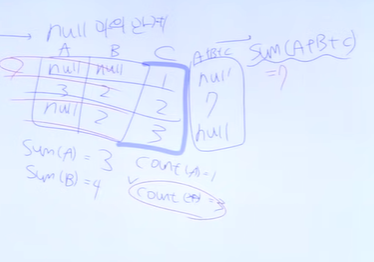

# SQLD 강의

- FROM → WHERE - GROUP BY - HAVING - SELECT - ORDER BY
- 명령어 종류
    - DML: SELECT, INSERT, DELETE, UPDATE
    - DDL: ALTER, CREATE, MODIFY, DROP
    - TCL: ROLLBACK, COMMIT
    - DCL: GRANT, REVOKE
- DISTINCT, AS, CONCAT
    - DISTINCT(집약): 중복된 컬럼을 하나로 집약시킨다.
    - AS(SELECT): AS 생략가능, 컬렴명에 띄어쓰기 있는 경우 “A B”로 사용
    - AS(FROM): AS 사용불가.
    - CONCAT (+ SQL SERVER, || ORACLE)
- 연산자와 연산자 우선 순위, 와일드카드
    - 논리연산자 AND, OR, NOT
    - 연산자 연산순위: 1. NOT, 2. AND, 3. OR
    - SQL 연산자: BETWEEN, IN, LIKE
    - 와일드카드: LIKE_L% (L이 포함된 모든 컬럼)
    - 이스케이프 문자: LIKE ‘A_A” = ‘A@_A’
    → @: 아무 문자나 가능
- ROWNUM과 TOP
    - ROWNUM(ORACLE): WHERE절에서 ROWNUM=1인 경우 포함한다.
    - TOP(SQLSERVER): SELECT TOP N COLUMNNAME: 컬럼에서 상위 N개 행을 SELECT
    - WHERE절에 ROWNUM 사용시, ROWNUM 절은 ORDER BY 절 전에 시행된다.
- NULL
    - NULL: 
    1. NULL의 정의: 부재, 모르는 값. 
    2. NULL의 산술 연산: NULL+X, NULL-X :  알 수 없음(UNKNOWN)
    3. NULL의 비교 연산: WHERE 절에 UNKNOWN이 들어가면 사실상 FALSE
    4. NULL의 정렬상 의미: ORACLE에서는 무한대(정렬시 마지막 행). SQL SERVER에서는 -무한대.(정렬시 첫 행)
    5. NVL, NVL2, ISNULL : (값1, 값2), (값1, 값2, 값3), (값1, 값2) 
       → 값 1이 NULL이면 값2
       → 값 1이 NULL이면 값3, 값1이 NULL이 아니면 값2
       → 값 1이 NULL이면 값2
    6. NULLIF, (값1, 값2)
       → 값1과 값2가 같으면 NULL, 다르면 값1
    7. COALESCE: 널 아닌 첫번째 값 (값1, 값2 …)
       → 값1이 NULL이면 NULL, 값2가 NULL이 아니면 값1, 값3가 NULL이면 NULL
- 정렬(SORT)
    - 정렬: 
    가장 마지막에 시행
    성능이 느려질 가능성, NULL값 과의 관계
    컬럼 번호 정렬(출력되는 컬럼의 수보다 큰 값 불허)
    인수가 두 개인 경우: 1번째 조건이 같으면 2번째 조건으로 오름차순
    출력되지 않은 컬럼명으로 조회 가능
    - ORDER BY절의 결과를 ROWNUM 하고 싶다면 FROM절에 이중쿼리문으로 해야 한다.
- 함수(숫자, 문자열, 데이트, CASE)
    - ROUND, CEIL(ORACLE), CEILING(SQL)
    - UPPER, LOWER
    - LPAD, RPAD, LTRIM, RTRIM
    - SUBSTRR, NSTR
    - TO_CHAR, TO_DATE
    - SYSDATE(ORACLE), GETDATE(SQLSERVER)
    - 날짜데이터 +100(숫자) : 100일 뒤로 계산(DEFAULT를 DAY로 계산)
    - CASE
              WHEN
              THEN
              WHEN
              THEN
    ELSE
    END
    → ELSE가 없을때, WHEN 조건 2개 다 만족하지 않으면 NULL이 나온다.
    - DECODE
- 집계함수
    
    
    
    - SUM(A+B+C) = 7
    SUM(A) + SUM(B) + SUM(C) = 13
    - GROUP BY: 집약기능. WHERE절 다음에 시행. 그룹 수준으로 정보를 변경
- JOIN
    - NATURAL JOIN, USING: 중복된 컬럼을 하나로 출력. 중복된 컬럼이 제일 앞에 등장.
    - A LEFT OUTER JOIN B = A COLL = B COLL(+)
    - FROM A,B,C = A와B를 조인한 결과로 C와 조인.
- SUBQUERY
    - SELECT    (스칼라 서브쿼리)
    FROM   (INLINE VIEW, 메인 쿼리의 컬럼 사용 가능)
    WHERE  (거의 모든 서브쿼리, 중첩 서브쿼리)
    GROUP BY (서브쿼리 사용 불가능)
    HAVING (거의 모든 서브쿼리, 중첩 서브쿼리)
    ORDER BY (스칼라 서브쿼리)
    - 상호연관 서브쿼리에서 선행 쿼리의 컬럼 하나마다 후행 쿼리의 모든 행을 다 연산한다.
    - IN, ANY(SOME), ALL, EXIST(일치 값이 있으면 TRUE, 없으면 FALSE)
- 집합연산자
    - UNION, INTERSECT, MINUS(EXCEPT), UNION ALL(중복데이터가 있고 정렬작업을 하지 않으며 빠르다.) 
    → UNION ALL 제외 모두 정렬 작업이 있다.
- DDL
    - TRUNCATE, DROP
    → TRUNCATE는 입주민 퇴거(구조는 남아있다), DROP은 철거(구조도 삭제)
    - TRUNCATE, DELETE
    → TRUNCATE는 DDL, DELETE는 DML (ROLLBACK 과 COMMIT)
- DML
    - INSERT, UPDATE, DELETE : TCL COMMIT ROLLBACK과 연관지어 나옴
    - MERGE
- 제약조건
    - PK, UNIQUE, NOT NULL
- DCL
    - GRANT, REVOKE
    - ROLL의 특징(명령어가 아닌 객체이다.)
- VIEW
    - 독립성
    - 편리성
    - 보안성
- 그룹함수
    - ROLL UP: ROLLUP(A, B) ≠ ROLLUP(B, A)
    - CUBE: CUBE(A, B) = CUBE(B, A)
    - GROUPING SETS
    - GROUPING
    - 총합행이 있으면 ROLL UP, CUBE
    - 양쪽으로 다 결과가 나오면 CUBE, 한쪽만 나오면 ROLLUP
    - 총합행이 없으면 GROUPING SETS
- TCL
    - COMMIT< ROLLBACK
    - AUTO COMMIT OFF AND BEGIN TRANSACTION
- 윈도우 함수
    - ROWS, RANGE(같은 값 유무)의 차이점
    - RANK(중복 건너뛴다. 1, 1, 3), DELSE RANK(건너뛰지 않는다. 1, 1, 2, 3)
    - PARTITION BY, ORDER BY
- 계층형 질의
    - PRIOR 자식 데이터 = 부모데이터
    - 부모 데이터 → 자식데이터 (순방향)
    - 자식 데이터 → 부모데이터 (역방향)
        
        
        
- 절차형 PL/SQL
    - EXCEPTION → 생략 가능
    - PROCEDURE와 TRIGGER, USER DEFINED FUNCTION의 차이점
    TRIGGER는 COMMIT, ROLLBACK 불가능
    PROCEDURE는 값이 나오지 않을 수 있음
    USER DEFINED FUNCTION은 반드시 값이 나온다.
- 데이터 모델링
    - 데이터 구조화
    데이터 자체 (관계형 데이터베이스)
    객체 지향 데이터베이스(망함)
    - 엔터티의 특징 : 
    특성(인스턴스)를 두 개 이상 가져야 한다. 관계를 하나 이상 가져야한다. 업무에서 사용되어야한다. 업무 프로세스에 이용되어야 한다.
    - 엔터티의 분류 : 
    유형 엔터티, 개념 엔터티, 사건 엔터티
    기본 엔터티, 중심 엔터티, 행위 엔터티
    
- 속성
    - 관리하고자 하는 대상(인스턴스)의 특성들 = 속성
    - 분류 : 
    기본 속성, 설계 속성, 파생 속성
- 도메인
    - 데이터 유형, 크기, 제약 조건.
- 관계
    - IE 표기법, BAKER 표기법
    - IE: PK를 위로, 나머지 속성을 밑으로
    - BAKER: #PK 나머지 속성
- 식별자
    
    
    
    - 주식별자 특징 : 
    유일성, 최소성, 불변성, 존재성
    - 4가지 특성 모두 만족하는 것이 후보키, 그 중 하나가 기본키, 기본키가 아닌 후보키가 대체키.
    - 카디널리티 실선과 점선, 까마귀발
    - 식별(강한 관계, SQL구문이 복잡해짐, PK속성이 늘어난다.)
    - 비식별(약한 관계, 조인이 많이 필요해 느려진다.)
- ERD 서술 규칙
    - 시선을 좌상에서 우하로
    - 관계명 반드시 표기하지 않아도 된다.
    - UML → 객체지향에서만 쓰인다.
- 성능 데이터 모델링
    - 아키텍쳐 모델링
    테이블, 파티션의 구조 개선
    - SQL 명령문 수정
    조인 수행원리, HASH조인, 옵티마이저, 실행계획
- 정규화
    - 1차 정규화 (원자성)
    - 2차 정규화 (부분 함수 종속 제거)
    - 3차 정규화 (이행 함수 종속 제거)
    - BCNF (후보키가 기본키를 다수 상속할 때 후보키 기본키로 분리)
    - 이상형상 (삭제, 삽입 이상)
    - SELECT 절에서는 JOIN으로 인해 느려질 수 있다.
    - INSERT, UPDATE시 테이블이 작아져 빨라진다.
- 반정규화
    - 데이터 무결성을 해칠 수 있다.
    - 대량 범위, 범위 처리, 통계처리에 해당할 때
    응용 시스템 변경, 클러스터링/인덱스, 뷰 테이블을 수행하고 안되면
    테이블 반정규화(병합[1:1, 1:N병합, 슈퍼/서브 병합], 분할[부분 테이블 분할, 통계 테이블 분할, 중복 테이블 분할])
    속성 반정규화(파생, 오류, 이랙컬럼, PK 일반속성으로 편입, 중복속성)
    관계 반정규화(중복 관계 추가) 시행
- 대량 데이터에 따른 성능
    - ROW MIGRATION과 체이닝
    - LIST, RANGE, HASH 파티셔닝
    HASH는 관리가 어렵고 RANGE는 쉽다.
- 슈퍼/서브 타입
    - 용량 적은 경우에는 ONE TO ONE 타입
    - 용량 큰 경우에는 공통/차이에 따라 별개의 트랜잭션
    - 전체 통합으로 트랜잭션
- 분산 데이터 베이스
    - 데이터 무결성을 해칠 수 있다.
- 조인 수행 원리
    - NL, SORT MERGE, HASH JOIN
    - NL JOIN : 랜덤 엑세스, 대용량 소트 작업시 유리
    - SORT MERGE: JOIN키 기준으로 정리, 비등가 조인 가능
    - HASH JOIN : 등가 조인만 사용 가능, 선행 TABLE이 작을 수록 유리, 별도 공간 필요(리소스)
- 옵티마이저
    - CBO(비용기반 옵티마이저), RBO(규칙 기반 옵티마이저)
- 인덱스
    - 인덱스 사용시기 : 부정형, LIKE 함수, 묵시적 형변환시 사용되지 않음
    - DML 작업은 인덱스 사용시 성능 저하.
- 실행 계획
    
    
    
    - 같은 레밸이면 하나의 단위로, 단위 안에서의 실행 게획 순서는 들여쓰기를 기준.