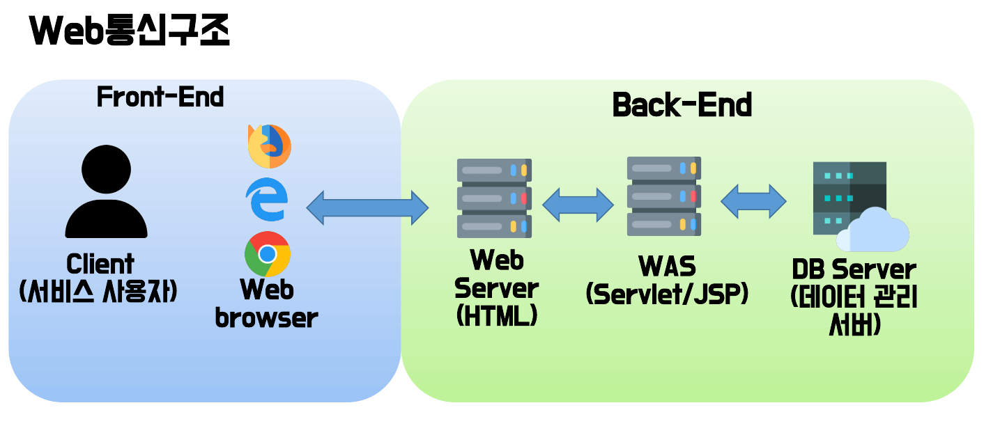
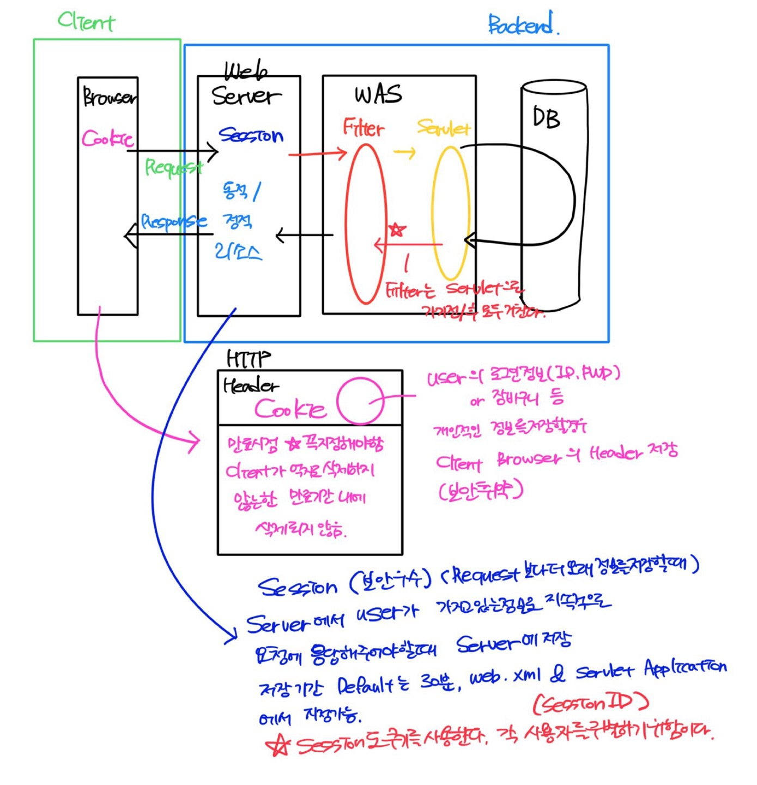

# Servlet&JSP

<aside>
💡 Servlet은 HTML, JSP를 비롯한 프론트 언어와 Java간의 통신을 위한 계층구조. 
JSP는 Servlet에서 HTML 언어를 사용할 때의 불편함을 해소하기 위한 라이브러리.

</aside>

# 1. 개요

- 웹통신 개요
    - 통신 구조
        
        
        
        - Web Server = 정적인 페이지 (페이지가 아닌 코드가 기준. JS도 유저 입력에 따른 동적 변화를 보여주지만, 코드 자체는 변화하지 않기에 정적인 페이지.)
        - WAS (Servlet/JSP) = 동적인 페이지 (Web Server에서 준비되지 않은, 사용자의 요구에 따른 페이지를 노출)
            - WAS(Web Application Server) : 사용자가 요청한 서비스의 결과를 스크립트 언어 등으로 가공하여 생성한, 동적인 페이지를 사용자에게 보여주는 역할을 한다.
        - DB Server(데이터 관리 서버) = 단, WAS는 스스로 페이지를 만드는 것이 아닌, DB에서 준비된 데이터를 기반으로 동적인 페이지를 만들어 노출한다.
        - 정적 로딩과 동적 로딩은 서블릿과 JSP 컨테이너의 차이, 즉 프로그램 종료 시 WAS를 재 구동 해야 하는지의 차이. (eclipse에서 변경된 내용이 tomcat을 종료하지 않아도 반영된다.)
    - 통신 방식
        
        
        
        - CGI(Common Gateway Interface) : 웹 서버가 직접적으로 웹 프로그램을 실행하는 것을 말한다. 동일한 프로그램에 대한 요청이 있을 때마다 각각 프로그램을 실행, 요청과 프로토콜이 1:1 매칭되어 시행된다. Perl이나  C/C++언어를 사용하여 프로그램을 작성한다. 요즈음에는 잘 쓰이지 않는 방식. (리소스 소모가 심하다)
        - WAS(Web Application Server) : 웹서버가 웹 애플리케이션 서버에 요청하면 웹 애플리케이션 서버가 해당되는 프로그램을 실행하는 방식. 한 프로그램에 여러 요청이 있을 경우 한 개의 프로그램을 실행하여 그 프로그램의 다수 요청을 처리한다. (멀티 쓰레드)
        - WAS는 Servlet(CGI, JSP)을 관리한다. Servlet은 Controller와 유사하다.
        - JSP는 HTML 페이지 안에 JAVA 코드를 사용할 수 있게 하는 것.
- Server
    - 개요
        - Web Server: 사용자에게 HTML 페이지나 jpg.png와 같은 이미지를 HTTP 프로토콜을 통해 웹 브라우저에게 제공하는 서버로. 내부의 내용이 이미 만들어져 있는 정적인 요소들을 화면에 보여주는 역할을 한다.
            
            
            
        - Web Server 와 WAS의 차이점.
            
            
            
        - → 여기서 말하는 데이터는 DB
    - 연결방법
        - 최초 실행(새로운 로컬 레포지토리)이라면 encoding 확인 필수 (총 4개)
        - Tomcat 설치 (레포지토리에 dev 폴더 생성 후, 해당 폴더에 압축 해제)
        - Preferences에서 Server - Runtime Environments에 tomcat 등록
        - 이클립스에서 Dynamic Web Project 프로젝트 생성
        - 생성시 Context root와 Content directory 확인. Generate web.xml deployment descriptor 체크 확인
        - next 2회 후 content directory web으로 변경
        - web 디렉토리에서 jsp 파일 생성 (index.jsp로)
        - 하단의 servers에서 Apache → 톰캣 버전 확인 후 지정 (next)
        - 생성한 Dynamic Web Project 지정
        - 생성된 tomcat 서버에서 sever option의 serve modules without publishing 체크
        - Ports 번호 변경 (중복되지 않는 번호로)
        - 실행 시 생성한 Dynamic Web Project  지정
        - * Project의 Properties에서 project Facets 확인.

# 2. 서블릿(Servlet)

- 규약
    
    
    
- 동작 구조
    
    
    
    - 웹 서버에서 사용자가 요청한 페이지가 준비되어있는지 판단한다.
    - 판단 후 준비되어있지 않다면 사용자가 요청한 정보를 서블릿 컨테이너로 전송한다.
    - 서블릿 컨테이너는 요청 단위마다 하나의 스레드로 묶어 서블릿 객체를 호출한다.
    - 서블릿 객체는 사용자가 요청한 정보를 바탕으로 객체를 생성한다..
    - 서블릿 컨테이너는 전송받은 객체로 동적인 페이지를 만든다.
    - 생성된 페이지는 웹 서버로 전송, 사용자에게 반환(응답)한다.
- 라이프사이클
    
    
    
    - Tomcat 최초 실행 시 Servlet은 웰컴 페이지(index.html)을 호출한다.
    - 이후 웰컴 페이지에서 a 태그를 통해 다른 class를 호출할 때, web.xml을 이용하거나 @annotation을 이용하는 두 가지 방법이 있다. 이를 서블릿 mapping이라고 한다.
    - 두 가지 방법 모두 서블릿 라이프사이클을 따른다. (MVC MODEL2의 개념을 Service 단계 안에서 확장해서 생각하자.)
    - web.xml 파일 이용
        - web.xml 파일을 이용하는 경우는 아래와 같다.
            
            
            
        - <servlet></servlet> 태그 안에서
            - <servlet-name></servlet-name> 태그를 이용, 매핑할 서블릿의 이름(변수명)을 지정한다.
            - <servlet-class></servlet-class> 태그를 이용, 클래스 파일의 정확한 디렉토리를 명시한다.
        - <servlet-mapping></servlet-mapping> 태그 안에서
        - <servlet-name></servlet-name> 태그를 이용, 매핑할 서블릿의 이름(변수명)을 지정한다.
        - <url-pattern></url-pattern> 태그를 이용, 서블릿 url-pattern의 URL을 규정한다. 여기서 URL은 웰컴 페이지에서 a 테그를 통해 명시된 루트 경로와 일치해야 한다.
            
            
            
        - 위 예제의 경우, 디폴트 서블릿을 사용했다. 단, url-pattern의 상세 설정과 방법은 아래의 stack-overflow를 참조하자.
            
            
            
    - @annotation 이용
        - 어노테이션의 경우 훨씬 간단하다. a 태그를 통해 호출할 클래스 위에 어노테이션을 이용, @WebServlet()을 추가하면 된다. () 안에는 웰컴 페이지에서 정의한 a태그의 url 경로를 적는다.
        - 어노테이션의 경우 xml 파일과는 달리, 클래스 파일의 절대 경로를 명시하지 않는다. 이는 웰컴 페이지에서 a태그를 이용해서 클래스 파일을 호출 시, 프로젝트의 모든 @annotation을 체크 한 후 일치하는 url 경로를 검색하는 시스템이기 때문이다.
            
            
            
        - → 디폴트 서블릿 방식의 url-pattern을 이용한 호출.
        - 단, 어디까지나 사용이 간단할 뿐. annotation 자체가 극히 어려운 기술인 만큼, 쉬운 방법은 아님에 유념하자. 추후 오류와 충돌을 생각하면 차라리 web.xml 을 이용한 호출이 더 쉬워보인다.
- 구동
    
    
    
    - 유저가 http 프로토콜을 통해 Request할 때, Web Server는 사용자의 Request를 WAS에 전달한다.
    - WAS는 서블릿 컨테이너로 사용자로부터 받은 Request에 Response를 같이 보낸다.
    - 서블릿 컨테이너는 스레드를 통해 사용자의 Request에 부합하는 Response를 Was로 보낸다. (결과 전송)
    - WAS는 유저에게 http 프로토콜을 통해 Response를 반환한다.
        
        
        
    - → 어노테이션 방식의 서블릿 구동.
    - [servlet 파일로 생성 시 생략 가능하다.]
- Tomcat의 대략적인 작동 흐름
    
    
    
    - socket으로 input, outputStream을 잇는 스트림을 만든다.
    - while문으로 3-way handshake TCP 통신 방법을 만든다.
    - String 자료형으로 HTML 기본 규약을 설정한다. (responseText ~ whiteLine)
    - write를 통해 header 부분에 앞서 설정한 HTML 기본 규약을 내보낸다.
    - write를 통해 body 부분에 실제로 작성할 내용을 내보낸다.
    - flush()를 통해 잔류 바이트를 보낸다.
    - socket과 listener를 닫는다.
- 서블릿 메소드
    - GET
        - URL 창의 “?” 뒤에 데이터를 입력하는 방식(쿼리스트링)으로 보낸다. 데이터가 여러 개일 경우에는 &으로 묶어서 보낸다. 255byte까지 가능하며 Request 객체의 Head 부분에 담긴다. 데이터 검색에 많이 사용되며 보안에 취약하다..
        - doGet() : client에서 데이터 전송 방식을 get방식으로 전송했을 때 호출되는 메소드.
            
            
            
    - POST
        - HTTP헤더의 내용으로 보내는 방식이며 데이터 크기에 제한이 없다(파일 첨부도 가능하다). URL에 데이터가 노출되지 않아 보안에 더 적합하다.
        - doPost() : client에서 데이터 전송 방식을 Post 방식으로 전송했을 때 호출되는 메소드
            
            
            
        - 단, doPost()의 경우 GET 요청방식과는 달리, 인코딩 방식을 별도로 명시하지 않으면 기본 ISO-8859-1로 해석하게 된다. 따라서 한글인 값을 꺼내오면 글자가 깨지게 되므로, 별도의 인코딩 과정이 필요하다.
            
            
            
    - doGet의 사용 이유
        - doPost는 doGet에 비해 쿼리스트링을 노출하지 않는 보안성, 255bite인 doGet에 비해 무제한의 용량과 파일도 첨부할 수 있는 확장성을 가지고 있다.
        - doGet에서 지원하는 기능 중 doPost에서 지원하지 않는 기능은 없다.
        - doGet을 사용하는 이유는 보안성이 필요하지 않은, 내부 프로토콜에서 비교적 가벼운 업무를 수행할 때 필요해진다. [doPost에 비해 필요 리소스가 적다]
        - 또한, 추후 스프링 단계에 가면 동일한 request객체에 각자의 역할에 따라 doGet과 doPost를 던질 수 있다. (HTTP Protocol의 Hearder와 Body에 태워서)
        - 또한, 추후 CRUD에 맞춰 doGet(SELECT), doPost(INSERT), Put(UPDATE), Delete(DELETE)의 역할을 별도의 지침(HTTP Protocol)으로 정할 수 있다. 이를  REST API라고 한다.
    - HttpServletRequest & HttpServletResponse (interface)
        - HTTP Servlets을 위한 요청 정보(request information)를 제공하는 메소드와 요청에 대한 처리결과를 작성하기 위해 사용하는 객체.
            
            
            
        - 단, servlet 파일로 생성 시 생략 가능하다.  request information과 response information은 doGet()과 doPost()에서 매개변수로 HttpServletRequest과 HttpServletResponse를 받으면서 사용 가능하다.
    - HttpServletRequest 메소드
        
        
        
        - getParameter(String) : request로 받은 값은 모두 String 타입이다. doGet 메소드의 매개변수 request에 담긴 값을 각각의 key값에 맞춰 가져올 때 사용한다. String 타입을 다른 자료형으로 변화하고 싶다면 wrapper 클래스를 이용하여 형변환이 필요하다.
            
            
            
        - getparameterNames() :  request()로 받은 키 목록만 확인하고 싶을 때 사용한다. Enumberation을 사용해야 한다. (Iterator와 유사하나, 스레드에 안전하고 컬렉션 삭제 기능이 없다는 차이가 있다.)
            
            
            
        - getParameterValues(String): getparameter(String)과 유사하다. 단, request로부터 전달받는 값이 하나가 아닌 여러 가지일 경우, getParameterValues(String)을 사용한다. 또한, 변수의 자료형으로 String[]을 사용해야 한다. 
        → 단, valueOf로 받을 수 있는 자료형에 유의하자. (boolean은 배열이 지원되지 않음)
            
            
            
        - getParameterMap() : request로부터 전달받은 값을 출력한다는 점은 getparameter와 동일하나, Map형식으로 전달받은 모든 데이터를 일괄로 처리할 수 있는 메소드.  내장 메소드인 remove()를 지원한다.  출력은 Iterator를 사용한다.
            
            
            
    - HttpServletRequest 메소드 (2)
        
        
        
        - setAttribute(String) : request에 받아온 데이터(JDBC에서 DB의 데이터를 받아오는 등의) 를 추가할 때 사용한다.
            
            
            
        - getAttribute(String) : request의 attribute를 꺼낼 때 사용한다. 단, request의 attribute는 Object형이기에 다운캐스팅이 필요하다.
            
            
            
        - removeAttribute(String) : request에 저장된 속성을 삭제하는데 사용된다.
        - getRequestDispatcher(String) : forward() 메소드와 같이 사용된다. request, response 객체를 다른 서블릿으로 전송할 때 사용한다.
            
            
            
    - HttpServletResponse 메소드
        
        
        
        - setContentType(String) : String 타입으로 MIME type을 규정한다.
            
            
            
        - setCharacterEncoding(String) : Encoding 방식을 규정하는 메소드. setContentType으로 같이 보낼 수 있다.
        - sendRedirect(String) : redirect() 메소드와 같이 사용된다. response 값으로 원하는 페이지나 다른 서블릿(URL-Patton)을 전송하는데 사용된다.
- Header & Body
    - Header (Request)
        - Request의 Header는 HTTP 헤더의 기본 구조를 따른다. . 대소문자 구분 없는 문자열 다음에 콜론이 붙으며, 그 뒤에 오는 값은 헤더에 따라 달라진다.  헤더는 값까지 포함해 한 줄로 구성되지만 길어질 수 있다.
            
            
            
        - General Header : 요청 및 응답 모두에 적용되지만 최종적으로는 바디에 전송되는 것과는 관련이 없는 헤더.
        - Request Header : 패치 될 리소스나 클라리언트 자체에 대한 상세 정보를 포함하는 헤더
        - Response Header :  위치나 서버 자체와 같은 응답에 대한 부가적인 정보를 가지는 헤더.
        - Entity Header : 컨텐츠 길이나 MIME 타입과 같은 엔티티 바디에 대한 상세 정보를 포함하는 헤더. 
        → 요청 및 응답에 모두 사용되며, 메시지 바디의 컨텐츠를 나타내기에 GET 요청은 해당되지 않는다.
    - Body (Request)
        - Request의 마지막 부분에 들어간다. 모든 Request에 본문이 들어가지는 않는다. GET, HEAD, DELETE, OPTIONS 처럼 리소스를 가져오는 요청은 보통 본문이 필요 없다. 일부 Request는 업데이트를 하기 위해 서버에 데이터를 전송한다.
        - Body는 넓게 보면 두 가지 종류로 나뉜다. 그 구분은 아래와 같다.
        - Single-Resource Bodies(단일-리소스 본문) : 헤더 두 개(Content-Type과 Content_length)로 정의된 단일 파일로 구성된다.
        - Multiple-Resource Bodies(다중-리소스 본문) : 멀티파트 본문으로 구성 되는 다중 리소스 본문에서는 파트마다 다른 정보를 지니게 된다. 보통 HTML 폼과 관련이 있다.
    - Header (Response)
        - Response에 들어가는 HTTP 헤더는 다른 헤더와 동일한 구조를 따른다.
            
            
            
    - Body (Response)
        - Request의 마지막 부분에 들어간다. 모든 응답에 본문이 들어가지는 않는다. 201, 204와 같은 상태 코드를 가진 응답에는 보통 본문이 없다.
        - 넓게 보면 세가지 종류로 나뉜다. 그 구분은 아래와 같다.
        - 이미 길이가 알려진 단일 파일로 구성된 단일-리소스 본문: 헤더 두개(Content-Type과 Content-Length)로 정의된다.
        - 길이를 모르는 단일 파일로 구성된 단일-리소스 본문: Transfer-Encoding가 chunked로 설정되어 있으며, 파일은 chunked로 나뉘어 인코딩 되어 있다.
        - 서로 다른 정보를 담고 있는 멀티파트로 이루어진 다중 리소스 본문 : 이 경우는 상대적으로 위의 두 경우에 비해 보기 힘들다. 브라우저에서 서버로 완선된 HTML From의 multipart/form-data 값을 보낼 때 사용한다.
- Response Exception
    - sendError() : HTTPServlet에서 발생하는 예외상황 (404 에러, 500에러 등)을 처리하기 위한 메소드.
        
        
        

# 3. 포워드(forward) & 리다이렉트(redirect)

- 통신
    - forward와 redirect 모두 TCP 통신 기반의 3-ways handshake를 기반으로 한다.
    - 단, 크롬의 경우 Keep-Alive 기능을 통해 서로 다른 서블릿으로 이동해도 통신이 단절되지 않고 이어진다.
- forward
    
    
    
    - forward로 연결되기 전, 두 servlet은 connectless(무연결) 해서 stateless(무상태)하다.
    - forward 이후 두 servlet은 연결된다.
    - 포워딩은 각각의 servlet마다 역할을 부여하는 것이 핵심. client는 하나의 servlet만 알고, forward 된 다른 dervlet은 알 수 없다.
    - 일반적으로 redirect보다 성능면에서 더 빠르다.
    - forward() 메소드를 사용하는 동안 요청 및 응답 객체는 하나만 존재한다.
- redirect
    - redirect는 forward와는 달리, 클라이언트 쪽에서 서로 다른 서블릿에 연결한다.
    - sendRedirect() 메소드를 이용한다.
        
        
        
        
        
    - sendRedirect() 메소드로 던져진 URL-patton을  annotation으로 받은 뒤, HttpServletRequest, HttpServletResponse 프로토콜로 변수에 담긴 값을 활용할 수 있다.
    - sendRedirect() 메소드를 사용하는 동안 객체는 요청과 응답이 두개씩 존재한다. 첫 번째 서블릿에서 client의 요청을 수신하고, 해당 요청을 다른 서블릿으로 redirect 하면서 두 번째 서블릿에서 새로운 요청과 응답이 형성되며, 해당 응답이 client로 응답된다.
    - 타 서블릿으로 redirect를 하면 request는 서로 공유되지 않는다. (stateless)
    → (Broser의 Request값을 A서블릿에서 request로 받은 뒤, B 서블릿으로 넘긴 것은 response 객체이기 때문에)
    - 따라서 request는 쿠키 또는 세션을 통해 값을 공유해야 한다. (인스턴스 생성)
        
        
        

# 4. Cookie & Session

- 정의
    - TCP기반의 3-ways handshake 통신 기법은 안정성은 있지만 리소스의 부담과 속도에 문제가 있다.
    - Browser와 apache tomcat은 TCP 기반 통신이지만, 리소스 낭비를 줄이기 위해 Browser와 apache tomcat 사이의 통신을 완전히 단절(connectless)하는 것이 아닌, 연결은 이어져있되 기억하지 않는 방식을 사용한다. (자동 로그인, 비밀번호 저장 같은 기능)
    - 이 때 연결이 되었다는 상태(state)를 기억하기 위한 수단이 cookie와 Session.
    - 대기업은 cookie, 아니면 session을 사용한다.
    - cookie는 저장 기간이 장기간이기에 보안성에 취약하고, session은 단기간이기에 보안성이 더 좋다.
    - 어플리케이션← was ← web server(30분) 순으로 세션(쿠키)가 유지되는 시간이 결정된다. (어플리케이션이 가장 우선순위가 높다.)
    - 쿠키는 만료시간 완료 전, 혹은 수동 삭제 전까지는 삭제되지 않고 계속 쌓인다. (삭제회원처럼)
    - 자동 로그인의 경우, 로그아웃을 해도 기존의 쿠키 값은 상태기록이 Y→N으로 변경될 뿐, 삭제되지 않는다는 의미. (마치 탈퇴회원을 관리하는 것처럼)
    - 이 상황에서 타 아이디와 비밀번호로 로그인 시, 구글의 다중 아이디 관리처럼 쿠키가 쌓이는 식.
    - 단, 동일한 아이디일 경우 쿠키가 새로 쌓이는 것이 아닌, 상태기록이 변경된다.
    
    
    
- Cookie
    - new 연산자를 이용하여 request로 받은 values값을 Cookie의 values값으로 하는 생성자를 생성한다.
        
        
        
    - 해당 쿠키의 만료 시간을 설정한다. 
    이 때 만료시간은 Session과는 달리, setMaxAge()를 통해서만 설정 가능하다. 이 때 가급적 1~2년 정도의 장시간을 잡으며, 별도로 설정하지 않을 시 default값이 -1로 설정되어 생성되자마자 죽는 식이다.
        
        
        
    - 응답 헤더에 쿠키를 담는다. response에 앞서 new 연산자를 통해 설정한 생성자를 addCookie를 통해 매개변수로 담는다.
        
        
        
    - Redirect나 forward 객체를 이용해 응답한다.
        
        
        
    - 던져진 쿠키는 request에서 쿠키 목록을 쿠키 배열 형태로 꺼내온다.
        
        
        
    - 이후 for문을 이용하여 쿠키의 getName과 getValue를 이용해 쿠키에 담긴 값을 사용할 수 있다.
        
        
        
- Session
    - 세션의 경우, 쿠키와는 다르게 HttpSession을  new 연산자를 이용하여 직접 생성할 수 없고, request에 있는 getSession()메소드를 이용해서 리턴 받아야 한다.
        
        
        
    - 세션의 경우, 쿠키와는 다르게 유지시간을 설정하는 방식이 다양하다.
    - HttpSession 객체를 통해 세션을 생성했을 때, 기본적으로 1800초의 유지시간을 가지며
    - web.xml에서 시간 설정도 가능하며 (분단위)
        
        
        
    - 마지막으로 sevlet에서 Cookie의 setMaxAge()메소드처럼 setMaxInactiveInterval() 메소드를 통해서 설정 가능하다. (초단위)
        
        
        
    - 각 지속시간의 우선순위는 HttpSession → web.xml → setMaxInactiveInterval() 메소드 순서로 우선순위가 높다. (HttpSession이 가장 낮음)
    - 이후 객체를 이용하여 응답하는 방식은 Cookie와 동일하다. (response.sendRedirect(), forward)
    - for문이 아닌, Enumeration을 이용해서도 키 목록을 반환할 수 있다.
        
        
        
- 그 외 사항
    - 세션의 경우, session.getId() 메소드를 이용하여 해당 세션 객체가 동일한 객체인지 (동일한 브라우저인지) 확인 가능하다. hasCode와 유사한 맥락. (단, 크롬의 경우, 브라우저 창이 종료되도 세션이 유지된다. (Keep-Alive 기능)
    - session.removeAttribute() 메소드를 이용하여 Value 값으로 전달받은 특정 Attribute를 삭제하거나
    - session.invalidate()를 통해 세션에 저장된 데이터를 사용 불가능하게 만들 수 있다.
        
        
        
    - Session과 Cookie에 대한 비교
        
        [What are cookies and sessions, and how do they relate to each other?](https://stackoverflow.com/questions/11142882/what-are-cookies-and-sessions-and-how-do-they-relate-to-each-other)
        

# 5. Filter

- 정의
    - 필터란 HTTP 요청과 응답 사이에서 전달되는 데이터를 가로채어 서비스에 맞게 변경하고 걸러내는 필터링 작업을 수행할 수 있는 클래스.
    - Request : 보안 관련사항, 요청헤더와 바디 형식을 지정하며, 요청에 대한 log 기록을 유지한다.
    → 보안 관련 사항의 경우 암호화를 의미한다. 주로 Browser에서 입력된 정보(비밀번호 같은)를 암호화하여, DB에서도 해당 정보를 확인할 수 없게 하는데 사용된다. 
    → 요청헤더와 바디 형식의 경우, MIME 타입 지정, GET과 POST 방식 지정 등을 의미한다.
    - Response : 응답 스트림 압축, 응답 스트림 내용 추가 및 수정, 새로운 응답을 작성한다.
    - chain.doFilter(request, response) 메소드를 통해 다음 필터가 있으면 다음 필터로, 없으면 servlet으로 이동한다.
    - lifecycle의 경우, init → doFilter → destroy의 주기를 따른다. (메소드의 순서는 역순.)
        
        
        
    - 아래와 같은 url-patton을 이용할 경우, member/login 과 member/regist처럼 단계식으로 url 요청을 할 수 있다.
        
        
        
    - annotation의 경우, 
    @WebServlet("/first/filter") 혹은
    @WebServlet("/frist/filter2") 같은 방식으로 url패턴을 변경하여 다른 조건으로 연결할 수 있다. (filter는 
    @WebFilter("/first/*")
    의 방식으로 사용한다.
- 암호화
    - 정의와 방식
        - pass01 → asdfasdgqweqwe의 암호화 과정에서, 
        pass01 : 평문(plain text)
        → : 단방향 암호화
        asdfasdgqweqwe : 다이제스트라고 한다.
        그 반대 방향(다이제스트 → 평문)은 복호화라고 한다.
        단방향 암호화는 복호화가 불가능하게 하는 것. 
        단방향 암호화는 hash 암호화가 가장 대중적이다.
        - 단, hash 암호화만 사용할 경우, 다이제스트는 평문이 변하지 않는 이상 동일하기에, hash 암호화 기술에 추가적인 기술(salt)을 더한다. (SHA-224~512 방식)
        slat기술의 경우, 다이제스트 개념에 추가로 난수를 더하는 방식이지만, 이 역시 최근에는 뚫린 방식이다.
        - 수업의 목표는 Bcrypt 방식을 사용한다.
        - Bcrypt 는 SHA 방식에 시간을 더한 방식으로, 일정 시간마다 특정 횟수만 조회 가능하도록 하는 방식.
        - 실제 업무에서는 Bcrypt 방식에 일정 횟수 이상 틀릴 경우 로그인이 불가능하게 하는 방식.
    - Filter를 통한 암호화
        - 라이브러리가 필요하다. commons-logging과 spring-security-crypto 2개.
        - Dynamic  Web Project의 경우, 별도의 Library 등록이 없어도 자동으로 이루어진다.
        - 실행 주기는 아래와 같다.
        1. Filter 클래스의 doFilter method에서 browser로부터 전달 받은 request를 HttpServletRequest로 다운캐스팅 한다.
        2. 다운캐스팅 한 request 변수를 매개변수로 Request의 wrapper class를 호출한다.
        3. wrapper class에서 getParameter를 Override한다. 그 방식은 아래와 같다. 
            
            
            
        4. Wrapper Class로 재정의한 request를 chain.doFilter() 메소드를 이용하여 servlet에 매개변수로 넘긴다. 
            
            
            
        5. Servlet에서 암호화된 값을 확인하기 위한 방법은 복호화는 불가능하고, matches() 메소드를 이용하여 equals 관계인지를 확인해야 한다. (true, false)
            
            
            
    - hash 알고리즘 기준의 비크립트 암호화는 평문과 다이제스트를 Hash 알고리즘으로 비교했을 때, 비교값이 다이제스트 문이 나왔을 경우 matchs 메서드를 통과하는 방식으로 이루어진다. 즉, 복호화는 원칙적으로 불가능하다.
- Filter를 통한 request encoding
    - Filter를 통해 POST 타입의 인코딩을 사용할 수 있다.
        
        
        
    - web.xml 파일에서 filter class를 지정, <param-name>과 <param-value> 태그를 이용하여 매개변수와 value값을 지정한다.
    - <param-name> 을 통해 매개변수의 이름(<init-param>의 key)을
        
        
        
        
        
    - <param-value> 를 통해 해당 key 값의 value를 정한다. (UTF-8)
    - 이후 if문을 통해 POST타입에 대해 encoding을 실행하는 방식으로 web.xml 파일에서 매개변수로 받은 값을 filter 클래스에서 encoding 한다.
        
        
        

# 6. Listener

- 정의
    - JSP의 4가지 내장객체는 application(context), session, request, page가 있다.
    - 이 중 page는 프론트에서 담당하는 역할.
    - application, session, request는 attribute를 관리한다.
    - Listener는 attribute가 변경되는 순간, lifecycle, binding 등을 기억한다.
    - 감지 범위는 Listener를 생성할 때 정한다.
        
        
        
    - session clustering : 다른 WAS에 담긴 session 정보를 불러오는 것.
    
- ContextListener
    
    
    
- SessionListener
    - 주의할 점은 valueBound, valueUnbound.
    - 해당 메소드를 Listener 클래스에 생성할 경우 attributeAdded, attributeRemoved와 다를 바가 없다.
    - 따라서 valueBound, valueUnbound의 경우, DTO 객체와 같은 지정한 객체가 Bound, Unbound 될 때 Listener가 해당 사항을 감지할 수 있도록, 해당 객체에서 메소드를 지정해야 한다.
    - 지정 시, HttpSessionBindingListener implements는 삭제해야 한다.
    
    
    
- RequestListener
    
    
    

# 7. fileupload

- 흐름
    - commons-io, commons-fileupload lib를 저장한다.
    - index.html 파일에서 <form>,<input>,<button> 태그를 이용하여 파일 업로드가 가능한 페이지를 구성한다.
        
        
        
    - 단, 이때 encType="multipart/form-data”는 필수로 사용해야 한다.
    - encType="multipart/form-data”를 사용하지 않을 시 업로드된 서버의 파일을 다운로드가 불 가능하다.
    - encType="multipart/form-data”를 사용 시 getParameter가 불가능하다.
    
    ---
    
    - web.xml 파일에서 <param> 태그를 이용하여 저장경로, 파일최대크기, 인코딩 방식을 지정한다.
        
        
        
    - <context-param> 태그를 통해 <param-name>과 <param-value>로 map의 key와 value를 설정, 파일이 업로드 될 위치, 업로드 될 파일의 최대 크기, 업로드할 파일의 인코딩 방식을 설정한다.
    - 이때 파일의 최대 크기 설정은 byte값이 기준.
    
    ---
    
    - Servlet에서 web.xml에서 던진 저장경로, 파일최대크기, 인코딩방식을 전역변수로 설정한다.
        
        
        
    - 단, 이때 filesize는 int 자료형으로 형변환이 필요하다. (Integer.valueOf())
    
    ---
    
    - Servlet에서 if문을 활용, 받아둔 Lib에서 제공하는 내장 메소드를 이용하여 encType="multipart/form-data”이 넘어왔는지 여부를 판별, 이후의 fileUpload 과정을 조건문에 따라 설정한다.
    - ServletFileUpload에서 제공하는 isMultipartContent() 내장 메서드를 이용, request를 매개변수로 받은 뒤 해당 매개변수에 encType이 있는지 없는지를 판별한다.
        
        
        
    
    ---
    
    - List<Map<String, String>> varName = new ArrayList<>();로 request로 받은 파일을 담을 List 객체를 생성한다.
    - List의 제네릭인 Map<String, String>으로 파일의 이름을 key 값으로, 파일을 value값으로 설정한 뒤
    - 해당 Map 객체를 ArrayList에 담는 방식.
        
        
        
    
    ---
    
    - 파일이 아닌 경우에는 Map<String, String> 자료형을 이용, HashMap에 객체를 담는다. 이 경우 앞서 index.html에서 설정한 url-patton(name)인 description을 key값으로, <input> 태그에서 사용자가 입력한 값(여기에선 text)을 value값으로 삼는다.
        
        
        
    
    ---
    
    - 파일의 경우, 업로드 한 파일의 최대 크기와 임시 저장할 폴더의 경로를 인식시키기 위한 인스턴스가 필요하다. 이는 commons-io 라이브러리에서 제공하는 내장 객체 DiskFileItemFactory를 이용한다.
        
        
        
    - 설정한 인스턴스 변수를 활용하여 파일의 임시 디렉토리와 최대 크기를 매개변수로 삼아 레퍼런스 변수에 담는다.
        
        
        
    
    ---
    
    - 파일의 경우, 넘어오는 파일이 여러개일 경우 각각의 파일을 퍼싱(개별 파일로 잘라내는 것)하는 과정이 필요하다. 앞서 임시 디렉토리와 최대 크기를 setRepository()와 setSizeThreshold() 내장 메서드를 이용해 담은 fileItemFactory 레퍼런스 변수를 매개변수로 commons-io 라이브러리에서 제공하는 내장 객체 ServletFileUpload에 담은 인스턴스를 생성한다.
        
        
        
    
    ---
    
    - ServletFileUpload에서 제공하는 내장 메서드인 parseRequest() 를 이용하여 레퍼런스 변수에 담긴 각각의 파일들을 개별 파일로 뜯어낸 뒤, List<>타입으로 저장할 수 있다.
    - 해당 레퍼런스 변수는 내장 제네릭 타입인 <FileItem>으로 받는다.
    - FileUploadException 예외처리가 필요하다.
        
        
        
    
    ---
    
    - 이후 for문과 내장 if문을 활용, 예외처리 과정이 필요하다. 앞서 parseRequest() 내장 메서드를 활용하여 List타입에 뜯어낸 각각의 파일들이 담긴 레퍼런스 변수를 각각 if문으로 비교한다.
    - isFormFiled() 내장 메서드를 활용하여 꺼내온 파일이 file 타입인지 아닌지 구별한 후,
    - file 타입일 경우 getSize() 내장 메서드를 활용하여 해당 파일이 0보다 큰 크기인지를 판별한다.
        
        
        
    
    ---
    
    - 고객이 올린 파일 이름과 해당 파일을 새로운 이름으로 변경하는 과정이 필요하다.
    - 파일 이름을 변경해야 하는 이유는 다음과 같다.
    1. 한글이나 공백, 특수문자 등은 운영체제에 따라 문제가 발생할 수 있다.
    2. 파일 이름이 겹치게 되면 덮어쓰게 된다.
    - 우선 기존의 파일 이름을 담을 String 타입의 변수를 설정한다.  (originFileName)
        
        
        
    - 파일 이름을 변경시 확장자 이름은 변경되면 안되기에, 확장자 이름을 별도로 뜯어내어 새로운 변수에 담는 과정을 거친다.
    - dot 변수에 파일 이름에서 가장 마지막에 위치한 .의 위치를 뽑아낸 뒤(lastIndexOf)
    - subsgring() 메서드를 이용해 확장자 이름만 뽑아낸다.
        
        
        
    - 이후 UUID 자바 내장 메서드(java.util)를 활용하여 난수 문자열을 생성, 해당 난수 배열에 분리했던 확장자를 붙여 변경된 파일 이름 변수에 담는다.
        
        
        
    
    ---
    
    - 앞서 설정한 저장경로 변수와 변경된 파일 이름을 더해 파일을 저장한다.
        
        
        
    - 이후 저장한다.  (디렉토리로 파일 저장됨)
        
        
        
    
    ---
    
    - 파일 하나에 대한 필요한 정보를 Map에 담는다. 해당 Map에 담기는 내용은 DB모델링의 결과 속성에 해당 될 내용이다.
        
        
        
    - 이후 앞서 List<Map<String, String>> 타입으로 설정했던 List 타입 변수에 Map에 담긴 내용들을 add() 한다.
        
        
        
    
    ---
    
    - 파일이 아닌 데이터들 (텍스트같은)을 Map에 담는다. 기존 인코딩 방식을 이전에 설정했던 인코딩 방식(UTF-8)로 메소드 체이닝 방식으로 변환하는 과정이 필요하다.
        
        
        
    
    ---
    
    - 추가적인 예외처리 사항으로, 여러 파일을 올릴 때 하나의 파일이라도 업로드 되지 않으면 이전에 업로드되었던 파일을 삭제하는 과정이 필요하다.
    - try - catch를 통해 Exception 예외 사항이 발생한 상황이 file 업로드가 이루어지지 않거나, 다른 예외상황이 발생한 경우이므로, 해당 catch 구문 블럭에 for문과 if문을 활용하여 업로드된 파일을 삭제해야 한다.
        
        
        
    - int 자료형으로 변수를 설정한다.
    - for문을 통해 올라간 파일의 수 만큼 반복하는 for문을 설정한다.
    - File 타입 변수에 설정된 디렉토리에 저장된 파일들을 담는다.
    - 해당 레퍼런스 변수를 이용하여 올라간 파일들을 삭제한다.
    
    ---
    
    - 하나의 input 태그로 다중 파일을 올리고 싶을 때는 index.html에 multiple만 추가하면 된다.
    
- Resize
    - thumbnailIator API를 이용한다.
    - 리사이즈할 파일이 있는 디렉토리를 변수에 담는다. (originFilePath)
    - 리사이즈한 파일이 담길 디렉토리를 변수에 담는다.  (savePath)
    - thumbnailIator API가 제공하는 Thumnails의 .of(), .size(), .toFile() 내장 메서드를 이용하여 리사이즈한다.
        
        
        
    

# 8. JSP

- 정의
    - JSP(Java Server Page).  [Server Page는 SSR(Server Side Randering)이라고도 한다.]
    - JSP는 기본적으로 Servlet에서 HTML 코드를 작성하는 번거로움을 해결하기 위한 서블릿으로 생각할 수 있다.
    - JSP 기술의 목표는 Servlet의 Business 로직(Java)으로부터 화면 로직(HTML)을 분리하는 것.
- 실행 방식
    
    
    
    - 실행 방식은 위와 같다. Client가 요청한 페이지가 Web Container에 없는 동적인 페이지일 때. Servlet에서는 (JSP를 이용할 때) 동적 페이지를 만드는 과정을 가진다.
    - 이 때 JSP는  5가지 과정을 거친다. 그 과정은 아래와 같다.
    - translation : 최초 JSP 요청시, JSP 페이지를 Servlet으로 변환한다.
    - compile : Servlet.java 파일을 class 파일로 컴파일한다.
    
    
    
    - → jsp 폴더에서 생성한 jsp 파일이 WEB-INF/translate/org/apache/jsp/jsp 폴더의 .java 파일(Servlet)으로 변환된 뒤.
    .java 파일을 .class 파일로 compile 한것.
    - load : 생성된 class 파일을 읽는다.
    - initialization : 서블릿 컨테이너에서 변환된 서블릿을 이용해 인스턴스를 생성한다.
    - run : 매 요청 시마다 기존 JSP 파일을 확인후, 변경된 점이 없다면 생성된(initializaion) 인스턴스를 사용한다.
    → 변경점이 있다면, 다시 traslation 과정으로 돌아가 새로운 인스턴스를 생성한다.
- JSP Element
    
    
    
    - Comments tag : JSP 주석 태그. HTML 주석과는 달리 클라이언트에 노출되지 않는다.
    - Directive tag : JSP page 전체에 영향을 미치는 정보를 기술할 때 사용되며, page, include, taglib 지시자 태그가 있다.
        - page 지시자 태그(한 jsp 페이지에 대한 설정을 하는 지시자 태그)
        - errorPage, isErrorPage, import 정도는 기억해 두자.
            
            
            
        - include 지시자 태그(다른 jsp 파일을 포함하기 위해 사용하는 지시자 태그)
        → include 태그를 이용하여 인용한 페이지의 경우, 인용한 페이지와 인용된 페이지는 변수 이름을 공유한다. (하나의 지역 안의 변수들처럼) 즉, 인용한 페이지가 현재 페이지에 영향을 준다.
        - taglib 지시자 태그(xml 문법 기반의 라이브러리인 JSTL을 이용하기 위해 선언하는 지시자 태그)
    - Declaration tag : 선언 태그. 서블릿으로 변환 시, 선언 태그 내에 작성한 내용을 필드로 선언하는 태그.
        
        
        
    - Scriptlet tag : 간단한 자바 코드를 작성할 수 있는 태그. 선언 태그에서 작성한 내용을 초기화, 출력할 수 있으며 간단한 로직 처리도 가능하다. 
    → Scriptlet tag 내의 코드는 자바 코드이기에, ;(새미콜론)을 작성하지 않을시 컴파일 에러 발생 주의
        
        
        
        - Servlet 형태로 translation 된 .java 파일에서의 Scriptlet tag.
    - Expression tag : Scriptlet tag 처럼 간단한 자바 코드를 작성할 수 있는 태그. 단, Scriptlet tag와는 달리, Expression tag는 HTML 태그의 형식 안에서 사용되기에 새미콜론 사용 시 컴파일 에러가 발생한다.
        
        
        
        - Servlet 형태로 translation  된 .java 파일에서의 Expression tag.
- JSP와 Servlet
    - JSP는 구동 방식에서 Servlet으로 변환되어 서비스되기에, JSP역시 Servlet의 한 부분으로 볼 수 있다.
        
        
        
    - JSP forward
        - JSP는 그 구동 방식으로 인해, Servlet과는 다른 구조의 forward가 필요하다.
        
        
        
        - jsp에서 다른 jsp로 넘어갈 때, jsp는 servlet과는 달리 HTML(indexPage) → jsp → HTML(jspPage) → jsp의 과정을 거처야한다.
        - 1. HTML → jsp 페이지로 가는 과정은 a 태그를 통해 위치를 알고 있다.
        - 2. jsp → HTML 페이지로 가는 과정은 jsp에서 생성한 페이지를 뿌려주는 과정이기에, 위치 디렉토리 지정은 url-patton으로 충분하다.
        - 3. HTML → jsp의 과정에서, HTML 페이지는 가야하는 jsp 페이지의 위치(루트 디렉토리)를 알 수 없다.
        - 4. 따라서 첫번째 jsp 페이지에서 HTML 페이지를 생성할 때 form 태그의 action 생성자를 통해서 목표 jsp 페이지의 위치(패키지 이름, [request.getContextPath()])를 지정해야 한다.
            
            
            
        - 5. 위의 form 태그의 url-patton을 통해 Controller 역할을 할 서블릿에 request 정보를 전달한다.
        - 6. Controller 역할의 서블릿에서는 전달받은 값으로 비지니스 로직(DB의 CRUD 작업)을 수행한다.
        - 7. 비니니스 로직을 통해 처리한 결과 request를 forward 메소드를 통해 결과값 페이지를 작성할 jsp파일로 전달한다.
        → 이 때 getRequestDispatcher의 url-patton은 /로 시작하는 경로로 작성해야 한다. (’/’는 프로젝트의 contextroot 경로인 web폴더를 의미)
    - **JSP와 Servlet, forward와 redirect**
        - JSP와 Servlet 모두 기본적으로 TCP 기반의 3-ways handshake 방식의 통신이다.
        - forward의 경우, Servlet과 Servlet 사이의 통신이므로 두 servlet 사이는 연결이 되어있는 상태이며, 서로의 상태를 기억하고 있다. (Connection, Statefull) 이는 Servlet과 Servlet 사이의 통신을 위한 Socket이 끊어지지 않았기 때문이다.
        - 반면 Redirect의 경우, HTML(JSP) → Servlet(1) → HTML(JSP) → Servlet(2)의 방식을 거치므로. 두 Servlet 사이는 연결이 되어있지 않으며 서로의 상태를 기억하지 못 한다. (Connetion-less, State-less) 이는 HTML(JSP) → Servlet의 통신이 종료(Scoket-close)된 이후, 다시 Servlet → HTML(JSP)의 연결 (Socket-Connect)이 이루어지기 때문이다.
        - 그렇기에 Servlet(1)에서 setAttribute로 변경된 Attribute가 Servlet(2)에서 초기화(State-less) 되는 것이다.
        - 이 같은 문제를 해결하기 위해 필요한 것이 바로 Session과 Cookie
        - Session과 Cookie는 TCP 기반의 3-way handshake 방식 통신이 끊어지더라도(Socket-close) 이전의 상태(State)를 기억하고 있기에, Session과 Cookie에 담긴 값을 꺼내 온 뒤, 다시 Attribute에 담는 방식으로 Servlet(1)과 Servlet(2)를 연결(Connection)하고, 이전의 상태를 기억(Statefull)할 수 있다.
        - 단, HTML(JSP) → Servlet(2)의 과정에서, HTML(JSP)는 Servlet(2)의 정확한 위치를 파악할 수 없기에, 패키지 이름을 상대경로 방식으로 url-patton을 지정하는 과정이 필요하다.
            
            
            
        
        <aside>
        💡 크롬의 경우, Keep-Alive라는 기능을 통해 Connection을 끊지 않고 연결해 두는 기능이 설정되어 있다. 그렇기에 forward의 경우, 뒤로가기를 누르면 의도치 않은 Insert 작업이 반복되어 일어날 가능성이 있다. 
        그러니 번거롭지만 Insert, Update와 같은 DML작업의 경우, Redirect를 통해 이전 상태를 기억하지 못하도록 하는 과정이 필요하다.
        
        </aside>
        
- Expression Language
    - JSP에서 쓰이는 Java 코드를 간결하게 사용하기 위한 방법으로, 태그의 %를 제거하는 방향으로 작성하는 표현법.
    - 아래와 같은 방식으로 Expression Tag를 대체 가능하다.
        
        
        
    - 주의할 점은 스코프 개념.
    - 스코프 범위가 겹치지 않을 경우 생략이 가능하지만 (page → request → session → application의 순서로 Parameter 안에서 일치하는 key값을 자동으로 찾아준다. 어노테이션처럼)
    - 동일한 Attribute가 있을 경우 의도치 않은 문제를 발생시킬 수 있으므로, 가급적 명시적으로 표현하는 편이 좋다.
    - → 이는 연결된 Server의 Session에 따라서, Client의 Cookie에 따라서 Scope로 꺼내오는 key값이 달라진다는 의미.
    - DTO와 같은 java beans의 경우, parameter로 받기에 명시적으로 param 또는 paramValues를 적어주는 과정이 필요하다.
        
        
        
    - JSP Action Tag
        - XML기술을 이용하여 기존의 JSP문법을 확장시키는 메커니즘을 제공하는 태그, 웹 브라우저가 아닌 웹 컨테이너에서 실행되고 결과만 브라우저로 전송한다.
        - 표준 액션 태그
            
            
            
- JSTL
    - JSP에서 사용하는 커스텀 태그로, 공통으로 사용하는 코드의 집합을 사용하기 쉽게 태그화하여 표준으로 제공한 라이브러리. 라이브러리 등록 후 사용한다.
    - 사용하는 태그에 따라 지시문 영역에서 선언 과정이 필요하다.
        
        
        
    - Core Tags
        
        
        
        - <c:set var=”” value=”” scope=””/>의  형식을 가진다. 각각 선언한 변수의 이름, 변수의 초기값, 변수의 스코프 범위를 지정한다.  이 때 스코프 범위는 생략할 수 있으며, 생략시 가장 작은 범위인 pageScope로 지정된다. 
        - <c:set/>태그의 value값은 기본 자료형, 배열, 함수 등을 담을 수 있다.
        - <c:remove/> : <c:set/>으로 설정한 변수를 삭제할 수 있다. <c:remove var=”” scope=””/>의 형식으로 사용한다.
        - scope는 생략 가능하나, 생략시 모든 scope의 동일 이름의 변수 및 값을 모두 제거한다.
        - <c:out/> : <c:set/> 태그로 설정한 변수나 문자열 등을 웹 브라우저 화면에 출력한다. <c:out value=”” />형식으로 사용한다. default를 지정할 경우, value값이 없을 때 출력될 내용을 지정한다. 
        → escapeXml 속성을 지정할 수 있다. defalut 값은 flase이며, true로 할 경우 <>, & 등의 특수문자를 문자열로 출력한다. 
        → 단, 이 경우 크로스사이트스트립팅(xss) 공격에 취약해진다. (<html></html>안에 text가 아닌 이미지 파일을 삽입하여 화면을 조작하거나, JS 코드를 삽입하여 데이터 조작까지 가능하다.)
        - <c:if/> : Core 태그 안에서 조건문을 사용할 수 있다. <c:if test=””> 표현식 </c:if>의 형식으로 사용하며, test=””안의 조건문이 true일 때 표현식 내용을 출력한다.
        - <c:choose/> : java의 switch문과 유사하다. <c:choose> <c:when test=””>표현식</c:when> ~ <c:otherwise>표현식<c:otherwise> <c:choose>의 형식으로 사용한다. 
        c:when은 switch문의 case, c:otherwise는 switch문의 default.
        - <c:forEach/> : 배열 또는 컬렉션의 연속 처리에 java의 for-each문처럼 사용한다. <c:forEach var=”” items=”” varStatus=””> 표현식 </c:forEach> 형식으로 사용한다.
            
            
            
            
            
        - <c:forTokens/> 문자열을 토큰으로 분리 처리할 때 사용한다. StringTokenizer와 유사하다. 
        <c:forTokens var=”” items=”” delims=””> 표현식 </c:forTokens>의 형식으로 사용하며, items에 담긴 값을 delims의 값을 기준으로 나누어 표현한다.
        - <c:url/> : 링크 설정 정보를 별도로 저장할 때 사용하는 태그. <c:url var=”” value=””> 표현식 </c:url>의 형식으로 사용한다.
        value값에 저장된 링크로 표현식 안의 내용을 쿼리스트링으로 전달한다.
    - Fmt Tags
        
        
        
        - <fmt:formatNumber> 속성
            
            
            
        - <fmt:parseNumber> 속성
            
            
            
        - <fmt:parseDate> 속성
            
            
            
    - JSTL Function
        
        
        

# 9. MVC Architecture

- 정의와 흐름
    
    
    
    - 이전에 사용한 적 있는 MVC MODEL2 구조에서 Service와 DAO를 Model로 통합, View, Model, Controller의 3가지 주요 논리적 구성 요소로 분리하는 아키텍처 패턴. 확장 가능한 프로젝트를 생성하기 위해 가장 자주 사용되는 프레임워크이다.
    - 비지니스 로직과 뷰 계층(Business logic & Presentation Layer)을 서로 구분하는데 주 목적이 있다.
    - Model: 사용자가 작업하는 모든 데이터 관련 논리에 해당한다. View와 Controller 구성 요소 간에 전송되는 데이터 또는 기타 비지니스 로직 관련 데이터를 나타낸다.
        
        
        
    - View: 애플리케이션의 모든 UI 로직에 사용된다.
    - Controller: 모든 비지니스 로직과 들어오는 요청(Request)를 처리하고, 모델 구성 요소를 사용하여 데이터를 조작하고, 최종 출력을 렌더링하기 위해 뷰와 상호작용하는 모델과 뷰 구성 요소 사이의 인터페이스 역할을 한다.
    - VO(Value Object) : DTO, java Bean을 포함한 데이터 전송 단위
- 장점과 단점
    - 장점
        - 확장성과 쉬운 코드 유지보수성
        - 사용자와 별도로 테스트(QueryString을 이용) 가능
        - 다양한 구성 요소의 개발을 병렬로 수행 가능
        - 3개의 논리적 구성 요소로 단위를 나누어 복잡성을 줄일 수 있다.
        - 단일 컨트롤러를 통해 웹 애플리케이션의 요청을 처리한다. (전면 컨트롤러 패턴)
        - Front 단위와 Back 단위로 역할 구분이 수월하다
        - 모든 클래스와 객체는 서로 독립적.
        - 컨트롤러에서 관련된 작업을 논리적으로 그룹화 가능.
        - response에 대해 확실한 분리(SoC, Serparation Of Concern)가 가능하다.
    - 단점
        - 공식적인 검증 지원이 없다.
        - 데이터의 복잡성 및 비효율성이 증가한다.
        - 최신 사용자 인터페이스의 경우, MVC 모델의 사용이 어려울 수 있다.
        - Controller에서 유지되는 코드가 많다.
        - 모델을 읽고, 변경하고, 단위테스트하고, 재사용하기 어렵다.
        
        
        
- filter를 이용한 파일(.properties, .xml) 위치 설정
    - web.xml 파일에서 context-param을 이용, parameter로 받을 파일의 위치를 명시한다.
        
        
        
        <aside>
        💡 web.xml은 web 폴더 하위에 있기에, WEB-INF 폴더로 접근이 가능하다.
        
        </aside>
        
    - class파일로 객체의 위치를 저장할 static 변수를 설정한다.
        
        
        
    - 필터 클래스를 생성한다. 이 때 anootation은 “/*”로 지정하여 모든 접근에 대하여 실행될 수 있도록 설정한다.
        
        
        
    - doFilter 메소드를 이용, 앞서 설정한 class 파일의 객체가 null일 때 root 디렉토리로 파일의 디렉토리 주소를 담는 과정을 가진다. (annotation이 /*이기에, 리소스 낭비를 줄이기 위해 static 변수에 contextPath가 설정되지 않았을 때 (null일때)만 시행되도록 하는 것. )
        
        
        
    - 이 때 root String변수는 getServletContext()와 getRealPath()메서드를 이용, request에 담긴, web까지의 ContextPath 경로를 담는다.
    - 이후 connectioninfoPath String 변수는 getServletContext()와 getinitParameter() 메서드를 이용, WEB-INF 폴더 하위의 ContextPath 경로를 설정한다. 
    → 이 떄 WEB-INF폴더에 접근할 수 있는 이유는 web.xml파일에서 parameter value로 지정한 디렉토리 경로를 getInitParameter() 메서드로 불러왔기 때문. (타 디렉토리에 있는 filter 클래스가 아닌, web 디렉토리 밑의 web.xml 파일이 접근했다고 인식한다.)
    - 이후 앞서 클래스에 설정된 static 변수에 root와 connectionInfoPath로 설정한 경로를 String + String을 이용, 하나의 절대 경로로 만든다.
        
        
        
    - 이와 같은 과정이 시행되었을 때, 하나의 절대경로를 변수로 담은 뒤 메서드 호출 방식으로 불러올 수 있다.
    
- forward를 이용한 결과 (동적) 페이지 출력
    - 동적 페이지인 결과 페이지의 경우, redirect 사용이 어렵기에 forward를 활용한다.
        
        
        
    - String 타입 변수 path에 결과페이지의 ContextPath를 담고, request.setAttribute를 통해 동적 페이지의 구성 요소를 담은 뒤, request.getRequestDispatcher()를 통해 forward의 목적지(path, ContextPath)를 매개변수로 설정한 뒤, .forward()메서드를 통해 setAttribute()메소드로 변경된 request 변수를 매개변수로 보내는 것.
    - 이후 .jsp파일에 태그를 이용, javascript 코드를 작성해 동적 페이지를 구성한다.
        
        
        
    - successCode 변수에 request parameter에 담긴 successCode Value를 Scope를 이용하여 가져와 담는다.
    - 출력할 메시지와 이동할 ContextPath를 switch문을 통해 동적 페이지 방식으로 변수에 선언한다.
    - 이후 alert() 함수를 이용해 설정된 변수 출력 메시지를 화면에 노출하고
    - location.href 함수를 이용하여 설정된 변수 위치로 이동한다.