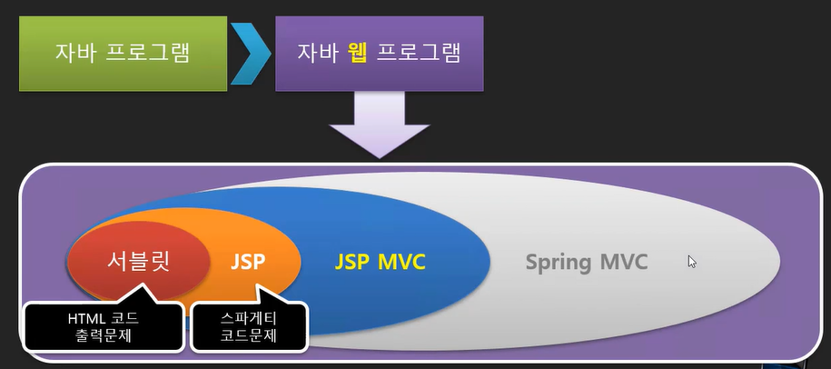

# Servlet

# 오리엔테이션

- 학습 안내
    - 수업 내용, 범위 안내.
        
        
        
- 웹 서버 프로그램이란
    - 과거에는 소프트웨어 업데이트가 삭제 후 재설치의 과정이 필요했다. 이 때의 불편을 해결하기 위한 수단이 HTTP(웹)
        
        
        
- 웹 서버 프로그램과 Servlet
    - 기존의 CS 프로그램의 형식을 이용할 때, 사용자의 모든 정보에 해당하는 페이지를 미리 웹 페이지 형식으로 만들어두는 것은 불가능하다.
    - 따라서 웹 서버는 DB에 있는 사용자의 정보를 받은 뒤, 미리 만들어진 코드에 해당하는 정보를 취합해서 동적인 페이지를 만든 뒤 Response할 필요성이 있다.
    - 이 때 미리 만들어진 코드를 바탕으로 페이지를 만드는 것이 바로 WAS
        
        
        
    
- tomcat 9 설치하기 1/3
    - 기존 수업에서 8.5 버전을 이미 설치하고 사용중이라 설치는 생략
- tomcat 9 설치하기 2/3
    - tomcat으로 html 문서 읽어오기.
    - 동일한 공유기 안에서 동일한 포트 번호로 사이트 확인하기.
- tomcat 9 설치하기 3/3
    - Context : 복잡하고 거대한 사이트에서 공유되는 부분을 제외한 세부 부분을 별도의 사이트처럼 관리하는 것. 네이버의 지도, 부동산, 뉴스 등의 기능이 네이버라는 거대한 틀을 유지하면서 세부 기능들은 별도의 사이트처럼 운영되는 것이 Context 사이트.
        
        
        
    - 이 때 서로 다른 디렉토리에 있는 파일들을 하나의 디렉토리에 있는 것처럼 유지하는 방법이 conf 폴더의 server.xml 파일.
    - 아래의 코드 파일을 넣으면 된다. (academy가 가상 디렉토리, docBase가 해당 폴더의 실제 디렉토리 경로)
    - 단, 이 부분은 서버의 재구동이 필요하기에 권장하지 않는다. 권장되는 방법은 메타 데이터를 이용하는 방법. 단, 이 부분은 난이도가 있어 설명하지 않았다.
        
        
        

# Servlet 설정 및 개요

- 서블릿 프로그램 만들어보기
    - 메모장으로 서블릿 코드 작성.
        
        
        
    - cmd에서 서블릿 폴더를 class-path로 연결한 뒤, java 파일로 컴파일한다.
    
- 서블릿 객체 생성과 실행 방법
    - web-inf 는 톰캣 안에서 사용자에 의해 사용되지 않으며, 서버 쪽에서만 사용 가능한 디렉토리. 따라서 이 곳에 class 파일을 둔다.
        
        
        
    - xml 방식으로 사용할 때 servlet 구동원리 : 
    <servlet-class> Nana </servlet-class> 태그 안의 Nana 파일은, 
    <url-pattern>/hello</url-pattern> 태그 안의 url 주소가 입력되었을 때 호출하도록 하는 설정 (mapping)
- 문자열 출력
    - 웹은 서버에서 클라이언트로 데이터를 보내거나, 보여주는 역할. (입력과 출력)
    - 문자열 출력은 OutputStrem, PrintWriter 등의 메소드를 사용한다.
        
        