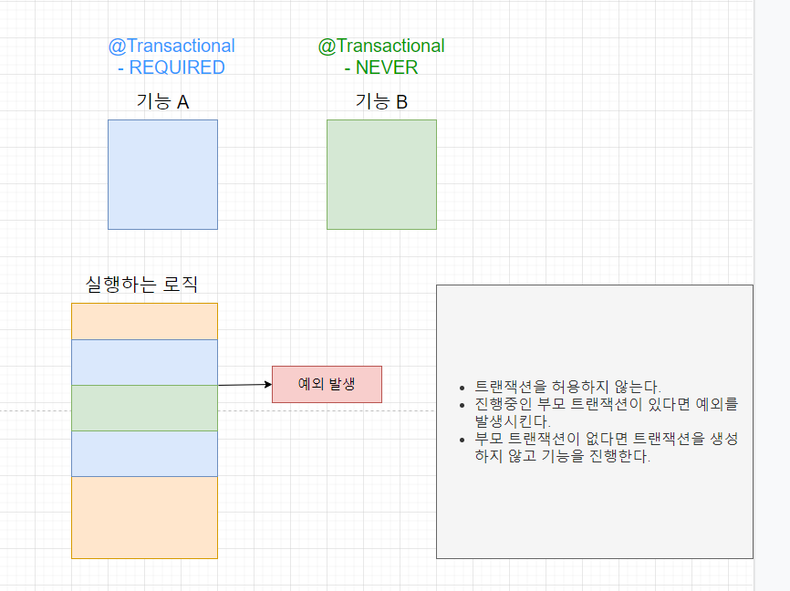

# Spring Legacy

<aside>
💡 IOC / Dependancy Injection : 의존성 주입, 은닉과 낮은 결합도를 통한 유지보수성 증가.
Aspect Oriented Programming :  관점 지향 프로그래밍, PointCut에 Advice를 Weaving하여 관점에 개입하는 방법론.
PSA  (Portable Service Abstraction**)** : 객체 지향의 추상화 개념을 확장, 하나의 추상화로 다수의 서비스를 묶어두는 방법론.

</aside>

# Maven

- 정의
    - 자바용 프로젝트 관리 도구, Project Object Model(POM) XML 문서를 통해 해당 프로젝트의 버전 정보 및 라이브러릴 정보들을 통합하여 관리하는 프레임워크.
    - 일반적인 프로젝트와는 달리, pom.xml 문서에 사용하고자 하는 라이브러리를 등록하여 자동으로 프로젝트에 추가하게 하여 관리의 편의성을 제공한다.
- 설정
    
    
    
    - 기본 Spring 설정
        - 기본 구조 : project { 프로젝트 정보 + properties + dependencies + build }
        - Preferences에서 User Settings에서 maven의 settings.xml 파일 지정
            
            
            
        - settings.xml 파일에서 Local Repository 지정 (라이브러리가 저장 될 저장소 설정)
            
            
            
        - pom.xml파일에서 Maven 버전 설정
            
            
            
            - 순서대로 
            Maven 버전
            최초 패키지의 레벨 설정(1레벨, 2레벨)
            최초 패키지의 3레벨 (context-root명)
            프로젝트 명
            배포를 위한 프로젝트 패키징 방식
            프로젝트 버전(임의 설정 가능)
        - pom.xml 파일에서 java버전 설정
            
            
            
            
            
            - 순서대로 
            java 버전
            spring framework 버전
            aop관련 aspectj 버전
            loggin 관련 slf4j 버전 설정
        - 롬북(Lombok) 사용 시 log4j 버전 변경 필요
            
            
            
        - servlet 버전 설정
        → artifactId 변경과 servlet 버전 설정에 주의
            
            
            
        - junit 버전 usage 많은 버전으로 변경
            
            
            
        - project Facets 에서 자바, 스프링 버전 설정
            
            
            
        - 이후 원하는 라이브러리를 <dependency></dependency> 태그를 활용하여 추가할 수 있다.
    - javaConfig 방식의 Config 설정
        - ServletConfig
            - @EnableWebMvc Annotation을 통해 servlet-context.xml 파일의 <annotation-driven /> 태그 설정.
            - @ComponenctScan을 통해 Scan 범위 설정
            - WebMvcConfigurer 인터페이스를 implements 하여 class 파일에 WebMvcConfig 설정
            - 구현 메서드인 configureViewResolvers에 설정 파일 지정
                
                
                
            - 하위 구현 메서드 addResourceHandlers를 통해 mapping 설정
                
                
                
        - WebConfig
            - AbstractAnnotationConfigDispatcherServletInitializer 클래스를 상속받아 Web.xml 파일 구현
            - Override된 구현 메서드 3개를 통해 Context, Init, url 설정 구현
                
                
                
- 특징
    - 모범 사례를 따르는 간단한 프로젝트 설정 : 몇 초 만에 새 프로젝트 또는 모듈 시작
    - 모든 프로젝트에서 일관된 사용
    - 자동 업데이트, 종속성 폐쇄(dependency closures 전이적 종송석)을 포함한 우수한 종속성 관리
    - 다수 프로젝트 동시 작업 가능
    - 즉시 사용할 수 있는 대규모 라이브러리 및 메타데이터 리포지토리
    - Java 또는 스크립팅 언어로 플로그인을 쉽게 작성할 수 있는 기능으로 확장 가능
    - 추가 구성이 거의 또는 전혀 없이 새로운 기능에 즉시 엑세스
    - Maven 외부의 종속성 관리 및 배포를 위한 Ant 작업
    - 모델 기반 빌드 : Maven은 대부분의 경우 스크립팅을 수행할 필요 없이 프로젝트에 대한 메타데이터를 기반으로 하는 JAR, WAR 또는 배포와 같은 사전 정의된 출력 유형으로 여러 프로젝트 빌드
    - 프로젝트 정보의 일관된 사이트 : 빌드 프로세스와 동일한 메타데이터를 사용하여 Maven은 추가하려는 문서가 포함된 웹 사이트 또는 PDF를 생성하여 프로젝트 개발 상태에 대한 표준 보고서에 추가.
    - 릴리스 관리 및 배포 게시 : 추가 구성 없이 Maven은 소스 제어 시스템(Git, Subversion)과 통합되고 특정 태그를 기반으로 프로젝트 릴리스를 관리
    - 종속성 관리 : Maven은 JAR 및 기타 종속성의 중앙 저장소 사용 권장. Maven은 프로젝트의 클라이언트가 Perl의 CPAN과 같은 중앙 JAR 저장소에서 프로젝트를 빌드하는 데 필요한 JAR를 다운로드하는데 사용할 수 있는 메커니즘과 함께 제공.

# Spring Framework

- 정의
    - 자바 플랫폼을 위한 오픈소스 애플리케이션 프레임워크.
    - 동적인 웹 사이트를 개발하기 위한 여러가지 서비스를 제공하고 있다.
    - 한국의 경우, 공공기관의 웹 서비스 개발 시 사용을 권장하고 있는 전자정부 프레임워크의 기반 기술.
    - 대부분의 Framework와 같이, Spring 역시 IoC 기반으로 주도권이 Spring에 있다. (객체의 주도권, Framework가 객체를 생성하고, 관리하고, 소멸시킨다.)
    - 제약조건이나 프레임워크가 없는, 자바 오브젝트(Class, POJO)를 Spring Container에 제공한다
    - POJO
        - Plain Old Java object
        - 자바 언어 사양 외의 어떠한 제한에도 묶이지 않는 자바 오브젝트.
        - POJO는 다음의 3가지 행동을 해선 안된다.
        1. 미리 정의된 클래스의 확장
        2. 미리 정의된 인터페이스의 구현
        3. 미리 정의된 Annotation의 구현
        - 단, 기술적 어려움 등의 이유로 인해 Spring을 비롯 POJO 호환으로 기술하고 있는 많은 소프트웨어 제품이나 프레임워크는 정상 작동을 위해 Persistence와 같은 기능을 위해 미리 정의된 Annotation의 사용을 요구한다.
    - Configuration Metadata 설정 파일을 Spring Container에 제공한다.
    - 즉, 스프링은 필요한 오브젝트, 설정을 제공하여 원하는 객체를 만드는 구조.
        
        
        
- 특징
    - PSA(Portable Service Abstraction)를 통해 화면단, Java, DB와 같은 모듈을 별도로 뜯어내어 관리할 수 있다.
    - Controller, Service, DAO를 서로간의 직접적 연결이 아닌, Interface를 통해 연결함으로서 각 객체간 격리성, 은닉(타입 은닉)을 확보할 수 있다. (추상화 기술)
    - Spring JDBC : Mybatis나 Hibernate 등의 데이터베이스를 처리하는 영속성 프레임워크와 연결할 수 있는 인터페이스를 제공한다.
    - Spring MVC : MVC 디자인 패턴을 통해 웹 어플리케이션의 Model, View, Controller 사이의 의존 관계를 DI 컨테이너에서 관리하여 개발자가 아닌 서버가 객체들을 관리하는 웹 어플리케이션을 구축할 수 있다.
    - Core Container: Spring의 근간이 되는 IoC(또는 DI) 기능을 지원하는 영역을 담당한다. BeanFactory를 기반으로 건내진 POJOs를 통해 Bean 클래스들을 제어할 수 있는 기능을 지원한다.
        
        
        
- POJO와 Java Bean
    
    
    
- STS: Spring Tool Suite의 약자로, Spring Framework를 사용하기 위한 개발 툴로, 이클립스에서 스프링에 필요한 기능을 제공하는 경량화 버전으로 생각할 수 있다.

# IoC / DI

- 정의
    - 객체의 생명주기와 의존성을 개발자가 아닌 (Spring) Framework가 관리하는 것.
    - VO(DTO/POJO) 객체의 생성, 초기화, 소멸 등의 라이프 사이클을 관리한다.
    - 단, 개발자가 직접 객체를 생성할 수 없는 것은 아니다.
- 주요 객체
    - Bean : 스프링이 IoC 방식으로 관리하는 Class, 스프링이 직접 생성과 제어를 담당한다.
    - BeanFactory : 스프링의 IoC를 담당하는 핵심 컨테이너로, Bean을 등록, 생성, 조회, 반환하는 역할을 담당한다.
    - ApplicationContext : BeanFactory를 확장한 IoC 컨테이너로, BeanFactory의 기능에 스프링이 제공하는 각종 부가 서비스가 추가로 제공된다.
    - Configuration metadata : Application Context 또는 BeanFactory가 IoC를 적용하기 위해 사용하는 설정 정보. Configuration metadata는 IoC 컨테이너에 의해 관리되는 Bean 객체를 생성하고 구성할 때 사용된다.
    - GenericXmlApplicationContext : ApplicationContext를 구현(Implements)한 클래스로 일반적인 XML 형태의 문서를 읽어 컨테이너의 역할을 수행한다.
- IoC 컨테이너
    
    
    
    - IoC(Inversion of Control) : DI (Dependancy Injection, 의존성 주입) 이라고도 한다. 설정 파일이나 어노테이션을 통해 객체간 의존 관계를 설정하여 개발자가 직접 의존하는 객체를 생성할 필요가 없다. 
    → 단, 이는 포괄적 개념으로, DI는 IoC의 하위 개념으로 이해하는 편이 좀 더 올바르다.
    - 객체가 생성자 인수, 팩토리 메서드에 대한 인수 또는 팩토리 메서드에서 생성되거나 반환된 후 객체 인스턴스에 설정된 속성을 통해서만 종속성을 정의하는 프로세스. 컨테이너에서 빈을 생성할 때 종속성을 주입한다. 이 프로세스는 근본적으로 클래스의 직접 구성 또는 Service Locator 패턴과 같은 매커니즘을 사용하여 종속성의 인스턴스화 또는 위치를 제어하는 Bean 자체의 반대이다 
    → Service Locator Pattern: 강력한 추상화 계층으로 서비스를 얻는데 관련된 프로세스를 캡슐화하기 위해 소프트웨어 개발에 사용되는 디자인 패턴. 해당 패턴은 요청 시 특정 작업을 수행하는데 필요한 정보를 반환하는 Service Locator 중앙 레지스트리를 사용한다.
    - 즉, BeanFactory 구성 프레임워크와 기본 기능을 제공하고 ApplicationContext의 더 많은 엔터프라이즈별 기능을 추가한다. ApplicationContext의 완전한 상위 집합이라고 할 수 있다.
    - Spring에서 애플리케이션의 백본을 형성하고 Spring IoC 컨테이너에 의해 관리되는 객체를 빈이라고 한다. Bean은 Spring IoC 컨테이너에 의해 인스턴스화, 조립 및 관리되는 객체이다.
    - 객체가 의존하는 다른 객체를 받는 디자인 패턴의 하나.
    - 제어 역전(IoC)의 한 형태, 혹은 핵심 기술로, 종속성 주입은 객체를 구성하고 사용하는 문제(Life Cycle)를 분리하여 느슨하게 결합된(결합도를 낮추는) 프로그램을 만드는 것이 주 목적.
    - 사용하는 객체를 직접 생성하여 만드는 것이 아니라, 컨테이너가 빈의 설정 정보를 읽어와 자동으로 해당 객체에 연결하는 것.
    - BeanFactory를 통해 추가된 사항
        - 1. Spring의 AOP 기능과 더 쉽게 통합 가능
            - Spring AOP (관점 지향 프로그래밍) : 데이터베이스의 트랜잭션처리나 로깅처리와 같이 여러 모듈에서 공통으로 필요로 하는 기능의 경우, 해당 기능을 분리하여 관리한다.
            → 이 떄 AOP는 객체 지향 프로그래밍과 달리, 로그인 처리나 시큐리티 처리, 트랜잭션과 같은 공통 기능을 Aspect라는 별도의 단위로 분리하여 관리할 수 있다. (OOP, 객체 지향 프로그램과는 차이가 있을 뿐, 다른 것은 아니다.)
            → Aspect: 부가기능을 정의한 코드인 어드바이스(Advice)와 어드바이스를 어디에 적용할지를 결정하는 포인트컷(PointCut)을 합친 개념.
        - 2. 메시지 리소스 처리(국제화용)
        - 3. 이벤트 발행
        - 4. WebApplicationContext : 웹 애플리케이션에서 사용하기 위한 것과 같은 애플리케이션 계층 특정 Context

# Configuration

- @Configuration
    
    @Configuration 어노테이션을 통해 Spring이 실행됐을 때 모든 설정파일을 탐색한다. 해당 Configuration은 mybatis의 SqlSessionFactoryBuilder와 유사한 메커니즘(Factory Patten)으로, 스프링의 설정 정보들을 저장하는 역할을 한다. @Configuration의 하위 속성(Override)으로 각 설정들을 지정할 수 있으며, 해당 설정들은 싱글톤 패턴이 강하게 권장된다. 
    
- 계층별 Component
    - 4가지 객체 모두 특정한 객체의 역할에 대한 @Component의 구체화된 형태.
    - Component
        - 스프링에서 관리되는 객체(bean)임을 표시하기 위해 사용하는 가장 기본적인 어노테이션.  계층 구조가 명확하지 않을 경우에 사용한다.
    - Controller
        - Persistence레이어, 영속성을 가지는 속성(파일, 데이터베이스)을 가진 클래스
        - Web MVC 코드에서 사용되는 어노테이션으로 @RequestMapping 어노테이션은 해당 어노테이션이 작성 된 클래스 내에서만 사용 가능하다.
        - MVC에서 웹상으로 들어오는 여러 요청들을 처리하는 역할이다.
    - Service
        - 서비스 레이어, 비지니스 로직을 가진 클래스.
        - 비지니스 로직이 작성 된 클래스에 사용한다. 추가적인 기능은 없지만 추가적인 기능을 제공 할 가능성이 있어 계층을 명시할 때 주로 사용한다.
    - Repository
        - 프리젠테이션 레이어, 웹 어플리케이션에서 View에서 전달된 웹 요청과 응답을 처리하는 클래스.
        - 플랫폼별 예외를 포착하여 PersistenceExceptionTranslationPostProcessor가 DataAcceessException으로 변환하여 다시 발생한다.
        - 추후 JPA와의 연동성으로, JPA에서 Repository 인터페이스를 생성 후 JpaRepository<Entity, 기본키 타입>을 상속받아 CRUD를 생성 가능하다.
- @Configuration의 하위 속성들
    - @Bean
        - XML 방식
            - xml 방식의 Bean 등록 방법
                
                
                
            
            xml 방식 : ApplicationContext의 상속 클래스인 GenericXmlApplicationContext를 통해(다형성) 매개변수로 Bean이 등록되어 있는 xml 파일을 직접 불러온다. xml 파일을 호출하는 방식은 해당 XML파일이 위치한 풀 패키지명을 직접 매개변수로 지정한다.
            
            
            
            이후 설정된 레퍼런스 변수의 내장메서드인 getBeanDefinitionNames()를 통해 xml 파일에 지정된 bean 파일을 자료형이 지정된 레퍼런스 변수에 지정한다.
            
            설정된 Bean을 꺼내는 방식은 아래의 3가지가 있다.
            
            
            
        - Annotation 방식
            - Bean의 호출 방식은 ApplicationContext의 상속 클래스인 AnnotationConfigApplicationContext를 통해 매개변수로 전달받은 값을 레퍼런스 변수에 지정한다. 이 때 매개변수를 XML 방식과는 달리, 풀 패키지명이 아닌 mybatis의 Mapper 하위 구현체 생성과 유사한, 설정파일의 하위구현체를 생성하는 방식을 사용한다.
                
                
                
            - 생성 후 호출 및 꺼내는 방식은 XML 방식과 동일하다.
            - Configuration 파일의 경우, @Configuration을 통해 Spring 구동 시 이미 인식되어 있는 설정파일들을 호출하는 방식이다.
            - @Configuration의 하위 속성인 @Bean Annotation을 통해 설정파일에 미리 Bean을 지정해 놓으며, 이후 Application에서 설정파일을 읽어올 때, 지정된 name에 일치하는 Bean을 꺼내오는 방식이라고 생각하자.
                
                
                
        - Bean 호출 시 Interface를 통한 하위 구현체 동적 바인딩
            - AnnotationConfigApplicationContext를 통해 생성한 레퍼런스 변수의 내장 메서드 getBean의 매개변수를 지정시, 하위구현체를 생성할 때 다형성을 이용, Interface를 호출하는 방식으로 타입 은닉을 발휘할 수 있다. 동적 바인딩 방식으로 interface의 하위구현체가 아닌 interface에서 상속받은 객체의 하위 구현체를 생성할 수 있다. 이를 통해 응집도는 낮추고 결합도는 높힐 수 있다.
    - @ComponentScan, Filter
        - Java Configuration 방식
            - ComponentScan의 경우, 동일 범위의 패키지는 자동으로 인식한다. 하지만 이럴 경우 bean으로 만들 모든 파일의 패키지마다 설정 파일의 생성이 필요해지므로, 별도의 설정폴더에서 @ComponentScan을 통해 스캔할 패키지의 범위를 지정하는 방식이 유지보수성 측면에서 더 수월함을 기억하자.
                
                
                
            - 이 때, 하나의 패키지 단위에서 검색에 제외할 Bean들을 Filter 방식으로 제외할 수 있다. 이는 유지보수성의 측면에서 이점이 크다.
                
                
                
        - XML 방식
            - 큰 맥락은 Java Configuration 방식과 다르지 않다. GenericXmlApplicationContext() 하위 메서드를 통해 xml파일을 불러오고, 이 때 xml 파일에 지정되어있는 설정 (ComponentScan, Filter)를 읽어오는 방식.
            - ComponentScan을 통해 설정 파일을 적용할 범위를 지정하고, <context:exclude-filter를 통해 패키지 내에서 제외할 범위를 지정하는 것.
            
            
            
    - @Autowired
        
        
        
        - 정의
            - Srping 구성 파일에서 모든 Bean 종속성을 선언함으로서 Spring 컨테이너가 협업 Bean 간의 관계를 자동 연결할 수 있게 하는 Annotation
            - 즉, 어노테이션된 변수 및 메서드에 스프링이 관리하는 Bean을 자동으로 매핑해주는 개념. Filed, construtor, Setter에 주입 가능하다.
            - 추천되는 방식은 생성자 주입 방식. 생성자 주입 방식의 장점으로는 컴파일 단게에서 순환참조 에러를 확인 가능하며, DI 컨테이너와의 결합도가 낮기 때문에 테스트 하기 좋다.
            - 동일한 @Autowired 어노테이션이 있을 경우의 우선순위는 생성자 - 필드 - 세터 순이다.
        - Field Injection
            - 필드 영역에서 @Annotation을 활용하여 선언한다.
            - 가장 간단하지만 단일 책임의 원칙 관점에서 볼 때 필드는 수많은 필드를 주입받을 수 있기 하나의 Bean 객체가 지녀야 하는 책임감이 과도하게 커진다.
            - Field 방식의 Injection은 숨은 의존성만 제공한다.
            - 생성자에서 Injectcion될 경우, 순환 참조 에러로 인한 BeanCurrentlyCreationExeption가 발생한다.
            
            
            
            
            
        - Construtor Injection
            - 생성자 영역에서 @Annotation을 활용하여 선언한다.
            - 순환참조 방지(컴파일 시 순환참조 오류 확인 가능). 즉, 필수적으로 사용해야 하는 의존성 없이는 Instance를 만들지 못하도록 강제할 수 있다.
            - NULL 을 주입하지 않는다면 NPE가 발생하지 않는다.
            - DI 컨테이너와의 결합도가 낮기에 테스트가 수월하다.
            - 필드에 final 키워드를 사용하여 변경 불가능한 Bean을 만들 수 있다.
                
                
                
        - Setter Injection
            - Setter를 활용하여 생성한 메서드에 @Annotation을 활용하여 선언한다.
            - 선택적인 의존성을 사용할 때 유용하다. 즉, 상황에 따른 의존성 주입이 가능하다.
            - 주입이 필요한 객체가 주입되지 않아도 객체를 생성할 수 있기에, NPE 발생의 가능성이 커진다.
            
            
            
        - XML 방식의 @Autowired 구현
            - XML 방식의 경우 ref 속성을 @Autowired와 거의 동일한 개념으로 사용한다.
            - @Bean을 만들기 위해 다른 @Bean이 필요한 경우 사용된다.
                
                
                
    - @Primary
        - @Autowired를 통해 생성된 Bean 객체가 여러 개일 때, @Primary를 통해 우선순위를 지정할 수 있다. Map, List를 통해 다수의 Bean 객체가 아닌 하나의 Bean 객체를 불러올 때, @Primary를 통해 지정된 클래스의 Bean 객체를 호출하는 방식.
        - @Primary를 통해 우선순위를 지정하지 않고 다수의 Bean 객체를 호출할 시 발생하는 에러 :
            
            
            
        - @Component 아래 @Primary 어노테이션을 추가함으로서 호출할 Bean 객체의 우선순위 지정이 가능하다.
        - 필드 주입 방식
            
            
            
    - @Qualifier
        - @Primary와 유사한 Annotation으로, @Autowired를 통해 생성된 Bean 객체가 여러 개일 때 우선순위 지정이 가능하다. @Primary보다 우선순위가 높으며, 동일한 Class에 @Primary와 @Qualifier가 동시에 존재할 경우 @Qualifier를 호출한다.
        - 단, 필드 주입 방식의 경우 생성자가 없을 때만 유효하며, 생성자 주입을 사용할 경우 파라미터에 어노테이션을 적용해야 한다.
        - 필드 주입 방식
            
            
            
        - 생성자 주입 방식
            
            
            
    - @Collection
        - @Primary와 @Qualifier와는 달리, @Autowired를 통해 생성된 다수의 Bean 객체 중 하나를 지정해서 뽑아오는 것이 아닌, 생성된 모든 Bean 객체를 List 혹은 Map에 담아 모두 꺼내오는 방식.
        - @Primary, @Qualifier를 지정해도 List, Map 타입으로 주입 받았다면 모든 Bean이 출력된다.
        - 모든 Bean의 출력만 가능하며, 개별 출력 (@Primary, @Qualifier)은 불가능하다.
        - List
            - 필드 방식과 생성자 방식.
            
            
            
        - Map
            - 필드 방식과 생성자 방식
                
                
                
    - @Resource
        - javax.annotation-api 라이브러리가 필요하다.
        - 개개의 @Bean으로 생성한 객체들을 Collection으로 출력하는 개념.
        - Autowired 처럼 @Primary나 @Qualifier를 통해 하나의 bean을 선택 가능하다.  필드 주입 역시 가능하다. 단, 생성자 주입은 불가능하다.
            
            
            
        - Collection 방식 역시 지원한다. 역시 생성자 주입은 불가능하다.
            
            
            
    - @Inject
        - javax.inject 라이브러리가 필요하다.
        - Collection 타입으로만 지정 가능하다.
        - Collection 타입으로 생성한 @Bean 객체를 Collection 형식으로 출력하거나 개개의 @Bean으로 출력하는 개념.
        - @Named와 @Qulifier를 통해 하나의 타입만 지정 역시 가능하다. Injection 방식은 @Bean 객체와 동일하며, 필드, 생성자, Setter 방식 모두 가능하다.
            
            
            
        - List, Map을 이용한 Collection 방식으로 모든 Bean 객체를 출력할 때의 방식 역시 기본적인 방법론은 동일하다.  @Inject의 핵심은 생성자 주입이 자유로우며, Collection 방식으로 모든 @Bean 객체를 출력하거나, @Qulifier나 @Named를 이용해 개별 @Bean 객체를 출력하는 방식 모두 가능하다는 것에 있다.
        
        
        
    - @(Bean)Scope
        
        
        
        - 생성된 @Bean 객체의 탐색 범위보다는 생성된 @Bean 객체의 관리 방식으로 접근하자.
        - @Scope 종류
            - @Scope(”singleton”) : default 방식. IOC 컨테이너당 빈 인스턴스를 하나만 생성한다.  (재활용한다.)
            - @Scope(”prototype”) : 기능이 요청될 때마다 빈 인스턴스를 새로 생성한다.
            - @Scope(”request”) : HTTP 요청당 하나의 빈 인스턴스를 생성한다. 웹 애플리케이션 컨텍스트에만 해당한다.
            - @Scope(”session”) : HTTP 세션당 빈 인스턴스를 생성한다. 웹 애플리케이션 컨텍스트에만 해당한다.
            - @Scope(”globalSession”) : 전체 HTTP 세션당 빈 인스턴스 하나를 생성한다. 포털 애플리케이션 컨텍스트에만 해당된다.
        - Annotation 방식(singleton)
            - 기본적으로 모든 @Bean 객체는 별도의 Scope를 지정하지 않을 때 singleton Scope를 가진다.
                
                
                
            - 동일한 @Bean 객체에 대해선 다른 이름으로 인스턴스를 생성하더라도 기존의 @Bean 객체와 동일하다고 판단하므로, 값을 추가할 경우 값은 누적으로 쌓이게 된다.
                
                
                
        - XML 방식(prototype)
            - 사용방식의 차이일 뿐, 적용방식은 Annotation 방식과 동일하다. xml 문서에 @bean 객체를 생성할 때, class 지정 후 scope=”” 형식으로 범위를 지정해주면 끝.
                
                
                
        - Singleton Scope 방식을 적용하기 적합한 객체와 비싱글톤으로 적합한 객체
            - 싱글톤으로 적합한 객체
            1. 상태가 없는 공유 객체 : 상태를 가지고 있지 않은 객체는 동기화 비용이 없다. 따라서 매번 이 객체를 참조하는 곳에서 새로운 객체를 생성할 이유가 없다.
            2. 읽기용으로만 상태를 가진 공유 객체 : 1번과 유사하게 상태를 가지고 있으나 읽기 전용이므로 여전히 동기화 비용이 들지 않는다. 
            3. 공유가 필요한 상태를 지닌 공유 객체 : 객체 간의 반드시 공유해야 할 상태를 지닌 객체가 하나 있다면, 이 경우에는 해당 상태의 쓰기를 동기화 할 경우 싱글톤도 적합하다.
            4. 쓰기가 가능한 상태를 지니면서도 사용빈도가 매우 높은 객체 : 애플리케이션 안에서 정말로 사용빈도가 높다면, 쓰기 접근에 대한 동기화 비용을 감안하고서라도 싱글톤을 고려할만 하다. 이 방법은 장시간에 걸쳐 매우 많은 객체가 생성될 때, 해당 객체가 매우 작은 양의 쓰기 상태를 가지고 있을 때, 객체 생성비용이 매우 클 때에 유용한 선택이 될 수 있다.
            - 비싱글톤으로 적합한 객체
            1. 쓰기가 가능한 상태를 지닌 객체 : 쓰기가 가능한 상태가 많아 동기화 비용이 객체 생성 비용보다 클 때 싱글톤으로 적합하지 않다.
            2. 상태가 노출되지 않은 객체 : 일부 제한적인 경우, 내부 상태를 외부에 노출하지 않는 빈을 참조하여 다른 의존객체와는 독립적으로 작업을 수행하는 의존 객체가 있을 때. 싱글톤보다 비싱글톤 객체를 사용하는 것이 더 좋을 수 있다.
    - @PropertySource
        - 외부 리소스에 저장된 Key와 Value값을 불러와서 활용하는 방식으로 사용한다.
        - @Value를 통해 $을 활용한 el 태그의 형식으로 호출한다.
        - 개별 @Bean 객체를 별도의 Properties 파일에 저장, @Value()를 통해 호출하는 방식으로 사용할 수도 있으나, 권장되진 않는다. 주로 I18N을 비롯한 외부 환경 설정을 손쉽게 관리, 변경하기 위해 사용된다.
        - Properties 파일을 통한 @Bean 객체 설정 방법
            
            
            
        - ContextConfiguration 파일을 통해 @Value 값 지정을 통한 @Bean 설정
            
            
            
        - xml 방식의 properties를 활용한 스키마 지정
        →Namespaces 탭에서 context 스키마 체크 필수
            
            
            
        - I18N
            - I18N 소프트웨어 국제화 법칙.
                - 언어, 지역별 번역
                - OS/플랫폼 인코딩 - 나라별로 쓰는 OS
                - 문자열 치환 방법 : 서버쪽, 클라이언트쪽 치환 중 서버 쪽에서 하는게 좋다. (경우에 따라 다름)
                - 국제화 UI (문자열 크기 변화, 폰트, 아이콘 등)
                - 쓰기 방향의 차이
                - 숫자, 공백, 화폐, 날짜, 주소, 측정 단위 등
                - 타임존, 썸머타임 등 시각
                - 문자열 정렬 방법
            - I18N을 위한 로컬 환경 설정시, 정해진 확장자 명이 존재한다.  아래 이미지 참조.
                
                
                
            - 작성된 Properties 파일 호출 방식은 아래의 방법으로 이루어진다. getmessage를 통해 Locale을 지정, 불러오는 방식
                
                
                
    - @initMethod, destroyMethod
        - 컨테이너의 생성과 소멸 시점에서 자동으로 실행할 메서드를 등록할 때 사용한다.
        - Configuration 파일에서 설정하는 방식 (생성자 방식)
            
            
            
        - 클래스 method에서 직접 설정하는 방식 (Annotation 방식)
            
            
            
        - xml 파일에서 설정하는 방식
            
            
            
        

# AOP

- 정의
    
    
    
    - Aspect Oriented Programming Language의 약자로 관점 지향 프로그래밍을 의미한다.
    - OOP(Object Oriented Programming Language, 객체 지향 언어)의 업그레이드 버전으로 생각할 수 있다.
    - 일반적으로 사용하는 클래스(Service, DAO 등)에서 중복되는 공통 코드 부분(commit, rollback, log 처리등)을 별도의 영역(Aspect)으로 분리하고, 코드가 실행되기 전이나 이후의 시점에 해당 코드(Advice)를 삽입(Weaving)함으로서 소스 코드의 중복을 줄이고, 필요할 때마다 가져다 쓸 수 있게 객체화하는 기술.
    - 공통되는 부분을 따로 빼내어 작성하는 클래스를 Aspect라고 하며, 해당 시점을 PointCut, 그 시점에 공통 코드를 끼워 넣는 작업을 Weaving이라고 한다.
    - AOP의 핵심은 Proxy를 이용하여 원본 파일을 수정하지 않고 Advice를 Weaving하는 것.
- 특징
    - 프록시(Proxy) 기반의 AOP : Spring은 대상 객체(Target Object)에 대한 프록시를 만들어 제공하며, 타겟을 감싸는 Proxy는 서버 Runtime 시에 생성된다. 생성된 Proxy는 대상 객체를 호출 할 때 먼저 호출되어 어드바이스의 로직 처리 후 대상 객체를 호출한다.
    - Proxy는 대상 객체의 호출을 가로챈다(Intercept) : Proxy는 그 역할에 따라 Target Object에 대한 호출을 가로챈 다음 어드바이스의 부가기능 로직을 수행하고 난 뒤, Target의 핵심기능 로직을 호출하거나 (Before~ Advice) 타겟의 핵심기능 로직 Method를 호출한 후에 부가기능(After ~ Advice)를 수행한다.
        
        
        
    - Method Join Point만 지원한다 : Spring은 동적 Proxy를 기반으로 AOP를 구현하기에  Method Join Point만 지원한다. 즉, 핵심기능의 Method가 호출되는 런타임 시점에만 Advice를 적용할 수 있다. 
    → 다만, AspectJ 같은 별도 AOP 프레임워크를 사용하면 객체의 생성, 필드값의 조회와 조작, static Method 호출 및 초기화 등의 다양한 작업 도중에 Advice를 수행 가능하다.
    - XML(AOP NameSpace), Annotation(@Aspect) 기법 모두 지원된다.
- 용어
    
    
    
    - @JoinPoint
        - Method 실행, 예외 처리, 개체 변수 값 변경 등과 같은 응용 프로그램의 특정 지점.
        - JoinPoint는 원하는 대상으로 삼을 수 있는 후보들, 즉 모든 Method이다.
        - 새로운 동작을 추가하기 위해 애플리케이션의 정상적인 흐름에 Aspect Code를 삽입할 수 있는 지점
        - Interface 메소드
            - getArgs() : Method의 매개변수를 반환한다.
            - getThis() : 현재 사용 중인 프록시 객체를 반환한다.
            - getTarget() : 대상 객체를 반환한다.
            - getSignature() : 대상 객체 메소드의 설명(메소드 명, 리턴 타입 등)을 반환한다.
            - toString() : 대상 객체 메소드의 정보를 출력한다.
    - @PointCut
        - PointCut은 JoinPoint의 부분집합적 개념으로 생각할 수 있으며, Advice를 적용할 범위, 시점을 결정하는 개념이다.
        - 가능한 모든 연결 지점에 Aspect를 적용하는 것은 바람직하지 않기에, PointCut을 이용해 Advice를 적용할 위치를 적절하게 지정할 수 있다.
        - 표현식
            
            
            
            - 수식어 : public, private 등 수식어를 명시(생략 가능)
            - 리턴 타입 : 리턴 타입을 명시
            - 클래스이름(패키지명 포함) 및 메소드 이름 : 클래스 이름과 메소드 이름을 명시
            - 파라미터(매개변수) : 메소드의 파라미터를 명시
            - " * " : 1개이면서 모든 값이 올 수 있다는 의미
            - " .. " : 0개 이상의 모든 값이 올 수 있다는 의미
    - @Advice
        
        
        
        - 한 지점에 의해 지정된 조인 지점(Join Point)에서 수행할 작업을 나타내는, 시스템 전체의 관심사에 대한 API 호출이 포함된 객체
        - Advice는 AOP 프레임워크가 지원하는 모든 조인 지점에 적용될 수 있다.
        - 표현식의 범위는 지정된 범위 안에서 인식되어 있는 @Bean들
        - @Before Advice : JoinPoint 앞에서 실행된다.
            
            
            
        - @After Advice : JoinPoint 호출이 리턴되기 직전에 실행된다.
            
            
            
        - @After Returning Advice : JoinPoint Method 호출이 정상적으로 종료된 후에 실행된다.
            
            
            
        - @After Throwing Advice : 예외가 발생했을 때 실행된다.
            
            
            
        - @Around Advice
            - @Around Advice : JoinPoint 앞과 뒤에서 실행된다.
            - 조인포인트를 완전히 장악하기에 Before와 After를 모두 Around Adivce로 조정할 수 있다.
            - 여기에 더해 원본 조인포인트를 언제 실행할 지, 실행 유무, 계속 실행할지 여부까지 제어한다.
            - AroundAdvice의 조인포인트 매개변수는 ProceedingJoinPoint로 고정되어있다.
                
                
                
            - JoinPoint의 하위 인터페이스로 원본 조인포인트의 진행 시점을 제어할 수 있다.
                
                
                
    - @Aspect
        - Aspect : 부가기능을 정의한 코드인 어드바이스(Advice)와 어드바이스를 어디에 적용할지를 결정하는 포인트컷(PointCut)을 합친 개념.
        - aspectjrt, aspectjweaver 라이브러리가 필요하다.
    - @Weaving
        - PointCut 지점에 Advice를 끼워넣는 작업
        - 컴파일 시 : AOP가 적용된 클래스 파일이 새로 생성된다. (Aspect)
        - 클래스 로딩시 : JVM에서 로딩한 클래스의 바이트 코드를 AOP가 변경하여 사용
        - 런타임 시 : 클래스 정보 자체를 변경하지 않고, 중간에 프록시를 생성하여 경유
    - Target Object
        - Adivce를 삽입할 대상 객체
        - Target Object는 Reflection 기술로 구성되어 있다. 즉, 굉장히 세부적으로 Target Object를 분해하여 다룰 수 있도록 제공된다.
    - Primary Concern
        - Primary Concem : 유저가 원하는 관점.
    - Cross-cutting Concern
        - Cross-cutting Concem : 시스템의 다른 많은 부분에 의존하거나 영향을 미쳐야 하는 프로그램의 일부

<aside>
💡 AOP는 Proxy 기반의 프레임워크이므로, 
@EnableAspectJAutoProxy 혹은
<aop:aspectj-autoproxy proxy-target-class="true"/>
사용 필요

</aside>

# PSA(Portable Service Abstraction)

- 정의
    - 하나의 추상화로 여러 서비스를 묶어둔 것을 Protable Service Abstraction라고 한다.
    - 이 때 Service Abstraction은 추상화 계층을 사용하여 어떤 기술을 내부에 숨기고 개발자에게 편의성을 제공해 주는 기술.
    - Spring에서 제공하는 PSA 기술로는 Spring Web MVC, Transaction, Spring Cache 등이 있다.
    - PSA의 핵심은 기존 코드를 거의 변경하지 않고도 추상화 계층을 통한 편의성을 제공받을 수 있다는 점이다.
    - 즉, 아래의 그림을 통해 알 수 있듯이 하나의 Service(Lib)로 다수의 서비스(Lib)를 이용할 수 있는 것이 PSA 기술의 핵심이며, DOCKER가 현재 기준 그 선두라고 할 수 있다.
    
    
    
    
    

# Reflection

- 정의
    - 구체적인 클래스 타입을 모르는 상태에서도 그 클래스의 타입, 메소드, 변수들에 접근이 가능하도록 해주는 자바 API.
    - 컴파일 된 자바 코드에서 역으로 클래스를 불러내어 메소드 및 필드 정보들을 구해오는 방법을 사용한다.
    - JVM에서 실행되는 애플리케이션의 런타임 동작을 검사하거나 수정할 수 있는 기능이 필요한 경우 사용한다.
    - 스프링 프레임워크, 마이바티스, 하이버네이트, jackson 등의 라이브러리에서 사용한다.
    - 단, 오버헤드(성능 저하)를 발생할 수 있기에 성능이 민감한 애플리케이션에서는 사용을 지양해야 한다.
    - 또한 private로 설정한 필드에도 접근 가능하기에 코드 기능이 저하되며 캡슐화를 저해한다.
- 타입 인스턴스 생성
    - Class 타입 인스턴스
        - 해당 클래스의 메타정보를 가지고 있다.
        
        
        
    - .forName() 메소드
        - 런타임시 로딩, 해당 클래스의 메타 정보를 CLass 타입으로 반환
        
        
        
    - TYPE 필드를 이용하여 원시형 클래스 반환
        - 기본 자료형을 그대로 사용 시 컴파일 에러가 발생한다. 따라서 TYPE 필드가 필요하다.
            
            
            
    - 정보 반환
        - 상속 된 부모 클래스 반환
            
            
            
        - 필드 정보 반환
            
            
            
        - 생성자 정보 반환
            
            
            
    - 생성자를 이용한 인스턴스 생성
        - try-catch 주의
        
        
        
    - 메소드 호출 및 실행
        
        
        

# Proxy

- 정의
    - 대상 객체에 Advice가 적용된 후 생성되는 객체
    - 실제 Target의 기능을 수행하면서 기능을 확장하거나 추가하는 실제 객체.
    - Proxy : Client가 Target에 request 하기 전, Target이 Client에게 response하기 전 거쳐야 하는 객체.  즉, 원본을 다루지 않고 추가 기능을 구현하기 위한 방법론.
    - aop 기능이 Proxy를 기반으로 하므로, 
    Annotation 방식의 @EnableAspectJAutoProxy,
    xml 방식의 <aop:aspectj-autoproxy proxy-target-class="true"/>
    가 필요하다.
        
        
        
        
        
    - JDK Dynamic Proxy
        - AOP Aspectj에서 사용하는 프록시 생성 방식
        - 리플렉션을 이용해서 proxy 클래스를 동적으로 생성해 주는 방식
        - 타겟의 인터페이스를 기준으로 proxy를 생성해 준다.
        - 사용자의 요청이 타겟을 바라보고 실행할 수 있도록 타겟 자체에 대한 코드 수정이 아닌, 리플렉션을 이용한 방식으로 타겟의 위임 코드를 InvocationHandler를 이용하여 작성하게 된다.
        - CGLib와는 달리, 내부적으로 주입된 타겟에 대한 검증 코드를 거친 후 invoke가 동작하게 된다.
        - 런타임 시 작동한다.
    - CGLib
        - 동적으로 proxy를 생성하지만 바이트코드를 조작하여 프록시를 생성해 주는 방식
        - 인터페이스 뿐만 아니라, 타겟의 클래스가 인터페이스를 구현(Implements) 하지 않아도 프록시를 생성해 준다.
        - JDK Dynamic Proxy 방식과 달리 별도의 검증 절차가 없기에 성능 면에서 더 우월하다.
        - 정보의 정합성, 스프링에서 기본적으로 제공되지 않는 등의 문제가 있었으나, 스프링 4.3, 스프링부트 1.3 이후부터는 기본 core 패키지에 포함되는 등 단점의 개선이 이루어졌다.
- 활용
    - Target Method 생성
        - InvocationHandler 인터페이스를 상속받은 클래스에서 타켓 메소드 호출을 위한 인스턴스를 먼저 생성한다.
            
            
            
        - 상속받은 인터페이스로부터 @Override한 Object invoke 메소드를 통해 타겟 메소드의 인스턴스를 invoke 한다.
            
            
            
    - 생성된 invoke 메서드 호출로 Proxy 활용
        - Student 클래스의 인스턴스를 통해 내장 메서드 실행 시, 앞서 설정한 @Override된 Proxy의 invoke 메서드를 통해서 시행된다.
        - Student 클래스의 인스턴스에 .newProxyInstance 내장메서드를 통해 기존의 Student 클래스의 새로운 레퍼런스 변수를 생성하는 식 (JDK Dynamic Proxy 방식)
            
            
            
        - CGLib 방식
            
            
            

# Spring_mybatis

- ConnectionFactory 및 Connection 객체 @Bean으로 설정
    - commons-dbcp 라이브러라와 commons-pool 라이브러리가 필요하다.
    - @PropertySource와 @Value를 활용하여 JDBC Driver 환경 설정을 외부 파일로 생성 후, 읽어오는 방식으로 구현한다.
    - 환경설정 Properties 파일 생성
        
        
        
    - @PropertySource를 통한 탐색 범위 지정과 @Value를 통한 필드 지정
        
        
        
    - 생성된 필드변수를 통해 @Bean을 생성한다. 이때 BasicDataSource 클래스의 레퍼런스를 생성 후, 내장 메서드를 통해 DBMS와 계정, 연동여부 등의 설정을 지정하여 Bean 객체의 Return 값으로 넘긴다.
        
        
        
- 생성된 Bean 객체(DataSource)를 매개변수로 SqlSessionFactory @Bean 생성
    - mybatis-spring 라이브러리 추가가 필요하다.
    - SqlSessionFactoryBean의 레퍼런스 변수를 생성한다.
    - 생성된 레퍼런스 변수에 내장메서드 setDataSource를 통해 앞서 생성한 dataSource를 매개변수로 전달받는다.
    - 해당 레퍼런스 변수에 내장메서드 setconfigLocation을 통해 mybatis 설정파일 등의 설정 파일을 매개변수로 전달받는다.
    - 해당 @Bean의 return 값으로 생성된 레퍼런스 변수의 내장메서드 getobject()를 통해 호출 시 SqlSession 객체를 반환한다.
    - 이 때 sqlSessionFactory는 내부 알고리즘을 통해 ConnectionPoll을 생성, request 요청마다 Connection 객체를 생성하는 것이 아닌 미리 생성해둔 Connection 객체를 반환, ConnectionPoll에 남은 Connection 객체가 없을 때 다시 생성하는 방식을 거친다.
        
        
        
    - SqlSessionTemplate @Bean 생성
        - spring-jdbc 라이브러리와 spring-tx 라이브러리 추가가 필요하다.
        - 앞서 생성된 SqlSessionFactory @Bean으로 SqlSEssionTemplate 객체를 return 값으로 반환하는 Bean을 만든다. 이후 해당 Bean을 호출하는 방식으로 생성된 SqlSession 객체를 전달받을 수 있다.
            
            
            
- SqlSession 관련 객체 xml 방식으로 설정하기.
    - 처리 방식은 javaconfig 방식과 다르지 않기에 생략. property name - value 개념으로 지정한다.
        
        
        
    - 추가로 mapper 파일 역시 <mybatis:scan을 통해 xml 파일에서 직접 지정이 가능하다. 이후 mybatis 파일은 typeAlies 정도를 위해 남겨둔다.
        
        
        
- Mapper 파일 인식과 쿼리문 작성을 위한 Mapper.xml 파일 생성
    - 앞서 SqlSessionFactory @Bean에서 설정한 mybatis-config.xml 파일에서 mapper파일을 resource로 담는다.
        
        
        
    - mapper파일의 resultMap과 CRUD 쿼리 작업은 mybatis와 동일하다.
- DAO 계층에서 mapper 파일 실행
    - SqlSessionTemplate 객체를 통해 전달받은 레퍼런스 변수의 매개변수로 Mapper파일의 namespace와 CRUD문의 id를 지정하는 방식으로 구현한다.
        
        
        

# 동시성(**Concurrency)** 처리

- 정의
    - 동시성 처리는 결국 DB에 대한 정보를 비동기적으로 처리하기 위한 방법론으로 생각할 수 있다.
    - DB에 대한 요청 처리가 실시간으로 이루어지는 “것처럼” 보이는 기술이며, 싱글 코어에서 멀티 쓰레드를 동작시키는 것.
    - 전파행위 옵션은 동시성 처리 과정에서 진행 중인 트랜잭션이 있을 때, 해당 트랜잭션에 대한 동일한 타겟 메서드에 대한 request가 있을 때 트랜잭션을 처리하는 방식을 결정하는 옵션이며
    - 격리 레벨은 동시성으로 처리되는 트랜잭션이 다른 트랜잭션에 의해 수정된 값을 읽을 때의 방식을 결정하는 옵션이라고 생각하자.
    
    
    
- 전파행위 옵션
    - REQUIRED : 진행 중인 트랜잭션이 있으면 현재 메소드를 그 트랜잭션에서 실행하되 그렇지 않은 경우 새 트랜잭션을 시작해서 실행한다.
        
        
        
    - REQUIRED_NEW : 항상 새 트랜잭션으로 시작해 메소드를 실행하고 진행중인 트랜잭션이 있으면 잠시 중단시킨다.
        
        
        
    - SUPPORTS : 진행중인 트랜잭션이 있으면 현재 메소드를 그 트랜잭션 내에서 실행하되, 그렇지 않을 경우 트랜잭션 없이 실행한다.
    - NOT_SUPPORTED : 트랜잭션 없이 현재 메소드를 실행하고 진행중인 트랜잭션이 있으면 잠시 중단한다.
    - MANDATORY : 반드시 트랜잭션을 걸고 현재 메소드를 실행하되 진행중인 트랜잭션이 있으면 예외를 던진다.
        
        
        
    - NEVER : 반드시 트랜잭션 없이 현재 메소드를 실행하되 진행중인 트랜잭션이 있으면 예외를 던진다.
        
        
        
    - NESTED : 진행중인 트랜잭션이 있으면 현재 메소드를 이 트랜잭션의 중첩트랜잭션 내에서 실핸한다. 진행중인 트랜잭션이 없으면 새 트랜잭션을 실핸한다.
        
        
        
    - 배치 실행 도중 처리 할 업무가 백만개라고 하면 10만개씩 끊어서 커밋하는 경우 중간에 잘못 되어도 중첩 트랜잭션을 롤백하면 전체가 아닌 10만개만 롤백된다.
    - 세이브포인트를 이용하는 방식이다. 따라서 세이브포인트를 지원하지 않는 경우 사용 불가능하다.
- 격리 레벨
    - DEFAULT : DB의 기본 격리 수준을 사용한다. 대다수는 READ_COMMITTED가 기본 격리 수준이다.
    - READ_UNCOMMITTED : 다른 트랜젝션이 아직 커밋하지 않은 값을 다른 트랜젝션이 읽을 수 있다. 따라서 오염된 값을 읽거나, 재현 불가능한 값 읽기, 허상 읽기 등의 문제가 발생할 수 있다.
    - READ_COMMITTED : 트랜젝션이 다른 트랜젝션에서 커밋한 값만 읽을 수 있다. 오염된 값 읽기 문제는 해결되지만 재현 불가능한 값 읽기 및 허상읽기는 여전히 발생할 수 있다.
    - REPEATABLE_READ : 트랜젝션이 어떤 필드를 여러 번 읽어도 동일한 값을 읽도록 보장한다. 트랜젝션이 지속되는 동안에는 다른 트랜젝션이 해당 필드를 변경할 수 없다. 오염된 값 읽기, 재현 불가능한 값 읽기는 해결되지만 허상읽기는 여전히 발생할 수 있다.
    - SERIALIZABLE : 트랜젝션이 테이블을 여러 번 읽어도 정확히 동일한 로우를 읽도록 보장한다. 트랜젝션이 지속되는 동안에는 다른 트랜젝션이 해당 테이블에 삽입, 수정, 삭제를 할 수 없다. 동시성 문제는 모두 해소되지만 성능은 현저하게 떨어진다.
    - DEFAULT 레벨로 갈 수록 성능은 높아지며, 안정성은 낮아진다. 사용자가 많을 수록 사용한다.
    - SERIALIZABLE 레벨로 갈 수록 성능은 낮아지며, 안정성은 높아진다. 사용자가 적을 수록 사용한다.)
    - 오염된 값(DIRTY READ) : 하나의 트랜젝션이 데이터를 변경 후 잠시 기다리는 동안 다른 트랜젝션이 데이터를 읽게 되면, 격리레벨이 READ_UNCOMMITTED인 경우 아직 변경 후 커밋하지 않은 재고값을 그대로 읽게 된다. 그러나 처음 트랜젝션이 데이터를 롤백하게 되면 다른 트랜젝션이 읽은 값은 더 이상 유효하지 않은 일시적인 값이 된다. 이것을 오염된 값라고 한다.
    - 재현 불가능한 값 읽기(NON-REPEATABLE READ) : 처음 트랜젝션이 데이터를 수정하면 수정이 되고 아직 커밋되지 않은 로우에 수정 잠금을 걸어둔 상태이다. 결국 다른 트랜젝션은 이 트랜젝션이 커밋 혹은 롤백 되고 수정잠금이 풀릴 때까지 기다렸다가 읽을 수 밖에 없게 된다. 하지만 다른 로우에 대해서는 또 다른 트랜젝션이 데이터를 수정하고 커밋을 하게 되면 가장 처음 동작한 트랜젝션이 데이터를 커밋하고 다시 조회를 한 경우 처음 읽은 그 값이 아니게 된다. 이것이 재현 불가능한 값이라고 한다.
    - 허상 읽기(PHANTOM READ) : 처음 트랜젝션이 테이블에서 여러 로우를 읽은 후 이후 트랜젝션이 같은 테이블의 로우를 추가하는 경우 처음 트랜젝션이 같은 테이블을 다시 읽으면 자신이 처음 읽었을 때와 달리 새로 추가 된 로우가 있을 것이다. 이것을 허상 읽기라고 한다. (재현 불가능한 값 읽기와 유사하지만 허상 읽기는 여러 로우가 추가되는 경우를 말한다.)
- Transaction 처리
    - 개념과 xml 방식 처리
        - Spring의 기능 구현에서 트랜잭션 단위의 구현이 필요할 때, 동시성 구현을 위한 트랜잭션 처리가 필요하다.
        - DefaultTransactionDefinition 객체 생성
            
            
            
        - 생성된 객체의 레퍼런스 변수로 전파행위 옵션 설정 (PROPAGATION_REQUIRED : DEFAULT)
            
            
            
        - 생성된 객체의 레퍼런스 변수로 격리 레벨 설정
            
            
            
        - 설정된 변수로 스프링 설정값 주입
            
            
            
        - transactionManager bean객체 생성 (xml 방식)
            
            
            
        - 출력 값 확인
            
            
            
        - 동시성 처리를 제외한 비지니스 로직은 이전까지와 다를 바 없어 생략.
        - 생성된 transactionManager 객체를 활용한 commit, rollback
            
            
            
    - Annotation 기법
        - spring의 Context 파일에서 aop를 활용한 자동 트랜잭션을 설정해야 한다.
            
            
            
        - Annotation을 활용해서 트랜잭션을 관리하겠다는 설정을 추가해야 한다.
            
            
            
        - 이후 @Transactional Annotation을 활용하여 사전에 설정해둔 격리레벨, 전파행위 옵션 설정값을 주입한다. 이 때 @Transactional Annotation은 rollback시 exception을 던지겠다는 설정 값을 인식시키는 것.
            
            
            
        - Annotation 기법을 사용 시 commit, rollback을 별도로 설정하지 않아도 spring-context 파일에 설정된 값을 통해 AOP 개념으로 진행된다. <aop:aspectj-autoproxy proxy-target-class=”true”/>
        

# Spring MVC

- 정의와 활용
    - Spring Framework에서는 클라이언트의 화면을 표현하기 위한 View와 서비스를 수행하기 위한 개발 로직 부분(Model)을 나누는 MVC 2 패턴을 지원한다. 또한, 각 계층 사이의 의존관계를 DI 컨테이너에서 관리하여 유연한 웹 어플리케이션을 쉽게 구현 및 개발할 수 있다.
    
    
    
    - Dispatcher Servlet
        - 정의
            
            
            
            - 프론트 컨트롤러 개념으로 HTTP 프로토콜로 들어오는 클라이언트의 모든 요청을 가장 먼저 받아 적합한 컨트롤러에 위임한다. 또한, 컨트롤러가 리턴한 결과값을 적합한 View에 전달하여 알맞은 response를 생성한다.
            1. 클라이언트의 요청을 Dispatcher Servlet이 받음
            → 단, 실제로는 Interceptor가 Controller로 요청을 위임하지는 않으므로 아래의 그림은 처리 순서를 도식화한 것.
                
                
                
            2. Handler Mapping에서 요청 정보를 통해 요청을 위임할 컨트롤러 탐색
            3. 요청을 컨트롤러로 위임할 Handler Adapter를 찾아 전달
            4. Handler Adapter가 Controller로 요청 위임
            5. 비지니스 로직 처리 
            6. 컨트롤러 결과값 반환
            7. Handler Adapter가 반환값 처리
            8. 서버의 응답을 클라이언트로 반환
        - DispatcherServlet 등록 및 설정
            - WAS가 처음 구동될 때 web.xml 파일을 읽는다. 해당 파일에서  DispatcherServlet으로 사용할 파일을 등록하면서 스프링 설정 파일을 지정한다. 이후 DispatcherServlet은 초기화 과정에서 지정된 설정 파일을 이용해 스프링 컨테이너를 초기화시킨다.
                
                
                
            - 이후 web.xml에서 지정한 servlet-context.xml 파일에서 DispatcherServlet의 설정 값들을 지정한다. 그 방식은 아래와 같다.
            - WebMVC 방식의 DispatcherServlet  설정 파일임을 인식
                
                
                
            - default-servlet-handler Bean으로 추가. mapping을 통해 resources 폴더와  Servlet 요청을 구분한다.
                
                
                
            - prefix와 suffix 설정을 통해 jsp 파일의 디렉토리 설정을 지정한다.
                
                
                
            - 이후 Component-scan 설정
                
                
                
    - Handler Mapping
        - request에 담긴 URL에 따라 어떤 controller로 request를 보낼지 결정하는 계층.
        - 핸들러 객체 간의 매핑을 정의하는 인터페이스.
        - JSESSIONID : 단일 서버에 대해 다수의 session request 상황 시, 각 session에 대한 구분이 필요하다. 이 때 필요한 정보가 JSESSIONID.  JSESSIONID는 Client의 쿠키에 담긴 session 식별을 위한 키값이며, 해당 JSESSIONID를 통해 각각의 SESSION 객체를 식별한다.
        - BeanNameUrlHandlerMapping
            - HandlerMapping의 Default 구현. 요청 URL을 같은 이름의 빈에 매핑한다.
            - 직접 이름 일치와 “*”패턴을 사용한 패턴 일치를 지원한다.
        - SimpleUrlHandlerMapping
            - Bean 인스턴스와 URL, 또는 BeanName과 URL간의 직접적이고 선언적인 매팽을 허용한다.
        - ControllerClassNameHandlerMapping
            - 동일한 이름을 가지거나 시작하는 등록된 컨트롤러 빈에 URL을 매핑한다.
            - Spring 5에서 제거되었다.
        - Dispatcher Servlet을 통한 Handler Mapping
            - Method 방식 및 기본 개념
                - main.jsp의 개념으로 main()method에서 모든 “/” 요청에 대한 처리를 진행한다. @RequestMapping(”/”) Annotation을 활용한다.
                    
                    
                    
                - jsp파일에서 Servlet으로 request를 보내는 방식은 이전과 동일하다. GET 방식으로 보내거나, form태그를 통해 POST 방식으로 보내거나.
                    
                    
                    
                - 개별 Request에 대한 처리는 별도의 Controller에서 처리한다. 이전 Annotation을 활용한 Servlet에서 처리하는 방식과 기본적으로 동일하며, value값을 통해 목적 url 패턴을 정의하며, method=RequestMethod.POST(GET) 을 통해 GET,POST 방식을 설정한다.
                    
                    
                    
                - 이 때 이전의  Servlet에서 사용했던 방식과는 달리, 별도의 forward를 사용하지 않아도 return 타입에 jsp파일의 이름을 key값으로 지정함으로 return값으로 request를 보낼 수 있다.
                - 또한, method=”RequestMethod를 통해 GET, POST 방식을 지정하지 않으면 두 방식 모두에 대해 받을 수 있다.
                - @RequestMapping이 아닌, @GetMapping과 @PostMapping을 활용하여 Request 요청에 대해 method 타입을 별도로 지정하지 않고 받아둘 수 있다 방식은 아래와 같다.
                    
                    
                    
            - Class 방식
                - Controller class에 @RequestMapping @Annotation을 붙여 클래스 방식으로 Handler Mapping이 가능하다.
                    
                    
                    
                - Class 형식의 Handler Mapping의 경우, 다른 request 요청을 하나의 @RequestMapping Annotation을 통해 동시에 처리 가능하다.
                    
                    
                    
                - Class 형식을 응용, PathVariable을 활용 가능하다.
                    
                    
                    
                - Servlet에서는 매개변수로  던진 값을 @PathVariable()을 통해 매개변수로 받고, 별도의 변수로 담아 활용 가능하다. 이 때 @PathVariable은 매개변수와 활용할 변수의 이름이 일치할 때 생략 가능하다.
                    
                    
                    
            - HandlerMapping의 요청 메소드와 Annotation
                - RestAPI 활용한 Restful 처리방식이다.
                - PostMap 활용하여 규약을 정해야 한다.
                - 스프링 4.3버전부터 지원되는 어노테이션
                - Handler Method를 좀 더 간결하게 코딩할 수 있게 해준다.
                
                
                
            - HandlerMapping과 jsp:forward를 활용한 index 페이지
                - webapp의 하위 페이지로 index.jsp 페이지를 만든 뒤 해당 페이지이서 
                <jsp:forward page="main"/>
                를 활용해 main 페이지로 request를 보낸다.
                - Controller에서 @Requestmapping을 활용하여 main페이지로 요청을 반환한다.
                    
                    
                    
        - Model 객체를 이용한 Attirbute 설정
            - HandlerMapping의 경우 매개변수로 Model 객체를 받은 뒤, 해당 model 객체의 레퍼런스 변수에 Attirbute를 설정할 수 있다.
            - 해당 객체를 이용할 경우 이전의 MVC Modle2의 Servlet을 사용할 때와는 달리, forward를 일일히 지정하지 않아도 model 객체에 Attribute를 설정함으로서 request 요청에 속성을 담을 수 있다.
            - 이후 return 반환값으로 forward가 아닌 jsp 파일의 이름을 지정함으로서 requestScope를 통해 Attribute 속성에 담긴 값을 꺼내올 수 있다.
                
                
                
        - contextPath를 이용한 Anootation 경로 설정
            - jsp 파일에서 Dispatcher Servlet으로 request를 보낼 때, 이전의 Servlet의 doGet, doPost 방식과는 달리 contextpath 설정을 생략할 수 있다. 이 때 request의 contextPath는 해당 jsp파일의 디렉토리를 기준으로 설정된다.
                
                
                
            - 위 이미지에서의 form 태그의 경우, contextPath 값은 “regist”가 아닌, 해당 파일이 위치한 views 폴더의 하위 디렉토리인 “first”를 포함한 “/first/regist”가 된다.
            - 따라서, 해당 jsp파일의 request는 Clsss 방식의 Handler Mapping을 응용, @RequestMapping 값인 “/first”를 포함한 @Postmapping(”regist”)가 된다.
                
                
                
        - @RequestParam을 이용한 Parameter 값 받기
            - @RequestParam Annotation을 활용하여 getParameter를 활용하지 않고 parameter 값을 받아올 수 있다.
            - 해당 Annotation을 활용 할 경우 자료값 변환을 하지 않아도 되는 장점이 있다.
            - 또한, defaultValue를 통해 Null 값이 넘어올 경우의 기본 값을 설정할 수도 있다.
            
            
            
        - HttpSession
            - Session 정보 역시 매개변수로 Controller에서 받아와 처리할 수 있다. Session의 로직 자체는 기존과 동일하다.
                
                
                
            - 단 Spring의 경우 Session 객체가 아닌 Model 객체에도 Session 정보를 저장할 수 있다. 이 때는 클래스의 @Controller Annotation 아래 @SessionAttributes({””,””})를 통해 Session에 저장될 매개변수의 key값을 지정해 줘야 한다.
                
                
                
            - 다만 Session 객체가 아닌 MODEL 객체에 Session 정보역할을 하는 속성을 addAttribute 한 상황이므로, .invalidate()를 통해 session 정보 초기화는 불가능하다.
            - 이 때 session 정보 초기화를 위해서는 .setComplete(); 를 통해 model 객체에 담긴 session 정보를 초기화하는 과정이 필요하다.
                
                
                
            - setComplete() 메서드 내부 설정 :
                
                
                
        - @RequestBody
            - Post 요청의 경우 Request 요청의 값이 Body 영역에 담긴다. 이를 응용하여 Request 영역의 Body 영역에 담긴 Parameter 값을 꺼내오는 방식으로 @RequestBody Annotation을 활용할 수 있다.
                
                
                
            - → @RequestHeader 를 통해 Header 영역에 담긴 값들도 꺼내올 수 있다.
            - → @CookieValue 를 통해 Cookie에 담긴 값들도 꺼내올 수 있다.
        - @ModelAttribute
            
            
            
            - @ModelAttribute Annotation을 사용하여 DTO같은 모델을 전달받을 수 있다.
            - 커맨드 객체를 생성하여 매개변수로 전달해 주는 방식으로 구현된다.
            - 키 값(위 코드에서의 menu) 지정하지 않을 경우 타입(MenuDTO)의 앞 글자를 소문자로 한 네이밍 규칙으로 키값이 지정된다.
            - 매개변수를 활용하여 Controller에서 객체에 담긴 값들을 사용할 수 있다.
            - 단, @ModelAttribute는 DTO 객체를 사용 시 주의해야 할 사항이 있다.
            
            → DTO의 필드 값들을 from 태그 안에 있는 input 태그들의 name들과 일치하게 만들어야 한다.
            
            → 커맨드 객체는 기본 생성자를 이용하여 인스턴스를 만들기에 반드시 기본 생성자가 필요하다.
            
            → 모델 파라미터의 name과 일치하는 필드에 setter를 이용하는 것이기에  setter 메소드는 물론, 해당 메소드는 필드에 맞는 네이밍 규칙에 맞게 작성되어야 한다.
            - Model과 HttpServletRequest의 차이점은 redirect시 request 객체를 다루는 방법론에서 나온다. Model은 Redirect 시에는 전환된 화면에 parameter에 담긴 값을 전송하고, forward 시에는 requestScope에 담긴 값을 전송한다.
            - addAttribute를 통해 Model 객체에 담긴 메시지가  리다이렉트 될 때, 한글을 포함하고 있을 경우 한글이 깨지는 현상이 발생한다. 이를 해결하기 위해 별도의 인코딩 과정이 필요하다. 
            → Controller에서 jsp로 model의 Attribute를 redirect 할 때 :
                
                
                
            - → jsp 파일에서 parameter로 넘어온 Attribute를 Decode할 때 :
                
                
                
            - PS. 뛰어쓰기 시 +로 인식하기에 별도의 replace 과정이 필요하다.
        - RedirectAttributes
            
            
            
            - ModelAttribute와 달리 request 요청이 유지되지 않는다. Servlet/jsp 방식의 구현에서 forward로 새로고침을 유지하지 않았던 것처럼 redirect시 이전 request를 유지하지 않고 초기화한다.
            - 주의해야 할 점은 addFlashAttribute의 경우 내부적으로 Session 객체에 임시로 값을 담고 소멸시키는 과정을 통해 값을 전달하므로 key 값에 기존에 사용되던 session 객체의 key 값을 담지 않도록 주의해야 한다.
    - Controller
        - Dispatcher Servlet으로 값을 반환하는 점을 제외하면 기존의 MVC MODEL2 구조와 동일.
    - ModelAndView
        
        
        
        - 컨트롤러가 처리한 결과 정보 및 뷰 선택에 필요한 정보를 담는다.
        - 모델(Model 객체)과 뷰(ViewTemplate 이름)를 합친 개념이다.
        - 핸들러 어뎁터가 핸들러 메소드를 호출하고 반환받은 ModelAndView를 DispatcherServlet에 반환한다.
        - DispatcherServlet은 ModelAndView에 있는 viewName 값을 ViewResolver에 반환하고, ViewResolver에서 prefix와 suffix를 결합하여 뷰를 생성하게 된다.
        - ViewResolver는 ModelAndView 객체에 담긴 View의 물리 네임과 Object에 담긴 Model객체의 값을 확인하여 페이지를 뿌린다.
    - ViewResolver
        
        
        
        - 컨트롤러의 처리 결과를 생성할 View를 결정한다.
        - 논리 VIEW 이름을 실제 뷰에 매핑하는 과정으로 이루어진다.
        - 핸들러 메소드가 요청을 처리하고 논리 뷰 이름을 반환하면 DispatcherServlet은 화면에서 데이터를 표시하도록 뷰 템플릿에 제어권을 넘긴다.
        - 스프링 MVC에서는 다양한 전략에 맞게 뷰를 해석할 수 있는 ViewResolver 구현체 몇 가지가 있다. 그 중 MVC 기본 설정은 InternalResorceViewResolver로, jsp파일을 기반으로 동작하는 ViewResolver이다. 
        → InternalResorceViewResolver는 SSR(ServerSideRendering) 기술이다.
        - 단, InternalResourceViewResolver는 사용이 간단하긴 하지만 RequestDispatcher가 forward할 수 있는 내부 리소스(jsp 또는 서블릿)만 해석이 가능하기 때문에, 다른 View 탬플릿을 사용하는 경우에는 다른 ViewResolver를 사용할 필요가 있다.
    - View
        - 컨트롤러의 처리 결과 화면을 생성한다. JSP 등의 탬플릿 파일 등을 View로 사용한다.
- 기능
    - Exception
        - SimpleMappingExceptionResolver
            - root-context.xml 파일에서 에러 처리용 bean을 만들어 관리하는 방식이다.
            - <props></props> 태그 안에 각각의 <prop></prop> 태그로 예외 발생 클래스를 key 값으로 에러 메시지를 보낼 jsp 파일 위치를 보내는 방식으로 구현된다.
                
                
                
            - 예외 발생시 throw new ExceptionName(”message”); 방식으로 예외 처리 페이지에서 처리할, 보여 줄 내용을 지정할 수 있다.
                
                
                
        - @ExceptionHandler
            - 어노테이션을 통해 예외를 처리하며, SimpleMappingExceptionResolver 방식과는 달리 탐색 범위는 클래스 별로 예외 처리용 클래스를 생성해야 한다.
                
                
                
            - NullPointerException 등의 기본 제공 예외클래스는 requestScope에 exception 키 값으로 넘어가지만, 사용자 정의형 예외 타입의 경우 Model 객체를 사용하여 requestScope에 보내줄 키 값을 정의하여야 한다.
                
                
                
    - (Handler) Interceptor
        - Dispatcher Servlet에서 Handler Mapping과 Controller 계층으로 request/response 시 개입한다. (Spring Container)
        → Filter는 Client와 Dispatcher Servlet 사이의 request/response 시 개입한다. (Tomcat Container)
        - 스프링 웹 애플리케이션 컨텍스트에 구성하기 때문에 컨테이너의 기능을 자유롭게 활용할 수 있으며, 그 내부에 선언된 빈을 참조할 수 있다.
        - 로그인 체크, 권한 체크, 프로그램 실행시간 계산 작업 로그 처리, 업로드 파일 처리, 로케일 설정 등에 주로 사용한다.
        - preHandle, postHandle, afterCompletion class를 선택적으로 @Override 하여 수행한다.
        - preHandle
            
            
            
            - Handler Mapping이 실행되기 전에 호출된다.
            - return 값으로 true와 false를 반환한다.
            - 기본적으로 true를 반환하여 요청을 handler로 보내지만, flase를 반환하여 handler Mapping이 실행되기 전에 실행을 중지하도록 할 수 있다.
        - postHandle
            
            
            
            - 핸들러 실행 후 DispatcherServlet이 View를 랜더링 하기 전에 호출된다.
            - 해당 시점을 이용하여 ModelAndView에 속성을 추가할 수 있다.
        - afterCompletion
            
            
            
            - 전체 요청이 완료되고 뷰가 생성된 후 호출된다.
            - ModelAndView 객체를 통해 request와 response 데이터를 얻고, 수정할 수도 있다.
    - File Upload
        - Dependency Injection
            
            
            
        - Bean 설정 (용량 한계 설정)
            
            
            
        - Java와는 달리 Filter를 통한 Encoding이 가능하다.
        - File 타입이 아닌 input 타입의 value 값도 request의 getParameter를 통해 쉽게 꺼낼 수 있다.
            
            
            
        - request의 getParameter를 사용하지 않아도 매개변수로 @Requestparam을 이용, 매개변수 값을 바로 파라미터로 사용할 수도 있다.
            
            
            
        - 파일 저장 위치 설정의 경우 임의의 스트링 타입으로도 지정이 가능하지만, 상대경로를 통한 지정이 권장된다. 그 방식은 아래와 같다.
            
            
            
        - getSession() 역시 매개변수로 받은 값을 통해 생략 가능하다.
            
            
            
        - 파일을 전달받은 뒤 확장자 명을 분리, UUID 클래스의 내장 메서드 randomUUID() 를 통해 임의의 난수로 설정된 파일명에 확장자 명을 합쳐 저장될 파일의 이름을 설정한다.
            
            
            
        - 파일의 저장은 매개변수로 받은 MultipartFile의 내장 메서드인 transferTo를 활용한다
            
            
            
        - 이 때 transferTo는 예외처리가 필요하며, try-catch를 활용한 성공 / 실패에 따른 로직 처리는 아래와 같다.
            
            
            
        - 다수의 파일을 동시에 업로드 할 경우에는 List<Map<String, String>> 을 활용한다.
    - Bcrypt
        - Bcrypt Lib DI
            
            
            
        - Bean 객체 생성
            
            
            
        - private final 변수 생성과 생성자 방식의 Bean 객체 주입
            
            
            
        - Controller에서의 encode와 객체 활용
            
            
            
        - 이전 과정과는 달리 wrapper 클래스를 생성할 필요가 없다.
        - View에서 넘어온 평문을 Controller에서 .encode() 내장메서드를 통해 암호화하거나, DB에서 넘어온 다이제스트를 View에서 넘어온 평문과 match 하는 방식으로 이루어진다.

# Spring Ajax

- DI
    
    
    
- 활용
    - Gson으로 가져온 데이터 화면단에 출력
        - Java에서 넘어온 데이터 처리
            
            
            
            - JQuery를 활용한다.
            - const $table에 미리 마려해둔 tbody 태그 안의 영역을 지정한다.
            - html(””)을 통해 반복 실행 시 값이 누적되는 상황을 막는다.
            - for(var index in data)를 통해 data 안의 값들을 index로 꺼내올 수 있다.
            - $noTd = $(”<td>”).text(data[index].no); 를 통해 $(”<tr>”) 이라는 element를 만든 뒤, .text()를 통해인덱스에 저장된 JS 배열 안의 속성값(자바에서 파싱되어 넘어온) 들을 인덱스 순서로 꺼내온 뒤 jQuery 변수에 담을 수 있다.
                
                
                
            - $tr.append($noTd);를 통해 jQuery 변수에 저장된 값들을 추가할 수 있다.
            - Java단에서 Parsing 하지 않고 ModelAndView 객체로 보냈을 때는 data.keyValue 형식으로 접근 후 파싱 처리를 진행해줘야 한다. 방식은 아래와 같다.
                
                
                
        - Java에서 Json 문자열로 변환 및 전송
            - PrintWriter Stream
                - 전체적인 흐름은 Servlet에서 Ajax 데이터를 처리하던 방식과 동일하다.
                - MIME 타입과 인코딩 설정
                    
                    
                    
                - Gson 객체 생성 및 설정
                    
                    
                    
                - PrintWriter 로 출력
                    
                    
                    
            - @ResponseBody
                - 반환 문자열을 뷰의 이름이 아닌 Response 객체의 body 영역에 담는 값으로 처리한다.
                - MIME 타입과 인코딩 방식 적용을 위해 rseponse 객체가 아닌 @GetMapping 어노테이션의 produces 속성을 사용한다. (response 객체에는 적용되지 않는다.)
                - 그 외 사항은 이전과 동일하다.
                    
                    
                    
            - jsonView
                - jsonView를 위해 별도의 라이브러리 Dependency Injection 과정이 필요하다. (pom.xml)
                    
                    
                    
                - bean객체로 만든 jsonView
                    
                    
                    
                - 기본적으로 spring은 InternalResorceViewResolver을 사용하며, InternalResorceViewResolver에서요청을 처리하지 못 할 경우 다른 viewResolver를 사용하는 방식으로 구동된다.
                - 따라서 configuration 파일에서 viewResolver 역할을 할 jsonView bean 객체를 DI 한 후 처리하는 방식이다.
                - MIME 타입 지정과 인코딩은 response 객체에 주입하며, ModelAndView를 활용하여 결과값 ViewPage를 반환한다.
                - ModelAndView 객체를 이용할 경우, addObject를 활용하여 resultView에 다수의 객체를 보낼 수 있다는 장점도 있다.
                    
                    
                    
        - Java에서 Jackson 문자열로 반환 및 전송
            - View 페이지에서 ajax 방식을 통한 request 객체 전송과 반환값 출력은 Json 문자열 방식과 동일하다.
            - pom.xml에서 별도의 라이브러리 dependency Injection이 필요하다.
                
                
                
            - stream을 이용한 방법
                - 날짜 데이터 포맷을 변경하려면 자바 클래스에서 관련 설정을 추가하는 과정이 필요하다.
                    
                    
                    
                - 이후 설정값이 저장된 DTO 객체를 ObjectMapper 클래스의 인스턴스를 생성, 해당 mapper 레퍼런스 변수에 writeValueAsString 내장메서드에 비지니스 로직 과정에서 받은 결과값을 매개변수로 담아 보내는 방식으로 구현한다.
                    
                    
                    
            - @ResponseBody를 이용한 방법
                - response 객체가 아닌 @GetMapping의 produces 속성을 이용하여 MIME 타입과 인코딩을 설정해야 하는 방식은 json 문자열 방식과 동일하다.
                - 이후 writeValueAsString 내장 메서드를 이용하여 결과값을 반환한다.
                    
                    
                    
            - @ResponseBody와 MessageConverter를 사용하는 방법
                - jsonView와 비슷한 방식으로, 기존의 ViewResolver(InternalResourceViewResolver)에서 처리할 수 없는 자바 Object 타입을 받아 대신 처리해준다.
                - Response객체의 Body 영역에 MessageConverter를 추가하는 방식으로 이루어진다.
                - InternalResourceViewResolver와 동일하게 prefix와 suffix를 내부 알고리즘을 통해 덧붙이며, Json 문자열 형태로 변환도 이루어진다.
                    
                    
                    
                - return 값으로 자바 객체를 그대로 반환할 때 MessageConverter가 개입하여 처리하는 방식.
            - jsonView를 이용하는 방법
                - Gson 클래스 객체가 아닌 ObjectMapper 클래스를 사용하는 점 외에는 json 방식과 동일하다.