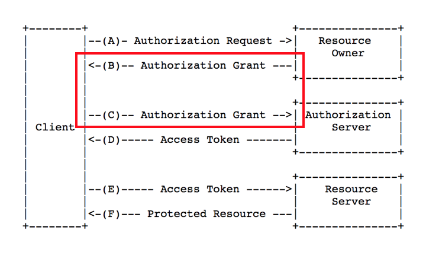

# Spring OAuth2

# 서론

- OAuth(Open Authorization)란?
    - Third-party 어플리케이션에게 리소스 소유자를 대신해 리소스 서버에서 제공하는 자원에 대한 접근 권한을 위임하는 표준
    - OAuth 는 접근 위임을 위한 표준으로, OAuth 를 통해 보호된 정보에 대한 접근을 인가받을 수 있다는 것이다.
    - 접근 권한을 인가 받았음은 액세스 토큰(Access Token)을 통해 증명한다.
    - 민감 정보인 ID와 Password를 주고 받지 않아도 사용자 정보에 접근할 수 있으므로, 보안적 이점을 가진다.
    - 현재(2023.05.09) 기준, OAuth는 OAuth2가 최신 버전이다.
- 주요 용어
    - 자원 소유자 (Resource Owner) : 보호된 자원에 대한 접근권한을 위임해 줄 수 있는 주체. 사람일 경우 사용자.
    - 자원 서버 (Resource Server) : 보호된 자원을 가지고 있는 서버. 액세스 토큰을 가진 요청에 대해 자원을 제공해줄 수 있음.
    - 클라이언트 (Client) : 자원 소유자의 허가를 받아 보호된 자원에 접근하려는 어플리케이션.
    - 인증 서버 (Authorization Server) : 자원 소유자의 인증 및 클라이언트의 권한 획득이 끝나면, 액세스 토큰을 발급해 주는 서버. (인증 서버와 자원 서버는 분리할 수도 있고, 하나의 서버가 두 역할을 할 수도 있다.)
    - 접근 토큰(access token) : 인증 후에 클라이언트가 보호된 자원에 접근하기 위해 필요한 값.
- 배경
    - 웹애플리케이션은 회원정보가 필요하다. 회원가입을 위한 이메일 or 닉네임 정도일 수도 있고, 본격적인 애플리케이션 사용을 위해 사진, 캘린더 정보, 현재 위치 등 더 다양한 정보를 요구할 수도 있다.
    - 사용자는 서비스 이용을 위해 정보를 모두 다 입력하고 인증하는 것이 번거롭다. 또한 사용자의 민감 정보를 신뢰할 수 없는 애플리케이션에 입력한다는 것은 보안적으로 위험할 수 있다.
    - 또한 사용자가 자신의 민감 정보를 애플리케이션에 제공하는 것은 다음의 문제점을 가진다.
        - 신뢰성 : 사용자가 뭘 믿고 애플리케이션에 id/password를 제공하는가?
        - 접근 가능성 : id/password를 제공하면, 애플리케이션은 등록된 사용자의 모든 정보에 접근 가능해지게 된다.
        - 사용자가 애플리케이션의 id/password를 바꾼다면, 애플리케이션은 기존에 제공받은 id/password로 서비스를 이용할 수 없다.
    - 이 같은 문제점을 해결하기 위해 등장한 것이 토큰을 사용하는 방식.
        - 토큰을 통해, 웹 애플리케이션은 꼭 필요한 사용자의 부분적인 정보에 대한 접근 권한만을 위임받는다.
        - id/password같은 민감 정보가 아니라는 장점이 있다.
    - OAuth를 이용한 인증 서버는 이 모든 정보를 가지고 있고, 사용자가 로그인으로 인증만 한다면, 웹 애플리케이션에 정보를 제공할 수 있다.

# 인증 / 인가

- OAuth 인증/인가 방식
    1. 자원소유자는 클라이언트에 접근한다.
    2. 클라이언트는 자원소유자의 정보에 접근하기 위한 토큰을 얻기 위해, 인증서버에 접근한다.
    3. 인증서버는 자원소유자가 정말 그 자원에 대한 소유자가 맞는지 검증한다.
    4. 인증서버는 클라이언트가 신뢰할 수 있는 클라이언트인지 검증한다.
    5. 모든 검증이 끝나면, 인증서버는 클라이언트에게 토큰을 발급해준다.
    6. 클라이언트는 토큰을 가지고 자원서버에 접근한다.
    7. 자원서버는 토큰이 유효한지 인증서버에 확인하고, 유효하다면 자원을 제공해준다.
        
        
        
    - 이 중 3, 4번은 Authorization Grant 과정이라고 하며, 토큰을 발급받기 전에 선행되는 과정이다. OAuth는 총 4가지의 Authorization Grant 방법을 제공하며, 그 방법들은 아래와 같다.
        1. 인가 코드 승인 (Authorization Code Flow with PKCE)
            - Proof Key for Code Exchange(PKCE) 방식. authorization server가 proof key를 사용하여 code를 검증하는 로직이 추가.
        2. 암시적 승인 (Implicit Flow with Form PostPermalink)
            - authorization code없이 바로 access token이 발급되는 방식.
        3. 자원 소유자 패스워드 승인 (Resource Owner Password FlowPermalink)
            - 리소스 오너(유저)는 애플리케이션에 credentials(id/password)를 입력하고, 그것이 authorization server로 전달되어 access token이 전달된다.
        4. 클라이언트 인증 정보 승인 (Client Credentials FlowPermalink)
            - 클라이언트(애플리케이션)의 자격을 증명하는 것만으로 access token을 획득할 수 있는 방식. 클라이언트가 리소스 서버를 신뢰할 수 있는 경우에 사용할 수 있다.
- Authorization Code
    
    
    
    - 전제조건 : 회원은 A Service 에 가입되어 있다. B Service 는 A Service 와 통신하기 위해 Client ID, Client Secret 을 발급받았다.
        1. 자원 소유자가 클라이언트에 접근하면, 클라이언트에서는 자원 소유자에 대해 아무런 정보도 가지고 있지 않은 상태다. 이 때 자원 소유자 에게 ‘A Service(자원 서버) 를 통해 로그인 하기’ 와 같은 링크를 제공하여 자원 서버로부터 정보를 가져올 준비를 한다.
            
            
            
        2. 자원 소유자가 ‘A Service(자원 서버) 를 통해 로그인 하기’ 링크를 누르면, 해당 링크를 통해 클라이언트는 인증 서버로 요청을 보내게 되고, 이 요청을 받은 인증서버는 Http 리다이렉트(302) 응답을 보낸다. 이 때 리다이렉트 링크는 인증 서버의 인증 페이지가 되고, 따라서 자원 소유자는 인증 서버의 인증 페이지를 보게 된다.
            
            
            
        3. 인증 서버의 인증 페이지에서, 자원 소유자는 본인의 계정/패스워드를 통해 인증을 하게된다. 이 때 클라이언트는 자원 소유자의 계정/패스워드를 볼 수가 없고, 자원 소유자가 직접 본인의 정보로 인증하므로 안전하다. 인증 서버는 자원 소유자의 인증이 정상적으로 끝나면, 앞서 클라이언트로부터 받았던 redirect_uri 로 자원 소유자를 리다이렉트 시킨다. 이 때, 리다이렉트 uri 에는 authorization code, state 값이 포함되게 된다. authorization code 는 자원소유자의 인증이 정상적으로 완료되었다는 의미로 보내주는 값이며, state 는 클라이언트-인증서버간의 식별을 위한 값이다.
            
            
            
        4. 이제 토큰을 받기 위한 준비가 끝났다. 클라이언트는 앞서 받은 authorization code, state, 그리고 사전에 API 통신을 위해 발급받은 client id, client secret 등의 값을 가지고 인증서버에 토큰을 요청한다. 인증 서버에서는 요청정보들의 유효성을 검증한 후 토큰을 발급해주게 된다. 이 때, 앞서 클라이언트가 요청한 값의 옵션에 따라 인증서버에서 Refresh Token 을 발급해줄 수도 있는데, 이는 액세스 토큰의 유효기간이 끝났을 경우 앞서의 절차를 다시 수행할 필요 없이 토큰을 재발급받기 위한 값이다.
            
            
            
        5. 클라이언트는 토큰을 가지고 자원 서버에 자원 소유자의 정보를 요청한다. 자원 서버는 해당 토큰을 인증서버에 보내서 유효성 및 스코프를 검증한다. 인증서버에서는 토큰에 해당하는 스코프를 알려주며, 자원 서버에서는 그 스코프에 해당하는 정보를 클라이언트에게 주게 된다.
            
            
            
    

# Reference

[[OAuth 2.0] 2. OAuth의 개념, 주요 용어, 플로우 타입](https://iamhmin.github.io/oauth/oauth-2/)

[Spring Security OAuth2 인증서버 만들기 01](https://autumnly.tistory.com/64)