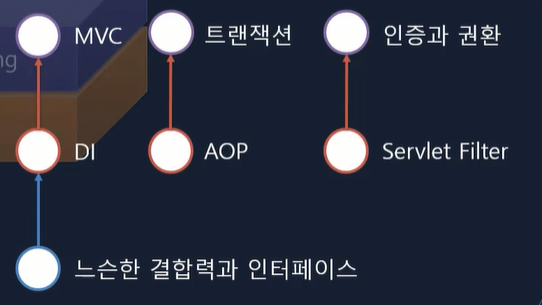

# 뉴렉쳐 Spring 강의

# 오리엔테이션

- Spring 소개와 학습 안내
    - Spring의 핵심은 DI(Dependency Injection)과 TM(Transaction Management)
    - 이 중 TM은 과거 자바 EE버전에서 관리하기 어려운 Transaction 관리를 수월하게 해준다.
    - 특히, Spring은 모듈 관리를 수월하게 할 수 있도록 도와주는 것이 핵심
        
        
        
    
- 느슨한 결합력과 인터페이스
    - 높은 결합도의 구조는 코드의 수정이 필요할 때 직접적인 코드의 수정이 필요하므로 위험성이 높아진다. 따라서, Service에서 DAO 사이에 인터페이스를 추가, DAO 객체의 변화에도 유연하게 대처해질 필요(결합도를 낮추는)가 생긴다.
    - 이 때 Service와 DAO 사이의 interface를 이용한 유연화가 바로 다형성.
    - 그러나 Service와 DAO 사이 뿐만아니라, UI와 Service 사이의 연결에도 객체의 수정이 필요해질 가능성이 있다.
    - 이 때 필요해지는 기술이 DI.
    - new 연산자를 통한 객체의 생성과 조립을 XML과 Annotation을 이용한 외부 설정으로 변경하는 것이 바로 DI의 의미다.
        
        
        
- DI(Dependency Injection)
    - DI는 의존성 주입. 비유적 표현으로 부품 조립으로 이해할 수 있다.
    - Dependency는 Composition has a 관계로 이해하자.
        
        
        
    - 위 코드에서 class A가 private B를 사용하기 위해 public A에서 b의 객체를 생성하여 소유할 때의 관계가 Composition has a 관계 (일체형 has a 관계). 이 때 B가 A의 Dependency, 종속 객체
    - Association, Aggregation, Composition의 포함 범위
        
        
        
    - Association has a 관계는 Composition has a 관계보다 결합도가 낮은 관계로, 소유가 아닌 사용의 관점(Using)에서, 조립형 has a 관계로 이해할 수 있다.
        
        
        
    - 유지보수성의 측면에서, 느슨한 결합도의 Association has a 관계가 권장된다.  이때 부품으로 사용하기 위한 B를 A에 인식하는 것이 주입, Injection.
    - 즉, DI는 외부 객체를 사용하기 위해 생성된 객체를 Setter와 생성자를 통해 인식하는 것.
        
        
        
    - 이 때의 인식, 조립 방법이 Setter Injection과 Construction Injection.
    - 그러나 이와 같은 조립 방법은 번거로운 일이며, Spring의 DI는 이 번거로움을 줄이고, Bean과 같은 객체를 통해 그 번거로움을 줄여주는 것이 핵심이다.
    
- IoC(Inversion Of Control) 컨테이너