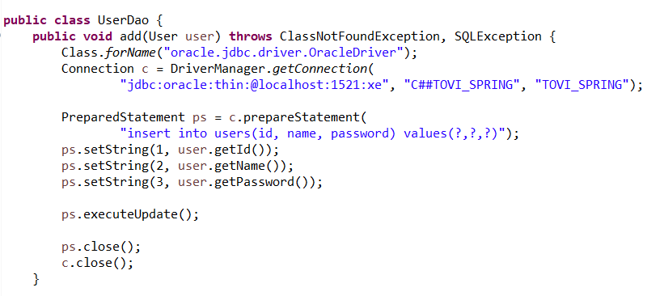

# 토비의 스프링 VOL1

# 01. 오브젝트와 의존관계

- 스프링의 핵심 철학은 자바 엔터프라이즈 기술의 혼란 속에서 잃어버렸던 객체지향 기술의 진정한 가치를 회복시키고, 그로부터 객체지향 프로그래밍이 제공하는 폭넓은 헤택을 누릴 수 있도록 기본으로 돌아가자는 것이다.
- 초난감 DAO
    - DAO(Data Access Object)는 DB를 사용해 데이터를 조회하거나 조작하는 기능을 전담하도록 만든 오브젝트다.
    
    
    
    
    
    - JDBC 드라이버 직접 생성하여 DB에 Insert 및 Select 작업 수행.
- DAO의 분리
    - 개발자가 객체를 설계할 때 가장 염두에 둬야 할 사항은 바로 미래의 변화를 어떻게 대비할 것인가다.
    - 미래의 변화를 대비하는 방법은 분리와 확장을 고려한 설게에 있다.
    - 변화는 집중된 한 가지 관심에 대해 일어나지만 그에 따른 작업은 한 곳에 집중되지 않는 경우가 많다. 그러므로 개발자가 준비해야 할 일은 한 가지 관심이 한 군데에 집중되게 하는 것이다. 즉, 관심이 같은 것끼리는 모으고, 관심이 다른 것은 따로 떨어져 있게 하는 것이다. 
    → 관심사의 분리(Separation of Concerns) : 관심이 같은 것끼리는 하나의 객체 안으로 또는 친한 객체로 모이게 하고, 관심이 다른 것은 가능한 한 따로 떨어져서 서로 영향을 주지 않도록 분리하는 것.
        
        
        
        
        
    - private 메소드 getConnection() 을 이용, Connection 객체의 분리.
    - 이와 같은 작업을 리팩토링(refactoring)이라고 한다. 
    → 리팩토링은 기존의 코드를 외부의 동작방식에는 변화 없이 내부 구조를 변경해서 재구성하는 작업 또는 기술을 말한다. 리팩토링을 하면 코드 내부의 설계가 개선되어 코드를 이해하기가 더 편해지고, 변화에 효율적으로 대응할 수 있다. 결국 생산성은 올라가고, 코드의 품질은 높아지며, 유지보수하기 용이해지고, 견고하면서도 유연한 제품을 만들 수 있다.
    - 공통의 기능을 담당하는 메소드로 중복된 코드를 뽑아내는 것을 리팩토링에서는 메소드 추출(extract method) 기법이라고 한다.
    - 분리 외에도 상속을 통해 문제를 해결할 수 있다.
        
        
        
    - 기존의 클래스를 추상 클래스로 변경한 뒤, 추상 메소드 getConnection()을 UserDao 추상 클래스를 상속받은 Class에서 활용할 수 있다.  DAO의 핵심 기능인 데이터를 등록하고 가져올 것인가라는 관심을 담당하는 UserDao 객체와 DB 연결방법은 어떻게 할 것인가를 담고 있는 NUserDao, DUserDao가 클래스 레벨로 구분된다.
    - 이처럼 슈퍼클래스에 기본적인 로직의 흐름을 만들고, 그 기능의 일부를 추상 메소드나 오버라이딩이 가능한 protected 메소드 등으로 만든 뒤 서브클래스에서 이런 메소드를 필요에 맞게 구현해서 사용하도록 하는 방법을 템플릿 메소드 패턴(template method pattern)이라고 한다.
    - 서브클래스에서 구체적인 오브젝트 생성 방법을 결정하게 하는 것을 팩토리 메소드 패턴(factory method pattern)이라고 부르기도 한다.
        
        
        
- DAO의 확장
    - 모든 오브젝트는 변한다. 그러나 오브젝트가 다 동일한 방식으로 변하는 것은 아니다. 관심사에 따라서 분리한 오브젝트들은 제각기 독특한 변화의 특징이 있다.
        
        
        
    - 기존의 UserDao 클래스에서 담당한던 Connection 기능을 별도의 Class SimpleConnectionMaker의 makeNewConnection() 메소드로 분리했다. 이는 기능 변화 없이 내부 설계를 변경해서 좀 더 나은 코드로 개선한 것이다.
    - 단, 기존의 N사와 D사에 UserDao 클래스만 공급하고 상속을 통해 DB Connection 기능을 확장해서 사용하게 했던 것이 다시 불가능해졌다. 이는 UserDao의 코드가 SImpleConnectionMaker라는 특정 Class에 종속되어 있기 때문에 상속을 사용했을 때처럼 UserDao 코드의 수정 없이 DB Connection 생성 기능을 변경할 방법이 없기 때문이다.
    - 이 문제를 해결하기 위해선 두 가지 문제를 해결해야 한다. 첫 번째는 SImpleConnectionMaker의 Method가 문제로, 강한 종속성을 가지게 된 UserDao Class는 하위 Class인 NUserDao와 DUserDao의 DB Connection 제공 클래스의 이름에 따라 UserDao의 메소드의 커넥션을 가져오는 코드를 일일히 변경해야 한다.
    - 두 번째 문제는 DB Connection을 제공하는 클래스(makeNewConnection)가 어떤 것인지를 UserDao가 구체적으로 알고 있어야 한다는 점이다.
    - 이와 같은 문제들의 근본적인 원인은 UserDao가 바뀔 수 있는 정보, 즉 DB Connection을 가져오는 클래스에 대해 너무 많이 알고 있기 때문이다. 즉, UserDao가 DB Connection을 가져오는 구체적인 방법에 종속되어 있다.
    - 이를 해결하기 위한 가종 좋은 해결책은 두 개의 클래스가 서로 긴밀하게 연결되어 있지 않도록 중간에 추상적인 느슨한 연결고리, 즉 Interface를 만들어주는 것이다. Interface는 자신을 구현한 클래스에 대한 구체적인 정보는 모두 감춰버린다. 결국 오브젝트를 만들려면 구체적인 클래스 하나를 선택해야겠지만 Interface로 추상화해놓은 최소한의 통로를 통해 접근하는 쪽에서는 오브젝트를 만들 때 사용할 클래스가 무엇인지 몰라도 된다. 결국, Interface를 통해 접근하게 되면 실제 구현 클래스를 바꿔도 신경 쓸 일이 없다.
        
        
        
    - Connection 기능을 담당하기 위한 느슨한 연결체인 ConnectionMaker Interface
        
        
        
    - Interface를 구현하여 독자적인 Connection 방법을 구축할 수 있는 DConnectionMaker Class.
        
        
        
    - Connection 객체는 ConnectionMaker의 makeConnection() 메서드를 사용하지만, 생성자는 여전히 DConnectionMaker로 특정 Class에 종속적이다. 이는 new DConnectionMaker() 라는 코드가 UserDao가 어떤 ConnectionMaker 구현 클래스의 오브젝트를 이용하게 할지를 결정하게 하는 , 특정 구현 클래스 사이의 관계를 설정해주는 것에 대한 관심이 있기 때문이다.
    - 클래스 사이의 관계는 코드에 다른 클래스 이름이 나타나기 때문에 만들어지는 것이다. 하지만 오브젝트 사이의 관계는 그렇지 않다. 코드에서는 특정 클래스를 전혀 알지 못하더라도 해당 클래스가 구현한 인터페이스를 사용했다면, 그 클래스의 오브젝트를 인터페이스 타입으로 받아서 사용할 수 있다. 이는 객체지향 프로그램에는 다형성이 있기 때문이다.
    - UserDao 오브젝트가 DConnectionManager 오브젝트를 사용하게 하려면 두 클래스의 오브젝트 사이에 런타임 사용관계 또는 링크, 또는 의존관계라고 불리는 관계를 맺어줘야 한다.
        
        
        
    - 위처럼 ConnectionMaker를 매개변수로 삼는 생성자를 만듬으로서 DConnectionMaker를 사라지게 할 수 있다. 이는 DConnectionMaker를 생성하는 코든느 UserDao와 특정 ConnectionMaker 구현 클래스의 오브젝트 간 관계를 맺는 책임을 담당하는 코드였는데, 그것을 UserDao의 클라이언트에게 넘겨버렸기 때문이다.
        
        
        
    - 이제 UserDaoTest 클래스는 UserDao와 ConnectionMaker 구현 클래스와의 런타임 오브젝트 의존 관계를 설정하는 책임을 담당해야 한다. 그래서 특정 ConnectionMaker 구현 클래스의 오브젝트를 만들고, UserDao 생성자 파라미터에 넣어 두 개의 오브젝트를 연결해준다. 그리고 원래 자기 책임이던 UserDao에 대한 테스트 작업을 수행한다.
        
        
        
    - 개방 폐쇄 원칙(OCP, Open-Closed Principle)을 이용하면 지금까지 해온 리팩토링 작업의 특징과 최종적으로 개선된 설계와 코드의 장점이 무엇인지 효과적으로 설명할 수 있다. 개방 폐쇄 원칙은 깔끔한 설계를 위해 적용 가능한 객체지향 설계 원칙 중의 하나다. 이는 ‘클래스나 모듈은 확장에는 열려 있어야 하고 변경에는 닫혀 있어야 한다.’로 정의할 수 있다.
    → PS. SOLID 원칙 
    —> SRP(The Single Responsibility Principle) : 단일 책임 원칙
    —> OCP(Open-Closed Principle) : 개방 폐쇄 원칙
    —> LSP(The Liskov Substitution Principle) : 리스코프 치환 원칙
    —> ISP(The Interface Segregation Principle) : 인터페이스 분리 원칙
    —> DIP(The Dependency Inversion Principle) : 의존관계 역전 원칙
    - 개방 폐쇄 원칙은 높은 응집도와 낮은 결합도(High Cohesion and low Coupling) 원리로도 설명 가능하다. 응집도가 높다는 것은 하나의 모듈, 클래스가 하나의 책임 또는 관심사에만 집중되어 있다는 뜻이다. 높은 응집도는 클래스 레벨뿐 아니라, 패키지, 컴포넌트, 모듈에 이르기까지 그 대상의 크기가 달라도 동일한 원리로 적용될 수 있다.
    - 응집도가 높다는 것은 변화가 일어날 때 해당 모듈에서 변하는 부분이 크다는 의미로도 설명할 수 있다. 즉, 변경이 일어날 때 모듈의 많은 부분이 함께 바뀐다면 응집도가 높다고 할 수 있다.
    - 낮은 결합도는 높은 응집도보다 더 민감한 원칙이다. 책임과 관심사가 다른 오브젝트 또는 모듈과는 낮은 결합도, 즉 느슨하게 연결된 형태를 유지하는 것이 바람직하다. 느슨한 연결은 관게를 유지하는 데 꼭 필요한 최소한의 방법만 간접적인 형태로 제공하고, 나머지는 서로 독립적이고 알 필요도 없게 만들어주는 것이다. 결합도가 낮아지면 변화에 대응하는 속도가 높아지고, 구성이 깔끔해진다. 또한 확장하기에도 매우 편리하다.
    - 결합도는 ‘하나의 오브젝트가 변경이 일어날 때에 관계를 맺고 있는 다른 오브젝트에게 변화를 요구하는 정도’라고 설명할 수 있다. 낮은 결합도란 결국, 하나의 변경이 발생할 때 다른 모듈과 객체로 변경에 대한 요구가 전파되지 않는 상태를 의미한다.
    - UserDaoTest-UserDao-ConnectionMaker의 구조를 디자인 패턴의 시각으로 보면 전략 패턴(Strategy Pattern)에 해당한다고 볼 수 있다. 전략 패턴은 자신의 기능 맥락(Context)에서 필요에 따라 변경이 필요한 알고리즘을 인터페이스를 통해 통째로 외부로 분리시키고, 이를 구현한 구체적인 알고리즘 클래스를 필요에 따라 바꿔서 사용할 수 있게 하는 패턴이다.
    
- 제어의 역전(IoC)
    - 팩토리(factory)는 객체의 생성 방법을 결정하고 그렇게 만들어진 오브젝트를 돌려준다. 팩토리는 오브젝트를 생성하는 쪽과 생성된 오브젝트를 사용하는 쪽의 역할과 책임을 깔끔하게 분리하려는 목적으로 사용한다.
        
        
        
        
        
    - DaoFactory Class를 생성 후 DaoFactory의 userDao() 메소드를 호출하면 DConnectionMaker를 사용해 DB Connection을 가져오도록 이미 설정되어 있는 UserDao 오브젝트를 돌려준다. 이제 UserDaoTest는 UserDao가 어떻게 만들어지는지, 어떻게 초기화되어 있는지에 신경 쓰지 않고 팩토리로부터 UserDao 오브젝트를 받아 자신의 관심사인 테스트를 위해  활용하면 된다.
        
        
        
    - UserDao, ConnectionMaker와 달리, DaoFactory는 어떤 오브젝트가 어떤 오브젝트를 사용할지를 정의해놓는 설계도로서의 역할을 수행한다.
    - 단, 위와 같은 방식은 팩토리 내에서 다른 DAO의 생성 기능이 넣어질 경우 ConnectionMaker 구현 클래스의 오브젝트를 생성하는 코드가 메소드마다 반복되는 문제가 발생한다. 이는 ConnectionMaker의 구현 클래스를 결정하고 오브젝트를 만드는 코드를 별개의 메소드로 뽑아내는 방식으로 해결할 수 있다.
        
        
        
    - 제어의 역전은 간단히 말해 프로그램의 제어 흐름 구조가 뒤바뀌는 것이다. 일반적으로 프로그램의 흐름은 main() 메소드와 같이 프로그램이 시작되는 지점에서 다음에 사용할 오브젝트를 결정하고, 그 오브젝트 메소드 안에서 다음에 사용할 것을 결정하고 호출하는 식의 작업이 반복된다. 이와 같은 구조에서 각 오브젝트는 프로그램 흐름을 결정하거나 사용할 오브젝트를 구성하는 작업에 능동적으로 참여한다. 즉, 모든 오브젝트가 능동적으로 자신이 사용할 클래스를 결정하고, 언제 어떻게 그 오브젝트를 만들지를 스스로 관장한다. 모든 종류의 작업을 사용하는 쪽에서 제어하는 구조다.
    - 제어의 역전은 이런 제어 흐름의 개념을 뒤집는 것이다. 제어의 역전에서는 오브젝트가 자신이 사용할 오브젝트를 스스로 선택하지 않는다. 생성하지도 않으며, 자신도 어떻게 만들어지고 어디서 사용되는지를 알 수 없다. 모든 제어 권한을 자신이 아닌 다른 대상에게 위임하기 때문이다. 프로그램의 시작을 담당하는 main() 과 같은 엔트리 포인트를 제외하면 모든 오브젝트는 이렇게 위임받은 제어 권한을 갖는 특별한 오브젝트에 의해 결정되고 만들어진다.
    - 프레임워크는 분명한 제어의 역전 개념이 적용되어 있어야 한다. 애플리케이션 코드는 프레임워크가 짜놓은 틀에서 수동적으로 동작해야 한다.
    - 제어의 역전에서는 프레임워크 또는 컨테이너와 같이 애플리케이션 컴포넌트의 생성과 관계설정, 사용, 생명주기 관리 등을 관장하는 존재가 필요하다. 지금까지 만든 DaoFactory는 오브젝트 수준의 가장 단순한 IoC 컨테이너 내지는 IoC프레임워크라고 불릴 수 있다.
- 스프링의 IoC
    - 스프링의 핵심을 담당하는 건 Bean Factory 또는 Application Context라고 불리는 것에 있다.
    → Bean Factory는 스프링에서 빈의 생성과 관계설정 같은 제어를 담당하는 IoC 오브젝트를 의미한다. 또한, 보통은 Bean Factory 보다는 이를 확장한 Application Context를 주로 사용한다. Application Context는 IoC방식을 따라 만들어진 일종의 Bean Factory를 의미한다.
    - Bean Factory는 빈을 생성하고 관계를 설정하는 IoC의 기본 기능에 초점을 맞춘 것이고, Application Context는 Application 전반에 걸쳐 모든 구성요소의 제어 작업을 담당하는 IoC 엔진에 초점을 맞춘 것이다.
    - 스프링이 제어권을 가지고 직접 만들고 관계를 부여하는 오브젝트를 빈(Bean)이라고 부른다.  동시에 스프링 빈은 스프링 컨테이너가 생성과 관계설정, 사용 등을 제어해주는 제어의 역전이 적용된 오브젝트를 가리키는 말이다.
        
        
        
    - @Configuration, @Bean Annotation을 통해 스프링 프레임워크의 Bean Factory 또는 Application Context가 IoC 방식의 기능을 제공할 때 사용할 설정정보로 만들 수 있다.  만들어진 Bean은 ApplicationContext를 구현한 AnnotationConfigApplicationContext를 이용하면 된다. 생성자 파라미터로 만들어진 Bean Factory인 DaoFactory 클래스를 넣어 사용한다. 준비된 ApplicationContext의 getBean() Method를 이용, UserDao의 오브젝트를 가져올 수 있다.
        
        
        
    - getBean() 메소드는 ApplicationContext가 관리하는 오브젝트를 요청하는 메소드다. getBean()의 파라미터인 “userDao”는 ApplicationContext에 등록된 Bean의 이름이다. 이는 DaoFactory Class에서 @Bean Annotation을 userDao라는 이름의 메소드에 붙였는데, 이 메소드 이름이 바로 Bean의 이름이 된다.
    - 즉, userDao라는 이름의 Bean을 가져온다는 것은 DaoFactory의 userDao() 메소드를 호출해서 그 결과를 가져온다고 생각하면 된다.
    - Application Context는 Application에서 IoC를 적용해서 관리할 모든 오브젝트에 대한 생성과 관계설정을 담당한다. 대신 ApplicationContext에는 DaoFactory와 달리 직접 오브젝트를 생성하고 관계를 맺어주는 코드가 없고, 그런 생성정보와 연관관계 정보를 별도의 설정정보를 통해 얻는다. 떄로는 외부의 Object Factory에 그 작업을 위임하고 그 결과를 가져다가 사용하기도 한다.
        
        
        
    - DaoFactory를 Object Factory로 직접 사용했을 때에 비해 Application Context를 사용하는 장점은 다음과 같다.
        1. 클라이언트는 구체적인 팩토리 클래스를 알 필요가 없다.
        → Application Context를 이용하면 일관된 방식으로 오브젝트를 가져올 수 있다.
        2. Application Context는 종합 IoC 서비스를 제공해준다.
        → Application Context의 역할은 오브젝트의 생성과 다른 오브젝트와의 관계설정은 물론, 오브젝트가 만들어지는 방식, 시점과 전략을 다르게 가져갈 수도 있다. 또한 자동생성, 오브젝트에 대한 후처리, 정보의 조합, 설정 방식의 다변화, 인터셉팅 등 오브젝트를 효과적으로 활용할 수 있는 다양한 기능을 제공한다. 또한, 빈이 사용할 수 있는 기반기술 서비스나 외부 시스템과의 연동 등을 컨테이너 차원에서 제공해주기도 한다.
        3. Application Context는 빈을 검색하는 다양한 방법을 제공한다.
    - 빈(Bean)
    → 빈 또는 빈 오브젝트는 스프링이 IoC방식으로 관리하는 오브젝트다. 관리되는 오브젝트(managed object)라고 부르기도 한다. 주의할 점은 스프링을 사용하는 Application에서 만들어지는 모든 오브젝트가 다 빈은 아니다. 그 중에서도 스프링이 직접 그 생성과 제어를 담당하는 오브젝트만을 빈이라고 부른다.
    - 빈 팩토리(Bean Factory)
    → 스프링의 IoC를 담당하는 핵심 컨테이너. 빈을 등록하고, 생성하고, 조회하고, 반환한다. 그 외에 부가적인 빈을 관리하는 기능도 담당한다.
    - 애플리케이션 컨텍스트(Application Context)
    → Bean Factory를 확장한 IoC 컨테이너다. 빈을 등록하고 관리하는 기본적인 기능은 Bean Factory와 동일한다. 여기에 스프링이 제공하는 각종 부가 서비스를 추가로 제공한다.
    - 설정정보 / 설정 메타정보(configuration metadata)
    → Application Context 또는 Bean Factory가 IoC를 적용하기 위해 사용하는 메타정보. 컨테이너에 어떤 기능을 세팅하거나 조정하는 경우에도 사용하지만, 그보다는 IoC 컨테이너에 의해 관리되는 Application Object를 생성하고 구성할 때 사용된다.  Application의 형상 정보라고 부르기도 한다. 또는, Application의 전체 그림이 그려진 청사진(blueprints)라고 부르기도 한다.
    - 컨테이너(Container) 또는 IoC 컨테이너
    → IoC 방식으로 빈을 관리한다는 의미에서 Application Context나 Bean Factory를 Container 또는 IoC Container라고도 한다. 후자는 주로 Bean Factory의 관점에서 이야기하는 것이며, Container 또는 Spring Container라고 할 때는 Application Context를 가리키는 것이라고 보면 된다.
    - 스프링 프레임워크 
    → 스프링 프레임워크는 IoC Container, Application Context를 포함해서 스프링이 제공하는 모든 기능을 통틀어 말할 때 주로 사용한다.
    
- 싱글톤 레지스트리와 오브젝트 스코프
    - 자바에서 두 개의 오브젝트가 완전히 같은 동일한(identical) 오브젝트라고 말하는 것과, 동일한 정보를 담고 있는 (equivalent) 오브젝트는 다르다. 전자는 동일성(identity) 비교, 후자는 동등성(equality) 비교라고 한다. 전자는 == 연산자로, 후자는 equals() 메소드를 이용해 비교한다.
    - 두 개의 오브젝트가 동일하다면 사실은 하나의 오브젝트만 존재하며, 두 개의 오브젝트 레퍼런스 변수를 가지고 있는 것이다. 두 개의 오브젝트가 동일하지는 않지만 동등한 경우는 두 개의 각기 다른 오브젝트가 메모리상에 존재하는 것이며, 오브젝트의 동등성 기준에 따라 두 오브젝트의 정보가 동등하다고 판단하는 것 뿐이다.
    - 스프링은 여러 번에 걸쳐 빈을 요청하더라도 매번 동일한 오브젝트를 반환한다. 단순히 getBean()을 실행할 때마다 userDao() 메소드를 호출하고, 매번 new 연산자에 의해 새로운 UserDao가 만들어지지 않는다는 의미다.
    - Application Context는 IoC 컨테이너로 싱글톤을 저장하고 관리하는 싱글톤 레지스트리(Singleton registry)이기도 하다. 기본적으로 스프링은 기본적으로 별다른 설정을 하지 않으면 내부에서 생성하는 빈 오브젝트를 모두 싱글톤으로 만든다.
    - 스프링은 주로 적용되는 대상이 자바 엔터프라이즈 기술을 사용하는 서버환경이기에 싱글톤으로 빈을 생성한다. 해당 혼경에서는 요청 시 새로운 오브젝트를 생성하는 구조의 경우 서버의 부담이 너무 커지기에, 하나의 오브젝트를 만들고 사용자의 요청을 담당하는 여러 스레드에서 하나의 오브젝트를 공유해 동시에 사용하는 싱글톤 방식이 선호된다.
    - 자바에서 싱글톤을 구현하는 방법
    
    → 클래스 밖에서는 오브젝트를 생성하지 못하도록 생성자를 private로 만든다.
    → 생성된 싱글톤 오브젝트를 저장할 수 있는 자신과 같은 타입의 static 필드를 정의한다.
    → 스태틱 팩토리 메소드인 getInstance()를 만들고 이 메소드가 최초로 호출되는 시점에서 한번만 오브젝트가 만들어지게 한다. 생성된 오브젝트는 스태틱 필드에 저장된다. 또는 스태틱 필드의 초기값으로 오브젝트를 미리 만들어둘 수도 있다. 
    → 한번 오브젝트(sinleton)이 만들어지고 난 후에는 getInstance() 메소드를 통해 이미 만들어
    져 스태틱 필드에 저장해둔 오브젝트를 넘겨준다.
    - 싱글톤 패턴 구현 방식의 문제점 
    
    → private 생성자를 가지고 있기에 상속할 수 없다. 
    → 테스트하기가 힘들다. 싱글톤은 만들어지는 방식이 제한적이기에 테스트에서 사용될 때 목 오브젝트 등으로 대체하기가 힘들다. 또한 초기화 과정에서 생성자 등을 통해 사용할 오브젝트를 다이내믹하게 주입하기도 힘들기에 필요한 오브젝트는 직접 오브젝트를 만들어 사용할 수밖에 없다. 
    → 서버 환경에서는 싱글톤이 하나만 만들어지는 것을 보장하지 못한다. 서버 클래스 로더를 어떻게 구성하고 있느냐에 따라 싱글톤 클래스임에도 하나 이상의 오브젝트가 만들어질 수 있다. 
    → 싱글톤의 사용은 전역 상태를 만들 수 있기에 바람직하지 못하다. 싱글톤의 스태틱 메소드를 이용해 언제든지 싱글톤에 쉽게 접근할 수 있기에 애플리케이션 어디서든지 사용될 수 있고, 그러다 보면 자연스럽게 전역 상태(global state)로 사용되기 쉽다.
    - 이러한 자바의 기본적인 싱글톤 형태의 단점으로 인해 스프링은 직접 싱글톤 형태의 오브젝트를 만들고 관리하는 기능을 제공한다. 그것이 바로 싱글톤 레지스트리(singleton registry) 이다. 스프링 컨테이너는 싱글톤을 생성하고 관리하고 공급하는 싱글톤 관리 컨테이너이기도 하다.
    - 싱글톤 레지스트리의 장점은 스태틱 메소드와 private 생성자를 사용해야 하는 비정상적인 클래스가 아니라 평범한 자바 클래스를 싱글톤으로 활용하게 해준다는 점이다. 이는 오브젝트 생성에 관한 모든 권한은 IoC 기능을 제공하는 Application Context에 있기 때문이다.
    - 또한, 싱글톤 레지스트리는 싱글톤 패턴과 달리 스프링이 지지하는 객체지향적인 설계 방식과 원칙, 디자인 패턴(싱글톤 패턴 제외) 등을 적용하는 데 아무런 제약이 없다. 스프링은 ioC 컨테이너일 뿐만 아니라, 고전적 싱글톤 패턴을 대신해서 싱글톤을 만들고 관리해주는 싱글톤 레지스트리이기도 하다. 스프링이 빈을 싱글톤으로 만드는 것은 결국 오브젝트의 생성 방법을 제어하는 IoC 컨테이너로서의 역할이다.
    - 기본적으로 싱글톤이 멀티스레드 환경에서 서비스 형태의 오브젝트로 사용되는 경우에는 상태정보를 내부에 가지고 있지 않은 무상태(stateless)방식으로 만들어져야 한다. 다중 사용자의 요청을 한꺼번에 처리하는 스레드들이 동시에 싱글톤 오브젝트의 인스턴스 변수를 수정할 경우 서로 값을 덮어쓰고 자신이 저장하지 않은 값을 읽어오는 Dirty-Read 문제가 발생할 수 있기에 위험하다. 따라서 싱글톤은 기본적으로 인스턴스 필드의 값을 변경하고 유지하는 상태유지(stateful) 방식으로 만들지 않는다.
    - 상태가 없는 방식으로 클래스를 만들 경우에 각 요청에 대한 정보나, DB나 서버의 리소스로부터 생성한 정보는 파라미터와 로컬 변수, 리턴 값 등을 이용한다. 메소드 파라미터나 메소드 안에서 생성되는 로컬 변수는 매번 새로운 값을 저장할 독립적인 공간이 만들어지기에 싱글톤이라고 해도 여러 스레드가 변수의 값을 덮어쓸 일은 없다.
    - 빈의 스코프(scope)는 스프링이 관리하는 오브젝트, 즉 빈이 생성되고, 존재하고, 적용되는 범위를 의미한다. 스프링 빈의 기본 스코프는 싱글톤이다. 싱글톤 스코프는 컨테이너 내에 한 개의 오브젝트만 만들어져서, 강제로 제거하지 않는 한 스프링 컨테이너가 존재하는 동안 계속 유지된다.
    - 프로토타입(prototype) 스코프는 컨테이너에 빈을 요청할 때마다 매번 새로운 오브젝트를 생성한다.
    - 요청(request) 스코프는 웹을 통해 새로운 HTTP 요청이 생길 때마다 새로운 오브젝트를 생성한다.
- 의존관계 주입(DI)
    - 두 개의 클래스 또는 모듈이 의존관계에 있다고 말할 때는 항상 방향성을 부여해줘야 한다. UML 모델에서는 두 클래스의 의존관계(dependency relationship)을 담음과 같이 표시한다.
        
        
        
    - 의존한다는 것은 의존대상, 위 그림에서는 B가 변하면 그것이 A에 영향을 미친다는 의미다. 대표적인 경우는 A에서 B에 정의된 메소드를 호출해서 사용하는 경우다. 이럴 때를 ‘사용에 대한 의존관계’가 있다고 표현한다. 만약 B에 새로운 메소드가 추가되거나 기존 메소드의 형식이 바뀌면 A도 그에 따라 수정되거나 추가되어야 한다. 의존하지 않는다는 말은 A의 변화가 B에 영향을 미치지 않는다는 의미다.
    - 모델이나 코드에서 클래스와 인터페이스를 통해 드러나는 의존관계가 아닌, 런타임 시 오브젝트 사이에서 만들어지는 의존관계도 있다. 런타임 의존관계 또는 오브젝트 의존관계인데, 설계 시점의 의존관계가 실체화된 것이라고 볼 수 있다.
    - 프로그램이 시작되고 오브젝트가 만들어진 후, 런타임 시에 의존관계를 맺는 대상, 즉 실제 사용대상인 오브젝트를 의존 오브젝트(dependent object)라고 말한다.
    - 의존관계 주입은 구체적인 의존 오브젝트와 그것을 사용할 주체, 보통 클라이언트라고 부르는 오브젝트를 런타임 시에 연결해주는 작업을 말한다.
    - 즉, 의존관계 주입은 다음의 세 가지 조건을 충족하는 작업이다. 
    
    → 클래스 모델이나 코드에는 런타임 시점의 의존관계가 드러나지 않는다. 그러기 위해서는 인터페이스에만 의존하고 있어야 한다. 
    → 런타임 시점의 의존관계는 컨테이너나 팩토리 같은 제3의 존재가 결정한다. 
    → 의존관계는 사용할 오브젝트에 대한 레퍼런스를 외부에서 제공(수입)해줌으로써 만들어진다.
    - 의존관계  주입의 핵심은 설계 시점에는 알지 못했던 두 오브젝트의 관계를 맺도록 도와주는 제3의 존재가 있다는 것이다.
    - DI 컨테이너에 의해 런타임 시에 의존 오브젝트를 사용할 수 있도록 그 레퍼런스를 전달받는 과정이 마치 메소드(생성자)를 통해 DI 컨테이너가 UserDao에게 주입해주는 것과 같다고 해서 이를 의존관계 주입이라고 부른다. 아래의 그림은 이런 객체에 대한 런타임 의존관계 주입과 그것으로 발생하는 런타임 사용 의존관게의 모습을 보여준다.
        
        
        
    - DI는 자신이 사용할 오브젝트에 대한 선택과 생성 제어권을 외부로 넘기고 자신은 수동적으로 주입받은 오브젝트를 사용한다는 점에서 IoC의 개념에 잘 들어맞는다. 스프링 컨테이너의 IoC는 주로 의존관계 주입 또는 DI라는데 초점이 맞춰져 있다.
    - 의존관계 검색(dependency lookup)은 코드에서는 구체적인 클래스에 의존하지 않고, 런타임 시에 의존관계를 결정하지만 의존관계를 맺는 방법이 외부로부터의 주입이 아닌 스스로 검색하는 방법을 의미한다. 의존관계 검색은 자신이 필요로 하는 의존 오브젝트를 능동적으로 찾는다. 물론 자신이 어떤 클래스의 오브젝트를 이용할지 결정하지는 않는다. 의존관계 검색은 런타임 시 의존관계를 맺을 오브젝트를 결정하는 것과 오브젝트의 생성 작업은 외부 컨테이너에게 IoC로 맡기지만, 이를 가져올 때는 메소드나 생성자를 통한 주입 대신 스스로 컨테이너에게 요청하는 방법을 사용한다.
        
        
        
    - 의존관계 검색은 코드 안에 오브젝트 팩토리 클래스나 스프링 API가 나타난다. Application Component가 Container와 같이 성격이 다른 오브젝트에 의존하게 되는 것이므로 그다지 바람직하지 않다. 따라서 대개는 의존관계 주입 방식을 사용하는 편이 낫다.
    - 의존관계 검색 방식에서는 검색하는 오브젝트는 자신이 스프링의 빈일 필요가 없다. 반면 의존관계 주입에서는 두 오브젝트 사이에 DI가 적용하려면 두 객체 모두 반드시 컨테이너가 만드는 빈 오브젝트여야 한다.
    - 단지 외부에서 파라미터로 오브젝트를 넘겨줬다고 해서 DI인 것은 아니다. 주입받는 메소드 파라미터가 이미 특정 클래스 타입으로 고정되어 있다면 DI가 일어날 수 없다. DI에서 말하는 주입은 다이내믹하게 구현 클래스를 결정해서 제공받을 수 있도록 인터페이스 타입의 파라미터를 통해 이뤄져야 한다.
    - DI 기술의 장점은 객체지향의 설계와 프로그래밍의 원칙을 따랐을 때의 장점과 유사하다. 코드에는 런타임 클래스에 대한 의존관계가 나타나지 않고, 인터페이스를 통해 결합도가 낮은 코드를 만드므로, 다른 책임을 가진 사용 의존관계에 있는 대상이 바뀌거나 변경되더라도 자신은 영향을 받지 않으며, 변경을 통한 다양성 확장 방법에는 자유롭다.
    - DI 방식을 적용하여 개발 중과 운영 중으로 서버를 나누었을 때, 모든 DAO는 생성 시점에 DB와의 연결을 담당하는 타입의 오브젝트를 컨테이너로부터 제공받는다. 구체적인 사용 클래스 이름은 컨테이너가 사용할 설정정보에 들어 있다.
        
        
        
        
        
    - 개발환경과 운영환경에서 DI의 설정정보에 해당하는 DaoFactory만 다르게 만들어 두면 나머지 코드에는 전혀 손대지 않고 개발 시와 운영 시에 각각 다른 런타임 오브젝트에 의존관계를 갖게 해줘서 문제를 해결할 수 있다.
    - DB와의 Connection이 이루어질 때마다 연결된 횟수를 리턴하고 싶을 때, DI를 응용 아래와 같은 클래스를 생성하는 것으로 DAO나 Connection 객체를 수정하지 않고 사용할 수 있다.
        
        
        
    - CountingConnectionMaker Class는 ConnectionMaker Interface를 구현했지만 내부에서 직접 DB Connection을 만들지 않는다. 대신 DAO가 DB Connection을 가져올 때마다 호출하는 makeConnection() 메소드에서 DB 연결횟수 카운터를 증가시킨다. CountingConnectionMaker는 자신의 관심사인 DB 연결횟수 카운팅 작업을 마치면 실제 DB Connection을 만들어주는 realConnectionMaker에 저장된 ConnectionMaker 타입 오브젝트의 makeConnection()을 호출해서 그 결과를 DAO에게 돌려준다.
        
        
        
        
        
    - 위 구현 클래스는 DAO가 하나뿐이지만, DAO가 수십, 수백 개여도 상관없다. DI의 장점은 관심사의 분리(SoC)를 통해 얻어지는 높은 응집도에서 나온다. 모든 DAO가 직접 의존해서 사용할 ConnectionMaker 타입 오브젝트는 connectionMaker() 메소드에서 만드므로, CountingConnerctionMaker의 의존관계를 추가하려면 이 메소드만 수정하면 된다. 또한 CountingConnectionMaker를 이용한 분석 작업이 모두 끝나면, 다시 CountingDaoFactory 설정 클래스를 DaoFactory로 변경하거나 connectionmaker() 메소드를 수정하는 것만으로 DAO의 런타임 의존관계는 이전 상태로 복구된다.
    - 생성자가 아닌 일반 메소드를 이용해 의존 오브젝트와의 관계를 주입하는 방법도 있다.
    - 수정자 메소드를 이용한 주입 
    → 수정자(setter)메소드는 외부에서 오브젝트 내부의 Attribute 값을 변경하려는 용도로 주로 사용된다. 수정자 메소드의 핵심기능은 파라미터로 전달된 값을 보통 내부의 인스턴스 변수에 저장하는 것이다. 부가적으로, 입력 값에 대한 검증이나 그 밖의 작업을 수행할 수도 있다. 수정자 메소드는 외부로부터 제공받은 오브젝트 레퍼런스를 저장해뒀다가 내부의 메소드에서 사용하게 하는 DI 방식에서 활용하기에 적당하다.
    - 일반 메소드를 이용한 주입 
    → 여러 개의 파라미터를 갖는 일반 메소드도 DI용으로 사용할 수 있다. 생성자가 수정자 메소드보다 나은 점은 한 번에 여러 개의 파라미터를 받을 수 있다는 점이지만, 파라미터의 개수가 많아지고 비슷한 타입이 여러 개라면 실수하기 쉽다. 임의의 초기화 메소드를 이용하는 DI는 적절한 개수의 파라미터를 가진 여러 개의 초기화 메소드를 만들 수 있기에 한 번에 모든 필요한 파라미터를 다 받아야 하는 생성자보다 낫다.
    - 스프링은 전통적으로 메소드를 이용한 DI 방법 중에서 수정자 메소드를 가장 많이 사용해왔다. 이는 자바 코드 대신 XML을 사용하는 경우에는 자바빈 규약을 따르는 수정자 메소드가 가장 사용하기 편리하기 때문이다.
    
- XML을 이용한 설정
    - DI 정보가 담긴 XML 파일은 <beans>를 루트 엘리먼트로 사용한다. <beans> 안에는 여러 개의 <bean>을 정의할 수 있다. XML 설정은 @Configuration과 @Bean이 붙은 자바 클래스로 만든 설정과 내용이 동일하다.
        
        
        
    - <bean> 태그의 class Attribute에 지정하는 것은 자바 메소드에서 오브젝트를 만들 때 사용하는 클래스 이름이다. 메소드의 리턴 타입을 class attribute에 사용하면 안 된다. class attribute에 넣을 클래스 이름은 패키지까지 모두 포함해야 한다.
    - XML에서는 <property> 태그를 사용해 의존 오브젝트와의 관계를 정의한다. <property> 태그는 name과 ref라는 두 개의 attribute를 가진다. name은 property의 이름이다. 이 프로퍼티의 이름으로 수정자 메소드를 알 수 있다. ref는 수정자 메소드를 통해 주입해줄 오브젝트의 빈 이름이다. DI 할 오브젝트 역시 빈이다. 그 빈의 이름을 지정해주면 된다.
        
        
        
    - <property> 태그의 name과 ref는 그 의미가 다르므로 이름이 같더라도 어떤 차이가 있는지 구별이 필요하다. name attribute는 DI에 사용할 수정자 메소드의 프로퍼티 이름이며, ref attribute는 주입할 오브젝트를 정의한 빈의 ID다.
    - XML 문서는 미리 정해진 구조를 따라서 작성됐는지 검사할 수 있다. XML 문서의 구조를 정의하는 방법에는 DTD와 스키마(schema)가 있다. 스프링의 XML 설정파일은 이 두 가지 방식을 모두 지원한다.
    - DTO를 사용할 경우에는 <beans> 엘리먼트 앞에 다음과 같은 DTD 선언을 넣어준다.
        
        ```xml
        <!DOCTYPE beans PUBLIC "-//SPRING//DTD BEAN 2.0//EN"
        		"http://www.springframework.org/dtd/spring-beans-2.0.dtd">
        ```
        
    - 스프링은 DI를 위한 기본 태그인 <beans>, <bean> 외에도 특별한 목적을 위해 별도의 태그를 사용할 수 있는 방법을 제공한다. 이 태그들은 각각 별개의 스키마 파일에 정의되어 있고 독립적인 네임스페이스를 사용해야만 한다. 따라서 이런 태그를 사용하려면 DTD 대신 네임스페이스가 지원되는 스키마를 사용해야 한다. 그 선언은 다음과 같다.
        
        ```xml
        <beans xmlns="http://www.springframework.org/schema/beans"
        	xmlns:xsi="http://www.w3.org/2001/XMLSchema-instance"
        	xsi:schemaLocation="http://www.springframework.org/schema/beans http://www.springframework.org/schema/beans/spring-beans.xsd">
        ```
        
    - 특별한 이유가 없다면 DTD보다는 스키마를 사용하는 편이 바람직하다.
    - XML에서 빈의 의존관계 정보를 이용하는 DI 작업에는 GenericXmlApplicationContext를 사용한다. GenericXmlApplicationContext의 생성자 파라미터로 XML 파일의 클래스패스를 지정해주면 된다. XML 설정파일은 클래스 패스 최상단에 두는 편이 편리하다.
    - ApplicationContext가 사용하는 XML 설정파일의 이름은 관례상 applicationContext.xml이 선호된다.
    - 기존의 AnnotationConfigApplicationContext 대신 GenericXmlApplicationContext를 이용해 ApplicationContext를 생성한다. 생성자에는 xml 파일인 applicationContext.xml의 클래스 패스를 넣는다. 클래스패스를 시작하는 /는 넣을 수도, 생략할 수도 있다. 시작하는 / 가 없는 경우에도 항상 루트에서부터 시작하는 클래스패스를 의미한다.
        
        
        
    - GenericXmlApplicationContext 외에도 ClassPathXmlApplicationContext를 이용해 XML로부터 설정정보를 가져오는 ApplicationContext를 만들 수 있다. GenericXmlApplicationContext 는 클래스패스뿐 아니라 다양한 소스로부터 설정파일을 읽어올 수 있다. ClassPathXmlApplicationContext는 XML 파일을 클래스패스에서 가져올 때 사용할 수 있는 편리한 기능이 추가된 것이다. 그 기능 중에는 클래스패스의 경로정보를 클래스에서 가져오게 하는 것도 있다.
    - 자바에서는 DB Connection을 가져오는 오브젝트의 기능을 추상화해서 비슷한 용도로 사용할 수 있게 만들어진 DataSource라는 Interface가 이미 존재한다.
    - 수정자 메소드에는 다른 빈이나 오브젝트뿐 아니라 스트링 같은 단순 값을 넣어줄 수도 있다. 이때는 DI에서처럼 오브젝트의 구현 클래스를 다이내믹하게 바꿀 수 있게 해주는 것이 목적은 아니다. 대신 클래스 외부에서 DB 연결정보와 같이 변경 가능한 정보를 설정해줄 수 있도록 만들기 위해서다.
    - 텍스트나 단순 오브젝트 등을 수정자 메소드에 넣어주는 것을 스프링에서는 값을 주입한다고 말한다. 이 또한 성격은 다르지만 일종의 DI로 볼 수 있다. 오브젝트 자체를 바꾸지는 않지만 오브젝트의 특성은 외부에서 변경할 수 있기 때문이다.
        
        
        
    - 스프링은 value값에 지정된 텍스트 값을 적절한 자바 타입으로 변환해준다. Integer, Double 같은 기본 타입은 물론, Class, URL, File, Charset 같은 오브젝트로도 변환할 수 있다. 또한 값이 여러 개라면 List, Map, Set, Properties나 배열 타입으로도 값의 주입이 가능하다.
- 정리
    
    
    
    
    

# 02. 테스트

- 테스트는 스프링이 개발자에게 제공하는 가장 중요한 가치 두 가지 중 하나다. 테스트를 통해 만들어진 코드를 확신할 수 있게 해주고, 변화에 유연하게 대처할 수 있는 자신감을 얻을 수 있다.
- UserDaoTest 다시보기
    - 테스트란 결국 내가 예상하고 의도했던 대로 코드가 정확히 동작하는지를 확인해서, 만든 코드를 확신할 수 있게 해주는 작업이다. 또한 테스트의 결과가 원하는 대로 나오지 않는 경우에는 코드나 설계에 결함이 있음을 알 수 있다. 이를 통해 코드의 결함을 제거해가는 작업, 일명 디버깅을 거치게 되고, 결국 최종적으로 테스트가 성공하면 모든 결함이 제거됐다는 확신을 얻을 수 있다.
    - 테스트는 가능하면 작은 단위로 쪼개서 집중해서 할 수 있어야 한다. 관심사의 분리 원리는 테스트에서도 적용된다. 테스트의 관심이 다르다면 테스트할 대상을 분리하고 집중해서 접근해야 한다.
    - 작은 단위의 코드에 대해 테스트를 수행한 것을 단위 테스트(unit test)라고 한다. 여기서의 단위란 무엇인지, 그 크기와 범위가 어느 정도인지 정해진 것은 아니다. 크게는 사용자 관리 기능을 모두 통틀어서 하나의 단위로 볼 수도 있고, 작게 보자면 개별 메소드 하나만 가지고 하나의 단위라고 생각할 수 있다. 충분히 하나의 관심에 집중해서 효율적으로 테스트할 만한 범위를 단위라고 보면 된다.
    - 일반적으로 단위는 작을수록 좋다. 단위를 넘어서는 다른 코드들은 신경 쓰지 않고, 참여하지도 않고 테스트가 동작할 수 있으면 좋다. 통제할 수 없는 외부의 리소스에 의존하는 테스트는 단위 테스트가 아니라고 보기도 한다.
    - 테스트는 자동으로 수행되도록 코드로 만들어지는 것이 중요하다. 이 때 Application을 구성하는 클래스 안에 테스트 코드를 포함시키는 것보다는 별도로 테스트용 클래스를 만들어서 테스트 코드를 넣는 편이 낫다. 또한 자동으로 수행되는 테스트의 장점은 자주 반복할 수 있다는 점에 있다.
- UserDaoTest 개선
    - 테스트의 실패는 테스트가 진행되는 동안에 에러가 발생해서 실패하는 경우와, 테스트 작업 중에 에러가 발생하진 않았지만 그 결과가 기대한 것과 다르게 나오는 경우로 구분해볼 수 있다. 전자를 테스트 에러, 후자를 테스트 실패로 구분한다.
    - 자바 테스팅 프레임워크인 JUnit은 자바로 단위 테스트를 만들 때 유용하게 쓸 수 있는 도구다.
    - main() 메소드는 제어권을 직접 가지고 있기에 JUnit을 이용한 단위 테스트에는 적합하지 않다. JUnit 프레임워크가 요구하는 조건 두 가지는 메소드가 public으로 선언돼야 하는 것이며, 다른 하나는 메소드에 @Test Annotation을 붙여주는 것이다.
    - 테스트의 결과를 검증하는 if/else문을 JUnit이 제공하는 assertThat이라는 스태틱 메소드를 이용해 검증할 수 있다. assertThat() 메소드는 첫 번째 파라미터의 값을 뒤에 나오는 매처(matcher)라고 불리는 조건으로 비교해서 일치하면 다음으로 넘어가고, 아니면 테스트가 실패하도록 만들어준다. is()는 매처의 일종으로 equals()로 비교해주는 기능을 가졌다.
    - JUnit은 예외가 발생하거나 assertThat()에서 실패하지 않고 테스트 메소드의 실행이 완료되면 테스트가 성공했다고 인식한다.
    - JUnit은 assertThat()을 이용해 검증을 했을 때 기대한 결과가 아니면 AssertionError를 던진다. 따라서 assertThat()의 조건을 만족하지 못하면 테스트는 더 이상 진해오디지 않고 JUnit은 테스트가 실패했음을 알게 된다. 테스트 수행 중 일반 예외가 발생한 경우에도 마찬가지로 테스트 수행은 중단되고 테스트는 실패한다.
    
- 개발자를 위한 테스팅 프레임워크 JUnit
    - 단위 테스트는 코드가 바뀌지 않는다면 매번 실행될 때마다 동일한 테스트 결과를 얻을 수 있어야 한다. DB에 남아 있는 데이터와 같은 외부 환경에 영향을 받지 말아야 하는 것은 물론이고, 테스트를 실행하는순서를 바꿔도 동일한 결과가 보장되도록 만들어야 한다.
    - 테스트 메소드는 한 번에 한 가지 검증 목적에만 충실한 것이 좋다.
    - JUnit은 특정한 테스트 메소드의 실행 순서를 보장해주지 않는다. 테스트의 결과가 테스트 실행 순서에 영향을 받는다면 테스트를 잘못 만든 것이다. 모든 테스트는 실행 순서에 상관없이 독립적으로 항상 동일한 결과를 낼 수 있도록 해야 한다.
    - 테스트를 작성할 때는 부정적인 케이스를 먼저 만드는 습관을 들이는 게 좋다.
        
        
        
    - 테스트 주도 개발(TDD, Test Driven Development)는 만들고자 하는 기능의 내용을 담고 있으면서 만들어진 코드를 검증도 해줄 수 있도록 테스트 코드를 먼저 만들고, 테스트를 성공하게 해주는 코드를 작성하는 방식의 개발 방법이다. 또는 테스트를 코드보다 먼저 작성한다고 해서 테스트 우선 개발(Test First Development)이라고도 한다.
    - TDD의 기본 원칙은 실패한 테스트를 성공시키기 위한 목적이 아닌 코드는 만들지 않는다 이다.
    - TDD에서는 테스트를 작성하고 이를 성공시키는 코드를 만드는 작업의 주기를 가능한 한 짧게 가져가도록 권장한다.
    - TDD의 장점 중 하나는 코드를 만들어 테스트를 실행하는 그 사이의 간격이 매우 짧다는 점이다.
    - JUnit이 하나의 테스트 클래스를 가져와 테스트를 수행하는 방식은 다음과 같다. 
    1. 테스트 클래스에서 @Test가 붙은 public이고 void형이며 파라미터가 없는 테스트 메소드를 모두 찾는다. 
    2. 테스트 클래스의 오브젝트를 하나 만든다. 
    3. @Before가 붙은 메소드가 있으면 실행한다.
    4. @Test가 붙은 메소드를 하나 호출하고 테스트 결과를 저장해둔다. 
    5. @After가 붙은 메소드가 있으면 실행한다. 
    6. 나머지 테스트 메소드에 대해 2~5번은 반복한다. 
    7. 모든 테스트의 결과를 종합해서 돌려준다.
    - 실제로는 이보다 복잡하지만, 간단히 정리하면 위의 7단계를 거쳐 JUnit의 테스트가 진행된다. JUnit은 @Test가 붙은 메소드를 실행하기 전과 후에 각각 @Before와 @After가 붙은 메소드를 자동으로 실행한다.
    - 단 @Before나 @After 메소드를 테스트 메소드에서 직접 호출하지 않기 때문에 서로 주고받을 정보나 오브젝트가 있다면 인스턴스 변수를 이용해야 한다.
    - 각 테스트 메소드를 실행할 때마다 테스트 클래스의 오브젝트는 새로 생성된다. 한번 만들어진 테스트 클래스의 오브젝트는 하나의 테스트 메소드를 사용하고 나면 버려진다.
        
        
        
    - 이처럼 테스트 메소드를 실행할 때마다 새로운 오브젝트를 만드는 이유는 JUnit은 각 테스트가 서로 영향을 주지 않고 독립적으로 실행됨을 확실하게 보장해주기 위함에 있다.
    - 테스트를 수행하는 데 필요한 정보나 오브젝트를 픽스처(fixture)라고 한다. 일반적으로 픽스처는 여러 테스트에서 반복적으로 사용되기 때문에 @Before 메소드를 이용해 생성해두면 편리하다.
- 스프링 테스트 적용
    - 테스트는 가능한 한 독립적으로 매번 새로운 오브젝트를 만들어서 사용하는 것이 원칙이다. 하지만 Application Context처럼 생성에 많은 시간과 자원이 소모되는 경우에는 테스트 전체가 공유하는 오브젝트를 만들기도 한다. 이때도 테스트는 일관성 있는 실행 결과를 보장해야 하고, 테스트의 실행 순서가 결과에 영향을 미치지 않아야 한다.
    - JUnit은 테스트 클래스 전체에 걸쳐 딱 한 번만 실행되는 @BeforeClass 스태틱 메소드를 지원한다. 이 메소드에서 Application Context처럼 많은 자원을 필요로 하는 오브젝트를 만들어 스태틱 변수에 저장해두고 테스트 메소드에서 사용하게 할 수 있다. 하지만 이보다는 스프링이 직접 제공하는 Application Context Test 지원 기능을 사용하는 것이 더 편리하다.
    - 스프링은 JUnit을 이용하는 테스트 컨텍스트 프레임워크를 제공한다. 테스트 컨텍스트의 지원을 받으면 간단한 Annotation 설정만으로 테스트에서 필요로 하는 Application Context를 만들어서 모든 테스트가 공유하도록 할 수 있다.
    - @RunWith는 JUnit 프레임워크 테스트 실행 방법을 확장할 때 사용하는 Annotation이다. SpringJUnit4ClassRunner라는 JUnit용 테스트 컨텍스트 프레임워크 확장 클래스를 지정해주면 JUnit이 테스트를 진행하는 중에 테스트가 사용할 Application Context를 만들고 관리하는 작업을 진행해준다.
    - @ContextConfiguration은 자동으로 만들어줄 Application Context의 설정파일 위치를 지정한 것이다.
        
        
        
    - 스프링의 JUnit 확장기능은 테스트가 실행되기 전에 딱 한 번만 Application Context를 만들어두고, 테스트 오브젝트가 만들어질 때마다 특별한 방법을 이용해 Application Context 자신을 테스트 오브젝트의 특정 필드에 주입해준다.
    - 스프링 테스트 컨텍스트 프레임워크의 기능은 하나의 테스트 클래스 안에서 Application Context를 공유해주는 것은 물론, 여러 개의 테스트 클래스가 있을 때 모두 같은 설정파일을 가진 Application Context를 사용한다면, 스프링은 테스트 클래스 사이에서도 Application Context를 공유하게 해준다. 이를 통해 테스트 성능의 대폭 향상을 얻을 수 있다. 물론, 테스트 클래스마다 다른 설정파일을 사용하도록 만들어도 되고, 몇 개의 테스트에서만 다른 설정파일을 사용할 수도 있다.
    - @Autowired는 스프링의 DI에 사용되는 Annotation으로, @Autowired가 붙은 인스턴스 변수가 있으면 테스트 컨텍스트 프레임워크는 변수 타입과 일치하는 컨텍스트 내의 빈을 찾는다. 타입이 일치하는 빈이 있으면 인스턴스 변수에 주입해준다. 일반적으로 주입을 위해서는 생성자나 수정자 메소드 같은 메소드가 필요하지만, 이 경우에는 메소드 없이도 주입이 가능하다. 또 별도의 DI 설정 없이 필드의 타입정보를 이용해 빈을 자동으로 가져올 수 있는데, 이런 방법을 타입에 의한 자동와이어링이라고 한다.
    - @Autowired는 변수에 할당 가능한 타입을 가진 빈을 자동으로 찾는다. 단, @Autowired는 같은 타입의 빈이 두 개 이상 있는 경우에는 타입만으로는 어떤 빈을 가져올지 결정할 수 없다.
    - 스프링 테스트 컨텍스트 프레임워크를 적용했다면 Application Context는 테스트 중에 딱 한 개만 만들어지고 모든 테스트에서 공유해서 사용한다. 따라서 Application Context의 구성이나 상태를 테스트 내에서 변경하지 않는 것이 원칙이다.
    - @DirtiesContext Annotation은 스프링의 테스트 컨텍스트 프레임워크에게 해당 클래스의 테스트에서 Application Context의 상태를 변경한다는 것을 알려준다. 테스트 컨텍스트는 이 Annotation이 붙은 테스트 클래스에는 Application Context 공유를 허용하지 않는다. 테스트 메소드를 수행하고 나면 매번 새로운 Application Context를 만들어서 다음 테스트가 사용하게 해준다. 이는 테스트 중에 변경한 Context가 뒤의 테스트에 영향을 주지 않게 하기 위해서다.
    - @DirtiesContext는 클래스에만 적용할 수 있는 건 아니다. 하나의 메소드에서만 컨텍스트 상태를 변경한다면 메소드 레벨에 @DirtiesContext 를 붙여주는 편이 낫다. 해당 메소드의 실행이 끝나고 나면 이후에 진행되는 테스트를 위해 변경된 Application Context는 폐기되고 새로운 Application Context가 만들어진다.
    - 침투적(invasive) 기술은 기술을 적용했을 때 애플리케이션 코드에 기술 관련 API가 등장하거나, 특정 인터페이스타 클래스를 사용하도록 강제하는 기술을 의미한다. 침투적 기술을 사용하면 애플리케이션 코드가 해당 기술에 종속되는 결과를 가져온다. 반면 비침투적(noninvasive)인 기술은 애플리케이션 로직을 담은 코드에 아무런 영향을 주지 않고 적용이 가능하다. 따라서 기술에 종속적이지 않은 순수한 코드를 유지할 수 있게 해준다. 스프링은 비침투적인 기술의 대표적인 예다. 그래서 스프링 컨테이너가 없는 DI 테스트도 가능하다.
    - 항상 스프링 컨테이너 없이 테스트할 수 있는 방법을 가장 우선적으로 고려하자. 이 방법이 테스트 수행 속도가 가장 빠르고 테스트 자체가 간결하다. 테스트를 위해 필요한 오브젝트의 생성과 초기화가 단순하다면 이 방법을 가장 먼저 고려해야 한다.
    - 반면 여러 오브젝트와 복잡한 의존관계를 가지고 있는 오브젝트를 테스트해야 할 경우에는 스프링의 설정을 이용한 DI 방식의 테스트가 편리하다. 테스트에서 Application Context를 사용하는 경우에는 테스트 전용 설정파일을 따로 만들어 사용하는 편이 좋다.
    - 테스트 설정을 따로 만들었다고 하더라도 때로는 예외적인 의존관계를 강제로 구성해서 테스트해야 할 경우, 컨텍스트에서 DI 받은 오브젝트에 다시 테스트 코드로 수동 DI해서 테스트 하는 방법을 사용하라. 테스트 메소드나 클래스에 @DirtiesContext Annotation을 붙여야 한다.
- 학습 테스트로 배우는 스프링
    - 자신이 만들지 않은 프레임워크나 다른 개발팀에서 만들어서 제공한 라이브러리 등에 대해서도 테스트를 작성해야 하는 경우도 있다. 이를 학습 테스트(learning test)라고 한다.
    - 학습 테스트의 목적은 자신이 사용할 API나 프레임워크의 기능을 테스트로 보면서 사용 방법을 익히는 것이다. 따라서 테스트이지만 프레임워크나 기능에 대한 검증이 목적이 아니다. 오히려 자신이 테스트를 만들려고 하는 기술이나 기능에 대해 얼마나 제대로 이해하고 있는지, 그 사용 방법을 바로 알고 있는지를 검증하려는 게 목적이다. 또, 테스트 코드를 작성해보면서 빠르고 정확하게 사용법을 익히는 것도 학습 테스트를 작성하는 하나의 목적이다.
    - 학습 테스트의 장점은 다음과 같다. 
    1. 다양한 조건에 따른 기능을 손쉽게 확인해볼 수 있다. 
    2. 학습 테스트 코드를 개발 중에 참고할 수 있다. 
    3. 프레임워크나 제품을 업그레이드할 때 호환성 검증을 도와준다. 
    4. 테스트 작성에 대한 좋은 훈련이 된다. 
    5. 새로운 기술을 공부하는 과정이 즐거워진다.
    - 학습 테스트는 당장 적용할 일부 기능의 사용법을 익히기 위해서만이 아니라 새로운 프레임워크나 기술을 전반적으로 공부하는 과정에서도 유용하다.
        
        
        
    - assertThat() 에서 사용하는 몇 가지 매처 추가. not()은 뒤에 나오는 결과를 부정하는 매처이며, is()는 equals() 비교를 해서 같으면 성공이지만, is(not())은 반대로 같지 않아야 성공한다.
    - sameInstance()는 실제로 같은 오브젝트인지를 비교한다.
        
        
        
    - hasItem() 매처는 컬렉션의 원소인지를 검사한다.
    - 버그 테스트(bug test)란 코드에 오류가 있을 때 그 오류를 가장 잘 드러내줄 수 있는 코드를 말한다.
    - 버그 테스트는 일단 실패하도록 만들어야 한다. 버그가 원인이 되서 테스트가 실패 하는 코드를 만드는 것이다. 그러고 나서 버그 테스트가 성공할 수 있도록 애플리케이션 코드를 수정한다. 테스트가 성공하면 버그는 해결된 것이다.
    - 버그 테스트의 필요성과 장점은 다음과 같다. 
    1. 테스트의 완성도를 높여준다. 
    2. 버그의 내용을 명확하게 분석하게 해준다. 
    3. 기술적인 문제를 해결하는 데 도움이 된다.
- 정리
    
    
    

# 03. 템플릿